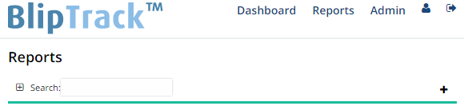
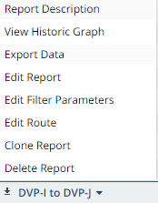
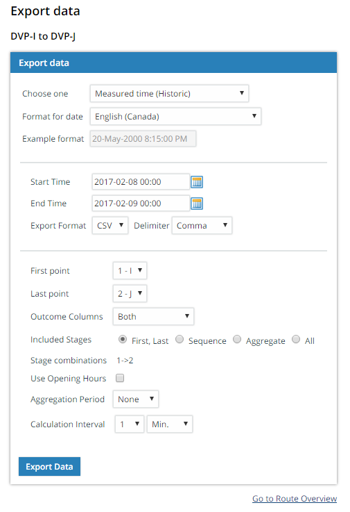
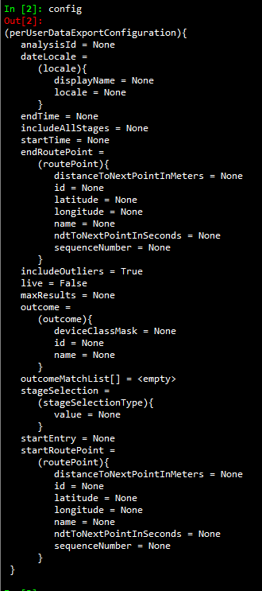

# Bluetooth - Bliptrack

## Table of Contents

- [1. Overview](#1-overview)
- [2. Table Structure](#2-table-structure)
    - [Open Data Tables](#open-data-tables)
        - [Live Feed](#live-feed)
        - [Historical Data](#historical-data)
        - [Geography](#geography)
    - [Internal Tables](#internal-tables)
        - [Observations](#observations)
            - [Filtering devices](#filtering-devices)
        - [all_analyses](#all_analyses)
        - [ClassOfDevice](#classofdevice)
- [3. Technology](#3-technology)
- [4. Bliptrack UI](#4-bliptrack-ui)
    - [Accessing Bliptrack](#accessing-bliptrack)
        - [Terms](#terms)
        - [Downloading travel time data](#downloading-travel-time-data)
        - [Common Issues](#common-issues)
- [5. Bliptrack API](#5-bliptrack-api)
    - [Pulling travel time data](#pulling-travel-time-data)
        - [Under the Hood](#under-the-hood)
        - [The `analysisId`](#the-analysisid)
- [6. Bliptrack API OD Data](#6-bliptrack-api-od-data)
    - [Start-End Data](#start-end-data)
        - [Some notes on `measuredTime` and records](#some-notes-on-measuredtime-and-records)
        - [Dictionary Structure](#dictionary-structure)
    - [Others Data](#others-data)
    - [deviceClass and outlierLevel](#deviceclass-and-outlierlevel)
        - [For the Start-End Data](#for-the-start-end-data)
        - [For the Others Data](#for-the-others-data)
        - [outliersLevel](#outlierslevel)
- [7. Adding New Segments to the Database](#7-adding-new-segments-to-the-database)
- [8. Open Data Releases](#8-open-data-releases)

## 1. Overview

The City collects traffic data from strategically placed sensors at intersections and along highways. These detect Bluetooth MAC addresses of vehicles as they drive by, which are immediately anonymized. When a MAC address is detected at two sensors, the travel time between the two sensors is calculated. These travel times are aggregated up to a median within each 5-minute bin. The archived data (which are not being actively updated) are available on the [Open Data Portal](https://open.toronto.ca/dataset/travel-times-bluetooth/). 

## 2. Table Structure

### Open Data Tables

#### Live Feed

The live feed hasn't been available for a while due to networking issues. ~The feed is an xml for all the route reports configured to be published publically and is updated every five minutes.~

**Field Name**|**Description**|**Example**
:-----:|:-----:|:-----:
resultId|Unique segment identifier representing a route between two point locations|F_G
time|Median five-minute travel time on this segment, in HH:MM:SS format|00:01:45
timeInSeconds|Median five-minute travel time on this segment in seconds|105
speed|Median five-minute travel speed on this segment|109.71
speedUnit|Unit of the value provided in the "speed" field|kph
normalDrivingTime|Baseline travel time (derived from speed limit along route), in seconds|90
count|Total number of vehicles within five-minute sample|23
trafficColor|Suggested segment colour for illustrating traffic conditions|#dd0000
trafficTextColor|Suggested text colour for illustrating traffic conditions|#ffffff
open|Boolean field indicating whether route is currently active|true
updated|Timestamp when this record was updated|2017-02-08T15:40:00-05

#### Historical Data

The historical data is also aggregated to 5-min bins.

**Field Name**|**Description**|**Example**
:-----:|:-----:|-----:
resultId      |Unique segment identifier representing a route between two point locations|F_G
timeInSeconds|Median five-minute travel time on this segment in seconds|105
count|Total number of vehicles within five-minute sample|23
updated|Timestamp representing the end of the 5-min aggregate period|2017-02-08T15:40:00-05

#### Geography

Join this using `resultId` to get the geography of the above data, or get the normal driving time or the length to convert to speed.

**Field Name**|**Description**
:-----:|:-----:
resultId|Unique segment identifier representing a route between two point locations
normalDriv|Baseline travel time (derived from speed limit along route), in seconds
length_m|Length of segment, in metres

### Internal Tables

These tables are created based on data the team accesses from our vendor's API and are not released as OpenData. This documentation is here for team documentation, to give the public a sense of how the OpenData is generated, and to help other teams who might be using this type of data. The `SQL` code to generate these tables can be found in [`sql/create_tables/`](sql/create_tables/).

#### Observations

|Column|Type|Notes|
|------|----|-----|
|id|bigserial| Primary Key |
|user_id|bigint| Hashed unique userID derived from device MAC address |
|analysis_id|integer| Unique ID for Bluetooth route |
|measured_time|integer| Time to complete route, in seconds |
|measured_time_no_filter|integer| Time to complete route, in seconds (no filter applied)|
|startpoint_number|smallint| Unclear on significance, usually 1 |
|startpoint_name|character varying(8)| Identifier for reader at start of segment, if available |
|endpoint_number|smallint| Unclear on significance, usually 2 |
|endpoint_name|character varying(8)| Identifier for reader at end of segment, if available |
|measured_timestamp|timestamp without time zone| Timestamp for detection at start of segment |
|outlier_level|smallint|outliers are represented as >0 |
|cod|bigint| integer representation of 24 bit Bluetooth class |
|device_class|smallint| integer representation of a bitstring `outcome` defined for that particular route |

This table is partitioned by month, so data for any given month is in a table named `observations_YYYYMM`.

##### Filtering devices

Two fields are relevant for this endeavour, both are integer representations of binary. They are aggregations/concatenations of multiple different boolean values (bits).

- **device_class:** "are report/filtering dependent as they are configurable property mappings". These values are defined by particular reports, for example: for OD analyses or for filtering by Bluetooth vs. WiFi, see the [all_analyses](#all_analyses) table below.
- **cod:** Is the integer representation of the [Bluetooth Class of Device property](https://www.question-defense.com/2013/01/12/bluetooth-cod-bluetooth-class-of-deviceclass-of-service-explained). The main filter is that if this value is 0, the device is a WiFi device, else it's a Bluetooth device. There is no way of knowing what kind of device a WiFi device is. See the [`ClassOfDevice`](#classofdevice) table below for more information.

The [`Examples/cod_vs_DeviceClass.ipynb`](Examples/cod_vs_DeviceClass.ipynb) notebook examines the relationship between `cod` and `device_class` for the routes for which `device_class` is configured to filter based on `cod`.

#### all_analyses

The script pulls the route configurations nightly from the Blip server. These are currently being primarily dumped as json records, which makes using some of the elements of the configuration trickier in PostgreSQL

|Column|Type|Notes|
|------|----|-----|
|device_class_set_name|text|Name of the configuration for setting the `device_class` bits, see `outcomes` |
|analysis_id|bigint| One of the unique IDs for this route |
|minimum_point_completed|json| spatial configuration of the gates in the route (some have particular waypoints, or exit gates) |
|outcomes|json| lookup for `deviceClassMask` the value for `device_class` and the `name` of that particular result |
|report_id|bigint|One of the unique IDs for this route|
|report_name|text| |
|route_id|bigint|One of the unique IDs for this route|
|route_name|text| |
|route_points|json| spatial representation of the route |
|pull_data|boolean| (defaults to false) whether the script should pull observations |
`outcomes` are set for different routes for purposes like: filtering BT and WiFi, or tracking Origin Destination points.

#### ClassOfDevice

|Column|Type|Notes|
|------|----|-----|
|cod_hex|bytea| Class of device in hexidecimal|
|cod_binary|bit varying(24)| Class of device in binary|
|device_type|character varying(64)| Major-minor device class description |
|device_example|text| Example of the device|
|confirmed|character varying(10)| Observed example (Y/N) |
|confirmed_example|text| Example of the device |
|major_device_class|text| Primary type of device, e.g.: Computer, Phone, etc... |
|cod|bigint| Integer representation of the `cod_binary`, key in [`observations`](#observations) above|

The Class of Device property helps broadcast the functionality of a given Bluetooth device. It is an aggregation of a number of bits (0,1), hence having a binary representation. This comprises 3 sub-fields (see [this explanation](https://www.question-defense.com/2013/01/12/bluetooth-cod-bluetooth-class-of-deviceclass-of-service-explained)), binary strings are indexed from right to left:

- **Device Functionality (Major Service Class, bits 13-23)**: 11 different boolean values to represent whether the device can be used for positioning, for audio, telephony, etc...
- **Major Device Class (Bits 8-12)**: Primary categories for the device: Miscellaneous, Computer, Phone, LAN/Network Access Point, Peripheral, Imaging,Wearable, Toy, Health, Uncategorized, and Reserved. These are present in the `major_device_class` column.
- **Minor Device Class (Bits 2-7)**: Further device details. These are dependent on the Major Device Class.

[`Examples/class_of_device.ipynb`](Examples/class_of_device.ipynb) explores the distributions of these different device classes between Adelaide, an arterial, and the expressways. The most common `cod` after WiFi (0) is `7995916`, its binary is `011110100000001000001100` which is exactly the example [given here](https://www.question-defense.com/2013/01/12/bluetooth-cod-bluetooth-class-of-deviceclass-of-service-explained): a smartphone.

According to the vendor, commonly accepted filters for cars are:

- Car Audio: major class 00100 and minor class 001000
- Hands Free: major class 00100 and minor class 000100

To get major and minor classes from the cod:

```sql
substring(cod::bit(24) from 17 for 6) as minor_device_class,
substring(cod::bit(24) from 12 for 5) as major_device_class
```

## 3. Technology

The BlipTrack sensors have two directional Bluetooth antennas and an omnidirectional WiFi antenna.

1. Each sensor records the Mac address and a series of observations for each device, with different strengths, as well as Class of Device information for Bluetooth devices ([see above](#ClassOfDevice)).
2. The server hashes Mac addresses to help anonymize data, and then creates an observation record based on pre-defined parameters, e.g.: detection by both antennas for Bluetooth, first-strongest, last-strongest, etc.
3. If a device is deteced by a different sensor, the travel time is calculated between the two sensors **if** a `route` is configured between that pair of sensors. Every five minutes this data is averaged and published on the live feed for configured routes.
4. Every night a historical archive of the disaggregate routes is created, with additional filtering/inclusion of data points done server-side at that time.
5. Every morning the [api pulling script](api) pulls this historical archive and puts it into the team's database.

## 4. Bliptrack UI

### Accessing Bliptrack

- The City of Toronto's Bliptrack webservice can be accessed through the browser by using the IP starting with 172. Your computer needs to be cleared by network security to access that IP address.
- After logging in, the default homepage is the Dashboard which is completely configurable. Some exaples of what can be displayed here are:
  - Maps of sensor locations
  - Travel time distributions for key corridors
  - Detection counts over time

#### Terms

- **Route**: A combination of any two sensors, can be configured at any time by any superuser. Most useful routes have already been created and follow either a letter or numbered convention. Once a route is created, a corresponding `routeId` is generated which can be used in the API
- **Report**: Travel time information for any route, can be configured to a number of different aggregation levels, downloaded as a `.csv` file

#### Downloading travel time data

1. Navigate to the `Reports` window using the bar at the top of the webpage
   
2. Select the route you want to export data for by right clicking on it and navigating to `export data`
   
3. Configure export settings, most important parameters are:
   - Start and End date
   - Outcome columns (Bluetooth, WiFi, Both)
   - Calculation interval
4. Click `Export Data`, download will begin automatically
   

#### Common Issues

- Pulling larges volumes of data can cause the server to time out, pulling more than one month of data at a time is not recommended
- Only aggregated data is available through the browser, the API must be used to acess raw data

## 5. Bliptrack API

Bliptrack hosts an API to provide clients (not the public) authenticated access to their system through the Simple Object Access Protocol (SOAP). For those unfamiliar with SOAP, it is well explained in its [wikipedia](https://en.wikipedia.org/wiki/SOAP) article. Using the API over the browser to pull data has 2 main advantages:

- The ability to pull disaggregate data
- Access to live travel time information

The WSDL file for accessing Bliptrack can be accessed using `https://g4apps.bliptrack.net/ws/bliptrack/ExportWebServiceStateless?wsdl`

### Pulling travel time data

Currently the [`blip_api`](api) script is set to run every night to update the database, and every hour to update the [King Street Transit Pilot internal dashboards](https://github.com/CityofToronto/bdit_king_pilot_dashboard).

The script pulls a day of data for each [analysisID](#the-analysisid) and uploads it into the `bluetooth.raw_data` table. It then runs [`bluetooth.move_raw_data()`](sql\functions\move_raw_data.sql) to move the raw data into partitioned tables, and then aggregate it into 5-minute binned data similar to what is found on the public API.

Two companion scripts send alerts after this script runs:

- [notify_routes.py](api/notify_routes.py) sends an email if new route configurations appear in the database.
- [brokenreaders.py](readersdown/) sends an email if a sensor stopped producing data the previous day.

#### Under the Hood

The `exportPerUserData()` method is used to pull raw data. It takes `username`, `password`, and `config` as input parameters. The `config` object contains all information required to specify the route to pull data from. Info about config is shown below



Not all of these fields must be assigned in order to pull data. At a minimum the following fields must have a non-`None` value:

- `analysisId`: `int`, designates route, more on this below
- `startTime`: `datetime` object indicating first data point
- `endTime`: `datetime` object indicating last possible data point
- `includeOutliers`: `boolean` indicating whether or not to include detections that Bliptrack deems to be outliers
- `live`: `boolean` indicating whether live or historic data is being pulled, should be set to `False` to pull historic data

#### The `analysisId`

Each route has a corresponding `routeId`, `reportId`, and `analysisId` - all of which are different. An `analysis` object contains all of this information. The `getExportableAnalyses()` method will return a list of all analyses available. One can then pass the `analysis.id` for any given `analysis` into `config.analysisId` when pulling data.

## 6. Bliptrack API OD Data

The API pulls a lot of data from BlipTrack, some of which is Origin-Destination (OD) data. OD describes the first and last sensors a device is seen at (Start-End Data), as well as the in-between sensors the device is seen at (Others Data).

### Start-End Data

The Start-End Data describes the trips of each device, with each device being identified with a `userId`. Attributes of interest are `measuredTime`, `measuredTimestamp`, `outlierLevel`, `cod`, `deviceClass`.

#### Some notes on `measuredTime` and records

If a device moves within range of a sensor after having not been seen by a sensor for over 20 minutes, a new record with the same UserID but a different timestamp will be created. If a device has been detected by a sensor for over a period of 90 minutes, its record will be cut off at the 90 minute mark and a new record will not be created for that device until a different sensor picks it up. Based on these two conditions, a device can have multiple records in the data.

Each record is a dictionary, which follows the structure and format as seen in the table below.

#### Dictionary Structure

|**Attribute**|**Type**|**Notes**|
|---------|----|-----|
|userId|bigint| |
|analysisId|integer| |
|measuredTime|integer|Duration (seconds) between when the device was first seen and last seen|
|measuredTimeNoFilter|integer| |
|startPointNumber|smallint| |
|startPointName|string| |
|endPointNumber|smallint| |
|endPointName|string| |
|measuredTimestamp|timestamp string|timestamp of when the device was last detected|
|routeStartTimestamp|string|None|
|outlierLevel|smallint| |
|cod|bigint| integer representation of Bluetooth class |
|deviceClass|numeric|stores bit representation of sensors that the device passed|
|outcome_match|array|empty|

### Others Data

The Others Data is differentiated from the Start-End Data by the `analysisId` that is called, and the data itself differs by the `deviceClass` and the `outlierLevel`. It follows the same structure and format as the Start-End Data.

### deviceClass and outlierLevel

`deviceClass` is a numerical value with 17 to 33 digits. This number, when converted into a bitstring, reflects the sensors ("gates") that the device `userId` has been seen at. The positions of the bits that are set `1` directly correspond to gate values, which are tied to human-friendly descriptions.

Gate values are powers of 2, based on the order of the gates in the lookup list, starting from 0 (e.g. 5th gate value = 2^(5-1)). The value in `deviceClass` is the sum of gates' values that the device has passed. To know which gates were passed, the `deviceClass` can be converted into bits, and the positions of the set bits in the bitstring are also the position of the gates in their lookup list.

To get the gate values from the `deviceClass` value:

1. Convert the `deviceClass` value into bits
2. Reverse the order of the bits
3. Iterate through the bitstring to find the positions of the set bits
4. Take the position of each set bit `p` and calculate the gate value `g`
   - `g = 2^p`

#### For the Start-End Data

`deviceClass` is expected to return 2 values, but can return up to 3: the first value being the start gate, and the second value being the end gate. If there is a third value, it means that the device was detected at only one sensor; the expected two values will point to the same sensor but with different numbers, and the third value will be `324518553658426726783156020576256`, representing `OneSensorOnly`.

#### For the Others Data

`deviceClass` is expected to return at least 2 values, with the last value always representing if the device was `HandsFree` or `Non-HandsFree`. The other values it returns are the gates that the device was seen at, in the order of the lookup list. We cannot tell the order of gates a device is seen by with OD data alone.

If the values of an Others `deviceClass` are calculated, sharing the same `UserId` and timestamp as a Start-End `deviceClass` that was `OneSensorOnly`, then the Others `deviceClass` will only return 2 values, the first being the value of the one sensor that detected the device, and the second still being the value indicating if the device was or was not a handsfree device.

#### outliersLevel

Looking at the `outliersLevel` of the Start-End Data is a quick way to check if a device only passed by one sensor. If the `deviceClass` has the `OneSensorOnly` value, the `outlierLevel` attribute will have a value of `3`. However, the `outlierLevel` of the Others Data of the same record (`userId` and timestamp) will be 0.

## 7. Adding New Segments to the Database

Occasionally, new `analysis_id`s need to be added. The detailed process is described [here](update/README.md)

## 8. Open Data Releases

A full release of 5-min aggregate data is **pending**, the historic archive is available under [Travel Times - Bluetooth](https://open.toronto.ca/dataset/travel-times-bluetooth/) (updated as of March 2017), the SQL code for these is available [here](C:\Users\rdumas\Documents\GitHub\data-sources\bluetooth\sql\move_data\aggr_5min_opendata_views.sql). The real-time feed is currently not operational. Follow [this milestone](https://github.com/CityofToronto/bdit_data-sources/milestone/3) for updates on this release.

For the [King St. Transit Pilot](toronto.ca/kingstreetpilot), the team has released the following two datasets. These data are only for the segments found in the [King St. Transit Pilot – Bluetooth Travel Time Segments](https://open.toronto.ca/dataset/king-st-transit-pilot-bluetooth-travel-time-segments/) map layer, (code to generate [here](sql\analysis\open_data_ksp_segments_gis.sql)):

- [King St. Transit Pilot - Detailed Bluetooth Travel Time](https://open.toronto.ca/dataset/king-st-transit-pilot-detailed-bluetooth-travel-time/) contains travel times collected during the King Street Pilot in the same format as the 5-min data set. [Here](sql\analysis\open_data_ksp_travel_times.sql) is the SQL code producing these data.
- [King St. Transit Pilot – Bluetooth Travel Time Summary](https://open.toronto.ca/dataset/king-st-transit-pilot-bluetooth-travel-time-summary/) contains monthly averages of corridor-level travel times by time periods. [Here](sql\analysis\open_data_ksp_agg_travel_times.sql) is the SQL code producing these summaries.
