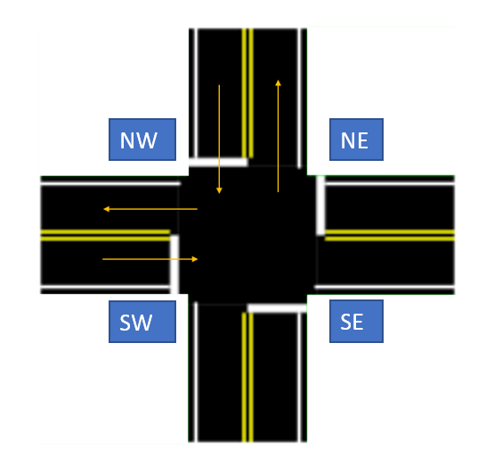
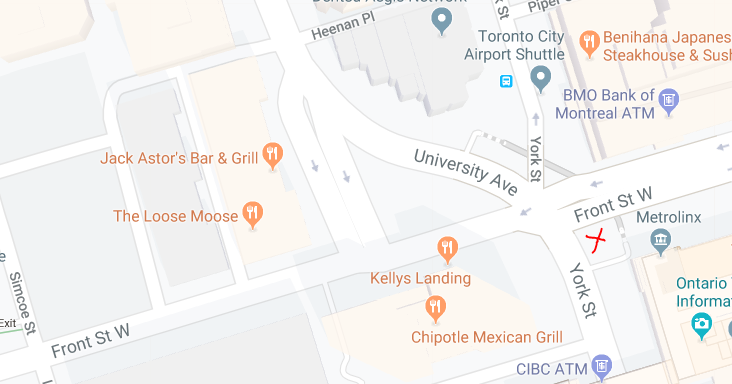
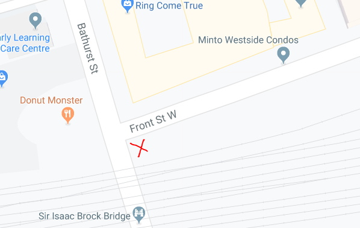

## Would the location of sensors affect the directional bias of bt data?
If we look at the top 10 imbalanced routes from this [full analysis](https://github.com/CityofToronto/bdit_king_pilot_dashboard/blob/gh-pages/bluetooth/bt_data_validation.ipynb),
as shown below, we can see that most of the sensors are located at the SW corner of the intersection. 
The numbering is to associate them with the results found on [comparison of obs and spd for 1 month of data](https://github.com/CityofToronto/bdit_data-sources/blob/blip_data_validation/bluetooth/data_validation/comparison_1month_obs_spd.ipynb) or [comparison of obs and spd for 2 days of data](https://github.com/CityofToronto/bdit_data-sources/blob/blip_data_validation/bluetooth/data_validation/comparison_2days_obs_spd.ipynb) where the summarised version is shown below. The analysis was done to compare the number of observations and median speed of the same route for both BT data and HERE data to find out if there's any directional bias on the BT data.
- `bt_ratio` and `he_ratio` show the ratio of dominant number of observations to the total number of observations in both direction. A `0.703` ratio with the bias being `EB` would mean that 70.3% of the total traffic flow in that street is going EB.  
- `bt_spd` and `he_spd` show the speed difference between EB/WB or NB/SB. The speed difference = EB/NB speed - WB/SB speed. Positive sign indicates traffic travelling in the EB / NB direction is at a higher speed whereas negative sign indicates that traffic travelling in the WB / SB direction is at a higher speed. 

**Comparing 1 month of data:**

|no.|street|interxn_1|interxn_2|bt_ratio|he_ratio|bt_bias|he_bias|bt_spd|he_spd|bt_bias|he_bias|
|---|---|--------|----------|------|-------|------|-------|-------|--------|-----|---------|
|1|Dundas|Dufferin|Bathurst|0.538|0.518|EB|WB|-0.067|-0.056|WB|WB|
|2|Dundas|Bathurst|Spadina|0.567|0.521|EB|WB|-2.734|0.923|WB|EB|
|3|Dundas|Spadina|University|0.624|0.522|EB|WB|3.509|2.946|EB|EB|
|4|Dundas|Jarvis|Parliament|0.672|0.658|EB|EB|1.674|1.946|EB|EB|
|5|King|Spadina|University|0.577|0.502|WB|WB|0.577|0.380|EB|EB|
|6|King|University|Yonge|0.546|0.606|EB|EB|0.183|1.736|EB|EB|
|7|Front|Bathurst|Spadina|0.587|0.549|EB|WB|-6.419|0.423|WB|EB|
|8|Front|Spadina|University|0.703|0.556|EB|EB|1.283|-0.532|EB|WB|
|9|University|Queen|Dundas|0.759|0.529|SB|SB|5.1125|4.276|NB|NB|
|10|University|Dundas|College|-|0.582|-|SB|-|6.404|-|NB|

**Comparing 2 days of data:**

|no.|street|interxn_1|interxn_2|bt_ratio|he_ratio|bt_bias|he_bias|bt_spd|he_spd|bt_bias|he_bias|
|---|---|--------|----------|------|-------|------|-------|-------|--------|-----|---------|
|1|Dundas|Dufferin|Bathurst|0.539|0.505|EB|WB|-1.015|-1.087|WB|WB|
|2|Dundas|Bathurst|Spadina|0.561|0.522|EB|WB|-3.099|-0.531|WB|WB|
|3|Dundas|Spadina|University|0.632|0.517|EB|EB|0.261|1.588|EB|EB|
|4|Dundas|Jarvis|Parliament|0.662|0.681|EB|EB|2.562|1.595|EB|EB|
|5|King|Spadina|University|0.656|0.513|WB|EB|4.566|0.891|EB|EB|
|6|King|University|Yonge|0.541|0.680|EB|EB|3.854|0.881|EB|EB|
|7|Front|Bathurst|Spadina|0.552|0.560|EB|WB|-6.179|1.598|WB|EB|
|8|Front|Spadina|University|0.669|0.589|EB|EB|1.430|0.444|EB|EB|
|9|University|Queen|Dundas|0.736|0.552|SB|SB|4.892|3.391|NB|NB|
|10|University|Dundas|College|-|0.603|-|SB|-|6.697|-|NB|

> For speed, positive sign indicates EB / NB direction whereas negative sign indicates WB / SB direction.

Generally speaking, since there's only one sensor for each intersection tracking traffic flow in all four directions (possible location of sensor shown below), the sensor located at a corner may be inclined to get more results from traffic flow within the range of the antenna which is in a parabolic shape. The sensor may also be installed facing a certain street depending on which route we emphasise more. The particular intersection might also be a cross intersection (four legs) or T-intersection or even has a pork chop island (I'm not making this up). This may also contribute to the directional bias in BT data if there's any. The size of the street may also affect the BT readings.

### Examples

Comparing BT and HERE ratio for route number 8, Front St between Spadina Ave and University Ave as shown below, we can see that the presence of pork chop island and the location of bluetooth sensor (marked as a red cross) might be the reason why BT sensor is detecting more traffic flow in the EB direction. The WB traffic from University Ave into Front St is about 80 metres away from the sensor which may be harder for the sensor to detect. 

Comparing BT and HERE speed difference for route number 7, Front St between Bathurst St and Spadina Avenue as shown below, we can see that the speed difference in BT data is much greater than that of HERE. Looking into the map where we found out that it is a T-intersection rather than a cross intersection, it might be due to the reason that cars are waiting at the intersection to turn into Front St. 

**Therefore,** there is no one-size-fit-all solution to check if there's actually a directional bias in BT data since the results depends on many different factors such as the location of sensor, type of intersection, width of street or even other factors. However, based on the results above, we can decide if further investigation is required for that route or even tell more about the intersection.
