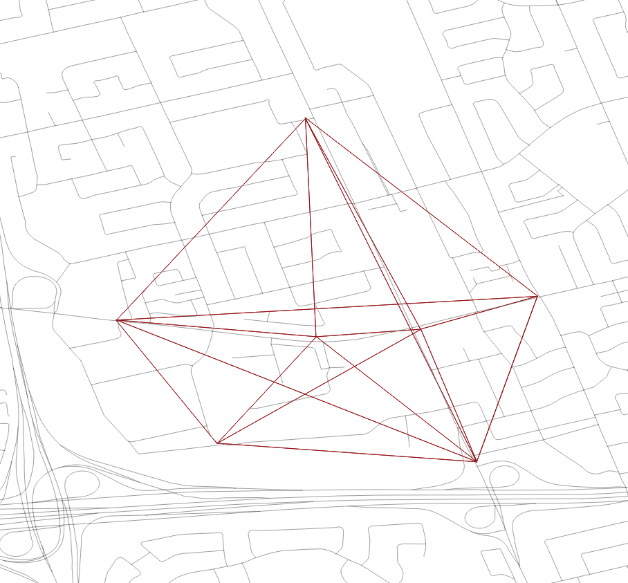
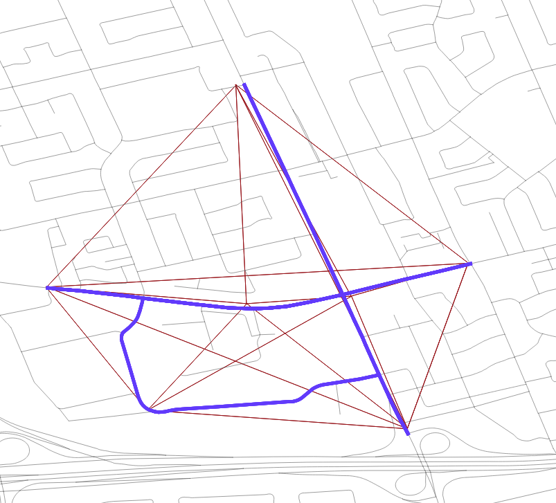

# Updating Bluetooh Segments

## Overview

Ocasionally, new segments need to be added to the `bluetooth` schema. This will go over the setps and the general process of what occurred during September 2018 to add the new routes. 

## Table of Contents

1. [Parsing Data](#parsing-data)
2. [Adding Readers](#adding-readers)
3. [Fuzzy String Matching](#fuzzy-string-matching)
4. [Cleanup, Warnings, and Alternative Methods](#cleanup-warnings-and-alternative-methods)
5. [Making Lines](#making-lines)

## Parsing Data

In this update, there existed a kml/list of all the new reader names and locations and `bluetooth.all_analyses` already had the routes, `analysis_id` and names of the routes. The names followed whatever was in the bliptrack portal, but does not match the naming convention BDIT uses. The following query parses the `report_name` column into columns for `corridor`, `from_intersection`, and `to_intersection`.

```SQL
SELECT analysis_id, split_part(report_name, ' ', 1) AS corridor, report_name
, 
CASE WHEN split_part(report_name,  ' ', array_length(regexp_split_to_array(report_name, ' to '), 1))='Mt' THEN 'Mt Pleasant' ELSE split_part(report_name,  ' ', array_length(regexp_split_to_array(report_name, ' to '), 1)) END AS from_intersection,
split_part(report_name,  ' to ', 2) As to_intersection
--INTO rliu.new_bt_corridors
FROM rliu.new_bt_routes

WHERE split_part(report_name,  ' to ', 2) <> ''
ORDER BY from_intersection
```

## Adding Readers

This update had the lat/long given in the form of a kml file. This data needs to be uploaded to the database. Depending on how many new readers there are, it may be worthwile to develop an automated process in PostgreSQL, but this update was done manually in excel. In addition to the lat/long, the streets where the readers are is also needed in 2 columns, and the segment name. The segment name is always the first two letters of each street, with the corridor street first and the intersecting street second. For example, a reader at Bloor/Christie measuring travel times on Bloor would be named `BL_CH`. 

After uploading data to PostgreSQL, the geometry string is needed. This can be done by adding a column using `ALTER TABLE schema.table_name ADD COLUMN geom GEOMETRY` and then filling in the column with `UPDATE TABLE schema.table_name SET geom = ST_MakePoint(lat, long)`.

## Fuzzy String Matching

The general process was first done to update the speed limits of roads in the centreline table. Please read the [process done for that](https://github.com/CityofToronto/bdit_data-sources/blob/master/gis/PostedSpeedLimitUpdate.md) for more detail. The gist of it is this:

* A straight line is drawn between two readers
* Road segments with similar/exact names to the drawn line is matched to that straight line

### Explanation of Query

```SQL
WITH from_join AS (
SELECT * FROM rliu.new_bt_corridors B
CROSS JOIN rliu.new_bt_readers A
WHERE levenshtein(A.reader_name, B.from_intersection, 1, 1, 2) < 4)
```

Matches the corridors to the names based on similar from intersections.

```SQL
, to_join AS (
SELECT * FROM rliu.new_bt_corridors B
CROSS JOIN rliu.new_bt_readers A
WHERE levenshtein(A.reader_name, B.to_intersection, 1, 1, 2) < 4)
```
Does the same thing for the to_intersections

```SQL
, joined_readers AS (
SELECT A.analysis_id, A.corridor, A.reader_name AS from_intersection, A.long AS from_long, A.lat AS from_lat, B.reader_name AS to_intersection, B.long AS to_long, B.lat AS to_lat FROM from_join A
INNER JOIN to_join B USING (analysis_id)
)
```

Makes a single table for the corridors and readers at the from/to intersections.

```SQL

, make_lines AS (
SELECT analysis_id, 
	corridor, 
	from_intersection, 
	from_long, 
	from_lat, 
	to_intersection, 
	to_long, 
	to_lat,
	ST_MakeLine(ST_MakePoint(from_long, from_lat), ST_MakePoint(to_long, to_lat)) AS line,
	ST_LENGTH(ST_MakeLine(ST_MakePoint(from_long, from_lat), ST_MakePoint(to_long, to_lat))) AS length 
FROM 	joined_readers
--Since there are two readers named Sheppard, this is a check to stop it from matching to the wrong reader
WHERE  ST_LENGTH(ST_MakeLine(ST_MakePoint(from_long, from_lat), ST_MakePoint(to_long, to_lat)))<0.1
ORDER BY from_intersection
)
```
Draws lines using the reader locations. This is the result.



```SQL
, coflation AS (
SELECT analysis_id, 
	corridor, 
	from_intersection, 
	from_long, 
	from_lat, 
	to_intersection, 
	to_long, 
	to_lat, s.geom, geo_id, s.lf_name, 
	ST_Length(st_intersection(ST_BUFFER(ST_Transform(ST_SetSRID(line, 4326), 32190), 1.5*b.length, 'endcap=flat join=round') , ST_Transform(s.geom, 32190))) /ST_Length(ST_Transform(s.geom, 32190))
	
	FROM make_lines b

INNER JOIN rliu.bt_centreline s 
ON 
ST_DWithin( ST_Transform(s.geom, 32190) ,  ST_BUFFER(ST_Transform(ST_SetSRID(line, 4326), 32190), 3*b.length, 'endcap=flat join=round') , 1000)


--AND ST_Length(st_intersection(ST_BUFFER(ST_Transform(ST_SetSRID(line, 4326), 32190), 1.5*b.length, 'endcap=flat join=round') , ST_Transform(s.geom, 32190))) /ST_Length(ST_Transform(s.geom, 32190)) > 0.4
)

SELECT * 
INTO rliu.new_bt_coflate1000 
FROM coflation
```
Matches the centreline road segment to the drawn lines. Note the buffer is really large (1000 units) to account for segments that run accross multiple roads.

After proper QC (see next section) is applied, it should something like this.



## Cleanup, Warnings, and Alternative Methods

This method works really well for straight roads/segments. However, this is especially challenging for segments that are perpendicular, involves curves, or weird geometries/routes. 

A lot of mannual cleanup was required to delete extraneous roads, or add roads to the route, mainly through the `UPDATE` and `DELETE` clauses and using the `geo_ids` from the centreline table.

An alternative method is drawing routes in QGIS connecting the readers on the centreline layer. This may be faster for low number of segments (ex <500).

## Making Lines

At this point, the layer has multiple entries containing centreline segments for each analysis_id. Instead, we need a single line/entry for each analysis_id. This query concatenates the individual centreline segments into one line. The main function doing this work is ST_LineMerge()

```SQL
SELECT A.analysis_id, A.corridor, A.from_intersection,A.from_long, A.from_lat, A.to_intersection, A.to_long, A.to_lat,  A.geo_id,  A.lf_name, (ST_Dump(A.geom)).geom AS geom 
INTO rliu.new_bt_segments
from (SELECT ST_LineMerge(ST_Union(A.geom)) AS geom, A.analysis_id, A.corridor,A.from_intersection, A.from_long, A.from_lat, A.to_intersection, A.to_long, A.to_lat, array_agg(DISTINCT A.geo_id) AS geo_id, array_agg(DISTINCT A.lf_name) AS lf_name FROM new_bt_coflate300 A
GROUP BY A.analysis_id, A.corridor, A.from_intersection, A.from_long, A.from_lat, A.to_intersection, A.to_long, A.to_lat ORDER BY analysis_id) A
```
After this, the only step is to format the table so it matches `bluetooth.segments`.
