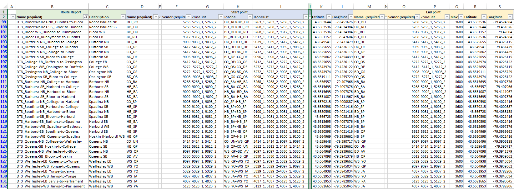
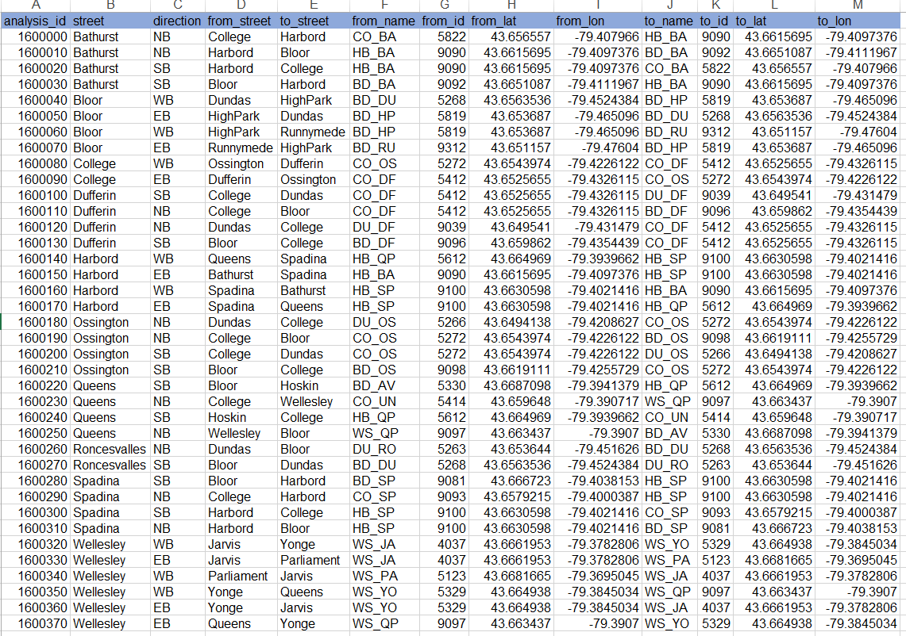
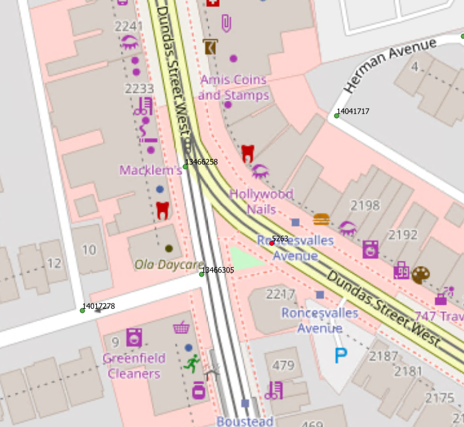
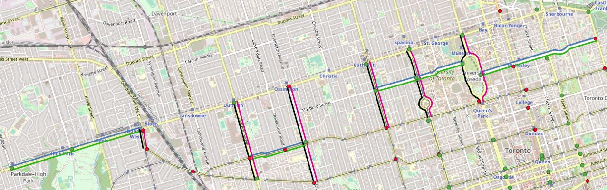

# Updating Bluetooth Segments

## Overview

Ocasionally, new segments need to be added to the `bluetooth` schema. This document will go over the steps and the general process to add new routes along the newly installed bluetooth reader locations. It assumes that `bluetooth.all_analyses` table does not have rows already created for the proposed new routes. The steps listed here are followed to create an entirely new routes for newly installed bluetooth readers in the city.

## Table of Contents

- [Updating Bluetooth Segments](#updating-bluetooth-segments)
	- [Overview](#overview)
	- [Table of Contents](#table-of-contents)
	- [Data Updating](#data-updating)
	- [Adding Readers](#adding-readers)
	- [Preparatory Tables and Steps](#preparatory-tables-and-steps)
	- [Finding Nearest Intersection IDs](#finding-nearest-intersection-ids)
	- [Using pg_routing](#using-pg_routing)
	- [Things to note](#things-to-note)
	- [Validating Output](#validating-output)

## Data Updating

In this update, there exists an Excel Sheet template that contains details of newly added bluetooth detectors. The details include proposed routes `Name`, `Description`, intersection name as `Name` (according to BDIT convention), four digit bluetooth sensor identification number  as `Sensor` and `latitude/longitude` at start point and the end points along with numerous other fields. Below is the template screenshot. 



This template was used to include all the details of the routes that can be useful for future analysis. The routes that were updated by adding this batch of new detectors were named with a prefix "DT3_" . 

## Adding Readers

New readers were added manually in the Excel template and saved as .csv file. In addition to the lat/lon, the street names at each intersection where the readers are located is also needed in two columns for each route as the `from_street` and `to_street`. The `Description` field contains this information. For each proposed route, the excel sheet is populated and assigned a unique `analysis_id`. For this batch of new readers, analysis id starting from 1600000 with increment of 10 were added. 

Therefore the new reader table had the following fields populated: 

`analysis_id` 		- Unique ID for each route
`street` 			- Name of the street along the route
`direction` 		- Route direction(East bound, West Bound, North Bound or South Bound)
`from_street` 		- Name of the intersecting street where the route begins.
`to_street`			- Name of the intersecting street where the route ends 
`from_name`			- The reader name (bdit convention) at the start point of the route
`from_id` 			- The four digit Unique bluetooth id at the start point
`from_lat` 			- Latitude at the start point of the route
`from_lon` 			- Longitude at the start point of the route
`to_name` 			- The reader name (bdit convention) at the end point of the route
`to_id`				- The four digit Unique bluetooth id at the end point
`to_lat`			- Latitude at the end point of the route
`to_lon`			- Longitude at the end point of the route
`length`			- Length of the route in metres 

Below is the table screenshot. 



## Preparatory Tables and Steps
The following steps are utilized to create segments
1. Get start and end geom for each analysis_id using the provided lat and lon 
2. Create table with detector_id, detector_geom, centreline_int_id
3. Join the detector's geometry to the closest centreline intersection
4. Route the segments using centreline's intersection with the base network of `gis.centreline_both_dir` using [pgr_dijkstra].


This .csv file was then imported into our postgresql database. The geometry column was created by adding a column using 
```sql
ALTER TABLE mohan.new_added_detectors ADD COLUMN from_geom GEOMETRY;
ALTER TABLE mohan.new_added_detectors ADD COLUMN to_geom GEOMETRY;
```
Then create the geometry using lon and lat
```sql
UPDATE mohan.new_added_detectors 
SET to_geom = ST_SetSRID(ST_MakePoint(to_lon, to_lat), 4326)
SET from_geom = ST_SetSRID(ST_MakePoint(from_lon, from_lat), 4326)
```

## Finding Nearest Intersection IDs

To get the intersection ids that are the closest to the newly added detectors location, create a table named `bluetooth_nodes`. This table has four fields:
`bluetooth_id`, `geom` (geometry of bluetooth detectors), `int_id` (nearest intersection id) and `int_geom` (geometry of the nearest intersection to the bluetooth detector)

This table is created using the following query:
```SQL
CREATE TABLE mohan.bluetooth_nodes AS(
SELECT DISTINCT mohan.new_added_detectors.from_id::integer AS bluetooth_id,
    			mohan.new_added_detectors.from_geom,
    			nodes.int_id,
    			st_transform(nodes.node_geom, 4326) AS int_geom
   	FROM 		mohan.new_added_detectors
 	CROSS JOIN LATERAL (SELECT 		z.int_id,
            						st_transform(z.geom, 98012) AS node_geom
           				FROM 		gis.centreline_intersection z
          				ORDER BY 	(z.geom <-> mohan.new_added_detectors.from_geom)
         				LIMIT 1) nodes);
```
Check that correct intersections are returned from this query especially for oblique intersections with an offset. If required, correct the intersection_id and geom for such intersections and finalize the table `mohan.bluetooth_nodes`. An example is shown below. The intersection between Dundas St W, Roncesvalles Ave and Boustead Ave is oblique with an offset. The BT reader 5263 (red dot) picked up intersection_id `13466305` (greed dot) as nearest intersection to the reader. But the planned route does not go through this intersection_id. The correct intersection_id for this reader is `13466258`. The intersection_id and geom for this reader was therefore corrected manually.  
 



## Using pg_routing
Once the nearest centreline intersection nodes are linked to the bluetooth readers geom in `mohan.bluetooth_nodes`, we are ready to run the following Query to create new routes by routing. 

```SQL
CREATE table mohan.bt_segments_new AS (
WITH lookup AS (
	SELECT 		analysis_id, 
				from_id, 
				origin.int_id AS source, 
				to_id, 
				dest.int_id AS target
	FROM 		mohan.new_added_detectors 
	INNER JOIN 	mohan.bluetooth_nodes origin ON from_id = origin.bluetooth_id 
	INNER JOIN 	mohan.bluetooth_nodes dest ON to_id = dest.bluetooth_id)

, results AS (
	SELECT * 
	FROM lookup
	CROSS JOIN LATERAL pgr_dijkstra('SELECT id, source, target, cost FROM gis.centreline_routing_directional inner join gis.centreline on geo_id = id
where fcode != 207001', source::int, target::int, TRUE))

, lines as (
	SELECT 		analysis_id, 
				street, 
				direction, 
				from_street, 
				to_street, 
				edge AS geo_id, 
				geom 
	FROM 		results			 
	INNER JOIN 	gis.centreline ON edge=geo_id
	INNER JOIN 	mohan.new_added_detectors USING (analysis_id)
	ORDER BY 	analysis_id)

SELECT analysis_id, street, direction, from_street, to_street,
	CASE WHEN geom_dir != direction THEN ST_reverse(geom) 
	ELSE geom 
	END AS geom, 
	length
FROM ( 
SELECT analysis_id, street, direction, from_street, to_street, 
		gis.twochar_direction(gis.direction_from_line(ST_linemerge(ST_union(geom)))) AS geom_dir,
		ST_linemerge(ST_union(geom)) AS geom, 
		ST_length(ST_transform(ST_linemerge(ST_union(geom)), 2952)) AS length
FROM lines
GROUP BY analysis_id, street, direction, from_street, to_street) a)
```



## Things to note 
A number of centreline need to be excluded during routing, for example: Geostatistical lines and planning boundaries. Those can be filtered using the following where clause: 
```sql
WHERE fcode_desc IN ('Collector','Collector Ramp','Expressway','Expressway Ramp',
'Local','Major Arterial','Major Arterial Ramp','Minor Arterial',
'Minor Arterial Ramp','Pending')
``` 

## Validating Output
Validate the length of the segments with length `ST_length(geom)` and direction using `gis.direction_from_line(geom)` functions. If the detectors are located very close to the centerline intersections, it is not necessary to do the centreline cutting. If any bluetooth detectors are not located at the start or end point of a centreline, we will need to cut the centreline using `ST_linesubstring()` as explained in [here.](https://github.com/CityofToronto/bdit_data-sources/issues/234).  

Steps to cut centreline using `ST_linesubstring()`:
1) Find the closest point of the detector on the centreline with [ST_closespoint()](https://postgis.net/docs/ST_ClosestPoint.html).   
```sql
ST_closestpoint(detector_geom, centreline_geom)
```
2) Return the location of the point relative to the centreline using [`ST_linelocatepoint()`](https://postgis.net/docs/ST_LineLocatePoint.html)
```sql
ST_linelocatepoint(geom, closest_point_geom)
```
3) Cut the line using [`ST_linesubstring()`](https://postgis.net/docs/ST_LineSubstring.html) 
```sql
ST_linesubstring(geom, 0, st_linelocatepoint)
```

The new routes table is now ready to append to the existing routes table.  

[pgr_dijkstra]:https://docs.pgrouting.org/latest/en/pgr_dijkstra.html