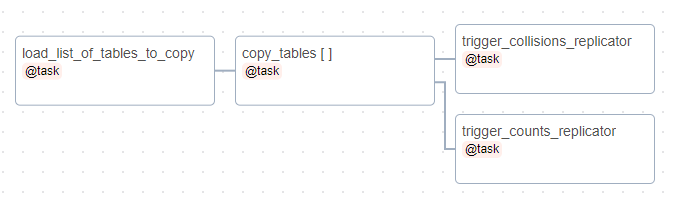
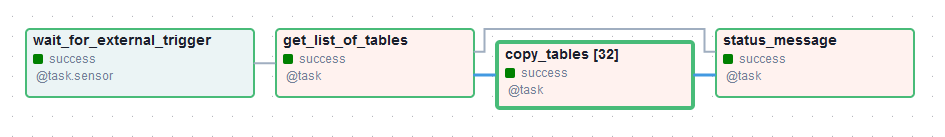
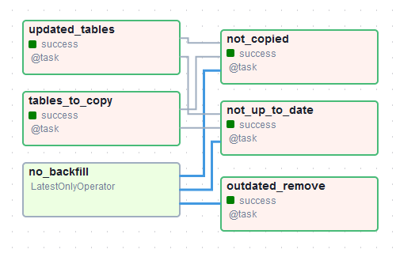

# Collisions

The collisions dataset consists of data on individuals involved in traffic collisions from approximately 1985 to the present day as reported by Toronto Police Services (TPS) or Collision Reporting Centres (CRC). Most of the information in this document pertains to collision data stored in the `bigdata` postgres database.


## Overview of the Sources of the Collision Dataset

The collision data comes from the Toronto Police Services (TPS) Versadex and the Collision Reporting Centre (CRC) database, and is combined by a Data Collections team in Transportation Services Policy & Innovation, currently led by David McElroy.

Data are transferred to a Transportation Services file server from TPS on a weekly basis, as a set of XML files, and from the CRC on a monthly basis as a single CSV file. A set of scripts read in these raw data into the Transportation Services Oracle database table. This table is manually validated by Data Collections, and edits are made using legacy software from the 1990s.

The collisions table is copied from Oracle into the MOVE postgres data platform (`flashcrow`) and the `bigdata` postgres data platform on a daily basis.


## Table Structure on the `bigdata` Postgres Database

The `collisions` schema houses raw and derived collision data tables. The `collision_factors` schema houses tables to convert raw Motor Vehicle Accident (MVA) report codes to human-readable categories (discussed further below). Both are owned by `collision_admins`.

### Collisions Schema (Events and Involved Tables)

There are four tables that are replicated daily from Flashcrow database:

- `collisions.acc`: It is a true copy of the same table in Flashcrow database. It contains the raw collision data retrieved from the raw XML and CSV files. **This table is not accessible and should not be used except by the collisions core dataset admins**.
- `collisions.events`: It is originally a materialized view in Flashcrow derived from `collisions.acc`. It contains all collision event-level data for collisions between 1985-01-01 and present. Columns have proper data types and the categorical columns contain text descriptions rather than numerical codes. The `events` table contains one row per collision event.
- `collisions.involved`:  It is originally a materialized view in Flashcrow derived from `collisions.acc`. It contains all collision data for individuals involved in collisions from 1985-01-01 to the present, with data type and categorical variable refinements similar to `collisions.events`. The `involved` table contains one row per involved person in each collision.
- `collisions.events_centreline`: It contains a mapping between events and centrelines (based on 20m conflation).

A list of fields and definitions for the above tables can be found [here](https://docs.google.com/spreadsheets/d/151FfLDlwswlALmcQkAHR2bY4ywhmOfSgER3JRXeHo4U/edit#gid=0).


### Important Limitations and Caveats About `collisions.acc` 

Even though `collisions.acc` should not be directly queried (has that been mentioned yet?) this information may be useful if you're trying to solve a collision data mystery:
- Each row represents one individual involved in a collision, so some data is repeated between rows. The data dictionary indicates which values are at the **event** level, and which at the individual **involved** level.
- `ACCNB` is not a UID. It kind of serves as one starting in 2013, but prior to that the number would reset annually, and even now, the TPS-derived `ACCNB`s might repeat every decade. Derived tables use `collision_no`, as defined in `collisions.collision_no`. You could use `REC_ID` if you want an "involved persons" level ID.
- `ACCNB` is generated from TPS and CRC counterparts when data is loaded into the Oracle database. It can only be 10 characters long (by antiquated convention). 
  - TPS GO numbers, with format `GO-{YEAR_REPORTED}{NUMBER}`, (example: `GO-2021267847`) are converted into `ACCNB` by:
      - extracting `{NUMBER}`, 
      - zero-padding it to 9 digits (by adding zeros before the `{NUMBER}`), and 
      - adding the last digit of the year as the first digit (and that's how `GO-2021267847` becomes `1000267847`). 
  - CRC collision numbers are recycled annually, with convention dictating that the first CRC number be `8000000` (then the next `8000001`, etc.). To convert these to `ACCNB`s: 
      - take the last two digits of the year and 
      - add the 'year' digits as the first two digits of the `ACCNB` (so `8000285` reported in 2019 becomes `198000285`). 
  - The length of each `ACCNB` is used to determine the source of the data for the `data_source` column in `collisions.events` (since TPS `ACCNB`s have 10 digits while CRC `ACCNB`s have nine).
  - To keep the dataset current, particularly for fatal collisions, Data Collections will occasionally manually enter collisions using information directly obtained from TPS, or from public media. These entries may not follow `ACCNB` naming conventions. When formal data is transferred from TPS, they are manually merged with these human-generated entries.
- The date the collision was reported is not included in `acc`.
- Some rows are derived from other rows by the Data & Analytics team; for example `LOCCOORD` is a simplified version of `ACCLOC`.
- Categorical data is coded using numbers. These numbers come from the Motor Vehicle Accident (MVA) reporting scheme.
- Categorical data codes are stored in the `collision_factors` schema as tables. Each table name corresponds to the categorical column in `collisions.acc`. These are joined against `collisions.acc` to produce the derived materialized views.
- Some columns, such as the TPS officer badge number, are not included due to privacy concerns. The most egregious of these are only available in the original Oracle database, and have already been removed in the MOVE server data.
- TPS and CRC send collision records once they are reported and entered into their respective databases, which often leads to collisions being reported months, or even years, after they occurred. 
- TPS and CRC will also send changes to existing collision records (using the same XML/CSV pipeline described above) to correct data entry errors or update the health status of an injured individual. 
- Moreover, staff at Data & Analytics are constantly validating collision records, writing these changes directly to the Oracle database. Therefore, one **cannot compare** historical control totals on eg. the number of individuals involved with recently-generated ones.
- Speaking of validating collision records... a value of `1` or `-1` (anything other than `0`) in `acc.CHANGED` means that a record has been changed. Records may be updated multiple times. 


## The Daily Collision Replicator

All collision tables are copies of other tables, materialized views, and views in Flashcrow. They are replicated daily from Flashcrow into the `move_staging` schema in BigData by the DAG `bigdata_replicator`, which is maintained by MOVE team. The below figure shows the structure of this DAG as it reads the list of replicated tables from an Airflow variable, copies each table into `move_staging` schema, and trigger another DAG maintained by the Data Operations team.



The downstream replicator DAG that is maintained by the Data Operations team is called `collisions_replicator` and is generated dynamically by [`replicator.py`](../dags/replicator.py) via the Airflow variable `replicators`. It is only triggered by the upstream MOVE replicator using Airflow REST APIs. The `collisions_replicator` DAG reads the list of replicated tables from the Airflow variable `collisions_tables`, which contains pairs of source and destination tables. It usually copies tables from `move_staging` to either `collisions` or `collisions_factors`. Each of the tables loaded from `collisions_tables` is then copied to its final destination by the Airflow task `copy_table`, which is implemented as one of the [common Airflow tasks](../dags/common_tasks.py). The `status_message` task sends either a "success" message, or lists out all the failures from the `copy_table` tasks. 



<!-- replicator_table_check_doc_md -->
The [`replicator_table_check`](../dags/replicator_table_check.py) DAG keeps track of tables being replicated by MOVE replicator vs those by Bigdata replicators and sends Slack notifications when any issues are identified. This helps keep the MOVE/Bigdata replicator variables up to date with each other. Note: this one DAG covers tables included in both `collisions_replicator` and `traffic_replicator`. 
- `wait_for_external_trigger`: triggered manually by MOVE replicator via REST API.
- `updated_tables`: identifies up to date tables in Bigdata `move_staging` via table comments like `Last updated on {ds}`. 
- `tables_to_copy`: identifies tables staged for copying via Airflow variables (`collisions_tables` and `traffic_tables`).
- `not_copied`: identifies up to date tables which are not being copied. 
- `not_up_to_date`: identifies **not** up to date tables which are being copied. 
- `outdated_remove`: identifies out of date tables in `move_staging` which should be deleted.
<!-- replicator_table_check_doc_md -->



### Replicating New Tables

If a new table or view needs to be replicated from MOVE, MOVE team should update their DAG first and replicate the new table/view into the Bigdata `move_staging` schema. Then, in Bigdata, you should create the new table in the appropriate schema to match the table definition in `move_staging` and then update the `collisions_tables` Airflow variable with the source and destination schema and table names. For instance, if you want to replicate table `collisions_a` from `move_staging` into the `collisions` schema and rename it to just `a`, you should add the following entry to the `collisions_tables` variable:

```JSON
[
    "move_staging.collisions_a",
    "collisions.a"
]
```

Then you will need to add appropriate permissions for the bot: 
```
GRANT SELECT ON TABLE move_staging.collisions_a TO collisions_bot;
--the bot needs to own the downstream table in order to update the table comment
ALTER TABLE collisions.a OWNER TO collisions_bot;
```

### Updating Existing Tables

If you need to update an existing table to match any new modifications introduced by the MOVE team, e.g., dropping columns or changing column types, you should update the replicated table definition according to these changes. If the updated table has dependencies, you need to save and drop them to apply the new changes and then update these dependencies and re-create them again. The [`public.deps_save_and_drop_dependencies_dryrun`](https://github.com/CityofToronto/bdit_pgutils/blob/master/create-function-deps_save_and_drop_dependencies_dryrun.sql) and `public.deps_restore_dependencies` functions might help updating the dependencies in complex cases. Finally, if there is any changes in the table's name or schema, you should also update the `collisions_tables` variable.
