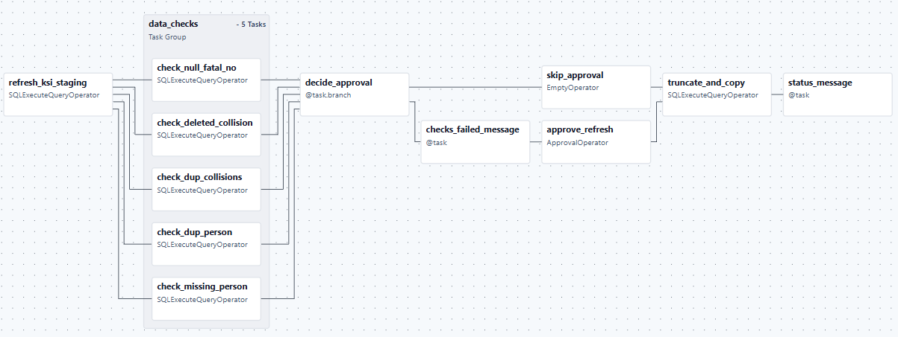

# KSI Open Data Refresh Process

We publish KSI data (Killed or Seriously Injuried) to Open Data (add link) on a daily basis. The process includes refreshing the dataset, applying data checks, and ping for human decision when needed. When any data checks fails, an alert will be send to slack and refresh will pause until a human can verify that the discrepancy is either expected or fixed. This dataset only includes data from 2006 to present.

## Published Columns

| Column | Type | Description |
|------|------|-------------|
| uid | integer | Unique record identifier (primary key) |
| collision_id | text | Collision identifier |
| accdate | timestamp | Date and time of the collision |
| stname1 | text | Primary street name |
| stname2 | text | Secondary street name |
| stname3 | text | Tertiary street name | 
| per_inv | integer | Number of persons involved |
| acclass | text | Collision classification |
| accloc | text | Collision location |
| traffictl | text | Traffic control type |
| impactype | text | Initial Impact type |
| visible | text | Environment conditions |
| light | text | Light conditions |
| rdsfcond | text | Road surface condition |
| changed | smallint | Indicator if record was verified |
| road_class | text | Road classification |
| failtorem | boolean | Failure to remain at scene |
| longitude | double precision | Longitude|
| latitude | double precision | Latitude |
| veh_no | smallint | Vehicle number |
| vehtype | text | Vehicle type |
| initdir | text | Initial direction of travel |
| per_no | smallint | Age of Involved Party |
| invage | smallint | Involved person age |
| injury | text | Severity of Injury |
| safequip | text | Safety equipment used |
| drivact | text | 	Apparent Driver Action |
| drivcond | text | Driver condition |
| pedact | text | Pedestrian action |
| pedcond | text | Pedestrian condition |
| manoeuver | text | Vehicle manoeuver |
| pedtype | text | Pedestrian type |
| cyclistype | text | Cyclist type |
| cycact | text | Cyclist action |
| cyccond | text | Cyclist condition |
| road_user | text | Road user classification |
| fatal_no | smallint | Fatal number of the year |
| wardname | text | Ward name |
| division | varchar | Police division |
| neighbourhood | text | Neighbourhood name |
| aggressive | boolean | Aggressive driving involved |
| distracted | boolean | Distracted driving involved |
| city_damage | boolean | City property damage involved |
| cyclist | boolean | Cyclist involved |
| motorcyclist | boolean | Motorcyclist involved |
| other_micromobility | boolean | Other micromobility involved |
| older_adult | boolean | Older adult involved |
| pedestrian | boolean | Pedestrian involved |
| red_light | boolean | Red light running involved |
| school_child | boolean | School child involved |
| heavy_truck | boolean | Heavy truck involved |

## Data checks in place

1. Checks for NULL `fatal_no` for fatalities

2. Checks for deleted collisions from previous day

3. Checks for deleted collisions and person pair from previous day

4. Checks for duplicated collision records

All these check might be valid changes that got carried through from verification processes. When check fails, an alert will be send to slack for humans to confirm that these discrepancy is intended, then with `human in the loop` operators, users with permission can approve the pipeline to continue with refreshes and updates.

## Pipeline

