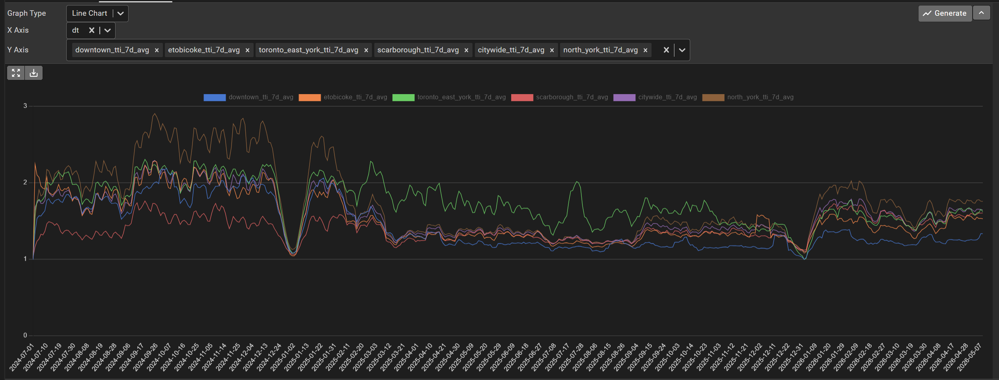

- [`here_agg` Tables](#here_agg-tables)
    - [`here_agg.raw_segments` (partitioned table)](#here_aggraw_segments-partitioned-table)
    - [`here_agg.hourly_avg_tt` (table)](#here_agghourly_avg_tt-table)
    - [`here_agg.segment_6month_lookback` (table)](#here_aggsegment_6month_lookback-table)
    - [`here_agg.area_tti` (table)](#here_aggarea_tti-table)
    - [`here_agg.segments_bootstrap_weekly` (table)](#here_aggsegments_bootstrap_weekly-table)
    - [`here_agg.segments_bootstrap_monthly` (table)](#here_aggsegments_bootstrap_monthly-table)
  - [Sample Queries:](#sample-queries)
    - [Explore TTI Trends](#explore-tti-trends)
    - [Examine Segments Making up an Area](#examine-segments-making-up-an-area)


# `here_agg` Tables

### `here_agg.raw_segments` (partitioned table)
This table stores raw dynamic bin observations for segments on the congestion network. It is populated each day by `here_dynamic_binning_agg_hm`. This data is still quite disaggregate and unlikely to be used much. The function `here_agg.segment_bootstrap` could be used to aggregate this data to different time/date ranges (in addition to those already calculated in `segments_bootstrap_weekly` and `segments_bootstrap_monthly`).

Approx row count:          657,039,200
| Column Name   | Data Type                   | Sample                                     | Comments                                                                                                                                                                                                  |
|---------------|-----------------------------|--------------------------------------------|-----------------------------------------------------------------------------------------------------------------------------------------------------------------------------------------------------------|
| segment_id    | integer                     | 2                                          |                                                                                                                                                                                                           |
| dt            | date                        | 2023-12-13                                 | The date of aggregation for the record. Records may not overlap dates.                                                                                                                                    |
| bin_start     | timestamp without time zone | 2023-12-13 05:15:00                        | The start of the observation. It is recommended to use `hr` to group the bin instead. This column is used in the primary key, although the main constraint occurs during insert (non overlapping ranges). |
| bin_range     | tsrange                     | [2023-12-13 05:15:00, 2023-12-13 05:20:00) | Bin range. An exclusion constraint on a temp table prevents overlapping ranges during insert.                                                                                                             |
| tt            | real                        | 20.63033                                   | Travel time in seconds.                                                                                                                                                                                   |
| num_obs       | real                        | 1.0                                        | The vehicle-distance travelled (using sample_size from here.ta_path) divided by the segment length, for the approximate number of vehicles travelling the segment.                                        |
| hr            | smallint                    | 5                                          | The hour the majority of the record occured in. Ties are rounded up.                                                                                                                                      |

### `here_agg.hourly_avg_tt` (table)
This table stores the hourly average travel time, calculated from `here_agg.raw_segments`. It is used to calculate the TTI for each hour in `here_agg.area_tti_agg`. It is populated by the function `here_agg.hourly_avg_tt_agg`. 

Approx row count:           73,837,100
| Column Name   | Data Type        | Sample             | Comments   |
|---------------|------------------|--------------------|------------|
| segment_id    | integer          | 1231               |            |
| dt            | date             | 2024-12-01         |            |
| hr            | smallint         | 1                  |            |
| avg_tt        | double precision | 38.9365 | A simple average of travel times on that dt/hr.  |


### `here_agg.segment_6month_lookback` (table)
This table stores the 6 month lookback stats for the congestion network calculated from `here_agg.raw_segments`. 6 month lookback vehicle km travelled (VKT) and overnight average travel times are used in the calculation of the TTI. VKT is used to weight each segment as part of the area calculations, and overnight average speeds are used as the baseline for which to compare daily average speeds. This table is populated by the function `here_agg.agg_segment_6month_lookback`. 

Approx row count:              111,000
| Column Name              | Data Type   | Sample     | Comments   |
|--------------------------|-------------|------------|------------|
| segment_id               | integer     | 2          |            |
| mnth                     | date        | 2024-07-01 | The month for which the 6 month lookback applies. January 2026 = July 2025 to December 2025 |
| ver_id        | text                        | 24_4                | The map version effective in `mnth`. Note the lookback data could be on a different map version |
| overnight_avg_tt         | real        | 43.32359   | 6 month lookback avg overnight<sup>1</sup> TT calculated from `here_agg.raw_segments` (dynamic binned) data. |
| vkt_km   | double precision                      | 26593.41                | 6 month lookback VKT calculated from `here_agg.raw_segments` (dynamic binned) data. Calculated as number of obs * segment length in km. |
| sqrt_vkt_km   | double precision                      | 5616249.350                | Another option for weighting segments. Not currently used in TTI calculation.          |

<sup>1</sup> overnight definition: `WHEN dt < '2024-01-01' THEN hr BETWEEN 0 AND 3, WHEN dt >= '2024-01-01' THEN hr BETWEEN 1 AND 4`

### `here_agg.area_tti` (table)
This table stores the daily-hourly TTI for different areas & road categories. The table is populated by the function `here_agg.area_tti_agg`. 

Approx row count:              278,000
| Column Name   | Data Type        | Sample             | Comments   |
|---------------|------------------|--------------------|------------|
| area_name     | text             | Citywide           | "Citywide", "Downtown", and the four community councils: "Etobicoke York Community Council", "North York Community Council",  Scarborough Community Council", "Toronto and East York Community Council" |
| dt            | date             | 2024-07-01         |            |
| hr            | smallint         | 0                  |            |
| tti           | double precision | 1.081 | avg_hourly_tt / overnight_avg_tt, weighted by segment vkt  |
| num_segments  | integer          | 4777               | Number of segments used for TTI calculation |
| road_category | text             | Non-Highway        | Highway / Non-Highway / All |


### `here_agg.segments_bootstrap_weekly` (table)

Weekly-period based travel time stats by segment, with confidence intervals calculated through bootstrapping method. See `here_agg.segment_bootstrap` for bootstrapping methodology.
Weekly data is aggregated at the time period level instead of hourly to accomodate the lower sample size (as little as two weekend days, or one to five weekdays depending on holiday exceptions).

Approx row count:                11,572,700
| Column Name        | Data Type   | Sample                                                     | Comments   |
|--------------------|-------------|------------------------------------------------------------|------------|
| segment_id         | bigint      | 2                                                          |            |
| dow_group          | text        | Mon-Fri                                                    | "Mon-Fri" / "Tue-Thu" / "Weekend/Holiday" |
| week_start         | date        | 2025-12-20                                                 | Weeks start on Saturday to enable quicker turnaround time for weekday data (published following Monday) |
| holiday_exceptions | date[]      | ['2025-12-25', '2025-12-26'] | The holidays either included (for `dow_group = 'Weekend/Holiday'`) or excluded (for `dow_group != 'Weekend/Holiday'`) |
| hr_start           | smallint    | 0                                                          | Start hour of group, inclusive of that hour. With `hr_end`, breaks are: 0-7, 7-10, 10-15, 15-19, 19-24. |
| hr_end             | smallint    | 7                                                          | End hour of group, exclusive of that hour. |
| avg_tt             | real        | 50.12379                                                   | Average TT |
| avg_ci_lower       | real        | 44.516693                                                  | 2.5th percentile CI for avg_tt |
| avg_ci_upper       | real        | 56.27924                                                   | 97.5th percentile CI for avg_tt |
| q1_tt              | real        | 31.735876                                                  | 25th percentile TT |
| q1_ci_lower        | real        | 26.444149                                                  | 2.5th percentile CI for q1_tt |
| q1_ci_upper        | real        | 38.56499                                                   | 97.5h percentile CI for q1_tt |
| median_tt          | real        | 48.170258                                                  | 50th percentile TT |
| median_ci_lower    | real        | 37.537453                                                  | 2.5th percentile CI for median_tt |
| median_ci_upper    | real        | 53.86244                                                   | 97.5h percentile CI for median_tt |
| q3_tt              | real        | 64.13095                                                   | 75th percentile TT |
| q3_ci_lower        | real        | 53.16368                                                   | 2.5th percentile CI for q3_tt |
| q3_ci_upper        | real        | 77.111374                                                  | 97.5h percentile CI for q3_tt |
| n                  | integer     | 52                                                         | Number of dynamic bin observations used |
| n_resample         | integer     | 300                                                        | The number of random samples from the distrubtion used to determine the confidence intervals. |
| tti                | real        | None                                                       | TTI based on avg_tt and average overnight speed from `segment_6month_lookback` for the month of `week_start` |

### `here_agg.segments_bootstrap_monthly` (table)

Monthly-hourly travel time stats by segment, with confidence intervals calculated through bootstrapping method. See `here_agg.segment_bootstrap` for bootstrapping methodology.

Approx row count:           11,448,800
| Column Name        | Data Type   | Sample     | Comments   |
|--------------------|-------------|------------|------------|
| segment_id         | bigint      | 1297       |            |
| dow_group          | text        | Tue-Thu    | "Mon-Fri" / "Tue-Thu" / "Weekend/Holiday" |
| mnth               | date        | 2026-02-01 |            |
| holiday_exceptions | date[]      | ['2025-12-25', '2025-12-26'] | The holidays either included (for `dow_group = 'Weekend/Holiday'`) or excluded (for `dow_group != 'Weekend/Holiday'`) |
| hr_start           | smallint    | 12         | Start hour of group, inclusive of that hour. Hourly breaks. |
| hr_end             | smallint    | 13         | End hour of group, exclusive of that hour. |
| avg_tt             | real        | 55.732742  | Average TT |
| avg_ci_lower       | real        | 46.975735  | 2.5th percentile CI for avg_tt |
| avg_ci_upper       | real        | 66.82062   | 97.5th percentile CI for avg_tt |
| q1_tt              | real        | 34.992104  | 25th percentile TT |
| q1_ci_lower        | real        | 30.61651   | 2.5th percentile CI for q1_tt |
| q1_ci_upper        | real        | 38.672913  | 97.5h percentile CI for q1_tt |
| median_tt          | real        | 41.06233   | 50th percentile TT |
| median_ci_lower    | real        | 37.118904  | 2.5th percentile CI for median_tt |
| median_ci_upper    | real        | 50.194107  | 97.5h percentile CI for median_tt |
| q3_tt              | real        | 62.15158   | 75th percentile TT |
| q3_ci_lower        | real        | 49.18579   | 2.5th percentile CI for q3_tt |
| q3_ci_upper        | real        | 88.22201   | 97.5h percentile CI for q3_tt |
| n                  | integer     | 44         | Number of dynamic bin observations used |
| n_resample         | integer     | 300        | The number of random samples from the distrubtion used to determine the confidence intervals. |
| tti                | real        | None       | TTI based on avg_tt and average overnight speed from `segment_6month_lookback` for the month. |

## Sample Queries:

### Explore TTI Trends



```sql
WITH daily AS (
    SELECT
        dt,
        --SUM here just used to transpose
        AVG(tti) FILTER (WHERE area_name = 'Citywide') AS Citywide_tti,
        AVG(tti) FILTER (WHERE area_name = 'Downtown') AS Downtown_tti,
        AVG(tti) FILTER (WHERE area_name = 'Etobicoke York Community Council') AS Etobicoke_tti,
        AVG(tti) FILTER (WHERE area_name = 'Toronto and East York Community Council') AS Toronto_East_York_tti,
        AVG(tti) FILTER (WHERE area_name = 'Scarborough Community Council') AS Scarborough_tti,
        AVG(tti) FILTER (WHERE area_name = 'North York Community Council') AS North_York_tti
    FROM here_agg.area_tti
    WHERE
        hr = 8
        AND road_category = 'All' -- Options: All / Highway / Non-Highway
        AND date_part('isodow', dt) <= 5 -- Weekdays Only
    GROUP BY dt
)

--7 day rolling average
SELECT
    dt,
    AVG(Downtown_tti) OVER w AS Downtown_tti_7d_avg,
    AVG(Etobicoke_tti) OVER w AS Etobicoke_tti_7d_avg,
    AVG(Toronto_East_York_tti) OVER w AS Toronto_East_York_tti_7d_avg,
    AVG(Scarborough_tti) OVER w AS Scarborough_tti_7d_avg,
    AVG(Citywide_tti) OVER w AS Citywide_tti_7d_avg,
    AVG(North_York_tti) OVER w AS North_York_tti_7d_avg
FROM daily
WINDOW w AS (ORDER BY dt ROWS BETWEEN 6 PRECEDING AND CURRENT ROW)
ORDER BY dt;
```
- Can adjust to look at different hours of the day, weekdays/weekends, and different road categories.

### Examine Segments Making up an Area

```sql
SELECT
    area.area_name,
    lb.segment_id,
    cs.geom AS segment_geom,
    cs.total_length AS segment_length,
    cs.dir,
    COALESCE(cs.highway, False) AS highway,
    COALESCE(lb.vkt_km, 0) AS vkt_km,
    lb.overnight_avg_tt
FROM here_agg.segment_6month_lookback AS lb
--gets the segment/area combos for the right map version, based on date
JOIN here_agg.segment_areas('2026-03-01'::date) AS area USING (segment_id)
JOIN congestion.congestion_segments AS cs USING (segment_id, ver_id)
WHERE lb.mnth = date_trunc('month', '2026-03-01'::date)
ORDER BY
    area.area_name,
    lb.segment_id;
```