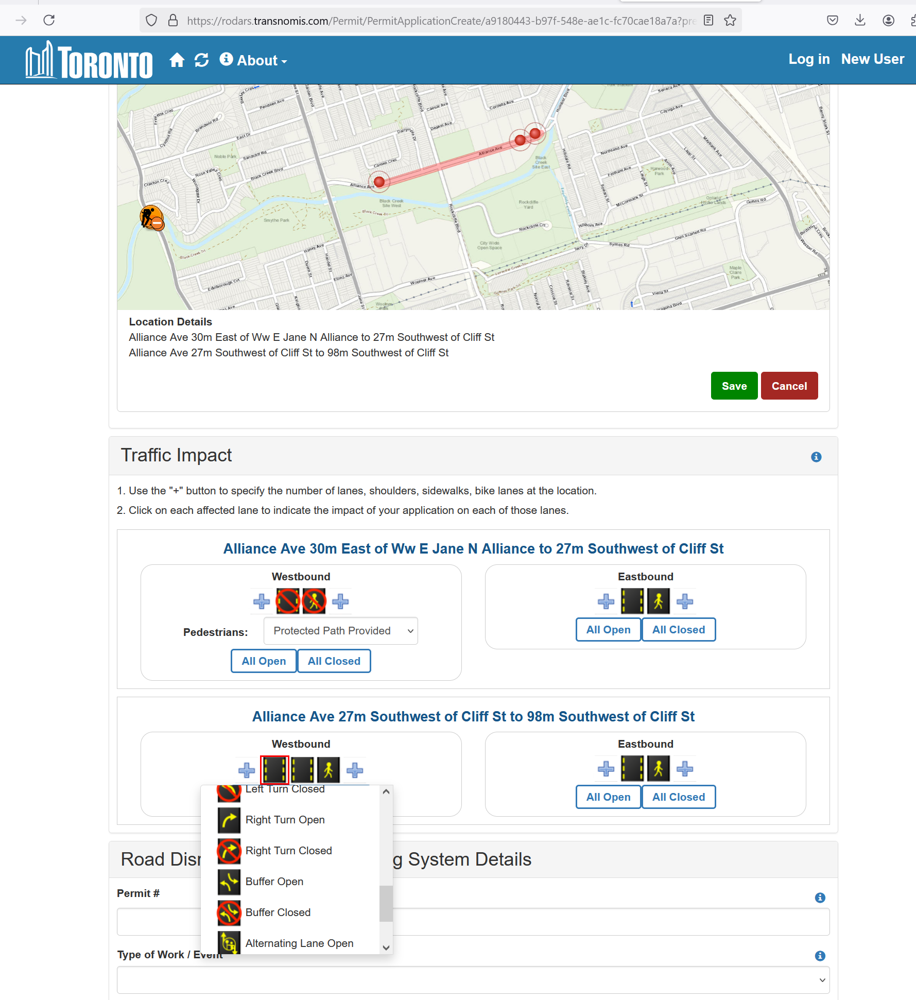

# Introduction

[!IMPORTANT]  
The city website gives a good overview of RoDARS (here/below): [Road Disruption Activity Reporting System (RoDARS)](https://www.toronto.ca/services-payments/streets-parking-transportation/road-restrictions-closures/road-disruption-activity-reporting-system-rodars/)

> RoDARS is a system that informs the public of planned roadway closures throughout the City. The submission procedure follows the acquisition of an approved [Street Occupation Permit](https://www.toronto.ca/?page_id=80501) (construction) or [Street Closure Permit](https://www.toronto.ca/?page_id=84975) (event).
> 
> When occupying any portion of the City’s public right of way that is not an expressway, the applicant must submit a [**RoDARS Notification Form**](https://www.toronto.ca/wp-content/uploads/2019/03/8de1-TS_Fillable-RoDARS-Form.pdf) to TMC Dispatch at least two business days before the start of occupation. > The RoDARS Notification Form must be approved by the appropriate Work Zone Traffic Coordinator (WZTC) before being submitted to TMC Dispatch.
> 
> When occupying any portion of a City expressway (F.G.G., DVP or Allen Rd between Eglinton Ave W and Transit Rd), the applicant must submit a RoDARS Notification Form to TMC Dispatch at least seven business days before the start of > occupation. The RoDARS Notification Form must be approved by the appropriate City project manager/engineer before submittal to TMC Dispatch. Once attained from TMC Dispatch, TMC’s RESCU Unit will then notify the applicant of the approval > verdict.
> 
> A separate RoDARS Notification Form is required for each occupied roadway. If the daily schedule varies, separate RoDARS Notification Forms are required for each day. Once the RoDARS form has been submitted and approved, the information then > appears on the [Traffic Restrictions Map](https://www.toronto.ca/?page_id=63656). Please refer to the [City Expressway Closure Guidelines](https://www.toronto.ca/wp-content/uploads/2017/11/9184-0_RoDARS-City-Expressway-Closure-Guidelines-a.pdf) for allowable roadway occupancy times.
> 
> The applicant must notify the City if either of the following situations arise:
> 
>  1. the work schedule and/or work zone plan has been revised or postponed. The applicant must submit a revised and approved RoDARS Notification Form at least one business day before changes occur
>  2. the work has been cancelled or completed early. The applicant must contact TMC Dispatch

[!TIP]  
The RoDARS form is public here: https://rodars.transnomis.com/Permit/PermitApplicationCreate/a9180443-b97f-548e-ae1c-fc70cae18a7a?previewMode=Applicants

Here is a screenshot of the extremely detailed geographic/lane management plan UI:


# RODARS vs RODARS New ("rodars_new_approved")

[!IMPORTANT]  
In 2024 a new version of RODARS which should result in a more reliable data source.  

**RODARS (New)**
- RODARs New has only been around since 2024-03 (already has more than 28,000 issues!)
- An online form which contractors fill out directly. Approvals are done by work zone coordinators.
- QR codes will start appearing at sites in 2024/2025, which should help enforceability (citizen reporting/bylaw officers). 
  - There will be penalties.
- Most records have `centreline_id`!
- Contains detailed escription of lane closure pattern (`lanesaffectedpattern`).

**RODARS (Old)**
- Apparently fax was involved and not all forms were processed = completeness is a concern. 
- `centreline_id` was introduced later in the lifespan of original RODARS (Only about 1/3 of those records have a centreline_id, starting from 2021-09).

Here is a small comparison of the data of the new and old RODARS (differentiated by `divisionid` / `divisionname` as seen below): 

| "divisionid" | "divisionname"        | "avg_actual_duration"     | "avg_proposed_duration"   | "min_starttimestamp" | "max_starttimestamp" | "count" | "has_centreline_id" | "start_centreline"           |
|--------------|-----------------------|---------------------------|---------------------------|----------------------|----------------------|---------|---------------------|------------------------------|
| 8014         | "RODARS"              | "15 days 28:43:05.992087" | "15 days 09:49:54.340779" | "1930-08-31"         | "2024-12-19"         | 366100  | 99119               | "2021-09-27 20:55:57.855961" |
| 8048         | "rodars_new_approved" | "20 days 24:26:34.079984" | "18 days 12:11:21.306625" | "2024-03-06"         | "2024-12-19"         | 28418   | 27837               | "2024-03-06 09:48:30.392945" |

```sql
SELECT
    divisionid,
    divisionname,
    AVG(actual_duration) AS avg_actual_duration,
    AVG(proposed_duration) AS avg_proposed_duration,
    MIN(starttimestamp::date) AS min_starttimestamp,
    MAX(starttimestamp::date) AS max_starttimestamp,
    COUNT(*),
    COUNT(*) FILTER (WHERE centreline_id IS NOT NULL) AS has_centreline_id,
    MIN(starttimestamp) FILTER (WHERE centreline_id IS NOT NULL) AS start_centreline
FROM congestion_events.rodars_locations
GROUP BY 1, 2 ORDER BY 1, 2;
```

### What's included?
- As noted in [the intro](#introduction), both construction and events (eg. parades, marathons) are included. 
- Emergency utilities - maybe included. 
- Notably, CafeTO is not included (As at EOY 2024). 

# Data Ops

## RODARS DAG
`rodars_pull` DAG runs on Morbius in order to access ITS Central database. See code here: [rodars_pull.py](../../dags/rodars_pull.py).

<!-- rodars_pull_doc_md -->

- `pull_rodars_issues`: pulls RODARS issue data from ITSC and inserts into RDS.
- `pull_rodars_locations`: pulls RODARS issue location data from ITSC and inserts into RDS.

<!-- rodars_pull_doc_md -->

## `lanesaffected`

`lanesaffected` is a loosely formatted json column in the ITSC issuelocationnew table.

Notes: 
- This field is unpacked with `process_lanesaffected` function in [rodars_functions.py](./rodars_functions.py) and converted to tabular format. 
- Some of the same fields names are used in the top level and the nested json, `LaneApproaches`, eg. `RoadClosureType`. The `_toplevel` suffix is used in `congestion_events.rodars_issue_locations` for the top level fields. 
  - It is assumed the lower level details are more descriptive when available. 
- FeatureId = centreline_id!
- `LanesAffectedPattern` is a code describing lane closures. In `congestion_events.rodars_issue_locations` it is converted to numeric columns: `lane_open_auto, lane_closed_auto, lane_open_bike, lane_closed_bike, lane_open_ped, lane_closed_ped, lane_open_bus, lane_closed_bus`
  
Sample:
```
`lanesaffected`: "{""LocationDescription"":""Huron St from Harbord St to Classic Ave"",""EncodedCoordinates"":""{_oiGpyrcNrDoA"",""LaneApproaches"":[{""Direction"":3,""RoadName"":""Huron St"",""FeatureId"":1143425,""RoadId"":3716,""LanesAffectedPattern"":""LOWO"",""LaneBlockLevel"":2,""RoadClosureType"":20},{""Direction"":2,""RoadName"":""Huron St"",""FeatureId"":1143425,""RoadId"":3716,""LanesAffectedPattern"":""LOWO"",""LaneBlockLevel"":2,""RoadClosureType"":20}],""LocationBlockLevel"":3,""RoadClosureType"":20}"
```