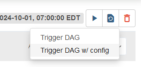
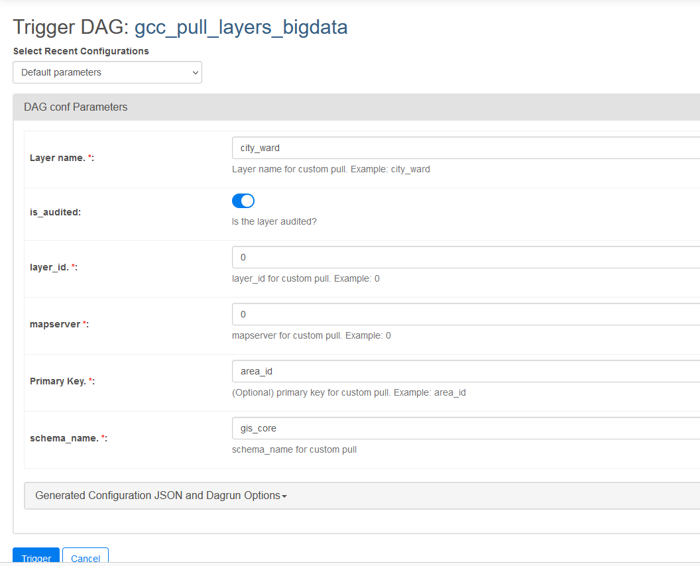

# GCCVIEW pipeline
  * [Overview](#overview)
  * [Where the layers are pulled](#where-the-layers-are-pulled)
  * [Data Pipeline](#data-pipeline)
  * [Adding new layers to GCC Puller DAG](#adding-new-layers-to-gcc-puller-dag)
  * [Manually fetch layers](#manually-fetch-layers)
  * [Manually fetch layers using Airflow DAG](#manually-fetch-layers-using-airflow-dag)

## Overview

The GCC (Geospatial Competency Centre) offers a number of spatial products on their arcgis rest api. They host 26 map servers and has over [300 layers](https://github.com/CityofToronto/bdit_data-sources/blob/gcc_view/gis/gccview/available_layers.md) from different divisions within the City of Toronto (note that `available_layers.md` might be outdated). To ensure the geospatial layers we use are the most up to date at a regular basis, we are creating a data pipeline to automate the process of retrieving layers from gccview to our postgresql database and conflate street networks through sharedstreets.

Since there are layers that cannot be accessed from the GCC's external REST API, the pipeline has to run on premises, e.g., Morbius and/or Bancroft.

## Where the layers are pulled

The GCC pipeline will be pulling multiple layers into the `gis_core` and `gis` schemas in the `bigdata` database hosted by Amazon RDS, as well as the `gis` schema in `ptc` database hosted on the on-prem server, Bancroft.

### gis (on-prem)

|Layer Name|Mapserver ID|Layer ID|
|-|-|-|
|city_ward|0|0|
|centreline|0|2|
|intersection|12|42|
|centreline_intersection_point|0|19|
|ibms_district|11|23|
|ibms_grid|11|25|

### gis_core (bigdata)

|Layer Name|Mapserver ID|Layer ID|
|-|-|-|
|city_ward|0|0|
|centreline|0|2|
|intersection|12|42|
|centreline_intersection_point|0|19|
|census_tract|26|7|
|neighbourhood_improvement_area|26|11|
|priority_neighbourhood_for_investment|26|13|

### gis (bigdata)

|Layer Name|Mapserver ID|Layer ID|
|-|-|-|
|cycling_infrastructure|2|49|
|traffic_camera|2|3|
|permit_parking_area|2|11|
|prai_transit_shelter|2|35|
|traffic_bylaw_point|2|38|
|traffic_bylaw_line|2|39|
|loop_detector|2|46|
|electrical_vehicle_charging_station|20|1|
|day_care_centre|22|1|
|middle_childcare_centre|22|2|
|business_improvement_area|23|1|
|proposed_business_improvement_area|23|13|
|film_permit_all|23|9|
|film_permit_parking_all|23|10|
|hotel|23|12|
|convenience_store|26|1|
|supermarket|26|4|
|place_of_worship|26|5|
|ymca|26|6|
|aboriginal_organization|26|45|
|attraction|26|46|
|dropin|26|47|
|early_years_centre|26|48|
|family_resource_centre|26|49|
|food_bank|26|50|
|longterm_care|26|53|
|parenting_family_literacy|26|54|
|retirement_home|26|58|
|senior_housing|26|59|
|shelter|26|61|
|social_housing|26|62|
|private_road|27|13|
|school|28|17|
|library|28|28|
|pavement_asset|2|36|

## Data Pipeline

The pipeline consists of two files, `gcc_puller_functions.py` for the functions and `/dags/gcc_layers_pull.py` for the Airflow DAG. The main function that fetches the layers is called `get_layer` and it takes in eight parameters. Here is a list that describes what each parameter means:

- mapserver_n (int): ID of the mapserver that host the desired layer
- layer_id (int): ID of the layer within the particular mapserver
- schema_name (string): name of destination schema
- is_audited (Boolean): True if the layer will be in a table that is audited, False if the layer will be non-audited
- cred (Airflow PostgresHook): the Airflow PostgresHook that directs to credentials to enable a connection to a particular database
- con (used when manually pull): the path to the credential config file. Default is ~/db.cfg
- primary_key (used when pulling an audited table): primary key for this layer, returned from dictionary pk_dict when pulling for the Airflow DAG, set it manually when pulling a layer yourself.
- is_partitioned (Boolean): True if the layer will be inserted as a child table part of a parent table, False if the layer will be neither audited nor partitioned.
- include_additional_layers (Boolean): True if pulling additional layers for centreline.

In the DAG file, the arguments for each layer are stored in dictionaries called "bigdata_layers" and "ptc_layers", in the order above. The DAG will be executed once every 3 months, particularly on the 15th of every March, June, September, and December every year. The DAG will pull either audited table or partitioned table since the "is_partitioned" argument is not stored in dictionaries and are set to default value True.

## Adding new layers to GCC Puller DAG
1. Identify the mapserver_n and layer_id for the layer you wish to add. You can find COT transportation layers here: https://insideto-gis.toronto.ca/arcgis/rest/services/cot_geospatial2/FeatureServer, where mapserver_n is 2 and the layer_id is in brackets after the layer name.
2. Add a new entry to "bigdata_layers" or "ptc_layers" dictionaries in airflow's variable depending on the destination database. 
3. If is_audited = True, you must also add a primary key for the new layer to "gcc_layers" in the corresponding airflow variable.

## Manually fetch layers

If you need to pull a layer as a one-off task, `gcc_puller_functions.py` allows you to pull any layer from the GCC Rest API. Please note that the script must be run locally or on a on-prem server as it needs connection to insideto.

Before running the script, ensure that you have set up the appropriate environment with all necessary packages installed. You might have to set the `https_proxy` in your environment with your novell username and password in order to clone this repo or install packages. If you run into any issues, don't hestitate to ask a sysadmin. You can then install all packages in the `requirement.txt`, either with:
1) Activate your virtual environment, it should automatically install them for you

    Pipenv:

    `pipenv shell`

    `pipenv install`

    Venv: 

    `source .venv/bin/activate`

    `python3 -m pip install -r requirements.txt`  
2) Install packages with pip if you are not using a virtual environment (you should) 
  
    `pip install -r requirements.txt`


Now you are set to run the script!

There are 7 inputs that can be entered.

`--mapserver`: Mapserver number, e.g. cotgeospatial_2 will be 2

`--layer-id`: Layer id

`--schema-name`: Name of destination schema

`--con`(optional): The path to the credential config file. Default is ~/db.cfg

`--is_audited`: Whether table will be audited or not, specify the option on the command line will set this option to True; while not specifying will give the default False.

`primary_key`(required when pulling an audited table): Primary key for the layer

`is_partitioned`: Whether table will be a child table of a parent table or with no feature, specify the option on the command line will set this option to True; while not specifying will give the default False.

`include_additional_layers`: Whether additional layer should be pulled (only applicable for centreline, specify the option on the command line will set this option to True; while not specifying will give the default False.

Example of pulling the library layer (table with no feature) to the gis schema.


```python
python3 bdit_data-sources/gis/gccview/gcc_puller_functions.py --mapserver 28 --layer-id 28 --schema-name gis --con db.cfg
```

Example of pulling the intersection layer (partitioned) to the gis_core schema.


```python
python3 bdit_data-sources/gis/gccview/gcc_puller_functions.py --mapserver 12 --layer-id 42 --schema-name gis_core --con db.cfg --is-partitioned
```

Example of pulling the city_ward layer (partitioned) to the gis_core schema.


```python
python3 bdit_data-sources/gis/gccview/gcc_puller_functions.py --mapserver 0 --layer-id 0 --schema-name gis_core --con db.cfg --is-audited --primary-key area_id
```

## Manually fetch layers using Airflow DAG

You can also manually fetch layers using the Airflow DAG with custom parameters. Simply press `Trigger DAG w/ config` and input the layer details.

  
