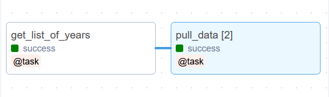

# Vision Zero Google Sheets API <!-- omit in toc -->
This folder contains scripts to read Vision Zero google spreadsheets and put them into two postgres tables using Google Sheets API. This process is then automated using Airflow for it to run daily.

## Table of Contents <!-- omit in toc -->

- [1. Data Source](#1-data-source)
- [2. The Automated Data Pipeline](#2-the-automated-data-pipeline)
- [3. Data pulling from the CLI](#3-data-pulling-from-the-cli)
  - [3.1 Database Configuration File](#31-database-configuration-file)
- [4. Google Credentials](#4-google-credentials)
- [5. Adding a new year](#5-adding-a-new-year)
  - [5.1 Create a New PostgreSQL Table](#51-create-a-new-postgresql-table)
  - [5.2 Add the New Google Sheet to Airflow](#52-add-the-new-google-sheet-to-airflow)
- [6. Table generated](#6-table-generated)

> **Notes:** 
> - Introduction to Google Sheets API can be found at [Intro](https://developers.google.com/sheets/api/guides/concepts).
> - A guide on how to get started can be found at [Quickstart](https://developers.google.com/sheets/api/quickstart/python).

## 1. Data Source

The School Safety Zone data are loaded from individual Google Sheets for every year since 2018. Those Google sheets are maintained by [Vision Zero](mailto:VisionZeroTO@toronto.ca). The data is pulled daily by an Airflow pipeline (DAG) and can be also pulled manually by running the script `gis.school_safety_zones.schools.py` with the appropriate arguments. The following two sections describe the two approaches in more details.

## 2. The Automated Data Pipeline

A daily Airflow pipeline (DAG) runs to pull the data from Google sheets into the BigData database. The `vz_google_sheets` DAG loads the Google sheets configurations from the Airflow variable `ssz_spreadsheets`. This variable is a Json list of dictionaries with the following keys:

* year: The year of the data included in this spreadsheet.
* spreadsheet_id: The spreadsheet Id used to access the data
* spreadsheet_range: The sheet and cell range of data within the spreadsheet.

The DAG consists of two main tasks as shown in the below figure:

1. get_list_of_years: A Python operator that extracts the required details out of `ssz_spreadsheets` and filters to specific years: 
   - Defaults to current year and previous year based on execution date.
   - Can override to pull past years by triggering DAG with `years` parameter specified.
2. pull_data: An array of mapped tasks dynamically created based on the number of years retreived by the previous (upstream) task. Each of these mapped tasks pull the data of a specific year from the corresponding Google spreadsheet by calling the helper function `gis.school_safety_zones.schools.pull_from_sheet`. The Google spreadsheet credentials and the database connection details are stored encrypted in Airflow connections.



## 3. Data pulling from the CLI

The data can be loaded into the database from the appropriate Google sheet(s) using the Linux Command Line Interface (CLI). The script `gis.school_safety_zones.schools.py` requires some mandatory and optional arguments to load these data. The below table describes the script's arguments. For more details, run `./gis/school_safety_zones/schools.py --help`.

| Argument          | Description   | Default Value |
| :---              | :---          | :---          |
| db-config         | The configuration file containing the database connection parameters. | N/A   |
| year              | The year to pull. | N/A   |
| spreadsheet-id    | The Id of the Google spreadsheet containing the raw data.  | N/A   |
| spreadsheet-range | The range of cells containing the raw data.   | N/A   |
| schema            | The PostgreSQL schema to load the data into.  | `vz_safety_programs_staging`  |
| table             | The PostgreSQL table to load the data into.  | `school_safety_zone_{year}_raw`    |

### 3.1 Database Configuration File

To be able to run the data puller script from the CLI, you need to save the database parameters in a file in the following format:

```ini
[DBSETTINGS]
host=HOSTNAME
database=DATABASENAME
username=USERNAME
password=PASSWORD
```

## 4. Google Credentials

Initially, a credential file (named `key.json` in the script) was required to connect to the Google Sheets to pull data. The google account used to read the Sheets is `bdittoronto@gmail.com`. First, Google Sheets API was enabled on the google account. Then, a service account was created so that we are not prompted to sign in every single time we run the script. Instructions on how to do that can be found at [Creating a service account](https://github.com/googleapis/google-api-python-client/blob/master/docs/oauth-server.md#creating-a-service-account). Go to the `Service accounts` page from there, select the `Quickstart` project and click on the `Search for APIs and Services` bar to generate credentials. Copy the credentials and paste it on a `key.json` file located in the same directory as the script. The `key.json` file should look something like this:

```json
"type": "service_account",
"project_id": "quickstart-1568664221624",
"private_key_id": 
"private_key":
"client_email":
"client_id": 
"auth_uri": "https://accounts.google.com/o/oauth2/auth",
"token_uri": "https://oauth2.googleapis.com/token",
"auth_provider_x509_cert_url": "https://www.googleapis.com/oauth2/v1/certs",
"client_x509_cert_url":
```

Currently, these credentials are stored in an encrypted Airflow connection: `vz_api_google`.

## 5. Adding a new year

Follow these steps to read in another spreadsheet for year `yyyy`.

### 5.1 Create a New PostgreSQL Table

Create an empty table `vz_safety_programs_staging.school_safety_zone_yyyy_raw`, where `yyyy` is the year to be stored, as a child of parent table `vz_safety_programs_staging.school_safety_zone_raw_parent`. Follow the format of the existing child tables (e.g. `vz_safety_programs_staging.school_safety_zone_2018_raw`) and declare the inheritance:

```SQL
CREATE TABLE vz_safety_programs_staging.school_safety_zone_yyyy_raw (
   	like vz_safety_programs_staging.school_safety_zone_2018_raw 
	including all
) INHERITS (vz_safety_programs_staging.school_safety_zone_raw_parent);
```

### 5.2 Add the New Google Sheet to Airflow

Add the new year details to the Airflow variable `ssz_spreadsheets` as described [above](#2-the-automated-data-pipeline) so that the DAG would start pulling its data.


## 6. Table generated
The script reads information from columns A, B, E, F, Y, Z, AA, AB which are as shown below

|SCHOOL NAME|ADDRESS|FLASHING BEACON W/O|WYSS W/O|School Coordinate (X,Y)|Final Sign Installation Date|FB Locations (X,Y)|WYS Locations (X,Y)|
|-----------|-------|-------------|---------------|--------------|-----------------------|------------|--------------|
|AGINCOURT JUNIOR PUBLIC SCHOOL|29 Lockie Ave|9239020|9239021|43.788456, -79.281118|January 9, 2019|43.786566, -79.279023|43.787530, -79.279456|

from the Google Sheets and put them into postgres tables with the following fields (all in data type text):

|school_name|address|work_order_fb|work_order_wyss|locations_zone|final_sign_installation|locations_fb|locations_wyss|
|-----------|-------|-------------|---------------|--------------|-----------------------|------------|--------------|
|AGINCOURT JUNIOR PUBLIC SCHOOL|29 Lockie Ave|9239020|9239021|43.788456, -79.281118|January 9, 2019|43.786566, -79.279023|43.787530, -79.279456|

**Notes:** 
* The Google Sheets API do not read any row with empty cells at the beginning or end of the row or just an entire row of empty cells. It will log an error when that happens.
* The script being used reads up to line 180 although the actual data is less than that. This is to anticipate extra schools which might be added into the sheets in the future.
