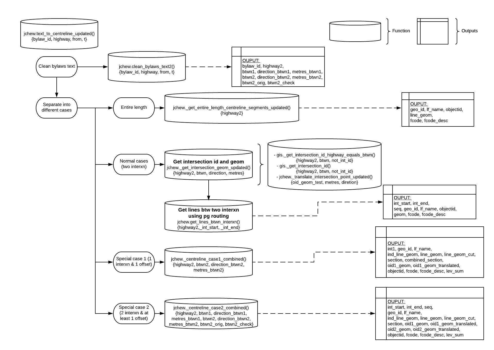

# <center>Text Description to Centreline Geometry Automation</center>

- [<center>Text Description to Centreline Geometry Automation</center>](#centerText-Description-to-Centreline-Geometry-Automationcenter)
  - [Intro](#Intro)
  - [Function Inputs](#Function-Inputs)
- [How the Function Works](#How-the-Function-Works)
  - [Step 1: Clean the data](#Step-1-Clean-the-data)
  - [Step 2: Separate into different cases](#Step-2-Separate-into-different-cases)
    - [2a) Entire Length](#2a-Entire-Length)
    - [2b) Normal Cases - Two Intersections](#2b-Normal-Cases---Two-Intersections)
    - [2c) Special Case 1 - An Intersection and An Offset](#2c-Special-Case-1---An-Intersection-and-An-Offset) 
    - [2d) Special Case 2 - Two Intersections and At Least One Offset](#2d-Special-Case-2---Two-Intersections-and-At-Least-One-Offset)
  - [Confidence output](#Confidence-output)
- [Creating Bylaws Speed Limit Layer](#Creating-Bylaws-Speed-Limit-Layer)
  - [Using the Function](#Using-the-Function)
  - [Match to Centrelines and Categorize Bylaws](#Match-to-Centrelines-and-Categorize-Bylaws)
  - [Final Clean Up](#Final-Clean-Up)
- [Quality Control](#Quality-Control) 
  - [pgRouting returns the shortest path but street name different from `highway`](#pgrouting-returns-the-shortest-path-but-street-name-different-from-highway)
  - [Direction stated on bylaws is not taken into account](#direction-stated-on-bylaws-is-not-taken-into-account)
  - [Levenshtein distance can fail for streets that have E / W](#levenshtein-distance-can-fail-for-streets-that-have-e--w)
  - [Include former municipality element of the "highway" field](#include-former-municipality-element-of-the-highway-field)
  - [Tackle Cases with "an intersection and two offsets"](#tackle-cases-with-an-intersection-and-two-offsets)
  - [Bylaws mega function does not return readable `geom`](#bylaws-mega-function-does-not-return-readable-geom)
  - [Modify `con` (confidence level) definition to better reflect actual situation](#modify-con-confidence-level-definition-to-better-reflect-actual-situation)

## Intro

This is a `README` for the [`jchew.text_to_centreline_updated(bylaw_id, highway, fr, t)`](https://github.com/CityofToronto/bdit_data-sources/blob/text_to_centreline/gis/bylaw_text_to_centreline/sql/create-function-text_to_centreline_updated.sql) function, which is written in `postgresql` (currently living in the `jchew` schema). The general purpose of this function is to take an input text description of a street location in the City of Toronto, and return an output of centreline segments that match this description. The input descriptions typically state the street that the bylaw is in effect on and the two intersections between which the bylaw. For example, you could use the function to get the centreline segments of Bloor Street between Royal York Road and St George Street.

The function is mainly created to process the City of Toronto's [transportation bylaw data](https://open.toronto.ca/dataset/traffic-and-parking-by-law-schedules/). We have already used previous versions of this process for [posted speed limits](https://github.com/CityofToronto/bdit_data-sources/tree/master/gis/posted_speed_limit_update) on streets in the City, locations of [community safety zones](https://github.com/CityofToronto/bdit_vz_programs/tree/master/safety_zones/commuity_safety_zone_bylaws), [turn restrictions](https://github.com/CityofToronto/bdit_vz_programs/blob/master/notebooks/Turn%20Restrictions.ipynb), etc. The function can handle most bylaws, even more advanced cases. Any limitations that we are currently aware of will be discussed in the [QC](#Quality-Control) area of the document. It should also be noted that some bylaws are incorrect (for many reasons, such as a described intersection not existing), and our function cannot correctly match a lot of these bylaws, since the data is incorrect. Sometimes the function will match the bylaws incorrectly and other times it will return an error.

## Function Inputs

The function takes three inputs, called `highway`, `frm`, and `to`. They are called these names to emulate the names of columns in bylaw certain documents. There are two types of ways that bylaws are explained in documents and they can influence what you input to the function.

If you have a bylaw written like:

|highway|from|to|
|--------|---|---|
| Bloor Street |Royal York Road | St George Street |

`Bloor Street` as `highway`
`Royal York Road` as `frm`
`St George Street` as `to`

However there is a different format:

|highway|between|
|--------|---|
| Bloor Street|Between Royal York Road and St George Street |

In this case you would input:
- `Bloor Street` as `highway`
- `Between Royal York Road and St George Street` as `frm`
- `NULL` as `to`.

# How the Function Works

The main steps for every type of input (complex or not so complex) are:

1. Cleaning the data
2. Match location text data to intersections
3. Find lines (centreline segments) between matched intersections using pgRouting

The process will be explained in further detail below. The functions called/variables assigned by these functions can be visualized with the following flow chart 

## Step 1: Clean the data

The first step is to clean the location description data so it can easily be matched to intersections in the `gis.centreline_intersection` table.

We clean the data mainly using the `gis.abbr_street2` function. The intersection table writes roads with appreviations. For example the word street is written as `St` and road is `Rd`, etc.

We want to be able to extract:

1. `highway2` (`TEXT`): the street name where the bylaw occurs (that was cleaned using `gis.abbr_street2`)
2. `btwn1` and `btwn2` (`TEXT`): the name of both the streets between which the bylaw occurs (i.e the two intersections). In the case from the [function inputs](#Function-Inputs) section, btwn1 would be `Royal York Rd` and `btwn2` would be `St George St`
3. `metres_btwn1` and `metres_btwn2` (`NUMERIC`): will be null for everything except for [special case 1 and 2](#Special-Cases). These are the number of metres away from the intersections (intersections meaning intersection of `highway2` and `btwn1` and/or `highway2` and `btwn2`) that the bylaws occur. For example if the bylaw is in effect on `Bloor Street` between `100` metres east of `Royal York Road` and `300` metres west of `St George Street`, then `metres_btwn1` would be `100` and `metres_btwn2` would be `300`.
4. `direction_btwn1` and `direction_btwn2` (`TEXT`): will be null for everything except for [special case 1 and 2](#Special-Cases). These are directions away from the intersections (intersections meaning intersection of `highway2` and `btwn1` and/or `highway2` and `btwn2`) that the bylaws occur. For example if the bylaw is in effect on `Bloor Street` between `100` metres east of `Royal York Road` and `300` metres west of `St George Street`, then `direction_btwn1` would be `east` and `direction_btwn2` would be `west`.

There are different cases for how the data is input ([see above](#Function-Inputs)), so both of those cases should have to be cleaned differently, hence there is a lot of code like: `CASE WHEN t IS NULL THEN ` .... `ELSE`. An idea to make this cleaner in the future could be to make 2 different functions for cleaning inputs.

The `gis.abbr_street2` function is called a lot in the cleaning process. It is a function that replaces string segments such as ' Street' with ' St', and ' North' with ' N'.

The cleaning bylaws text function currently in the main function is [jchew.clean_bylaws_text2()](https://github.com/CityofToronto/bdit_data-sources/blob/text_to_centreline/gis/bylaw_text_to_centreline/sql/create-function-clean_bylaws_text2.sql). The big chunk of cleaning bylaws function is now separated and since the function returns composite types and there are many columns involved, it's easier to return them as a table type. More explanation [here at 36.4.7. SQL Functions as Table Sources](https://www.postgresql.org/docs/9.6/xfunc-sql.html).

It is also possible to return multiple variable types without the involvement of a table which is using the `OUT` term when creating the function as shown in [jchew.clean_bylaws_text2()](https://github.com/CityofToronto/bdit_data-sources/blob/text_to_centreline/gis/bylaw_text_to_centreline/sql/create-function-clean_bylaws_text.sql). 
More explanation [here at 41.3.1. Declaring Function Parameters](https://www.postgresql.org/docs/9.6/plpgsql-declarations.html)

## Step 2: Separate into different cases

### 2a) Entire Length

**If `TRIM(clean_bylaws.btwn1) ILIKE '%entire length%' AND clean_bylaws.btwn2 IS NULL`, then the bylaw falls into this case.**

If the bylaw occurs on the entire length of the street then call a special function named [`jchew.get_entire_length_centreline_segements_updated()`](https://github.com/CityofToronto/bdit_data-sources/blob/text_to_centreline/gis/bylaw_text_to_centreline/sql/create-function-_get_entire_length_centreline_segments_updated.sql). This function selects all centreline segments in the City of Toronto with the exact name of `highway2`. In this case the street name has to be exact, and if the street name is misspelled then there will be no output geometry. There could potentially be an issue with how this code is written because some streets in the city have the same name but appear in different districts (i.e. Etobicoke and North York). To be solved, currently in issue [#281 Use the former municipality element of the "highway" field](https://github.com/CityofToronto/bdit_data-sources/issues/281)

### 2b) Normal Cases - Two Intersections

**If `COALESCE(metres_btwn1, metres_btwn2) IS NULL`, then the bylaw is not a special case. **

The function [`jchew._get_intersection_geom_updated()`](https://github.com/CityofToronto/bdit_data-sources/blob/text_to_centreline/gis/bylaw_text_to_centreline/sql/create-function-get_intersection_id_and_geom.sql#L133) is the main function that is called to get the geometry of the intersections between which the bylaw is in effect. The function returns an array with the geometry of the intersection and the `objectid` (unique `ID`) of the intersection. If the `direction` and `metres` values that are inputted to the function are not `NULL`, then the function returns a translated intersection geometry (translated in the direction specified by the number of metres specified). The function takes a value `not_int_id` as an input. This is an intersection `int_id` (intersection `ID`) that we do not want the function to return. We use `int_id` instead of `objectid` since sometimes there are intersection points that are in the exact same location but have different `objectid` values. This is a parameter to this function because sometimes streets can intersect more than once, and we do not want the algorithm to match to the same intersection twice.

In  most cases, the function `jchew._get_intersection_geom_updated()` calls on another function named [`gis._get_intersection_id()`](https://github.com/CityofToronto/bdit_data-sources/blob/text_to_centreline/gis/bylaw_text_to_centreline/sql/create-function-get_intersection_id_and_geom.sql#L1). This function returns the `objectid` and `intersection id` of the intersection, as well as how close the match was (where closeness is measured by levenshtein distance). The query in this function works by gathering all of the streets from the City of Toronto intersection streets table that have the same/very similar names to the streets that are described in the bylaw description provided as input to the `text_to_centreline_updated` function (i.e. `btwn1`, `btwn2`, `highway2`). If there is more than one street with the same unique intersection ID in this subset, then this means that both streets at one of the intersections between which the bylaw is in effect have been matched. We can use a `HAVING` clause (i.e. `HAVING COUNT(intersections.street) > 1`) to ensure that only the intersections that have been matched to both street names are chosen. The `gis.centreline_intersection_streets` view (that is called in this function) assigns a unique ID to each intersection in the City of Toronto (`gis.centreline_intersection`). Each row contains one street name from an intersection and the ID associated with the intersection.

If the names for `highway` and `btwn` are the same, the `jchew._get_intersection_geom_updated()` calls on the function named [`gis._get_intersection_id_highway_equals_btwn()`](https://github.com/CityofToronto/bdit_data-sources/blob/text_to_centreline/gis/bylaw_text_to_centreline/sql/create-function-get_intersection_id_and_geom.sql#L55). This function is intended for cases where the intersection that we want is a cul de sac or a dead end or a pseudo intersection. In these cases the intersection would just be the name of the street. `not_int_id` is a parameter of this function as well since some streets both start and end with an intersection that is a cul de sac or pseudo intersection. The process to find the appropriate intersection is very similar to the `get_intersection_id` function, except it does not have the `HAVING COUNT(intersections.street) > 1`. This is because cul de sac or pseudo intersections intersection only have one entry in the `gis.centreline_intersection_streets` view (since there is only one road involved in the intersection).

The `oid1_geom` and `oid2_geom` values that are assigned in the `text_to_centreline_updated` function and represented the (sometimes) translated geometry of the intersections. 

Once the id and geometry of the intersections are found, the lines between the two points are then found using pgRouting. The function [`jchew.get_lines_btwn_interxn()`](https://github.com/CityofToronto/bdit_data-sources/blob/text_to_centreline/gis/bylaw_text_to_centreline/sql/create-function-get_lines_btwn_interxn.sql#L27) is used to find the centrelines between the two intersection points using the table `gis.centreline_routing_undirected`. More information about pgRouting can be found [here](https://github.com/CityofToronto/bdit_data_tools/tree/routing/routing). The one used here is undirected as we want to get the shortest route between the two points. Directionality is to be added into the future process, currently in issue [#276 Speed Limit Layer Enhancement (directional)](https://github.com/CityofToronto/bdit_data-sources/issues/276).

### 2c) Special Case 1 - An Intersection and An Offset

**If `clean_bylaws.btwn1 = clean_bylaws.btwn2`, then the bylaw is special case 1.**

There are some records that start and/or end at locations that are a certain amount of metres away from an intersection. We create a method to assign a geometry to the locations of these bylaws. These segments do not start at one intersection and end at another, they often start/end in the middle of centreline segments.

`btwn2` is formatted like: "a point (insert number here) metres (direction - north/south/east/west)"

The point is located on the street in the `highway` column a certain number of metres away from the intersection identified in `btwn1`.

Example: `highway` = "Billingham Rd" `btwn` = "Dundas St and a point 100 metres north"

These records can be filtered with the WHERE clause: `btwn2 LIKE '%point%'`

**The workflow for this case (An Intersection and An Offset) is:**

i) Create a temp table `_wip` as some function may return multiple rows.

ii) Using `jchew._get_intersection_geom_updated()` to get the intersection id & geometry of that one intersection as well as the translated geometry according to the bylaws. The function [`jchew._translate_intersection_point_updated()`](https://github.com/CityofToronto/bdit_data-sources/blob/text_to_centreline/gis/bylaw_text_to_centreline/sql/create-function-get_intersection_id_and_geom.sql#L101) is used to translate the intersection point and the point is rotated at an angle of 17.5 to make the city boundary an almost vertical or horizontal line.

iii) A `new_line`, connecting the intersection point to the translated point, is created using ST_MakeLine.

iv) Create a buffer of `3*metres_btwn2` around the `new_line` and find the centrelines within the buffer that have the same name as `highway2`. The centrelines found from the previous steps are then inserted into the temp table `_wip`.

v) After combining all centrelines using `ST_LineMerge(ST_Union(individual_centreline_geom))`, the line is cut according to the metres stated on bylaws and put into the column `line_geom_cut`. Note that it is important to find the start_point/end_point of how the line is drawn so that we know how much we should add or subtract from that one intersection we found. 

vi) `combined_section` specifies the section of the centrelines that was trimmed from the original combined centrelines line_geom named `whole_centreline`, whether it's from the start_point to a cut point ('[0, 0.5678]') or from a cut point to the end_point ('[0.1234, 1]').

vii) Make sure that the `ind_line_geom` and `line_geom_cut` has the same orientation ie drawn in the same direction and insert that into a new column named `line_geom_reversed`.

viii) Create a small buffer around `line_geom_reversed` and find out if the `ind_line_geom` is within the buffer or how much of the centreline is within the buffer. With that, `line_geom` which is the final individual centrelines (trimmed when needed) aka the wanted output of this function is found. Centrelines are now separated into their respective `geo_id` rows.

ix) Update the `section` column which specifies the section of the centrelines that was trimmed from the original individual centrelines line_geom named `ind_line_geom`, whether it's from the start_point to a cut point ('[0, 0.5678]') or from a cut point to the end_point ('[0.1234, 1]').

x) Return every single rows from the temp table with columns that we need.

### 2d) Special Case 2 - Two Intersections and At Least One Offset

**If the bylaws does not fall into any cases stated above, then it is special case 2.**

`btwn1` or `btwn2` formatted like: "(number) metres (direction) of (insert street name that is not btwn1 or highway)"

The point is located a certain number if metres away from the specified intersection. The intersection is an intersection between the street in the `highway` column and the (insert street name that is in `between`).

These records can be filtered with the WHERE clause: `btwn LIKE '%metres%of%`

Example: street = "Watson Avenue" btwn = "Between St Marks Road and 100 metres north of St Johns Road"

For this case, we need to find the intersections *St. Marks and Watson Avenue* and *St. Johns Road and Watson Avenue*. Then find a point that is 100 metres north of the intersection of *St. Johns Road and Watson Avenue*.

The work flow for this case is very similar to 2c except now that we have the two intersection points, we can use pgRouting to link the two points and then add/trim centrelines according to the bylaws.

**The workflow for this case (Two Intersections and At Least One Offset) is:**

i) Create a temp table `_wip2` as some function may return multiple rows.

ii) Using `jchew._get_intersection_geom_updated()` to get the intersection id & geometry of that one intersection as well as the translated geometry according to the bylaws. The function [`jchew._translate_intersection_point_updated()`](https://github.com/CityofToronto/bdit_data-sources/blob/text_to_centreline/gis/bylaw_text_to_centreline/sql/create-function-get_intersection_id_and_geom.sql#L101) is used to translate the intersection point and the point is rotated at an angle of 17.5 to make the city boundary an almost vertical or horizontal line.

iii) Using `jchew.get_lines_btwn_interxn()` pgRouting to find all relevant centrelines between the two intersections.

iv) `new_line1`, connecting the intersection point `oid1_geom` to the translated point `oid1_geom_translated`, and `new_line2`, connecting the intersection point `oid2_geom` to the translated point `oid2_geom_translated`, is created using ST_MakeLine.

v) Create a buffer of `3*metres` around `new_line1` and `new_line2` and find the centrelines within the buffer that have the same name as `highway2`. The centrelines found from the previous steps are then inserted into the temp table `_wip2`.

vi) Combined all centrelines found within the buffer as well as pgRouting into `whole_centreline`.

vii) Combine all centrelines found using pgRouting into `pgrout_centreline`, can be filetered by setting `seq` IS NOT NULL.

viii) Deal with the first intersection `oid1_geom`. Details can be found **below at P.S**.

ix) Then deal with the second intersection `oid2_geom`. The math logic is the same as the previous step.

x) Make sure that the `ind_line_geom` and `line_geom_cut` has the same orientation ie drawn in the same direction and insert that into a new column named `line_geom_reversed`.

viii) Create a small buffer around `line_geom_reversed` and find out if the `ind_line_geom` is within the buffer or how much of the centreline is within the buffer. With that, `line_geom` which is the final individual centrelines (trimmed when needed) aka the wanted output of this function is found. Centrelines are now separated into their respective `geo_id` rows.

ix) Update the `section` column which specifies the section of the centrelines that was trimmed from the original individual centrelines line_geom named `ind_line_geom`, whether it's from the start_point to a cut point ('[0, 0.5678]') or from a cut point to the end_point ('[0.1234, 1]').

x) Return every single rows from the temp table with columns that we need.

**P.S**
To explain some logic used in the function `centreline_case2_combined()`. The part where applicable is shown below. I am using `pgrout_centreline` as the baseline and then adding or trimming centrelines where applicable according to the bylaws. If addition of centrelines is needed, then `ST_Union` is used (see A1 & A2); if subtraction/trimming of centrelines is needed, then `ST_Difference` is used (see B1 & B2).
```
--DEAL WITH oid1_geom_translated (FIRST INTERSECTION POINT)
UPDATE _wip2 SET line_geom_cut = (
CASE WHEN metres_btwn1 > ST_Length(ST_Transform(_wip2.pgrout_centreline, 2952)) 
AND metres_btwn1 - ST_Length(ST_Transform(_wip2.pgrout_centreline, 2952)) < 15
THEN _wip2.pgrout_centreline

--To check if the oid1_geom_translated point is within pgrout_centreline to determine if we should add or subtract
--routed centreline + additional centreline xx metres from that intersection
WHEN ST_Within(ST_Transform(ST_ClosestPoint(_wip2.whole_centreline, _wip2.oid1_geom_translated), 2952), ST_BUFFER(ST_Transform(_wip2.pgrout_centreline, 2952), 2, 'endcap=square join=round')) = FALSE
THEN (
    CASE WHEN ST_LineLocatePoint(_wip2.whole_centreline, _wip2.oid1_geom)
    > ST_LineLocatePoint(_wip2.whole_centreline, _wip2.oid1_geom_translated)
    THEN ST_Union(_wip2.pgrout_centreline ,
    ST_LineSubstring(_wip2.whole_centreline, 
    ST_LineLocatePoint(_wip2.whole_centreline, _wip2.oid1_geom) - (metres_btwn1/ST_Length(ST_Transform(_wip2.whole_centreline, 2952))),
    ST_LineLocatePoint(_wip2.whole_centreline, _wip2.oid1_geom) )  
        )
 
    WHEN ST_LineLocatePoint(_wip2.whole_centreline, _wip2.oid1_geom)
    < ST_LineLocatePoint(_wip2.whole_centreline, _wip2.oid1_geom_translated)
    THEN ST_Union(_wip2.pgrout_centreline ,
    ST_LineSubstring(_wip2.whole_centreline, 
    ST_LineLocatePoint(_wip2.whole_centreline, _wip2.oid1_geom),
    ST_LineLocatePoint(_wip2.whole_centreline, _wip2.oid1_geom) + (metres_btwn1/ST_Length(ST_Transform(_wip2.whole_centreline, 2952)))  )
        )
    
    END )

--routed centreline - part of centreline xx metres from that intersection that got trimmed
WHEN ST_Within(ST_Transform(ST_ClosestPoint(_wip2.whole_centreline, _wip2.oid1_geom_translated), 2952), ST_BUFFER(ST_Transform(_wip2.pgrout_centreline, 2952), 2, 'endcap=square join=round')) = TRUE
THEN (
    CASE WHEN ST_LineLocatePoint(_wip2.whole_centreline, _wip2.oid1_geom)
    < ST_LineLocatePoint(_wip2.whole_centreline, _wip2.oid1_geom_translated)
    THEN ST_Difference(_wip2.pgrout_centreline ,
    ST_LineSubstring(_wip2.pgrout_centreline, 
    ST_LineLocatePoint(_wip2.pgrout_centreline, _wip2.oid1_geom),
    ST_LineLocatePoint(_wip2.pgrout_centreline, _wip2.oid1_geom) + (metres_btwn1/ST_Length(ST_Transform(_wip2.pgrout_centreline, 2952)))  )
        )

    WHEN ST_LineLocatePoint(_wip2.whole_centreline, _wip2.oid1_geom)
    > ST_LineLocatePoint(_wip2.whole_centreline, _wip2.oid1_geom_translated)
    THEN ST_Difference(_wip2.pgrout_centreline ,
    ST_LineSubstring(_wip2.pgrout_centreline, 
    ST_LineLocatePoint(_wip2.pgrout_centreline, _wip2.oid1_geom) - (metres_btwn1/ST_Length(ST_Transform(_wip2.pgrout_centreline, 2952))),
    ST_LineLocatePoint(_wip2.pgrout_centreline, _wip2.oid1_geom) )  
        )

    END )

ELSE _wip2.pgrout_centreline

END);
```

The image below shows the four possible cases (A1, A2, B1 and B2)


## Confidence output

The function outputs a confidence level (`con`), which is defined after the `centreline_segments` variable. This value represents how close the names of the input values are to the intersections they were matched to. Specifically, this value is the sum of the levenshtien distance between the `highway2` value and the street name it matched to and the `btwn1`/`btwn2` value and the street name it matched to. It is the sum of this value for both intersections.

# Creating Bylaws Speed Limit Layer

The function created above was to read bylaws and return the centrelines involved, be it partial or complete. The following steps then have to be done in order to prepare the final bylaws speed limit layer. 

## Using the Function
 
Using the function `gis.text_to_centreline`, convert all bylaws text into centrelines and put the results into a table named `gis.bylaws_routing`. The query used is as shown below and can also be found [here](https://github.com/CityofToronto/bdit_data-sources/blob/text_to_centreline/gis/text_to_centreline/sql/table-bylaws_routing.sql).

```sql
SET client_min_messages = warning; 
--only show warning messages that I would like to know
CREATE TABLE gis.bylaws_routing AS
SELECT law.*, results.*
FROM jchew.bylaws_to_update law, --bylaws where deleted = false
LATERAL gis.text_to_centreline(
law.id,
law.highway,
law.between,
NULL
) as results
```

## Match to Centrelines and Categorize Bylaws

The previous step only converts all bylaws into centrelines and do not include centrelines that are not stated in the bylaws. This [mat view query](https://github.com/CityofToronto/bdit_data-sources/blob/text_to_centreline/gis/text_to_centreline/sql/mat-view-bylaws_centreline_categorized.sql) categorizes bylaws into different parts and incorporates that into the centreline layer into a mat view named `gis.bylaws_centreline_categorized`. We check if the centrelines are involved in any bylaws, if they are not, set the speed limit to 50km/h. If they are just partially included in the bylaws, we check if there's another bylaw that governs that centreline. If there is, apply the next bylaw; If there is none, set the speed limit to 50km/h. For a centreline that is included partially in more than one bylaws, it falls into the part two category. This query may seem long but it is technically just handling the bylaws in a few parts. 

1. no_bylaw -> centrelines not involved in bylaws and so the speed limits are set to 50 km/h

2. whole_added -> centrelines involved in bylaws, be it fully or partially

3. part_one_without_bylaw -> parts of centrelines not involved in bylaws if there isn't a next applicable bylaw

4. part_two -> for the partial centrelines, include the next bylaw that applies to it if exists

5. part_two_without_bylaw -> for partial centrelines where next bylaw has been applied to it, the remaining part of the centreline not involved in the bylaws

Some explanation on the long code:

i) [L25](https://github.com/CityofToronto/bdit_data-sources/blob/text_to_centreline/gis/text_to_centreline/sql/mat-view-bylaws_centreline_categorized.sql#L25): `AND ST_AsText(bylaws.line_geom) != 'GEOMETRYCOLLECTION EMPTY'` is used here as some geom produced from the function returns "unreadable" geom as the centreline is not involved in the bylaws but is found between the two given intersections. It normally happens for bylaws that are in case 1 or case 2.

ii) [L65](https://github.com/CityofToronto/bdit_data-sources/blob/text_to_centreline/gis/text_to_centreline/sql/mat-view-bylaws_centreline_categorized.sql#L65): ` (centreline.fcode_desc::text = ANY (ARRAY['Collector'::character varying, ...` is used here to only include relevant centrelines from `gis.centreline`.

iii) [L84](https://github.com/CityofToronto/bdit_data-sources/blob/text_to_centreline/gis/text_to_centreline/sql/mat-view-bylaws_centreline_categorized.sql#L84) `WHERE whole_added.section IS NOT NULL AND whole_added.section <> '[0,1]'::numrange` is used to find centrelines where bylaws are only applied to a part of it.

iv) [L123](https://github.com/CityofToronto/bdit_data-sources/blob/text_to_centreline/gis/text_to_centreline/sql/mat-view-bylaws_centreline_categorized.sql#L123) `WHERE bylaws.geo_id = one.geo_id AND (bylaws.date_added < one.date_added OR bylaws.id < one.bylaw_id)` is used to find the previous bylaws according to the date_added but since not all bylaws have date_added, the id is used instead with bigger id representing more latest bylaw_id.

v) [L135](https://github.com/CityofToronto/bdit_data-sources/blob/text_to_centreline/gis/text_to_centreline/sql/mat-view-bylaws_centreline_categorized.sql#L135) `st_difference(next_bylaw.geom, st_buffer(part_one.geom, 0.00001::double precision)) AS geom,` is used to find the difference between the current and previous bylaw centrelines for part two cases. Note that st_difference does not work without the st_buffer here.

## Final Clean Up

The final bylaws speed limit layer is a table named `gis.bylaws_speed_limit_layer`. To be honest, the results produced in this step is very similar to the one from the previous step. BUT, the geom in this table is way more accurate as we are cutting the centreline based on the information from section whereas in the previous process, we used buffer to do the slicing. Therefore, even though there are only 303 different rows (only the geom is slightly different) comparing this mat view and the mat view from previous step, we will still use this mat view to ensure that the geom is exactly the same as the geom from `gis.centreline`. The query can be found [here](https://github.com/CityofToronto/bdit_data-sources/blob/text_to_centreline/gis/text_to_centreline/sql/mat-view-bylaws_speed_limit_layer.sql) where the part mentioned below is the important part.

```sql
CASE WHEN bylaw.section IS NOT NULL 
THEN st_linesubstring(cl.geom, lower(bylaw.section)::double precision, upper(bylaw.section)::double precision)
ELSE cl.geom
END AS geom,
```

The output table will look like this
|bylaw_id|lf_name|geo_id|speed_limit|int1|int2|con|note|geom|section|oid1_geom|oid1_geom_translated|oid2_geom|oid2_geom_translated|date_added|date_repealed|
|--|--|--|--|--|--|--|--|--|--|--|--|--|--|--|--|
|1805|	Harvie Ave	|2350209|	40	|13461402|	NULL|	Very High (100% match)|	highway2:...| ...	|(0.896704452511841,0.89770788980652]	|...	|...|	NULL|	NULL	|NULL	|NULL|
|1806|	Harvie Ave|	2350209|	30|	NULL|	NULL|	High (1 character difference)|	highway2:...|...|	[0,0.896704452511841]	|...|	NULL|	...|	...|	NULL|	NULL|
|NULL	|Harvie Ave|	2350209|	50|	NULL|	NULL|	NULL|	NULL|	...|	(0.89770788980652,1]|	NULL	|NULL|	NULL|	NULL	|NULL	|NULL|
|3762|	Traymore Cres	|1146129|	40	|13467350	|NULL|	Very High (100% match)|	highway2:...|...|	\[0,0.372174765194242)	|...|	...|	NULL	|NULL	|NULL|	NULL|
|3763	|Traymore Cres|	1146129	|40|	13467350|	13467108|	Very High (100% match)|	highway2:...| ...|	[0.372174765194242,1]	|...|	...|	...|	NULL|	NULL	|NULL|
|6583|	Glenvale Blvd|	127|	30|	13455526|	13455120	|Very High (100% match)|	highway2:...| ...|	NULL|	...|NULL|		...|	NULL|	01/15/2019	|NULL|	
|NULL|Broadway Ave|	129|	50	|	NULL|NULL|NULL|NULL|...|NULL|||||NULL|NULL|								

Look at Harvie Ave (which is considered at part two), the latest bylaw is applied to the centreline partially and the other part of the centreline is either filled with the previous bylaws or the speed limit is just set to 50 if there isn't any previous bylaws applied to that part of the centreline. Traymore Cres is considered as part one where the centreline is partially governed by a bylaw and the other part is governed by an older bylaw. Glencale Blvd is considered as whole_added where the whole centreline is related to a bylaw whereas Broadway Ave is considered as no_bylaw as there is no bylaw governing that centreline.

However, there are centrelines that belong to highway and the speed limit is definitely greater than 50km/h. Bylaws we received do not govern the highway and so in short we will not have bylaws stating the speed limit for highway. Therefore, speed limit layer with the right speed limit for highway can be found in table `gis.bylaws_speed_limit_layer_hwy `. In order to fix that, simply apply the code below (with speed limit information found online) to fix the speed limit for expressway.

```sql
--to create a table from the m. view to do the update
SELECT *
INTO gis.bylaws_speed_limit_layer_hwy 
FROM gis.bylaws_speed_limit_layer

--gardiner west of humber river (39 rows)
UPDATE gis.bylaws_speed_limit_layer_hwy  SET speed_limit = 100 
WHERE geo_id IN (913014,913062,913089,913152,913159,913172,913187,913249,913264,913354,913364,913367
,913403,913493,913503,913520,913534,913625,913633,913670,913677,913714,913720,913728
,913733,913748,913776,913783,913829,913835,913844,913864,913875,20043572,20043579,20043650,20043655,30005878,30005881);

--gardiner east of humber river (128 rows)
UPDATE gis.bylaws_speed_limit_layer_hwy  SET speed_limit = 90
WHERE lf_name ILIKE '%F G Gardiner Xy%' 
AND geo_id NOT IN 
(913014,913062,913089,913152,913159,913172,913187,913249,913264,913354,913364,913367
,913403,913493,913503,913520,913534,913625,913633,913670,913677,913714,913720,913728
,913733,913748,913776,913783,913829,913835,913844,913864,913875,20043572,20043579,20043650,20043655,30005878,30005881,
14646841,14646863,14646867); --last 3 are ramps in disguise

--highway 2a & 27 (88 rows)
UPDATE gis.bylaws_speed_limit_layer_hwy SET speed_limit = 80
WHERE lf_name ILIKE '%highway 2%' ;

--highway 400 series (915 rows)
UPDATE gis.bylaws_speed_limit_layer_hwy SET speed_limit = 100
WHERE lf_name ILIKE '%highway 4%' ;
 
--don valley parkway (127 rows)
UPDATE gis.bylaws_speed_limit_layer_hwy SET speed_limit = 90
WHERE lf_name ILIKE '%don valley parkway%' ;
```

# Quality Control

There is a [Github Issue](https://github.com/CityofToronto/bdit_data-sources/issues/188) on weird bylaws that haven't been matched from Chelsea's work. \
For example: \
i) The streets stated in bylaws are slightly off i.e. they do not intersect or are rather far apart. \
ii) Directionality matters. Northbound and Southbound route between two intersection are of different centrelines such as the Allen Rd. \
iii) The error message `line_locate_point: 1st arg isn't a line` returned for 49 distinct id's. This mostly occurs when trying to slice a multilinestring. 

Majority of them are also some issues that I have encountered with my new processes but have not been solved yet. I will list down the issue below and some idea on how we can tackle them.

## pgRouting returns the shortest path but street name different from `highway`

This can be found at [issue #268](https://github.com/CityofToronto/bdit_data-sources/issues/268#issuecomment-595973836). 
This happened for `bylaw_id` = 6577 where `highway` = 'Garthdale Court' and `between` = 'Overbrook Place and Purdon Drive'. The two intersection ids found are 13448816 and 13448300 (marked as red cross below). The blue line is the result from pg_routing whereas the highlighted yellow path indicates the road segment from the bylaw.


## Direction stated on bylaws is not taken into account

Which is also somehow related to problem (ii) stated above. This can be found at [issue #276](https://github.com/CityofToronto/bdit_data-sources/issues/276). For example: `highway` = 'Black Creek Drive (southbound)' and `between` = 'Eglinton Avenue West and a point 200 metres north of Weston Road'

We might be able to solve it by separating that direction during the cleaning the data process and taking that into account when finding the right centrelines.

## Levenshtein distance can fail for streets that have E / W

This can be found at [issue #279](https://github.com/CityofToronto/bdit_data-sources/issues/279). For example, bylaw_id = 6667, highway = 'Welland Ave' and between = 'Lawrence Ave W and Douglas Avenue'. Since changing 'Lawrence Ave W' to 'Lawrence Ave E' only takes 1 step whereas changing 'Welland Ave' to 'Welland Rd' takes 3 steps, the intersection point with the less levenshtein distance is chosen instead, resulting in the segments of road that does not reflect the bylaws text.

I also found that when there are three street names in the intersec5 column and two of the street names are almost the same with the slight change of E to W or vice versa (which happen particularly frequently for Yonge St like Adelaide St E / Yonge St / Adelaide St W, King St E / Yonge St / King St W, Bloor St E / Yonge St / Bloor St W etc), the intersection points found is weird because of the reason above.

## Include former municipality element of the "highway" field

This can be found at [issue #281](https://github.com/CityofToronto/bdit_data-sources/issues/281). When a street name is duplicated or triplicated across the city due to amalgamation, there will be a two-character code in the highway field to specify which former municipality is referenced, this should be used to ensure the correct intersections are getting matched. Examples of the municipality is shown below.


## Tackle Cases with "an intersection and two offsets"

This can be found at [issue #289](https://github.com/CityofToronto/bdit_data-sources/issues/289). There are about 9 cases of bylaws where there's only one intersection (btwn1 = btwn2) but two offsets (metres_btwn1 IS NOT NULL & metres_btwn2 IS NOT NULL). Examples as shown below.


## Bylaws mega function does not return readable `geom`

Which is also somehow related to the problem (iii) above. This can be found at [issue #290](https://github.com/CityofToronto/bdit_data-sources/issues/290). I suspect that there are the presence of multiline strings that are causing this to happen. The highlighted ones are the ones where the `geom` is not viewable and hence `section` columns return NULL. There are also two weird ones where `section` is "[0,)" or "(,1]".


## Modify `con` (confidence level) definition to better reflect actual situation

This can be found as a part of [issue #270](https://github.com/CityofToronto/bdit_data-sources/issues/270). The `con` output may need to be modified in order to reflect the actual situation as they currently showing high confidence level for those where the street has E/W or streets that are in other former municipality. It might also be a good idea to indicate if the centrelines are found from the pgRouting process or from the bufferring and locating process.
