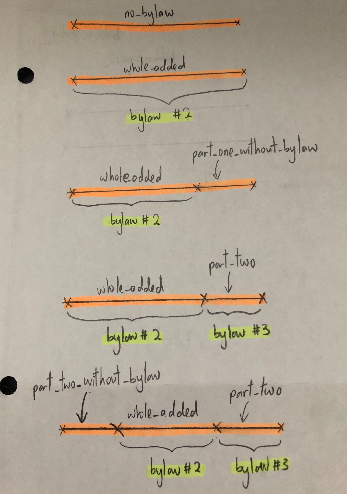
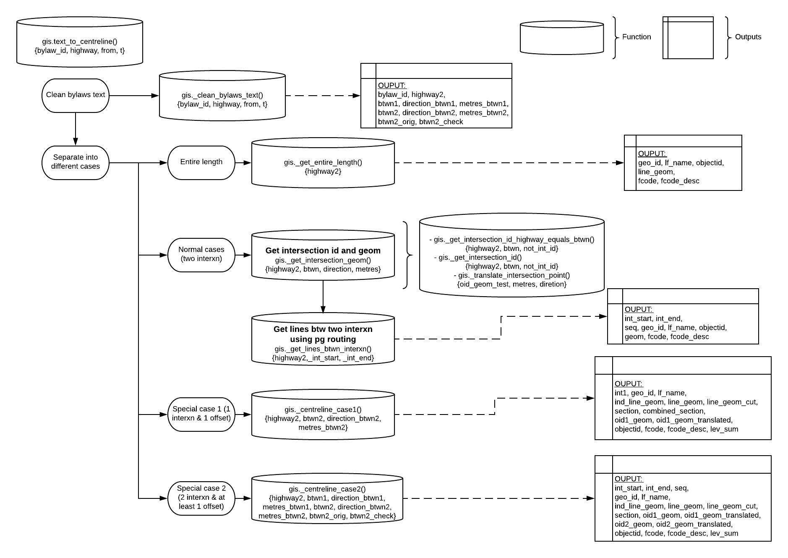
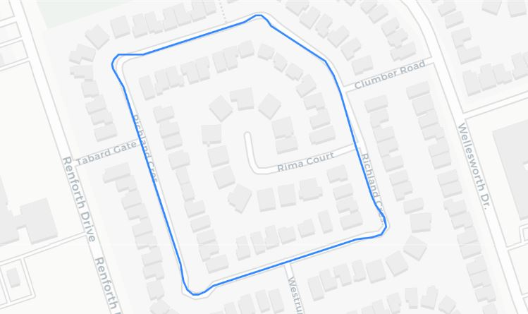
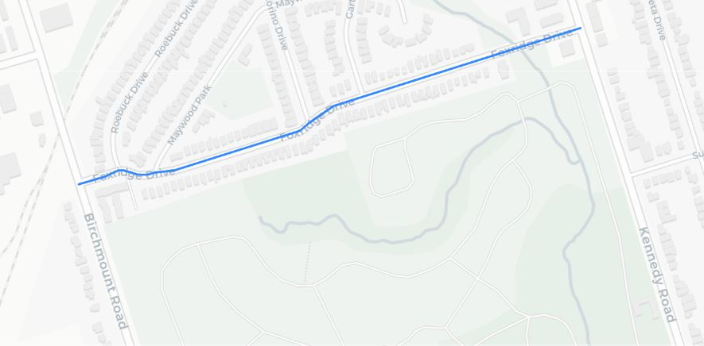
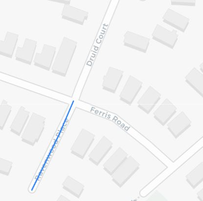
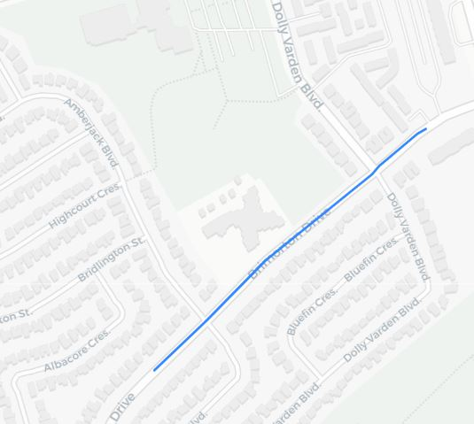

# Text Description to Centreline Geometry Automation

- [Intro](#Intro)
- [Usage](#Usage)
  - [Inputs](#Inputs)
  - [Outputs](#Outputs)
  - [Use Case Examples](#Use-Case-Examples)
  - [How Well Does This Work](#How-Well-Does-This-Work)
  	- [How to Measure Success Rates](#How-to-Measure-Success-Rates)
  - [How to Create the Speed Limit Layer from Bylaws](#How-to-create-the-speed-limit-layer-from-bylaws)
  	- [Run text_to_centreline() to generate geometries](#Run-text_to_centreline()-to-generate-geometries)
  	- [Incorporate Centrelines without Bylaws and Cut Centrelines](#Incorporate-centrelines-without-bylaws-and-cut-centrelines)
  	- [Final Clean Up for Expressway](#Final-Clean-Up-for-Expressway)
- [How the Function Works](#How-the-Function-Works)
  - [Step 1: Clean the data](#Step-1-Clean-the-data)
  - [Step 2: Separate into different cases](#Step-2-Separate-into-different-cases)
    - [2a) Entire Length](#2a-Entire-Length)
    - [2b) Normal Cases - Two Intersections](#2b-Normal-Cases---Two-Intersections)
    - [2c) Special Case 1 - An Intersection and An Offset](#2c-Special-Case-1---An-Intersection-and-An-Offset) 
    - [2d) Special Case 2 - Two Intersections and At Least One Offset](#2d-Special-Case-2---Two-Intersections-and-At-Least-One-Offset)
      - [The logic behind dealing with geom to be trimmed](#The-logic-behind-dealing-with-geom-to-be-trimmed)
  - [Confidence output](#Confidence-output)
- [Future Enhancement](#Future-Enhancement)
  - [Wrapper function for `clean_bylaws_text`](#Wrapper-function-for-clean_bylaws_text)
  - [Include `date_added` and `date_reapealed`](#Include-date_added-and-date_repealed)
  - [Rename `highway` and `btwn`](#Rename-highway-and-btwn)
- [Outstanding Work](#Outstanding-Work) 
  - [Where did the bylaws fail](#where-did-the-bylaws-fail)
  - [Tackle Cases with Known Geom Error](#tackle-cases-with-known-geom-error)
  - [pgRouting returns the shortest path but street name different from `highway`](#pgrouting-returns-the-shortest-path-but-street-name-different-from-highway)
  - [Direction stated on bylaws is not taken into account](#direction-stated-on-bylaws-is-not-taken-into-account)
  - [Levenshtein distance can fail for streets that have E / W](#levenshtein-distance-can-fail-for-streets-that-have-e--w)
  - [Duplicate street name and former municipality element ignored ](#duplicate-street-name-and-former-municipality-element-ignored)
  - [Tackle Cases with "an intersection and two offsets"](#tackle-cases-with-an-intersection-and-two-offsets)
  - [Modify `con` (confidence level) definition to better reflect actual situation](#modify-con-confidence-level-definition-to-better-reflect-actual-situation)

## Intro

This is a `README` for the [`gis.text_to_centreline(bylaw_id, highway, fr, t)`](sql/function-text_to_centreline.sql) function, which is written in `postgresql`. The general purpose of this function is to take an input text description of a street location in the City of Toronto, and return an output of centreline segments that match this description. The input descriptions typically state the street the bylaw is in effect on and the two intersections between which the bylaw applies. For example, you could use the function to get the centreline segments of Bloor Street between Royal York Road and St George Street.

The function is mainly created to process the City of Toronto's [transportation bylaw data](https://open.toronto.ca/dataset/traffic-and-parking-by-law-schedules/). We have already used previous versions of this process for [posted speed limits](https://github.com/CityofToronto/bdit_data-sources/tree/master/gis/posted_speed_limit_update) on streets in the City, locations of [community safety zones](https://github.com/CityofToronto/bdit_vz_programs/tree/master/safety_zones/commuity_safety_zone_bylaws), [turn restrictions](https://github.com/CityofToronto/bdit_vz_programs/blob/master/notebooks/Turn%20Restrictions.ipynb), etc. The function can handle most bylaws, even more advanced cases. Any limitations that we are currently aware of will be discussed in the [Outstanding Work](#Outstanding-Work) area of the document. It should also be noted that some bylaws are incorrect (for many reasons, such as a described intersection not existing), and our function cannot correctly match a lot of these bylaws, since the data is incorrect. Sometimes the function will match the bylaws incorrectly and other times it will return an error.

The folder named `posted_speed_limit_update` includes past work on transforming bylaws into centreline segments, including python code to transform the xml bylaws on Open Data into Postgresql to process. More on that can be found at this [README](posted_speed_limit_update/README.md).

## Usage

### Inputs
The function takes four inputs, namely `_bylaw_id`, `highway`, `frm`, and `to`. They are called these names to emulate the names of columns in bylaw certain documents. There are two types of ways that bylaws are explained in documents and they can influence what you input to the function.

If you have a bylaw written like:

|\_bylaw_id|highway|from|to|
|----------|--------|---|---|
|1234| Bloor Street |Royal York Road | St George Street |

In this case you would input:
- `1234` as `_bylaw_id`
- `Bloor Street` as `highway`
- `Royal York Road` as `frm`
- `St George Street` as `to`

However there is a different format:

|\_bylaw_id|highway|between|
|----------|--------|---|
|1234| Bloor Street|Between Royal York Road and St George Street |

In this case you would input:
- `1234` as `_bylaw_id`
- `Bloor Street` as `highway`
- `Between Royal York Road and St George Street` as `frm`
- `NULL` as `to`.

An example query would look like this.
```sql
SELECT * FROM gis.text_to_centreline
(2958, 'Placentia Boulevard', 'Kenhatch Boulevard and Sandhurst Circle', NULL) ;
SELECT * FROM gis.text_to_centreline
(6393, 'Druid Court', 'Ferris Road and a point 78.19 metres north', NULL) ;

OR 

SELECT (gis.text_to_centreline(2958, 'Placentia Boulevard', 'Kenhatch Boulevard and Sandhurst Circle', NULL)).* ;
SELECT (gis.text_to_centreline(6393, 'Druid Court', 'Ferris Road and a point 78.19 metres north', NULL)).* ;
```

This function can handle text descriptions of four different categories, all of which are differences in the `between` :

|case type|text description in `between`|
|--|--|
|entire length|`Entire length`|
|normal (two intersections without any offset)|`[intersection1 street] and [intersection2 street]`|
|case 1 (one intersection and one offset)|`[intersection1 street] and a point [xx] meters [cardinal direction ie North]`|
|case 2 (two intersections and at least one offset)|`A point [xx] meters [cardinal direction] of [intersection1 street] and a point [xx] meters [cardinal direction] of [intersection2 street]`|

### Outputs
The function will then returns a table as shown below. Note the below is only showing a single row each from the results of the above sample queries. The `con` value represents how close the names of the input values are to the intersections they were matched to. More about that can be found at the [confidence output](#Confidence-output) section.

|int1|	int2|	geo_id|	lf_name|	con|	note|	line_geom|	section|	oid1_geom|	oid1_geom_translated|	oid2_geom|	oid2_geom_translated|	objectid|	fcode	|fcode_desc|
|--|--|--|--|--|--|--|--|--|--|--|--|--|--|--|
|13443051|	13442736|	104679	|Placentia Blvd|	Very High (100% match)|	highway2:...| ...|NULL|...||...||		43183	|201400|	Collector|
|13457875|	NULL|	3835696|	Druid Crt|	Very High (100% match)|	highway2: ...|...|	[0,1]|	...|	...|	NULL|	NULL|	21243	|201500|	Local|

### Use Case Examples

The above-mentioned query is only for a single use case. However, we normally use the function to run through a table and so the following will show how we can use the function on a table instead. The function takes in `_bylaw_id` as a variable, but really that is just an id for one to identify which row went wrong for troubleshooting. Say if one does not have any id associated with the rows in a table, simply put `NULL` as the variable.

```sql
SELECT result.* 
FROM schema_name.table_name , 
LATERAL gis.text_to_centreline(NULL, lf_name, from_street, to_street)  AS result
```

There is also a wrapper function named [`gis.text_to_centreline_geom`](sql/function-text_to_centreline_geom.sql) which takes in 3 variable, namely `_street`, `_from_loc`, `_to_loc` and only returns geometry (`_return_geom`) found from the function `gis.text_to_centreline`. If one is only interested in finding the geometry from two intersections given in text-based descriptions, this is a really useful function. The following shows how one can run the wrapper function to update the geom column of an existing table.

```sql
ALTER TABLE schema_name.table_name
ADD COLUMN geom geometry;

UPDATE schema_name.table_name
SET geom = result._return_geom
FROM 
      (SELECT table_name.id,  geoms.* 
			FROM schema_name.table_name , 
			LATERAL gis.text_to_centreline_geom(lf_name, from_street, to_street)  AS geoms
			) result
WHERE table_name.id = result.id	
```

### How Well Does This Work

Out of 5163 bylaws that are not repealed as of January 2020, 4956 of them got converted successfully. That means that we have an overall success rate of 96%! The number of bylaws fall into each case type and the percentage of successfully matched is shown in the table below. Those that failed are discussed in ["Where did the bylaws fail"](#Where-did-the-bylaws-fail) section below. The following subsection shows how each case type is found. 

|case type | number of bylaws | number of bylaws matched | % successfully matched|
|--|--|--|--|
|entire length|21|20|95%|
|normal (two intersections without any offset)|4815|4684|97%|
|case 1 (one intersection and one offset)|68|55|81%|
|case 2 (two intersections and at least one offset)|259|197|76%|

#### How to Measure Success Rates

The steps below summarize how we find the case type for all bylaws from the table `jchew.bylaws_2020` which is the bylaws information gotten directly via email. Some cleaning needs to be done to only include bylaws that are not deleted aka need to be processed as well as removing those that are weird (those that got repealed but not deleted & those that were not cleaned nicely.) The first query below is to clean up the bylaws to find out the components/variables from the bylaws text which are to be used in later process and to be used to categorize them into different case type. The second query then only include all bylaws that has to be processed to centrelines. The third query shows how I find out the bylaws that fall into different categories. In short, I will list out the tables used in sequence right here.

i) `jchew.bylaws_2020` - bylaws table provided

ii) `jchew.bylaws_2020_cleaned` - table that only contains the cleaned text and variables to be used in other process and does not contain other information besides `id`, `highway` and `between` from `jchew.bylaws_2020`

iii) `jchew.bylaws_to_update` - table that only contains bylaws that have to be updated aka not repealed

iv) Finding bylaws in different case types.

Table `jchew.bylaws_2020` looks like this.
|id|city|deleted|bylaw_no|chapter|schedule|schedule_name|highway|between|speed_limit_km_per_h|
|--|--|--|--|--|--|--|--|--|--|
|5878||false|\[Added 2018-01-16 by By-law 68-2018]|950|35|Speed Limits on Public Highways|Windsor Street|Front Street West and Wellington Street West|30|

```sql
CREATE TABLE jchew.bylaws_2020_cleaned AS 
SELECT clean_bylaws.* 
FROM jchew.bylaws_2020, LATERAL gis.clean_bylaws_text(id, highway, between, NULL) AS clean_bylaws
```

Table `jchew.bylaws_2020_cleaned` looks like this.
|bylaw_id|highway2|btwn1|direction_btwn1|metres_btwn1|btwn2|direction_btwn2|metres_btwn2|btwn2_orig|btwn2_check
|--|--|--|--|--|--|--|--|--|--|
|5878|Windsor St|Front St W|||Wellington St W|||Wellington St W|Wellington St W|

```sql
CREATE TABLE jchew.bylaws_to_update AS
SELECT law.*
FROM jchew.bylaws_2020 law
WHERE law.deleted = false 
AND (law.bylaw_no NOT LIKE '%Repealed%' OR law.bylaw_no IS NULL) 
--to exclude those that got repealed but not deleted (6 of them which are bylaw_id = 4571, 6350, 6477, 6512, 6565, 6566)
AND law.id IN (SELECT bylaw_id FROM jchew.bylaws_2020_cleaned)
--to exclude those not cleaned nicely (4 of them which are bylaw_id = 2207,2208,2830?,6326)
```

Table `jchew.bylaws_to_update` has the same format and columns as `jchew.bylaws_2020`.

```sql
WITH entire AS (
SELECT * FROM jchew.bylaws_2020_cleaned
WHERE bylaw_id IN (SELECT id FROM jchew.bylaws_to_update)
AND TRIM(btwn1) ILIKE '%entire length%' 
AND btwn2 IS NULL
--ENIRE LENGTH (21 ROWS)
),
normal AS (
SELECT * FROM jchew.bylaws_2020_cleaned
WHERE bylaw_id IN (SELECT id FROM jchew.bylaws_to_update)
AND COALESCE(metres_btwn1, metres_btwn2) IS NULL 
AND TRIM(btwn1) NOT ILIKE '%entire length%'
--NORMAL CASES (4815 ROWS)
),
case1 AS (
SELECT * FROM jchew.bylaws_2020_cleaned
WHERE bylaw_id IN (SELECT id FROM jchew.bylaws_to_update)
AND btwn1 = btwn2 AND COALESCE(metres_btwn1, metres_btwn2) IS NOT NULL 
--AN INTERXN AND AN OFFSET(68 ROWS)	
)
SELECT * FROM jchew.bylaws_2020_cleaned
WHERE bylaw_id IN (SELECT id FROM jchew.bylaws_to_update)
AND bylaw_id NOT IN (SELECT bylaw_id FROM entire)
AND bylaw_id NOT IN (SELECT bylaw_id FROM normal)
AND bylaw_id NOT IN (SELECT bylaw_id FROM case1)
--ELSE AKA TWO INTERXN AND AT LEAST ONE OFFSET (259 ROWS)
```

In order to produce the results from the table in [How Well Does This Work](#How-Well-Does-This-Work), the query used is exactly the same as above except that this one line is added to the end of each CTE: `AND bylaw_id NOT IN (SELECT DISTINCT id FROM gis.bylaws_routing)` .


### How to Create the Speed Limit Layer from Bylaws

The function created above was to read bylaws and return the centrelines involved, be it partial or complete. The following steps then have to be done in order to prepare the final bylaws speed limit layer. 

#### Run text_to_centreline() to generate geometries
 
Using the function `gis.text_to_centreline`, convert all bylaws text into centrelines and put the results into a table named `gis.bylaws_routing`. The query used is as shown below and can also be found [here](sql/table-bylaws_routing.sql). **Note** that there were a couple of them that raised a warning message and you can find out more in [Outstanding Work - Tackle Cases with Known Geom Error](#Tackle-cases-with-known-geom-error).

```sql
SET client_min_messages = warning; 
--only show warning messages that I would like to know
CREATE TABLE gis.bylaws_routing AS
SELECT law.*, results.*
FROM jchew.bylaws_to_update law, --bylaws where deleted = false
LATERAL gis.text_to_centreline(
law.id,
law.highway,
law.between,
NULL
) as results
```

However, the function does not include the `date_added` and `date_repealed` which are essential in the next part. Therefore, in order to get that information, the following query has to be run too. This can be one of the [future enhancement](#Include-date_added-and-date_repealed).
```sql
CREATE TABLE gis.bylaws_routing_dates AS
SELECT result.*, dates.date_added, dates.date_repealed FROM gis.bylaws_routing result
LEFT JOIN jchew.bylaws_added_repealed_dates dates
USING (id)
```

#### Incorporate Centrelines without Bylaws and Cut Centrelines

The previous step only converts all bylaws into centrelines and do not include centrelines that are not stated in the bylaws. This [mat view query](sql/mat-view-bylaws_speed_limit_layer.sql) categorizes bylaws into different parts and incorporates that into the centreline layer into a mat view named `gis.bylaws_speed_limit_layer`. **This is the final bylaws speed limit layer if one is not interested in the expressways speed limit.** We check if the centrelines are involved in any bylaws, if they are not, set the speed limit to 50km/h. If they are just partially included in the bylaws, we check if there's another bylaw that governs that centreline. If there is, apply the next bylaw; If there is none, set the speed limit to 50km/h. For a centreline that is included partially in more than one bylaws, it falls into the part_two category. The function categorizes centrelines based on how the processed bylaw geometries intersect with the original geometry (not all, entirely, partially, or multiple bylaws). The picture below communicates that idea with the orange lines being the centrelines, highlighted in yellow being where bylaws applied, and the names above the lines being each category which corresponds to the CTE name.



This query may seem long but it is technically just handling the bylaws in a few parts.

1. no_bylaw -> No bylaw matched, therefore default of 50 km/hr for urban street applies

2. whole_added -> centrelines involved in bylaws, be it fully or partially

3. part_one_without_bylaw -> parts of centrelines not involved in bylaws if there isn't a next applicable bylaw

4. part_two -> for the partial centrelines, include the next bylaw that applies to it if exists

5. part_two_without_bylaw -> for partial centrelines where next bylaw has been applied to it, the remaining part of the centreline not involved in the bylaws

Some explanation on the long code:

i) [L25](sql/mat-view-bylaws_centreline_categorized.sql#L25): `AND ST_AsText(bylaws.line_geom) != 'GEOMETRYCOLLECTION EMPTY'` is used here as some geom produced from the function returns "unreadable" geom as the centreline is not involved in the bylaws but is found between the two given intersections. It normally happens for bylaws that are in case 1 or case 2.

ii) [L65](sql/mat-view-bylaws_centreline_categorized.sql#L65): ` (centreline.fcode_desc::text = ANY (ARRAY['Collector'::character varying, ...` is used here to only include relevant centrelines from `gis.centreline`.

iii) [L84](sql/mat-view-bylaws_centreline_categorized.sql#L84) `WHERE whole_added.section IS NOT NULL AND whole_added.section <> '[0,1]'::numrange` is used to find centrelines where bylaws are only applied to a part of it.

iv) [L123](sql/mat-view-bylaws_centreline_categorized.sql#L123) `WHERE bylaws.geo_id = one.geo_id AND (bylaws.date_added < one.date_added OR bylaws.id < one.bylaw_id)` is used to find the previous bylaws according to the `date_added`. Since not all bylaws have `date_added`, the `id` is used instead with larger values representing more recently applied bylaws.

v) [L135](sql/mat-view-bylaws_centreline_categorized.sql#L135) `st_difference(next_bylaw.geom, st_buffer(part_one.geom, 0.00001::double precision)) AS geom,` is used to find the difference between the current and previous bylaw centrelines for part two cases. Note that st_difference needs st_buffer (a really small buffer) here to work properly or else st_difference will not return any results. This may be due to the fact that the geometry might not be exactly the same after the unioning and trimming.

vi) The following few lines which occurred at the UNION part for the CTE next_bylaw, part_two, part_one_without_bylaw, part_two_without_bylaw is there to ensure that the geom is exactly the same as the geom from `gis.centreline`. This geom is more accurate as it does not involve any st_buffer, st_difference, st_union etc.

```sql
CASE WHEN bylaw.section IS NOT NULL 
THEN st_linesubstring(cl.geom, lower(bylaw.section)::double precision, upper(bylaw.section)::double precision)
ELSE cl.geom
END AS geom,
```

The final output table will look like this
|bylaw_id|lf_name|geo_id|speed_limit|int1|int2|con|note|geom|section|oid1_geom|oid1_geom_translated|oid2_geom|oid2_geom_translated|date_added|date_repealed|
|--|--|--|--|--|--|--|--|--|--|--|--|--|--|--|--|
|1805|	Harvie Ave	|2350209|	40	|13461402|	NULL|	Very High (100% match)|	highway2:...| ...	|(0.896704452511841,0.89770788980652]	|...	|...|	NULL|	NULL	|NULL	|NULL|
|1806|	Harvie Ave|	2350209|	30|	NULL|	NULL|	High (1 character difference)|	highway2:...|...|	[0,0.896704452511841]	|...|	NULL|	...|	...|	NULL|	NULL|
|NULL	|Harvie Ave|	2350209|	50|	NULL|	NULL|	NULL|	NULL|	...|	(0.89770788980652,1]|	NULL	|NULL|	NULL|	NULL	|NULL	|NULL|
|3762|	Traymore Cres	|1146129|	40	|13467350	|NULL|	Very High (100% match)|	highway2:...|...|	\[0,0.372174765194242)	|...|	...|	NULL	|NULL	|NULL|	NULL|
|3763	|Traymore Cres|	1146129	|40|	13467350|	13467108|	Very High (100% match)|	highway2:...| ...|	[0.372174765194242,1]	|...|	...|	...|	NULL|	NULL	|NULL|
|6583|	Glenvale Blvd|	127|	30|	13455526|	13455120	|Very High (100% match)|	highway2:...| ...|	NULL|	...|NULL|		...|	NULL|	01/15/2019	|NULL|	
|NULL|Broadway Ave|	129|	50	|	NULL|NULL|NULL|NULL|...|NULL|||||NULL|NULL|								

Look at 
- Harvie Ave which is categorized as or part_two from [here](#Incorporate-Centrelines-without-Bylaws-and-Cut-Centrelines), the latest bylaw is applied to the centreline partially and the other part of the centreline is either filled with the previous bylaws or the speed limit is just set to 50 if there isn't any previous bylaws applied to that part of the centreline. 
- Traymore Cres is categorized as part_one from [here](#Incorporate-Centrelines-without-Bylaws-and-Cut-Centrelines) where the centreline is partially governed by a bylaw and the other part is governed by an older bylaw. 
- Glencale Blvd is categorized whole_added from [here](#Incorporate-Centrelines-without-Bylaws-and-Cut-Centrelines) where the whole centreline is related to a bylaw.
- Broadway Ave is categorized as no_bylaw from [here](#Incorporate-Centrelines-without-Bylaws-and-Cut-Centrelines) as there is no bylaw governing that centreline.

#### Final Clean Up for Expressway

##### *`gis.bylaws_speed_limit_layer_hwy`*
There are centrelines that belong to highway (highway as in expressway and not the `highway` column within the function) and the speed limit is definitely greater than 50km/h. Bylaws we received do not govern the highway and so in short we will not have bylaws stating the speed limit for highway. Therefore, speed limit layer with the right speed limit for highway can be found in table `gis.bylaws_speed_limit_layer_hwy `. In order to fix that, simply apply the code below (with speed limit information found online) to fix the speed limit for expressway.

```sql
--to create a table from the m. view to do the update
SELECT *
INTO gis.bylaws_speed_limit_layer_hwy 
FROM gis.bylaws_speed_limit_layer

--gardiner west of humber river (39 rows)
UPDATE gis.bylaws_speed_limit_layer_hwy  SET speed_limit = 100 
WHERE geo_id IN (913014,913062,913089,913152,913159,913172,913187,913249,913264,913354,913364,913367
,913403,913493,913503,913520,913534,913625,913633,913670,913677,913714,913720,913728
,913733,913748,913776,913783,913829,913835,913844,913864,913875,20043572,20043579,20043650,20043655,30005878,30005881);

--gardiner east of humber river (128 rows)
UPDATE gis.bylaws_speed_limit_layer_hwy  SET speed_limit = 90
WHERE lf_name ILIKE '%F G Gardiner Xy%' 
AND geo_id NOT IN 
(913014,913062,913089,913152,913159,913172,913187,913249,913264,913354,913364,913367
,913403,913493,913503,913520,913534,913625,913633,913670,913677,913714,913720,913728
,913733,913748,913776,913783,913829,913835,913844,913864,913875,20043572,20043579,20043650,20043655,30005878,30005881,
14646841,14646863,14646867); --last 3 are ramps in disguise

--highway 2a & 27 (88 rows)
UPDATE gis.bylaws_speed_limit_layer_hwy SET speed_limit = 80
WHERE lf_name ILIKE '%highway 2%' ;

--highway 400 series (915 rows)
UPDATE gis.bylaws_speed_limit_layer_hwy SET speed_limit = 100
WHERE lf_name ILIKE '%highway 4%' ;
 
--don valley parkway (127 rows)
UPDATE gis.bylaws_speed_limit_layer_hwy SET speed_limit = 90
WHERE lf_name ILIKE '%don valley parkway%' ;
```

# How the Function Works

The main steps for every type of input (complex or not so complex) are:

1. Cleaning the data
2. Match location text data to intersections
3. Find lines (centreline segments) between matched intersections using pgRouting

The process will be explained in further detail below. The functions called/variables assigned by these functions can be visualized with the following flow chart 

## Step 1: Clean the data

The first step is to clean the location description data so it can easily be matched to intersections in the `gis.centreline_intersection` table.

We clean the data mainly using the [`gis.abbr_street`](sql/helper_functions/function-abbr_street.sql) function. The intersection table writes roads with appreviations. For example the word street is written as `St` and road is `Rd`, etc.

We want to be able to extract:

1. `highway2` (`TEXT`): the street name where the bylaw occurs (that was cleaned using `gis.abbr_street`)
2. `btwn1` and `btwn2` (`TEXT`): the name of both the streets between which the bylaw occurs (i.e the two intersections). In the case from the [usage](#Usage) section, btwn1 would be `Royal York Rd` and `btwn2` would be `St George St`
3. `metres_btwn1` and `metres_btwn2` (`NUMERIC`): will be null for everything except for [special case 1](#2c-Special-Case-1---An-Intersection-and-An-Offset)  and [special case 2](#2d-Special-Case-2---Two-Intersections-and-At-Least-One-Offset). These are the number of metres away from the intersections (intersections meaning intersection of `highway2` and `btwn1` and/or `highway2` and `btwn2`) that the bylaws occur. For example if the bylaw is in effect on `Bloor Street` between `100` metres east of `Royal York Road` and `300` metres west of `St George Street`, then `metres_btwn1` would be `100` and `metres_btwn2` would be `300`.
4. `direction_btwn1` and `direction_btwn2` (`TEXT`): will be null for everything except for [special case 1](#2c-Special-Case-1---An-Intersection-and-An-Offset)  and [special case 2](#2d-Special-Case-2---Two-Intersections-and-At-Least-One-Offset).. These are directions away from the intersections (intersections meaning intersection of `highway2` and `btwn1` and/or `highway2` and `btwn2`) that the bylaws occur. For example if the bylaw is in effect on `Bloor Street` between `100` metres east of `Royal York Road` and `300` metres west of `St George Street`, then `direction_btwn1` would be `east` and `direction_btwn2` would be `west`.

There are different cases for how the data is input ([see above](#Usage)), so both of those cases should have to be cleaned differently, hence there is a lot of code like: `CASE WHEN t IS NULL THEN ` .... `ELSE`. An idea to make this cleaner in the future could be to make 2 different functions for cleaning inputs.

The `gis.abbr_street` function is called a lot in the cleaning process. It is a function that replaces string segments such as ' Street' with ' St', and ' North' with ' N'.

The cleaning bylaws text function currently in the main function is [`gis._clean_bylaws_text()`](sql/function-clean_bylaws_text.sql). The big chunk of cleaning bylaws function is now separated and since the function returns composite types and there are many columns involved, it's easier to return them as a table type. More explanation [here at 36.4.7. SQL Functions as Table Sources](https://www.postgresql.org/docs/9.6/xfunc-sql.html).

It is also possible to return multiple variable types without the involvement of a table which is using the `OUT` term when creating the function as shown in [gis.\_clean_bylaws_text()](sql/function-clean_bylaws_text.sql).
More explanation [here at 41.3.1. Declaring Function Parameters](https://www.postgresql.org/docs/9.6/plpgsql-declarations.html)

Sample query to just clean up the text would look like this:
```sql
SELECT (gis._clean_bylaws_text(A.id, A.highway, A.between, NULL)).* FROM (SELECT id, highway, between FROM jchew.bylaws_2020) A  --slower option

SELECT clean_bylaws.* FROM jchew.bylaws_2020, LATERAL gis._clean_bylaws_text(id, highway, between, NULL) AS clean_bylaws --faster option

SELECT clean_bylaws.* FROM jchew.bylaws_2020
CROSS JOIN LATERAL gis._clean_bylaws_text(id, highway, between, NULL) AS clean_bylaws
```

Currently, the `gis.clean_bylaws_text` function takes in 4 inputs although normally the bylaws that we received are normally in the `highway & between` format instead of `highway & from & to` format. Therefore, one of the future enhancement can be to produce a [wrapper function](#Wrapper-function-for-clean_bylaws_text) for this function which only takes in 3 inputs.

## Step 2: Separate into different cases

### 2a) Entire Length

**If `TRIM(clean_bylaws.btwn1) ILIKE '%entire length%' AND clean_bylaws.btwn2 IS NULL`, then the bylaw falls into this case.**

If the bylaw occurs on the entire length of the street then call a special function named [`gis._get_entire_length()`](sql/function-get_entire_length.sql). This function selects all centreline segments in the City of Toronto with the exact name of `highway2`. In this case the street name has to be exact, and if the street name is misspelled then there will be no output geometry. There could potentially be an issue with how this code is written because some streets in the city have the same name but appear in different districts (i.e. Etobicoke and North York). To be solved, currently in issue [#281 Use the former municipality element of the "highway" field](https://github.com/CityofToronto/bdit_data-sources/issues/281)

For example,
```sql
SELECT * FROM gis.text_to_centreline(3128, 'Richland Crescent', 'Entire Length', NULL)
```
and the result looks like this




### 2b) Normal Cases - Two Intersections

**If `COALESCE(metres_btwn1, metres_btwn2) IS NULL`, then the bylaw is not a special case.**

The function [`gis._get_intersection_geom()`](sql/function-get_intersection_geom.sql) is the main function that is called to get the geometry of the intersections between which the bylaw is in effect. The function returns an array with the geometry of the intersection and the `objectid` (unique `ID`) of the intersection. If the `direction` and `metres` values that are inputted to the function are not `NULL`, then the function returns a translated intersection geometry (translated in the direction specified by the number of metres specified). The function takes a value `not_int_id` as an input. This is an intersection `int_id` (intersection `ID`) that we do not want the function to return. We use `int_id` instead of `objectid` since sometimes there are intersection points that are in the exact same location but have different `objectid` values. This is a parameter to this function because sometimes streets can intersect more than once, and we do not want the algorithm to match to the same intersection twice.

In  most cases, the function `gis._get_intersection_geom()` calls on another function named [`gis._get_intersection_id()`](sql/helper_functions/function-get_intersection_id.sql). This function returns the `objectid` and `intersection id` of the intersection, as well as how close the match was (where closeness is measured by levenshtein distance). The query in this function works by gathering all of the streets from the City of Toronto intersection streets table that have the same/very similar names to the streets that are described in the bylaw description provided as input to the `text_to_centreline` function (i.e. `btwn1`, `btwn2`, `highway2`). 

If there is more than one street with the same unique intersection ID in this subset, then this means the street from `highway2` and the first street from `between` (aka the street from `btwn1`) have been matched. We can use a `HAVING` clause (i.e. `HAVING COUNT(DISTINCT TRIM(intersections.street)) > 1`) to ensure that only the intersections that have been matched to both street names are chosen. The `gis.centreline_intersection_streets` view (that is called in this function) assigns a unique ID to each intersection in the City of Toronto (`gis.centreline_intersection`). Each row contains one street name from an intersection and the ID associated with the intersection.

If the names for `highway` and `btwn` are the same, the `gis._get_intersection_geom()` calls on the function named [`gis._get_intersection_id_highway_equals_btwn()`](sql/helper_functions/function-get_intersection_id_highway_equals_btwn.sql). This function is intended for cases where the intersection that we want is a cul de sac or a dead end or a pseudo intersection. In these cases the intersection would just be the name of the street. `not_int_id` is a parameter of this function as well since some streets both start and end with an intersection that is a cul de sac or pseudo intersection. The process to find the appropriate intersection is very similar to the `get_intersection_id` function, except it does not have the `HAVING COUNT(intersections.street) > 1`. This is because cul de sac or pseudo intersections intersection only have one entry in the `gis.centreline_intersection_streets` view (since there is only one road involved in the intersection).

The `oid1_geom` and `oid2_geom` values that are assigned in the `text_to_centreline` function and represented the (sometimes) translated geometry of the intersections. 

Once the id and geometry of the intersections are found, the lines between the two points are then found using pgRouting. The function [`gis._get_lines_btwn_interxn()`](sql/function-get_lines_btwn_interxn.sql) is used to find the centrelines between the two intersection points using the table `gis.centreline_routing_undirected`. More information about pgRouting can be found [here](https://github.com/CityofToronto/bdit_data_tools/tree/routing/routing). The one used here is undirected as we want to get the shortest route between the two points. Directionality is to be added into the future process, currently in issue [#276 Speed Limit Layer Enhancement (directional)](https://github.com/CityofToronto/bdit_data-sources/issues/276).

For example,
```sql
SELECT * FROM gis.text_to_centreline(6974, 'Foxridge Drive', 'Birchmount Road and Kennedy Road', NULL)
```
and the result looks like this




### 2c) Special Case 1 - An Intersection and An Offset

**If `clean_bylaws.btwn1 = clean_bylaws.btwn2`, then the bylaw is special case 1.**

There are some records that start and/or end at locations that are a certain amount of metres away from an intersection. We create a method to assign a geometry to the locations of these bylaws. These segments do not start at one intersection and end at another, they often start/end in the middle of centreline segments. The function used for this case is [`gis._centreline_case1`](sql/function-centreline_case1.sql)

`btwn2` is formatted like: "a point (insert number here) metres (direction - north/south/east/west)"

The point is located on the street in the `highway` column a certain number of metres away from the intersection identified in `btwn1`.

Example: `highway` = "Billingham Rd" `btwn` = "Dundas St and a point 100 metres north"

These records can be filtered with the WHERE clause: `btwn2 LIKE '%point%'`

**The workflow for this case (An Intersection and An Offset) is:**

i) Create a temp table `_wip` as some function may return multiple rows.

ii) Using [`gis._get_intersection_geom()`](sql/function-get_intersection_geom.sql) to get the intersection id & geometry of that one intersection as well as the translated geometry according to the bylaws. The function [`gis._translate_intersection_point()`](sql/helper_functions/function-translate_intersection_point.sql) is used to translate the intersection point and the point is rotated at an angle of 17.5 to make the city boundary an almost vertical or horizontal line.

iii) A `new_line`, connecting the intersection point to the translated point, is created using ST_MakeLine.

iv) Create a buffer of `3*metres_btwn2` around the `new_line` and find the centrelines within the buffer that have the same name as `highway2`. The centrelines found from the previous steps are then inserted into the temp table `_wip`.

v) After combining all centrelines using `ST_LineMerge(ST_Union(individual_centreline_geom))`, the line is cut according to the metres stated on bylaws and put into the column `line_geom_cut`. Note that it is important to find the start_point/end_point of how the line is drawn so that we know how much we should add or subtract from that one intersection we found. 

vi) `combined_section` specifies the section of the centrelines that was trimmed from the original combined centrelines line_geom named `whole_centreline`, whether it's from the start_point to a cut point ('[0, 0.5678]') or from a cut point to the end_point ('[0.1234, 1]').

vii) Make sure that the `ind_line_geom` (which is the original individual line geometry for each geo_id) and `line_geom_cut` (which is the complete line geometry that matches the text description and got trimmed if neccessary) has the same orientation ie drawn in the same direction and insert that into a new column named `line_geom_reversed`.

viii) Create a small buffer around `line_geom_reversed` and find out if the `ind_line_geom` is within the buffer or how much of the centreline is within the buffer. With that, `line_geom` which is the final individual centrelines (trimmed when needed) aka the wanted output of this function is found. Centrelines are now separated into their respective `geo_id` rows.

ix) Update the `section` column which specifies the section of the centrelines that was trimmed from the original individual centrelines line_geom named `ind_line_geom`, whether it's from the start_point to a cut point ('[0, 0.5678]') or from a cut point to the end_point ('[0.1234, 1]').

x) Return every single rows from the temp table with columns that we need.

For example,
```sql
SELECT * FROM gis.text_to_centreline(6440, 'Ravenwood Place', 'Ferris Road and a point 64.11 metres southwest', NULL)
```
and the result looks like this



### 2d) Special Case 2 - Two Intersections and At Least One Offset

**If the bylaws does not fall into any cases stated above, then it is special case 2.**

`btwn1` or `btwn2` formatted like: "(number) metres (direction) of (insert street name that is not btwn1 or highway)"

The point is located a certain number if metres away from the specified intersection. The intersection is an intersection between the street in the `highway` column and the (insert street name that is in `between`).

These records can be filtered with the WHERE clause: `btwn LIKE '%metres%of%`

Example: street = "Watson Avenue" btwn = "Between St Marks Road and 100 metres north of St Johns Road"

For this case, we need to find the intersections *St. Marks and Watson Avenue* and *St. Johns Road and Watson Avenue*. Then find a point that is 100 metres north of the intersection of *St. Johns Road and Watson Avenue*.

The work flow for this case is very similar to 2c except now that we have the two intersection points, we can use pgRouting to link the two points and then add/trim centrelines according to the bylaws. The function used for this case is [`gis._centreline_case2`](sql/function-centreline_case2.sql)

**The workflow for this case (Two Intersections and At Least One Offset) is:**

i) Create a temp table `_wip2` as some function may return multiple rows.

ii) Using `gis._get_intersection_geom()` to get the intersection id & geometry of that one intersection as well as the translated geometry according to the bylaws. The function [`gis._translate_intersection_point()`](sql/helper_functions/function-translate_intersection_point.sql) is used to translate the intersection point and the point is rotated at an angle of 17.5 to make the city boundary an almost vertical or horizontal line.

iii) Using `gis._get_lines_btwn_interxn()` pgRouting to find all relevant centrelines between the two intersections.

iv) `new_line1`, connecting the intersection point `oid1_geom` to the translated point `oid1_geom_translated`, and `new_line2`, connecting the intersection point `oid2_geom` to the translated point `oid2_geom_translated`, is created using ST_MakeLine.

v) Create a buffer of `3*metres` around `new_line1` and `new_line2` and find the centrelines within the buffer that have the same name as `highway2`. The centrelines found from the previous steps are then inserted into the temp table `_wip2`.

vi) Combined all centrelines found within the buffer as well as pgRouting into `whole_centreline`.

vii) Combine all centrelines found using pgRouting into `pgrout_centreline`, can be filetered by setting `seq` IS NOT NULL.

viii) Deal with the first intersection `oid1_geom`. Details can be found [below](#The-logic-behind-dealing-with-geom-to-be-trimmed).

ix) Then deal with the second intersection `oid2_geom`. The math logic is the same as the previous step which can be found [below](#The-logic-behind-dealing-with-geom-to-be-trimmed).

x) Make sure that the `ind_line_geom` and `line_geom_cut` has the same orientation ie drawn in the same direction and insert that into a new column named `line_geom_reversed`.

viii) Create a small buffer around `line_geom_reversed` and find out if the `ind_line_geom` is within the buffer or how much of the centreline is within the buffer. With that, `line_geom` which is the final individual centrelines (trimmed when needed) aka the wanted output of this function is found. Centrelines are now separated into their respective `geo_id` rows.

ix) Update the `section` column which specifies the section of the centrelines that was trimmed from the original individual centrelines line_geom named `ind_line_geom`, whether it's from the start_point to a cut point ('[0, 0.5678]') or from a cut point to the end_point ('[0.1234, 1]').

x) Return every single rows from the temp table with columns that we need.

For example,
```sql
SELECT * FROM gis.text_to_centreline
(6668, 'Brimorton Drive', 'A point 101 metres west of Amberjack Boulevard and a point 103 metres east of Dolly Varden Boulevard', NULL)
```
and the result looks like this



#### The logic behind dealing with geom to be trimmed
To explain some logic used in the function `gis._centreline_case2()`. The part of the code used particularly to match/trim geometry can be found [here](sql/function-centreline_case2.sql#L124-L175). `pgrout_centreline` is used as the baseline and then centreline is added or trimmed where applicable according to the bylaws. If addition of centrelines is needed, then `ST_Union` is used (see A1 & A2); if subtraction/trimming of centrelines is needed, then `ST_Difference` is used (see B1 & B2). The only difference between A1 and A2 is the draw direction and the same goes for B1 and B2.

The image below shows the four possible cases (A1, A2, B1 and B2)


```sql
--DEAL WITH oid1_geom_translated (FIRST INTERSECTION POINT)
UPDATE _wip2 SET line_geom_cut = (
CASE WHEN metres_btwn1 > ST_Length(ST_Transform(_wip2.pgrout_centreline, 2952)) 
AND metres_btwn1 - ST_Length(ST_Transform(_wip2.pgrout_centreline, 2952)) < 15
THEN _wip2.pgrout_centreline

--To check if the oid1_geom_translated point is within pgrout_centreline to determine if we should add or subtract
--routed centreline + additional centreline xx metres from that intersection
WHEN ST_Within(ST_Transform(ST_ClosestPoint(_wip2.whole_centreline, _wip2.oid1_geom_translated), 2952), ST_BUFFER(ST_Transform(_wip2.pgrout_centreline, 2952), 2, 'endcap=square join=round')) = FALSE
THEN (
    CASE WHEN ST_LineLocatePoint(_wip2.whole_centreline, _wip2.oid1_geom)
    > ST_LineLocatePoint(_wip2.whole_centreline, _wip2.oid1_geom_translated)
    THEN ST_Union(_wip2.pgrout_centreline ,
    ST_LineSubstring(_wip2.whole_centreline, 
    ST_LineLocatePoint(_wip2.whole_centreline, _wip2.oid1_geom) - (metres_btwn1/ST_Length(ST_Transform(_wip2.whole_centreline, 2952))),
    ST_LineLocatePoint(_wip2.whole_centreline, _wip2.oid1_geom) )  
        )
 
    WHEN ST_LineLocatePoint(_wip2.whole_centreline, _wip2.oid1_geom)
    < ST_LineLocatePoint(_wip2.whole_centreline, _wip2.oid1_geom_translated)
    THEN ST_Union(_wip2.pgrout_centreline ,
    ST_LineSubstring(_wip2.whole_centreline, 
    ST_LineLocatePoint(_wip2.whole_centreline, _wip2.oid1_geom),
    ST_LineLocatePoint(_wip2.whole_centreline, _wip2.oid1_geom) + (metres_btwn1/ST_Length(ST_Transform(_wip2.whole_centreline, 2952)))  )
        )
    
    END )

--routed centreline - part of centreline xx metres from that intersection that got trimmed
WHEN ST_Within(ST_Transform(ST_ClosestPoint(_wip2.whole_centreline, _wip2.oid1_geom_translated), 2952), ST_BUFFER(ST_Transform(_wip2.pgrout_centreline, 2952), 2, 'endcap=square join=round')) = TRUE
THEN (
    CASE WHEN ST_LineLocatePoint(_wip2.whole_centreline, _wip2.oid1_geom)
    < ST_LineLocatePoint(_wip2.whole_centreline, _wip2.oid1_geom_translated)
    THEN ST_Difference(_wip2.pgrout_centreline ,
    ST_LineSubstring(_wip2.pgrout_centreline, 
    ST_LineLocatePoint(_wip2.pgrout_centreline, _wip2.oid1_geom),
    ST_LineLocatePoint(_wip2.pgrout_centreline, _wip2.oid1_geom) + (metres_btwn1/ST_Length(ST_Transform(_wip2.pgrout_centreline, 2952)))  )
        )

    WHEN ST_LineLocatePoint(_wip2.whole_centreline, _wip2.oid1_geom)
    > ST_LineLocatePoint(_wip2.whole_centreline, _wip2.oid1_geom_translated)
    THEN ST_Difference(_wip2.pgrout_centreline ,
    ST_LineSubstring(_wip2.pgrout_centreline, 
    ST_LineLocatePoint(_wip2.pgrout_centreline, _wip2.oid1_geom) - (metres_btwn1/ST_Length(ST_Transform(_wip2.pgrout_centreline, 2952))),
    ST_LineLocatePoint(_wip2.pgrout_centreline, _wip2.oid1_geom) )  
        )

    END )

ELSE _wip2.pgrout_centreline

END);
```

## Confidence output

The function outputs a confidence level (`con`), which is defined after the `centreline_segments` variable. This value represents how close the names of the input values are to the intersections they were matched to. Specifically, this value is the sum of the levenshtien distance between the `highway2` value and the street name it matched to and the `btwn1`/`btwn2` value and the street name it matched to. It is the sum of this value for both intersections.

# Future Enhancement

The mega function `gis.text_to_centreline` currently works fine on its own. However, there are a few parts of it that can be done better for better clarity and for easier use.

## Wrapper function for `clean_bylaws_text`
This can also be found in [issue #319](https://github.com/CityofToronto/bdit_data-sources/issues/319). A wrapper function is defined as an endpoint to make a function more user friendly for a specific use case. The current function [`gis._clean_bylaws_text`](sql/function-clean_bylaws_text.sql) takes in 4 inputs although most of the time, our inputs are really just 3 inputs with the `btwn` text containing both `frm & to`. Therefore, a cleaner function can be done here. The slightly complicated part is that this function does not output a table or a variable but rather it outputs a record in a format of a pre-defined table.

## Include `date_added` and `date_repealed`
The function does not output these two information but these two columns are rather important in determining which bylaw is the latest one and which bylaw is the previous one that governs a particular street. This is essential in producing the final bylaws speed limit layer. These two information was found by extracting the information from the `bylaw_no` column from the table provided. The query can be found [here](sql/table-bylaws_added_repealed_dates.sql).

## Rename `highway` and `btwn`
These two column names are first used because that's how the table provided names them. I personally also find it really confusing as the term `highway` here simply means the street where the bylaw is applied to whereas the term `btwn` means the other two streets that intersect with the street where the bylaw is applied aka the start and end point of the street. Given that these two variables or even certain variation of them are used throughout the whole text_to_centreline function, it can be pretty taxing to rename all of them to sth more sensible.

# Outstanding Work

There is a [Github Issue](https://github.com/CityofToronto/bdit_data-sources/issues/188) on weird bylaws that haven't been matched from Chelsea's work. \
I summarised them into the 3 points below: \
i) The streets stated in bylaws are slightly off i.e. they do not intersect or are rather far apart. \
ii) Directionality matters. Northbound and Southbound route between two intersection are of different centrelines such as the Allen Rd. \
iii) The error message `line_locate_point: 1st arg isn't a line` returned for 49 distinct id's. This mostly occurs when trying to slice a multilinestring.

To be honest, since the new process is rather different from Chelsea's process, it is hard to say if those problems are solved. However, her outstanding problem is kind of related to some issues that have been encountered with the new processes but may not have been solved yet. The issues are listed below, followed by how they are found and how one could tackle them. **Note that a bylaw failing may be due to a combination of a couple of reasons and the list below is not exhaustive. Only the ones of greater significance are stated below.**

## Where did the bylaws fail

A check was done to find out at which stage the bylaws failed. Using the function `gis.text_to_centreline`, there are still 207 bylaws out of 5163 cleaned bylaws (or 211 bylaws out of 5167 bylaws that are not repealed and not cleaned) that need to be processed that fail to be converted into centrelines. If one would like to find the differences of the results found between using the old and new text_to_centreline process, go to this [issue #293](https://github.com/CityofToronto/bdit_data-sources/issues/293) but note that the number there might not reflect the latest results. Whereas more details about how the failed bylaws look like and why exactly do they fail, go to this [issue #298](https://github.com/CityofToronto/bdit_data-sources/issues/298). 

Below shows a table on exactly how many bylaws failed at different stage. Please refer to the flow chart [here](#how-the-function-works) for a better picture. The csv dump [here](csv/failed_bylaws.csv) (also in table `jchew.failed_bylaws`) contains all bylaws that failed to be converted into centrelines and also the reason behind. There are, in total, 211 bylaws that do not get processed (note that these are all bylaws where deleted = false).

|failed_reason|function|stage |# of bylaws that failed here|
|--|--|--|--|
|1|`gis._clean_bylaws_text`|bylaws text could not be cleaned due to the way they are phrased |3|
|2|`gis._get_entire_length`|bylaws categorized as entire length case did not return any result|1|
|3|`gis._get_intersection_geom`|no int_id is not found for the second intersection only|83|
|4|`gis._get_intersection_geom`|no int_id is not found for both intersections|67|
|5|`gis._get_lines_btwn_intexn`|the intersections could not be routed|26| 
|6|`gis._centreline_case1`|bylaws categorized as case 1 did not return any result|0|
|7|`gis._centreline_case2`|no results for this case2 due to 1st argument isnt a line|8|
|8|`gis._centreline_case2`|no results for this case2 due to 2nd argument isnt within \[0,1]|10|
|9|`gis._centreline_case2`|no results for this case2 due to 3rd argument isnt within \[0,1]|12|
|10|`gis.text_to_centreline`|bylaws failed at the final stage|1|

**Note (Reasons of failing):** 
- The fact that failed_reason = 6 has 0 failed bylaws does not mean that no case1 failed. It just means that case1 failed at other stage before even reaching the function `gis._centreline_case1()`.
- For failed_reason = 1 or 2, it is due to the way the bylaws text was written.
- For failed_reason = 3 or 4, the 150 bylaws in total that failed at that stage are due to [Direction stated on bylaws is not taken into account](#Direction-stated-on-bylaws-is-not-taken-into-account), [Levenshtein distance can fail for streets that have E / W](#Levenshtein-distance-can-fail-for-streets-that-have-E--W), [Duplicate street name and former municipality element ignored](#Duplicate-street-name-and-former-municipality-element-ignored) and [Tackle Cases with "an intersection and two offsets"](#Tackle-Cases-with-an-intersection-and-two-offsets) .
- For failed_reason = 5, [pgRouting returns the shortest path but street name different from highway](#pgRouting-returns-the-shortest-path-but-street-name-different-from-highway) is the main reason that they are failing.
- For failed_reason = 6 or 7 or 8 or 9 or 10, look at the messages returned in the [section Tackle cases with known geom error](#Tackle-cases-with-known-geom-error) to find out more. They are mainly due to an error at `line_locate_point` or `line_interpolate_point`.

Query used to get the above results are
```sql
--failed_reason = 1
SELECT * FROM jchew.bylaws_2020
WHERE id NOT IN (SELECT bylaw_id FROM jchew.bylaws_2020_cleaned)
AND deleted = FALSE

--failed_reason = 2
SELECT * FROM jchew.bylaws_2020_cleaned
WHERE bylaw_id IN (SELECT id FROM jchew.bylaws_to_update)
AND TRIM(btwn1) ILIKE '%entire length%' 
AND btwn2 IS NULL
AND bylaw_id NOT IN (SELECT id FROM gis.bylaws_routing)

--failed_reason = 3
SELECT * FROM jchew.bylaws_found_id
WHERE int2 IS NULL
AND int1 IS NOT NULL

--failed_reason = 4
SELECT * FROM jchew.bylaws_found_id
WHERE int1 IS NULL
AND int2 IS NULL

--failed_reason = 5
--HOWEVER, the following query returns 81 rows, though 55 of them are actually routed but just do not have int1 or int2 aka they are case1
--THEREFORE, 81 - 55 = 26 cases that failed to be routed
SELECT * FROM jchew.bylaws_found_id
WHERE int1 IS NOT NULL
AND int2 IS NOT NULL
AND id NOT IN (SELECT bylaw_id FROM jchew.bylaws_found_routes)
```

In order to know exactly at which stage did they fail, I have to separate out the steps into different parts, namely finding int_id, finding routes, trimming centrelines and see where they fail.

Using tables continued from [section Usage - How to Measure Success Rates](#how-to-measure-success-rates),

i) `jchew.bylaws_to_route` - Table with bylaws that need to be routed.

ii) `jchew.bylaws_found_id` - Tables with found id using function [`gis.bylaws_get_id_to_route()`](sql/helper_functions/function-bylaws_get_id_to_route.sql) 

iii) `jchew.bylaws_found_routes` - Tables with found routes using function [`gis.bylaws_route_id()`](sql/helper_functions/function-bylaws_route_id.sql)

*Note that the code in gis.bylaws_get_id_to_route() and gis.bylaws_route_id() are pretty much the same as that in gis._get_intersection_geom and gis._get_lines_btwn_interxn except that the output is slightly modified to enable further investigation on the failed bylaws.

```sql
CREATE TABLE jchew.bylaws_to_route AS
WITH entire AS (
SELECT * FROM jchew.bylaws_2020_cleaned
WHERE bylaw_id IN (SELECT id FROM jchew.bylaws_to_update)
AND TRIM(btwn1) ILIKE '%entire length%' 
AND btwn2 IS NULL
)
SELECT * FROM jchew.bylaws_2020_cleaned
WHERE bylaw_id IN (SELECT id FROM jchew.bylaws_to_update)
AND bylaw_id NOT IN (SELECT bylaw_id FROM entire)
```

Table `jchew.bylaws_to_route` contains 5142 rows of bylaws and looks like this. 
|bylaw_id|highway2|btwn1|direction_btwn1|metres_btwn1|btwn2|direction_btwn2|metres_btwn2|btwn2_orig|btwn2_check|
|--|--|--|--|--|--|--|--|--|--|
|6872|Warden Ave|Mack Ave|north|305|St. Clair Ave E|||St. Clair Ave E|St. Clair Ave E|

```sql
CREATE TABLE jchew.bylaws_found_id AS
WITH selection AS (
SELECT * FROM jchew.bylaws_to_update
WHERE id IN (SELECT bylaw_id FROM jchew.bylaws_to_route)
)
SELECT law.*, results.*
FROM selection law,
LATERAL gis.bylaws_get_id_to_route(
law.id,
law.highway,
law.between,
NULL
) as results
```

Table `jchew.bylaws_found_id` contains 5142 rows and looks like this. 
|id|city|deleted|bylaw_no|chapter|schedule|schedule_name|highway|between|speed_limit_km_per_h|bylaw_id|note|highway2|int1|int2|oid1_geom|oid1_geom_translated|oid2_geom|oid2_geom_translated|lev_sum1|lev_sum2|
|--|--|--|--|--|--|--|--|--|--|--|--|--|--|--|--|--|--|--|--|--|
|6872|TO|false|\[Added 2019-07-18 by By-law 1201-2019]|950|35|Speed Limits on Public Highways|Warden Avenue|A point 305 metres north of Mack Avenue and St. Clair Avenue East|60|6872|highway2: Warden Ave btwn1:  Mack Ave btwn2: St. Clair Ave E metres_btwn1: 305 metres_btwn2:  direction_btwn1: north direction_btwn2: |Warden Ave|13457981|13455952|...|...|...||0|1|

```sql
CREATE TABLE jchew.bylaws_found_routes AS 
WITH select_id AS (
SELECT * FROM jchew.bylaws_found_id
WHERE int1 IS NOT NULL
AND int2 IS NOT NULL
)
SELECT ids.highway, ids.between, ids.note, rout.*
FROM select_id ids,
LATERAL gis.bylaws_route_id(
ids.id,
ids.highway2,
ids.int1,
ids.int2
) AS rout
```

Table `jchew.bylaws_found_routes` contains 26646 rows (as a bylaw can return multiple centrelines) and looks like this. 
|highway|between|note|bylaw_id|int_start|int_end|line_geom|seq|geo_id|lf_name|objectid|fcode|fode_desc|
|--|--|--|--|--|--|--|--|--|--|--|--|--|
|Warden Avenue|A point 305 metres north of Mack Avenue and St. Clair Avenue East|highway2: Warden Ave btwn1:  Mack Ave btwn2: St. Clair Ave E metres_btwn1: 305 metres_btwn2:  direction_btwn1: north direction_btwn2:|6872|13457981|13455952|...|1|112744|Warden Ave|21501|201300|Minor Arterial|

## Tackle Cases with Known Geom Error

This can be found at [issue #320](https://github.com/CityofToronto/bdit_data-sources/issues/320). When trying to run the mega function on all the bylaws, below are the warning messages I found which may lead us to how we can improve the current function. This problem is related to (iii) above under [Outstanding Work](#outstanding-work). For my case, I found 31 of them and the log is shown below where most of them are related to the street centrelines being not continuous. 

```sql
WARNING:  Internal error at case2 for highway2 = Aylesworth Ave , btwn1 = Midland Ave, btwn2 = Phillip Ave : 'line_interpolate_point: 2nd arg isn't within [0,1]' 
WARNING:  Internal error at case2 for highway2 = Cranbrooke Ave , btwn1 = Barse St, btwn2 = Grey Rd : 'line_interpolate_point: 2nd arg isn't within [0,1]' 
WARNING:  Internal error at case2 for highway2 = Firgrove Cres , btwn1 =  Petiole Rd, btwn2 = Jane St : 'line_locate_point: 1st arg isn't a line' 
WARNING:  Internal error at mega for bylaw_id = 1632 : 'could not open relation with OID 1406444995' 
WARNING:  Internal error at case2 for highway2 = Hillhurst Blvd , btwn1 = Avenue Rd, btwn2 = Proudfoot Ave : 'line_interpolate_point: 3rd arg isn't within [0,1]' 
WARNING:  Internal error at case2 for highway2 = Japonica Rd , btwn1 = Crosland Dr, btwn2 = White Abbey Pk : 'line_interpolate_point: 3rd arg isn't within [0,1]' 
WARNING:  Internal error at case2 for highway2 = Lake Shore Blvd E , btwn1 =  Lower Jarvis St, btwn2 = Coxwell Ave : 'line_locate_point: 1st arg isn't a line' 
WARNING:  Internal error at case2 for highway2 = Lake Shore Blvd W , btwn1 = Humber River, btwn2 = Spadina Ave : 'line_locate_point: 1st arg isn't a line' 
WARNING:  Internal error at case2 for highway2 = Lonsmount Dr , btwn1 = Bathurst St, btwn2 = Montclair Ave : 'line_interpolate_point: 2nd arg isn't within [0,1]' 
WARNING:  Internal error at case2 for highway2 = Meadowvale Dr , btwn1 = Kenway Rd, btwn2 = Durban Rd : 'line_interpolate_point: 2nd arg isn't within [0,1]' 
WARNING:  Internal error at case2 for highway2 = Moore Ave , btwn1 = Mount Pleasant Rd, btwn2 = Welland Ave : 'line_interpolate_point: 3rd arg isn't within [0,1]' 
WARNING:  Internal error at case2 for highway2 = Queen St E , btwn1 = Victoria Park Ave, btwn2 = Fallingbrook Rd : 'line_interpolate_point: 2nd arg isn't within [0,1]' 
WARNING:  Internal error at case2 for highway2 = Rathburn Rd , btwn1 =  The West Mall, btwn2 = Melbert Rd : 'line_interpolate_point: 3rd arg isn't within [0,1]' 
WARNING:  Internal error at case2 for highway2 = Rexdale Blvd , btwn1 = Highway 427, btwn2 = Islington Ave : 'line_locate_point: 1st arg isn't a line' 
WARNING:  Internal error at case2 for highway2 = Symes Rd , btwn1 =  Terry Dr, btwn2 = Orman Ave : 'line_locate_point: 1st arg isn't a line' 
WARNING:  Internal error at case2 for highway2 = Topcliff Ave , btwn1 =  Demaris Ave, btwn2 = Driftwood Ave : 'line_interpolate_point: 2nd arg isn't within [0,1]' 
WARNING:  Internal error at case2 for highway2 = Craven Rd , btwn1 = Gerrard St E, btwn2 = Fairford Ave : 'line_interpolate_point: 3rd arg isn't within [0,1]' 
WARNING:  Internal error at case2 for highway2 = Leslie St , btwn1 = Queen St E, btwn2 = Ivy Ave : 'line_interpolate_point: 3rd arg isn't within [0,1]' 
WARNING:  Internal error at case2 for highway2 = Rhodes Ave , btwn1 = Gerrard St E, btwn2 = Fairford Ave : 'line_interpolate_point: 3rd arg isn't within [0,1]' 
WARNING:  Internal error at case2 for highway2 = Ryerson Ave , btwn1 = Queen St W, btwn2 = Carr St : 'line_interpolate_point: 3rd arg isn't within [0,1]' 
WARNING:  Internal error at case2 for highway2 = Paton Rd , btwn1 = Symington Ave, btwn2 = Rankin Cres : 'line_interpolate_point: 2nd arg isn't within [0,1]' 
WARNING:  Internal error at case2 for highway2 = Roblocke Ave , btwn1 = Irene Ave, btwn2 = Leeds St : 'line_interpolate_point: 3rd arg isn't within [0,1]' 
WARNING:  Internal error at case2 for highway2 = Bond Ave , btwn1 = Leslie St, btwn2 = Scarsdale Rd : 'line_interpolate_point: 3rd arg isn't within [0,1]' 
WARNING:  Internal error at case2 for highway2 = James St , btwn1 = Queen St W, btwn2 = Albert St : 'line_interpolate_point: 3rd arg isn't within [0,1]' 
WARNING:  Internal error at case2 for highway2 = Hillside Dr , btwn1 =  Gamble Ave, btwn2 = Don Valley Dr : 'line_interpolate_point: 2nd arg isn't within [0,1]' 
WARNING:  Internal error at case2 for highway2 = Redway Rd , btwn2 = Millwood Rd : 'line_locate_point: 1st arg isn't a line' 
WARNING:  Internal error at case2 for highway2 = Trent Ave , btwn1 = Danforth Ave, btwn2 = Ice Cream Lane : 'line_interpolate_point: 2nd arg isn't within [0,1]' 
WARNING:  Internal error at case2 for highway2 = Meighen Ave , btwn1 =  Medhurst Rd, btwn2 = Victoria Park Ave : 'line_interpolate_point: 2nd arg isn't within [0,1]' 
WARNING:  Internal error at case2 for highway2 = Merritt Rd , btwn1 =  Valor Blvd, btwn2 = St. Clair Ave E : 'line_locate_point: 1st arg isn't a line' 
WARNING:  Internal error at case2 for highway2 = Topham Rd , btwn1 = Tiago Ave, btwn2 = Valor Blvd : 'line_locate_point: 1st arg isn't a line' 
WARNING:  Internal error at case2 for highway2 = The Queensway , btwn1 =  The West Mall, btwn2 = Kipling Ave : 'line_interpolate_point: 3rd arg isn't within [0,1]' 
SELECT 26747

Query returned successfully in 1 hr 13 min.
```

The table below summarizes the error messages above.

|Error|# of bylaws|bylaw_id involved|
|--|--|--|
|'line_locate_point: 1st arg isn't a line'|8|1400, 2204, 2205, 3118, 3659, 5925, 6429, 6451|
|'line_interpolate_point: 2nd arg isn't within \[0,1]'|10|180, 920, 2354, 2541, 3037, 3746, 5309, 5909, 6278, 6428|
|'line_interpolate_point: 3rd arg isn't within \[0,1]'|12|1898, 2050, 2633, 3077, 4773, 4802, 4821, 4941, 5375, 5485, 5674, 6869|
|Internal error at mega for bylaw_id = 1632 : 'could not open relation with OID 1406444995' |1|1632|

## pgRouting returns the shortest path but street name different from `highway`

This can be found at [issue #268](https://github.com/CityofToronto/bdit_data-sources/issues/268#issuecomment-595973836). 
This happened for `bylaw_id` = 6577 where `highway` = 'Garthdale Court' and `between` = 'Overbrook Place and Purdon Drive'. The two intersection ids found are 13448816 and 13448300 (marked as red cross below). The blue line is the result from pg_routing whereas the highlighted yellow path indicates the road segment from the bylaw. This problem is partially solved after including levenshtein distance as the cost in the routing process to prefer the highway matching the streetname. There were 84 bylaws that failed previously but after applying levenshtein distance as a cost, only 26 bylaws fail.


## Direction stated on bylaws is not taken into account

Which is also somehow related to problem (ii) stated above. This can be found at [issue #276](https://github.com/CityofToronto/bdit_data-sources/issues/276). For example: `highway` = 'Black Creek Drive (southbound)' and `between` = 'Eglinton Avenue West and a point 200 metres north of Weston Road'. The direction of the `highway` is mentioned in the bylaw but we don't use that and that's sth we can do better. Currently, we just assume that all centrelines found have the specified speed limit for both ways even though it was stated clearly in the bylaws that only southbound traffic needs to conform to that speed limit. I found that there are about 20 bylaws where the direction was explicitly stated.

We might be able to solve it by separating that direction during the cleaning the data process and taking that into account when finding the right centrelines.

## Levenshtein distance can fail for streets that have E / W

This can be found at [issue #279](https://github.com/CityofToronto/bdit_data-sources/issues/279). For example, bylaw_id = 6667, highway = 'Welland Ave' and between = 'Lawrence Ave W and Douglas Avenue'. Since changing 'Lawrence Ave W' to 'Lawrence Ave E' only takes 1 step whereas changing 'Welland Ave' to 'Welland Rd' takes 3 steps, the intersection point with the less levenshtein distance is chosen instead, resulting in the segments of road that does not reflect the bylaws text.

I also found that when there are three street names in the intersec5 column and two of the street names are almost the same with the slight change of E to W or vice versa (which happen particularly frequently for Yonge St like Adelaide St E / Yonge St / Adelaide St W, King St E / Yonge St / King St W, Bloor St E / Yonge St / Bloor St W etc), the intersection points found is weird because of the reason above.

## Duplicate street name and former municipality element ignored 

This can be found at [issue #281 - Include former municipality element of the "highway" field](https://github.com/CityofToronto/bdit_data-sources/issues/281). When a street name is duplicated or triplicated across the city due to amalgamation, there will be a two-character code in the highway field to specify which former municipality is referenced, this should be used to ensure the correct intersections are getting matched. Examples of the municipality is shown below.


This is a problem because for `bylaw_id` = 6645 where `highway` = "McGillivray Ave" and `between` = "The west end of McGillivray Ave and Kelso Ave", it's routed as shown below and that is not right. Blue line represents the routed centreline where highlighted in yellow is the road segment we want and the two black crosses are the two intersections mentioned in the bylaw text. This happen because there are two 'McGillivray Ave' in Toronto (one is highlighted in maroon and the other is the black cross on the left) and they both are cul de sac. 


## Tackle Cases with "an intersection and two offsets"

This can be found at [issue #289](https://github.com/CityofToronto/bdit_data-sources/issues/289). There are about 9 cases of bylaws where there's only one intersection (btwn1 = btwn2) but two offsets (metres_btwn1 IS NOT NULL & metres_btwn2 IS NOT NULL). Examples as shown below.


## Modify `con` (confidence level) definition to better reflect actual situation

This can be found as a part of [issue #270](https://github.com/CityofToronto/bdit_data-sources/issues/270). The `con` output may need to be modified in order to reflect the actual situation as they currently showing high confidence level for those where the street has E/W or streets that are in other former municipality. It might also be a good idea to indicate if the centrelines are found from the pgRouting process or from the bufferring and locating process.
