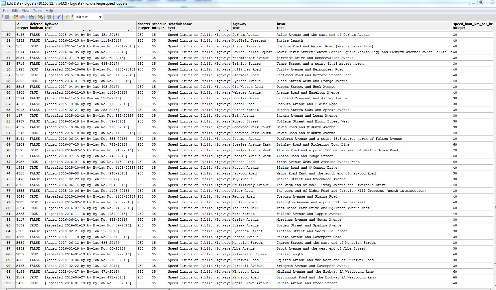

# Posted Speed Limit Update (Original Documentation - Summer 2018)

The `tcl_speed_limit` table contained a version of the 2013 Toronto centreline with the posted speed limits. However, there were updates to the speed limit in certain areas of the city that were not reflected in this table. The table `speed_update` had all of the speed limit updates in the form of text. Every row described the street that the change took place on the intersections between which the change occurred. They did not have any geographic component. 

The general workflow was: 
1. Find the intersections between which the speed changes occured by matching the intersections described in the `speed_update` table to the `centreline_intersection` table
2. Create line between the identified intersections
3. Match the created lines to the appropriate centreline segment
4. Update the matched centreline segments with their new speed limits 

We started with a table that looked like this: 


The first step in updating the `tcl_speed_limit` table was to find the intersections between which the changes occured. Since there was no geographic component to the `speed_update` table, the only way to match the updates to appropriate intersections was through the text descriptions of the intersections. However, there were some formatting differences between the speed_update and centreline_intersection table, so the formatting of the `speed_update` table was altered and then the tables were joined using the PostgreSQL levenshtein fuzzy matching function. 

The `speed_update` table contained two text columns to indicate the location of the changes. The first was `highway`, which said which street the change occurred on. The second was `btwn`, which indicated between which intersections/streets/points the changes occureed along the highway street. 

The cell below contains the code that was used to create `btwn1`, `btwn2`, and to update the formatting of `btwn1`, `btwn2`, and `highway2` (which is a copy of highway) to better match the `centreline_intersection` table (a table which contains all the intersections in Toronto with their geometry). I formatted using replace and reg-ex. The formatting included removing any text between brackets (and the brackets themseleves), and removing phrases like 'at the east end of ...', 'a point 100 metres northeast of ...'. Additionally, the `centreline_intersection` table uses abbreviations like 'N' instead of 'North', and 'St' instead of 'Street', so these changes were made to the three columns as well. 

```sql
-- split the btwn variable into the two street names

UPDATE vz_challenge.speed_update 
SET btwn1 = 
(CASE WHEN split_part(btwn, ' and ', 2) <> ''
    THEN split_part(btwn, ' and ', 1)
    ELSE split_part(btwn, ' to ', 1)
    END),
btwn2 = (CASE WHEN split_part(btwn, ' and ', 2) <> ''
    THEN split_part(btwn, ' and ', 2)
    ELSE split_part(btwn, ' to ', 2)
    END);
   
   
-- split centreline_intersection

-- make my own copy of the table because it wont allow me to modify original
SELECT * INTO crosic.centreline_intersection FROM gis.centreline_intersection; 

-- add new columns
ALTER TABLE crosic.centreline_intersection ADD street1 text, ADD street2 text, ADD street3 text, ADD street4 text; 

-- split the intersec5 into two street names
-- UPDATE crosic.centreline_intersection 
-- SET street1 = split_part(intersec5, ' / ', 1), street2 = split_part(intersec5, ' / ', 2);


-- when 4 street names are needed
UPDATE crosic.centreline_intersection 
SET street1 = (string_to_array(intersec5, ' / '))[1], street2 = (string_to_array(intersec5, ' / '))[2],
street3 = ( 
CASE 
WHEN (array_length(string_to_array(intersec5, ' / '), 1) > 2)
THEN (string_to_array(intersec5, ' / '))[3]
ELSE ''
END), 
street4 = ( 
CASE 
WHEN (array_length(string_to_array(intersec5, ' / '), 1) > 3)
THEN (string_to_array(intersec5, ' / '))[4]
ELSE ''
END);


-- fix btwn1

-- try regex 
-- 'The (north|south|east|west|northwest|northeast|southwest|southeast) end of'
-- https://www.ibm.com/support/knowledgecenter/en/SS8NLW_12.0.0/com.ibm.swg.im.infosphere.dataexpl.engine.doc/c_posix-regex-examples.html

UPDATE vz_challenge.speed_update
SET btwn1 = regexp_REPLACE(btwn1, 'The (north|south|east|west|northwest|northeast|southwest|southeast) end of ', '', 'g');

-- replace stuff in brackets
UPDATE vz_challenge.speed_update
SET btwn1 = regexp_REPLACE(btwn1, '\(.*\)', '', 'g');

UPDATE vz_challenge.speed_update
SET btwn1 = regexp_REPLACE(btwn1, 'A point [0123456789.]* metres (north|south|east|west|northwest|northeast|southwest|southeast)
of ', '', 'g');

UPDATE vz_challenge.speed_update
SET btwn1 = 
regexp_REPLACE(btwn1, 'A point [0123456789.]* metres (north|south|east|west|northwest|northeast|southwest|southeast)','', 'g');

UPDATE vz_challenge.speed_update
SET btwn1 = regexp_REPLACE(btwn1, 'A point approximately [0123456789.]* metres (north|south|east|west|northwest|northeast|southwest|southeast) of ', '', 'g');

-- make btwn1 it match centreline styling
UPDATE vz_challenge.speed_update
SET btwn1 = regexp_REPLACE(btwn1, 'Drive', 'Dr', 'g');

UPDATE vz_challenge.speed_update
SET btwn1 = regexp_REPLACE(btwn1, 'Avenue', 'Ave', 'g');

UPDATE vz_challenge.speed_update
SET btwn1 = regexp_REPLACE(btwn1, 'Street', 'St', 'g');

UPDATE vz_challenge.speed_update
SET btwn1 = regexp_REPLACE(btwn1, 'Road', 'Rd', 'g');

UPDATE vz_challenge.speed_update
SET btwn1 = regexp_REPLACE(btwn1, 'Crescent', 'Cres', 'g');

UPDATE vz_challenge.speed_update
SET btwn1 = regexp_REPLACE(btwn1, 'Boulevard', 'Blvd', 'g');

UPDATE vz_challenge.speed_update
SET btwn1 = regexp_REPLACE(btwn1, 'East', 'E', 'g');

UPDATE vz_challenge.speed_update
SET btwn1 = regexp_REPLACE(btwn1, 'West', 'W', 'g');

UPDATE vz_challenge.speed_update
SET btwn1 = regexp_REPLACE(btwn1, 'North', 'N', 'g');

UPDATE vz_challenge.speed_update
SET btwn1 = regexp_REPLACE(btwn1, 'South', 'S', 'g');

UPDATE vz_challenge.speed_update
SET btwn1 = regexp_REPLACE(btwn1, 'Parkway', 'Pkwy', 'g');

UPDATE vz_challenge.speed_update
SET btwn1 = regexp_REPLACE(btwn1, 'Place', 'Pl', 'g');

UPDATE vz_challenge.speed_update
SET btwn1 = regexp_REPLACE(btwn1, 'Square', 'Sq', 'g');

UPDATE vz_challenge.speed_update
SET btwn1 = regexp_REPLACE(btwn1, 'Circle', 'Crcl', 'g');

UPDATE vz_challenge.speed_update
SET btwn1 = regexp_REPLACE(btwn1, 'Trail', 'Trl', 'g');

UPDATE vz_challenge.speed_update
SET btwn1 = regexp_REPLACE(btwn1, 'Gardens', 'Gdns', 'g');


-- fix btwn2 formatting 

UPDATE vz_challenge.speed_update
SET btwn2 = 
regexp_REPLACE(btwn2, 'The (north|south|east|west|northwest|northeast|southwest|southeast) end of ', '', 'g');

UPDATE vz_challenge.speed_update
SET btwn2 = 
regexp_REPLACE(btwn2, 'the (north|south|east|west|northwest|northeast|southwest|southeast|north-east|north-west|south-
east|south-west) end of ', '', 'g');

-- replace stuff in brackets
UPDATE vz_challenge.speed_update
SET btwn2 = regexp_REPLACE(btwn2, '\(.*\)', '', 'g');

UPDATE vz_challenge.speed_update
SET btwn2 = 
regexp_REPLACE(btwn2, 'A point [0123456789.]* metres (north|south|east|west|northwest|northeast|southwest|southeast) of ',
'', 'g');

UPDATE vz_challenge.speed_update
SET btwn2 = 
regexp_REPLACE(btwn2, 'A point [0123456789.]* metres (north|south|east|west|northwest|northeast|southwest|southeast)',
'', 'g');

UPDATE vz_challenge.speed_update
SET btwn2 = 
regexp_REPLACE(btwn2, 'a point [0123456789.]* metres (north|south|east|west|northwest|northeast|southwest|southeast) of ',
'', 'g');

UPDATE vz_challenge.speed_update
SET btwn2 = regexp_REPLACE(btwn2, 'a point [0123456789.]* metres (north|south|east|west|northwest|northeast|southwest|southeast)', '', 'g');

UPDATE vz_challenge.speed_update
SET btwn2 = regexp_REPLACE(btwn2, 'A point approximately [0123456789.]* metres (north|south|east|west|northwest|northeast|southwest|southeast) of ', '', 'g');

UPDATE vz_challenge.speed_update
SET btwn2 = regexp_REPLACE(btwn2, 'a point approximately [0123456789.]* metres (north|south|east|west|northwest|northeast|southwest|southeast) of ', '', 'g');

UPDATE vz_challenge.speed_update
SET btwn2 = regexp_REPLACE(btwn2, 'Drive', 'Dr', 'g');

UPDATE vz_challenge.speed_update
SET btwn2 = regexp_REPLACE(btwn2, 'Avenue', 'Ave', 'g');

UPDATE vz_challenge.speed_update
SET btwn2 = regexp_REPLACE(btwn2, 'Street', 'St', 'g');

UPDATE vz_challenge.speed_update
SET btwn2 = regexp_REPLACE(btwn2, 'Road', 'Rd', 'g');

UPDATE vz_challenge.speed_update
SET btwn2= regexp_REPLACE(btwn2, 'Crescent', 'Cres', 'g');

UPDATE vz_challenge.speed_update
SET btwn2 = regexp_REPLACE(btwn2, 'Boulevard', 'Blvd', 'g');

UPDATE vz_challenge.speed_update
SET btwn2 = regexp_REPLACE(btwn2, 'East', 'E', 'g');

UPDATE vz_challenge.speed_update
SET btwn2 = regexp_REPLACE(btwn2, 'West', 'W', 'g');

UPDATE vz_challenge.speed_update
SET btwn2 = regexp_REPLACE(btwn2, 'North', 'N', 'g');

UPDATE vz_challenge.speed_update
SET btwn2 = regexp_REPLACE(btwn2, 'South', 'S', 'g');

UPDATE vz_challenge.speed_update
SET btwn2 = regexp_REPLACE(btwn2, 'Parkway', 'Pkwy', 'g');

UPDATE vz_challenge.speed_update
SET btwn2 = regexp_REPLACE(btwn2, 'Place', 'Pl', 'g');

UPDATE vz_challenge.speed_update
SET btwn2 = regexp_REPLACE(btwn2, 'Square', 'Sq', 'g');

UPDATE vz_challenge.speed_update
SET btwn2 = regexp_REPLACE(btwn2, 'Circle', 'Crcl', 'g');

UPDATE vz_challenge.speed_update
SET btwn2 = regexp_REPLACE(btwn2, 'Trail', 'Trl', 'g');

UPDATE vz_challenge.speed_update
SET btwn2 = regexp_REPLACE(btwn2, 'Gardens', 'Gdns', 'g');


-- fix highway column

-- replace stuff in brackets
UPDATE vz_challenge.speed_update
SET highway2 = regexp_REPLACE(highway2, '\(.*\)', '', 'g');

UPDATE vz_challenge.speed_update
SET highway2 = regexp_REPLACE(highway2, 'Drive', 'Dr', 'g');

UPDATE vz_challenge.speed_update
SET highway2 = regexp_REPLACE(highway2, 'Avenue', 'Ave', 'g');

UPDATE vz_challenge.speed_update
SET highway2 = regexp_REPLACE(highway2, 'Street', 'St', 'g');

UPDATE vz_challenge.speed_update
SET highway2 = regexp_REPLACE(highway2, 'Road', 'Rd', 'g');

UPDATE vz_challenge.speed_update
SET highway2 = regexp_REPLACE(highway2, 'Crescent', 'Cres', 'g');

UPDATE vz_challenge.speed_update
SET highway2 = regexp_REPLACE(highway2, 'Boulevard', 'Blvd', 'g');

UPDATE vz_challenge.speed_update
SET highway2 = regexp_REPLACE(highway2, 'East', 'E', 'g');

UPDATE vz_challenge.speed_update
SET highway2 = regexp_REPLACE(highway2, 'West', 'W', 'g');

UPDATE vz_challenge.speed_update
SET highway2 = regexp_REPLACE(highway2, 'North', 'N', 'g');

UPDATE vz_challenge.speed_update
SET highway2 = regexp_REPLACE(highway2, 'South', 'S', 'g');

UPDATE vz_challenge.speed_update
SET highway2 = regexp_REPLACE(highway2, 'Parkway', 'Pkwy', 'g');

UPDATE vz_challenge.speed_update
SET highway2 = regexp_REPLACE(highway2, 'Place', 'Pl', 'g');

UPDATE vz_challenge.speed_update
SET highway2 = regexp_REPLACE(highway2, 'Square', 'Sq', 'g');

UPDATE vz_challenge.speed_update
SET highway2 = regexp_REPLACE(highway2, 'Circle', 'Crcl', 'g');

UPDATE vz_challenge.speed_update
SET highway2 = regexp_REPLACE(highway2, 'Trail', 'Trl', 'g');

UPDATE vz_challenge.speed_update
SET highway2 = regexp_REPLACE(highway2, 'Gardens', 'Gdns', 'g');
```

## Fuzzy Matching

The cell below contains the code for doing the [fuzzy matching](https://www.techopedia.com/definition/24183/fuzzy-matching) using the [levenstein distance](https://en.wikipedia.org/wiki/Levenshtein_distance). The street names from the `speed_update` file were matched to the names of the streets in the `centreline_intersection` file, so `oid`'s (intersection ID's) could be assigned to the entries in the `speed_update` challenge. There were three queries completed, in a specific order. The queries were done in a specific order because the streets that were Cul de Sacs and pseudo-intersections were originally being incorrectly matched to streets that were not Cul de Sacs and pseudo-intersections. The query that was responsible for assigning the `oid1` to the intersection of `highway2` and `btwn1` is indicated with the `query1` column, and the query that was responsible for assigning the `oid2` to the intersection of `highway2` and `btwn2` is indicated with the `query2` column.


```sql
UPDATE vz_challenge.speed_update
SET query1 = 0, query2 = 0, SET oid1 = 0; 


-- part 2: now try and deal with pseudo streets that are unassigned 
WITH join1 AS 
(SELECT DISTINCT ON (vzID), intersections.objectid AS oid1, vz_challenge.speed_update.id AS vzID
FROM (SELECT DISTINCT objectid, street FROM  gis.centreline_intersection_streets 
WHERE gis.centreline_intersection_streets.classifi6 NOT IN ('SEUML','','CDSSL','SEUSL')) AS intersections, 
vz_challenge.speed_update
WHERE (levenshtein(intersections.street, vz_challenge.speed_update.highway2, 1, 1, 2) < 4 
OR levenshtein(intersections.street, vz_challenge.speed_update.btwn1, 1, 1, 2) < 4) 
GROUP BY intersections.objectid, vz_challenge.speed_update.highway2, vz_challenge.speed_update.btwn1, 
vz_challenge.speed_update.id
HAVING COUNT(intersections.street) > 1
ORDER BY vzID, AVG(LEAST(levenshtein(intersections.street, vz_challenge.speed_update.highway2, 1, 1, 2), 
levenshtein(intersections.street, vz_challenge.speed_update.btwn1, 1, 1, 2))))

-- update with data from other table 
UPDATE vz_challenge.speed_update 
SET oid1 = join1.oid1
FROM join1
WHERE vz_challenge.speed_update.id = join1.vzID; 


-- raphs method, now with btwn2 

-- reset int_id2
UPDATE vz_challenge.speed_update
SET oid2 = 0;


WITH join2 AS
(SELECT DISTINCT ON (vzID) intersections.objectid AS oid2, vz_challenge.speed_update.id AS vzID
FROM (SELECT DISTINCT objectid, street FROM  gis.centreline_intersection_streets 
WHERE gis.centreline_intersection_streets.classifi6 NOT IN ('SEUML','','CDSSL','SEUSL')) AS intersections, 
vz_challenge.speed_update
WHERE (levenshtein(intersections.street, vz_challenge.speed_update.highway2, 1, 1, 2) < 4 OR 
levenshtein(intersections.street, vz_challenge.speed_update.btwn2, 1, 1, 2) < 4) 
GROUP BY intersections.objectid, vz_challenge.speed_update.highway2, vz_challenge.speed_update.btwn2, 
vz_challenge.speed_update.id
HAVING COUNT(intersections.street) > 1
ORDER BY vzID, AVG(LEAST(levenshtein(intersections.street, vz_challenge.speed_update.highway2, 1, 1, 2), 
levenshtein(intersections.street, vz_challenge.speed_update.btwn2, 1, 1, 2))))


-- update with data from other table 
UPDATE vz_challenge.speed_update 
SET oid2 = join2.oid2
FROM join2
WHERE vz_challenge.speed_update.id = join2.vzID;

-- update query id
UPDATE vz_challenge.speed_update 
SET query1 = 1
WHERE oid1 <> 0; 

UPDATE vz_challenge.speed_update 
SET query2 = 1
WHERE oid2 <> 0; 

-- btwn1
WITH cds_querybtwn1 (oid1, vzID) AS 
(SELECT DISTINCT ON (vzID), intersections.objectid AS oid1, vz_challenge.speed_update.id AS vzID
FROM (SELECT DISTINCT objectid, street FROM  gis.centreline_intersection_streets 
WHERE gis.centreline_intersection_streets.classifi6 = 'CDSSL') AS intersections, 
vz_challenge.speed_update
WHERE vz_challenge.speed_update.btwn1 = vz_challenge.speed_update.highway2 AND 
levenshtein(intersections.street, vz_challenge.speed_update.highway2, 1, 1, 2) < 4 
GROUP BY intersections.objectid, vz_challenge.speed_update.id
HAVING COUNT(intersections.street) = 1
ORDER BY vzID, AVG(levenshtein(intersections.street, vz_challenge.speed_update.highway2, 1, 1, 2)))

UPDATE vz_challenge.speed_update vz
SET oid1 = cds.oid1
FROM cds_querybtwn1 cds
WHERE vz.id = cds.vzID AND vz.btwn1 = vz.highway2 and vz.oid1 = 0; 


-- btwn2
WITH cds_querybtwn2 (oid2, vzID) AS 
(SELECT DISTINCT ON (vzID), intersections.objectid AS oid2, vz_challenge.speed_update.id AS vzID
FROM (SELECT DISTINCT objectid, street FROM gis.centreline_intersection_streets 
WHERE gis.centreline_intersection_streets.classifi6 = 'CDSSL') AS intersections, 
vz_challenge.speed_update
WHERE vz_challenge.speed_update.btwn2 = vz_challenge.speed_update.highway2 AND 
levenshtein(intersections.street, vz_challenge.speed_update.highway2, 1, 1, 2) < 4
GROUP BY intersections.objectid,  vz_challenge.speed_update.id
HAVING COUNT(intersections.street) = 1
ORDER BY vzID, AVG(levenshtein(intersections.street, vz_challenge.speed_update.highway2, 1, 1, 2)))

UPDATE vz_challenge.speed_update vz
SET oid2 = cds.oid2
FROM cds_querybtwn2 cds
WHERE vz.id = cds.vzID and btwn2 = highway2 and vz.oid2 = 0; 


-- update query id
UPDATE vz_challenge.speed_update 
SET query1 = 2
WHERE oid1 <> 0 AND query1 = 0; 

UPDATE vz_challenge.speed_update 
SET query2 = 2
WHERE oid2 <> 0 AND query2 = 0; 


-- btwn1
WITH cds_querybtwn1 (oid1, vzID) AS 
(SELECT DISTINCT ON (vzID), intersections.objectid AS oid1, vz_challenge.speed_update.id AS vzID
FROM (SELECT DISTINCT objectid, street FROM  gis.centreline_intersection_streets WHERE gis.centreline_intersection_streets.classifi6 IN ('SEUML','SEUSL')) AS intersections, 
vz_challenge.speed_update
WHERE vz_challenge.speed_update.btwn1 = vz_challenge.speed_update.highway2 AND 
levenshtein(intersections.street, vz_challenge.speed_update.highway2, 1, 1, 2) < 6 
GROUP BY intersections.objectid, vz_challenge.speed_update.highway2, vz_challenge.speed_update.btwn1, vz_challenge.speed_update.id
HAVING COUNT(intersections.street) = 1
ORDER BY vzID, AVG(levenshtein(intersections.street, vz_challenge.speed_update.highway2, 1, 1, 2)))

UPDATE vz_challenge.speed_update vz
SET oid1 = cds.oid1
FROM cds_querybtwn1 cds
WHERE vz.id = cds.vzID AND vz.btwn1 = vz.highway2 and vz.oid1 = 0; 


-- btwn2
WITH cds_querybtwn2 (oid2, vzID) AS 
(SELECT DISTINCT ON (vzID), intersections.objectid AS oid2, vz_challenge.speed_update.id AS vzID
FROM (SELECT DISTINCT objectid, street FROM  gis.centreline_intersection_streets WHERE gis.centreline_intersection_streets.classifi6 IN ('SEUML','SEUSL')) AS intersections, 
vz_challenge.speed_update
WHERE vz_challenge.speed_update.btwn2 = vz_challenge.speed_update.highway2 AND 
levenshtein(intersections.street, vz_challenge.speed_update.highway2, 1, 1, 2) < 6
GROUP BY intersections.objectid, vz_challenge.speed_update.highway2, vz_challenge.speed_update.btwn2, vz_challenge.speed_update.id
HAVING COUNT(intersections.street) = 1
ORDER BY vzID, AVG(levenshtein(intersections.street, vz_challenge.speed_update.highway2, 1, 1, 2)))

UPDATE vz_challenge.speed_update vz
SET oid2 = cds.oid2
FROM cds_querybtwn2 cds
WHERE vz.id = cds.vzID and btwn2 = highway2 and vz.oid2 = 0; 


-- update query id
UPDATE vz_challenge.speed_update 
SET query1 = 3
WHERE oid1 <> 0 AND query1 = 0; 

UPDATE vz_challenge.speed_update 
SET query2 = 3
WHERE oid2 <> 0 AND query2 = 0; 

 

-- btwn1
WITH cds_querybtwn1 (oid1, vzID) AS 
(SELECT DISTINCT ON (vzID), intersections.objectid AS oid1, vz_challenge.speed_update.id AS vzID
FROM (SELECT DISTINCT objectid, street FROM  gis.centreline_intersection_streets WHERE gis.centreline_intersection_streets.classifi6 = 'SEUSL' AND gis.centreline_intersection_streets.elevatio10 = 'Pseudo') 
AS intersections, vz_challenge.speed_update
WHERE (levenshtein(intersections.street, vz_challenge.speed_update.highway2, 1, 1, 2) < 6 OR 
levenshtein(intersections.street, vz_challenge.speed_update.btwn1, 1, 1, 2) < 4) 
GROUP BY intersections.objectid, vz_challenge.speed_update.id
HAVING COUNT(intersections.street) > 1
ORDER BY vzID, AVG(LEAST(levenshtein(intersections.street, vz_challenge.speed_update.highway2, 1, 1, 2), 
levenshtein(intersections.street, vz_challenge.speed_update.btwn1, 1, 1, 2))))

UPDATE vz_challenge.speed_update vz
SET oid1 = cds.oid1
FROM cds_querybtwn1 cds
WHERE vz.id = cds.vzID AND vz.btwn1 = vz.highway2 and vz.oid1 = 0; 


-- btwn2
WITH cds_querybtwn2 (oid2, vzID) AS 
(SELECT DISTINCT ON (vzID), intersections.objectid AS oid2, vz_challenge.speed_update.id AS vzID
FROM (SELECT DISTINCT objectid, street FROM  gis.centreline_intersection_streets WHERE gis.centreline_intersection_streets.classifi6 = 'SEUSL' AND gis.centreline_intersection_streets.elevatio10 = 'Pseudo') 
AS intersections, vz_challenge.speed_update
WHERE (levenshtein(intersections.street, vz_challenge.speed_update.highway2, 1, 1, 2) < 4 OR 
levenshtein(intersections.street, vz_challenge.speed_update.btwn2, 1, 1, 2) < 4) 
GROUP BY intersections.objectid,  vz_challenge.speed_update.id
HAVING COUNT(intersections.street) > 1
ORDER BY vzID, AVG(LEAST(levenshtein(intersections.street, vz_challenge.speed_update.highway2, 1, 1, 2), 
levenshtein(intersections.street, vz_challenge.speed_update.btwn2, 1, 1, 2))))


UPDATE vz_challenge.speed_update vz
SET oid2 = cds.oid2
FROM cds_querybtwn2 cds
WHERE vz.id = cds.vzID and btwn2 = highway2 and vz.oid2 = 0; 


-- update query id
UPDATE vz_challenge.speed_update 
SET query1 = 4
WHERE oid1 <> 0 AND query1 = 0; 

UPDATE vz_challenge.speed_update 
SET query2 = 4
WHERE oid2 <> 0 AND query2 = 0; 

```

## Create lines between intersections
Below is the code that created the lines between the assigned intersections from the `speed_update` file. 

```sql 
DROP TABLE IF EXISTS crosic.bylaw_lines2; 

-- get lat/long and info for oid1
WITH latlong1 AS
(SELECT oid1, oid2, crosic.centreline_intersection.latitude AS lat1, crosic.centreline_intersection.longitude AS long1, 
crosic.centreline_intersection.x AS easting1, crosic.centreline_intersection.y AS northing1,
vz_challenge.speed_update.deleted, vz_challenge.speed_update.id, vz_challenge.speed_update.btwn,
vz_challenge.speed_update.btwn1, vz_challenge.speed_update.btwn2, vz_challenge.speed_update.highway,
vz_challenge.speed_update.highway2, vz_challenge.speed_update.speed_limit_km_per_hr new_speed
FROM crosic.centreline_intersection JOIN  vz_challenge.speed_update 
ON crosic.centreline_intersection.objectid = vz_challenge.speed_update.oid1
WHERE oid1 <> 0 and oid1 <> -1 and oid1 <> 9999 and deleted = 'FALSE'), 

-- join info from latlong1 and with lat/long and info for oid2
latlong2 AS 
(SELECT latlong1.id, oid1, oid2, lat1, long1, northing1, easting1, latlong1.btwn1, latlong1.btwn2, latlong1.highway2,
latlong1.new_speed, crosic.centreline_intersection.latitude AS lat2, crosic.centreline_intersection.longitude AS long2, 
crosic.centreline_intersection.x AS easting2, crosic.centreline_intersection.y AS northing2, latlong1.btwn, 
latlong1.highway
FROM crosic.centreline_intersection JOIN latlong1 ON crosic.centreline_intersection.objectid = latlong1.oid2
WHERE oid2 <> 0 and oid2 <> -1 and oid2 <> 9999 and deleted = 'FALSE')

-- create geoms and lines from lat/longs
SELECT DISTINCT(latlong2.id), latlong2.oid1, latlong2.oid2, latlong2.lat1, latlong2.long1, latlong2.easting1, 
latlong2.northing1, latlong2.lat2, latlong2.long2, latlong2.easting2, latlong2.northing2,
latlong2.btwn, latlong2.btwn1, latlong2.btwn2,latlong2.highway, latlong2.highway2,latlong2.new_speed,
ST_MakeLine(ST_MakePoint(latlong2.long1, latlong2.lat1), ST_MakePoint(latlong2.long2, latlong2.lat2)) AS line, 
ST_LENGTH(ST_MakeLine(ST_MakePoint(easting1, northing1), ST_MakePoint(easting2, northing2))) AS length 
INTO crosic.bylaw_lines2
FROM latlong2
WHERE ST_LENGTH(ST_MakeLine(ST_MakePoint(easting1, northing1), ST_MakePoint(easting2, northing2))) > 11; 

```

## Assign lines to centreline segment(s)

The next step was to take the lines and assign the lines to the centreline segments that match them. This process is called creating [conflation](http://wiki.gis.com/wiki/index.php/Conflation) networks. A buffer was placed around each line that was created in the previous step. The buffers were 3 times the length of the line wide and had a [flat endcap](http://www.postgis.net/docs/ST_Buffer.html). If more than 90% of a centreline segment was located inside of the buffer and if the names of streets had a levenshtein distance of less than 4, then the centreline was matched to the line and added to the conflation network file. This file (`crosic.conflate2`) now holds all of the centreline segments from `tcl_speed_limit` that need to be updated.

```sql
DROP TABLE IF EXISTS crosic.conflate2; 

SELECT DISTINCT ON(geo_id) geo_id, id AS bylaw_id, lf_name, btwn, highway, highway2, geom, new_speed
INTO crosic.conflate2

FROM crosic.bylaw_lines2 b INNER JOIN gis.tcl_speed_limit s 
ON 
ST_DWithin( ST_Transform(s.geom, 32190) ,  ST_BUFFER(ST_Transform(ST_SetSRID(line, 4326), 32190), 3*b.length, 'endcap=flat join=round') , 10)

WHERE levenshtein(LOWER(b.highway2), LOWER(s.lf_name), 1, 1, 2) < 4 
AND ST_Length(st_intersection(ST_BUFFER(ST_Transform(ST_SetSRID(line, 4326), 32190), 3*b.length, 'endcap=flat join=round') , ST_Transform(s.geom, 32190))) /ST_Length(ST_Transform(s.geom, 32190)) > 0.9
ORDER BY geo_id; 
```
