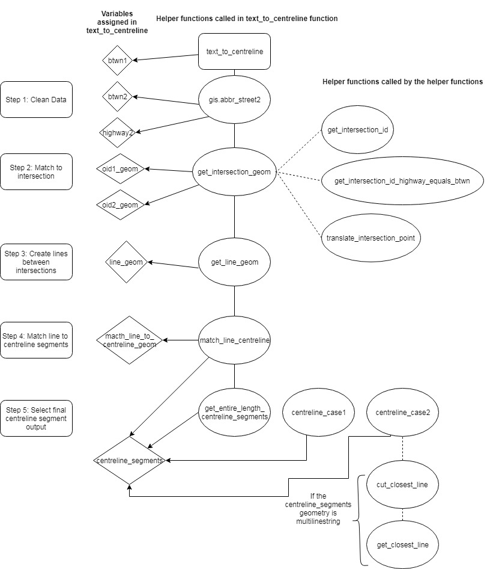
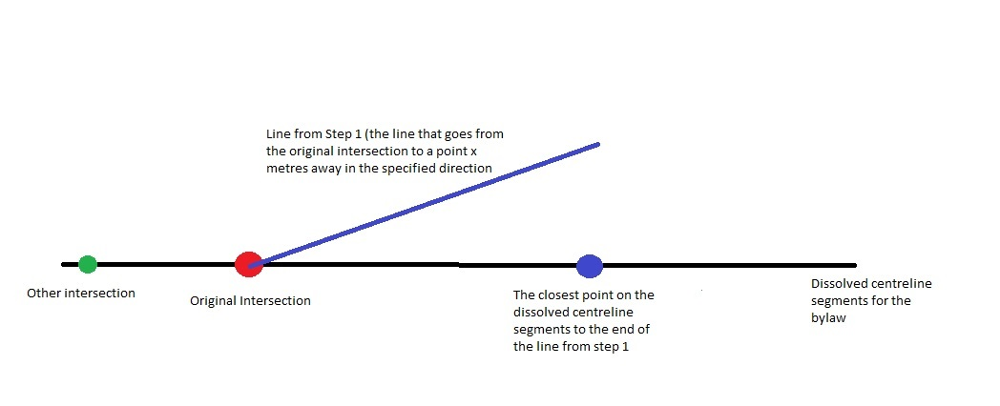
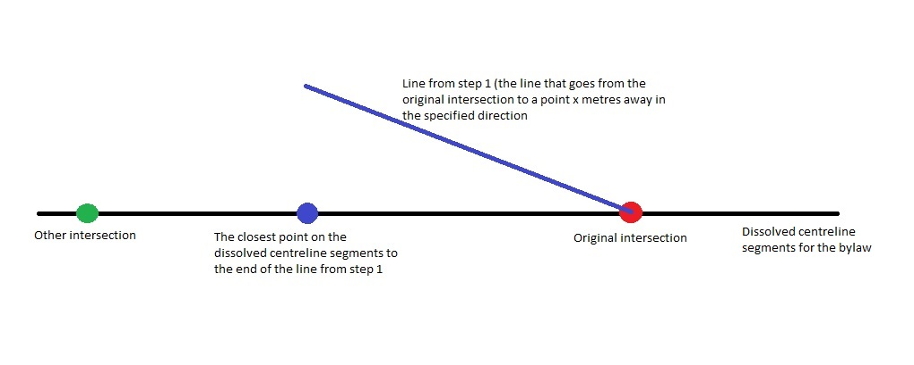
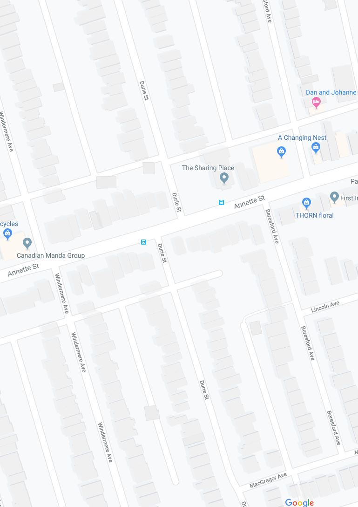

# 
Text Description to Centreline Geometry Automation Official Doc

## 
August 2019

## Intro

This is a `README` for the `text_to_centreline(highway, fr, t)` function, which is written in `postgresql` (currently living in the `crosic` schema). The general purpose of this function is to take input of a text description of a street location in the City of Toronto, and make an output of centreline segments that match this description. The input descriptions typically state the street that the bylaw occurs on and the two intersections between which the bylaw occrus. For example, you could use the function to get the centreline segments of Bloor Street between Royal York Road and St George Street.

The function is supposed to be mainly used for City of Toronto [transportation bylaw data](https://open.toronto.ca/dataset/traffic-and-parking-by-law-schedules/), for example we have already used previous versions of this process for [posted speed limits](https://github.com/CityofToronto/bdit_data-sources/tree/master/gis/posted_speed_limit_update) on streets in the City, locations of [community safety zones](https://github.com/CityofToronto/bdit_vz_programs/tree/master/safety_zones/commuity_safety_zone_bylaws), [turn restrictions](https://github.com/CityofToronto/bdit_vz_programs/blob/master/notebooks/Turn%20Restrictions.ipynb), etc. The function can handle most bylaws, even more advanced cases. Any limitations that we are currently aware of will be listed somewhere in this document. It also should be noted that some bylaws are incorrect (for many reasons, such as a described intersection not existing), and our function probably cannot match a lot of these bylaws, since the data is incorrect.

## Function Inputs

The function takes three inputs, called `highway`, `frm`, and `to`. They are called these names to emmulate the names of columns in bylaw certain documents. There are two types of ways that bylaws are explained in documents and they can influence what you input to the function.

If you have a bylaw written like:

|highway|from|to|
|--------|---|---|
| Bloor Street |Royal York Road | St George Street |

Then I'm sure its obvious what parameter is what.

However there is a different format:

|highway|between|
|--------|---|
| Bloor Street|Between Royal York Road and St George Street |

In this case you would input:
- `Bloor Street` as `highway`
- `Between Royal York Road and St George Street` as `frm`
- `NULL` as `to`.

# How the Function Works

The main steps for every type of input (complex or not so complex) are:

1. Cleaning the data
2. Match location text data to intersections
3. Create lines from matched intersections and match lines to centreline segments

The process will be explained in futher detail below. The functions called/variables assinged by these functions can be visualized with the following flow chart 

## Step 1: Clean the data

The first step is to clean the location description data so it can easily be matched to ID's in the `gis.centreline_intersection` table.

We want to be able to extract:

1. `highway2`: the street name where the bylaw occurs (written in a format that is easily matchable to the intersections table)
2. `btwn1` and `btwn2`: the name of both the streets between which the bylaw occurs
3. `metres_btwn1` and `metres_btwn2`: will be null for everything except for [special case 1 and 2](#Special-Cases). These are the number of metres away from the intersections (intersections meaning intersection of `highway2` and `btwn1` and/or `highway2` and `btwn2`) that the bylaws occur
4. `direction_btwn1` and `direction_btwn2`: will be null for everything except for [special case 1 and 2](#Special-Cases). These are directions away from the intersections (intersections meaning intersection of `highway2` and `btwn1` and/or `highway2` and `btwn2`) that the bylaws occur

There are different cases for how the data is input ([see above](#Function-Inputs)), so both of those cases should have to be cleaned differently, hence there is a lot of code like: `CASE WHEN t IS NULL THEN ` .... `ELSE`. An idea to make this cleaner in the future could be to make 2 different functions for cleaning inputs.

The `gis.abbr_street2` function is called a lot in the cleaning process. It is a function that replaces string segments such as ' Street' with ' St', and ' North' with ' N'.

## Step 2: Match the location text data to intersections

The function `get_intersection_geom` is the main function that is called to get the geometry of the intersections between which the bylaw is in effect. The function returns an array with the geometry of the intersection and the `objectid` (unique `ID`) of the intersection. If the `direction` and `metres` values that are inputted to the function are not `NULL`, then the function returns a translated intersection geometry (translated in the direction specified by the number of metres specified). The function takes a value `not_int_id` as an input. This is an intersection `int_id` (intersection `ID`) that we do not want the function to return. We use `int_id` instead of `objectid` since sometimes there are intersection points that are in the exact same location but have different `objectid` values. This is a parameter to this function because sometimes streets can intersect more than once, and we do not want the algorithm to match to the same intersection twice.

In  most cases, the function `get_intersection_geom` calls on another function called `get_intersection_id`. This function returns the `objectid` and `intersection id` of the intersection, as well as how close the match was (where closeness is measured by levenshtein distance). The query in this function works by gathering all of the streets from the City of Toronto intersection streets table that have the same/very similar names to the streets that intersect each other to create an end point of the bylaw location. If there are more than one street with the same unique intersection ID in this subset, then this means that both streets in the enpoint of the bylaw have been matched to streets in the City of Toronto intersection. We can use a `HAVING` clause (i.e. `HAVING COUNT(intersections.street) > 1`) to ensure that only the intersections that have been matched to both street names are chosen. The `gis.centreline_intersection_streets` view (that is called in this query) assigns a unique ID to each intersection in the City of Toronto (`gis.centreline_intersection`). Each row contains one street name from an intersection and the ID associated with the intersection.

If the names for `highway` and `btwn` are the same, the `get_intersection_geom` calls on the function called `get_intersection_id_highway_equals_btwn`. This function is intended for cases where the intersection that we want is a cul de sac or a dead end or a pseudo intersection. In these cases the intersection would just be the name of the street. `not_int_id` is a parameter of this function as well since some streets both start and end with an intersection that is a cul de sac or pseudo intersection. The process to find the appropriate intersection is very similar to the `get_intersection_id` function, except it does not have the `HAVING COUNT(intersections.street) > 1`. This is because cul de sac or pseudo intersections intersection only have one entry in the `gis.centreline_intersection_streets` view (since there is only one road involved in the intersection).

The `oid1_geom` and `oid2_geom` values that are assigned in the `text_to_centreline` function and represented the (sometimes) translated geometry of the intersections.

## Step 3: Create lines from matched intersections and match lines to centreline segments

### Create line_geom:

Take the intersection points (or translated intersection points if the points were translated) that were found in the previous step (i.e. `oid1_geom`, `oid2_geom`) and create lines between these points. The `line_geom` variable is created by calling the `get_line_geom` function. Lines are less than `11` metres long were filtered out, since one of the intersections was most likely incorrectly matched.

### Match line to centreline:

Main Steps:
1. Create a large buffer around the `line_geom`
2. Select centreline segments from `gis.centreline` that have the right name that are inside of the buffer

Sometimes the name of the street in the `gis.centreline` table is not the same as the name that is imputted to the `text_to_centreline` function and processed into `highway2`. Also, sometimes streets with names that are very similar to each other exist very close to each other. So it is very important to first figure out how the street name is represented in the `gis.centreline` table. Thus, the first thing that the `match_line_to_centreline` function does is find one single street name that is closest to the `highway2` name, that is within the buffer. This is done by first selecting all of the streets within the buffer that  have a very similar (if not exactly the same) street name (i.e. segments with street names with a [Levenshtein distance](https://www.cuelogic.com/blog/the-levenshtein-algorithm/) of less than 3). They are put into the array in order of how close they are to the `highway2` name. The array is called `street_name_arr` and is created as a way to QC the matched later on. The first values of the array is saved as the `street_name` variable.

The `match_line_to_centreline` function matches `line_geom` to centreline segments. If both `metres_btwn1` and `metres_btwn2` are `NULL`, it does this by creating a buffer that is 3 times the length of `line_geom` around `line_geom`. It then catches all of the segments in that buffer that have the same name as `street_name` where more than 90% of the segment is within the buffer.

If `metres_btwn2` and/or `metres_btwn1` is not `NULL` than the buffer length is `10` times the value of `COALESCE(metres_btwn1, metres_btwn2)` and the centreline segment can be within `30` metres of the end of the buffer. Also, this case does not require the 90% of the centreline segments to intersect with the buffer. The reason why there is a 30 metre extension at the end of the buffer/`line_geom` and there is no `90%` rule in the case where `metres_btwn1` or `metres_btwn2` are not `NULL` is because we want to include the street segments that intersect with the intersections that are not inside of our originally drawn buffer. The type of buffer we are using in both cases has a flat endcap. This means that that the buffer does not go farther than the end of `line_geom`. This type of buffer is useful in the case where `metres_btwn1` and `metres_btwn2` are `NULL` because it prevents additional centreline segments that are part of the same street and are beside each intersection (but not inside the buffer) from being included in the selected centreline segments. However, in the case where `metres_btwn1` and/or `metres_btwn2` are not `NULL`, the final geometry might extend beyond the intersection (see documentation on [special case 1 and 2](#Special-Cases) for more information). So we would like to select all segments along the street that are between the two intersections, and also segments that intersect with the ends of the buffer (i.e. `oid1_geom` and `oid2_geom`). The `30` metres buffer ensures that segments that are near the intersections but just slightly out of the buffer are also selected.

### centreline_segments variable:

In the `text_to_centreline` function, this variable is the final version of the geometry that represents the location between the two intersections. There are a few cases for how to get the final geometry from the `match_line_to_centreline` geometry:

1. If the bylaw occurs on the entire length of the street then call a special function called `get_entire_length_centreline_segements`. This function selects all centreline segments in the City of Toronto with the exact name of `highway2`. In this case the street name has to be exact, and if the street name is misspelled then there will be no output geometry. There could potentially be an issue with how this code is written because some streets in the city have the same name but occur in different districts (i.e. Etobicoke and North York).

2. If `COALESCE(metres_btwn1, metres_btwn2) IS NULL` then the bylaw is not a [special case](#Special-Cases). So the centreline segments from `match_line_to_centreline` are the final output.

3. If the bylaw is [special case](#Special-Cases) the call the appripriate function for that special case.

### Confidence output

The function outputs a confidence level (`con`), which is defined after the `centreline_segments` variable. This value represents how close the names of the input values are to the intersections they were matched to. Specifically, this value is the sum of the levenshtien distance between the `highway2` value and the street name it matched to and the `btwn1`/`btwn2` value and the street name it matched to. It is the sum of this value for both intersections.

# Special Cases

There are some records that start and/or end at locations that are a certain amount of metres away from an intersection. We create a method to assign a geometry to the locations of these bylaws. These segments do not start at one intersection and end at another, they often start/end in the middle of centreline segments.

### Explore the data/cases

**Case 1**

btwn2 is formatted like: "a point (insert number here) metres (direction - north/south/east/west)"

The point is located on the street in the highway column a certain number of metres away from the intersection identified in btwn1.

These records can be filtered with the WHERE clause: `btwn2 LIKE '%point%'`

There are 23 records with this case.

**Case 2**

btwn1 or btwn2 formatted like: "(number) metres (direction) of (insert street name that is not btwn1 or highway)"

The point is located a certain number if metres away from the specified intersection. The intersection is an intersection between the street in the highway column and the (insert street name that is not btwn1 or highway).

These records can be filtered with the WHERE clause: `btwn LIKE '%metres%of%`

Example:
street = "Watson Avenue"
btwn = "Between St Marks Road and 100 metres north of St Johns Road"

There are 57 records with this case.

For this case, we need to find the intersections St. Marks and Watson Avenue, and St. Johns Road and Watson Avenue. Then find a point that is 100 metres north of the intersection of St. Johns Road and Watson Avenue.

### Workflow for Special Case 1:
1. make a point that is x metres away from intersection in the cardinal direction indicated
2. make a line from the intersection to that point
3. make a buffer around the line and catch centreline segments in the buffer with the correct street name
4. dissolve the centreline segments for each community safety zone into one geom
5. cut the dissolved segments to be from the intersection described in `btwn1` column to x metres away from that intersection in the direction specified in `direction_btwn2`.

### Workflow for Special Case 2:
1. make a point that is x metres away from intersection in the cardinal direction indicated
2. make a line from the intersection to that point
3. make a buffer around the line and catch centreline segments in the buffer with the correct street name
4. dissolve the centreline segments for each community safety zone into one geom
5.
 - **High level:** cut the dissolved segment to either be from `btwn1` intersection to x metres away from `btwn2` in a certain direction **OR** from x metres away from `btwn1` intersection in a specified direction to the `btwn2` intersection **OR** x metres away from intersection `btwn1` in specified direction to y metres away from `btwn2` intersection in a specified direction.
 - I used the [ST_LineSubstring function](ST_LineSubstring), which takes a geom and two numbers between 0 and 1 inclusive, and returns a substring of that line geom from the first fraction to the second fraction (i.e. if the fractions were 0 and 0.20 ST_LineSubstirng would return the first 20% of the inputted line geom). To find the fraction that the point x metres away from the original intersection was located, I calculated the fraction of the line that the location the specified intersection represented. I then added or subtracted (depending on direction and location of the intersection on the dissolved centreline geom). One of my concerns was: **how do I know if I should add or subtract the percentage of x metres of the line?**
 - The [ST_LineLocatePoint function](https://postgis.net/docs/ST_LineLocatePoint.html) was used to find the location of points as a fraction of the length of the dissolved centreline geom. In order to figure out if I should add or subtract the fraction of the line that is x metres away from the intersection, I used the line from step 1. I found the closest point on the dissolved centreline to the end of the line created in step 1.
 - If the fraction returned by ST_LineLocatePoint of the dissolved centreline that the original intersection occured on was smaller than the fration that returned by ST_LineLocatePoint represented the closest point on the dissolved centreline to the end of the line from step 1, then the situation would look like this (assuming that the line goes from left to right so points on the left have a lower fraction value):

 - In the situation in the above image, to get the fraction of the point x metres away from the original intersection, you would add the `x metres/total length of dissolved centreline` to the fraction returned by ST_LineLOcatePoint of the original intersection.
 
 - In the situation in the above image (assuming the line is drwan from left to right so that the fractions from St_LineLocatePoint of the points on the left are smaller), to get the fraction of the point x metres away from the original intersection, you would subtract the `x metres/total length of dissolved centreline` to the fraction returned by LineLocatePoint of the original intersection.

# MultiLineString Geometries that are Case 2

Sometimes a geometry in case 2 is a multilinestring (i.e the street is not continuous). An example of this occurs near Annette Street and Durie Street. As you can see Durie street is not continuous: 
If you wanted to get all of the segments in between two intersections and the street was not continous between those intersections, then the algorithm that we've looked at so far would work because processes do not rely on the geometry being a `Linestring` as opposed to a `MultiLineString`. For example, you can draw a buffer around both a `Linestring` and a `MultiLineString`. However, when a bylaw is a special case 2, the geometry needs to be put into the functions `ST_LineLocatePoint()` and `ST_LineSubstring()`. These functions require geometry input to be a `LineString` as opposed to a `MultiLineString`. Since `MultiLineString`s are just an array of `LineString`s, you can select the strings that its made up of individually. The current general idea behind dealing with special case 2 bylaw locations where the street segments are a `MultiLineString` has been to find the centreline segment that is closest to the translated intersection point and to cut that line appropriately. For example if we were trying to get the geometry from Durie Street and MacGregor Avenue to 100 metres north of Annette Street, the first step would be to take the returned set of centreline segments from the `match_line_to_centreline` function and find the street centreline segment that is on Durie street, just north of Annette Street. After I would cut that selected segment appropriately (i.e from Annette and Durie to `30 metres` north of that point along Durie). After I would combine this new segment with all of the other segments from the `match_line_to_centreline` function output, replacing the segment that is just north Annette Street.

If the geometry passed to the `centreline_case2` function is a `MultiLineString`, then the `cut_closest_line` function gets called. The first thing this function does is find the line that is closest to the translated intersection.

The function that finds the closest line to the translated intersection geometry is called `get_closest_line`. It works by dumping the `MultiLineString` geometry and ordering them based on which one is closest to the point, only selecting the top value (i.e. closest line). It also returns the `path`, which is the index of the line in the `MultiLineString` array, which can be used later.

After the closest lines are found in the `cut_closest_line` function, the next step is to cut the line closest to intersection 1 appropriately (create `new_line1 variable`). This process currently does not work. After that, we find the cut version of the line that is closest to intersection 2 (create `new_line2` variable). In this process, special consideration is taken to consider if the line that is closest to the first intersection is the same as the second. This process also does not work right now. The final line (line that is returned) is created by selecting both `new_line1` and `new_line2`. I think this process might not work as well but I'm not too sure.

## Quality Control (QC)

See the README in the [QC](QC/README.md) folder.
