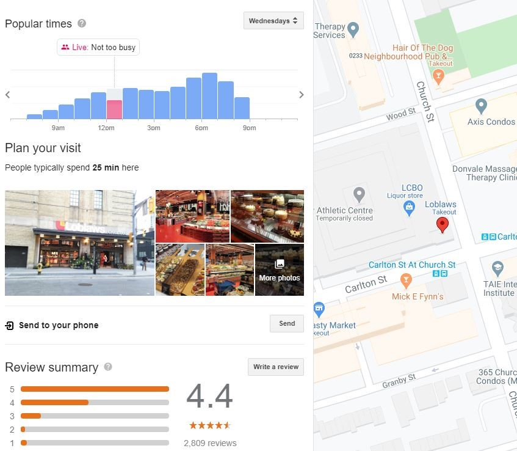
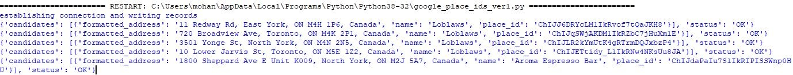
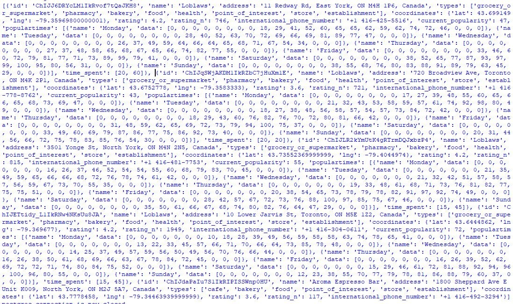

# Business_Busyness
 
<h2>Pulling Google place ids</h2>

The goal of this script is to search the google database for all the businesses licenced with the City of Toronto using a find place request.
Google Places API is used to pull each business ID, business name and address as listed in google, and write that data in a new blank database along with business licence number issued by the City.
 
 API key is stored in a seperate module named credentials to make sure that it remains hidden from the script. Therefore, user needs to create a seperate .py file with API key and import that while this script is run.
 
psycopg2 is used to read and write the postgres tables. 

Google places API can return the results in either json or xml format, this script uses json format so json is also imported.

For this script to work, an empty table with the required fields should be created beforehand in the postgres database. This script just inserts the pulled data into the respective fields. 

pprint is optional. It is necessary just to test whether the pulled data (intermediate output) is in the correct format. pprint makes the output easy to read.

The script mainly has three parts:
<ol>
<li>First part establishes connection to the postgres table (in this case the table name is "lic_business" where existing licenced business database is located.
It then selects the licence number, name and complete address including postcode from the data table. It uses the name, address and postcode for each business to create a search field for that particular business. In the script the number of rows that is pulled is limited to 5 for the test purpose. When running in reality, this limit has to be removed. </li>

<li>Second part, passes this search field to query google using places API find_place request.
Once the place is found in google database, it returns the business name, ID and address in google and append it with the City of Toronto Issued licence number and creates a list of all found businesses.If any business that exist in the City database is not found in the Google database, the script skips those businesses. </li>
 
<li>The third part of the script then insert the retrieved data into the blank postgres table that is created (in this script "test_1") to insert the retrieved data with predetermined fields. The id field in the test_1 table is unique. Thus this script will produce an error message if run twice on the same table.</li>
</ol>

<h2>Pulling popular times and wait times data from google</h2>

The goal of this script is to pull the populartimes and wait times data for the businesses licenced with the City of Toronto where the business has got the google id.
Populartime data is a dynamic data. 

Populartimes and waittimes data are not available through google API as of August 2020. To get this data a python library named populartimes is used. This library is available to clone or download from https://github.com/m-wrzr/populartimes

API key is used to pull the populartime, waittimes and other details of the business licence number issued by the City. It uses two parameters - API key and google id. 
 
 API key is stored in a seperate module named credentials to make sure that it remains hidden from the script. Therefore, user needs to create a seperate .py file with API key and import that while this script is run.
 
 The data that is pulled are of two types. Static type and Dynamic type. Static data do not change by hour for example current_popularity and time spent. (however whether the data is static or not needs to be checked once data is pulled periodically in future)
 
 Dynamic data on the other hand is updated every hour. Dynamic data include popularity by hour, and wait time by hour
 
psycopg2 is used to read and write the postgres tables. 

populartimes library returns the data in json format so json is also imported.

For this script to work, two empty tables (one for static data and another for dynamic data) with the required fields should be created beforehand in the postgres database. This script just inserts the pulled data into the respective fields. 

pprint is optional. It is necessary just to test whether the pulled data (intermediate output) is in the correct format. pprint makes the output easy to read.

The script mainly has four parts:

First part establishes connection to the postgres table where existing licenced business database with google id is located.
It then retrieves the google id for each business from the database table which is used along with API key to search and pull the populartimes details form google. 

Second part, passes this google id to query google using populartimes.get_id(api_key, ID) method to retrieve the details about the place.
For each ID, it returns the popularity data in json format.

Not all businesses have popularity data. If any business that exist in the City database is not found in the Google popularity database, the script skips those businesses and search for next one.
 
Third part, Some businesses have popularity data but no time_wait data. This script will enter [null]  values to time wait data if time wait data does not exist in the google database.

The fourth part of the script then inserts the data in the list into the 2 blank postgres tables. Static data is pushed into static_data table and popularity data is pushed into populartimes table.

In static_data table there is one row for each google id. However in populartimes data, there is one row for each hour of the day, for each day of the week for both populartimes and wait times. Since this is a dynamic data, current date and data acquisition time also is pushed into the database. Therefore for each business, there will be 7*24 = 168 rows. 

Enumerate function is used to retrieve the hour of the day which is basically the list index and zip function is used to zip the populartimes and wait times together so that it becomes easy or iterator to pull the data efficiently at the same time. 

 
As this populartimes library uses the Google Places Web Service, where each API call over a monthly budget is priced. The API call is SKU'd as "Find Current Place" with additional Data SKUs (Basic Data, Contact Data, Atmosphere Data). As of August 2020, you can make almost 5000 calls with the alloted monthly budget of $200. For more information check https://developers.google.com/places/web-service/usage-and-billing and https://cloud.google.com/maps-platform/pricing/sheet/#places.

<h2>Summary of Google Busyness Data Exploration</h2>

Searching for a business in Google, for example Loblaws in Toronto, returns a map with a pin dropped at the location of the business on the map with its attribute information on the left side of the screen as shown in Figure 1.

The attributes contain numerous useful information about that business or establishment including its location, address, hours, phone numbers, questions and answers, photos, customer reviews, time spent by people at that business and popular times

<figure>
  
  <figcaption>Fig.1 - Populartimes as shown in a google map.</figcaption>
</figure>

The Places API is a Google Cloud service that returns information about a place using HTTP requests. Places are defined within this API as establishments, geographic locations, or prominent points of interest. Our interest is basically those establishments that are licenced by the City of Toronto (CoT). You can search for places either by proximity or a text string. A Place Search returns a list of places along with summary information about each place that includes the place_id.

<figure>
  
  <figcaption>Fig.2 - Business ids as retrieved from google.</figcaption>
</figure>

Those Businesses/establishments that are licenced by the CoT and whose information is also available on the google library is primarily identified by the unique "place_id" identifier hereinafter called as ID. This ID is an important field as place details including the popular times and wait times can be pulled based on the ID.

Place search request can be done in three ways.
<ol>
<li>Find Place requests</li>
<li>Nearby Search requests</li>
<li>Text Search request</li>
</ol>

For this project, we were only interested in getting the place_id for licenced business to start with. The licenced business database already has the business name and address in it. Thus, find place request is the most relevant request for this project. Unique IDs  returned by this query for each business is later used to pull the popular times, wait times and visit duration data for those businesses. 

<h3>Find Place requests</h3>
A Find Place request takes a text input and returns a place. The input can be any kind of Places text data, such as a name, address, or phone number. The request must be a string.
The output of find place requests may be either of the following values:
<ul>
<li> json (recommended) indicates output in JavaScript Object Notation (JSON)</li>
<li> xml indicates output as XML </li>

Certain parameters are required to initiate a Find Place request. As is standard in URLs, all parameters are separated using the ampersand (&) character.

<h3>Required Paramaters</h3>

There are three required parameters and three optional parameters
<ul>
<li>key — Your application's API key. This key identifies your application. </li>
<li>input — Text input that identifies the search target, such as a name, address, or phone number. The input must be a string. </li>
<li>inputtype — The type of input. This can be one of either textquery or phonenumber.</li>
</ul>

Fields correspond to Place Search results, and are divided into three categories: 
<ol>
<li>Basic </li>
<li>Contact</li>
<li>Atmosphere</li> </ol>

Basic category include fields such as business_status,  formatted_address,  geometry, icon,name, photos, place_id, plus_code, types
The Contact category includes opening_hours only with one attribute field whether it is open now or not. 
The Atmosphere category includes the following fields price_level, rating, user_ratings_total
Though the populartimes data is available in google search

Basic fields are billed at base rate, and incur no additional charges. Contact and Atmosphere fields are billed at a higher rate.
Additional information is available via a Place Details query.

<h3>Google busyness data</h3>
Google busyness data include three pieces of information: 
<ol>
<li>Popular times </li>
<li>Wait times, and </li>
<li>Visit duration</li> </ol>

To help customers plan visits to your business, Google may show information such as popular times, live visit information, wait times, and typical visit duration. This data appears below the regular business information on Google Maps and Search.

To determine popular times, wait times, and visit duration, Google uses aggregated and anonymized data from users who have opted in to Google Location History. Popular times, wait times, and visit duration are shown for those business if they get enough visits from these users. One can’t manually add this information to the location, and it appears only if Google has sufficient visit data for the business. 

<h4>Visit data may include:</h4>
Popular times graph: This graph shows how busy the location typically is during different times of the day. Popular times are based on average popularity over the last few months. Popularity for any given hour is shown relative to the typical peak popularity for the business for the week. For example, in the image above, 5 PM–8 PM on Wednesday is one of the more popular times of the day for this business. 

<b>Live visit data</b>: This data shows how active the location is right now. Live visit data is updated in real time and overlaid on the popular times graph. For example, in the image above, the highlighted section of the graph represents how active the location is right now compared to its usual level of activity.

<b>Visit duration</b>: This data shows how much time customers typically spend at the location. Visit duration estimates are based on patterns of customer visits over the last several weeks.

<b>Wait time estimates</b>: This data shows how long a customer would have to wait before they receive service during different times of the day. It also shows the peak wait time for each day of the week. The displayed wait time is based on patterns of customer visits over the last several weeks. Wait time estimation differs for different business types. For instance, a sit-down restaurant's wait time reflects how long customers wait before they are seated.

Even though this information is displayed on google maps for businesses, this data is not available to pull using google API. Python library named populartimes is available in github that helps to pull the populartimes data from Google to our database by getting two input parameters. 
<ol>
<li>API key</li>
<li>place_id</li></ol>

The resulting output is in json format as shown in Figure 3.

<figure>
  
  <figcaption>Fig.3 - Popoulartimes data as retrieved from google in json format.</figcaption>
</figure>

Since this data is not available through official google API, there is no documentation about what this data actually represents. Basically,  it returns a list of dictionaries with key-value pairs.

The key value pairs it returns are discussed below.

	Id: unique id assigned to each business.

	name: Name of the establishment/business

	address: street address of the business

	types: type of business (whether it is a café, bakery, grocery, supermarket, pharmacy etc)

	coordinates: latitude and longitude

	rating: star rating provided by users out of 5

	rating_n:

	International_phone_number: 

	current popularity: 

	populartimes: It is a list that contains 7 dictionary items. Each dictionary item has got two key value pairs: 	
	“name”: value represents seven days of the week 
	“data”: list containing 24 items each representing hour starting from midnight to midnight. Each list item represents popularity for that particular hour. Which can be translated into how busy it is. The data range from 0 to 100 where 0 indicates that the business facility is closed, 1 indicates the least busy and 100 indicates that the location is the busiest.
 
	time_wait: similar to populartimes it is a list of 7 dictionary items with two key value pairs:
	“name”: value represents seven days of the week 
	“data”: list containing 24 items each representing hour starting from midnight to midnight. Each list item represents wait time for that particular hour. However, this data is not readily available for all businesses. 

	time_spent: The average amount of time spent in the facility. It is a list item containing two items. 
</body>
</html>
