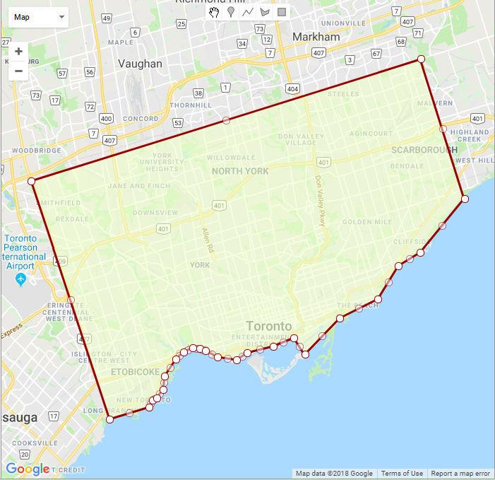

# The basic process of filter the CIS data

#### The filter example are only for the selected dates (10/04/2017 and 11/14/2017) and selected routes (514 and 504), and the methods are basically using the spatial frame, speeds and density of the GPS points.
---

#### Example #1:
Date: 10/04/2017
Route: 514

#### Step 1:

select the CIS data that belong to route 514 and 10/04/2017

```sql
SELECT * into dzou2.cis_514_1004
FROM ttc.cis_2017
WHERE date(message_datetime) = '2017-10-04' AND route = 514
```

#### Step 2:

Delete the exact duplicates that having the same values for every column.

```sql
DELETE FROM dzou2.cis_514_1004 a USING (
      SELECT MIN(ctid) as ctid, message_datetime, route, run, vehicle, latitude, longitude, position
        FROM dzou2.cis_514_1004
        GROUP BY message_datetime, route, run, vehicle, latitude, longitude, position
        HAVING COUNT(*) > 1
      ) b
      WHERE  a.message_datetime = b.message_datetime
      AND a.route = b.route
      AND a.run = b.run
      AND a.vehicle = b.vehicle
      AND a.latitude = b.latitude
      AND a.longitude = b.longitude
      AND a.position = b.position
      AND a.ctid <> b.ctid
```

Data output on QGIS:


#### Step 3:

Filtering by a spatial frame that includes a part of Etobicoke, a part of North York, a part of Scarborough and the whole downtown Toronto. The purpose of this step is to filter out the GPS points which are outside the GTA or in the lake.

```sql
WITH geo_frame AS (

SELECT ST_GeomFromText (
'POLYGON((-79.53854563237667 43.58741045774194,-79.50009348393917 43.59586487156128,-79.49674608708858 43.60065103517571,-79.49271204473018 43.60220490253136,
-79.48601725102901 43.60829567555957,-79.48464396001339 43.61767923091661,-79.47365763188839 43.629422147616,-79.46661951543331 43.634516244547484,
-79.45752146245479 43.63737371962997,-79.45074083806514 43.63675254095344,-79.44499018193721 43.6353859252612,-79.43314554692745 43.63091314750915,
-79.41460611821651 43.62917364403781,-79.40464975835323 43.63414352038869,-79.37941553594112 43.638616057718274,-79.3589878320837 43.64433048208388,
-79.34851648808956 43.63277684536143,-79.31435587407589 43.658489973755195,-79.27744867803096 43.671652821766116,-79.25727846623897 43.695115266992175,
-79.23627140523433 43.704578338242776,-79.1932916879797 43.74232267388661,-79.23591735364437 43.84004639555846,-79.61431267262935 43.75463018484762,
-79.53854563237667 43.58741045774194))', 4326) AS frame ),

io AS (
SELECT *, ST_Within (position, frame) AS inside
FROM geo_frame,dzou2.cis_514_1004
),

out_lat_lon AS(
SELECT * FROM io
WHERE inside = TRUE)

SELECT a.* INTO dzou2.cis_514_1004_f1
FROM dzou2.cis_514_1004 a
INNER JOIN out_lat_lon b USING (message_datetime, run, latitude, longitude)
WHERE b.message_datetime IS NOT NULL
```

The frame shown on the map:




Data output on QGIS:


#### Step 4:

Filtering the CIS data by the distance and speed between points. The purpose is to filter out the GPS points which are moving too fast and making no senses.

```sql
WITH distance AS (
    SELECT rank() OVER (order by message_datetime) AS rank_time,
        *,
        ST_DistanceSphere(position, lag(position,1) OVER (partition by run order by message_datetime)) AS distance_1,
        ST_DistanceSphere(position, lag(position,2) OVER (partition by run order by message_datetime)) AS distance_2,
        ST_DistanceSphere(position, lag(position,3) OVER (partition by run order by message_datetime)) AS distance_3,
        ST_DistanceSphere(position, lag(position,4) OVER (partition by run order by message_datetime)) AS distance_4,
        ST_DistanceSphere(position, lag(position,5) OVER (partition by run order by message_datetime)) AS distance_5
    FROM dzou2.cis_514_1004_f1
),
speed AS (
SELECT *,
       (CASE WHEN distance_1 IS NULL THEN 0
	     WHEN (EXTRACT(epoch FROM
		  (age(message_datetime, lag(message_datetime,1) OVER (partition by run order by message_datetime)))/3600)) = 0
	     THEN 0
             ELSE
             (distance_1 * 0.001) / @ (EXTRACT(epoch FROM
		  (age(message_datetime, lag(message_datetime,1) OVER (partition by run order by message_datetime)))/3600))
        END) AS speed_1,

        (CASE WHEN distance_2 IS NULL THEN 0
	     WHEN (EXTRACT(epoch FROM
		  (age(message_datetime, lag(message_datetime,2) OVER (partition by run order by message_datetime)))/3600)) = 0
	     THEN 0
             ELSE
             (distance_2 * 0.001) / @ (EXTRACT(epoch FROM
		  (age(message_datetime, lag(message_datetime,2) OVER (partition by run order by message_datetime)))/3600))
        END) AS speed_2,

        (CASE WHEN distance_3 IS NULL THEN 0
	     WHEN (EXTRACT(epoch FROM
		  (age(message_datetime, lag(message_datetime,3) OVER (partition by run order by message_datetime)))/3600)) = 0
	     THEN 0
             ELSE
             (distance_3 * 0.001) / @ (EXTRACT(epoch FROM
		  (age(message_datetime, lag(message_datetime,3) OVER (partition by run order by message_datetime)))/3600))
        END) AS speed_3,

        (CASE WHEN distance_4 IS NULL THEN 0
	     WHEN (EXTRACT(epoch FROM
		  (age(message_datetime, lag(message_datetime,4) OVER (partition by run order by message_datetime)))/3600)) = 0
	     THEN 0
             ELSE
             (distance_4 * 0.001) / @ (EXTRACT(epoch FROM
		  (age(message_datetime, lag(message_datetime,4) OVER (partition by run order by message_datetime)))/3600))
        END) AS speed_4,

        (CASE WHEN distance_5 IS NULL THEN 0
	     WHEN (EXTRACT(epoch FROM
		  (age(message_datetime, lag(message_datetime,5) OVER (partition by run order by message_datetime)))/3600)) = 0
	     THEN 0
             ELSE
             (distance_5 * 0.001) / @ (EXTRACT(epoch FROM
		  (age(message_datetime, lag(message_datetime,5) OVER (partition by run order by message_datetime)))/3600))
        END) AS speed_5
FROM distance
),
under_speed AS (
SELECT message_datetime, route, vehicle, run, latitude, longitude, position, distance_1, distance_2, distance_3, distance_4, distance_5, speed_1, speed_2, speed_3, speed_4, speed_5 FROM speed
WHERE distance_1 <150 AND speed_1 < 50 AND speed_2 < 55 AND speed_3 < 60 AND speed_4 < 65 AND speed_5 < 70
)

SELECT a.message_datetime, a.route, a.vehicle, a.run, a.latitude, a.longitude, a.position, b.distance_1, b.distance_2, b.distance_3,
b.distance_4, b.distance_5, b.speed_1, b.speed_2, b.speed_3, b.speed_4, b.speed_5
INTO dzou2.cis_514_1004_f2
FROM dzou2.cis_514_1004_f1 a
INNER JOIN under_speed b USING (message_datetime, run, latitude, longitude)
WHERE b.message_datetime IS NOT NULL

```

Data output on QGIS:


#### Step 5:

Filtering by the GPS density by counting the number of points are in a about 10-metre buffer. The purpose of this step is to filter the messy GPS points in downtown area and only remain the GPS points that are closed to each other.

Since the process of counting closed GPS points is time-consuming, doing [spatial indexing](http://revenant.ca/www/postgis/workshop/indexing.html) before counting can increase the speed of processing.

First,

```sql
VACUUM ANALYZE dzou2.cis_514_1004_f2
```

Then, clicking `analyze` option in the `maintenance` option from right-clicking the table (as described in the spatial indexing link).

After that, running the SQL of counting.

```SQL
SELECT A.message_datetime, A.run, A.vehicle, A.position, count(B.position) AS num_points
INTO dzou2.cis_514_1004_f3
FROM dzou2.cis_514_1004_f2 A
INNER JOIN dzou2.cis_514_1004_f2 B
ON ST_DWithin(A.position, B.position, 0.0001)
GROUP BY A.message_datetime, A.run, A.vehicle, A.position
```

The table output has a column to store the number of GPS points in its about 10-metre buffer.
To filter out the GPS points by the low density, the ratio that the number of closed points out of the number of all the GPS points in step 4 can be used as the indicator. In this case, ratio of **0.02%** because the data are small, or using a number as the filter may be better.

Thus, using this SQL query:

```SQL
SELECT * INTO dzou2.cis_514_1004_f4
FROM dzou2.cis_514_1004_f3
WHERE num_points/(count(*)) > 0.0002
```
**OR using this SQL query only in this example**:

```SQL
SELECT * INTO dzou2.cis_514_1004_f4
FROM dzou2.cis_514_1004_f3
WHERE num_points >= 4
```


Data output on QGIS:


#### Step 6:

Compared the CIS data to the GTFS data by selecting the GTFS data that on the belong to route 514 and 10/04/2017.

```SQL
WITH new_stoptimes AS(
SELECT stop_id, trip_id FROM gtfs_raph.stop_times_20171004
GROUP BY stop_id, trip_id),

new_trips AS (
SELECT route_id, trip_id FROM gtfs_raph.trips_20171004
GROUP BY route_id, trip_id),

new_routes AS (
SELECT route_id, route_short_name
FROM gtfs_raph.routes_20171004
GROUP BY route_id, route_short_name)

SELECT stop_code, stop_name, route_short_name, geom INTO dzou2.GTFS_514_20171004
FROM gtfs_raph.stops_20171004
INNER JOIN new_stoptimes USING (stop_id)
INNER JOIN new_trips USING (trip_id)
INNER JOIN new_routes USING (route_id)
WHERE route_short_name = '514'
GROUP BY stop_code, stop_name, route_short_name, geom
```

Data output on QGIS:


The green points represent the GTFS data, and the red points are the CIS data.

---

#### Example #2:
Date: 10/04/2017
Route: 504

#### Step 1:

select the CIS data that belong to route 504 and 10/04/2017

```sql
SELECT * into dzou2.cis_504_1004
FROM ttc.cis_2017
WHERE date(message_datetime) = '2017-10-04' AND route = 504
```

#### Step 2:

Delete the exact duplicates that having the same values for every column.

```sql
DELETE FROM dzou2.cis_504_1004 a USING (
      SELECT MIN(ctid) as ctid, message_datetime, route, run, vehicle, latitude, longitude, position
        FROM dzou2.cis_504_1004
        GROUP BY message_datetime, route, run, vehicle, latitude, longitude, position
        HAVING COUNT(*) > 1
      ) b
      WHERE  a.message_datetime = b.message_datetime
      AND a.route = b.route
      AND a.run = b.run
      AND a.vehicle = b.vehicle
      AND a.latitude = b.latitude
      AND a.longitude = b.longitude
      AND a.position = b.position
      AND a.ctid <> b.ctid
```

Data output on QGIS:


#### Step 3:

Filtering by a spatial frame that includes a part of Etobicoke, a part of North York, a part of Scarborough and the whole downtown Toronto. The purpose of this step is to filter out the GPS points which are outside the GTA or in the lake. The figure of the frame is shown on the Step 3 in the Example #1.

```sql
WITH geo_frame AS (

SELECT ST_GeomFromText (
'POLYGON((-79.53854563237667 43.58741045774194,-79.50009348393917 43.59586487156128,-79.49674608708858 43.60065103517571,-79.49271204473018 43.60220490253136,
-79.48601725102901 43.60829567555957,-79.48464396001339 43.61767923091661,-79.47365763188839 43.629422147616,-79.46661951543331 43.634516244547484,
-79.45752146245479 43.63737371962997,-79.45074083806514 43.63675254095344,-79.44499018193721 43.6353859252612,-79.43314554692745 43.63091314750915,
-79.41460611821651 43.62917364403781,-79.40464975835323 43.63414352038869,-79.37941553594112 43.638616057718274,-79.3589878320837 43.64433048208388,
-79.34851648808956 43.63277684536143,-79.31435587407589 43.658489973755195,-79.27744867803096 43.671652821766116,-79.25727846623897 43.695115266992175,
-79.23627140523433 43.704578338242776,-79.1932916879797 43.74232267388661,-79.23591735364437 43.84004639555846,-79.61431267262935 43.75463018484762,
-79.53854563237667 43.58741045774194))', 4326) AS frame ),

io AS (
SELECT *, ST_Within (position, frame) AS inside
FROM geo_frame,dzou2.cis_504_1004
),

out_lat_lon AS(
SELECT * FROM io
WHERE inside = TRUE)

SELECT a.* INTO dzou2.cis_504_1004_f1
FROM dzou2.cis_504_1004 a
INNER JOIN out_lat_lon b USING (message_datetime, run, latitude, longitude)
WHERE b.message_datetime IS NOT NULL
```

Data output on QGIS:


#### Step 4:

Filtering the CIS data by the distance and speed between points. The purpose is to filter out the GPS points which are moving too fast and making no senses.

```sql
WITH distance AS (
    SELECT rank() OVER (order by message_datetime) AS rank_time,
        *,
        ST_DistanceSphere(position, lag(position,1) OVER (partition by run order by message_datetime)) AS distance_1,
        ST_DistanceSphere(position, lag(position,2) OVER (partition by run order by message_datetime)) AS distance_2,
        ST_DistanceSphere(position, lag(position,3) OVER (partition by run order by message_datetime)) AS distance_3,
        ST_DistanceSphere(position, lag(position,4) OVER (partition by run order by message_datetime)) AS distance_4,
        ST_DistanceSphere(position, lag(position,5) OVER (partition by run order by message_datetime)) AS distance_5
    FROM dzou2.cis_504_1004_f1
),
speed AS (
SELECT *,
       (CASE WHEN distance_1 IS NULL THEN 0
	     WHEN (EXTRACT(epoch FROM
		  (age(message_datetime, lag(message_datetime,1) OVER (partition by run order by message_datetime)))/3600)) = 0
	     THEN 0
             ELSE
             (distance_1 * 0.001) / @ (EXTRACT(epoch FROM
		  (age(message_datetime, lag(message_datetime,1) OVER (partition by run order by message_datetime)))/3600))
        END) AS speed_1,

        (CASE WHEN distance_2 IS NULL THEN 0
	     WHEN (EXTRACT(epoch FROM
		  (age(message_datetime, lag(message_datetime,2) OVER (partition by run order by message_datetime)))/3600)) = 0
	     THEN 0
             ELSE
             (distance_2 * 0.001) / @ (EXTRACT(epoch FROM
		  (age(message_datetime, lag(message_datetime,2) OVER (partition by run order by message_datetime)))/3600))
        END) AS speed_2,

        (CASE WHEN distance_3 IS NULL THEN 0
	     WHEN (EXTRACT(epoch FROM
		  (age(message_datetime, lag(message_datetime,3) OVER (partition by run order by message_datetime)))/3600)) = 0
	     THEN 0
             ELSE
             (distance_3 * 0.001) / @ (EXTRACT(epoch FROM
		  (age(message_datetime, lag(message_datetime,3) OVER (partition by run order by message_datetime)))/3600))
        END) AS speed_3,

        (CASE WHEN distance_4 IS NULL THEN 0
	     WHEN (EXTRACT(epoch FROM
		  (age(message_datetime, lag(message_datetime,4) OVER (partition by run order by message_datetime)))/3600)) = 0
	     THEN 0
             ELSE
             (distance_4 * 0.001) / @ (EXTRACT(epoch FROM
		  (age(message_datetime, lag(message_datetime,4) OVER (partition by run order by message_datetime)))/3600))
        END) AS speed_4,

        (CASE WHEN distance_5 IS NULL THEN 0
	     WHEN (EXTRACT(epoch FROM
		  (age(message_datetime, lag(message_datetime,5) OVER (partition by run order by message_datetime)))/3600)) = 0
	     THEN 0
             ELSE
             (distance_5 * 0.001) / @ (EXTRACT(epoch FROM
		  (age(message_datetime, lag(message_datetime,5) OVER (partition by run order by message_datetime)))/3600))
        END) AS speed_5
FROM distance
),
under_speed AS (
SELECT message_datetime, route, vehicle, run, latitude, longitude, position, distance_1, distance_2, distance_3, distance_4, distance_5, speed_1, speed_2, speed_3, speed_4, speed_5 FROM speed
WHERE distance_1 <= 300 AND speed_1 <= 60 AND speed_2 <= 65 AND speed_3 <= 70 AND speed_4 <= 75 AND speed_5 <= 90
)

SELECT a.message_datetime, a.route, a.vehicle, a.run, a.latitude, a.longitude, a.position, b.distance_1, b.distance_2, b.distance_3,
b.distance_4, b.distance_5, b.speed_1, b.speed_2, b.speed_3, b.speed_4, b.speed_5
INTO dzou2.cis_504_1004_f2
FROM dzou2.cis_504_1004_f1 a
INNER JOIN under_speed b USING (message_datetime, run, latitude, longitude)
WHERE b.message_datetime IS NOT NULL

```

Data output on QGIS:


#### Step 5:

Filtering by the GPS density by counting the number of points are in a about 10-metre buffer.

First,

```sql
VACUUM ANALYZE dzou2.cis_504_1004_f2
```

Then, clicking `analyze` option in the `maintenance` option from right-clicking the table (as described in the spatial indexing link).

After that, running the SQL of counting.

```SQL
SELECT A.message_datetime, A.run, A.vehicle, A.position, count(B.position) AS num_points
INTO dzou2.cis_504_1004_f3
FROM dzou2.cis_504_1004_f2 A
INNER JOIN dzou2.cis_504_1004_f2 B
ON ST_DWithin(A.position, B.position, 0.0001)
GROUP BY A.message_datetime, A.run, A.vehicle, A.position
```

Then,
**using this SQL query only in this example**:

```SQL
SELECT * INTO dzou2.cis_504_1004_f4
FROM dzou2.cis_504_1004_f3
WHERE num_points >= 2
```
Since the process of counting closed GPS points is time-consuming and there are too many data, the time of running the query **requires 3 hours**.

Another disadvantage of using GPS density to filter out the GPS points in this case is that the diversion on the Danforth Ave. drives too fast and most of points might be filtered out in last step, and the result is that it is hard to filter out the wrong GPS points in downtown area and keep the diversion points because both of their density of GPS points are low.

Thus, filtering by the GPS point density **is not suitable** in this case.


#### Step 6:

Compared the CIS data to the GTFS data by selecting the GTFS data that on the belong to route 504 and 10/04/2017.

```SQL
WITH new_stoptimes AS(
SELECT stop_id, trip_id FROM gtfs_raph.stop_times_20171004
GROUP BY stop_id, trip_id),

new_trips AS (
SELECT route_id, trip_id FROM gtfs_raph.trips_20171004
GROUP BY route_id, trip_id),

new_routes AS (
SELECT route_id, route_short_name
FROM gtfs_raph.routes_20171004
GROUP BY route_id, route_short_name)

SELECT stop_code, stop_name, route_short_name, geom INTO dzou2.GTFS_504_20171004
FROM gtfs_raph.stops_20171004
INNER JOIN new_stoptimes USING (stop_id)
INNER JOIN new_trips USING (trip_id)
INNER JOIN new_routes USING (route_id)
WHERE route_short_name = '504'
GROUP BY stop_code, stop_name, route_short_name, geom
```

Data output on QGIS:


The green points represent the GTFS data, and the orange points are the CIS data.


---

#### Example #3:
Date: 11/14/2017
Route: 514

#### Step 1:

select the CIS data that belong to route 514 and 11/04/2017

```sql
SELECT * into dzou2.cis_514_1114
FROM ttc.cis_2017
WHERE date(message_datetime) = '2017-11-04' AND route = 514
```

#### Step 2:

Delete the exact duplicates that having the same values for every column.

```sql
DELETE FROM dzou2.cis_514_1114 a USING (
      SELECT MIN(ctid) as ctid, message_datetime, route, run, vehicle, latitude, longitude, position
        FROM dzou2.cis_514_1114
        GROUP BY message_datetime, route, run, vehicle, latitude, longitude, position
        HAVING COUNT(*) > 1
      ) b
      WHERE  a.message_datetime = b.message_datetime
      AND a.route = b.route
      AND a.run = b.run
      AND a.vehicle = b.vehicle
      AND a.latitude = b.latitude
      AND a.longitude = b.longitude
      AND a.position = b.position
      AND a.ctid <> b.ctid
```

Data output on QGIS:


#### Step 3:

Filtering by a spatial frame that includes a part of Etobicoke, a part of North York, a part of Scarborough and the whole downtown Toronto. The purpose of this step is to filter out the GPS points which are outside the GTA or in the lake. The figure of the frame is shown on the Step 3 in the Example #1.

```sql
WITH geo_frame AS (

SELECT ST_GeomFromText (
'POLYGON((-79.53854563237667 43.58741045774194,-79.50009348393917 43.59586487156128,-79.49674608708858 43.60065103517571,-79.49271204473018 43.60220490253136,
-79.48601725102901 43.60829567555957,-79.48464396001339 43.61767923091661,-79.47365763188839 43.629422147616,-79.46661951543331 43.634516244547484,
-79.45752146245479 43.63737371962997,-79.45074083806514 43.63675254095344,-79.44499018193721 43.6353859252612,-79.43314554692745 43.63091314750915,
-79.41460611821651 43.62917364403781,-79.40464975835323 43.63414352038869,-79.37941553594112 43.638616057718274,-79.3589878320837 43.64433048208388,
-79.34851648808956 43.63277684536143,-79.31435587407589 43.658489973755195,-79.27744867803096 43.671652821766116,-79.25727846623897 43.695115266992175,
-79.23627140523433 43.704578338242776,-79.1932916879797 43.74232267388661,-79.23591735364437 43.84004639555846,-79.61431267262935 43.75463018484762,
-79.53854563237667 43.58741045774194))', 4326) AS frame ),

io AS (
SELECT *, ST_Within (position, frame) AS inside
FROM geo_frame,dzou2.cis_514_1114
),

out_lat_lon AS(
SELECT * FROM io
WHERE inside = TRUE)

SELECT a.* INTO dzou2.cis_514_1114_f1
FROM dzou2.cis_514_1114 a
INNER JOIN out_lat_lon b USING (message_datetime, run, latitude, longitude)
WHERE b.message_datetime IS NOT NULL
```

Data output on QGIS:


#### Step 4:

Filtering the CIS data by the distance and speed between points. The purpose is to filter out the GPS points which are moving too fast and making no senses.

```sql
WITH distance AS (
    SELECT rank() OVER (order by message_datetime) AS rank_time,
        *,
        ST_DistanceSphere(position, lag(position,1) OVER (partition by run order by message_datetime)) AS distance_1,
        ST_DistanceSphere(position, lag(position,2) OVER (partition by run order by message_datetime)) AS distance_2,
        ST_DistanceSphere(position, lag(position,3) OVER (partition by run order by message_datetime)) AS distance_3,
        ST_DistanceSphere(position, lag(position,4) OVER (partition by run order by message_datetime)) AS distance_4,
        ST_DistanceSphere(position, lag(position,5) OVER (partition by run order by message_datetime)) AS distance_5
    FROM dzou2.cis_514_1114_f1
),
speed AS (
SELECT *,
       (CASE WHEN distance_1 IS NULL THEN 0
	     WHEN (EXTRACT(epoch FROM
		  (age(message_datetime, lag(message_datetime,1) OVER (partition by run order by message_datetime)))/3600)) = 0
	     THEN 0
             ELSE
             (distance_1 * 0.001) / @ (EXTRACT(epoch FROM
		  (age(message_datetime, lag(message_datetime,1) OVER (partition by run order by message_datetime)))/3600))
        END) AS speed_1,

        (CASE WHEN distance_2 IS NULL THEN 0
	     WHEN (EXTRACT(epoch FROM
		  (age(message_datetime, lag(message_datetime,2) OVER (partition by run order by message_datetime)))/3600)) = 0
	     THEN 0
             ELSE
             (distance_2 * 0.001) / @ (EXTRACT(epoch FROM
		  (age(message_datetime, lag(message_datetime,2) OVER (partition by run order by message_datetime)))/3600))
        END) AS speed_2,

        (CASE WHEN distance_3 IS NULL THEN 0
	     WHEN (EXTRACT(epoch FROM
		  (age(message_datetime, lag(message_datetime,3) OVER (partition by run order by message_datetime)))/3600)) = 0
	     THEN 0
             ELSE
             (distance_3 * 0.001) / @ (EXTRACT(epoch FROM
		  (age(message_datetime, lag(message_datetime,3) OVER (partition by run order by message_datetime)))/3600))
        END) AS speed_3,

        (CASE WHEN distance_4 IS NULL THEN 0
	     WHEN (EXTRACT(epoch FROM
		  (age(message_datetime, lag(message_datetime,4) OVER (partition by run order by message_datetime)))/3600)) = 0
	     THEN 0
             ELSE
             (distance_4 * 0.001) / @ (EXTRACT(epoch FROM
		  (age(message_datetime, lag(message_datetime,4) OVER (partition by run order by message_datetime)))/3600))
        END) AS speed_4,

        (CASE WHEN distance_5 IS NULL THEN 0
	     WHEN (EXTRACT(epoch FROM
		  (age(message_datetime, lag(message_datetime,5) OVER (partition by run order by message_datetime)))/3600)) = 0
	     THEN 0
             ELSE
             (distance_5 * 0.001) / @ (EXTRACT(epoch FROM
		  (age(message_datetime, lag(message_datetime,5) OVER (partition by run order by message_datetime)))/3600))
        END) AS speed_5
FROM distance
),
under_speed AS (
SELECT message_datetime, route, vehicle, run, latitude, longitude, position, distance_1, distance_2, distance_3, distance_4, distance_5, speed_1, speed_2, speed_3, speed_4, speed_5 FROM speed
WHERE distance_1 <150 AND speed_1 < 50 AND speed_2 < 55 AND speed_3 < 60 AND speed_4 < 65 AND speed_5 < 70
)

SELECT a.message_datetime, a.route, a.vehicle, a.run, a.latitude, a.longitude, a.position, b.distance_1, b.distance_2, b.distance_3,
b.distance_4, b.distance_5, b.speed_1, b.speed_2, b.speed_3, b.speed_4, b.speed_5
INTO dzou2.cis_514_1114_f2
FROM dzou2.cis_514_1114_f1 a
INNER JOIN under_speed b USING (message_datetime, run, latitude, longitude)
WHERE b.message_datetime IS NOT NULL

```

Data output on QGIS:


#### Step 5:

Filtering by the GPS density by counting the number of points are in a about 10-metre buffer. The purpose of this step is to filter the messy GPS points in downtown area and only remain the GPS points that are closed to each other.

Since the process of counting closed GPS points is time-consuming, doing [spatial indexing](http://revenant.ca/www/postgis/workshop/indexing.html) before counting can increase the speed of processing.

First,

```sql
VACUUM ANALYZE dzou2.cis_514_1114_f2
```

Then, clicking `analyze` option in the `maintenance` option from right-clicking the table (as described in the spatial indexing link).

After that, running the SQL of counting.

```SQL
SELECT A.message_datetime, A.run, A.vehicle, A.position, count(B.position) AS num_points
INTO dzou2.cis_514_1114_f3
FROM dzou2.cis_514_1114_f2 A
INNER JOIN dzou2.cis_514_1114_f2 B
ON ST_DWithin(A.position, B.position, 0.0001)
GROUP BY A.message_datetime, A.run, A.vehicle, A.position
```

In this case, ratio of **0.02% ~ 0.03%** because the data are small, or using a number as the filter may be better.

Thus, using this SQL query:

```SQL
SELECT * INTO dzou2.cis_514_1114_f4
FROM dzou2.cis_514_1114_f3
WHERE num_points/(count(*)) > 0.000255
```
**OR using this SQL query only in this example**:

```SQL
SELECT * INTO dzou2.cis_514_1114_f4
FROM dzou2.cis_514_1114_f3
WHERE num_points >= 6
```


Data output on QGIS:


#### Step 6:

Compared the CIS data to the GTFS data by selecting the GTFS data that on the belong to route 514 and 11/04/2017.

```SQL
WITH new_stoptimes AS(
SELECT stop_id, trip_id FROM gtfs_raph.stop_times_20171114
GROUP BY stop_id, trip_id),

new_trips AS (
SELECT route_id, trip_id FROM gtfs_raph.trips_20171114
GROUP BY route_id, trip_id),

new_routes AS (
SELECT route_id, route_short_name
FROM gtfs_raph.routes_20171114
GROUP BY route_id, route_short_name)

SELECT stop_code, stop_name, route_short_name, geom INTO dzou2.GTFS_514_20171114
FROM gtfs_raph.stops_20171114
INNER JOIN new_stoptimes USING (stop_id)
INNER JOIN new_trips USING (trip_id)
INNER JOIN new_routes USING (route_id)
WHERE route_short_name = '514'
GROUP BY stop_code, stop_name, route_short_name, geom
```

Data output on QGIS:


The green points represent the GTFS data, and the purple points are the CIS data.

---

#### Example #4:
Date: 11/14/2017
Route: 504

#### Step 1:

select the CIS data that belong to route 504 and 11/14/2017

```sql
SELECT * into dzou2.cis_504_1114
FROM ttc.cis_2017
WHERE date(message_datetime) = '2017-11-04' AND route = 504
```

#### Step 2:

Delete the exact duplicates that having the same values for every column.

```sql
DELETE FROM dzou2.cis_504_1114 a USING (
      SELECT MIN(ctid) as ctid, message_datetime, route, run, vehicle, latitude, longitude, position
        FROM dzou2.cis_504_1114
        GROUP BY message_datetime, route, run, vehicle, latitude, longitude, position
        HAVING COUNT(*) > 1
      ) b
      WHERE  a.message_datetime = b.message_datetime
      AND a.route = b.route
      AND a.run = b.run
      AND a.vehicle = b.vehicle
      AND a.latitude = b.latitude
      AND a.longitude = b.longitude
      AND a.position = b.position
      AND a.ctid <> b.ctid
```

Data output on QGIS:


#### Step 3:

Filtering by a spatial frame that includes a part of Etobicoke, a part of North York, a part of Scarborough and the whole downtown Toronto. The purpose of this step is to filter out the GPS points which are outside the GTA or in the lake. The figure of the frame is shown on the Step 3 in the Example #1.

```sql
WITH geo_frame AS (

SELECT ST_GeomFromText (
'POLYGON((-79.53854563237667 43.58741045774194,-79.50009348393917 43.59586487156128,-79.49674608708858 43.60065103517571,-79.49271204473018 43.60220490253136,
-79.48601725102901 43.60829567555957,-79.48464396001339 43.61767923091661,-79.47365763188839 43.629422147616,-79.46661951543331 43.634516244547484,
-79.45752146245479 43.63737371962997,-79.45074083806514 43.63675254095344,-79.44499018193721 43.6353859252612,-79.43314554692745 43.63091314750915,
-79.41460611821651 43.62917364403781,-79.40464975835323 43.63414352038869,-79.37941553594112 43.638616057718274,-79.3589878320837 43.64433048208388,
-79.34851648808956 43.63277684536143,-79.31435587407589 43.658489973755195,-79.27744867803096 43.671652821766116,-79.25727846623897 43.695115266992175,
-79.23627140523433 43.704578338242776,-79.1932916879797 43.74232267388661,-79.23591735364437 43.84004639555846,-79.61431267262935 43.75463018484762,
-79.53854563237667 43.58741045774194))', 4326) AS frame ),

io AS (
SELECT *, ST_Within (position, frame) AS inside
FROM geo_frame,dzou2.cis_504_1114
),

out_lat_lon AS(
SELECT * FROM io
WHERE inside = TRUE)

SELECT a.* INTO dzou2.cis_504_1114_f1
FROM dzou2.cis_504_1114 a
INNER JOIN out_lat_lon b USING (message_datetime, run, latitude, longitude)
WHERE b.message_datetime IS NOT NULL
```

Data output on QGIS:


#### Step 4:

Filtering the CIS data by the distance and speed between points. The purpose is to filter out the GPS points which are moving too fast and making no senses.

```sql
WITH distance AS (
    SELECT rank() OVER (order by message_datetime) AS rank_time,
        *,
        ST_DistanceSphere(position, lag(position,1) OVER (partition by run order by message_datetime)) AS distance_1,
        ST_DistanceSphere(position, lag(position,2) OVER (partition by run order by message_datetime)) AS distance_2,
        ST_DistanceSphere(position, lag(position,3) OVER (partition by run order by message_datetime)) AS distance_3,
        ST_DistanceSphere(position, lag(position,4) OVER (partition by run order by message_datetime)) AS distance_4,
        ST_DistanceSphere(position, lag(position,5) OVER (partition by run order by message_datetime)) AS distance_5
    FROM dzou2.cis_504_1114_f1
),
speed AS (
SELECT *,
       (CASE WHEN distance_1 IS NULL THEN 0
	     WHEN (EXTRACT(epoch FROM
		  (age(message_datetime, lag(message_datetime,1) OVER (partition by run order by message_datetime)))/3600)) = 0
	     THEN 0
             ELSE
             (distance_1 * 0.001) / @ (EXTRACT(epoch FROM
		  (age(message_datetime, lag(message_datetime,1) OVER (partition by run order by message_datetime)))/3600))
        END) AS speed_1,

        (CASE WHEN distance_2 IS NULL THEN 0
	     WHEN (EXTRACT(epoch FROM
		  (age(message_datetime, lag(message_datetime,2) OVER (partition by run order by message_datetime)))/3600)) = 0
	     THEN 0
             ELSE
             (distance_2 * 0.001) / @ (EXTRACT(epoch FROM
		  (age(message_datetime, lag(message_datetime,2) OVER (partition by run order by message_datetime)))/3600))
        END) AS speed_2,

        (CASE WHEN distance_3 IS NULL THEN 0
	     WHEN (EXTRACT(epoch FROM
		  (age(message_datetime, lag(message_datetime,3) OVER (partition by run order by message_datetime)))/3600)) = 0
	     THEN 0
             ELSE
             (distance_3 * 0.001) / @ (EXTRACT(epoch FROM
		  (age(message_datetime, lag(message_datetime,3) OVER (partition by run order by message_datetime)))/3600))
        END) AS speed_3,

        (CASE WHEN distance_4 IS NULL THEN 0
	     WHEN (EXTRACT(epoch FROM
		  (age(message_datetime, lag(message_datetime,4) OVER (partition by run order by message_datetime)))/3600)) = 0
	     THEN 0
             ELSE
             (distance_4 * 0.001) / @ (EXTRACT(epoch FROM
		  (age(message_datetime, lag(message_datetime,4) OVER (partition by run order by message_datetime)))/3600))
        END) AS speed_4,

        (CASE WHEN distance_5 IS NULL THEN 0
	     WHEN (EXTRACT(epoch FROM
		  (age(message_datetime, lag(message_datetime,5) OVER (partition by run order by message_datetime)))/3600)) = 0
	     THEN 0
             ELSE
             (distance_5 * 0.001) / @ (EXTRACT(epoch FROM
		  (age(message_datetime, lag(message_datetime,5) OVER (partition by run order by message_datetime)))/3600))
        END) AS speed_5
FROM distance
),
under_speed AS (
SELECT message_datetime, route, vehicle, run, latitude, longitude, position, distance_1, distance_2, distance_3, distance_4, distance_5, speed_1, speed_2, speed_3, speed_4, speed_5 FROM speed
WHERE distance_1 <= 300 AND speed_1 <= 60 AND speed_2 <= 65 AND speed_3 <= 70 AND speed_4 <= 75 AND speed_5 <= 90
)

SELECT a.message_datetime, a.route, a.vehicle, a.run, a.latitude, a.longitude, a.position, b.distance_1, b.distance_2, b.distance_3,
b.distance_4, b.distance_5, b.speed_1, b.speed_2, b.speed_3, b.speed_4, b.speed_5
INTO dzou2.cis_504_1114_f2
FROM dzou2.cis_504_1114_f1 a
INNER JOIN under_speed b USING (message_datetime, run, latitude, longitude)
WHERE b.message_datetime IS NOT NULL

```

Data output on QGIS:


#### Step 5:

Filtering by the GPS density by counting the number of points are in a about 10-metre buffer.

First,

```sql
VACUUM ANALYZE dzou2.cis_504_1114_f2
```

Then, clicking `analyze` option in the `maintenance` option from right-clicking the table (as described in the spatial indexing link).

After that, running the SQL of counting.

```SQL
SELECT A.message_datetime, A.run, A.vehicle, A.position, count(B.position) AS num_points
INTO dzou2.cis_504_1114_f3
FROM dzou2.cis_504_1114_f2 A
INNER JOIN dzou2.cis_504_1114_f2 B
ON ST_DWithin(A.position, B.position, 0.0001)
GROUP BY A.message_datetime, A.run, A.vehicle, A.position
```

Then,
**using this SQL query only in this example**:

```SQL
SELECT * INTO dzou2.cis_504_1114_f4
FROM dzou2.cis_504_1114_f3
WHERE num_points >= 3
```
Since the process of counting closed GPS points is time-consuming and there are too many data, the time of running the query **requires 3 hours**.

Another disadvantage of using GPS density to filter out the GPS points in this case is that the diversion on the Dundas E. drives too fast and most of points might be filtered out in last step, and the result is that it is hard to filter out the wrong GPS points in downtown area and keep the diversion points because both of their density of GPS points are low.

Thus, filtering by the GPS point density **is not suitable** in this case.


#### Step 6:

Compared the CIS data to the GTFS data by selecting the GTFS data that on the belong to route 504 and 11/04/2017.

```SQL
WITH new_stoptimes AS(
SELECT stop_id, trip_id FROM gtfs_raph.stop_times_20171114
GROUP BY stop_id, trip_id),

new_trips AS (
SELECT route_id, trip_id FROM gtfs_raph.trips_20171114
GROUP BY route_id, trip_id),

new_routes AS (
SELECT route_id, route_short_name
FROM gtfs_raph.routes_20171114
GROUP BY route_id, route_short_name)

SELECT stop_code, stop_name, route_short_name, geom INTO dzou2.GTFS_504_20171114
FROM gtfs_raph.stops_20171114
INNER JOIN new_stoptimes USING (stop_id)
INNER JOIN new_trips USING (trip_id)
INNER JOIN new_routes USING (route_id)
WHERE route_short_name = '504'
GROUP BY stop_code, stop_name, route_short_name, geom
```

Data output on QGIS:


The map compares the GTFS stops with the CIS data of route 504 on 11/14/2017, and the CIS data is filtered by route number, date, spatial frame, distances and speeds between points.
The green points represent the GTFS data, and the blue points are the CIS data.
