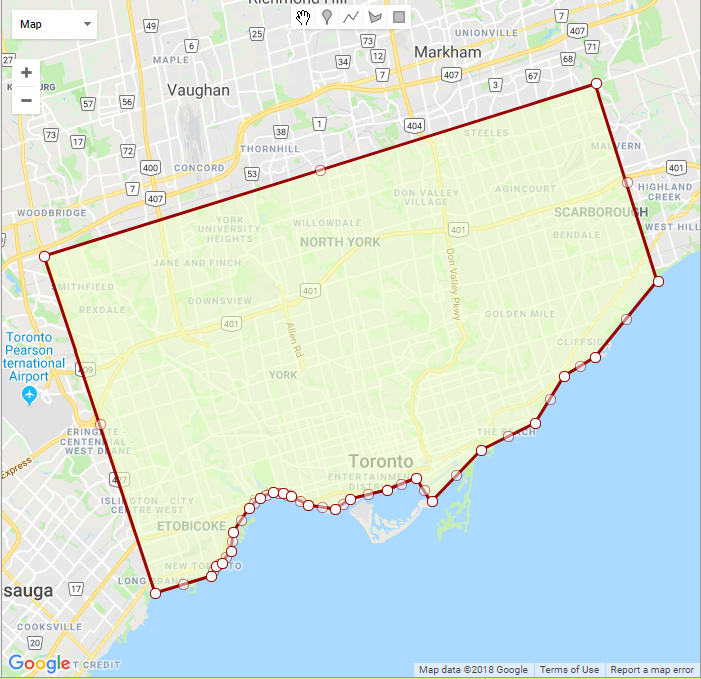
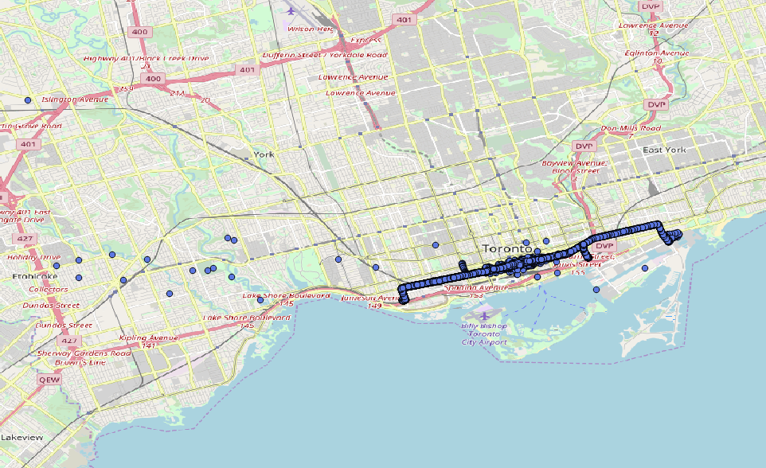
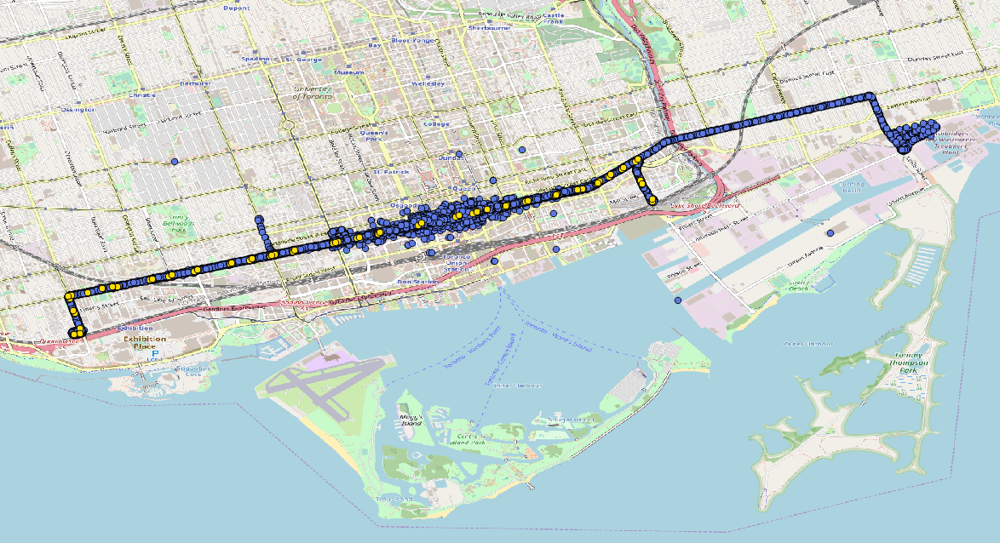
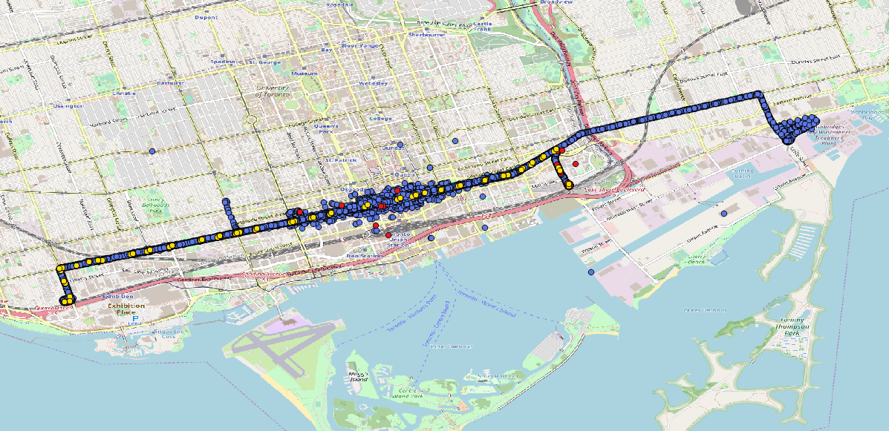
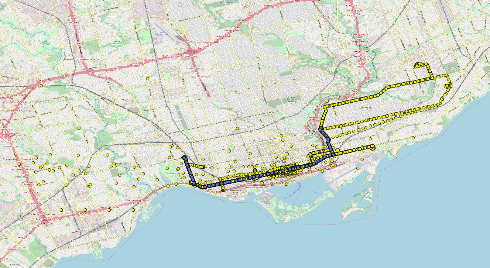
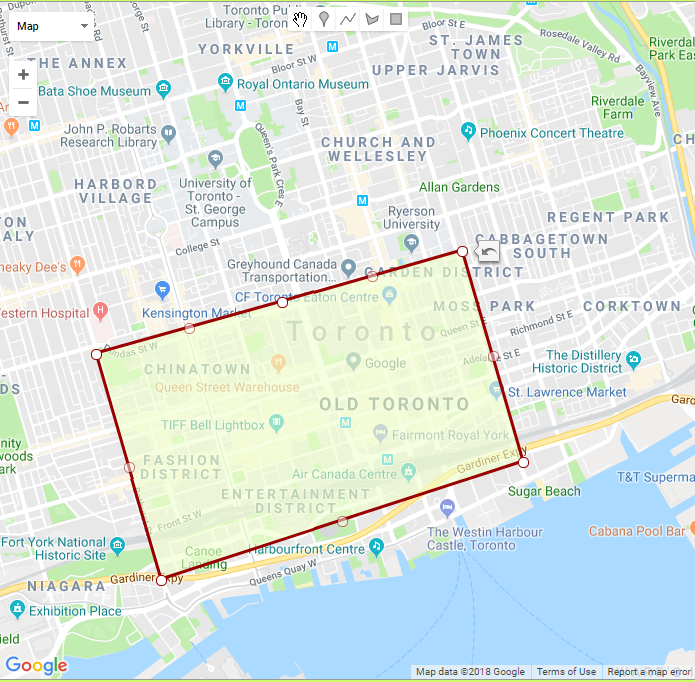

# The CIS processing procedure

## Determine Direction issue #89

## Route 514

### Step 1: Created the table that having the CIS data of route 514 on Oct.04, 2017
Also, since the name of the time column in `ttc.cis_2017` is long, I shorten it to `date_time`.

```sql
SELECT message_datetime AS date_time, route, run, vehicle, latitude, longitude, position
INTO dzou2.dd_cis_514_1004
FROM ttc.cis_2017
WHERE route = 514 AND date(message_datetime) = '2017-10-04'
```

### Step 2: Filtered the CIS GPS points into Toronto areas by using a spatial frame.

The frame covers the areas like this:



```sql
WITH geo_frame AS (
SELECT ST_GeomFromText (
'POLYGON((-79.53854563237667 43.58741045774194,-79.50009348393917 43.59586487156128,-79.49674608708858 43.60065103517571,-79.49271204473018 43.60220490253136,
-79.48601725102901 43.60829567555957,-79.48464396001339 43.61767923091661,-79.47365763188839 43.629422147616,-79.46661951543331 43.634516244547484,
-79.45752146245479 43.63737371962997,-79.45074083806514 43.63675254095344,-79.44499018193721 43.6353859252612,-79.43314554692745 43.63091314750915,
-79.41460611821651 43.62917364403781,-79.40464975835323 43.63414352038869,-79.37941553594112 43.638616057718274,-79.3589878320837 43.64433048208388,
-79.34851648808956 43.63277684536143,-79.31435587407589 43.658489973755195,-79.27744867803096 43.671652821766116,-79.25727846623897 43.695115266992175,
-79.23627140523433 43.704578338242776,-79.1932916879797 43.74232267388661,-79.23591735364437 43.84004639555846,-79.61431267262935 43.75463018484762,
-79.53854563237667 43.58741045774194))', 4326) AS frame
),

io AS (
SELECT *, ST_Within (position, frame) AS inside
FROM geo_frame,dzou2.dd_cis_514_1004
)

SELECT * INTO dzou2.dd_cis_514_1004_f
FROM io WHERE inside = TRUE
```

The process filtered out 504 GPS points.

### Step 3: Created the table that having the CIS data and its angles with previous and next points.

```sql
SELECT rank() OVER (order by date_time) AS rank_time,
        date_time, run, vehicle, latitude, longitude, position,
        degrees(ST_Azimuth(position, lag(position,1) OVER (partition by run order by date_time))) AS angle_previous,
        degrees(ST_Azimuth(position, lag(position,-1) OVER (partition by run order by date_time))) AS angle_next
    INTO dzou2.dd_cis_514_angle
    FROM dzou2.dd_cis_514_1004_f
```

The first `angle_previous` and the last `angle_next` will be NULL, as well as the angles between two points which did not move.


### Step 4: Obtained the stop patterns and directions of route 514 on 10/04/2017 by Raph's query.

```sql
WITH distinct_stop_patterns AS (SELECT DISTINCT ON (shape_id, stop_sequence) shape_id, direction_id, stop_sequence, stop_id
                                FROM gtfs_raph.trips_20171004
                                NATURAL JOIN gtfs_raph.stop_times_20171004
                                NATURAL JOIN gtfs_raph.routes_20171004
                                WHERE route_short_name = '514'
                                ORDER BY shape_id, stop_sequence)

SELECT shape_id, direction_id, ARRAY_AGG(stop_name ORDER BY stop_sequence)
FROM distinct_stop_patterns
NATURAL JOIN gtfs_raph.stops_20171004
GROUP BY shape_id, direction_id
ORDER BY direction_id
```

Result:

shape_id | direction_id | stop_order
--- | --- | ---
691040 | 0 |DUFFERIN GATE LOOP""	DUFFERIN ST AT LIBERTY ST""	DUFFERIN ST AT KING ST WEST""	DUFFERIN AT KING""	KING ST WEST AT FRASER AVE""	KING ST WEST AT ATLANTIC AVE""	KING ST WEST AT SUDBURY ST""	KING ST WEST AT SHAW ST""	KING ST WEST AT STRACHAN AVE""	KING ST WEST AT NIAGARA ST""	KING ST WEST AT TECUMSETH ST""	KING ST WEST AT BATHURST ST""	BATHURST AT KING""	KING ST WEST AT PORTLAND ST""	KING ST WEST AT SPADINA AVE""	KING ST WEST AT BLUE JAYS WAY""	KING ST WEST AT JOHN ST""	KING ST WEST AT UNIVERSITY AVE (ST ANDREW STATION)""	KING ST WEST AT BAY ST""	KING ST WEST AT YONGE ST (KING STATION)""	YONGE AT KING""	KING ST EAST AT CHURCH ST""	CHURCH AT KING""	KING ST EAST AT JARVIS ST""	KING ST EAST AT SHERBOURNE ST""	KING ST. E AT SHERBOURNE ST.""	KING ST EAST AT ONTARIO ST EAST SIDE""	KING ST EAST AT PARLIAMENT ST""	PARLIAMENT AT KING""	KING ST EAST AT TRINITY ST""	KING ST EAST AT SACKVILLE ST""	KING ST EAST AT SUMACH ST""	KING & SUMACH""	CHERRY ST AT FRONT ST EAST""	DISTILLERY LOOP""	DISTILLERY LOOP""}"
691041 | 0 | DUFFERIN GATE LOOP""	DUFFERIN ST AT LIBERTY ST""	DUFFERIN ST AT KING ST WEST""	DUFFERIN AT KING""	KING ST WEST AT FRASER AVE""	KING ST WEST AT ATLANTIC AVE""	KING ST WEST AT SUDBURY ST""	KING ST WEST AT SHAW ST""	KING ST WEST AT STRACHAN AVE""	KING ST WEST AT NIAGARA ST""	KING ST WEST AT TECUMSETH ST""	KING ST WEST AT BATHURST ST""	BATHURST AT KING""	KING ST WEST AT PORTLAND ST""	KING ST WEST AT SPADINA AVE""	KING ST WEST AT BLUE JAYS WAY""	KING ST WEST AT JOHN ST""	KING ST WEST AT UNIVERSITY AVE (ST ANDREW STATION)""	KING ST WEST AT BAY ST""	KING ST WEST AT YONGE ST (KING STATION)""	YONGE AT KING""	KING ST EAST AT CHURCH ST""	CHURCH AT KING""	KING ST EAST AT JARVIS ST""	KING ST EAST AT SHERBOURNE ST""	KING ST. E AT SHERBOURNE ST.""	KING ST EAST AT ONTARIO ST EAST SIDE""	KING ST EAST AT PARLIAMENT ST""	PARLIAMENT AT KING""}"
691042 | 1 | DISTILLERY LOOP""	CHERRY ST AT FRONT ST EAST""	KING & SUMACH""	KING ST EAST AT SACKVILLE ST""	KING ST EAST AT TRINITY ST""	KING ST EAST AT PARLIAMENT ST""	PARLIAMENT AT KING""	KING ST EAST AT ONTARIO ST""	KING ST EAST AT SHERBOURNE ST""	KING ST. E AT SHERBOURNE ST.""	KING ST EAST AT JARVIS ST""	KING ST EAST AT CHURCH ST""	CHURCH AT KING""	KING ST EAST AT VICTORIA ST""	KING ST EAST AT YONGE ST (KING STATION)""	YONGE AT KING""	KING ST WEST AT BAY ST""	KING ST WEST AT UNIVERSITY AVE (ST ANDREW STATION)""	KING ST WEST AT JOHN ST""	KING ST WEST AT PETER ST""	KING ST WEST AT SPADINA AVE""	SPADINA AT KING""	KING ST WEST AT PORTLAND ST""	KING ST WEST AT BATHURST ST""	BATHURST AT KING""	KING ST WEST AT TECUMSETH ST""	KING ST WEST AT NIAGARA ST""	KING ST WEST AT STRACHAN AVE""	KING ST WEST AT SHAW ST""	KING ST WEST AT SUDBURY ST""	KING ST WEST AT JEFFERSON AVE""	KING ST WEST AT JOE SHUSTER WAY""	KING ST WEST AT DUFFERIN ST""	DUFFERIN AT KING""	DUFFERIN ST AT LIBERTY ST""	DUFFERIN ST AT SPRINGHURST AVE""	DUFFERIN GATE LOOP""	EXHIBITION WEST LOOP""}"
691043 | 1 | PARLIAMENT AT KING""	KING ST EAST AT ONTARIO ST""	KING ST EAST AT SHERBOURNE ST""	KING ST. E AT SHERBOURNE ST.""	KING ST EAST AT JARVIS ST""	KING ST EAST AT CHURCH ST""	CHURCH AT KING""	KING ST EAST AT VICTORIA ST""	KING ST EAST AT YONGE ST (KING STATION)""	YONGE AT KING""	KING ST WEST AT BAY ST""	KING ST WEST AT UNIVERSITY AVE (ST ANDREW STATION)""	KING ST WEST AT JOHN ST""	KING ST WEST AT PETER ST""	KING ST WEST AT SPADINA AVE""	SPADINA AT KING""	KING ST WEST AT PORTLAND ST""	KING ST WEST AT BATHURST ST""	BATHURST AT KING""	KING ST WEST AT TECUMSETH ST""	KING ST WEST AT NIAGARA ST""	KING ST WEST AT STRACHAN AVE""	KING ST WEST AT SHAW ST""	KING ST WEST AT SUDBURY ST""	KING ST WEST AT JEFFERSON AVE""	KING ST WEST AT JOE SHUSTER WAY""	KING ST WEST AT DUFFERIN ST""	DUFFERIN AT KING""	DUFFERIN ST AT LIBERTY ST""	DUFFERIN ST AT SPRINGHURST AVE""	DUFFERIN GATE LOOP""	EXHIBITION WEST LOOP""}"


Thus, there are 2 patterns of the stops, and each pattern has 2 directions. Total 4 patterns.


### Step 5: Obtained the order and position for each stop based on last step.

```sql
WITH distinct_stop_patterns AS (SELECT DISTINCT ON (shape_id, stop_sequence) shape_id, direction_id, stop_sequence, stop_id
                                FROM gtfs_raph.trips_20171004
                                NATURAL JOIN gtfs_raph.stop_times_20171004
                                NATURAL JOIN gtfs_raph.routes_20171004
                                WHERE route_short_name = '514'
                                ORDER BY shape_id, stop_sequence)

SELECT shape_id, direction_id, stop_id, geom, stop_sequence
INTO dzou2.dd_514_stop_pattern
FROM distinct_stop_patterns
NATURAL JOIN gtfs_raph.stops_20171004
ORDER BY shape_id, stop_sequence
```

After running the query, the table named `dzou2.dd_514_stop_pattern` has the data of shape_id, direction_id, stop_name, and stop_sequence is the order of stops for each pattern.

### Step 6:  Created the table that having the GTFS stop data of route 514 on 10/04/2017 and its angles with previous and next points.

```sql
SELECT shape_id, direction_id, stop_id, geom, stop_sequence,
        degrees(ST_Azimuth(geom, lag(geom,1) OVER (partition by shape_id, direction_id order by stop_sequence))) AS angle_previous,
        degrees(ST_Azimuth(geom, lag(geom,-1) OVER (partition by shape_id, direction_id order by stop_sequence))) AS angle_next
INTO dzou2.dd_514_stop_angle
FROM dzou2.dd_514_stop_pattern

```

The terminal stops, first `angle_previous` and the last `angle_next` of each pattern will be NULL.


### Step 7: Add some columns that are needed in the next step

```sql
ALTER TABLE dd_cis_514_angle
ADD COLUMN id SERIAL PRIMARY KEY,
ADD COLUMN stop_id integer, ADD COLUMN direction_id smallint
```

### Step 8: Find the nearest GTFS stop for each CIS data and its direction

```sql
UPDATE dzou2.dd_cis_514_angle
SET stop_id = nearest.stop_id, direction_id = nearest.direction_id
FROM (SELECT b.id, stop_data.stop_id, stop_data.direction_id
      FROM dzou2.dd_cis_514_angle b
      CROSS JOIN LATERAL
	(SELECT stop_id, direction_id
         FROM dzou2.dd_514_stop_angle stops
         WHERE
         ((b.angle_previous IS NULL OR stops.angle_previous IS NULL OR
           (b.angle_previous BETWEEN stops.angle_previous - 45 AND stops.angle_previous + 45))
           AND
           (b.angle_next IS NULL OR stops.angle_next IS NULL OR
           (b.angle_next BETWEEN stops.angle_next - 45 AND stops.angle_next + 45)))
        ORDER BY stops.geom <-> b.position LIMIT 1
        ) stop_data) nearest
WHERE nearest.id = dzou2.dd_cis_514_angle.id
```


### Step 9: Finds the non-matches

```sql
SELECT * FROM dzou2.dd_cis_514_angle
WHERE direction_id IS NULL
```
There are 51 rows outputted.

### Result shows on the map:

(all the data are limited to route 514 and 10/04/2017)

Blue points: the CIS data with a matched direction

Yellow points: the GTFS stops

Red points: the non-matches



[The distribution of the CIS data with a matched direction]



[comparison between CIS data with a matched direction and their nearest GTFS stops in downtown area]


[comparison among non-matches, CIS data with a matched direction and their nearest GTFS stops in downtown area]

## Route 504

### Step 1: Get the CIS data of route 504 on 10/04/2017
```sql
SELECT message_datetime AS date_time, route, run, vehicle, latitude, longitude, position
INTO dzou2.dd_cis_504_1004
FROM ttc.cis_2017
WHERE route = 504 AND date(message_datetime) = '2017-10-04'
```
### Step 2: Filtered the CIS data outside Toronto by using same frame of Toronto.

```sql
WITH geo_frame AS (
SELECT ST_GeomFromText (
'POLYGON((-79.53854563237667 43.58741045774194,-79.50009348393917 43.59586487156128,-79.49674608708858 43.60065103517571,-79.49271204473018 43.60220490253136,
-79.48601725102901 43.60829567555957,-79.48464396001339 43.61767923091661,-79.47365763188839 43.629422147616,-79.46661951543331 43.634516244547484,
-79.45752146245479 43.63737371962997,-79.45074083806514 43.63675254095344,-79.44499018193721 43.6353859252612,-79.43314554692745 43.63091314750915,
-79.41460611821651 43.62917364403781,-79.40464975835323 43.63414352038869,-79.37941553594112 43.638616057718274,-79.3589878320837 43.64433048208388,
-79.34851648808956 43.63277684536143,-79.31435587407589 43.658489973755195,-79.27744867803096 43.671652821766116,-79.25727846623897 43.695115266992175,
-79.23627140523433 43.704578338242776,-79.1932916879797 43.74232267388661,-79.23591735364437 43.84004639555846,-79.61431267262935 43.75463018484762,
-79.53854563237667 43.58741045774194))', 4326) AS frame
),

io AS (
SELECT *, ST_Within (position, frame) AS inside
FROM geo_frame,dzou2.dd_cis_504_1004
)

SELECT * INTO dzou2.dd_cis_504_1004_f
FROM io WHERE inside = TRUE
```

### Step 3: Created the table that having the CIS data and its angles with previous and next points.

```sql
SELECT rank() OVER (order by date_time) AS rank_time,
        date_time, run, vehicle, latitude, longitude, position,
        degrees(ST_Azimuth(position, lag(position,1) OVER (partition by run order by date_time))) AS angle_previous,
        degrees(ST_Azimuth(position, lag(position,-1) OVER (partition by run order by date_time))) AS angle_next
    INTO dzou2.dd_cis_504_angle
    FROM dzou2.dd_cis_504_1004_f
```

The first `angle_previous` and the last `angle_next` will be NULL, as well as the angles between two points which did not move.

### Step 4: Gets the stop patterns and directions of route 504 on 10/04/2017

```sql
WITH distinct_stop_patterns AS (SELECT DISTINCT ON (shape_id, stop_sequence) shape_id, direction_id, stop_sequence, stop_id
                                FROM gtfs_raph.trips_20171004
                                NATURAL JOIN gtfs_raph.stop_times_20171004
                                NATURAL JOIN gtfs_raph.routes_20171004
                                WHERE route_short_name = '504'
                                ORDER BY shape_id, stop_sequence)

SELECT shape_id, direction_id, ARRAY_AGG(stop_name ORDER BY stop_sequence)
FROM distinct_stop_patterns
NATURAL JOIN gtfs_raph.stops_20171004
GROUP BY shape_id, direction_id
ORDER BY direction_id
```

Result:

shape_id | direction_id | stop_order
--- | --- | ---
690859 | 0 |DUNDAS WEST STATION""	RONCESVALLES AVE AT BOUSTEAD AVE SOUTH SIDE""	HOWARD PARK AT RONCESVALLES""	RONCESVALLES AVE AT HOWARD PARK AVE SOUTH SIDE""	RONCESVALLES AVE AT GRENADIER RD""	RONCESVALLES AVE AT HIGH PARK BLVD SOUTH SIDE""	RONCESVALLES AVE AT GALLEY AVE""	RONCESVALLES AVE AT MARION ST SOUTH SIDE""	RONCESVALLES AVE AT QUEEN ST WEST""	RONC. AT QUEEN""	KING ST WEST AT WILSON PARK RD""	KING ST WEST AT DOWLING AVE""	KING ST WEST AT JAMESON AVE""	KING ST WEST AT DUNN AVE""	KING ST WEST AT SPENCER AVE""	KING ST WEST AT DUFFERIN ST""	DUFFERIN AT KING""	KING ST WEST AT FRASER AVE""	KING ST WEST AT ATLANTIC AVE""	KING ST WEST AT SUDBURY ST""	KING ST WEST AT SHAW ST""	KING ST WEST AT STRACHAN AVE""	KING ST WEST AT NIAGARA ST""	KING ST WEST AT TECUMSETH ST""	KING ST WEST AT BATHURST ST""	BATHURST AT KING""	KING ST WEST AT PORTLAND ST""	KING ST WEST AT SPADINA AVE""	KING ST WEST AT BLUE JAYS WAY""	KING ST WEST AT JOHN ST""	KING ST WEST AT UNIVERSITY AVE (ST ANDREW STATION)""	KING ST WEST AT BAY ST""	KING ST WEST AT YONGE ST (KING STATION)""	YONGE AT KING""	KING ST EAST AT CHURCH ST""	CHURCH AT KING""	KING ST EAST AT JARVIS ST""	KING ST EAST AT SHERBOURNE ST""	KING ST. E AT SHERBOURNE ST.""	KING ST E AT ONTARIO ST""	KING ST EAST AT PARLIAMENT ST""	PARLIAMENT AT KING""	KING ST EAST AT TRINITY ST""	KING ST EAST AT SACKVILLE ST""	KING ST EAST AT SUMACH ST""	KING ST E AT RIVER ST""	QUEEN ST EAST AT CARROLL ST""	QUEEN ST EAST AT BROADVIEW AVE""	BROADVIEW AT QUEEN""	BROADVIEW AVE AT DUNDAS ST EAST""	BROADVIEW AVE AT MOUNT STEPHEN ST""	BROADVIEW AVE AT GERRARD ST EAST""	BROADVIEW AVE AT LANGLEY AVE-BRIDGEPOINT HEALTH CTR""	BROADVIEW AVE AT WITHROW AVE""	BROADVIEW AVE AT MILLBROOK CRES""	BROADVIEW AVE AT WOLFREY AVE""	BROADVIEW STATION""	BROADVIEW STATION""}"
690860 | 0 |EDNA AVE AT DUNDAS ST WEST""	RONCESVALLES AVE AT BOUSTEAD AVE SOUTH SIDE""	HOWARD PARK AT RONCESVALLES""	RONCESVALLES AVE AT HOWARD PARK AVE SOUTH SIDE""	RONCESVALLES AVE AT GRENADIER RD""	RONCESVALLES AVE AT HIGH PARK BLVD SOUTH SIDE""	RONCESVALLES AVE AT GALLEY AVE""	RONCESVALLES AVE AT MARION ST SOUTH SIDE""	RONCESVALLES AVE AT QUEEN ST WEST""	RONC. AT QUEEN""	KING ST WEST AT WILSON PARK RD""	KING ST WEST AT DOWLING AVE""	KING ST WEST AT JAMESON AVE""	KING ST WEST AT DUNN AVE""	KING ST WEST AT SPENCER AVE""	KING ST WEST AT DUFFERIN ST""	DUFFERIN AT KING""	KING ST WEST AT FRASER AVE""	KING ST WEST AT ATLANTIC AVE""	KING ST WEST AT SUDBURY ST""	KING ST WEST AT SHAW ST""	KING ST WEST AT STRACHAN AVE""	KING ST WEST AT NIAGARA ST""	KING ST WEST AT TECUMSETH ST""	KING ST WEST AT BATHURST ST""	BATHURST AT KING""	KING ST WEST AT PORTLAND ST""	KING ST WEST AT SPADINA AVE""	KING ST WEST AT BLUE JAYS WAY""	KING ST WEST AT JOHN ST""	KING ST WEST AT UNIVERSITY AVE (ST ANDREW STATION)""	KING ST WEST AT BAY ST""	KING ST WEST AT YONGE ST (KING STATION)""	YONGE AT KING""	KING ST EAST AT CHURCH ST""	CHURCH AT KING""	KING ST EAST AT JARVIS ST""	KING ST EAST AT SHERBOURNE ST""	KING ST. E AT SHERBOURNE ST.""	KING ST E AT ONTARIO ST""	KING ST EAST AT PARLIAMENT ST""	PARLIAMENT AT KING""	KING ST EAST AT TRINITY ST""	KING ST EAST AT SACKVILLE ST""	KING ST EAST AT SUMACH ST""	KING ST E AT RIVER ST""	QUEEN ST EAST AT BROADVIEW AVE""	BROADVIEW AT QUEEN""	BROADVIEW AVE AT DUNDAS ST EAST""	BROADVIEW AVE AT MOUNT STEPHEN ST""	BROADVIEW AVE AT GERRARD ST EAST""	BROADVIEW AVE AT LANGLEY AVE-BRIDGEPOINT HEALTH CTR""	BROADVIEW AVE AT WITHROW AVE""	BROADVIEW AVE AT MILLBROOK CRES""	BROADVIEW AVE AT WOLFREY AVE""	BROADVIEW STATION""	BROADVIEW STATION""}"
690863 | 0 | DUNDAS WEST STATION""	RONCESVALLES AVE AT BOUSTEAD AVE SOUTH SIDE""	HOWARD PARK AT RONCESVALLES""	RONCESVALLES AVE AT HOWARD PARK AVE SOUTH SIDE""	RONCESVALLES AVE AT GRENADIER RD""	RONCESVALLES AVE AT HIGH PARK BLVD SOUTH SIDE""	RONCESVALLES AVE AT GALLEY AVE""	RONCESVALLES AVE AT MARION ST SOUTH SIDE""	RONCESVALLES AVE AT QUEEN ST WEST""	RONC. AT QUEEN""	KING ST WEST AT WILSON PARK RD""	KING ST WEST AT DOWLING AVE""	KING ST WEST AT JAMESON AVE""	KING ST WEST AT DUNN AVE""	KING ST WEST AT SPENCER AVE""	KING ST WEST AT DUFFERIN ST""	DUFFERIN AT KING""	KING ST WEST AT FRASER AVE""	KING ST WEST AT ATLANTIC AVE""	KING ST WEST AT SUDBURY ST""	KING ST WEST AT SHAW ST""	KING ST WEST AT STRACHAN AVE""	KING ST WEST AT NIAGARA ST""	KING ST WEST AT TECUMSETH ST""	KING ST WEST AT BATHURST ST""	BATHURST AT KING""	KING ST WEST AT PORTLAND ST""	KING ST WEST AT SPADINA AVE""	KING ST WEST AT BLUE JAYS WAY""	KING ST WEST AT JOHN ST""	KING ST WEST AT UNIVERSITY AVE (ST ANDREW STATION)""	KING ST WEST AT BAY ST""	KING ST WEST AT YONGE ST (KING STATION)""	YONGE AT KING""	KING ST EAST AT CHURCH ST""	CHURCH AT KING""	KING ST EAST AT JARVIS ST""	KING ST EAST AT SHERBOURNE ST""	KING ST. E AT SHERBOURNE ST.""	KING ST E AT ONTARIO ST""	KING ST EAST AT PARLIAMENT ST""	PARLIAMENT AT KING""	KING ST EAST AT TRINITY ST""	KING ST EAST AT SACKVILLE ST""	KING ST EAST AT SUMACH ST""	KING ST E AT RIVER ST""	QUEEN ST EAST AT CARROLL ST""	QUEEN ST EAST AT BROADVIEW AVE""	BROADVIEW AT QUEEN""	BROADVIEW AVE AT DUNDAS ST EAST""	BROADVIEW AVE AT MOUNT STEPHEN ST""	BROADVIEW AVE AT GERRARD ST EAST""	BROADVIEW AVE AT LANGLEY AVE-BRIDGEPOINT HEALTH CTR""	BROADVIEW AVE AT WITHROW AVE""	BROADVIEW AVE AT MILLBROOK CRES""	BROADVIEW AVE AT WOLFREY AVE""	BROADVIEW STATION""	BROADVIEW STATION""}"
690864 | 0 | BROADVIEW AVE AT DUNDAS ST EAST""	BROADVIEW AVE AT MOUNT STEPHEN ST""	BROADVIEW AVE AT GERRARD ST EAST""	BROADVIEW AVE AT LANGLEY AVE-BRIDGEPOINT HEALTH CTR""	BROADVIEW AVE AT WITHROW AVE""	BROADVIEW AVE AT MILLBROOK CRES""	BROADVIEW AVE AT WOLFREY AVE""	BROADVIEW STATION""	BROADVIEW STATION""}"
690866 | 0 |DUNDAS WEST STATION""	RONCESVALLES AVE AT BOUSTEAD AVE SOUTH SIDE""	HOWARD PARK AT RONCESVALLES""	RONCESVALLES AVE AT HOWARD PARK AVE SOUTH SIDE""	RONCESVALLES AVE AT GRENADIER RD""	RONCESVALLES AVE AT HIGH PARK BLVD SOUTH SIDE""	RONCESVALLES AVE AT GALLEY AVE""	RONCESVALLES AVE AT MARION ST SOUTH SIDE""	RONCESVALLES AVE AT QUEEN ST WEST""	RONC. AT QUEEN""}"
690867 | 0 |RONC. AT QUEEN""	KING ST WEST AT WILSON PARK RD""	KING ST WEST AT DOWLING AVE""	KING ST WEST AT JAMESON AVE""	KING ST WEST AT DUNN AVE""	KING ST WEST AT SPENCER AVE""	KING ST WEST AT DUFFERIN ST""	DUFFERIN AT KING""	KING ST WEST AT FRASER AVE""	KING ST WEST AT ATLANTIC AVE""	KING ST WEST AT SUDBURY ST""	KING ST WEST AT SHAW ST""	KING ST WEST AT STRACHAN AVE""	KING ST WEST AT NIAGARA ST""	KING ST WEST AT TECUMSETH ST""	KING ST WEST AT BATHURST ST""	BATHURST AT KING""	KING ST WEST AT PORTLAND ST""	KING ST WEST AT SPADINA AVE""	KING ST WEST AT BLUE JAYS WAY""	KING ST WEST AT JOHN ST""	KING ST WEST AT UNIVERSITY AVE (ST ANDREW STATION)""	KING ST WEST AT BAY ST""	KING ST WEST AT YONGE ST (KING STATION)""	YONGE AT KING""	KING ST EAST AT CHURCH ST""	CHURCH AT KING""	KING ST EAST AT JARVIS ST""	KING ST EAST AT SHERBOURNE ST""	KING ST. E AT SHERBOURNE ST.""	KING ST E AT ONTARIO ST""	KING ST EAST AT PARLIAMENT ST""	PARLIAMENT AT KING""	KING ST EAST AT TRINITY ST""	KING ST EAST AT SACKVILLE ST""	KING ST EAST AT SUMACH ST""	KING ST E AT RIVER ST""	QUEEN ST EAST AT CARROLL ST""	QUEEN ST EAST AT BROADVIEW AVE""	BROADVIEW AT QUEEN""	BROADVIEW AVE AT DUNDAS ST EAST""	BROADVIEW AVE AT MOUNT STEPHEN ST""	BROADVIEW AVE AT GERRARD ST EAST""	BROADVIEW AVE AT LANGLEY AVE-BRIDGEPOINT HEALTH CTR""	BROADVIEW AVE AT WITHROW AVE""	BROADVIEW AVE AT MILLBROOK CRES""	BROADVIEW AVE AT WOLFREY AVE""	BROADVIEW STATION""	BROADVIEW STATION""}"
690870 | 1 |BROADVIEW STATION""	ERINDALE AVE AT BROADVIEW AVE""	BROADVIEW AVE AT DANFORTH AVE""	BROADVIEW AVE AT WOLFREY AVE""	BROADVIEW AVE AT MILLBROOK CRES""	BROADVIEW AVE AT WITHROW AVE""	BROADVIEW AVE AT LANGLEY AVE-BRIDGEPOINT HEALTH CTR""	BROADVIEW AVE AT JACK LAYTON WAY""	BROADVIEW AVE AT GERRARD ST EAST""	BROADVIEW AVE AT MOUNT STEPHEN ST""	BROADVIEW AVE AT DUNDAS ST EAST""	BROADVIEW AVE AT QUEEN ST EAST""	BROADVIEW AT QUEEN""	QUEEN ST EAST AT CARROLL ST""	KING ST EAST AT RIVER ST""	KING ST EAST AT SUMACH ST""	KING ST EAST AT SACKVILLE ST""	KING ST EAST AT TRINITY ST""	KING ST EAST AT PARLIAMENT ST""	PARLIAMENT AT KING""	KING ST EAST AT ONTARIO ST""	KING ST EAST AT SHERBOURNE ST""	KING ST. E AT SHERBOURNE ST.""	KING ST EAST AT JARVIS ST""	KING ST EAST AT CHURCH ST""	CHURCH AT KING""	KING ST EAST AT YONGE ST (KING STATION)""	YONGE AT KING""	KING ST WEST AT BAY ST""	KING ST WEST AT UNIVERSITY AVE (ST ANDREW STATION)""	KING ST WEST AT JOHN ST""	KING ST WEST AT PETER ST""	KING ST WEST AT SPADINA AVE""	SPADINA AT KING""	KING ST WEST AT PORTLAND ST""	KING ST WEST AT BATHURST ST""	BATHURST AT KING""	KING ST WEST AT TECUMSETH ST""	KING ST WEST AT NIAGARA ST""	KING ST WEST AT STRACHAN AVE""	KING ST WEST AT SHAW ST""	KING ST WEST AT SUDBURY ST""	KING ST WEST AT JEFFERSON AVE""	KING ST WEST AT JOE SHUSTER WAY""	KING ST WEST AT DUFFERIN ST""	DUFFERIN AT KING""	KING ST WEST AT SPENCER AVE""	KING ST WEST AT DUNN AVE""	KING ST WEST AT JAMESON AVE""	KING ST WEST AT DOWLING AVE""	KING ST WEST AT WILSON PARK RD WEST SIDE""	RONCESVALLES AVE AT QUEEN ST WEST""	RONC. AT QUEEN""	RONCESVALLES AVE AT QUEEN ST WEST NORTH SIDE""	RONCESVALLES AVE AT MARION ST NORTH SIDE""	RONCESVALLES AVE AT GARDEN AVE""	RONCESVALLES AVE AT FERMANAGH AVE""	RONCESVALLES AVE AT GRENADIER RD""	RONCESVALLES AVE AT HOWARD PARK AVE""	HOWARD PARK AT RONCESVALLES""	RONCESVALLES AVE AT BOUSTEAD AVE NORTH SIDE""	DUNDAS ST WEST AT BLOOR ST WEST""	DUNDAS WEST STATION""	DUNDAS WEST STATION""}"
690873 | 1 | BROADVIEW STATION""	ERINDALE AVE AT BROADVIEW AVE""	BROADVIEW AVE AT DANFORTH AVE""	BROADVIEW AVE AT WOLFREY AVE""	BROADVIEW AVE AT MILLBROOK CRES""	BROADVIEW AVE AT WITHROW AVE""	BROADVIEW AVE AT LANGLEY AVE-BRIDGEPOINT HEALTH CTR""	BROADVIEW AVE AT JACK LAYTON WAY""	BROADVIEW AVE AT GERRARD ST EAST""	BROADVIEW AVE AT MOUNT STEPHEN ST""	BROADVIEW AVE AT DUNDAS ST EAST""	BROADVIEW AVE AT QUEEN ST EAST""	BROADVIEW AT QUEEN""	QUEEN ST EAST AT CARROLL ST""	KING ST EAST AT RIVER ST""	KING ST EAST AT SUMACH ST""	KING ST EAST AT SACKVILLE ST""	KING ST EAST AT TRINITY ST""	KING ST EAST AT PARLIAMENT ST""	PARLIAMENT AT KING""	KING ST EAST AT ONTARIO ST""	KING ST EAST AT SHERBOURNE ST""	KING ST. E AT SHERBOURNE ST.""	KING ST EAST AT JARVIS ST""	KING ST EAST AT CHURCH ST""	CHURCH AT KING""	KING ST EAST AT YONGE ST (KING STATION)""	YONGE AT KING""	KING ST WEST AT BAY ST""	KING ST WEST AT UNIVERSITY AVE (ST ANDREW STATION)""	KING ST WEST AT JOHN ST""	KING ST WEST AT PETER ST""	KING ST WEST AT SPADINA AVE""	SPADINA AT KING""	KING ST WEST AT PORTLAND ST""	KING ST WEST AT BATHURST ST""	BATHURST AT KING""	KING ST WEST AT TECUMSETH ST""	KING ST WEST AT NIAGARA ST""	KING ST WEST AT STRACHAN AVE""	KING ST WEST AT SHAW ST""	KING ST WEST AT SUDBURY ST""	KING ST WEST AT JEFFERSON AVE""	KING ST WEST AT JOE SHUSTER WAY""	DUFFERIN AT KING""	KING ST WEST AT SPENCER AVE""	KING ST WEST AT DUNN AVE""	KING ST WEST AT JAMESON AVE""	KING ST WEST AT DOWLING AVE""	KING ST WEST AT WILSON PARK RD WEST SIDE""	RONCESVALLES AVE AT QUEEN ST WEST""	RONC. AT QUEEN""}"
690880 | 1 |BROADVIEW STATION""	ERINDALE AVE AT BROADVIEW AVE""	BROADVIEW AVE AT DANFORTH AVE""	BROADVIEW AVE AT WOLFREY AVE""	BROADVIEW AVE AT MILLBROOK CRES""	BROADVIEW AVE AT WITHROW AVE""	BROADVIEW AVE AT LANGLEY AVE-BRIDGEPOINT HEALTH CTR""	BROADVIEW AVE AT JACK LAYTON WAY""	BROADVIEW AVE AT GERRARD ST EAST""	BROADVIEW AVE AT MOUNT STEPHEN ST""	BROADVIEW AVE AT DUNDAS ST EAST""	BROADVIEW AVE AT QUEEN ST EAST""	BROADVIEW AT QUEEN""	QUEEN ST EAST AT CARROLL ST""	KING ST EAST AT RIVER ST""	KING ST EAST AT SUMACH ST""	KING ST EAST AT SACKVILLE ST""	KING ST EAST AT TRINITY ST""	KING ST EAST AT PARLIAMENT ST""	PARLIAMENT AT KING""	KING ST EAST AT ONTARIO ST""	KING ST EAST AT SHERBOURNE ST""	KING ST. E AT SHERBOURNE ST.""	KING ST EAST AT JARVIS ST""	KING ST EAST AT CHURCH ST""	CHURCH AT KING""	KING ST EAST AT YONGE ST (KING STATION)""	YONGE AT KING""	KING ST WEST AT BAY ST""	KING ST WEST AT UNIVERSITY AVE (ST ANDREW STATION)""	KING ST WEST AT JOHN ST""	KING ST WEST AT PETER ST""	KING ST WEST AT SPADINA AVE""	SPADINA AT KING""	KING ST WEST AT PORTLAND ST""	KING ST WEST AT BATHURST ST""	BATHURST AT KING""	KING ST WEST AT TECUMSETH ST""	KING ST WEST AT NIAGARA ST""	KING ST WEST AT STRACHAN AVE""	KING ST WEST AT SHAW ST""	KING ST WEST AT SUDBURY ST""	KING ST WEST AT JEFFERSON AVE""	KING ST WEST AT JOE SHUSTER WAY""	KING ST WEST AT DUFFERIN ST""	DUFFERIN AT KING""	KING ST WEST AT SPENCER AVE""	KING ST WEST AT DUNN AVE""	KING ST WEST AT JAMESON AVE""	KING ST WEST AT DOWLING AVE""	KING ST WEST AT WILSON PARK RD WEST SIDE""	RONCESVALLES AVE AT QUEEN ST WEST""	RONC. AT QUEEN""	RONCESVALLES AVE AT QUEEN ST WEST NORTH SIDE""	RONCESVALLES AVE AT MARION ST NORTH SIDE""	RONCESVALLES AVE AT GARDEN AVE""	RONCESVALLES AVE AT FERMANAGH AVE""	RONCESVALLES AVE AT GRENADIER RD""	RONCESVALLES AVE AT HOWARD PARK AVE""	HOWARD PARK AT RONCESVALLES""	RONCESVALLES AVE AT BOUSTEAD AVE NORTH SIDE""	DUNDAS ST WEST AT BLOOR ST WEST""	DUNDAS WEST STATION""	DUNDAS WEST STATION""}"
690881 | 1 |BROADVIEW STATION""	ERINDALE AVE AT BROADVIEW AVE""	BROADVIEW AVE AT DANFORTH AVE""	BROADVIEW AVE AT WOLFREY AVE""	BROADVIEW AVE AT MILLBROOK CRES""	BROADVIEW AVE AT WITHROW AVE""	BROADVIEW AVE AT LANGLEY AVE-BRIDGEPOINT HEALTH CTR""	BROADVIEW AVE AT JACK LAYTON WAY""	BROADVIEW AVE AT GERRARD ST EAST""	BROADVIEW AVE AT MOUNT STEPHEN ST""	BROADVIEW AVE AT DUNDAS ST EAST""	BROADVIEW AVE AT QUEEN ST EAST""	BROADVIEW AT QUEEN""}"
690882 | 1 |RONCESVALLES AVE AT QUEEN ST WEST NORTH SIDE""	RONCESVALLES AVE AT MARION ST NORTH SIDE""	RONCESVALLES AVE AT GARDEN AVE""	RONCESVALLES AVE AT FERMANAGH AVE""	RONCESVALLES AVE AT GRENADIER RD""	RONCESVALLES AVE AT HOWARD PARK AVE""	HOWARD PARK AT RONCESVALLES""	RONCESVALLES AVE AT BOUSTEAD AVE NORTH SIDE""	DUNDAS ST WEST AT BLOOR ST WEST""	DUNDAS WEST STATION""	DUNDAS WEST STATION""}"

Thus, there are 11 patterns of stops of route 504, and 6 of them are in the direction 0, while 5 of them are in the direction of 1.

### Step 5: Obtained the order and position for each stop based on last step.

```sql
WITH distinct_stop_patterns AS (SELECT DISTINCT ON (shape_id, stop_sequence) shape_id, direction_id, stop_sequence, stop_id
                                FROM gtfs_raph.trips_20171004
                                NATURAL JOIN gtfs_raph.stop_times_20171004
                                NATURAL JOIN gtfs_raph.routes_20171004
                                WHERE route_short_name = '504'
                                ORDER BY shape_id, stop_sequence)

SELECT shape_id, direction_id, stop_id, geom, stop_sequence
INTO dzou2.dd_504_stop_pattern
FROM distinct_stop_patterns
NATURAL JOIN gtfs_raph.stops_20171004
ORDER BY shape_id, stop_sequence
```

### Step 6:  Created the table that having the GTFS stop data of route 514 on 10/04/2017 and its angles with previous and next points.

```sql
SELECT shape_id, direction_id, stop_id, geom, stop_sequence,
        degrees(ST_Azimuth(geom, lag(geom,1) OVER (partition by shape_id, direction_id order by stop_sequence))) AS angle_previous,
        degrees(ST_Azimuth(geom, lag(geom,-1) OVER (partition by shape_id, direction_id order by stop_sequence))) AS angle_next
INTO dzou2.dd_504_stop_angle
FROM dzou2.dd_504_stop_pattern
```

The terminal stops, first `angle_previous` and the last `angle_next` of each pattern will be NULL.


### Step 7: Add some columns that are needed in the next step

```sql
ALTER TABLE dd_cis_504_angle
ADD COLUMN id SERIAL PRIMARY KEY,
ADD COLUMN stop_id integer, ADD COLUMN direction_id smallint
```

### Step 8: Find the nearest GTFS stop for each CIS data and its direction

```sql
UPDATE dzou2.dd_cis_504_angle
SET stop_id = nearest.stop_id, direction_id = nearest.direction_id
FROM (SELECT b.id, stop_data.stop_id, stop_data.direction_id
      FROM dzou2.dd_cis_504_angle b
      CROSS JOIN LATERAL
	(SELECT stop_id, direction_id
         FROM dzou2.dd_504_stop_angle stops
         WHERE
         ((b.angle_previous IS NULL OR stops.angle_previous IS NULL OR
           (b.angle_previous BETWEEN stops.angle_previous - 45 AND stops.angle_previous + 45))
           AND
           (b.angle_next IS NULL OR stops.angle_next IS NULL OR
           (b.angle_next BETWEEN stops.angle_next - 45 AND stops.angle_next + 45)))
        ORDER BY stops.geom <-> b.position LIMIT 1
        ) stop_data) nearest
WHERE nearest.id = dzou2.dd_cis_504_angle.id
```

### Step 9: Finds the non-matches

```sql
SELECT * FROM dzou2.dd_cis_504_angle
WHERE direction_id IS NULL
```
There are 0 rows outputted.

### Result shows on the map:

(all the data are limited to route 504 and 10/04/2017)

Blue points: the CIS data with a matched direction

Yellow points: the GTFS stops



[comparison between CIS data with a matched direction and their nearest GTFS stops in downtown area]


## Match Stops issue #88

## Route 514

### Step 1 & 2:
ST_LineLocatePoint to get the GPS point on the appropriate shapes_geom, then compared distance along line with matched stop to see if GPS record is before or after stop,

```sql
WITH line_data AS(
SELECT ST_MakeLine(geom) AS line, direction_id FROM dzou2.dd_514_stop_pattern
	WHERE shape_id = 691040 OR shape_id = 691042
	GROUP BY shape_id, direction_id
	ORDER BY shape_id
	)

SELECT date_time, position AS cis_position, stop_id, geom, a.direction_id,
ST_LineLocatePoint(line, position) AS cis_to_line,
ST_LineLocatePoint(line, geom) AS stop_to_line,
(CASE WHEN ST_LineLocatePoint(line, position) > ST_LineLocatePoint(line, geom)
      THEN 'after'
      WHEN ST_LineLocatePoint(line, position) < ST_LineLocatePoint(line, geom)
      THEN 'before'
      WHEN ST_LineLocatePoint(line, position) = ST_LineLocatePoint(line, geom)
      THEN 'same'
      END) AS position,
ST_Distance(position::geography, geom::geography) AS distance
FROM line_data a, dzou2.dd_cis_514_angle b
INNER JOIN dzou2.dd_514_stop_angle USING (stop_id)
WHERE a.direction_id = b.direction_id
ORDER BY direction_id
```

### Step 3:
Get arrival time and departure time within 200m upstream, 10m downstream as per above data, and grouped them by the time interval at most 5 minutes.

```sql
WITH line_data AS(
SELECT ST_MakeLine(geom) AS line, direction_id FROM gtfs_raph.shapes_geom_20171004
	INNER JOIN gtfs_raph.trips_20171004 USING (shape_id)
	WHERE shape_id = 691040 OR shape_id = 691042
	GROUP BY shape_id, direction_id
	ORDER BY shape_id
	),

cis_gtfs AS(
SELECT date_time, id AS cis_id, stop_id, a.direction_id,
ST_LineLocatePoint(line, position) AS cis_to_line, vehicle,
ST_LineLocatePoint(line, geom) AS stop_to_line,
(CASE WHEN ST_LineLocatePoint(line, position) > ST_LineLocatePoint(line, geom)
      THEN 'after'
      WHEN ST_LineLocatePoint(line, position) < ST_LineLocatePoint(line, geom)
      THEN 'before'
      WHEN ST_LineLocatePoint(line, position) = ST_LineLocatePoint(line, geom)
      THEN 'same'
      END) AS line_position,
ST_Distance(position::geography, geom::geography) AS distance
FROM line_data a, dzou2.dd_cis_514_angle b
INNER JOIN gtfs_raph.stops_20171004 USING (stop_id)
WHERE a.direction_id = b.direction_id
ORDER BY direction_id, date_time)

SELECT MIN(date_time) AS arrival_time, MAX(date_time) AS departure_time,
       vehicle, stop_id, direction_id, array_agg(DISTINCT cis_id) as cis_id
INTO dzou2.match_stop_514
FROM cis_gtfs
WHERE (line_position = 'before' AND distance <= 200) OR (line_position = 'after' AND distance <= 10)
GROUP BY vehicle, stop_id, direction_id, (floor((extract('epoch' from date_time)-1) / 300) * 300)
ORDER BY arrival_time, departure_time, direction_id
```

It outputs the `arrival_time` and `departure_time` for each vehicle in each stop in directions, and the column called `cis_id` represents the list of cis id which are matched to the stop under the conditions of 200m upstream and 10m downstream.

## Route 504

### Step 1 & 2:
ST_LineLocatePoint to get the GPS point on the appropriate shapes_geom, then compared distance along line with matched stop to see if GPS record is before or after stop,

```sql
WITH line_data AS(
SELECT ST_MakeLine(geom) AS line, direction_id FROM dzou2.dd_504_stop_pattern
	WHERE shape_id = 690859 OR shape_id = 690870
	GROUP BY shape_id, direction_id
	ORDER BY shape_id
	)

SELECT date_time, position AS cis_position, stop_id, geom, a.direction_id,
ST_LineLocatePoint(line, position) AS cis_to_line,
ST_LineLocatePoint(line, geom) AS stop_to_line,
(CASE WHEN ST_LineLocatePoint(line, position) > ST_LineLocatePoint(line, geom)
      THEN 'after'
      WHEN ST_LineLocatePoint(line, position) < ST_LineLocatePoint(line, geom)
      THEN 'before'
      WHEN ST_LineLocatePoint(line, position) = ST_LineLocatePoint(line, geom)
      THEN 'same'
      END) AS position,
ST_Distance(position::geography, geom::geography) AS distance
FROM line_data a, dzou2.dd_cis_504_angle b
INNER JOIN dzou2.dd_504_stop_angle USING (stop_id)
WHERE a.direction_id = b.direction_id
ORDER BY direction_id
```

### Step 3:
Get arrival time and departure time within 200m upstream, 10m downstream as per above data, and grouped them by the time interval at most 5 minutes.

```sql
WITH line_data AS(
SELECT ST_MakeLine(geom) AS line, direction_id FROM gtfs_raph.shapes_geom_20171004
	INNER JOIN gtfs_raph.trips_20171004 USING (shape_id)
	WHERE shape_id = 690859 OR shape_id = 690870
	GROUP BY shape_id, direction_id
	ORDER BY shape_id
	),

cis_gtfs AS(
SELECT date_time, id AS cis_id, stop_id, a.direction_id,
ST_LineLocatePoint(line, position) AS cis_to_line, vehicle,
ST_LineLocatePoint(line, geom) AS stop_to_line,
(CASE WHEN ST_LineLocatePoint(line, position) > ST_LineLocatePoint(line, geom)
      THEN 'after'
      WHEN ST_LineLocatePoint(line, position) < ST_LineLocatePoint(line, geom)
      THEN 'before'
      WHEN ST_LineLocatePoint(line, position) = ST_LineLocatePoint(line, geom)
      THEN 'same'
      END) AS line_position,
ST_Distance(position::geography, geom::geography) AS distance
FROM line_data a, dzou2.dd_cis_504_angle b
INNER JOIN gtfs_raph.stops_20171004 USING (stop_id)
WHERE a.direction_id = b.direction_id
ORDER BY direction_id, date_time)

SELECT MIN(date_time) AS arrival_time, MAX(date_time) AS departure_time,
       vehicle, stop_id, direction_id, array_agg(DISTINCT cis_id) as cis_id
INTO dzou2.match_stop_504
FROM cis_gtfs
WHERE (line_position = 'before' AND distance <= 200) OR (line_position = 'after' AND distance <= 10)
GROUP BY vehicle, stop_id, direction_id, (floor((extract('epoch' from date_time)-1) / 300) * 300)
ORDER BY arrival_time, departure_time, direction_id
```


## Determine Direction issue #89

### Step 1: Gets the CIS data that belong to route 514

```sql
SELECT * INTO dzou2.tf_cis_514 FROM ttc.cis_2017
WHERE route = 514
```

### Step 2: Filter out the points that are not in the pilot area (Bathurst to Jarvis).

Step 2.1: create a geoframe that represents the pilot area



Step 2.2: Use the geoframe to filter the CIS line_data

```sql
WITH geo_frame AS (
SELECT ST_GeomFromText (
'POLYGON((-79.40035615335398 43.63780813971652,-79.40593514810496 43.65184496379264,-79.38997064004832 43.655074211367626,
-79.37452111612254 43.658241189360304,-79.36928544412547 43.64513751014725,-79.40035615335398 43.63780813971652))', 4326) AS frame
),

io AS (
SELECT *, ST_Within(position, frame) AS inside
FROM geo_frame, dzou2.tf_cis_514
)

SELECT message_datetime, route, run, vehicle, latitude, longitude, position
INTO dzou2.tf_filter_by_frame FROM io
WHERE inside = TRUE
```

### Step 3: Filter out the trips linked to vehicles that spend less than 1 km or more than 4 km
