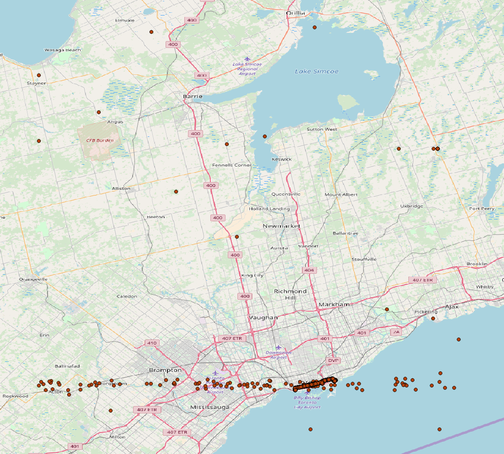
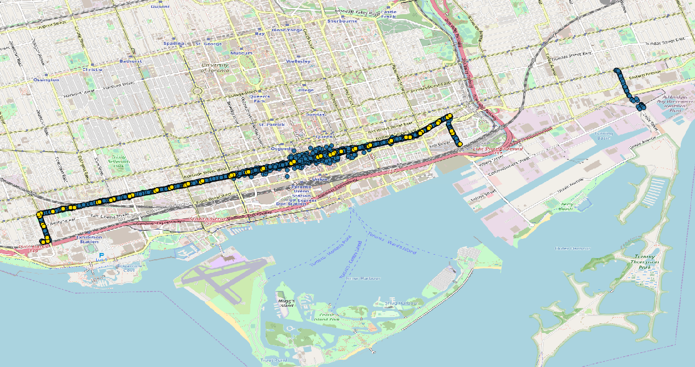
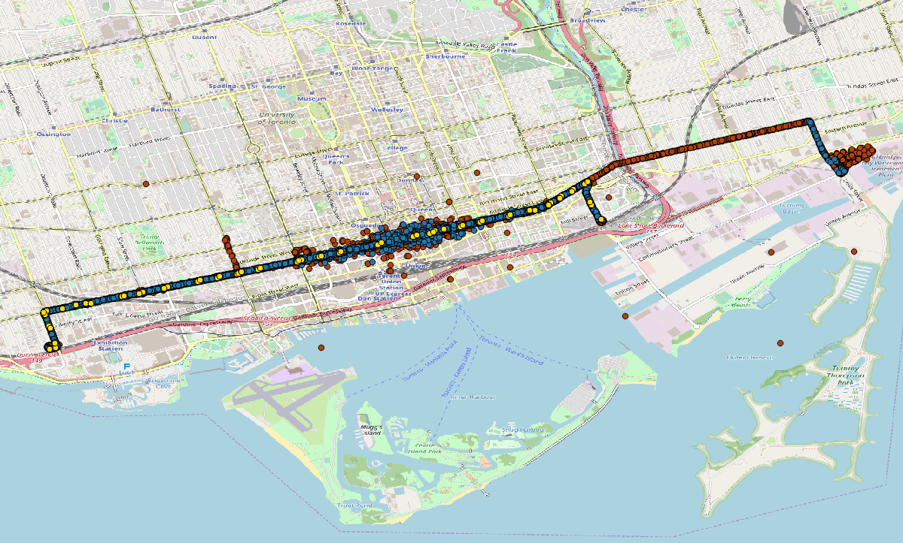

# The CIS processing procedure


### Step 1: Created the table that having the CIS data of route 514
Also, since the name of the time column in `ttc.cis_2017` is long, I shorten it to `date_time`.

```sql
SELECT message_datetime AS date_time, route, run, vehicle, latitude, longitude, position
INTO dzou2.test2_cis_514
FROM ttc.cis_2017
WHERE route = 514
```

### Step 2: Created the table that having the CIS data of route 514 and its angles with previous and next points.

```sql
WITH orders AS (

SELECT rank() OVER (order by date_time) AS rank_time,
        date_time, run, vehicle, latitude, longitude, position,
        degrees(ST_Azimuth(position, lag(position,1) OVER (partition by run order by date_time))) AS angle_previous,
        degrees(ST_Azimuth(position, lag(position,-1) OVER (partition by run order by date_time))) AS angle_next
    FROM dzou2.test2_cis_514
)

SELECT * INTO dzou2.test6_cis_514_angle
FROM orders
```

The first `angle_previous` and the last `angle_next` will be NULL, as well as the angles between two points which did not move. Thus, the next step is to change the NULL value to 0.

```sql
UPDATE dzou2.test6_cis_514_angle SET angle_next = 0 WHERE angle_next IS NULL
```

```sql
UPDATE dzou2.test6_cis_514_angle SET angle_previous = 0 WHERE angle_previous IS NULL
```

### Step 3: Obtained the stop patterns and directions of route 514 on 10/04/2017 by Raph's query.

```sql
WITH distinct_stop_patterns AS (SELECT DISTINCT ON (shape_id, stop_sequence) shape_id, direction_id, stop_sequence, stop_id
                                FROM gtfs_raph.trips_20171004
                                NATURAL JOIN gtfs_raph.stop_times_20171004
                                NATURAL JOIN gtfs_raph.routes_20171004
                                WHERE route_short_name = '514'
                                ORDER BY shape_id, stop_sequence)

SELECT shape_id, direction_id, ARRAY_AGG(stop_name ORDER BY stop_sequence)
FROM distinct_stop_patterns
NATURAL JOIN gtfs_raph.stops_20171004
GROUP BY shape_id, direction_id
ORDER BY direction_id
```

Result:

shape_id | direction_id | stop_order
--- | --- | ---
691040 | 0 |DUFFERIN GATE LOOP""	DUFFERIN ST AT LIBERTY ST""	DUFFERIN ST AT KING ST WEST""	DUFFERIN AT KING""	KING ST WEST AT FRASER AVE""	KING ST WEST AT ATLANTIC AVE""	KING ST WEST AT SUDBURY ST""	KING ST WEST AT SHAW ST""	KING ST WEST AT STRACHAN AVE""	KING ST WEST AT NIAGARA ST""	KING ST WEST AT TECUMSETH ST""	KING ST WEST AT BATHURST ST""	BATHURST AT KING""	KING ST WEST AT PORTLAND ST""	KING ST WEST AT SPADINA AVE""	KING ST WEST AT BLUE JAYS WAY""	KING ST WEST AT JOHN ST""	KING ST WEST AT UNIVERSITY AVE (ST ANDREW STATION)""	KING ST WEST AT BAY ST""	KING ST WEST AT YONGE ST (KING STATION)""	YONGE AT KING""	KING ST EAST AT CHURCH ST""	CHURCH AT KING""	KING ST EAST AT JARVIS ST""	KING ST EAST AT SHERBOURNE ST""	KING ST. E AT SHERBOURNE ST.""	KING ST EAST AT ONTARIO ST EAST SIDE""	KING ST EAST AT PARLIAMENT ST""	PARLIAMENT AT KING""	KING ST EAST AT TRINITY ST""	KING ST EAST AT SACKVILLE ST""	KING ST EAST AT SUMACH ST""	KING & SUMACH""	CHERRY ST AT FRONT ST EAST""	DISTILLERY LOOP""	DISTILLERY LOOP""}"
691041 | 0 | DUFFERIN GATE LOOP""	DUFFERIN ST AT LIBERTY ST""	DUFFERIN ST AT KING ST WEST""	DUFFERIN AT KING""	KING ST WEST AT FRASER AVE""	KING ST WEST AT ATLANTIC AVE""	KING ST WEST AT SUDBURY ST""	KING ST WEST AT SHAW ST""	KING ST WEST AT STRACHAN AVE""	KING ST WEST AT NIAGARA ST""	KING ST WEST AT TECUMSETH ST""	KING ST WEST AT BATHURST ST""	BATHURST AT KING""	KING ST WEST AT PORTLAND ST""	KING ST WEST AT SPADINA AVE""	KING ST WEST AT BLUE JAYS WAY""	KING ST WEST AT JOHN ST""	KING ST WEST AT UNIVERSITY AVE (ST ANDREW STATION)""	KING ST WEST AT BAY ST""	KING ST WEST AT YONGE ST (KING STATION)""	YONGE AT KING""	KING ST EAST AT CHURCH ST""	CHURCH AT KING""	KING ST EAST AT JARVIS ST""	KING ST EAST AT SHERBOURNE ST""	KING ST. E AT SHERBOURNE ST.""	KING ST EAST AT ONTARIO ST EAST SIDE""	KING ST EAST AT PARLIAMENT ST""	PARLIAMENT AT KING""}"
691042 | 1 | DISTILLERY LOOP""	CHERRY ST AT FRONT ST EAST""	KING & SUMACH""	KING ST EAST AT SACKVILLE ST""	KING ST EAST AT TRINITY ST""	KING ST EAST AT PARLIAMENT ST""	PARLIAMENT AT KING""	KING ST EAST AT ONTARIO ST""	KING ST EAST AT SHERBOURNE ST""	KING ST. E AT SHERBOURNE ST.""	KING ST EAST AT JARVIS ST""	KING ST EAST AT CHURCH ST""	CHURCH AT KING""	KING ST EAST AT VICTORIA ST""	KING ST EAST AT YONGE ST (KING STATION)""	YONGE AT KING""	KING ST WEST AT BAY ST""	KING ST WEST AT UNIVERSITY AVE (ST ANDREW STATION)""	KING ST WEST AT JOHN ST""	KING ST WEST AT PETER ST""	KING ST WEST AT SPADINA AVE""	SPADINA AT KING""	KING ST WEST AT PORTLAND ST""	KING ST WEST AT BATHURST ST""	BATHURST AT KING""	KING ST WEST AT TECUMSETH ST""	KING ST WEST AT NIAGARA ST""	KING ST WEST AT STRACHAN AVE""	KING ST WEST AT SHAW ST""	KING ST WEST AT SUDBURY ST""	KING ST WEST AT JEFFERSON AVE""	KING ST WEST AT JOE SHUSTER WAY""	KING ST WEST AT DUFFERIN ST""	DUFFERIN AT KING""	DUFFERIN ST AT LIBERTY ST""	DUFFERIN ST AT SPRINGHURST AVE""	DUFFERIN GATE LOOP""	EXHIBITION WEST LOOP""}"
691043 | 1 | PARLIAMENT AT KING""	KING ST EAST AT ONTARIO ST""	KING ST EAST AT SHERBOURNE ST""	KING ST. E AT SHERBOURNE ST.""	KING ST EAST AT JARVIS ST""	KING ST EAST AT CHURCH ST""	CHURCH AT KING""	KING ST EAST AT VICTORIA ST""	KING ST EAST AT YONGE ST (KING STATION)""	YONGE AT KING""	KING ST WEST AT BAY ST""	KING ST WEST AT UNIVERSITY AVE (ST ANDREW STATION)""	KING ST WEST AT JOHN ST""	KING ST WEST AT PETER ST""	KING ST WEST AT SPADINA AVE""	SPADINA AT KING""	KING ST WEST AT PORTLAND ST""	KING ST WEST AT BATHURST ST""	BATHURST AT KING""	KING ST WEST AT TECUMSETH ST""	KING ST WEST AT NIAGARA ST""	KING ST WEST AT STRACHAN AVE""	KING ST WEST AT SHAW ST""	KING ST WEST AT SUDBURY ST""	KING ST WEST AT JEFFERSON AVE""	KING ST WEST AT JOE SHUSTER WAY""	KING ST WEST AT DUFFERIN ST""	DUFFERIN AT KING""	DUFFERIN ST AT LIBERTY ST""	DUFFERIN ST AT SPRINGHURST AVE""	DUFFERIN GATE LOOP""	EXHIBITION WEST LOOP""}"


Thus, there are 2 patterns of the stops, and each pattern has 2 directions. Total 4 patterns.


### Step 4: Obtained the order and position for each stop based on last step.

This step is a little repetitive because there are 4 patterns.

```sql
WITH distinct_stop_patterns AS (SELECT DISTINCT ON (shape_id, stop_sequence) shape_id, direction_id, stop_sequence, stop_id
                                FROM gtfs_raph.trips_20171004
                                NATURAL JOIN gtfs_raph.stop_times_20171004
                                NATURAL JOIN gtfs_raph.routes_20171004
                                WHERE route_short_name = '514'
                                ORDER BY shape_id, stop_sequence)

SELECT shape_id, direction_id, stop_name, geom, ROW_NUMBER() OVER (ORDER BY stop_sequence) AS geom_order
INTO dzou2.test6_stop_pattern
FROM distinct_stop_patterns
NATURAL JOIN gtfs_raph.stops_20171004
WHERE shape_id = 691040 AND direction_id = 0
ORDER BY stop_sequence
```

```sql
WITH distinct_stop_patterns AS (SELECT DISTINCT ON (shape_id, stop_sequence) shape_id, direction_id, stop_sequence, stop_id
                                FROM gtfs_raph.trips_20171004
                                NATURAL JOIN gtfs_raph.stop_times_20171004
                                NATURAL JOIN gtfs_raph.routes_20171004
                                WHERE route_short_name = '514'
                                ORDER BY shape_id, stop_sequence)

INSERT INTO dzou2.test6_stop_pattern
SELECT shape_id, direction_id, stop_name, geom, ROW_NUMBER() OVER (ORDER BY stop_sequence) AS geom_order
FROM distinct_stop_patterns
NATURAL JOIN gtfs_raph.stops_20171004
WHERE shape_id = 691041 AND direction_id = 0
ORDER BY stop_sequence
```

```sql
WITH distinct_stop_patterns AS (SELECT DISTINCT ON (shape_id, stop_sequence) shape_id, direction_id, stop_sequence, stop_id
                                FROM gtfs_raph.trips_20171004
                                NATURAL JOIN gtfs_raph.stop_times_20171004
                                NATURAL JOIN gtfs_raph.routes_20171004
                                WHERE route_short_name = '514'
                                ORDER BY shape_id, stop_sequence)

INSERT INTO dzou2.test6_stop_pattern
SELECT shape_id, direction_id, stop_name, geom, ROW_NUMBER() OVER (ORDER BY stop_sequence) AS geom_order
FROM distinct_stop_patterns
NATURAL JOIN gtfs_raph.stops_20171004
WHERE shape_id = 691042 AND direction_id = 1
ORDER BY stop_sequence
```

```sql
WITH distinct_stop_patterns AS (SELECT DISTINCT ON (shape_id, stop_sequence) shape_id, direction_id, stop_sequence, stop_id
                                FROM gtfs_raph.trips_20171004
                                NATURAL JOIN gtfs_raph.stop_times_20171004
                                NATURAL JOIN gtfs_raph.routes_20171004
                                WHERE route_short_name = '514'
                                ORDER BY shape_id, stop_sequence)

INSERT INTO dzou2.test6_stop_pattern
SELECT shape_id, direction_id, stop_name, geom, ROW_NUMBER() OVER (ORDER BY stop_sequence) AS geom_order
FROM distinct_stop_patterns
NATURAL JOIN gtfs_raph.stops_20171004
WHERE shape_id = 691043 AND direction_id = 1
ORDER BY stop_sequence
```

After running these queries, the table `dzou2.test6_stop_pattern` has the data of shape_id, direction_id, stop_name, and the order of stops for each pattern.

### Step 5:  Created the table that having the GTFS stop data of route 514 on 10/04/2017 and its angles with previous and next points.

```sql
WITH order_stop AS (

SELECT shape_id, direction_id, stop_name, geom, geom_order,
        degrees(ST_Azimuth(geom, lag(geom,1) OVER (geom_order))) AS angle_previous,
        degrees(ST_Azimuth(geom, lag(geom,-1) OVER (geom_order))) AS angle_next
    FROM dzou2.test6_stop_pattern
)

SELECT * INTO dzou2.test6_stop_angle
FROM order_stop
```

The first `angle_previous` and the last `angle_next` will be NULL. Thus, the next step is to change the NULL value to 0.

```sql
UPDATE dzou2.test6_stop_angle SET angle_next = 0 WHERE angle_next IS NULL
```

```sql
UPDATE dzou2.test6_stop_angle SET angle_previous = 0 WHERE angle_previous IS NULL
```

### Step 6: Find the nearest GTFS stop for each CIS data and the distance between them

```sql
WITH cis_1004 AS (
SELECT *
FROM dzou2.test6_cis_514_angle
WHERE date(date_time) = '2017-10-04'),

nearest_point AS (

SELECT date_time, vehicle, run, latitude AS cis_latitude, longitude AS cis_longitude, position AS cis_position,
CIS.angle_previous AS cis_angle_pre, CIS.angle_next AS cis_angle_next, stop_name, nearest.angle_previous AS stop_angle_pre,
nearest.angle_next AS stop_angle_next, geom AS nearest_stop, direction_id
	FROM  (SELECT date_time, vehicle, run, latitude, longitude, position, angle_previous, angle_next FROM cis_1004) CIS
	CROSS JOIN LATERAL
		(SELECT stop_name, angle_previous, angle_next, direction_id, geom FROM dzou2.test6_stop_angle stops
		WHERE direction_id IN (0, 1)
		ORDER BY stops.geom <-> CIS.position LIMIT 1
		) nearest
)

SELECT *, ST_Distance(cis_position::geography,nearest_stop::geography)
INTO dzou2.test6_cis_direction_2
FROM nearest_point
WHERE (cis_angle_pre BETWEEN stop_angle_pre - 45 AND stop_angle_pre + 45) AND
      (cis_angle_next BETWEEN stop_angle_next - 45 AND stop_angle_next + 45)
```

### Step 7: Created a table stores the the non-matches

```sql
WITH cis_1004 AS (
SELECT *
FROM dzou2.test6_cis_514_angle
WHERE date(date_time) = '2017-10-04'),

nearest_point AS (

SELECT date_time, vehicle, run, latitude AS cis_latitude, longitude AS cis_longitude, position AS cis_position,
CIS.angle_previous AS cis_angle_pre, CIS.angle_next AS cis_angle_next, stop_name, nearest.angle_previous AS stop_angle_pre,
nearest.angle_next AS stop_angle_next, geom AS nearest_stop, direction_id
	FROM  (SELECT date_time, vehicle, run, latitude, longitude, position, angle_previous, angle_next FROM cis_1004) CIS
	CROSS JOIN LATERAL
		(SELECT stop_name, angle_previous, angle_next, direction_id, geom FROM dzou2.test6_stop_angle stops
		WHERE direction_id IN (0, 1)
		ORDER BY stops.geom <-> CIS.position LIMIT 1
		) nearest
)

SELECT *, ST_Distance(cis_position::geography,nearest_stop::geography)
INTO dzou2.test6_non_match
FROM nearest_point
WHERE cis_angle_pre < stop_angle_pre - 45 OR cis_angle_pre > stop_angle_pre + 45
      OR cis_angle_next < stop_angle_next - 45 OR cis_angle_next > stop_angle_next + 45
```

### Result shows on the map:

(all the data are limited to route 514 and 10/04/2017)

Blue points: the CIS data with a matched direction

Yellow points: the nearest GTFS stops of the blues

Red points: the non-matches


[The distribution of the CIS data with a matched direction]



[The distribution of the non-matched CIS data]



[comparison between CIS data with a matched direction and their nearest GTFS stops in downtown area]


[comparison among non-matches, CIS data with a matched direction and their nearest GTFS stops in downtown area]
