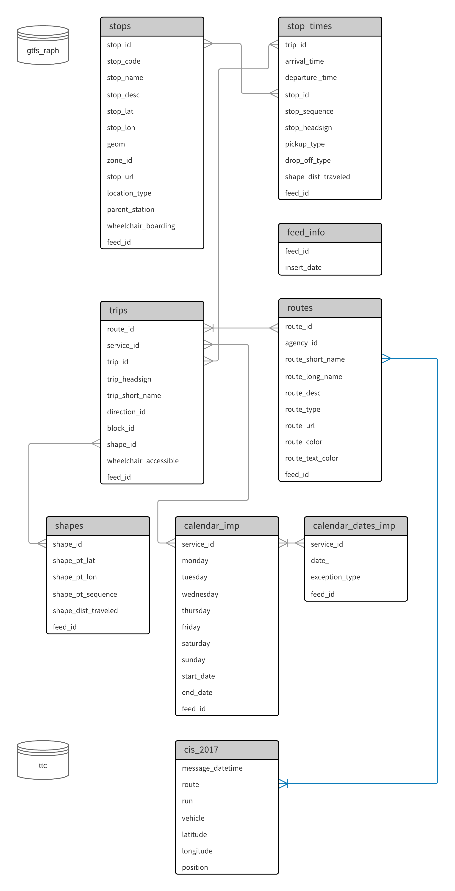

# GTFS data

The [General Transit Feed Specification
](http://gtfs.org/) (GTFS) is a static, human-and-machine-readable transit schedule, originally intended to provide transit routing for Google Maps. Because our analyses are historical, we need to examine multiple schedules. These schedules are stored together in tables in the `gtfs` schema. To distinguish between schedules a `feed_id` column was added to every table. This column may not be in chronological order. Look at `feed_info` to know when a schedule was inserted, and `calendar` to see the range of dates for which the feed was valid.

After unzipping a GTFS zip, run the `upload_feed.sh` shell script to grab the latest `feed_id` and update its insert time, then copy each of the tables into the database, and finally `UPDATE` the `feed_id` column for every table.

## Relationships of GTFS tables and CIS tablespace

The entity relationship diagram (ERD) indicates the common columns in the schema `gtfs` in the Big Data Innovation Team's own PostgreSQL database, and how schema `gtfs` and table `cis_2017` in schema `ttc` share the same value of information.

