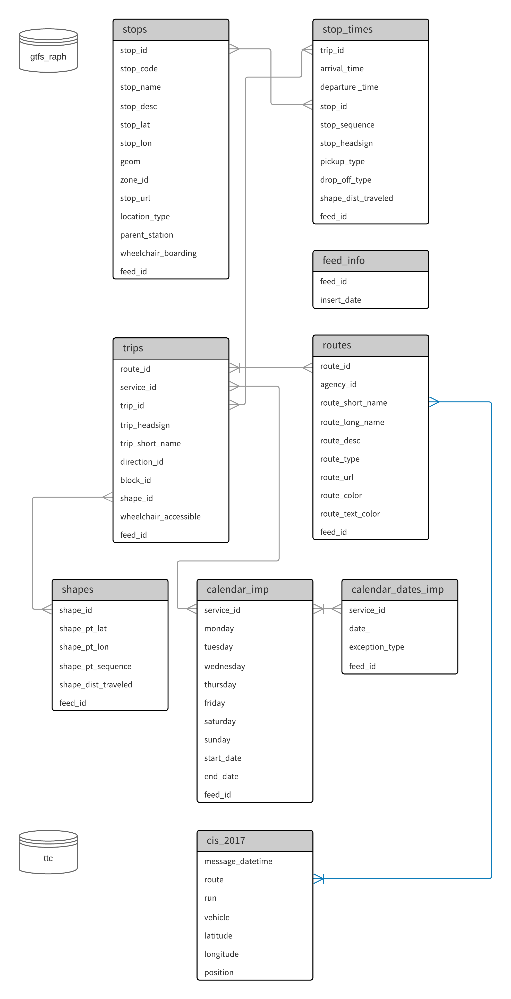

- [GTFS data](#gtfs-data)
  - [Querying the data](#querying-the-data)
  - [Archive](#archive)
    - [Relationships of GTFS tables and CIS tablespace](#relationships-of-gtfs-tables-and-cis-tablespace)

# GTFS data

The [General Transit Feed Specification
](http://gtfs.org/) (GTFS) is a static, human-and-machine-readable transit schedule, originally intended to provide transit routing for Google Maps. Because our analyses are historical, we need to examine multiple schedules. These schedules are stored together in tables in the `gtfs` schema. To distinguish between schedules a `feed_id` column was added to every table. This column may not be in chronological order. Look at `feed_info` to know when a schedule was inserted, and `calendar` to see the range of dates for which the feed was valid.

An Airflow DAG `gtfs_pull` checks [Toronto Open data](https://open.toronto.ca/dataset/ttc-routes-and-schedules/) for new schedules daily and inserts them into bigdata `gtfs` schema with `feed_info.insert_date` as the `last_refreshed` attribute from Open Data.


## Querying the data

Here is an example query to find streetcar routes from a specific feed version (this may be faster):

```sql
SELECT DISTINCT shapes_geom.geom
FROM gtfs.feed_info
JOIN gtfs.routes USING (feed_id)
JOIN gtfs.trips USING (feed_id, route_id)
JOIN gtfs.shapes_geom USING (feed_id, shape_id)
WHERE
    route_type = 0 --streetcar
    AND feed_info.insert_date = '2025-07-18 13:59:29+00' --manually select a feed
```

or using the `_latest` views to find the most recent (`_latest` views may be slower):

```sql
SELECT DISTINCT shapes_geom_latest.geom
FROM gtfs.routes_latest
JOIN gtfs.trips_latest USING (route_id)
JOIN gtfs.shapes_geom_latest USING (shape_id)
WHERE
    route_type = 0 --streetcar
```

## Archive

### Relationships of GTFS tables and CIS tablespace

The entity relationship diagram (ERD) indicates the common columns in the schema `gtfs` in the Big Data Innovation Team's own PostgreSQL database, and how schema `gtfs` and table `cis_2017` in schema `ttc` share the same value of information.


