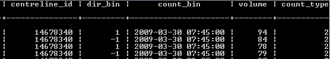
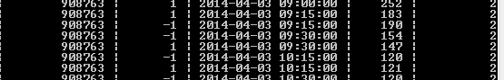
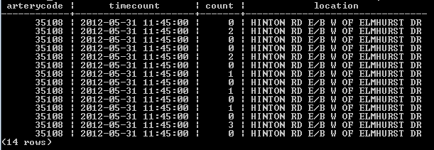
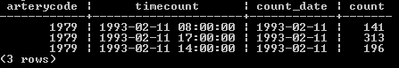
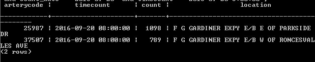
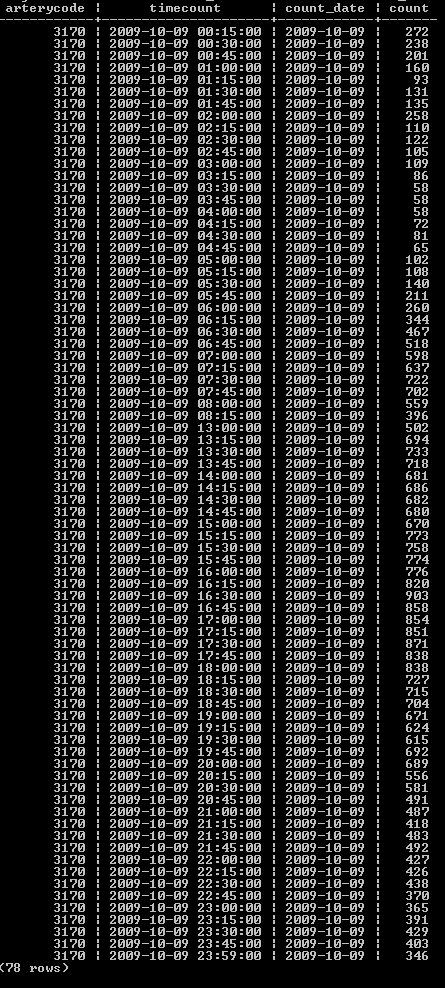

# TMC
## 1. Some counts are in 5 min bins.
## 2. There are gaps in between volume count times 
	recorded as 0 volume in the table.
	usually 12:15-13:00 and 15:15-16:00.
## 3. Duplicate Volume (same segment, same direction, same timestamp)
	result from counting at adjacent intersections at the same time

## 4. Random gaps (0 volume) in the counts

# ATR
## 1. Same arterycode, same datetime -> 2 records, or 14
	different lanes? but happens on both locals and highways

## 2. 2-5 records at scattered times for the day

## 3. Different arterycode referring to the same segment, different volumes

	There is no Gardiner ramp between Parkside and Roncesvalles
## 4. Missing counts for a few hours in the day (sometimes middle, sometimes overnight)
	seem to be a day-specific issue. On one day all counts are missing for a same certain number of hours.

