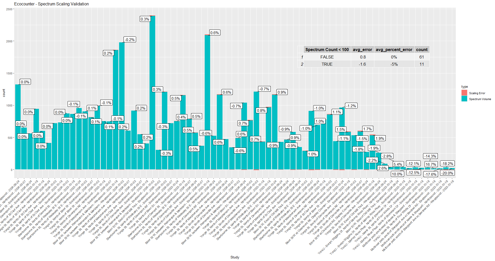

This folder contains two R scripts used for data validation. 

## [`qc_shiny_app.r`](./qc_shiny_app.r)
- An R script for generating QC plots in a (local) interactive R Shiny app. Can also be used for labelling anomalous ranges interactively, and then exporting new ranges to .txt as a query ready for insertion to the database. 
- You should store a config.yml file containing your database credentials at `~/../OneDrive - City of Toronto/Documents/R`. 

## [`qc_plots_pdf.r`](./qc_plots_pdf.r)
- An R script for generating QC plots to pdf. 

## Calibration - Validation

[`scaling_validation.r`](./scaling_validation.r): Script used for generating QC plots to validate the calibration (rounding) method.
- Investigation applied the daily calibration factors developed from the manual studies to the 15 minute bins, and then summed the rounded 15 minute values to the daily level to check error introduced by rounding. 
- For higher volume sites (>100), the average error was 0.8 bikes per day (around 0.1%).
- For low volume sites (<100), the average error was -1.6 bikes per day (around -5%), indicating a minor undercounting. 

- Validation of calibration factors by Site and Study date, showing % error vs ground truth (Spectrum) data:
  

- Validation of calibration factors by Site and Study date, showing # error vs ground truth (Spectrum) data:
  
