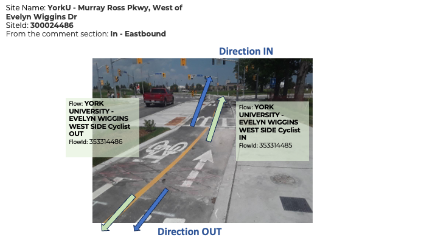

<!-- TOC -->

    - [Discontinuities](#discontinuities)
    - [Using the Ecocounter API](#using-the-ecocounter-api)
        - [Note](#note)
    - [Historical data](#historical-data)
    - [ecocounter_pull DAG](#ecocounter_pull-dag)
    - [ecocounter_check DAG](#ecocounter_check-dag)
- [SQL Tables](#sql-tables)
  - [Main Tables](#main-tables)
    - [`ecocounter.sites_unfiltered`](#ecocountersites_unfiltered)
    - [`ecocounter.counts_unfiltered`](#ecocountercounts_unfiltered)
    - [`ecocounter.flows_unfiltered`](#ecocounterflows_unfiltered)
  - [QC Tables](#qc-tables)
    - [`ecocounter.discontinuities`](#ecocounterdiscontinuities)
    - [`ecocounter.anomalous_ranges`](#ecocounteranomalous_ranges)
  - [Validation](#validation)
    - [`ecocounter.manual_counts_matched`](#ecocountermanual_counts_matched)
    - [`ecocounter.manual_counts_info`](#ecocountermanual_counts_info)
    - [`ecocounter.manual_counts_raw`](#ecocountermanual_counts_raw)

<!-- /TOC -->

A **flow** (sometimes also referred to as a _channel_) is a direction of travel recorded at a site. A site may have 1, 2, or 4 flows depending on whether one or two sensors are installed and whether they record the two directions of travel separately.

Each flow has `counts` of bikes at regularly spaced intervals. All sensors now use 15 minute bins though some previously were configured with 30 minute or one-hour bins. The bin size is indicated in the `flows` table and the `counts` table gives the _start_ time of the bin.

### Flows - what we know

Flows are not always clearly documented, making it hard at present to easily determine which way cyclists were travelling over any given sensor. This is a known issue that we're working with the vendor to resolve. If you can't easily determine the direction of travel, you probably just need to aggregate to the _site_ level. 

Some of the newer sites have flows labelled in the system as "IN" and "OUT". Below are two site-specific flow diagrams provided by Ecocounter. Do not (yet) assume you know what these values mean at other sites. 




From an email from Pierre, of Ecocounter:
> The IN and OUT disparities are configured during the setup of the counter. With the Zelt system that you own, there can only be two directions: IN and OUT, but there can be several flows. In the case of Murray Ross Parkway, some details about the direction were left in the comments section: IN – Northbound. In the following two examples, both counting sites have four loops installed on the bike paths, but in one case, four flows were configured, and only two for the second site. In the first example, both IN flows have the same name, but they have different flowId.

## Discontinuities

In January of 2024, it was determined that several sites were undercounting relative to other counting methods. To address this, the sensitivity of these sites was increased. 
As a result of the change however, we now expect to have some degree of discontinuity in the data where counts before and after a certain point in time may not be directly comparable. 

While we're still working through how best to handle this, we have recorded the times and sites that were effected in a new table, `ecocounter.discontinuities`.

## Using the Ecocounter API

The documentation for the Ecocounter API lives here: https://developers.eco-counter.com/

It took a bit of effort to figure out how to properly authenticate to receive a token, and the process for doing that is now embodied in code in the file [`pull-data-from-api.py`](./pull-data-from-api.py)

To run this code, it's necessary to set up a configuration file with the API credentials. An example of the structure for this file is provided here: [sample-api-credentials.config](./sample-api-credentials.config). Airflow uses a config file saved at `/data/airflow/data_scripts/volumes/ecocounter/.api-credentials.config`. 

### Note

The API documentation mentions the endpoint `/data/site/<SITE_ID>` but it also returns channel/flow data via `/data/site/<FLOW_ID>`.

## Historical data

Several sensors in the current Ecocounter network go much further back, with the sensor at Bloor and Castle Frank starting in June of 1994. These older data were collected by a different vendor and are stored in the `traffic` schema. Like other data in `cnt_det` counts are in 15 minute bins.

```sql
SELECT
    count_info_id,
    arterycode,
    arterydata.location,
    cnt_det.timecount,
    cnt_det.count
FROM traffic.countinfo
JOIN traffic.cnt_det USING (count_info_id)
JOIN traffic.arterydata USING (arterycode)
WHERE category_id = 7 -- bike counts
ORDER BY cnt_det.timecount
LIMIT 1000;
```

<!-- ecocounter_pull_doc_md -->

## `ecocounter_pull` DAG
The `ecocounter_pull` DAG runs daily at 3am to populate `ecocounter` schema with new data. 

- `pull_recent_outages` task is similar to `pull_ecocounter` task except it tries to pull data corresponding to zero volume outages within the last 60 days. This was implemented following the finding that some Ecocounters will suddenly backfill missing data due to spotty cellular signal. Max ~2 weeks of backfilling has been observed so the task was conservatively set to look back 60 days. 

- `check_partitions` TaskGroup
  - `check_annual_partition` checks if execution date is January 1st.  
  - `create_annual_partitions` creates a new annual partition for `ecocounter.counts_unfiltered` if previous task succeeds.  
  
- `update_sites_and_flows` task identifies any sites and "flows" (known as channels in the API) in the API which do not exist in our database and adds them to `ecocounter.sites_unfiltered` and `ecocounter.flows_unfiltered`. The new rows contain a flag `validated = null` indicating they still need to be manually validated. A notification is sent with any new additions.  
- `pull_ecocounter` task pulls data from the Ecocounter API and inserts into the `ecocounter.counts_unfiltered` table. 
- `done` is an external task marker to trigger the `ecocounter_check` DAG for additional "yellow card" data checks.  
   
- `data_checks` TaskGroup: This task group runs data quality checks on the pipeline output.  
  - `wait_for_weather` delays the downstream data check by a few hours until the historical weather is available to add context.  
  - `check_volume` checks the sum of volume in `ecocounter.counts` (filtered view) and notifies if less than 70% of the 60 day lookback avg.  
  - `check_distinct_flow_ids` checks the count of distinct flow_ids appearing in `ecocounter.counts` (filtered view) and notifies if less than 70% of the 60 day lookback avg.  
<!-- ecocounter_pull_doc_md -->

<!-- ecocounter_check_doc_md -->

## `ecocounter_check` DAG
The `ecocounter_check` DAG runs daily at 4am following completion of `ecocounter_pull` to perform additional "yellow card" data checks on the new data.  

- `starting_point` is an external task sensor to ensure `ecocounter_pull` DAG is complete before running.  
- `check_site_outages` runs a `SQLCheckOperatorWithReturnValue` to check for sites with zero volumes and send a slack notification with their details. Does not trigger until day 2 of outage. 
- `check_if_sunday` checks if execution date is Sunday in order to only trigger the following check once weekly on Mondays.
- `check_unvalidated_sites` runs a `SQLCheckOperatorWithReturnValue` to check for unvalidated sites or flows with non-zero volumes this week and send a slack notification with their details. 
<!-- ecocounter_check_doc_md -->

# SQL Tables

## Main Tables
Key tables `ecocounter.sites_unfiltered`, `ecocounter.flows_unfiltered`, `ecocounter.counts_unfiltered` each have corresponding VIEWs filtered only to sites/flows marked as `validated` by a human: `ecocounter.sites`, `ecocounter.flows`, `ecocounter.counts`. They otherwise have the same structure as the parent tables described below. 

### `ecocounter.sites_unfiltered`
CAUTION: Use VIEW `ecocounter.sites` which includes only sites verified by a human. Sites or "locations" of separate ecocounter installations. Each site may have one or more flows.
When you want to update new rows with missing `centreline_id`s, use [this script](./updates/ecocounter_centreline_updates.sql).  

| column_name | data_type | sample | comments |
|:------------|:----------|:-------|:---------|
| validated | boolean | | |
| site_id | numeric | | |
| site_description | text | | |
| geom | geometry |  | |
| facility_description | text | | description of bike-specific infrastructure which the sensor is installed within |
| notes | text | | |
| replaced_by_site_id  | numeric | | Several sites had their sensors replaced and show up now as "new" sites though we should ideally treat the data as continuous with the replaced site. This field indicates the site_id of the new replacement site, if any. |
| centreline_id | integer | | The nearest street centreline_id, noting that ecocounter sensors are only configured to count bike like objects on a portion of the roadway ie. cycletrack or multi-use-path. Join using `JOIN gis_core.centreline_latest USING (centreline_id)`. |
| first_active | timestamp without time zone | | First timestamp site_id appears in ecocounter.counts_unfiltered. Updated using trigger with each insert on ecocounter.counts_unfiltered. |
| last_active | timestamp without time zone | | Last timestamp site_id appears in ecocounter.counts_unfiltered. Updated using trigger with each insert on ecocounter.counts_unfiltered. |


### `ecocounter.counts_unfiltered`
CAUTION: Use VIEW `ecocounter.counts` instead to see only data that has been screened for
* manually validated sites
* manually validated flows
* absence of manually identified anomalous ranges (in the `do-not-use` `problem_level`)

This Table contains the actual binned counts for ecocounter flows. Please note that
bin size varies for older data, so averaging these numbers may not be straightforward.

Row count: 3,147,432
| column_name | data_type | sample | Comments |
|:------------|:----------|:-------|:---------|
| flow_id | numeric | 101052525 | |
| datetime_bin  | timestamp without time zone | 2012-12-04 09:00:00 | indicates start time of the time bin. Note that not all time bins are the same size! |
| volume | smallint | | |

### `ecocounter.flows_unfiltered`
CAUTION: Use VIEW `ecocounter.flows` which includes only flows verified by a human. A flow is usually a direction of travel associated with a sensor at an ecocounter installation site. For earlier sensors that did not detect directed flows, a flow may be both directions of travel together, i.e. just everyone who passed over the sensor any which way.

Row count: 73
| column_name | data_type | sample | Comments |
|:------------|:----------|:-------|:---------|
| validated | boolean | True  | |
| includes_contraflow | boolean | True | Does the flow also count travel in the reverse of the indicated flow direction? TRUE indicates that the flow, though installed in one-way infrastucture like a standard bike lane, also counts travel going the wrong direction within that lane. |
| replaces_flow_id | numeric | | |
| flow_id | numeric | 104042943 | |
| site_id | numeric | 100042943 | |
| flow_direction | text | westbound (includes contraflow) |  |
| flow_geom | geometry | | A two-node line, where the first node indicates the position of the sensor and the second indicates the normal direction of travel over that sensor relative to the first node. I.e. the line segment is an arrow pointing in the direction of travel. |
| bin_size | interval | 0 days 00:15:00 | temporal bins are either 15 or 30 minutes, depending on the sensor |
| notes | text | | |
| replaced_by_flow_id | numeric | 353363669 | |
| first_active | timestamp without time zone | | First timestamp flow_id appears in ecocounter.counts_unfiltered. Updated using trigger with each insert on ecocounter.counts_unfiltered. |
| last_active | timestamp without time zone | | Last timestamp flow_id appears in ecocounter.counts_unfiltered. Updated using trigger with each insert on ecocounter.counts_unfiltered. |

## QC Tables
These tables are used by  `ecocounter_admins` to document discontinuities and anomalous ranges in the Ecocounter data when identified.

### `ecocounter.discontinuities`
Moments in time when data collection methods changed in such a way that we would expect clear pre- and post-change paradigms that may not be intercomparable.

Row count: 7
| column_name   | data_type                   | sample                                                                                                                                                                                  |   Comments |
|:--------------|:----------------------------|:----------------------------------------------------------------------------------------------------------------------------------------------------------------------------------------|-----------:|
| uid           | integer                     | 1                                                                                                                                                                                       |        nan |
| site_id       | numeric                     | 300031255.0                                                                                                                                                                             |        nan |
| break         | timestamp without time zone | 2024-01-11 00:00:00                                                                                                                                                                     |        nan |
| give_or_take  | interval                    | 1 days 00:00:00                                                                                                                                                                         |        nan |
| notes         | text                        | A validation study found that several sensors, including this one, were undercounting bikes. The correct this, the sensitivity of the sensors at this site were increased  by one unit. |        nan |

### `ecocounter.anomalous_ranges`
A means of flagging periods with questionable data.

Row count: 9
| column_name         | data_type   | sample                                                                                       |   Comments |
|:--------------------|:------------|:---------------------------------------------------------------------------------------------|-----------:|
| flow_id             | numeric     |                                                                                              |        nan |
| site_id             | numeric     | 100042942.0                                                                                  |        nan |
| time_range          | tsrange     | [2021-02-09 00:00:00, None)                                                                  |        nan |
| notes               | text        | Goes from reporting in the hundreds daily to mostly single digits. What could have happened? |        nan |
| investigation_level | text        | suspect                                                                                      |        nan |
| problem_level       | text        | do-not-use                                                                                   |        nan |
| uid                 | smallint    | 2                                                                                            |        nan |

## Validation
These tables were created to compare Ecocounter data with Spectrum counts. For more information see: [data_collection_automation/ecocounter_validation_counts](https://github.com/Toronto-Big-Data-Innovation-Team/data_collection_automation/tree/ecocounter_validation_counts/ecocounter_validation_counts). 

### `ecocounter.manual_counts_matched`
Spectrum manual count volumes matched to eco-counter volumes. 1 row per 15min bin. Used for eco-coounter data validation. 

Row count: 2,944
| column_name             | data_type              | sample     |   Comments |
|:------------------------|:-----------------------|:-----------|-----------:|
| ecocounter_site_id      | integer                | 300024437  |        nan |
| ecocounter_approach     | text                   | N          |        nan |
| spectrum_approach       | character varying      | N          |        nan |
| ecocounter_direction    | text                   | Southbound |        nan |
| count_date              | date                   | 2023-10-18 |        nan |
| time_bin                | time without time zone | 06:00:00   |        nan |
| bikes_road_spectrum     | integer                | 0          |        nan |
| bikes_sidewalk_spectrum | integer                | 0          |        nan |
| bikes_path_spectrum     | integer                | 0          |        nan |
| ecocounter_bikes        | bigint                 | 0          |        nan |

### `ecocounter.manual_counts_info`
Spectrum manual bike count information, matched to eco-counter sites. Used for validation of eco-counter data. 1 row per manual count location.

Row count: 21
| column_name                     | data_type         | sample                                                                                     |   Comments |
|:--------------------------------|:------------------|:-------------------------------------------------------------------------------------------|-----------:|
| study_id                        | character varying | TOR23G9S                                                                                   |        nan |
| spectrum_location               | text              | BLOOR ST W & MARKHAM ST - PALMERSTON BLVD                                                  |        nan |
| count_date                      | date              | 2023-10-18                                                                                 |        nan |
| request_id                      | integer           | 208001                                                                                     |        nan |
| municipal_id                    | integer           | 8353520                                                                                    |        nan |
| latitude                        | numeric           | 43.664748                                                                                  |        nan |
| longitude                       | numeric           | -79.413012                                                                                 |        nan |
| filename                        | text              | BLOOR ST W & MARKHAM ST - PALMERSTON BLVD_2023-10-18.xlsx                                  |        nan |
| ecocounter_location             | text              | Bloor St W, between Palmerston & Markham                                                   |        nan |
| ecocounter_site_id              | integer           | 300031255                                                                                  |        nan |
| ecocounter_facility_description | text              | bike lane                                                                                  |        nan |
| distance                        | numeric           | 6.98012450818035                                                                           |        nan |
| count_geom                      | USER-DEFINED      | 0101000020E6100000C136E2C96EDA53C06C0A647616D54540                                         |        nan |
| match_line_geom                 | USER-DEFINED      | 0102000020E610000002000000C136E2C96EDA53C06C0A647616D545406FEF6C1D70DA53C010E9EEBB15D54540 |        nan |

### `ecocounter.manual_counts_raw`
Spectrum manual bike counts at eco-counter locations - raw data, 15min bins

Row count: 3,072
| column_name             | data_type              | sample   |   Comments |
|:------------------------|:-----------------------|:---------|-----------:|
| request_id              | integer                | 208007   |        nan |
| approach                | character varying      | N        |        nan |
| time_bin                | time without time zone | 06:00:00 |        nan |
| bikes_road_spectrum     | integer                | 0        |        nan |
| bikes_sidewalk_spectrum | integer                | 0        |        nan |
| bikes_path_spectrum     | integer                | 4        |        nan |
