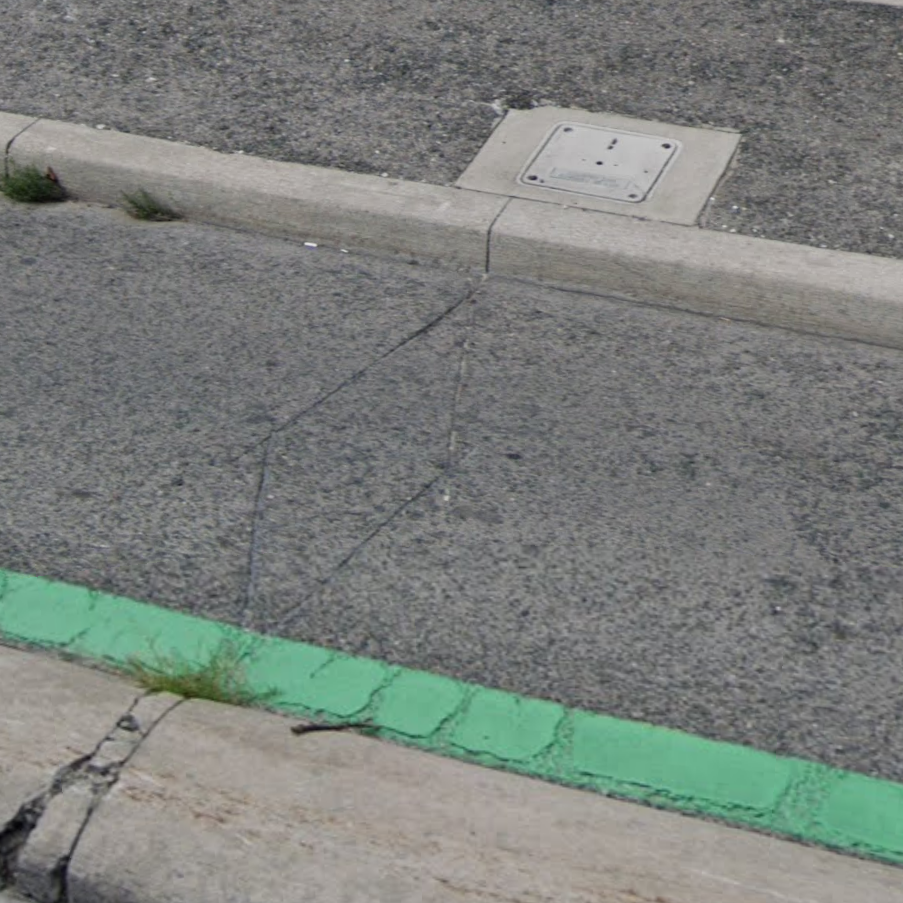
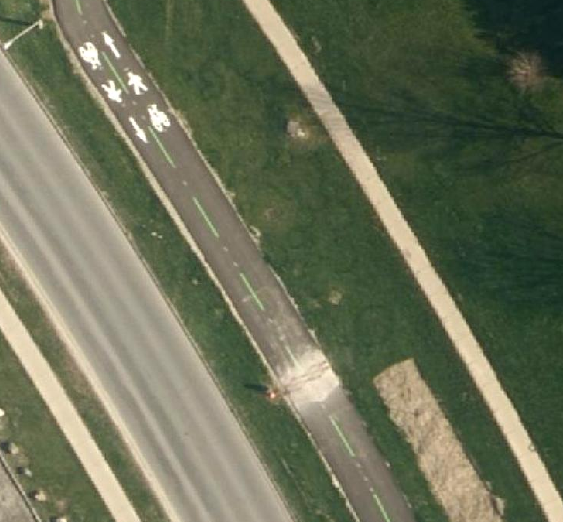

# Eco-Counter permanent bicycle count sensors

This dataset comes from a small but growing number of permanent [loop detectors](https://en.wikipedia.org/wiki/Induction_loop) installed within designated bicycle infrastructure such as bike lanes and multi-use paths. This is actually one of our older data collection programs, and the data have been handled in a number of ways over the years and now reside in a couple different places in the `bigdata` database.

There is a web dashboard at https://www.eco-visio.net that should show all active installations. 

## Installation types
There are two types of sensors, which can be easily distinguished. The single sensor installations, as below simply count the number of bikes that pass over the sensor. These are installed in one-way infrastructure such as a typical bike lane. 



Increasingly however newer installations are using a double sensor that can detect the direction of travel as well. Sometimes these paired sensors are themselves installed in pairs, giving four measured directed flows per site.



## Recent data

The more recent data (circa ~2020 onward) is stored in the `ecocounter` schema in three tables:

* `sites`
* `flows`
* `counts`

A **site** is a distinct location, sometimes referring to one and sometimes to two directions of travel on the same path or street. A site is recorded as a point geometry at the centroid of the sensor(s) it represents.

A **flow** is a direction of travel recorded at a site. A site may have 1, 2, or 4 flows depending on whether one or two sensors are installed and whether they record the two directions of travel separately.

Each flow has `counts` of bikes at regularly spaced intervals. Most sensors use 15 minute bins though some use 30 minute bins. The bin size is indicated in the `flows` table and the `counts` table gives the _start_ time of the bin.  

## Historical data

Several sensors go much further back, with the sensor at Bloor and Castle Frank starting in June of 1994. These older data are stored in the `traffic` schema. 

```sql
SELECT
    arterycode,
    arterydata.location,
    countinfo.count_date,
    cnt_det.count
FROM traffic.countinfo
JOIN traffic.cnt_det USING (count_info_id)
JOIN traffic.arterydata USING (arterycode)
WHERE category_id = 7 -- bike counts
LIMIT 1000;
```