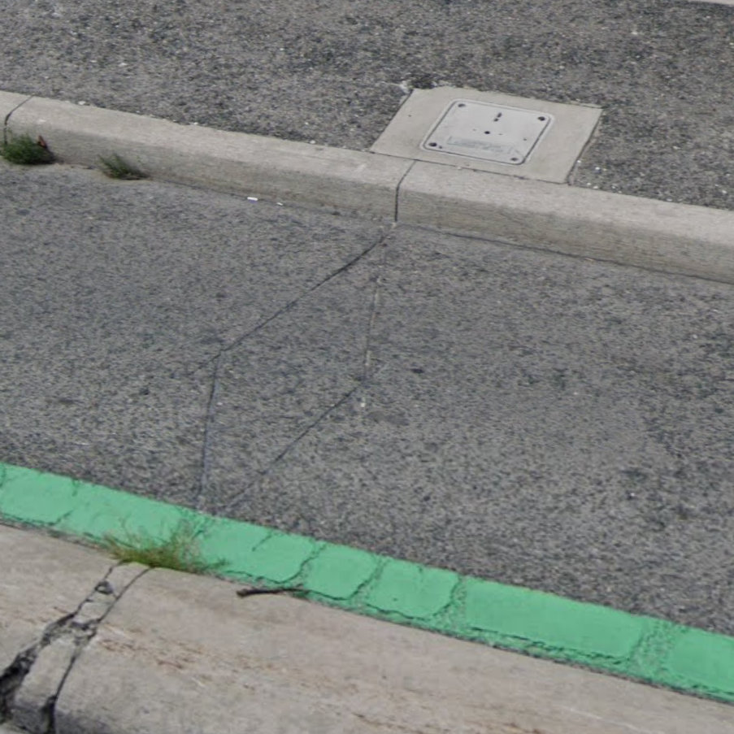
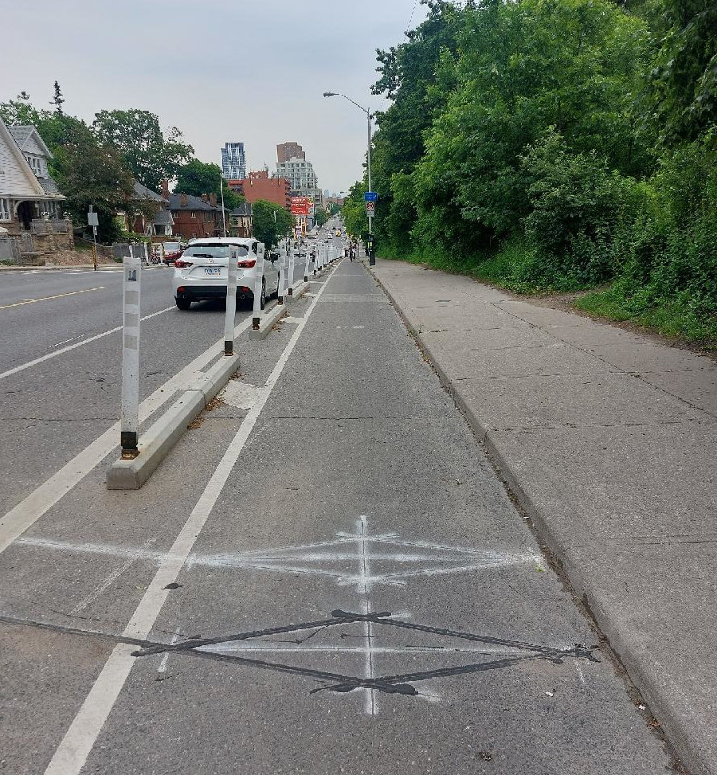
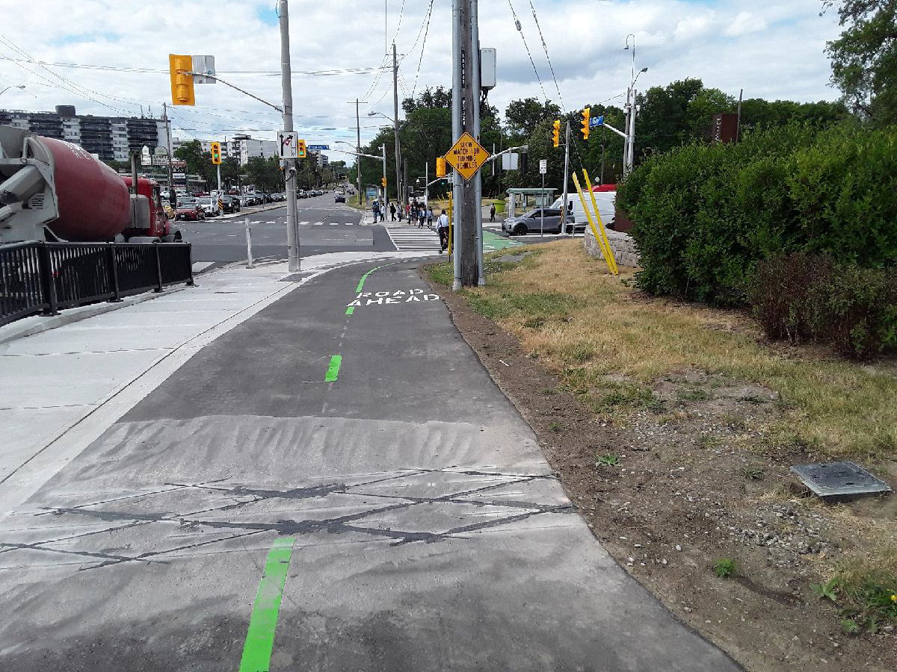

# Bicycle loop detectors

This dataset comes from a small but growing number of permanent [loop detectors](https://en.wikipedia.org/wiki/Induction_loop) installed within designated bicycle infrastructure such as bike lanes and multi-use paths. This is actually one of our older data collection programs, and the data have been handled in a number of ways over the years and now reside in a couple different places in the `bigdata` database.

Ecocounter is the vendor that manages our current sensor installations. There is a web dashboard at https://www.eco-visio.net that should show all active installations.

## Installation types
There are two types of sensors, which can be easily distinguished. The single sensor installations, as below simply count the number of bikes that pass over the sensor. These are installed in one-way infrastructure such as a typical bike lane. 



Increasingly however newer installations are using a double sensor that can detect the direction of travel as well. In cases like the image below this allows us to measure contra-flow travel within the bike lane. 



Sometimes these paired sensors are themselves installed in pairs, giving four measured flows per site, two per lane. 



## Ecocounter data

Data from these sensors is stored in the `ecocounter` schema in three tables:

* `sites`
* `flows`
* `counts`

A **site** is a distinct location, sometimes referring to one and sometimes to two directions of travel on the same path or street. A site is recorded as a point geometry at the centroid of the sensor(s) it represents.

A **flow** (sometimes also referred to as a _channel_) is a direction of travel recorded at a site. A site may have 1, 2, or 4 flows depending on whether one or two sensors are installed and whether they record the two directions of travel separately.

Each flow has `counts` of bikes at regularly spaced intervals. All sensors now use 15 minute bins though some previously were configured with 30 minute or one-hour bins. The bin size is indicated in the `flows` table and the `counts` table gives the _start_ time of the bin.

### Flows - what we know

Flows are not always clearly documented, making it hard at present to easily determine which way cyclists were travelling over any given sensor. This is a known issue that we're working with the vendor to resolve. If you can't easily determine the direction of travel, you probably just need to aggregate to the _site_ level. 

Some of the newer sites have flows labelled in the system as "IN" and "OUT". Below are two site-specific flow diagrams provided by Ecocounter. Do not (yet) assume you know what these values mean at other sites. 


From an email from Pierre, of Ecocounter:
> The IN and OUT disparities are configured during the setup of the counter. With the Zelt system that you own, there can only be two directions: IN and OUT, but there can be several flows. In the case of Murray Ross Parkway, some details about the direction were left in the comments section: IN – Northbound. In the following two examples, both counting sites have four loops installed on the bike paths, but in one case, four flows were configured, and only two for the second site. In the first example, both IN flows have the same name, but they have different flowId.

## Discontinuities

In January of 2024, it was determined that several sites were undercounting relative to other counting methods. To address this, the sensitivity of these sites was increased. 
As a result of the change however, we now expect to have some degree of discontinuity in the data where counts before and after a certain point in time may not be directly comparable. 

While we're still working through how best to handle this, we have recorded the times and sites that were effected in a new table, `ecocounter.discontinuities`.

## Using the Ecocounter API

The documentation for the Ecocounter API lives here: https://developers.eco-counter.com/

It took a bit of effort to figure out how to properly authenticate to receive a token, and the process for doing that is now embodied in code in the file [`pull-data-from-api.py`](./pull-data-from-api.py)

To run this code, it's necessary to set up a configuration file with the API credentials. An example of the structure for this file is provided here: [sample-api-credentials.config](./sample-api-credentials.config)

### Note

The API documentation mentions the endpoint `/data/site/<SITE_ID>` but it also returns channel/flow data via `/data/site/<FLOW_ID>`.

## Historical data

Several sensors in the current Ecocounter network go much further back, with the sensor at Bloor and Castle Frank starting in June of 1994. These older data were collected by a different vendor and are stored in the `traffic` schema. Like other data in `cnt_det` counts are in 15 minute bins.

```sql
SELECT
    count_info_id,
    arterycode,
    arterydata.location,
    cnt_det.timecount,
    cnt_det.count
FROM traffic.countinfo
JOIN traffic.cnt_det USING (count_info_id)
JOIN traffic.arterydata USING (arterycode)
WHERE category_id = 7 -- bike counts
ORDER BY cnt_det.timecount
LIMIT 1000;
```