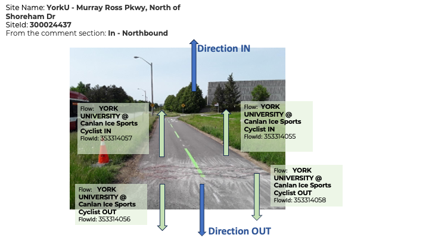

<!-- TOC -->

- [Bicycle loop detectors](#bicycle-loop-detectors)
  - [Installation types](#installation-types)
  - [Ecocounter data](#ecocounter-data)
    - [Flows - what we know](#flows---what-we-know)
  - [Discontinuities](#discontinuities)
  - [Using the Ecocounter API](#using-the-ecocounter-api)
    - [Note](#note)
  - [Historical data](#historical-data)
  - [ecocounter\_pull DAG](#ecocounter_pull-dag)
  - [ecocounter\_check DAG](#ecocounter_check-dag)
  - [ecocounter\_open\_data DAG](#ecocounter_open_data-dag)
- [SQL Tables](#sql-tables)
  - [Main Tables](#main-tables)
    - [ecocounter.sites\_unfiltered\`](#ecocountersites_unfiltered)
      - [`site_description` Naming Convention](#site_description-naming-convention)
    - [ecocounter.counts\`](#ecocountercounts)
    - [ecocounter.counts\_unfiltered\`](#ecocountercounts_unfiltered)
    - [ecocounter.flows\_unfiltered\`](#ecocounterflows_unfiltered)
  - [QC Tables](#qc-tables)
    - [ecocounter.calibration\_factors\`](#ecocountercalibration_factors)
    - [ecocounter.sensitivity\_history\`](#ecocountersensitivity_history)
    - [ecocounter.anomalous\_ranges\`](#ecocounteranomalous_ranges)
  - [Validation](#validation)
    - [ecocounter.manual\_counts\_matched\`](#ecocountermanual_counts_matched)
    - [ecocounter.manual\_counts\_info\`](#ecocountermanual_counts_info)
    - [ecocounter.manual\_counts\_raw\`](#ecocountermanual_counts_raw)

<!-- /TOC -->
# Bicycle loop detectors

This dataset comes from a small but growing number of permanent [loop detectors](https://en.wikipedia.org/wiki/Induction_loop) installed within designated bicycle infrastructure such as bike lanes and multi-use paths. This is actually one of our older data collection programs, and the data have been handled in a number of ways over the years and now reside in a couple different places in the `bigdata` database.

Ecocounter is the vendor that manages our current sensor installations. There is a web dashboard at https://www.eco-visio.net that should show all active installations.

## Installation types
There are two types of sensors, which can be easily distinguished. The single sensor installations, as below simply count the number of bikes that pass over the sensor. These are installed in one-way infrastructure such as a typical bike lane. 


Increasingly however newer installations are using a double sensor that can detect the direction of travel as well. In cases like the image below this allows us to measure contra-flow travel within the bike lane. 


Sometimes these paired sensors are themselves installed in pairs, giving four measured flows per site, two per lane. 


## Ecocounter data

Data from these sensors is stored in the `ecocounter` schema in three **views**:

* `sites`
* `flows`
* `counts`

A **site** is a distinct location, sometimes referring to one and sometimes to two directions of travel on the same path or street. A site is recorded as a point geometry at the centroid of the sensor(s) it represents.

A **flow** (sometimes also referred to as a _channel_) is a direction of travel recorded at a site. A site may have 1, 2, or 4 flows depending on whether one or two sensors are installed and whether they record the two directions of travel separately.

Each flow has `counts` of bikes at regularly spaced intervals. All sensors now use 15 minute bins though some previously were configured with 30 minute or one-hour bins. The bin size is indicated in the `flows` table and the `counts` table gives the _start_ time of the bin.

### Flows - what we know

Flows are not always clearly documented, making it hard at present to easily determine which way cyclists were travelling over any given sensor. This is a known issue that we're working with the vendor to resolve. If you can't easily determine the direction of travel, you probably just need to aggregate to the _site_ level. 

Some of the newer sites have flows labelled in the system as "IN" and "OUT". Below are two site-specific flow diagrams provided by Ecocounter. Do not (yet) assume you know what these values mean at other sites. 




From an email from Pierre, of Ecocounter:
> The IN and OUT disparities are configured during the setup of the counter. With the Zelt system that you own, there can only be two directions: IN and OUT, but there can be several flows. In the case of Murray Ross Parkway, some details about the direction were left in the comments section: IN – Northbound. In the following two examples, both counting sites have four loops installed on the bike paths, but in one case, four flows were configured, and only two for the second site. In the first example, both IN flows have the same name, but they have different flowId.

Newer installations have recently (~2024-2025) begun to distinguish between counts for bikes and (E-?)scooters. Where this is configured, there should be twice as many flows. One half are for scooters and the other half for bikes. In our database, we distinguish between them with the `mode_counted` field on the `flows` table.
For new sites, the distinction is visible on the Eco-visio website under "Manage Sites" -> "counting Flows" tab (for those with Manager/Admin level permissions). We don't yet have a lot of clarity on what exactly gets counted as what or how well scooters and bikes are distinguished from eachother or other modes.

## Discontinuities

Since 2023, periodic ground-truth counts have been used to calibrate sensors. Following these studies, if sensitivity of a sensor is adjusted, the new sensitivity is logged in `ecocounter.sensitivity_history` and will result in a discontinuity in the raw volumes. However, if you use `ecocounter.counts.calibrated_volumes`, you should not see a discontinuity as both before and after volumes are adjusted to match ground-truth observations using appropriate calibration factors. 

## Using the Ecocounter API

The documentation for the Ecocounter API lives here: https://developers.eco-counter.com/

It took a bit of effort to figure out how to properly authenticate to receive a token, and the process for doing that is now embodied in code in the file [`pull-data-from-api.py`](./pull-data-from-api.py)

To run this code, it's necessary to set up a configuration file with the API credentials. An example of the structure for this file is provided here: [sample-api-credentials.config](./sample-api-credentials.config). Airflow uses a config file saved at `/data/airflow/data_scripts/volumes/ecocounter/.api-credentials.config`. 

### Note

The API documentation mentions the endpoint `/data/site/<SITE_ID>` but it also returns channel/flow data via `/data/site/<FLOW_ID>`.

## Historical data

Several sensors in the current Ecocounter network go much further back, with the sensor at Bloor and Castle Frank starting in June of 1994. These older data were collected by a different vendor and are stored in the `traffic` schema. Like other data in `cnt_det` counts are in 15 minute bins.

```sql
SELECT
    count_info_id,
    arterycode,
    arterydata.location,
    cnt_det.timecount,
    cnt_det.count
FROM traffic.countinfo
JOIN traffic.cnt_det USING (count_info_id)
JOIN traffic.arterydata USING (arterycode)
WHERE category_id = 7 -- bike counts
ORDER BY cnt_det.timecount
LIMIT 1000;
```

<!-- ecocounter_pull_doc_md -->

## ecocounter_pull DAG
The `ecocounter_pull` DAG runs daily at 3am to populate `ecocounter` schema with new data. 

- `pull_recent_outages` task is similar to `pull_ecocounter` task except it tries to pull data corresponding to zero volume outages within the last 60 days. This was implemented following the finding that some Ecocounters will suddenly backfill missing data due to spotty cellular signal. Max ~2 weeks of backfilling has been observed so the task was conservatively set to look back 60 days. 

- `check_partitions` TaskGroup
  - `check_annual_partition` checks if execution date is January 1st.  
  - `create_annual_partitions` creates a new annual partition for `ecocounter.counts_unfiltered` if previous task succeeds.  
  
- `update_sites_and_flows` task identifies any sites and "flows" (known as channels in the API) in the API which do not exist in our database and adds them to `ecocounter.sites_unfiltered` and `ecocounter.flows_unfiltered`. The new rows contain a flag `validated = null` indicating they still need to be manually validated. A notification is sent with any new additions.  
- `pull_ecocounter` task pulls data from the Ecocounter API and inserts into the `ecocounter.counts_unfiltered` table. 
- `done` is an external task marker to trigger the `ecocounter_check` DAG for additional "yellow card" data checks.  
   
- `data_checks` TaskGroup: This task group runs data quality checks on the pipeline output.  
  - `wait_for_weather` delays the downstream data check by a few hours until the historical weather is available to add context.  
  - `check_volume` checks the sum of volume in `ecocounter.counts` (filtered view) and notifies if less than 70% of the 60 day lookback avg.  
  - `check_distinct_flow_ids` checks the count of distinct flow_ids appearing in `ecocounter.counts` (filtered view) and notifies if less than 70% of the 60 day lookback avg.  
<!-- ecocounter_pull_doc_md -->

<!-- ecocounter_check_doc_md -->

## ecocounter_check DAG
The `ecocounter_check` DAG runs daily at 4am following completion of `ecocounter_pull` to perform additional "yellow card" data checks on the new data.  

- `starting_point` is an external task sensor to ensure `ecocounter_pull` DAG is complete before running.  
- `check_site_outages` runs a `SQLCheckOperatorWithReturnValue` to check for sites with zero volumes and send a slack notification with their details. Does not trigger until day 2 of outage. 
- `check_if_sunday` checks if execution date is Sunday in order to only trigger the following check once weekly on Mondays.
- `check_unvalidated_sites` runs a `SQLCheckOperatorWithReturnValue` to check for unvalidated sites or flows with non-zero volumes this week and send a slack notification with their details. 
<!-- ecocounter_check_doc_md -->

<!-- ecocounter_open_data_doc_md -->

## ecocounter_open_data DAG
The `ecocounter_open_data` DAG runs monthly on the 1st of the month to perform insert/download of open data extracts for the month. 

- `check_data_availability` A SQLCheckOperatorWithReturnValue to check if there is data for every day of the previous month before proceeding and report if not. 
- `reminder_message`: A slack message to indicate data should be verified and any necessary anomalous ranges added to exclude irregular data. 
- `wait_till_10th`: A DateTimeSensor which waits until the 10th day of the month to proceed with exporting data. Can also be marked as "Success" manually to proceed earlier. 
- `get_years`: Identifies this month and last month's years in case of additional data added for the previous month.
- `insert_and_download_data`: TaskGroup for tasks which update and download data. Dynamically mapped over output of `get_years`. 
  - `insert_daily_open_data`: Inserts daily data into open data table.
  - `insert_15min_open_data`: Inserts 15min data into open data table.
  - `download_daily_open_data`: Downloads daily data to Open Data mounted drive on Morbius.
  - `download_15min_open_data`: Downloads 15min data to Open Data mounted drive on Morbius.
- `download_locations_open_data`: Downloads locations table to Open Data mounted drive on Morbius.
- `status_message`: A slack message indicating successful pipeline completion.

<!-- ecocounter_open_data_doc_md -->

# SQL Tables

## Main Tables
Key tables `ecocounter.sites_unfiltered`, `ecocounter.flows_unfiltered`, `ecocounter.counts_unfiltered` each have corresponding VIEWs filtered only to sites/flows marked as `validated` by a human: `ecocounter.sites`, `ecocounter.flows`, `ecocounter.counts`. They otherwise have the same structure as the parent tables described below. 
See also Open Data SQL definitions [here](./open_data/readme.md). 

### ecocounter.sites_unfiltered`
CAUTION: Use VIEW `ecocounter.sites` which includes only sites verified by a human (`validated` = True). Sites or "locations" of separate ecocounter installations. Each site may have one or more flows.
When you want to update new rows with missing `centreline_id`s, use [this script](./updates/ecocounter_centreline_updates.sql).  

| column_name | data_type | sample | comments |
|:------------|:----------|:-------|:---------|
| validated | boolean | | |
| site_id | numeric | | |
| site_description | text | | |
| geom | geometry |  | |
| facility_description | text | | description of bike-specific infrastructure which the sensor is installed within |
| notes | text | | |
| replaced_by_site_id  | numeric | | Several sites had their sensors replaced and show up now as "new" sites. This field indicates the site_id of the new replacement site, if any. Please note that any attempt to combine counts from one site with those of its replacement should be done at the level of flows. |
| centreline_id | integer | | The nearest street centreline_id, noting that ecocounter sensors are only configured to count bike like objects on a portion of the roadway ie. cycletrack or multi-use-path. Join using `JOIN gis_core.centreline_latest USING (centreline_id)`. |
| first_active | timestamp without time zone | | First timestamp site_id appears in ecocounter.counts_unfiltered. Updated using trigger with each insert on ecocounter.counts_unfiltered. |
| last_active | timestamp without time zone | | Last timestamp site_id appears in ecocounter.counts_unfiltered. Updated using trigger with each insert on ecocounter.counts_unfiltered. |
| date_decommissioned  | timestamp without time zone | | |
| counter              | character varying           | ECO09063082 | This field is pulled from the API and is another unique ID frequently referred to by Ecocounter in communications. |
| linear_name_full     | text                        | | Main road name taken from centreline. Useful for filtering all sensors on one corridor. |
| side_street          | text                        | | Side street name | 
| technology           | text                        | | Technology description, useful when unioning with other data sources. | 

#### `site_description` Naming Convention
The following are guidelines to follow when naming Ecocounter sites: 
- Follow format: `Main Rd, description`
  - description should follow the format `west of Spadina Ave`
  - If sites are on opposite sides of the intersection: `Steeles Ave, at McCowan Rd`
- If there are sites on both sides of the road, remove direction (ie. EB/WB) from site name and use the `flow_direction` field instead to indicate directionality of travel
- Use abbreviated street suffixes 
- Lower cased directions 
- Use `(retired)` to indicate discontinuity 
- Removed York-U / area names 
- If amiguous, specify infrastructure type in brackets `(multi-use path)`, `(two-way cycle track)`

When renaming sites already published to Open data, use the following scripts:
- [sql updates](./updates/ecocounter_sites_rename.sql): update tables where site_description was inserted.
- [bash updates](./updates/open_data_reexport.sh): reexport data

### ecocounter.counts`
This view contains calibrated (`calibrated_volume`) and raw (`raw_volume`) volumes for Ecocoutner flows. 
This view excludes:
- "unvalidated" sites and flows: Usually these don't produce any data or we do not know the location. 
- Data labelled in anomalous_ranges as `problem_level= 'do-not-use'` 

| column_name        | data_type                   | sample              |
|:-------------------|:----------------------------|:--------------------|
| flow_id            | numeric                     | 2102.0              |
| datetime_bin       | timestamp without time zone | 1994-08-05 05:30:00 |
| raw_volume         | smallint                    | 0                   |
| calibration_factor | numeric                     |                     |
| validation_date    | date                        |                     |
| calibrated_volume  | numeric                     | 0.0                 |


### ecocounter.counts_unfiltered`
CAUTION: Use VIEW `ecocounter.counts` instead to see only data that has been screened for
* manually validated sites
* manually validated flows
* absence of manually identified anomalous ranges (in the `do-not-use` `problem_level`)

This Table contains the actual binned counts for ecocounter flows. Please note that
bin size varies for older data, so averaging these numbers may not be straightforward.

Row count: 3,147,432
| column_name | data_type | sample | Comments |
|:------------|:----------|:-------|:---------|
| flow_id | numeric | 101052525 | |
| datetime_bin  | timestamp without time zone | 2012-12-04 09:00:00 | indicates start time of the time bin. Note that not all time bins are the same size! |
| volume | smallint | | |

### ecocounter.flows_unfiltered`
CAUTION: Use VIEW `ecocounter.flows` which includes only flows verified by a human (`validated` = True). A flow is usually a direction of travel associated with a sensor at an ecocounter installation site. For earlier sensors that did not detect directed flows, a flow may be both directions of travel together, i.e. just everyone who passed over the sensor any which way.

Row count: 73
| column_name | data_type | sample | Comments |
|:------------|:----------|:-------|:---------|
| flow_id | numeric | 104042943 | Primary key |
| site_id | numeric | 100042943 | |
| validated | boolean | True  | |
| includes_contraflow | boolean | True | Does the flow also count travel in the reverse of the indicated flow direction? TRUE indicates that the flow, though installed in one-way infrastucture like a standard bike lane, also counts travel going the wrong direction within that lane. FALSE could indicate the sensor does not count contraflow OR only counts contraflow. |
| replaces_flow_id | numeric | | `flow_id` of earlier flow that this one replaces |
| replaced_by_flow_id | numeric | 353363669 | `flow_id` of flow this one is replaced by |
| flow_direction | text | westbound (includes contraflow) | Direction of travel. Include `contraflow` in brackets if applicable. |
| flow_geom | geometry | | A two-node line, where the first node indicates the position of the sensor and the second indicates the normal direction of travel over that sensor relative to the first node. I.e. the line segment is an arrow pointing in the direction of travel. |
| bin_size | interval | 0 days 00:15:00 | temporal bins are either 15 or 30 minutes, depending on the sensor |
| notes | text | | |
| first_active | timestamp without time zone | | First timestamp flow_id appears in ecocounter.counts_unfiltered. Updated using trigger with each insert on ecocounter.counts_unfiltered. |
| last_active | timestamp without time zone | | Last timestamp flow_id appears in ecocounter.counts_unfiltered. Updated using trigger with each insert on ecocounter.counts_unfiltered. |
| date_decommissioned | timestamp without time zone |                     |
| direction_main      | USER-DEFINED                | Westbound | Grouping column used for Open Data indicating the side of the road. When `direction_main` is opposite to `flow_direction`, the flow is contraflow. A custom datatype was created to force this to be one of `Northbound`/`Southbound`/`Westbound`/`Eastbound`. You will need to coerce this column to text (::text) for comparison. |
| mode_counted | text | 'bike' | distinguishes between flows that count bikes and those that count (e)scooters. Value should be one of 'bike', 'scooter', or NULL |

## QC Tables
These tables are used by  `ecocounter_admins` to document sensitivity changes and anomalous ranges in the Ecocounter data when identified.

### ecocounter.calibration_factors`
This view joins together `sensitivty_history` and `manual_counts_results` in order to link calibration factors to the periods during which that sensitivty applied. In case of multiple calibration studies during a single sensitivity range, the first one will be applied starting from the beginning of the sensitivity range until the next calibration study, and the others will be applied from the date of the study forwards, until the next study takes place. 

| column_name                | data_type   | sample                 |
|:---------------------------|:------------|:-----------------------|
| flow_id                    | numeric     | 101042943.0            |
| count_date                 | date        |                        |
| ecocounter_day_corr_factor | numeric     |                        |
| setting                    | text        | Original configuration |
| sensitivity_date_range     | daterange   | [2018-02-09, None)     |
| factor_range               | daterange   | [2018-02-09, None)     |

### ecocounter.sensitivity_history`
This table stores date ranges for sensitivity adjustments in order to link calibration studies to only the period during which the same sensitivity settings were in effect.
- `sensitivity_history` must be manually updated based on communication with Eco-counter Technical Support Specialist (Derek Yates as of 2024). 
- This table has `CONSTRAINT eco_sensitivity_exclude` to exclude flow_ids from having overlapping sensitivities. 
- The sensetivities go from 1-4 as noted below (least to most selective):
    - `1`: High-Traffic Bikeway (01D0) 
    - `2`: Bikeway (01C0)
    - `3`: Greenway (01C8)
    - `4`: Total Selectivity (0162)
    - `Not Standardized`: Newer ZELT sensors have more complex configurations that do not fit in to the above framework. 

| column_name   | data_type   | sample                 | Comments |
|:--------------|:------------|:-----------------------|----------|
| flow_id       | numeric     | 101042943.0            |
| date_range    | daterange   | [2018-02-09, None)     | Date range where sensitivity setting is applicable. Use null end date to indicate current setting. |
| setting       | text        | Original configuration | Label the sensitivity. Include the sensitivity number (described above) if known. |
| uid           | smallint    | 2                      | Serial Pkey to allow interactive editing |

### ecocounter.anomalous_ranges`
A means of flagging periods with questionable data. `counts` (and subsequently Open Data tables), exclude data with `problem_level = 'do-not-use'`.

Row count: 9
| column_name         | data_type   | sample                                                                                       |   Comments |
|:--------------------|:------------|:---------------------------------------------------------------------------------------------|-----------:|
| flow_id             | numeric     |                                                                                              | It is only necessary to include one of flow_id and site_id for an anomalous_range. Use only site_id if it is a site wide issue. |
| site_id             | numeric     | 100042942.0                                                                                  | It is only necessary to include one of flow_id and site_id for an anomalous_range. |
| time_range          | tsrange     | [2021-02-09 00:00:00, None)                                                                  |        nan |
| notes               | text        | Goes from reporting in the hundreds daily to mostly single digits. What could have happened? |        nan |
| investigation_level | text        | suspect                                                                                      |        nan |
| problem_level       | text        | do-not-use                                                                                   |        nan |
| uid                 | smallint    | 2                                                                                            |        nan |

## Validation
These tables were created to compare Ecocounter data with Spectrum counts. For more information see: [data_collection_automation/ecocounter_validation_counts](https://github.com/Toronto-Big-Data-Innovation-Team/data_collection_automation/tree/ecocounter_validation_counts/ecocounter_validation_counts). 

### ecocounter.manual_counts_matched`
Spectrum manual count volumes matched to eco-counter volumes. 1 row per 15min bin. Used for eco-coounter data validation. 

Row count: 2,944
| column_name             | data_type              | sample     |   Comments |
|:------------------------|:-----------------------|:-----------|-----------:|
| ecocounter_site_id      | integer                | 300024437  |        nan |
| ecocounter_approach     | text                   | N          |        nan |
| spectrum_approach       | character varying      | N          |        nan |
| ecocounter_direction    | text                   | Southbound |        nan |
| count_date              | date                   | 2023-10-18 |        nan |
| time_bin                | time without time zone | 06:00:00   |        nan |
| bikes_road_spectrum     | integer                | 0          |        nan |
| bikes_sidewalk_spectrum | integer                | 0          |        nan |
| bikes_path_spectrum     | integer                | 0          |        nan |
| ecocounter_bikes        | bigint                 | 0          |        nan |

### ecocounter.manual_counts_info`
Spectrum manual bike count information, matched to eco-counter sites. Used for validation of eco-counter data. 1 row per manual count location.

Row count: 21
| column_name                     | data_type         | sample                                                                                     |   Comments |
|:--------------------------------|:------------------|:-------------------------------------------------------------------------------------------|-----------:|
| study_id                        | character varying | TOR23G9S                                                                                   |        nan |
| spectrum_location               | text              | BLOOR ST W & MARKHAM ST - PALMERSTON BLVD                                                  |        nan |
| count_date                      | date              | 2023-10-18                                                                                 |        nan |
| request_id                      | integer           | 208001                                                                                     |        nan |
| municipal_id                    | integer           | 8353520                                                                                    |        nan |
| latitude                        | numeric           | 43.664748                                                                                  |        nan |
| longitude                       | numeric           | -79.413012                                                                                 |        nan |
| filename                        | text              | BLOOR ST W & MARKHAM ST - PALMERSTON BLVD_2023-10-18.xlsx                                  |        nan |
| ecocounter_location             | text              | Bloor St W, between Palmerston & Markham                                                   |        nan |
| ecocounter_site_id              | integer           | 300031255                                                                                  |        nan |
| ecocounter_facility_description | text              | bike lane                                                                                  |        nan |
| distance                        | numeric           | 6.98012450818035                                                                           |        nan |
| count_geom                      | USER-DEFINED      | 0101000020E6100000C136E2C96EDA53C06C0A647616D54540                                         |        nan |
| match_line_geom                 | USER-DEFINED      | 0102000020E610000002000000C136E2C96EDA53C06C0A647616D545406FEF6C1D70DA53C010E9EEBB15D54540 |        nan |

### ecocounter.manual_counts_raw`
Spectrum manual bike counts at eco-counter locations - raw data, 15min bins

Row count: 3,072
| column_name             | data_type              | sample   |   Comments |
|:------------------------|:-----------------------|:---------|-----------:|
| request_id              | integer                | 208007   |        nan |
| approach                | character varying      | N        |        nan |
| time_bin                | time without time zone | 06:00:00 |        nan |
| bikes_road_spectrum     | integer                | 0        |        nan |
| bikes_sidewalk_spectrum | integer                | 0        |        nan |
| bikes_path_spectrum     | integer                | 4        |        nan |
