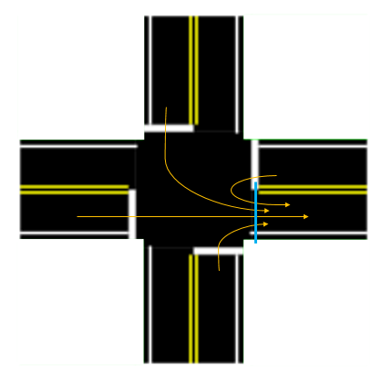

# Miovision - Multi-modal Permanent Video Counters

## Table of Contents

- [Table of Contents](#table-of-contents)
- [1. Overview](#1-overview)
    - [Folder Structure](#folder-structure)
- [2. Table Structure](#2-table-structure)
	- [Reference Tables](#reference-tables)
		- [`classifications`](#classifications)
		- [`intersections`](#intersections)
		- [`movement_map`](#movement_map)
		- [`periods`](#periods)
		- [`intersection_movements`](#intersection_movements)
	- [Disaggregate Data](#disaggregate-data)
		- [`volumes`](#volumes)
	- [Aggregated Data](#aggregated-data)
		- [`volumes_15min_tmc`](#volumes_15min_tmc)
		- [`unacceptable_gaps`](#unacceptable_gaps)
		- [`volumes_15min`](#volumes_15min)
		- [`volumes_tmc_atr_xover`](#volumes_tmc_atr_xover)
	- [Primary and Foreign Keys](#primary-and-foreign-keys)
		- [List of primary and foreign keys](#list-of-primary-and-foreign-keys)
	- [Important Views](#important-views)
- [3. Finding Gaps and Malfunctioning Camera](#3-finding-gaps-and-malfunctioning-camera)
- [4. Steps to Add or Remove Intersections](#4-steps-to-add-or-remove-intersections)
	- [Removing Intersections](#Removing-Intersections)
	- [Adding Intersections](#Adding-Intersections)
- [5. Repulling data](#5-Repulling-data)
	- [Deleting data to re-run process](#Deleting-data-to-re--run-process)
- [6. Processing Data from API](#6-processing-data-from-api)
- [7. Processing Data from CSV Dumps (NO LONGER IN USE)](#7-processing-data-from-csv-dumps-no-longer-in-use)
	- [`raw_data`](#raw_data)
	- [A. Populate `volumes`](#a-populate-volumes)
	- [B. Populate `volumes_15min_tmc` and `volumes_15min`](#b-populate-volumes_15min_tmc-and-volumes_15min)
	- [C. Refresh reporting views](#c-refresh-reporting-views)
	- [D. Produce summarized monthly reporting data](#d-produce-summarized-monthly-reporting-data)
	- [Deleting Data](#deleting-data)
- [8. Filtering and Interpolation (NO LONGER IN USE)](#8-filtering-and-interpolation-no-longer-in-use)
	- [Filtering](#filtering)
	- [Interpolation](#interpolation)
- [9. QC Checks](#9-qc-checks)
	- [Variance check](#variance-check)
	- [Invalid Movements](#invalid-movements)
- [10. Open Data](#10-open-data)

## 1. Overview

Miovision currently provides volume counts gathered by cameras installed at specific intersections. Miovision then processes the video footage and provides volume counts in aggregated 1 minute bins. The data is currently being used to support the King Street Transit Pilot by analysing the trends in volume on King Street, trends in volume on surrounding roads, and thru movement violations of the pilot. An example of how it was used to support the pilot project can be found [here](https://www.toronto.ca/wp-content/uploads/2018/08/9781-KSP_May-June-2018-Dashboard-Update.pdf).

You can see the current locations of Miovision cameras [on this map.](geojson/miovision_intersections.geojson)

### Folder Structure

- `api` - scripts and documentation for accessing the Miovision API.
- `dev_notebooks` - Jupyter Notebooks for development and testing.
- `geojson` - stores locations of Miovision cameras.
- `sql` - scripts for producing tables.

## 2. Table Structure

### Reference Tables

#### `classifications`

Reference table for all 7 classifications: Lights, Bicycles on Road, Buses, Single-Unit Trucks, Articulated Trucks, Pedestrians on Crosswalk, and Bicycles on Crosswalk.

**Field Name**|**Data Type**|**Description**|**Example**|
:-----|:-----|:-----|:-----|
classification_uid|serial|Unique identifier for table|2|
classification|text|Textual description of mode|Bicycles|
location_only|boolean|If TRUE, represents movement on crosswalk (as opposed to road)|FALSE|
class_type|text|General class category (Vehicles, Pedestrians, or Cyclists)|Cyclists|

#### `intersections`

Reference table for each unique intersection at which data has been collected. `miovision_api.intersections_20200805` is the old intersections table that do not have the `date_installed` or `date_decommissioned` information.

**Field Name**|**Data Type**|**Description**|**Example**|
:-----|:-----|:-----|:-----|
intersection_uid|integer|Unique identifier for table|10|
id|text|Unique id from Miovision API|990cd89a-430a-409a-b0e7-d37338394148|
intersection_name|text|Intersection in format of [main street] / [cross street]|King / Bathurst|
date_installed|date|Installation date of the camera|2017-10-03|
date_decommissioned|date|Decommissioned date of the camera|NULL|
lat|numeric|Latitude of intersection location|43.643945|
lng|numeric|Longitude of intersection location|-79.402667|
street_main|text|Name of primary street|King|
street_cross|text|Name of secondary street|Bathurst|
int_id|bigint|int_id linked to centrelines|13467722|
px|integer|px linked to traffic lights|201|
geom|geometry|Point geometry of that intersection|0101000020E61000006B0BCF4BC5D953C01CB62DCA6CD24540|
n_leg_restricted|boolean|Whether that leg is restricted to vehicles|NULL|
e_leg_restricted|boolean|Whether that leg is restricted to vehicles|NULL|
s_leg_restricted|boolean|Whether that leg is restricted to vehicles|NULL|
w_leg_restricted|boolean|Whether that leg is restricted to vehicles|NULL|

#### `movement_map`

Reference table for transforming aggregated turning movement counts (see `volumes_15min_tmc`) into segment-level volumes (see `volumes_15min`).

**Field Name**|**Data Type**|**Description**|**Example**|
:-----|:-----|:-----|:-----|
leg_new|text|Intersection leg on which 15-minute volume will be assigned|E|
dir|text|Direction on which 15-minute volume will be assigned|EB|
leg_old|text|Intersection leg on which 15-minute turning movement volume is currently assigned|W|
movement_uid|integer|Identifier representing current turning movement: 1 - thru; 2 - left turn; 3 - right turn; 4 - u-turn|1|

#### `periods`

Reference table for all unique time periods. Used primarily to aggregate 15-minute data for reporting purposes.

**Field Name**|**Data Type**|**Description**|**Example**|
:-----|:-----|:-----|:-----|
period_id|integer|Unique identifier for table|3|
day_type|text|Day type for date filter|[Weekday OR Weekend]|
period_name|text|Textual description of period|14 Hour|
period_range|timerange|Specific start and end times of period|[06:00:00,20:00:00)|

#### `intersection_movements`

This was created using [`create-table-intersection_movements.sql`](sql/create-table-intersection_movements.sql) and is a reference table of all observed movements for each classification at each intersection. This is used in aggregating to the 15-minute TMC's in order to [fill in 0s in the volumes](#volumes_15min_tmc). Subsequently, movements present in the volumes data [which were erroneous](https://github.com/CityofToronto/bdit_data-sources/issues/144#issuecomment-419545891) were deleted from the table. This table will include movements which are illegal, such as left turns at intersections with turn restrictions but not movements like a turn onto the wrong way of a one-way street. It will need to be manually updated when a new location is added.

`miovision_api.intersection_movements_20200805` is the old intersection movement table that do not have information about the new intersections whereas the new table contains information on all intersections, be it old or new ones.

**Field Name**|**Data Type**|**Description**|**Example**|
:-----|:-----|:-----|:-----|
 intersection_uid| integer | ID for intersection | 1 |
 classification_uid| integer | Identifier linking to specific mode class stored in `classifications`|1|
 leg| text | Entry leg of movement|E|
 movement_uid| integer | Identifier linking to specific turning movement stored in `movement_map`|2|

### Disaggregate Data

#### `volumes`

Data table storing all 1-minute observations in its **transformed** form. Records represent total 1-minute volumes for each [intersection]-[classification]-[leg]-[turning movement] combination.

**Field Name**|**Data Type**|**Description**|**Example**|
:-----|:-----|:-----|:-----|
volume_uid|serial|Unique identifier for table|5100431|
intersection_uid|integer|Identifier linking to specific intersection stored in `intersections`|31|
datetime_bin|timestamp without time zone|Start of 1-minute time bin in EDT|2017-10-13 09:07:00|
classification_uid|text|Identifier linking to specific mode class stored in `classifications`|1|
leg|text|Entry leg of movement|E|
movement_uid|integer|Identifier linking to specific turning movement stored in `movement_map`|2|
volume|integer|Total 1-minute volume|12|
volume_15min_tmc_uid|serial|Foreign key to [`volumes_15min_tmc`](#volumes_15min_tmc)|14524|

Using the trigger function `volumes_insert_trigger()`, the data in `volumes` table are later put into `volumes_2018` or `volumes_2019` or `volumes_2020` depending on the year of data.

- *Unique constraint* was added to `miovision_api.volumes` table as well as its children tables (`miovision_api.volumes_2020` etc) since the trigger sends the data to the children table to get inserted.
```
ALTER TABLE miovision_api.volumes ADD UNIQUE(intersection_uid, datetime_bin, classification_uid, leg, movement_uid)
ALTER TABLE miovision_api.volumes_2018 ADD UNIQUE(intersection_uid, datetime_bin, classification_uid, leg, movement_uid)
ALTER TABLE miovision_api.volumes_2019 ADD UNIQUE(intersection_uid, datetime_bin, classification_uid, leg, movement_uid)
ALTER TABLE miovision_api.volumes_2020 ADD UNIQUE(intersection_uid, datetime_bin, classification_uid, leg, movement_uid)
```

- **NOTE:** datetime_bin for each day happens from 23:00 the previous day to 22:59 current day.

### Aggregated Data

The process in [**Processing Data from CSV Dumps**](#4-processing-data-from-csv-dumps) aggregates up the 1-minute volume data into two types of 15-minute volume products: Turning Movement Count (TMC) and Automatic Traffic Recorder (ATR) equivalents. Starting with `volumes` each table has a FOREIGN KEY relationship to the next step of aggregation so that an aggregated record can be traced back to its source data. For example: a row in `volumes_15min` has a unique ID `volumes_15min_uid`, and the foreign key `volumes_15min_tmc.volumes_15min_uid` identifies the row(s) that produced that `volumes_15min` row.

#### `volumes_15min_tmc`

`volumes_15min_tmc` contains data aggregated into 15 minute bins. Interpolation process is no longer included in the new process now that we have enough data. In the new gap filling process, we try to identify hours of data that we can trust (aka not found in the `unacceptable_gaps` table) and set those 15min bin to 0 instead of NULL. To be more specific, 
15 minute bins where there are no data are filled with 0s for pedestrians, cyclists and light vehicles (`classification_uid IN (1,2,6)`); trucks, buses and vans are not filled because they are rarely observed, and filling in light vehicles would be sufficient to ensure there are no gaps for the `Vehicles` class used in [`report_dates`](#refresh-reporting-views) and subsequent views.

Whereas for the other classes, we still aggregate them and put them into the 15min bin table as long as they have volume > 0. However, we do not do the same gap filling process for them and hence do not include those where volume = 0 for these classification_uid. The line `HAVING pad.classification_uid IN (1,2,6) OR SUM(A.volume) > 0` does exactly that. 

The [`aggregate_15_min_tmc()`](sql/function-aggregate-volumes_15min_tmc.sql) function performs zero-filling by cross-joining a table containing all possible movements ([`intersection_movements`](#intersection_movements)) to create a table with all possible times and movements for only ACTIVE intersections. Through a left join with [`unacceptable_gaps`](#unacceptable_gaps), the query check if the bins are within the unacceptable gap (technically, within the hour and the hour after), if so volume is set to NULL, else sum(volume) as shown in the line `CASE WHEN un.accept = FALSE THEN NULL ELSE (COALESCE(SUM(A.volume), 0)) END AS volume`. If there is a gap from '2020-06-25 15:38:00' to '2020-06-25 15:54:00', we are setting all 15min bin from '15:00:00 to 16:00:00' to have volume = NULL OR if there is a gap from '2020-06-25 15:38:00' to '2020-06-25 16:24:00', we are setting all 15min bin from '15:00:00 to 17:00:00' to have volume = NULL. (Not sure if this is causing us to exclude way too many time bins, might get back to this later on). Through a left join with `volumes`, the query aggregates those 1min bins into the 15min bins and exclude those unacceptable ones. Note that those bins fall within the unacceptable_gaps time period for that intersection do not get aggregated and hence are not assigned with `volume_15min_tmc_uid`.

In short, we are setting **volume = NULL** for all 15min bins that are found within the `unacceptable_gaps` table as they are regarded as unreliable and we do not want that to intefere with our aggregation process for different analyses in the future. Setting volume to 0 is different from setting volume to NULL especially when we are trying to find the arithmetic mean.

**Field Name**|**Data Type**|**Description**|**Example**|
:-----|:-----|:-----|:-----|
volume_15min_tmc_uid|serial|Unique identifier for table|14524|
intersection_uid|integer|Identifier linking to specific intersection stored in `intersections`|31|
datetime_bin|timestamp without time zone|Start of 15-minute time bin in EDT|2017-12-11 14:15:00|
classification_uid|text|Identifier linking to specific mode class stored in `classifications`|1|
leg|text|Entry leg of movement|E|
movement_uid|integer|Identifier linking to specific turning movement stored in `movement_map`|2|
volume|integer|Total 15-minute volume|78|
volume_15min_uid|integer|Foreign key to [`volumes_15min`](#volumes_15min)|12412|

- *Unique constraint* was added to `miovision_api.volumes_15min_tmc` table using 
```
ALTER TABLE miovision_api.volumes_15min_tmc ADD UNIQUE(intersection_uid, datetime_bin, classification_uid, leg, movement_uid)
```
- **NOTE:** datetime_bin for each day happens from 23:00 the previous day to 22:45 current day. \
(23:00 datetime_bin contains 1-min bin >= 23:00 and < 23:15 whereas \
22:45 datetime_bin contains 1-min bin >= 22:45 and < 23:00)

#### `unacceptable_gaps`

Data table storing all the unacceptable gaps using a set of gap sizes that are based on the average volumes at that intersection at a certain period of time in the past 60 days. More information can be found at [#3. Finding gaps and malfunctioning camera](#3-finding-gaps-and-malfunctioning-camera) . This table will then be used in the aggregate_15_min_tmc function to aggregate 1-min bin to 15-min bin.

**Field Name**|**Data Type**|**Description**|**Example**|
:-----|:-----|:-----|:-----|
intersection_uid|integer|Identifier linking to specific intersection stored in `intersections`|8|
gap_start|timestamp without time zone|The timestamp of when the gap starts|2020-05-01 02:53:00|
gap_end|timestamp without time zone|The timestamp of when the gap ends|2020-05-01 03:08:00|
gap_minute|integer|Duration of the gap in minute|15|
allowed_gap|integer|Allowed gap in minute|15|
accept|boolean|Stating whether this gap is acceptable or not|false|

#### `volumes_15min`

Data table storing ATR versions of the 15-minute turning movement data. Because of the format differences between TMC and ATR data, the `miovision.movement_map` is used to convert the TMC data to the ATR data. 

An example of `miovision_api.movement_map`:

|leg_new|dir|leg_old|movement_uid|
|-------|---|-------|------------|
|"N"|	"NB"|	"N"|	4|
|"N"|	"NB"|	"E"|	3|
|"N"|	"NB"|	"S"|	1|
|"N"|	"NB"|	"W"|	2|
|"N"|	"SB"|	"N"|	4|
|"N"|	"SB"|	"N"|	3|
|"N"|	"SB"|	"N"|	1|
|"N"|	"SB"|	"N"|	2|

- `leg_old` (leg for TMC) = direction the vehicles approach into intersection
- `leg_new` (leg for ATR) = anything that crosses that side of the intersection



**Blue line represents `leg_old` whereas yellow arrows represent `movement_uid`**
Figure above shows that for each `leg_old` (leg for TMC) , there are four possible `movement_uid`: 1 - thru; 2 - left turn; 3 - right turn; and 4 - u-turn. For the example above, the `leg_old` is E and `movement_uid` 1, 2, 3, 4 represent traffic coming from the west, north, south and east, respectively. For a fully working intersection, there will be 16 possible TMC since there are 4 directions and 4 legs in each direction for TMC. \
(4 possible legs * 4 legs each = 16 TMCs)


**Blue line represents `leg_new` whereas yellow arrows represent `dir`**
Figure above shows that for each `leg_new` (leg for ATR) , there are two possible `dir`. The `leg_new` is E whereas the `dir` are EB & WB for the above example. For a fully working intersection, there will be 8 possible ATR since there are 4 directions and 2 legs in each direction for ATR. \
(4 possible legs * 2 legs each = 8 TMCs)

For a certain `classification_uid` at a certain `datetime_bin`, TMC table shown as the top table whereas ATR table shown as the bottom table.

|leg(tmc)|movement_uid|volume|					
|--------|------------|------|					
|N|1|87|						
|N|2|26|							
|S|3|29|						
|S|1|79|							
| | |total volume = 221|								

|leg(atr)|dir|volume|
|--------|---|------|
|E|EB|55|
|N|NB|79|
|S|NB|108|
|S|SB|87|
|N|SB|113|
| |  |total volume = 442|

Therefore in general, \
total number of rows in TMC should be greater than total number of rows in ATR \
(ATR might have more rows for less busy intersection) whereas\
total volume of TMC should be less than total volume of ATR \
(ATR volume should double that of TMC).

> However, the above is not applicable to pedestrian count which are `classification_uid` = 6 and `movement_uid` = 5,6. Pedestrian count in both TMC and ATR tables has equal number of rows and equal total volume.

- **For pedestrian count**, the `leg` represents the side of crosswalk the pedestrians are at whereas `dir` represents which direction they are walking towards. So, a leg = N and dir = EB means that the pedestrian is at the North crosswalk crossing westbound.

**Field Name**|**Data Type**|**Description**|**Example**|
:-----|:-----|:-----|:-----|
volume_15min_uid|serial|Unique identifier for table|12412|
intersection_uid|integer|Identifier linking to specific intersection stored in `intersections`|31|
datetime_bin|timestamp without time zone|Start of 15-minute time bin in EDT|2017-12-11 14:15:00|
classification_uid|text|Identifier linking to specific mode class stored in `classifications`|1|
leg|text|Segment leg of intersection|E|
dir|text|Direction of traffic on specific leg|EB|
volume|integer|Total 15-minute volume|107|

- *Unique constraint* was added to `miovision_api.volumes_15min` table using 
```
ALTER TABLE miovision_api.volumes_15min ADD UNIQUE(intersection_uid, datetime_bin, classification_uid, leg, dir)
```
- **NOTE:** datetime_bin for each day happens from 23:00 the previous day to 22:45 current day. \
(23:00 datetime_bin contains 1-min bin >= 23:00 and < 23:15 whereas \
22:45 datetime_bin contains 1-min bin >= 22:45 and < 23:00)

#### `volumes_tmc_atr_xover`

**This is a crossover table to link `volumes_15min_tmc` to the `volumes_15min` table**. As described above, the TMC to ATR relationship is a many to many relationship. The [`aggregate_15_min()`](sql/function-aggregate-volumes_15min.sql) function that populates `volumes_15min` also populates this table so that a record of which `volume_15min_tmc` bin corresponds to which `volume_15min` bin is kept, and vice versa. As a result, multiple entries of both `volume_15min_uid` and `volume_15min_tmc_uid` can be found in the query.

**Field Name**|**Data Type**|**Description**|**Example**|
:-----|:-----|:-----|:-----|
volume_15min_uid|serial|Unique identifier for table|12412|
volume_15min_tmc_uid|int|Unique identifier for `volumes_15min_tmc` table|14524|

### Primary and Foreign Keys

To create explicit relationships between tables, `volumes`, `volume_15min_tmc`, `atr_tmc_uid` and `volume_15min` have primary and foreign keys. Primary keys are unique identifiers for each entry in the table, while foreign keys refer to a primary key in another table and show how an entry is related to that entry.

#### List of primary and foreign keys

* `volumes` has the primary key `volume_uid` and foreign key `volume_15min_tmc_uid` which refers to `volume_15min_tmc`
* `volumes_15min_tmc` has the primary key `volume_15min_tmc_uid`
* `volume_15min` has the primary key `volume_15min_uid`
* `atr_tmc_uid` has foreign keys `volume_15min_tmc_uid` and `volume_15min_uid`, referring to which TMC/ATR bin in `volume_15min_tmc_uid` and `volume_15min` each bin is referring to.

The current primary purpose for the keys is so that on deletion, the delete cascades through all tables. The keys also indicate whether it is new data if the foreign key is null, and tells the function to aggregate the data if it is new data. The keys can also be used in selecting data.

### Important Views

The tables below are produced using functions explained in the [API Puller](https://github.com/CityofToronto/bdit_data-sources/tree/miovision_api_bugfix/volumes/miovision/api#postgresql-functions). They produce a lookup table of date-intersction combinations to be used for checking purposes or even for formal reporting.

|Table|Purpose|
|------|-------|
|`api_log`|Contains a record of the `start_date` and `end_date` for an `intersection_uid` and when the data was pulled as `date_added`|
|`missing_dates`|Contains a record of the `intersection_uid` and the `dt` that were missing in the `volumes_15min` table, with `period_type` stated|
|`report_dates`|Contains a record for each intersection-date combination in which at least forty 15-minute time bins exist between 6AM and 8PM|

## 3. Finding Gaps and Malfunctioning Camera

In order to better determine if a camera is still working, we have decided to use the gaps and islands method to figure where the gaps are (gaps as in the unfilled space or interval between the 1min bins; a break in continuity) and their sizes. There are two parts of this in the whole process.

**Part I - Unacceptable Gaps**
The following process is used to determine the gap sizes assigned to an intersection at different time and then find out if the gaps are within the acceptable range or not. The timebins exceeding the allowed gap_size will then be inserted an `unacceptable_gaps` table. Finding gaps is important so that we know how reliable the data is for that time period based on past volume and not include those bins found within the unacceptable gaps range.

1. The materialized view [`miovision_api.gapsize_lookup`](https://github.com/CityofToronto/bdit_data-sources/blob/miovision_api_bugfix/volumes/miovision/sql/create-mat-view-gapsize_lookup.sql) is refreshed/updated daily to find out the daily average volume for each intersection_uid, period and time_bin in the past 60 days. Based on the average volume, an acceptable gap_size is assigned to that intersection. 
2. The set of acceptable gap_size implemented is based on an investigation stated in this [notebook](volume_vs_gaps.ipynb). 
3. Then, the function [`miovision_api.find_gaps`](https://github.com/CityofToronto/bdit_data-sources/blob/miovision_api_bugfix/volumes/miovision/sql/function-find_gaps.sql) is used to find all gaps of data in the table `miovision_api.volumes` and check if they are within the acceptable range of gap sizes or not based on the information from the materialized view above.
4. Gaps that are equal to or exceed the allowed gap sizes will then be inserted into the table [`miovision_api.unacceptable_gaps`](#unacceptable_gaps). 
5. Based on the `unacceptable_gaps` table, [`aggregate_15min_tmc`](#volumes_15min_tmc) function will not aggregate 1min bins found within the unacceptable_gaps's `DATE_TRUNC('hour', gap_start)` and `DATE_TRUNC('hour', gap_end) + interval '1 hour'` since the hour of gap_start and gap_end may be the same.

**Part II - Working Machine**
The following process is to determine if a Miovision camera is still working. It is different from the process above because the gap sizes used above are small and do not say much about whether a camera is still working. We roughly define a camera to be malfunctioning if that camera/intersection has a gap greater than 4 hours OR do not have any data after '23:00:00'. The function that does this is [`miovision_api.determine_working_machine()`](sql/function-determine_working_machine.sql) and there is an Airflow dag named [`check_miovision`](https://github.com/CityofToronto/bdit_data-sources/blob/miovision_api_bugfix/dags/check_miovision.py) that runs the function at 7AM every day to check if all cameras are working. A slack notification will be sent if there's at least 1 camera that is not working. The function also returns a list of intersection that is not working and from what time to what time that the gap happens which is helpful in figuring out what's happened.

## 4. Steps to Add or Remove Intersections
There have been some changes to the Miovision cameras and below documents on the steps to make that changes on our end. First remove the decommissioned ones then include the newly installed ones. **Always run your test and put all new things in a different table/function name so that they do not disrupt the current process until everything has been finalized.** Ideally, the whole adding and removing process should be able to be done in a day.

### Removing Intersections
Once we are informed of the decommissioned date of the Miovision cameras, we can then carry out the following steps.

1) Update the column `date_decommissioned` on table [`miovision_api.intersections`](#intersections) to include the decommissioned date.

2) Remove aggregated data on the date the camera is decommissioned. Manually remove decommissioned machines' data from tables `miovision_api.volumes_15min_tmc` and `miovision_api.volumes_15min`. Dont worry about other tables that they are linked to since we have set up the ON DELETE CASCADE functionality. If the machine is taken down on 2020-06-15, we are not aggregating any of the data on 2020-06-15 as it may stop working at any time of the day on that day.

3) Done. Removing intersections is short and simple.

### Adding Intersections
Adding intersections on the other hand is not as simple as removing an intersection. We will first have to find out a couple of information before proceeding to aggregating the data. The steps are outlined below.

1) Look at table [`miovision_api.intersections`](#intersections) to see what information about the new intersections that we would need to update the table. Steps below show how we can find the details such as id, coordinates, px, int_id, geom, which leg_restricted etc. Once everything is done, do an INSERT INTO this table to include the new intersections.

	a) New intersections name and details such as `intersection_uid`, `id`, `intersection_name` can be found using the [Miovision API](http://beta.docs.api.miovision.com/#!/Intersections/get_intersections). `date_installed` and `date_decommissioned` can be found by finding the first / last datetime_bin for that intersection_uid from that website. The last date for the old location can also be found from table `miovision_api.volumes`. 
	
	b) `px` for the intersection can then be found easily from this [web interface](https://demo.itscentral.ca/#).
	
	c) With the `px` information found above, get the rest of the information (such as `street_main`, `street_cross`, `geom`, `lat`, `lng` and `int_id`) from table `gis.traffic_signal`.
	
	d) In order to find out which leg of that intersection is restricted, go to Google Map to find out the direction of traffic.

2) Now that the updated table of [`miovision_api.intersections`](#intersections) is ready, we have to update the table [`miovision_api.intersection_movements`](#intersection_movements). We need to find out all valid movements for the new intersections from the data but we don't have that yet, so the following has to be done.

	a) Run the [api script](https://github.com/CityofToronto/bdit_data-sources/blob/miovision_api_bugfix/volumes/miovision/api/intersection_tmc.py) with the following command line to only include intersections that we want as well as skipping the data processing process. `python3 intersection_tmc.py run-api --start_date=2020-06-15 --end_date=2020-06-16 --intersection=35 --intersection=38 --intersection=40  --pull` . `--pull` has to be included in order to skip data processing and gaps finding since we are only interested in finding invalid movements in this step. Note that multiple intersections have to be stated that way in order to be included in the list of intersections to be pulled. Recommend to test it out with a day worth of data first.
	
	b) First run the SELECT query below and validate those new intersection movements. The line `HAVING COUNT(DISTINCT datetime_bin::time) >= 20` is there to make sure that the movement is actually legit and not just a single observation. Then, INSERT INTO `intersection_movements` table which has all valid movements for intersections. These include decommissioned intersections, just in case we might need those in the future.

	```sql
	INSERT INTO miovision_api.intersection_movements
	SELECT DISTINCT intersection_uid, classification_uid, leg, movement_uid
	FROM miovision_api.volumes
  	WHERE intersection_uid IN ( *** ) 					-- only include new intersection_uid
    	AND datetime_bin > 'now'::text::date - interval '2 days' 		-- or the date of data that you pulled
	AND classification_uid IN (1,2,6)					-- will include the ones for other modes after this
	GROUP BY intersection_uid, classification_uid, leg, movement_uid
	HAVING COUNT(DISTINCT datetime_bin::time) >= 20;
	```
	
	c) The step before only include valid intersection movements for classification_uid IN (1,2,6) which are light vehicles, cyclists and pedestrians. The reason is that the counts for other mode may not pass the mark of having 20 distinct datetime_bin. However, we know that if vehicles can make that turn, so do trucks, vans, buses and unclassified motorized vehicles, which are classification_uid IN (3, 4, 5, 8, 9). Therefore, we will run the below query for each classification_uid that was not included in the previous steps.

	```sql
	-- Include all wanted classification_uids here.
	WITH wanted_veh(classification_uid) AS (
	         VALUES (3), (4), (5), (8), (9)
	)
	INSERT INTO miovision_api.intersection_movements
      ( intersection_uid, classification_uid, leg, movement_uid )
	SELECT a.intersection_uid,
	       b.classification_uid,
		   a.leg,
		   a.movement_uid
	FROM miovision_api.intersection_movements a
	CROSS JOIN wanted_veh b
	-- Specify which intersection_uids to use.
	WHERE a.intersection_uid BETWEEN 41 AND 54
	AND a.classification_uid = 1
	ORDER BY 1, 2, 3, 4
	```
	
	d) Once the above is done, we are done with updating the table [`miovision_api.intersection_movements`](#intersection_movements). **Though, the valid movements should be manually reviewed.**
	
	e) Then, we have to proceed to finish aggregating data with the updated table. With `--pull` included in the command line, we have now only inserted the bins into the volume table and have not done other processing yet. Therefore, in order to complete the full process, we now have to run a couple of functions manually with (%s::date, %s::date) being (start_date::date, end_date::date). 
	```sql
	SELECT miovision_api.refresh_gapsize_lookup() ;
	SELECT miovision_api.find_gaps(%s::date, %s::date) ;
	SELECT miovision_api.aggregate_15_min_tmc(%s::date, %s::date) ;
	SELECT miovision_api.aggregate_15_min(%s::date, %s::date) ; 
	SELECT miovision_api.report_dates(%s::date, %s::date) ;
	```

3) Check the data pulled for the new intersections to see if you find anything weird on the data, be it at the `volumes` table or at the `volumes_15min` table or even other tables.

4) Then, manually insert **ONLY NEW intersections** for those dates that we have missed up until today. Then from the next day onwards, the process will pull in both OLD and NEW intersections data via the automated Airflow process.

5) Update the below table of when intersections were decommissioned for future references.

|intersection_uid | last datetime_bin|
|-----------------|------------------|
9 | 2020-06-15 15:51:00|
11 | 2020-06-15 09:46:00|
13 | 2020-06-15 18:01:00|
14 | NULL|
16 | 2020-06-15 19:52:00|
19 | 2020-06-15 20:18:00|
30 | 2020-06-15 18:58:00|
32 | 2020-06-15 18:30:00|

## 5. Repulling data
### Deleting data to re-run the process

Uh oh, something went wrong in the process? Fret not, you can delete the data and re-run the process again. Note that you can't do that without deleting since most of our tables have a unique constraint. You will mostly likely violate that if you re-run the process without first removing the relevant data. Below shows the queries that have to be run which included all the tables that are involved. In short, delete 1min bins from `volumes` table and delete 15min bins from both tmc and atr tables (note the different start_time and end_time), delete relevant information from `report_dates`, `api_log` and `unacceptable_gaps`. The example below shows how we delete a day worth of data on 2020-08-20.

```sql
DELETE FROM miovision_api.volumes
WHERE datetime_bin BETWEEN '2020-08-20 00:00:00' AND '2020-08-20 23:59:00';

DELETE FROM miovision_api.volumes_15min_tmc
WHERE datetime_bin BETWEEN '2020-08-19 23:00:00' AND '2020-08-20 22:45:00';

DELETE FROM miovision_api.volumes_15min
WHERE datetime_bin BETWEEN '2020-08-19 23:00:00' AND '2020-08-20 22:45:00';

DELETE FROM miovision_api.report_dates
WHERE dt = '2020-08-20';

DELETE FROM miovision_api.api_log
WHERE start_date = '2020-08-20';

DELETE FROM miovision_api.unacceptable_gaps
WHERE gap_start BETWEEN '2020-08-20 00:00:00' AND '2020-08-20 23:59:00';
```

Once you have deleted all the relevant data, you can now re-run the process with the following command line.
```
python3 intersection_tmc.py run-api --path /etc/airflow/data_scripts/volumes/miovision/api/config.cfg --start_date 2020-08-20 --end_date 2020-08-21
```

## 6. Processing Data from API

Refer to the [API README](api/readme.md) for more details.

## 7. Processing Data from CSV Dumps (NO LONGER IN USE)

Prior to the API pipeline being set up, we received data from Miovision in CSV
files for individual months of data collection, this is the procedure for
processing that data, relevant sql can be found in [`sql/csv_data`](sql/csv_data/).

### `raw_data`

Representation of 1-minute observations in their **original** form. Records represent total 1-minute volumes for each [intersection]-[classification]-[leg]-[turning movement] combination. New csv data shoudl be inserted into this table, but [a trigger](sql/trigger-populate-volumes.sql) will transform it into the [`volumes`](#volumes) format and leave this table empty.

**Field Name**|**Data Type**|**Description**|**Example**|
:-----|:-----|:-----|:-----|
study_id|bigint|Unique identifier representing a specific intersection-date combination|474678|
study_name|text|Intersection in format of [main street] / [cross street]|King / Bathurst|
lat|numeric|Latitude of intersection location|43.643945|
lng|numeric|Longitude of intersection location|-79.402667|
datetime_bin|timestamp with time zone|Start of 1-minute time bin|2017-10-13 14:07:00+00|
classification|text|Specific mode class (see `classifications` below)|Lights|
entry_dir_name|text|Entry leg of movement|E|
entry_name|text|(not currently populated)||
exit_dir_name|text|Exit leg of movement|W|
exit_name|text|(not currently populated)||
movement|text|Specific turning movement (see `movement_map` below)|thru|
volume|integer|Total 1-minute volume|12|

### A. Populate `volumes`

With [`trigger-populate-volumes.sql`](sql/trigger-populate-volumes.sql), it is no longer necessary that a copy of the csv dump is on the database. To upload the csv dump, insert the file to `raw_data`. The trigger will transform 1-minute data from `raw_data` into a standard normalized structure stored in `volumes`, it returns null so no data actually gets inserted to `raw_data`.

1. The trigger function [`trigger-populate-volumes.sql`](sql/trigger-populate-volumes.sql) automatically populates `volumes` with new data from `raw_data`. `volumes` is the same data, except most of the information is replaced by integers that are referenced in lookup tables.
2. Ensure that the number of new records in `volumes` is identical to that in the csv dump (`WHERE volume_15min_tmc_uid IS NULL`). If a discrepancy exists, investigate further.

### B. Populate `volumes_15min_tmc` and `volumes_15min`

This will aggregate the 1-minute data from `volumes` into 15-minute turning movement counts (stored in [`volumes_15min_tmc`](#volumes_15min_tmc)) and segment-level counts (stored in [`volumes_15min`](#volumes_15min)). This process also filter potential partial 1-minute data and interpolates missing records where possible (see [Section 6](#6-filtering-and-interpolation))

1. Run [`SELECT mioviosion.aggregate_15_min_tmc();`](sql/function-aggregate-volumes_15min_tmc.sql). This produces 15-minute aggregated turning movement counts with filtering and interpolation with gap-filling for rows which have not yet been aggregated (the `FOREIGN KEY volume_15min_tmc_uid` is NULL).  Additionally, this query produces 0-volume records for intersection-leg-dir combinations that don't have volumes (to allow for easy averaging) and considered a valid movement. See [`volumes_15min_tmc`](#volumes_15min_tmc) for more detail on gap filling and [QC Checks](#qc-checks) for more detail on what is a valid movement.
2. Run [`SELECT mioviosion.aggregate_15_min()`](sql/function-aggregate-volumes_15min.sql). This produces 15-minute aggregated segment-level (i.e. ATR) data. A crossover table [`atr_tmc_uid`](#atr_tmc_uid) also populated using this query. This query contains a list of every combination of `volume_15min_uid` and `volume_15min_tmc_uid` since the relationship between the two tables is a many to many relationship.

### C. Refresh reporting views

This produces a lookup table of date-intersection combinations to be used for formal reporting (this filters into various views).

Refresh the `MATERIALIZED VIEW WITH DATA`s in the following order for reporting by running [`SELECT miovision.refresh_views()`](sql/function_refresh_materialized_views.sql). The following views are refreshed:
   * [`miovision.report_dates`](sql/materialized-view-report_dates.sql): This view contains a record for each intersection-date combination in which at least **forty** 15-minute time bins exist. If only limited/peak period data is collected, exceptions should be added into the `exceptions` table.
   * [`miovision.volumes_15min_by_class`](sql/create-view-volumes_15min_by_class.sql): Contains segment level data in 15 minute bins, categorized by cyclists, pedestrians, and vehicles. The data is similar to the `volumes_15min` table except the data is combined into the new classifications.
   * [`miovision.report_volumes_15min`](sql/create-view-report_volumes_15min.sql): Checks if any 15 minute bins are missing from 7:00 and 20:00. If a 15 minute bin is missing and hasn't already been filled, the view will fill it with the monthly average for that intersection-leg-classification-time combination. Data outside those hours are not kept in the view.
   * [`miovision.report_daily`](sql/create-view-report-daily.sql): Aggregates the data further into 3 periods: 14 hours, AM Peak, and PM Peak. The data is also aggregated into EB and WB directions and movements are not kept. Northbound and southbound directions do not appear in this view. 

### D. Produce summarized monthly reporting data

Add the relevant months to the [`VIEW miovision.report_summary`](sql/create-view-report_summary.sql). This view averages the volumes in `report_daily` for each intersection-direction-month-period combination.  Copy over the new month in `report_summmary` to the excel template `Count Data Draft.xlsx`, and add it as a new month in the `tod` excel sheets. Then add the new month and references to the `tod` sheet to the other excel sheets.

The excel spreadsheet rearranges and rounds the data from `report_summary` so that the output is easily readable and compares the data against previous months and the baseline.

### Deleting Data

It is possible to enable a `FOREIGN KEY` relationship to `CASCADE` a delete from a referenced row (an aggregate one in this case) to its referring rows (disaggregate). However not all rows get ultimately processed into aggregate data. In order to simplify the deletion process, `TRIGGER`s have been set up on the less processed datasets to cascade deletion up to processed data. These can be found in [`trigger-delete-volumes.sql`](sql/trigger-delete-volumes.sql). At present, deleting rows in `raw_data` will trigger deleting the resulting rows in `volumes` and then `volumes_15min_tmc` and `volumes_15min`. 0 rows in `volumes_15min_tmc` are deleted through the intermediary lookup [`volumes_tmc_zeroes`](#volumes_tmc_zeroes).

## 8. Filtering and Interpolation (NO LONGER IN USE)

### Filtering

Any 15-minute bin which has fewer than 5 distinct one-minute observations is excluded from 15-minute aggregation.

### Interpolation

In the event there are fewer than 15 minutes of data, interpolation may occur to create the aggregated 15 minute bin in `volumes_15min_tmc`. The interpolation process scales up the average of the observed 1-minute bins to the full 15-minutes. Interpolation only happens for those 15min bins if there are more than 5 distinct 1min bin and less than 15 distinct 1min bin. Note that the process doesn't interpolate if the 1min bin before and after that 15min bin has data. 

```SQL
WHEN B.interpolated = TRUE
THEN SUM(A.volume)*15.0/((EXTRACT(minutes FROM B.end_time - B.start_time)+1)*1.0)
```

Interpolation should only occur when missing 1 minute bins are due to the camera being inoperational rather than no volume being counted.

* If the missing bins are between the earliest and latest recorded bin within that 15-minute period, then it can be assumed the missing bin/bins are due to no observed volumes for those minutes. This can be caught if difference between the start and end time is greater than the number of populated minutes in the bin.
* If there are populated bins in the minute or 2 minute before AND after the 15 minute bin, then it can also be assumed that any missing bins are due to no volume at that minute.

## 9. QC Checks

These are some checks to identify issues.

Compare the `report_daily` view with what is present on the [datalink portal](https://datalink.miovision.com/). The portal breaks down the volumes by day, classification, hour, 15 minute bin and is considered the truth.

### Variance check

```SQL
SELECT intersection_uid, intersection_name, street_main, street_cross, class_type, dir, period_name, min(total_volume) AS min_total_volume, max(total_volume) as max_total_volume
FROM miovision.report_daily
WHERE period_type = 'Jul 2018' AND period_name IN ('AM Peak Period', 'PM Peak Period')
GROUP BY intersection_uid, intersection_name, street_main, street_cross, class_type, dir, period_name
HAVING max(total_volume) / min(total_volume) > 1.5
```

This query searches report daily for dates having a variation of more than 1.5x at the same intersection, direction, class, and period. Usually, the daily variation of volume between days should not be that high, so this query can identify dates and intersections to compare against the datalink.

```SQL
SELECT A.intersection_name, A.class_type, A.dir, A.period_name, A.total_volume/A.total_volume AS monday, B.total_volume/A.total_volume AS tuesday,
C.total_volume/A.total_volume AS wednesday, D.total_volume/A.total_volume AS thursday, E.total_volume/A.total_volume AS friday
From (select intersection_name, intersection_uid,class_type, dir, period_name, total_volume from miovision_new.report_daily WHERE dt='2018-10-15') A
INNER JOIN (select intersection_uid,class_type, dir, period_name, total_volume from miovision_new.report_daily WHERE dt='2018-10-17') E USING (intersection_uid,class_type, dir, period_name)
INNER JOIN (select intersection_uid,class_type, dir, period_name, total_volume from miovision_new.report_daily WHERE dt='2018-10-18') C USING (intersection_uid,class_type, dir, period_name)
INNER JOIN (select intersection_uid,class_type, dir, period_name, total_volume from miovision_new.report_daily WHERE dt='2018-10-19') D USING (intersection_uid,class_type, dir, period_name)
INNER JOIN (select intersection_uid,class_type, dir, period_name, total_volume from miovision_new.report_daily WHERE dt='2018-10-30') B USING (intersection_uid,class_type, dir, period_name)
WHERE period_name<>'14 Hour'
```

This query checks the relative variance of the volumes over the day to make sure that any variance is reflected in other intersection/class's. This is more useful than the other query when the weather changes over the week.

### Invalid Movements

The data also occasionally includes volumes with invalid movements. An example would be a WB thru movement on an EB one-way street such as Adelaide. Run [`find_invalid_movments.sql`](sql/function-find_invalid_movements.sql) to look for invalid volumes that may need to be deleted. This will create a warning if the number of invalid movements is higher than 1000, and that further QC is needed.

## 10. Open Data

For the King Street Transit Pilot, the below volume datasets were released. These two datassets are georeferenced by intersection id:

- [King St. Transit Pilot – Detailed Traffic & Pedestrian Volumes](https://www.toronto.ca/city-government/data-research-maps/open-data/open-data-catalogue/#55a44849-90eb-ed1e-fbca-a7ad6b1025e3) contains 15 minute aggregated [TMC](#turning-movement-counts-tmcs) data collected from Miovision readers during the King Street Pilot. The counts occurred at 31-32 locations at or around the King Street Pilot Area ([SQL](miovision\sql\open_data_views.sql)).
- [King St. Transit Pilot - Traffic & Pedestrian Volumes Summary](https://www.toronto.ca/city-government/data-research-maps/open-data/open-data-catalogue/#dfd63698-5d0e-3d24-0732-9d1fea58523c) is a monthly summary of the above data, only including peak period and east-west data ([SQL](miovision\sql\open_data_views.sql)). The data in this dataset goes into the [King Street Pilot Dashboard](https://www.toronto.ca/city-government/planning-development/planning-studies-initiatives/king-street-pilot/data-reports-background-materials/)
