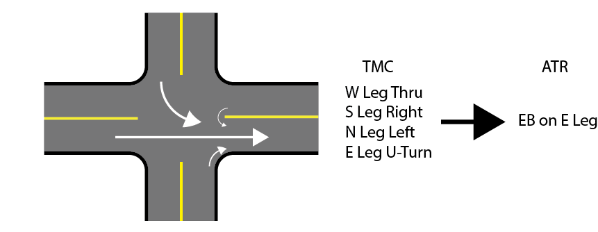

# Miovision - Multi-modal Permanent Video Counters

## Table of Contents

1. [Overview](#1-overview)
2. [Table Structure](#2-table-structure)
3. [Technology](#3-technology)
4. [Processing Data from CSV Dumps](#4-processing-data-from-csv-dumps)
5. [Processing Data from API](#5-processing-data-from-api)
6. [Filtering and Interpolation](#6-filtering-and-interpolation)
7. [QC Checks](#7-qc-checks)
8. [Current Issues and Tasks](#8-current-issues-and-tasks)

## 1. Overview

Miovision currently provides volume counts gathered by cameras installed at specific intersections. Miovision then processes the video footage and provides volume counts in aggregated 1 minute bins. The data is currently being used to support the King Street Transit Pilot by analysing the trends in volume on King Street, trends in volume on surrounding roads, and thru movement violations of the pilot. An example of how it was used to support the pilot project can be found [here](https://www.toronto.ca/wp-content/uploads/2018/08/9781-KSP_May-June-2018-Dashboard-Update.pdf).


## 2. Table Structure

### Original Data

#### `raw_data`

Data table storing all 1-minute observations in its **original** form. Records represent total 1-minute volumes for each [intersection]-[classification]-[leg]-[turning movement] combination. All subsequent tables are derived from the records in this table.

**Field Name**|**Data Type**|**Description**|**Example**|
:-----|:-----|:-----|:-----|
study_id|bigint|Unique identifier representing a specific intersection-date combination|474678|
study_name|text|Intersection in format of [main street] / [cross street]|King / Bathurst|
lat|numeric|Latitude of intersection location|43.643945|
lng|numeric|Longitude of intersection location|-79.402667|
datetime_bin|timestamp with time zone|Start of 1-minute time bin|2017-10-13 14:07:00+00|
classification|text|Specific mode class (see `classifications` below)|Lights|
entry_dir_name|text|Entry leg of movement|E|
entry_name|text|(not currently populated)||
exit_dir_name|text|Exit leg of movement|W|
exit_name|text|(not currently populated)||
movement|text|Specific turning movement (see `movements` below)|thru|
volume|integer|Total 1-minute volume|12|

### Reference Tables

#### `classifications`

Reference table for all 7 classifications: Lights, Bicycles on Road, Buses, Single-Unit Trucks, Articulated Trucks, Pedestrians on Crosswalk, and Bicycles on Crosswalk.

**Field Name**|**Data Type**|**Description**|**Example**|
:-----|:-----|:-----|:-----|
classification_uid|serial|Unique identifier for table|2|
classification|text|Textual description of mode|Bicycles|
location_only|boolean|If TRUE, represents movement on crosswalk (as opposed to road)|FALSE|
class_type|text|General class category (Vehicles, Pedestrians, or Cyclists)|Cyclists|

#### `intersections`

Reference table for each unique intersection at which data has been collected.

**Field Name**|**Data Type**|**Description**|**Example**|
:-----|:-----|:-----|:-----|
intersection_uid|serial|Unique identifier for table|10|
intersection_name|text|Intersection in format of [main street] / [cross street]|King / Bathurst|
street_main|text|Name of primary street|King|
street_cross|text|Name of secondary street|Bathurst|
lat|numeric|Latitude of intersection location|43.643945|
lng|numeric|Longitude of intersection location|-79.402667|

#### `movement_map`

Reference table for transforming aggregated turning movement counts (see `volumes_15min_tmc`) into segment-level volumes (see `volumes_15min`).

**Field Name**|**Data Type**|**Description**|**Example**|
:-----|:-----|:-----|:-----|
leg_new|text|Intersection leg on which 15-minute volume will be assigned|E|
dir|text|Direction on which 15-minute volume will be assigned|EB|
leg_old|text|Intersection leg on which 15-minute turning movement volume is currently assigned|W|
movement_uid|integer|Identifier representing current turning movement|1|

#### `movements`

Reference table for all unique movements: through, left turn, right turn, u-turn, clockwise movement on crosswalk, and counter-clockwise movement on crosswalk.

**Field Name**|**Data Type**|**Description**|**Example**|
:-----|:-----|:-----|:-----|
movement_uid|serial|Unique identifier for table|3|
movement|text|Textual description of specific turning movement|right|
location_only|boolean|If TRUE, represents movement on crosswalk (as opposed to road)|FALSE|

#### `periods`

Reference table for all unique time periods. Used primarily to aggregate 15-minute data for reporting purposes.

**Field Name**|**Data Type**|**Description**|**Example**|
:-----|:-----|:-----|:-----|
period_id|integer|Unique identifier for table|3|
day_type|text|Day type for date filter|[Weekday OR Weekend]|
period_name|text|Textual description of period|14 Hour|
period_range|timerange|Specific start and end times of period|[06:00:00,20:00:00)|

#### `intersection_movements`

This was created using [`create-table-intersection_movements.sql`](sql/create-table-intersection_movements.sql) and is a reference table of all observed movements for each classification at each intersection. This is used in aggregating to the 15-minute TMC's in order to [fill in 0s in the volumes](#Filling-0s-in-Aggregation). Subsequently, movements present in the volumes data [which were erroneous](https://github.com/CityofToronto/bdit_data-sources/issues/144#issuecomment-419545891) were deleted from the table. This table will include movements which are illegal, such as left turns at intersections iwth turn restrictions but not movements like a turn onto the wrong way of a one-way street. It will need to be manually updated when a new location is added.

**Field Name**|**Data Type**|**Description**|**Example**|
:-----|:-----|:-----|:-----|
 intersection_uid| integer | ID for intersection | 1 |
 classification_uid| integer | Identifier linking to specific mode class stored in `classifications`|1|
 leg| text | Entry leg of movement|E|
 movement_uid| integer | Identifier linking to specific turning movement stored in `movements`|2|

### Disaggregate Data

#### `volumes`

Data table storing all 1-minute observations in its **transformed** form. Records represent total 1-minute volumes for each [intersection]-[classification]-[leg]-[turning movement] combination.

**Field Name**|**Data Type**|**Description**|**Example**|
:-----|:-----|:-----|:-----|
volume_uid|serial|Unique identifier for table|5100431|
intersection_uid|integer|Identifier linking to specific intersection stored in `intersections`|31|
datetime_bin|timestamp without time zone|Start of 1-minute time bin in EDT|2017-10-13 09:07:00|
classification_uid|text|Identifier linking to specific mode class stored in `classifications`|1|
leg|text|Entry leg of movement|E|
movement_uid|integer|Identifier linking to specific turning movement stored in `movements`|2|
volume|integer|Total 1-minute volume|12|
volume_15min_tmc_uid|serial|Foreign key to [`volumes_15min_tmc`](#volumes_15min_tmc)|14524|

### Aggregated Data

The process in [**Processing Data from CSV Dumps**](#4-processing-data-from-csv-dumps) aggregates up the 1-minute volume data into two types of 15-minute volume products: Turning Movement Count (TMC) and Automatic Traffic Recorder (ATR) equivalents. Starting with `volumes` each table has a FOREIGN KEY relationship to the next step of aggregation so that an aggregated record can be traced back to its source data. For example: a row in `volumes_15min` has a unique ID `volumes_15min_uid`, and the foreign key `volumes_15min_tmc.volumes_15min_uid` identifies the row(s) that produced that `volumes_15min` row.

#### `volumes_15min_tmc`

`volumes_15min_tmc` contains data aggregated into 15 minute bins. As part of the process, the data is [interpolated](#interpolation) if needed, and missing 15 minute bins are filled. Missing bins are only filled for pedestrians, cyclists and lights (`classification_uid IN (1,2,6,7)`); trucks, buses and vans are not filled due to the large amount of gaps, and filling in lights would be sufficient to ensure there are no gaps for the `Vehicles` class used in `report_dates` and the views. Zeroes filling occurs by cross-joining a table containing all possible movments to create a table with all possible times and movements. Through a join with `volumes`, the query checks if there are no counts at that time, intersection, movement, and classification the is no volume, and fills the gap with a 0-volume bin. 

**Field Name**|**Data Type**|**Description**|**Example**|
:-----|:-----|:-----|:-----|
volume_15min_tmc_uid|serial|Unique identifier for table|14524|
intersection_uid|integer|Identifier linking to specific intersection stored in `intersections`|31|
datetime_bin|timestamp without time zone|Start of 15-minute time bin in EDT|2017-12-11 14:15:00|
classification_uid|text|Identifier linking to specific mode class stored in `classifications`|1|
leg|text|Entry leg of movement|E|
movement_uid|integer|Identifier linking to specific turning movement stored in `movements`|2|
volume|integer|Total 15-minute volume|78|
volume_15min_uid|integer|Foreign key to [`volumes_15min`](#volumes_15min)|12412|

#### `volumes_tmc_zeroes`

This is a crossover table to link `volumes` to the `volumes_15min_tmc` table so that when data are [deleted](#deleting-data) from `volumes` this cascades to all aggregated volumes in the 15-min table, including 0 values. The table contains `volume_15min_tmc_uid` and `volume_uid`. Since the data for the 0-volume 15 minute bins are not in the `volumes` table, this table exists so when the the last volume bin with data is deleted, the corresponding 0-volume 15 minute bins after that time is also deleted. 

**Field Name**|**Data Type**|**Description**|**Example**|
:-----|:-----|:-----|:-----|
volume_uid|int|Identifier for `volumes` table|5100431|
volume_15min_tmc_uid|int|Unique identifier for `volumes_15min_tmc` table|14524|

#### `volumes_15min`

Data table storing aggregated 15-minute turning movement data. Because of the format differences between TMC and ATR data, the `miovision.movement_map` is used to turn the TMC data to the ATR data. For example, TMC data has 4 possible movments for every ATR bin, and theres a total of 16 possible movements. This image summarizes the changes between TMC and ATR data.



**Field Name**|**Data Type**|**Description**|**Example**|
:-----|:-----|:-----|:-----|
volume_15min_uid|serial|Unique identifier for table|12412|
intersection_uid|integer|Identifier linking to specific intersection stored in `intersections`|31|
datetime_bin|timestamp without time zone|Start of 15-minute time bin in EDT|2017-12-11 14:15:00|
classification_uid|text|Identifier linking to specific mode class stored in `classifications`|1|
leg|text|Segment leg of intersection|E|
dir|text|Direction of traffic on specific leg|EB|
volume|integer|Total 15-minute volume|107|

### `atr_tmc_uid`

As described above, the TMC to ATR relationship is a many to many relationship. The query that populates `volumes_15min` also populates this table so that a record of which `volume_15min_tmc` bin corresponds to which `volume_15min` bin is kept, and vice versa. As a result, multiple entries of both `volume_15min_uid` and `volume_15min_tmc_uid` can be found in the query.

**Field Name**|**Data Type**|**Description**|**Example**|
:-----|:-----|:-----|:-----|
volume_15min_uid|serial|Unique identifier for table|12412|
volume_15min_tmc_uid|int|Unique identifier for `volumes_15min_tmc` table|14524|

### Primary and Foreign Keys

To create explicit relationships between tables, `volumes`, `volume_15min_tmc`, `volume_tmc_zeroes`, `atr_tmc_uid` and `volume_15min` have primary and foreign keys. Primary keys are unique identifiers for each entry in the table, while foreign keys refer to a primary key in another table and show how an entry is related to that entry.

#### List of primary and foreign keys

* `volumes` has the primary key `volume_uid` and foreign key `volume_15min_tmc_uid` which refers to `volume_15min_tmc`
* `volumes_15min_tmc` has the primary key `volume_15min_tmc_uid`
* `volumes_tmc_zeroes` has the foreign key `volume_uid` which refers to the most recent entry in `volume` before that 0-volume bin, and foreign key `volume_15min_tmc_uid` to refer to the 0-volume bin
* `volume_15min` has the primary key `volume_15min_uid`
* `atr_tmc_uid` has foreign keys `volume_15min_tmc_uid` and `volume_15min_uid`, referring to which TMC/ATR bin in `volume_15min_tmc_uid` and `volume_15min` each bin is referring to.

The current primary purpose for the keys is so that on deletion, the delete cascades through all tables. The keys also indicate whether it is new data if the foreign key is null, and tells the function to aggregate the data if it is new data. The keys can also be used in selecting data.

### Important Views

`(to be filled in)
`
## 3. Technology

(to be filled in)

## 4. Processing Data from CSV Dumps

### A. Populate `raw_data`

With [`trigger-populate-volumes.sql`](sql/trigger-populate-volumes.sql), it is no longer necessary that a copy of the csv dump is on the database. To upload the csv dump, insert the file to raw_data. The trigger will activate, process the data, and insert it to `volumes`. The trigger will return null, and no data will actually get inserted to `raw_data`.

### B. Populate `volumes`

This will transform 1-minute data from `raw_data` into a standard normalized structure stored in `volumes`.

1. The trigger function [`trigger-populate-volumes.sql`](sql/trigger-populate-volumes.sql) automatically populates `volumes` with new data from `raw_data`. `volumes` is the same data, except most of the information is replaced by integers that are referenced in lookup tables.
2. Ensure that the number of new records in `volumes` is identical to that in the csv dump. If a discrepancy exists, investigate further.

### C. Populate `volumes_15min_tmc` and `volumes_15min`

This will aggregate the 1-minute data from `volumes` into 15-minute turning movement counts (stored in `volumes_15min_tmc`) and segment-level counts (stored in `volumes_15min`). This process also filter potential partial 1-minute data and interpolates missing records where possible (see [Section 6](#6-filtering-and-interpolation))

1. Run [`SELECT mioviosion.aggregate_15_min_tmc();`](sql/function-aggregate-volumes_15min_tmc.sql). This produces 15-minute aggregated turning movement counts with filtering and interpolation with gap-filling for rows which have not yet been aggregated (the `FOREIGN KEY volume_15min_tmc_uid` is NULL).  Additionally, this query produces 0-volume records for intersection-leg-dir combinations that don't have volumes (to allow for easy averaging) and considered a valid movement. See [`volumes_15min_tmc`](#volumes_15min_tmc) for more detail on gap filling and [QC Checks](#qc-checks) for more detail on what is a valid movement.
2. Run [`SELECT mioviosion.aggregate_15_min()`](sql/function-aggregate-volumes_15min.sql). This produces 15-minute aggregated segment-level (i.e. ATR) data. A crossover table [`atr_tmc_uid`](#atr_tmc_uid) also populated using this query. This query contains a list of every combination of `volume_15min_uid` and `volume_15min_tmc_uid` since the relationship between the two tables is a many to many relationship.

### D. Refresh reporting views

This produces a lookup table of date-intersection combinations to be used for formal reporting (this filters into various views).

Refresh the `MATERIALIZED VIEW WITH DATA`s in the following order for reporting by running [`SELECT miovision.refresh_views()`](sql/function_refresh_materialized_views.sql). The following views are refreshed:
   * [`miovision.report_dates`](sql/materialized-view-report_dates.sql): This view contains a record for each intersection-date combination in which at least **forty** 15-minute time bins exist. If only limited/peak period data is collected, exceptions should be added with a `WHERE` clause specifying the dates. There are also additional situations which are explicitly removed from the `report_dates` table at the end of the query.
   * [`miovision.volumes_15min_by_class`](sql/create-view-volumes_15min_by_class.sql): Contains segment level data in 15 minute bins, categorized by cyclists, pedestrians, and vehicles. The data is similar to the `volumes_15min` table except the data is combined into the new classifications.
   * [`miovision.report_volumes_15min`](sql/create-view-report_volumes_15min.sql): Checks if any 15 minute bins are missing from 7:00 and 20:00. If a 15 minute bin is missing and hasn't already been filled, the view will fill it with the monthly average for that intersection-leg-classification-time combination. Data outside those hours are not kept in the view.
   * [`miovision.report_daily`](sql/create-view-report-daily.sql): Aggregates the data further into 3 periods: 14 hours, AM Peak, and PM Peak. The data is also aggregated into EB and WB directions and movements are not kept. Northbound and southbound directions do not appear in this view. 

### E. Produce summarized monthly reporting data

Add the relevant months to the [`VIEW miovision.report_summary`](sql/create-view-report_summary.sql). This view averages the volumes in `report_daily` for each intersection-direction-month-period combination.  Copy over the new month in `report_summmary` to the excel template `Count Data Draft.xlsx`, and add it as a new month in the `tod` excel sheets. Then add the new month and references to the `tod` sheet to the other excel sheets. 

The excel spreadsheet rearanges and rounds the data from `report_summary` so that the output is easily readable and compares the data against previous months and the baseline.

### Deleting Data

It is possible to enable a `FOREIGN KEY` relationship to `CASCADE` a delete from a referenced row (an aggregate one in this case) to its referring rows (disaggregate). However not all rows get ultimately processed into aggregate data. In order to simplify the deletion process, `TRIGGER`s have been set up on the less processed datasets to cascade deletion up to processed data. These can be found in [`trigger-delete-volumes.sql`](sql/trigger-delete-volumes.sql). At present, deleting rows in `raw_data` will trigger deleting the resulting rows in `volumes` and then `volumes_15min_tmc` and `volumes_15min`. 0 rows in `volumes_15min_tmc` are deleted through the intermediary lookup [`volumes_tmc_zeroes`](#volumes_tmc_zeroes).

## 5. Processing Data from API

Refer to the readme on the API for more detail

## 6. Filtering and Interpolation

### Filtering

### Interpolation

In the event there are less than 15 minutes of data, interpolation will occur to create the aggregated 15 minute bin in `volumes_15min_tmc`. The interpolation process will divide the total volume in that bin by the number of minutes with data and multiply it by 15. 

```SQL
B.interpolated = TRUE THEN SUM(A.volume)*15.0/((EXTRACT(minutes FROM B.end_time - B.start_time)+1)*1.0)
```

There is are exceptions to interpolation. These exceptions are situation where the missing 1 minute bin is actually as a result of no volume being counted instead of the camera not being operational. 

  * If the difference between the start and end time is greater than the number of populated minutes in the bin, then it can be assumed the missing bin/bins is due to no volume at that minute.
  * If there are populated bins in the minute or 2 minute before AND after the 15 minute bin, then it can also be assumed that any missing bins are due to no volume at that minute.

## 7. QC Checks

Most of the time, there will usually be issues with the data. These are some checks to easily identify issues. 

Compare the `report_daily` view with what is present on the [datalink portal](https://datalink.miovision.com/). The portal breaks down the volumes by day, classification, hour, 15 minute bin and is considered the truth.

```SQL
SELECT intersection_uid, intersection_name, street_main, street_cross, class_type, dir, period_name, min(total_volume) AS min_total_volume, max(total_volume) as max_total_volume
FROM miovision.report_daily
WHERE period_type = 'Jul 2018' AND period_name IN ('AM Peak Period', 'PM Peak Period')
GROUP BY intersection_uid, intersection_name, street_main, street_cross, class_type, dir, period_name
HAVING max(total_volume) / min(total_volume) > 1.5
```

This query searches report daily for dates having a variation of more than 1.5x at the same intersection, direction, class, and period. Usually, the daily variation of volume between days should not be that high, so this query can identify dates and intersections to compare against the datalink.

```SQL
SELECT study_name, classification, entry_dir_name, exit_dir_name, movement, datetime_bin, count(*)
FROM miovision.raw_data
GROUP BY study_name, classification, entry_dir_name, exit_dir_name, movement, datetime_bin
HAVING COUNT(1) > 1
```

This query checks for duplicate records in the `raw_data` table. This can also be modified to be used in the `volumes` table. If there are duplicate records, and the problem is persistent and significant, check with the datalink portal and communicate with miovision about this issue.

The data in `raw_data` also occasionally includes volumes with invalid movements. An example would be a WB thru movement on an EB one-way street such as Adelaide. Run [`find_invalid_movments.sql`](sql/function-find_invalid_movments.sql) to look for invalid volumes that may need to be deleted. This will create a warning if the number of invalid movements is higher than 1000, and that further QC is needed. 

## 8. Current Issues and Tasks

* [Create a crossover table for the UIDs](https://github.com/CityofToronto/bdit_data-sources/issues/137)
  * Because of the many-to-many relationship between the ATR data and TMC data, a crossover table needs to be implemented to demonstrate the relationship between an ATR bin and TMC bin.
* [Fix interpolation bug](https://github.com/CityofToronto/bdit_data-sources/issues/140)
  * While optimizing the `funtion-aggregate-volumes_15min_tmc()`, one of the checks to see if missing data needs to be interpolated was changed. Reverting to the old process can easily double the query run-time, so an equivalent method will need to be found without prolonging the run time.
* Fix `COALESCE` statement in `report_volume_15min`
  * If a bin does not have data, the current process is to either delete that time period, or use the average volume for that time bin. However, the seasonality of pedestrian and cycling volume may not make that process valid. A suggested approach is to limit the average volume for a time bin to only use data in the same month or week
