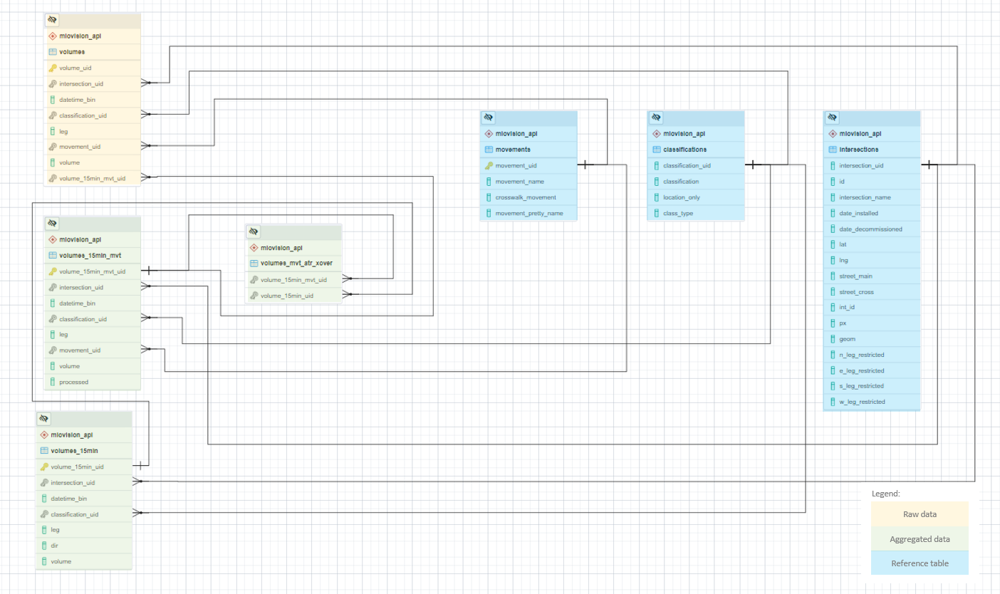
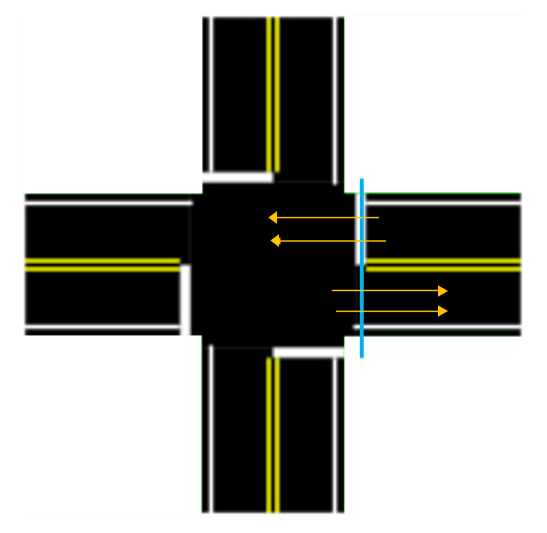

# Miovision - Multi-modal Permanent Video Counters 

## Table of Contents

- [1. Overview](#1-overview)
	- [Folder Structure](#folder-structure)
- [2. Table Structure](#2-table-structure)
	- [Reference Tables](#reference-tables)
		- [`classifications`](#classifications)
		- [`intersections`](#intersections)
		- [`movements`](#movements)
		- [`movement_map`](#movement_map)
		- [`periods`](#periods)
		- [`intersection_movements`](#intersection_movements)
	- [Disaggregate Data](#disaggregate-data)
		- [`volumes`](#volumes)
	- [Aggregated Data](#aggregated-data)
		- [`volumes_15min_tmc`](#volumes_15min_tmc)
		- [`unacceptable_gaps`](#unacceptable_gaps)
		- [`volumes_15min`](#volumes_15min)
		- [`volumes_mvt_atr_xover`](#volumes_mvt_atr_xover)
	- [Primary and Foreign Keys](#primary-and-foreign-keys)
		- [List of primary and foreign keys](#list-of-primary-and-foreign-keys)
	- [Important Views](#important-views)
- [3. Finding Gaps and Malfunctioning Camera](#3-finding-gaps-and-malfunctioning-camera)
- [4. Repulling data](#4-repulling-data)
	- [Deleting data to re-run the process](#deleting-data-to-re-run-the-process)
        
## 1. Overview

The data described in this readme.md are stored in the bigdata RDS, in a schema called `miovision_api`.

Miovision currently provides volume counts gathered by cameras installed at specific intersections. Miovision then processes the video footage and provides volume counts in aggregated 1 minute bins. The data is currently being used to support the King Street Transit Pilot by analysing the trends in volume on King Street, trends in volume on surrounding roads, and thru movement violations of the pilot. An example of how it was used to support the pilot project can be found [here](https://www.toronto.ca/wp-content/uploads/2018/08/9781-KSP_May-June-2018-Dashboard-Update.pdf).

You can see the current locations of Miovision cameras [on this map.](geojson/mio_intersections.geojson)

### Folder Structure

- `api` - scripts and documentation for accessing the Miovision API.
- `csv` - tracks baseline volumes and gaps.
- `dev_notebooks` - Jupyter Notebooks for development and testing.
- `geojson` - stores locations of Miovision cameras.
- `img` - contains images used in explanatory docs like this!
- `sql` - scripts for producing tables.
- `update_intersections` - contains up-to-date instructions for adding new intersections.

## 2. Table Structure

### Miovision Data at a Glance...(Entity Relationship Diagram)



### Reference Tables

#### `classifications`

Reference table for all classifications:

**Field Name**|**Data Type**|**Description**|**Example**|
:-----|:-----|:-----|:-----|
classification_uid|serial|Unique identifier for table|2|
classification|text|Textual description of mode|Bicycles|
location_only|boolean|If TRUE, represents movement on crosswalk (as opposed to road)|FALSE|
class_type|text|General class category (Vehicles, Pedestrians, or Cyclists)|Cyclists|

Here is a description of the `classification_uid`s and corresponding types. For more information, see [Miovision's documentation on this topic](https://help.miovision.com/s/article/North-American-Classification-Guide). **Note:** Some classifications have changed over time, see notes related to this below the table and see progress on determining when these changes happened in [Issue 634](https://github.com/CityofToronto/bdit_data-sources/issues/634).

| classification_uid | classification | definition |
| ------------------ | -------------- | ---------- |
1 | Light | Cars and other passenger vehicles (like vans, SUVs or pick-up trucks)|
2<sup>1</sup> | Bicycle | A bicycle - this classification_uid is used to track bicycle turning movements |
3<sup>2</sup> | Bus | A large vehicle that provides transportation for many humans. This currently includes buses *and streetcars*, though this wasn't always the case. |
4 | SingleUnitTruck | A truck that has a non-detachable cab and trailer system |
5 | ArticulatedTruck | A truck that has a detachable cab and trailer system |
6 | Pedestrian | A walker. May or may not include zombies... |
8 | WorkVan | A van used for commercial purposes |
9<sup>2</sup> | MotorizedVehicle | Miscellaneous vehicles. This category originally included streetcars but now does not. |
10<sup>1</sup> | Bicycle | A bicycle - this classification_uid is used to track bicycle approaches (entrances and exits) |

1. Note that bicycles are available at both a turning movement level and at an approach level. Approach level bicycle counts should be used for the large majority of applications as the data is considered more accurate.
2. Streetcars were for some time classified as MotorizedVehicle, though they now fall in the Bus category. The suspected date for this change is circa 2019-08-01 though this has not been fully confirmed and may vary betseen intersections.

#### `intersections`

Reference table for each unique intersection at which data has been collected:

**Field Name**|**Data Type**|**Description**|**Example**|
:-----|:-----|:-----|:-----|
intersection_uid|integer|Unique identifier for table|10|
id|text|Unique id from Miovision API|990cd89a-430a-409a-b0e7-d37338394148|
intersection_name|text|Intersection in format of [main street] / [cross street]|King / Bathurst|
date_installed|date|Installation date of the camera (date of the first available timestamp)|2017-10-03|
date_decommissioned|date|Decommissioned date of the camera (date of the last available timestamp)|NULL|
lat|numeric|Latitude of intersection location|43.643945|
lng|numeric|Longitude of intersection location|-79.402667|
street_main|text|Name of primary street|King|
street_cross|text|Name of secondary street|Bathurst|
int_id|bigint|int_id linked to centrelines|13467722|
px|integer|px linked to traffic lights|201|
geom|geometry|Point geometry of that intersection|0101000020E61000006B0BCF4BC5D953C01CB62DCA6CD24540|
n_leg_restricted|boolean|Whether that leg is restricted to vehicles|NULL|
e_leg_restricted|boolean|Whether that leg is restricted to vehicles|NULL|
s_leg_restricted|boolean|Whether that leg is restricted to vehicles|NULL|
w_leg_restricted|boolean|Whether that leg is restricted to vehicles|NULL|

#### `movements`

Reference table for road user movements:

**Field Name**|**Data Type**|**Description**|**Example**|
:-----|:-----|:-----|:-----|
movement_uid|integer|Identifier representing current turning movement|1|
movement_name|text|Short description of movement|thru|
crosswalk_movement|boolean|Whether the movement describes pedestrians on crosswalks|false|
movement_pretty_name|text|Long description of movement|Through|


Here is a description of the movement_uids and corresponding types:

**movement_uid**|**movement_pretty_name**|**definition**|
:-----|:-----|:-----|
1|Through|Vehicle drove through the intersection (no turns)|
2|Left|Vehicle turned left|
3|Right|Vehicle turned right|
4|U-Turn|Vehicle went back from whence it came - usually excluded from counts|
5|Clockwise|Pedestrian proceeded clockwise around the intersection (a pedestrian on the north leg going clockwise would be heading eastbound)|
6|Counter Clockwise|Pedestrian proceeded counter clockwise around the intersection (a pedestrian on the north leg going counter clockwise would be heading westbound)|
7|Bicycle Entrance|Used to determine where bicycles entered the intersection|
8|Bicycle Exit|Used to determine where bicycles exited the intersection|

#### `movement_map`

Reference table for transforming aggregated turning movement counts (see `volumes_15min_mvt`) into segment-level volumes (see `volumes_15min`):

**Field Name**|**Data Type**|**Description**|**Example**|
:-----|:-----|:-----|:-----|
leg_new|text|Intersection leg on which 15-minute volume will be assigned|E|
dir|text|Direction on which 15-minute volume will be assigned|EB|
leg_old|text|Intersection leg on which 15-minute turning movement volume is currently assigned|W|
movement_uid|integer|Identifier representing current turning movement - see `movements`|1|

#### `periods`

Reference table for all unique time periods. Used primarily to aggregate 15-minute data for reporting purposes:

**Field Name**|**Data Type**|**Description**|**Example**|
:-----|:-----|:-----|:-----|
period_id|integer|Unique identifier for table|3|
day_type|text|Day type for date filter|[Weekday OR Weekend]|
period_name|text|Textual description of period|14 Hour|
period_range|timerange|Specific start and end times of period|[06:00:00,20:00:00)|
report_flag|boolean|Indicates whether the period is used in a report|true|


#### `intersection_movements`

This was created using [`create-table-intersection_movements.sql`](sql/create-table-intersection_movements.sql) and is a reference table of all observed movements for each classification at each intersection. This is used in aggregating to the 15-minute TMC's in order to [fill in 0s in the volumes](#volumes_15min_mvt). Subsequently, movements present in the volumes data [which were erroneous](https://github.com/CityofToronto/bdit_data-sources/issues/144#issuecomment-419545891) were deleted from the table. This table will include movements which are illegal, such as left turns at intersections with turn restrictions but not movements like a turn onto the wrong way of a one-way street. It will need to be manually updated when a new location is added.

Since this reference table must be updated every time a new intersection is added, there are several iterations of it. The earliest is `miovision_api.intersection_movements_20200805`; the latest is `intersection_movements_20210712`. Users should use `intersection_movements` and may find their permissions restricted on the dated versions of this table.

**Field Name**|**Data Type**|**Description**|**Example**|
:-----|:-----|:-----|:-----|
 intersection_uid| integer | ID for intersection | 1 |
 classification_uid| integer | Identifier linking to specific mode class stored in `classifications`|1|
 leg| text | Entry leg of movement|E|
 movement_uid| integer | Identifier linking to specific turning movement stored in `movements`|2|

### Disaggregated Data

#### `volumes`

Data table storing all 1-minute observations in its **transformed** form. Records represent total 1-minute volumes for each [intersection]-[classification]-[leg]-[turning movement] combination.

**Field Name**|**Data Type**|**Description**|**Example**|
:-----|:-----|:-----|:-----|
volume_uid|serial|Unique identifier for table|5100431|
intersection_uid|integer|Identifier linking to specific intersection stored in `intersections`|31|
datetime_bin|timestamp without time zone|Start of 1-minute time bin in EDT|2017-10-13 09:07:00|
classification_uid|text|Identifier linking to specific mode class stored in `classifications`|1|
leg|text|Entry leg of movement|E|
movement_uid|integer|Identifier linking to specific turning movement stored in `movements`|2|
volume|integer|Total 1-minute volume|12|
volume_15min_mvt_uid|serial|Foreign key to [`volumes_15min_mvt`](#volumes_15min_tmc)|14524|

Using the trigger function `volumes_insert_trigger()`, the data in `volumes` table are later put into `volumes_2018`, `volumes_2019` and so on up to `volumes_2022` depending on the year the data were recorded.

- *Unique constraint* was added to `miovision_api.volumes` table as well as its children tables (`miovision_api.volumes_2020` etc) since the trigger sends the data to the children table to get inserted. The unique constraint is based on `intersection_uid`, `datetime_bin`, `classification_uid`, `leg`, and `movement_uid`.

- **NOTE:** datetime_bin for each day happens from 23:00 the previous day to 22:59 current day.

### Aggregated Data

Data are aggregated from 1-minute volume data into two types of 15-minute volume products: Turning Movement Count (TMC) and Automatic Traffic Recorder (ATR) equivalents. Starting with `volumes` each table has a FOREIGN KEY relationship to the next step of aggregation so that an aggregated record can be traced back to its source data. For example: a row in `volumes_15min` has a unique ID `volumes_15min_uid`, and the foreign key `volumes_15min_mvt.volumes_15min_uid` identifies the row(s) that produced that `volumes_15min` row.

#### `volumes_15min_mvt`

`volumes_15min_mvt` contains data aggregated into 15 minute bins. In order to
make averaging hourly volumes simpler, the volume can be `NULL` (for all modes)
or `0` for classifications 1, 2, 6, 10 (which corresponds to light vehicles, bicycles (classifications 2 and 10) and pedestrians).

The 1-min data do not identify if a camera is malfunctioning, so gaps in data
could either mean there was no volume, or that the camera malfunctioned. Because
we have continuous data from these counters, we no longer try to interpolate
data during gaps. When our heuristics identify `unacceptable_gaps`, then the
entire hour of data is thrown out and the volume is set to `NULL` to imply that
the data has been processed for this hour, but the results have been discarded.

A `0` value implies the process identifies the camera was working, but there was
no volume for that mode. Only volumes for pedestrians, cyclists and light
vehicles (`classification_uid IN (1,2,6,10)`) are filled in because those are the
modes we report on more frequently. Other modes are not filled because they have
much lower volumes, so the 0s would expand the size of the dataset considerably.

The [`aggregate_15_min_mvt()`](sql/function-aggregate-volumes_15min_mvt.sql) function performs zero-filling by cross-joining a table containing all possible movements described in ([`intersection_movements`](#intersection_movements)) The only type of movement tracked in the 1-minute volume data, but not the aggregated data, is bicycle exits (`classification_uid = 10 and movement_uid = 8`). The vendor recommended that bicycle exits not be used due to data quality concerns.

`volumes_15min_mvt` is a table with all possible times and movements for active intersections. Through a left join with [`unacceptable_gaps`](#unacceptable_gaps), the query checks if the bins are within the unacceptable gap (technically, within the hour and the hour after), if so volume is set to NULL, otherwise the volume is set to sum(volume) as shown in the line `CASE WHEN un.accept = FALSE THEN NULL ELSE (COALESCE(SUM(A.volume), 0)) END AS volume`. 

If there is a gap from '2020-06-25 15:38:00' to '2020-06-25 15:54:00', all 15min bins from '15:00:00 to 16:00:00' are set to have volume = NULL OR if there is a gap from '2020-06-25 15:38:00' to '2020-06-25 16:24:00', all 15min bin from '15:00:00 to 17:00:00' are set to have volume = NULL. (Not sure if this is causing us to exclude way too many time bins, might get back to this later on). Through a left join with `volumes`, the query aggregates those 1min bins into the 15min bins and exclude those unacceptable ones. Note that those bins fall within the unacceptable_gaps time period for that intersection do not get aggregated and hence are not assigned with `volume_15min_mvt_uid`.

**Field Name**|**Data Type**|**Description**|**Example**|
:-----|:-----|:-----|:-----|
volume_15min_mvt_uid|serial|Unique identifier for table|14524|
intersection_uid|integer|Identifier linking to specific intersection stored in `intersections`|31|
datetime_bin|timestamp without time zone|Start of 15-minute time bin in EDT|2017-12-11 14:15:00|
classification_uid|text|Identifier linking to specific mode class stored in `classifications`|1|
leg|text|Entry leg of movement|E|
movement_uid|integer|Identifier linking to specific turning movement stored in `movements`|2|
volume|integer|Total 15-minute volume|78|
processed|boolean|**need desc**|true
<del>volume_15min_uid|<del>integer|<del>Foreign key to [`volumes_15min`](#volumes_15min)|<del>12412| <\del>--currently non-existent

- A *Unique constraint* was added to `miovision_api.volumes_15min_mvt` table based on `intersection_uid`, `datetime_bin`, `classification_uid`, `leg` and `movement_uid`.

- **NOTE:** datetime_bin for each day happens from 23:00 the previous day to 22:45 current day. \
(23:00 datetime_bin contains 1-min bin >= 23:00 and < 23:15 whereas \
22:45 datetime_bin contains 1-min bin >= 22:45 and < 23:00)

#### `unacceptable_gaps`

Data table storing all the unacceptable gaps using a set of gap sizes that are based on the average volumes at that intersection at a certain period of time in the past 60 days. More information can be found at [#3. Finding gaps and malfunctioning camera](#3-finding-gaps-and-malfunctioning-camera) . This table will then be used in the aggregate_15_min_mvt function to aggregate 1-min bin to 15-min bin.

**Field Name**|**Data Type**|**Description**|**Example**|
:-----|:-----|:-----|:-----|
intersection_uid|integer|Identifier linking to specific intersection stored in `intersections`|8|
gap_start|timestamp without time zone|The timestamp of when the gap starts|2020-05-01 02:53:00|
gap_end|timestamp without time zone|The timestamp of when the gap ends|2020-05-01 03:08:00|
gap_minute|integer|Duration of the gap in minute|15|
allowed_gap|integer|Allowed gap in minute|15|
accept|boolean|Stating whether this gap is acceptable or not|false|

#### `volumes_15min`

Data table storing ATR versions of the 15-minute turning movement data. Data in
`volumes` is stored in TMC format, so must be converted to ATR to be included in
`volumes_15min`.

TMC movements are described in `miovision_api.movements`. **TMC legs indicate
the approach direction of traffic**, and there are **four possible vehicle
movements encoded using `movement_uid`: `1` - thru; `2` - left turn; `3` - right
turn; and `4` - u-turn**. For example, the image below shows the `W`-leg in red and the
four possible movements from `W`-leg as yellow lines.  For a fully working
intersection, there will be 16 possible TMC combinations since there are 4 directions and 4
legs in each direction for TMC.
                                                           
(Note: movements described by `movement_uid IN (5,6)` are for pedestrians and are discussed below).


**ATR movements, on the other hand, define leg as the side of the intersection**,
and **direction as the cardinal direction of traffic travelling through that side
of the intersection**. For example, in this figure the blue line represents
the `E`-leg whereas yellow arrows represent EB and WB directions. For a fully
working intersection, there will be 8 possible ATR since there are 4 directions
and 2 legs in each direction for ATR.



`miovision_api.movement_map` is used to convert the TMC data to the ATR data.
Here are some example rows from the table:

|leg_new|dir|leg_old|movement_uid|
|-------|---|-------|------------|
| E | EB | E | 4 |
| E | EB | S | 3 |
| E | EB | W | 1 |
| E | EB | N | 2 |

- `leg_new` (leg for ATR) - anything that crosses that side of the intersection
- `dir` - heading of traffic crossing `leg_new`
- `leg_old` (leg for TMC) - direction the vehicles approach into intersection
- `movement_uid` - turning movement stored in `movements`

The example above represents a mapping from TMC to ATR `E` leg and `EB`
direction. Below is a diagram of this mapping. The blue line represents `leg_new
= E`. To obtain the `dir = EB` volume, we sum up the traffic performing the
relevant `movement_uid`, shown as yellow lines, coming from the `leg_old`, shown
as red lines.


For light vehicles at King / Bay on 2020-10-15 9:00-9:15 (`intersection_uid =
17`, `datetime_bin = '2020-10-15 09:00:00'`, `classification_uid = 1`), the TMC
and ATR movements are:

|leg(tmc)|movement_uid|volume|
|--------|------------|------|
| E | 1 | 13  |
| E | 2 | 0   |
| E | 3 | 5   |
| N | 1 | 82  |
| N | 2 | 0   |
| N | 3 | 1   |
| S | 1 | 144 |
| S | 2 | 0   |
| S | 3 | 0   |
| W | 1 | 12  |
| W | 2 | 2   |
| W | 3 | 9   |
| | |total volume = 268|

|leg(atr)|dir|volume|
|--------|---|------|
| E | EB | 12  |
| E | WB | 18  |
| N | NB | 151 |
| N | SB | 83  |
| S | NB | 144 |
| S | SB | 91  |
| W | EB | 23  |
| W | WB | 14  |
| | |total volume = 536|

The ATR table exactly double-counts the number of vehicles travelling through
intersections, since, for example, `leg(atr) = E` and `dir = EB` represents
vehicles moving away from the intersection, and `leg(atr) = E` and `dir = WB`
represents vehicles moving toward it.

> However, the above is not applicable to pedestrian counts which are
> `classification_uid` = 6 and `movement_uid` = 5, 6. Pedestrian counts in the
> TMC and ATR tables have an equal number of rows and equal total volume.

- **For pedestrian counts**, the `leg` represents the side of crosswalk the pedestrians are at whereas `dir` represents which direction they are walking towards. So, if leg = N and dir = EB means that the pedestrian is at the North crosswalk crossing from the west side to the east side.

**Field Name**|**Data Type**|**Description**|**Example**|
:-----|:-----|:-----|:-----|
volume_15min_uid|serial|Unique identifier for table|12412|
intersection_uid|integer|Identifier linking to specific intersection stored in `intersections`|31|
datetime_bin|timestamp without time zone|Start of 15-minute time bin in EDT|2017-12-11 14:15:00|
classification_uid|text|Identifier linking to specific mode class stored in `classifications`|1|
leg|text|Segment leg of intersection|E|
dir|text|Direction of traffic on specific leg|EB|
volume|integer|Total 15-minute volume|107|

A *Unique constraint* was added to the `miovision_api.volumes_15min` table based on `intersection_uid`, `datetime_bin`, `classification_uid`, `leg` and `dir`.

- **NOTE:** datetime_bin for each day happens from 23:00 the previous day to 22:45 current day. \
(23:00 datetime_bin contains 1-min bin >= 23:00 and < 23:15 whereas \
22:45 datetime_bin contains 1-min bin >= 22:45 and < 23:00)

#### `volumes_mvt_atr_xover`

**This is a crossover table to link `volumes_15min_mvt` to the `volumes_15min` table**. As described above, the TMC to ATR relationship is a many to many relationship. The [`aggregate_15_min()`](sql/function-aggregate-volumes_15min.sql) function that populates `volumes_15min` also populates this table so that a record of which `volume_15min_mvt` bin corresponds to which `volume_15min` bin is kept, and vice versa. As a result, multiple entries of both `volume_15min_uid` and `volume_15min_mvt_uid` can be found in the query.

**Field Name**|**Data Type**|**Description**|**Example**|
:-----|:-----|:-----|:-----|
volume_15min_mvt_uid|int|Unique identifier for `volumes_15min_mvt` table|14524|
volume_15min_uid|serial|Unique identifier for table|12412|

### Primary and Foreign Keys

To create explicit relationships between tables, `volumes`, `volume_15min_mvt`, `atr_mvt_uid` and `volume_15min` have primary and foreign keys. Primary keys are unique identifiers for each entry in the table, while foreign keys refer to a primary key in another table and show how an entry is related to that entry.

#### List of primary and foreign keys

* `volumes` has the primary key `volume_uid` and foreign key `volume_15min_mvt_uid` which refers to `volume_15min_mvt`
* `volumes_15min_mvt` has the primary key `volume_15min_mvt_uid`
* `volume_15min` has the primary key `volume_15min_uid` 

The current primary purpose for the keys is so that on deletion, the delete cascades through all tables. The keys also indicate whether it is new data if the foreign key is null, and tells the function to aggregate the data if it is new data. The keys can also be used in selecting data.

### Important Tables

The tables below are produced using functions explained in the [API Puller](api#postgresql-functions). They produce a lookup table of date-intersection combinations to be used for checking purposes or even for formal reporting.

|Table|Purpose|
|------|-------|
|`api_log`|Contains a record of the `start_date` and `end_date` for an `intersection_uid` and when the data was pulled as `date_added`|
|`missing_dates`|Contains a record of the `intersection_uid` and the `dt` that were missing in the `volumes_15min` table, with `period_type` stated|
|`report_dates`|Contains a record for each intersection-date combination in which at least forty 15-minute time bins exist between 6AM and 8PM|

## 3. Finding Gaps and Malfunctioning Camera

In order to better determine if a camera is still working, we have decided to use the gaps and islands method to figure where the gaps are (gaps as in the unfilled space or interval between the 1min bins; a break in continuity) and their sizes. There are two parts of this in the whole process.

**Part I - Unacceptable Gaps**
The following process is used to determine the gap sizes assigned to an intersection at different time and then find out if the gaps are within the acceptable range or not. The timebins exceeding the allowed gap_size will then be inserted an `unacceptable_gaps` table. Finding gaps is important so that we know how reliable the data is for that time period based on past volume and not include those bins found within the unacceptable gaps range.

1. The materialized view [`miovision_api.gapsize_lookup`] (sql/create-mat-view-gapsize_lookup.sql) (**note: this table does not exist- please check**) is refreshed/updated daily to find out the daily average volume for each intersection_uid, period and time_bin in the past 60 days. Based on the average volume, an acceptable gap_size is assigned to that intersection. 
2. The set of acceptable gap_size implemented is based on an investigation stated in this [notebook](dev_notebooks/volume_vs_gaps.ipynb). 
3. Then, the function [`miovision_api.find_gaps`](sql/function-find_gaps.sql) is used to find all gaps of data in the table `miovision_api.volumes` and check if they are within the acceptable range of gap sizes or not based on the information from the materialized view above.
4. Gaps that are equal to or exceed the allowed gap sizes will then be inserted into the table [`miovision_api.unacceptable_gaps`](#unacceptable_gaps). 
5. Based on the `unacceptable_gaps` table, [`aggregate_15min_mvt`](#volumes_15min_mvt) function will not aggregate 1min bins found within the unacceptable_gaps' `DATE_TRUNC('hour', gap_start)` and `DATE_TRUNC('hour', gap_end) + interval '1 hour'` since the hour of gap_start and gap_end may be the same.

**Part II - Working Machine**
The following process is to determine if a Miovision camera is still working. It is different from the process above because the gap sizes used above are small and do not say much about whether a camera is still working. We roughly define a camera to be malfunctioning if that camera/intersection has a gap greater than 4 hours OR do not have any data after '23:00:00'. The function that does this is [`miovision_api.determine_working_machine()`](sql/function-determine_working_machine.sql) and there is an Airflow dag named [`check_miovision`](/dags/check_miovision.py) that runs the function at 7AM every day to check if all cameras are working. A slack notification will be sent if there's at least 1 camera that is not working. The function also returns a list of intersections that are not working and from what time to what time that the gaps happen which is helpful in figuring out what has happened.

### Identifying Questionable Data Quality

The table `miovision_api.anomalous_ranges` is used to flag times and places in the data where counts are potentially questionable, suspicious, or irregular. Sometimes counts are clearly not valid or data are missing, and sometimes counts look very weird but have been investigated and confirmed as valid or subject to some specific caveat. This table helps us track the status of these investigations and their results. 
The basic idea is to identify sections of data (by timerange, intersection, and classification) that have been flagged as suspicious/anomalous for whatever reason, and state what we know about that data-subset in a semi-structured way. This lets us further investigate where that is required and carve out data that has been formally cast into doubt from queries that need only-the-best.

#### Fields in `miovision_api.anomalous_ranges`
| Column | Description |
| ------ | ----------- |
| uid    | simple incrementing primary key |
| intersection_uid | the intersection; `NULL` if applies to all intersections, e.g. an algorithm change |
| classification_uid | the classification; `NULL` if applies to all classifications e.g. a misaligned camera |
| time_range | the `tsrange` in question; may be open-ended |
| notes | as detailed a description of the issue as reasonably possible |
| qa_level | references `miovision_api.anomaly_investigation_levels`; indicates the degree to which the issue has been investigated. Is it just a suspicion? Has it been authoritatively confirmed? Etc. |
| problem_level | references `miovision_api.anomaly_problem_levels`; indicates the degree or nature of the problem. e.g. valid with a caveat vs do-not-use under any circumstance |

#### Fields in `miovision_api.anomaly_investigation_levels` and `miovision_api.anomaly_problem_levels`
| Column | Description |
| ------ | ----------- |
| uid    | very short descriptive text; primary key |
| description | full description / documentation of the category; refer directly to these tables for documentation of the available classifications. |

#### An applied example

When looking for only "typical" data, `anomalous_ranges` should be used along with tables like `ref.holiday` to filter data. 

```sql
SELECT volume_uid
FROM miovision_api.volumes
WHERE 
    NOT EXISTS ( -- this is our one big filter for bad/dubious data
        SELECT 1
        FROM miovision_api.anomalous_ranges
        WHERE
            anomalous_ranges.problem_level IN ('do-not-use', 'questionable')
            AND anomalous_ranges.time_range @> volumes.datetime_bin
            AND (
                anomalous_ranges.intersection_uid = volumes.intersection_uid
                OR anomalous_ranges.intersection_uid IS NULL
            )
            AND (
                anomalous_ranges.classification_uid = volumes.classification_uid
                OR anomalous_ranges.classification_uid IS NULL
            )
    )
    AND NOT EXISTS ( -- also exclude official holidays
        SELECT 1 FROM ref.holiday WHERE holiday.dt = volumes.datetime_bin::date
    )
    AND etc.
```

#### Identifying new anomalies
While initially populated by a script, currently the `anomalous_ranges` tables is populated/updated manually after usually visual inspection of graphed Miovision data. For write access to the table, please request permissions from your friendly neighborhood sysadmin.

There is an intention to eventually flag times with unusual volumes automagically (see [Issue #630](https://github.com/CityofToronto/bdit_data-sources/issues/630)). More details on QC work (including notebooks and code) can be found in the [dev_notebooks README.md](dev_notebooks/README.md).

## 4. Repulling data
### Deleting data to re-run the process

Uh oh, something went wrong in the process? Fret not, you can delete the data and re-run the process again. Note that you can't do that without deleting since most of our tables have a unique constraint. You will mostly likely violate that if you re-run the process without first removing the relevant data. Below you can find queries that have to be run which include all the tables that are involved. The precis version: delete 1min bins from `volumes` table and delete 15min bins from both mvt (tmc) and atr tables (note the different start_time and end_time), delete relevant information from `report_dates`, `api_log` and `unacceptable_gaps`. The example below shows how we delete a day worth of data on 2020-08-20.

```sql
DELETE FROM miovision_api.volumes
WHERE datetime_bin BETWEEN '2020-08-20 00:00:00' AND '2020-08-20 23:59:00';

DELETE FROM miovision_api.volumes_15min_mvt
WHERE datetime_bin BETWEEN '2020-08-19 23:00:00' AND '2020-08-20 22:45:00';

DELETE FROM miovision_api.volumes_15min
WHERE datetime_bin BETWEEN '2020-08-19 23:00:00' AND '2020-08-20 22:45:00';

DELETE FROM miovision_api.report_dates
WHERE dt = '2020-08-20';

DELETE FROM miovision_api.api_log
WHERE start_date = '2020-08-20';

DELETE FROM miovision_api.unacceptable_gaps
WHERE gap_start BETWEEN '2020-08-20 00:00:00' AND '2020-08-20 23:59:00';
```

Once you have deleted all the relevant data, you can now re-run the process with the following command line.
```
python3 intersection_tmc.py run-api --path /etc/airflow/data_scripts/volumes/miovision/api/config.cfg --start_date 2020-08-20 --end_date 2020-08-21
```

The data pulling script currently *does not support* deleting and re-processing data that is not in one-day blocks (for example we cannot delete and re-pull data from `'2021-05-01 16:00:00'` to `'2021-05-02 23:59:00'`, instead we must do so from `'2021-05-01 00:00:00'` to `'2021-05-02 23:59:00'`).
