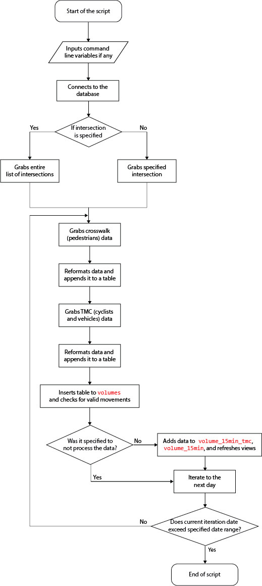
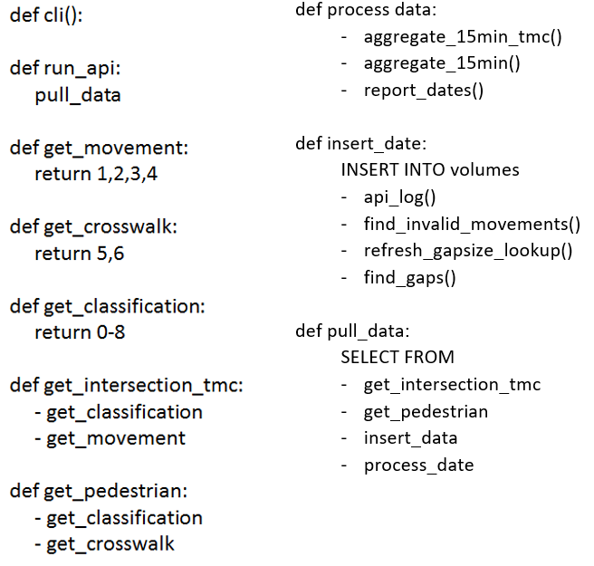
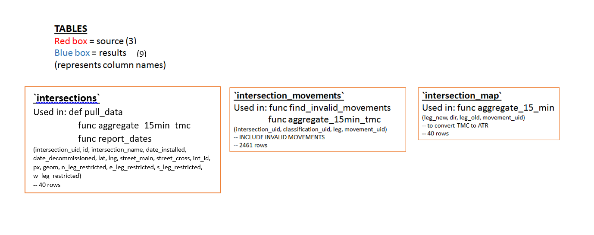
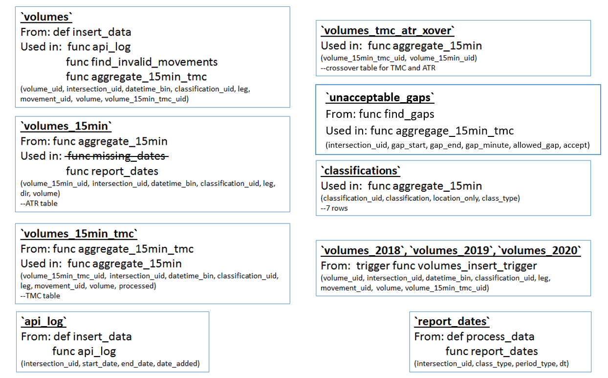
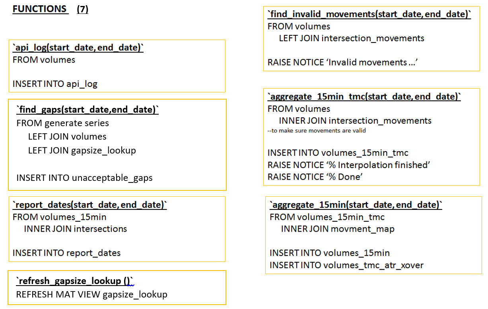
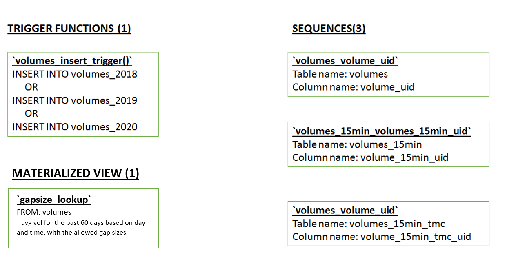

# API Puller

## Table of Contents

- [Table of Contents](#table-of-contents)
- [Overview](#overview)
- [Input Parameters](#input-parameters)
  - [API Key and URL](#api-key-and-url)
- [Relevant Calls and Outputs](#relevant-calls-and-outputs)
  - [Turning Movement Count (TMC)](#turning-movement-count-tmc)
  - [Turning Movement Count (TMC) Crosswalks](#turning-movement-count-tmc-crosswalks)
  - [Error responses](#error-responses)
- [Input Files](#input-files)
- [How to run the api](#how-to-run-the-api)
  - [Virtual Environment](#virtual-environment)
  - [Command Line Options](#command-line-options)
- [Classifications](#classifications)
  - [Exisiting Classification (csv dumps and datalink)](#exisiting-classification-csv-dumps-and-datalink)
  - [API Classifications](#api-classifications)
- [PostgreSQL Functions](#postgresql-functions)
- [Invalid Movements](#invalid-movements)
- [How the API works](#how-the-api-works)
- [Airflow](#airflow)
- [Notes](#notes)

## Overview

The puller can currently grab crosswalk and TMC data from the Miovision API using specified intersections and dates, upload the results to the database and aggregates data to 15 minute bins. The puller can support date ranges longer than 24 hours. The output is the same format as existing csv dumps sent by miovision. This script creates a continuous stream of volume data from Miovision.

## Input Parameters

### API Key and URL

Emailed from Miovision. Keep it secret. Keep it safe.

The API can be accessed at [https://api.miovision.com/intersections/](https://api.miovision.com/intersections/). The general structure is the `base url+intersection id+tmc or crosswalk endpoint`. Additional documentation can be found in here: [http://beta.docs.api.miovision.com/](http://beta.docs.api.miovision.com/) .

## Relevant Calls and Outputs

Each of these returns a 1-minute aggregate, maximum 48-hrs of data, with a two-hour lag (the end time for the query cannot be more recent than two-hours before the query). If the volume is 0, the 1 minute bin will not be populated. 

### Turning Movement Count (TMC)

Every movement through the intersection except for pedestrians.

Response:

```json
[
  {
    "class": {'type': "string", 'desc': "Class of vehicle/bike"},
    "entrance": {'type':"string", 'desc': "Entrance leg, e.g. 'N'"},
    "exit": {'type':"string",'desc': "Exit leg, e.g. 'W'"},
    "qty": {'type':"int", 'desc': "Count of this movement/class combination"}
  }
]
```

### Turning Movement Count (TMC) Crosswalks

Crosswalk Counts

```json
[
  {
    "class": {'type': "string", 'desc':"They're all pedestrian"},
    "crosswalkSide": {'type':"string", 'desc': "Intersection leg the crosswalk is on"},
    "direction": {'type':"string",'desc': "ClockWise (CW) or CounterCW (CCW)"},
    "qty": {'type':"int", 'desc': "Count"}
  }
]
```

Through the API, the script converts it to a table like this:

**intersection\_uid**|**datetime\_bin**|**classification\_uid**|**leg**|**movement\_uid**|**volume**|
:-----:|:-----:|:-----:|:-----:|:-----:|:-----:|
1|2018-07-03 23:01:00|1|N|1|5
1|2018-07-03 23:03:00|1|N|1|9
1|2018-07-03 23:06:00|1|N|1|7
1|2018-07-03 23:13:00|1|N|1|7
1|2018-07-03 23:28:00|1|N|1|8
1|2018-07-03 23:14:00|1|N|1|5
1|2018-07-03 23:07:00|1|N|1|8
1|2018-07-03 23:15:00|1|N|1|5
1|2018-07-03 23:16:00|1|N|1|3
1|2018-07-03 23:08:00|1|N|1|8

which is the same format as the `miovision.volumes` table, and directly inserts it to `miovision_api.volumes`. The script converts the movements, classifications and intersections given by the API to uids using the same lookup table structure that exists in the `miovision` schema.

### Error responses

These errors are a result of invalid inputs to the API, or the API having an internal error of some kind. 

```json
[
    {400: "The provided dates were either too far apart (the limit is 48 hours) or too recent (queries are only permitted for data that is at least 2 hours old)."},
    {404: "No intersection was found with the provided IDs."}
]
```

There is also a currently unkown `504` error. The script has measures to handle this error, but if the data cannot be pulled, retrying will successfully pull the data. The script has the capapbility to individually pull specific intersections.

There are other errors relating to inserting/processing the data on PostgreSQL and requesting the data. Instead of an error code, details about these kinds of errors are usually found in the logs and in the traceback. 

All errors the API encounters are logged in the `logging.log` file, and emailed to the user. The log also logs the time each intersection is pulled, and the time when each task in PostgreSQL is completed. This makes it useful to check if any single processes is causing delays. 

## Input Files

`config.cfg` is required to access the API, the database, and perform email notification. It has the following format:

```ini
[API]
key=your api key
[DBSETTINGS]
host=10.160.12.47
dbname=bigdata
user=database username
password=database password
[EMAIL]
from=from@email.com
to=to@email.com
```

## How to run the api

In command prompt, navigate to the folder where the python file is located and run `python intersection_tmc.py run_api`. This will collect data from the previous day as the default date range.

The script can also customize the data it pulls and processes with various command line options.

For example, to collect data from a custom date range, run `python intersection_tmc.py run_api --start_date=YYYY-MM-DD --end_date=YYYY-MM-DD`. The start and end variables will indicate the start and end date to pull data from the api.

`start_date` and `end_date` must be separated by at least 1 day, and `end_date` cannot be a future date. Specifying `end` as today will mean the script will pull data until the start of today (Midnight, 00:00). 

If the API runs into an error, an email will be sent notifying the general error category along with the traceback. The logging file also logs the error. For some minor errors that can be fixed by repulling the data, the API will email which intersection-date combination could not be pulled. 

### Virtual Environment

If the script is running on the EC2, then a virtual environment is required to run the script. In addition, it is no longer necessary to specify the proxy since the script is being run outside the firewall. 

First, install pipenv by running `pip install --user pipenv`. The script is written around python 3.x, so run `pipenv --three` to setup a python 3.x virtual environment. To install the required packages such as the click module, run `pipenv intstall click`. 

To run the python script, or any python commands, replace `python` at the start of your command with `pipenv run python`. For example, to run this script, run `pipenv run python intersection_tmc.py run_api`.

More information can be found [here](https://python-docs.readthedocs.io/en/latest/dev/virtualenvs.html).

### Command Line Options

|Option|Format|Description|Example|Default|
|-----|-------|-----|-----|-----|
|start_date|YYYY-MM-DD|Specifies the start date to pull data from|2018-08-01|The previous day|
|end_date|YYYY-MM-DD|Specifies the end date to pull data from|2018-08-05|Today|
|intersection|integer|Specifies the `intersection_uid` from the `miovision.intersections` table to pull data for|12|Pulls data for all intersection|
|path|path|Specifies the directory where the `config.cfg` file is|`C:\Users\rliu4\Documents\GitHub\bdit_data-sources\volumes\miovision\api`|`config.cfg` is located in the same directory as the `intersection_tmc.py` file.|
|pull|BOOLEAN flag|Data processing and gap finding will be skipped|--pull|false|
|dupes|BOOLEAN flag|Script will fail if duplicates detected|--dupes|false|

`python3 intersection_tmc.py run-api --start_date=2018-08-01 --end_date=2018-08-05 --intersection=12 --path=C:\Users\rliu4\Documents\GitHub\bdit_data-sources\volumes\miovision\api --pull --dupes` is an example with all the options specified. However, the usual command line that we run daily is `python3 intersection_tmc.py run-api --path=C:\Users\rliu4\Documents\GitHub\bdit_data-sources\volumes\miovision\api --dupes` since we are only interested in a day worth of data on the day before on ALL working intersections and we want data processing to happen as well as the script to fail if duplicates are detected.

If `--pull` is specified in the command line (which is equivalent to setting it to True), the script will skip the data processing and gaps finding process. This is useful when we want to just insert data into the volumes table and check out the data before doing any processing. For example, when we are [finding valid intersection movements for new intersections](https://github.com/CityofToronto/bdit_data-sources/tree/miovision_api_bugfix/volumes/miovision#4-steps-to-add-or-remove-intersections).

If `--dupes` is specified in the command line (which is equivalent to setting it to True), the script will fail if duplicates are detected and exit with an exit code of 2. This is set up particularly for Airflow to fail if duplicates are detected so that we would be notified of the issue via Slack message. More can be found in the [Airflow](#airflow) section.\
If `--dupes` is false, we would only get a warning message but the script will continue to run.

## Classifications

The classification given in the api is different than the ones given in the csv dumps, or the datalink. 

### Exisiting Classification (csv dumps and datalink)

|classification_uid|classification|location_only|class_type|
|-----|-----|-----|-----|
1|Lights|f|Vehicles
2|Bicycles|f|Cyclists
3|Buses|f||
4|Single-Unit Trucks|f|Vehicles
5|Articulated Trucks|f|Vehicles
6|Pedestrians|t|Pedestrians
7|Bicycles|t|Cyclists

### API Classifications

|classification_uid|classification|location_only|class_type|
|-----|-----|-----|-----|
1|Light|f|Vehicles
2|Bicycle|f|Cyclists
3|Bus|f||
4|SingleUnitTruck|f|Vehicles
5|ArticulatedTruck|f|Vehicles"
6|Pedestrian|t|Pedestrians"
8|WorkVan|f|Vehicles"

The API assigns a classification of 0 if the classification matches none of the above. This is possible if the classification given from the API does not exactly match any of the ones in the script. One example is if `Light` is pluralized as `Lights`, like in the CSV dumps.

## PostgreSQL Functions

To perform the data processing, the API script calls several postgres functions in the `miovision_api` schema. These functions are the same/very similar to the ones used to process the csv dumps. More information can be found in the [miovision readme](https://github.com/CityofToronto/bdit_data-sources/blob/master/volumes/miovision/README.md)

|Function|Purpose|
|-----|-----|
|[`aggregate_15_min_tmc`](https://github.com/CityofToronto/bdit_data-sources/blob/miovision_api/volumes/miovision/sql/function-aggregate-volumes_15min_tmc.sql)|Aggregates data with valid movementsto 15 minutes turning movement count (TMC) bins and fills in gaps with 0-volume bins. |
|[`aggregate_15_min`](https://github.com/CityofToronto/bdit_data-sources/blob/miovision_api/volumes/miovision/sql/function-aggregate-volumes_15min.sql)|Turns 15 minute TMC bins to 15 minute automatic traffic recorder (ATR) bins|
[`find_invalid_movments`](https://github.com/CityofToronto/bdit_data-sources/blob/miovision_api/volumes/miovision/sql/function-find_invalid_movments.sql)|Finds the number of invalid movements|
[`api_log`](https://github.com/CityofToronto/bdit_data-sources/blob/miovision_api/volumes/miovision/sql/function-api_log.sql)|Populates when the data is pulled|
[`refresh_gapsize_lookup`](https://github.com/CityofToronto/bdit_data-sources/blob/miovision_api_bugfix/volumes/miovision/sql/function-refresh_gapsize_lookup.sql)|Refresh materialized view `miovision_api.gapsize_lookup`|
[`find_gaps`](https://github.com/CityofToronto/bdit_data-sources/blob/miovision_api_bugfix/volumes/miovision/sql/function-find_gaps.sql)|Find unacceptabl gaps and insert into table `miovision_api.unacceptable_gaps`|
[`report_dates`](https://github.com/CityofToronto/bdit_data-sources/blob/miovision_api/volumes/miovision/sql/function-report_dates.sql)|Populates `report_dates`|

## Invalid Movements

The API also checks for invalid movements by calling the [`miovision_api.find_invalid_movements`](https://github.com/CityofToronto/bdit_data-sources/blob/automate_miovision_aggregation/volumes/miovision/sql/function-find_invalid_movements.sql) PostgreSQL function. This function will evaluate whether the number of invalid movements is above or below 1000 in a single day, and warn the user if it is. The function does not stop the API script with an exception so manual QC would be required if the count is above 1000. A warning is also emailed to the user if the number of invalid movements is over 1000.

## How the API works

This flow chart provides a high level overview of the script:


Below shows an overview of functions used in the script:


Below shows a list of tables used (separated by source table and results table):



Below shows a list of SQL functions used:


Below shows a list of SQL trigger functions, materialized view and sequences used:


## Airflow

### **`pull_miovision`**

The Airflow is set up to run every day at 3am using the dag named `pull_miovision`. This is to ensure that the data are at least 2 hours old. A bot has to first be set up on pgAdmin to connect to Airflow. Connect to `/etc/airflow` on EC2 to create a dag file which contains the script for Airflow. Upload the required Python script in the dag file to `/etc/airflow/data_scripts/`. 

Since there is this function on Airflow script to send slack notifications when the Airflow task fails, an airflow connection has to be set up first. More instructions on that can be found [here](https://github.com/CityofToronto/bdit_team_wiki/wiki/Automating-Stuff#integrating-slack-alert). 

The Airflow uses BashOperator and run one task named `pull_miovision` using a bash command that looks something like this bash_command = `'/etc/airflow/.../intersection_tmc.py run-api --path /etc/airflow/.../config.cfg --dupes'`. `--dupes` is used to catch duplicates and fail the script when that happen.

### **`check_miovision`**

There is another Airflow process related to Miovision named `check_miovision` which is to check if all Miovision cameras are working and send notifications when there is at least one malfunctioning camera. More information can be found at [this part of the README.](https://github.com/CityofToronto/bdit_data-sources/tree/miovision_api_bugfix/volumes/miovision#3-finding-gaps-and-malfunctioning-camera)

## Notes

- `miovision_api.volume` table was truncated and re-run after the script was fixed and unique constraint was added to the table. Data from July 1st - Nov 21st, 2019 was inserted into the `miovision_api` schema on Nov 22nd, 2019 whereas the dates followed will be inserted into the table via airflow. 

- In order to incorporate Miovision data into the volume model, miovision data prior to July 2019 was inserted as well. May 1st - June 30th, 2019 data was inserted into the schema on Dec 12th, 2019 whereas that of Jan 1st - Apr 30th, 2019 was inserted on Dec 13th, 2019. Therefore, **the `volume_uid` in the table might not be in the right sequence** based on the `datetime_bin`.

- There are 8 Miovision cameras that got decommissioned on 2020-06-15 and the new ones are installed separately between 2020-06-22 and 2020-06-24. Note that all new intersections data were pulled on 2020-08-05 and the new gap-filling process has been applied to them. The old intersections 15min_tmc and 15min data was deleted and re-aggregated with the new gap-filling process on 2020-08-06.
