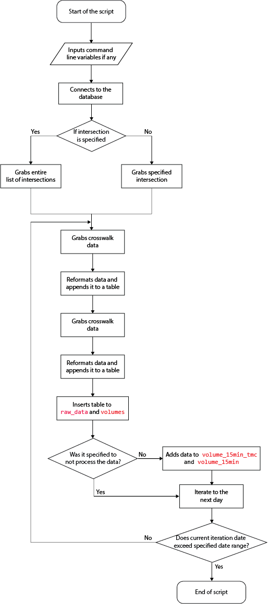

# API Puller

### Overview

The puller can currently grab crosswalk and TMC data from the Miovision API using specified intersections and dates, upload the results to the database and aggregates data to 15 minute bins. The puller can support date ranges longer than 48 hours. The output is the same format as existing csv dumps sent by miovision.

### API Key

Emailed from Miovision. Keep it secret. Keep it safe.

### Relevant calls

Each of these returns a 1-minute aggregate, maximum 48-hrs of data, with a two-hour lag (the end time for the query cannot be more recent than two-hours before the query).

### Input Parameters

#### Turning Movement Count (TMC)

Every movement through the intersection except for pedestrians.

Response:

```json
[
  {
    "class": {'type': "string", 'desc': "Class of vehicle/bike"},
    "entrance": {'type':"string", 'desc': "Entrance leg, e.g. 'N'"},
    "exit": {'type':"string",'desc': "Exit leg, e.g. 'W'"},
    "qty": {'type':"int", 'desc': "Count of this movement/class combination"}
  }
]
```

#### Turning Movement Count (TMC) Crosswalks

Crosswalk Counts

```json
[
  {
    "class": {'type': "string", 'desc':"They're all pedestrian"},
    "crosswalkSide": {'type':"string", 'desc': "Intersection leg the crosswalk is on"},
    "direction": {'type':"string",'desc': "ClockWise (CW) or CounterCW (CCW)"},
    "qty": {'type':"int", 'desc': "Count"}
  }
]
```

Through the API, the script converts it to a table like this:

**study\_id**|**study\_name**|**lat**|**lng**|**datetime\_bin**|**classification**|**entry\_dir\_name**|**entry\_name**|**exit\_dir\_name**|**exit\_name**|**movement**|**volume**|
:-----:|:-----:|:-----:|:-----:|:-----:|:-----:|:-----:|:-----:|:-----:|:-----:|:-----:|:-----:|
 ||King / University|43.647653|-79.384844|2018-04-20 17:22:00+00|WorkVan|S| |N| |thru|1|
 ||King / University|43.647653|-79.384844|2018-04-20 17:22:00+00|Bus|W| |E| |thru|1|
 ||King / University|43.647653|-79.384844|2018-04-20 17:22:00+00|Bus|E| |W| |thru|1|
| |King / University|43.647653|-79.384844|2018-04-20 17:23:00+00|Light|W| |E| |thru|3|
 ||King / University|43.647653|-79.384844|2018-04-20 17:23:00+00|Light|S| |E| |right|1|
 ||King / University|43.647653|-79.384844|2018-04-20 17:23:00+00|Light|S| |N| |thru|9|
 ||King / University|43.647653|-79.384844|2018-04-20 17:23:00+00|Light|N| |E| |left|1|
 ||King / University|43.647653|-79.384844|2018-04-20 17:23:00+00|Light|N| |S| |thru|12|
 ||King / University|43.647653|-79.384844|2018-04-20 17:23:00+00|Light|E| |N| |right|1|
 ||King / University|43.647653|-79.384844|2018-04-20 17:24:00+00|Light|S| |N| |thru|11|

which is somewhat similar to the csv dumps given from miovision. The goal of the api is to match the formatting as much as possible. 

### Error responses


```json
[
    {400: "The provided dates were either too far apart (the limit is 48 hours) or too recent (queries are only permitted for data that is at least 2 hours old)."},
    {404: "No intersection was found with the provided IDs."}
]
```

There is also a currently unkown `504` error. The script has measures (which have not been tested) to handle this error, but if the data cannot be pulled, retrying will successfully pull the data. The script has the capapbility to pull specific intersections.

### Input Files

|File|Description|
|-----|-----|
`intersection_id.csv`| Lists all intersection names, their intersection IDs to input into the puller, and the lat/lng.
`config.cfg`|Configuration file that contains database credentials and the api key.

`config.cfg` has the following format:

```
[API]
key=your api key
[DBSETTINGS]
host=10.160.12.47
dbname=bigdata
user=database username
password=database password
```

### How to run the api

In command prompt, navigate to the folder where the python file is located and run `python intersection_tmc.py run_api`. This will collect data from the previous day as the default date range.

The script can also customize the data it pulls and processes with various command line options.

For example, to collect data from a custom date range, run `python intersection_tmc.py run_api --start=YYYY-MM-DD --end=YYYY-MM-DD`. The start and end variables will indicate the start and end date to pull data from the api.

`start` and `end` must be separated by at least 1 day, and `end` cannot be a future date. Specifying `end` as today will mean the script will pull data until the start of today (Midnight, 00:00). 

#### Command Line Options

|Option|Format|Description|Example|Default|
|-----|-------|-----|-----|-----|
|start|YYYY-MM-DD|Specifies the start date to pull data from|2018-08-01|The previous day|
|end|YYYY-MM-DD|Specifies the end date to pull data from|2018-08-05|Today|
|intersection|integer|Specifies the `intersection_uid` from the `miovision.intersections` table to pull data for|12|Pulls data for all intersection|
|path|path|Specifies the directory where the `config.cfg` file is|`C:\Users\rliu4\Documents\GitHub\bdit_data-sources\volumes\miovision\api`|`config.cfg` is located in the same directory as the `intersection_tmc.py` file.|
|pull|string|Specifies if the script should only pull data and not process the data|Yes|Processes data in PostgreSQL

`python intersection_tmc.py --start=2018-08-01 --end=2018-08-05 --intersection=12 --path=C:\Users\rliu4\Documents\GitHub\bdit_data-sources\volumes\miovision\api --pull=Yes` is an example with all the options specified.

## Classifications

The classification given in the api is different than the ones given in the csv dumps, or the datalink. 

### Exisiting Classification (csv dumps and datalink)

|classification_uid|classification|location_only|class_type|
|-----|-----|-----|-----|
1|Lights|f|Vehicles
2|Bicycles|f|Cyclists
3|Buses|f||
4|Single-Unit Trucks|f|Vehicles
5|Articulated Trucks|f|Vehicles
6|Pedestrians|t|Pedestrians
7|Bicycles|t|Cyclists

### API Classifications

|classification_uid|classification|location_only|class_type|
|-----|-----|-----|-----|
1|Light|f|Vehicles
2|Bicycle|f|Cyclists
3|Bus|f||
4|SingleUnitTruck|f|Vehicles
5|ArticulatedTruck|f|Vehicles"
6|Pedestrian|t|Pedestrians"
8|WorkVan|f|Vehicles"

### How the API works

This flow chart provides a high level overview:




```python
import sys
import json
from requests import Session
from requests import exceptions
import datetime
import pytz
import dateutil.parser
import psycopg2
from psycopg2.extras import execute_values
from psycopg2 import connect, Error
import logging
import configparser
import click
from time import sleep

class MiovisionAPIException(Exception):
    """Base class for exceptions."""
    pass
  
class TimeoutException(Exception):
    """Exception if API gives a 504 error"""
    pass
```

Base class for errors not specified by the modules.

```python
def logger():
    
    logger = logging.getLogger(__name__)
    logger.setLevel(logging.DEBUG)
    formatter=logging.Formatter('%(asctime)s     	%(levelname)s    %(message)s', datefmt='%d %b %Y %H:%M:%S')
    file_handler = logging.FileHandler('logging.log')
    file_handler.setFormatter(formatter)
    logger.handlers.clear()
    stream_handler=logging.StreamHandler()
    stream_handler.setFormatter(formatter)
    logger.addHandler(file_handler)
    logger.addHandler(stream_handler)
        
    with open('logging.log', 'w'):
        pass
    return logger

logger=logger()
logger.debug('Start')
time_delta = datetime.timedelta(days=1)
default_start=str(datetime.date.today()-time_delta)
default_end=str(datetime.date.today())
local_tz=pytz.timezone('US/Eastern')
session = Session()
session.proxies = {'https': 'https://137.15.73.132:8080'}
url='https://api.miovision.com/intersections/'
tmc_endpoint = '/tmc'
ped_endpoint='/crosswalktmc'

```

Defines the logger setting, default dates, timezone, and site to grab the data from.

```
python

CONTEXT_SETTINGS = dict(
    default_map={'run_api': {'flag': 0}}
)

@click.group(context_settings=CONTEXT_SETTINGS)
def cli():
    pass

@cli.command()
@click.option('--start', '--start_date', default=default_start, help='format is YYYY-MM-DD for start date')
@click.option('--end' ,'--end_date', default=default_end, help='format is YYYY-MM-DD for end date')
@click.option('--path' ,'--path', default='config.cfg', help='defines the path of the config file')
@click.option('--intersection' ,'--intersection', default=0, help='intersection id of the intersection to pull data from')
@click.option('--pull' ,'--pull', default=None, help='specifies whether to process data or not')
def run_api(start_date, end_date, path, intersection, pull):

    
    start_date= dateutil.parser.parse(str(start_date))
    end_date= dateutil.parser.parse(str(end_date))
    start_time=local_tz.localize(start_date)
    end_time=local_tz.localize(end_date)
    logger.info('Pulling from %s to %s' %(str(start_date),str(end_date)))
    pull_data(start_time, end_time, intersection, path, pull)

```

Defines the command line options for the click module. Once it processes the options, it calls the `pull_data` function. 

```python
def get_movement(item):
    if (item['entrance'] == 'N' and item['exit'] =='S'):
        return 'thru'
    elif item['entrance'] == 'S' and item['exit'] =='N':
        return 'thru'
    elif item['entrance'] == 'W' and item['exit'] =='E':
        return 'thru'
    elif item['entrance'] == 'E' and item['exit'] =='W':
        return 'thru'
    elif item['entrance'] == 'S' and item['exit'] =='W':
        return 'left'
    elif item['entrance'] == 'N' and item['exit'] =='E':
        return 'left'
    elif item['entrance'] == 'W' and item['exit'] =='N':
        return 'left'
    elif item['entrance'] == 'E' and item['exit'] =='S':
        return 'left'
    elif item['entrance'] == 'S' and item['exit'] =='E':
        return 'right'
    elif item['entrance'] == 'E' and item['exit'] =='N':
        return 'right'
    elif item['entrance'] == 'N' and item['exit'] =='W':
        return 'right'
    elif item['entrance'] == 'W' and item['exit'] =='S':
        return 'right'
    else:
        return 'u_turn'
        
```
Function to turn the movements given by the api to a format supported by the SQL queries. 

```python

def get_intersection_tmc(table, start_date, end_iteration_time, intersection_id1, intersection_name, lat, lng, key):
    headers={'Content-Type':'application/json','Authorization':key}
    params = {'endTime': end_iteration_time, 'startTime' : start_date}
    response=session.get(url+intersection_id1+tmc_endpoint, params=params, 
                         headers=headers, proxies=session.proxies)
    if response.status_code==200:
        tmc=json.loads(response.content.decode('utf-8'))
        for item in tmc:
            
        
            item['classification']=item.pop('class')
            item['volume']=item.pop('qty')
            item['movement']=get_movement(item)
            
            item['entry_dir_name']=item.pop('entrance')
            item['exit_dir_name']=item.pop('exit')
            temp=[intersection_name, lat, lng, item['timestamp'], item['classification'], item['entry_dir_name'],  item['exit_dir_name'],  item['movement'], item['volume']]
            table.append(temp)

        return table
    elif response.status_code==404:
        error=json.loads(response.content)
        logger.error(error['error'])
    elif response.status_code==400:
        error=json.loads(response.content)
        logger.error(error['error'])
    elif response.status_code==504:
        raise TimeoutException('Error'+str(response.status_code))
    else:
        raise MiovisionAPIException('Error'+str(response.status_code))
        sys.exit()

def get_pedestrian(table, start_date, end_iteration_time, intersection_id1, intersection_name, lat, lng, key):
    headers={'Content-Type':'application/json','Authorization':key}
    params = {'endTime': end_iteration_time, 'startTime' : start_date}
    
    response=session.get(url+intersection_id1+ped_endpoint, params=params, 
                         headers=headers, proxies=session.proxies)
    if response.status_code==200:
        ped=json.loads(response.content.decode('utf-8'))
        for item in ped:
            
            item['classification']=item.pop('class')
            item['volume']=item.pop('qty')
            temp=str(item['direction'])
            item.pop('direction', None)
            item['movement']=temp.lower()
            item['entry_dir_name']=item.pop('crosswalkSide')
            item['exit_dir_name']=None
            temp=[intersection_name, lat, lng, item['timestamp'], item['classification'], item['entry_dir_name'],  item['exit_dir_name'],  item['movement'], item['volume']]
            table.append(temp)
            
        return table
    elif response.status_code==404:
        error=json.loads(response.content)
        logger.error(error['error'])
        
    elif response.status_code==400:
        error=json.loads(response.content)
        logger.error(error['error'])
    elif response.status_code==504:
        raise TimeoutException('Error'+str(response.status_code))
    else:
        raise MiovisionAPIException('Error'+str(response.status_code))
        sys.exit()
        
```
The two functions above grab the vehicular movements, and the crosswalk movements. The logic is largely similar between the two functions. Once the required variables is fed into the function, it gabs the data, which is outputed as a list of dictionaries. To input it into the databse, the function creates a table that it continuously appends to. In addition, the data is reformatted by changing the headings, changing the movements, and populating the intersection names/lat/longs. The functions will raise an exception if it receive error codes from the api. 

```python
def pull_data(start_date, end_date, intersection, path, pull):
    time_delta = datetime.timedelta(days=1)
    end_iteration_time= start_date + time_delta        
    
    CONFIG = configparser.ConfigParser()
    CONFIG.read(path)
    api_key=CONFIG['API']
    key=api_key['key']
    dbset = CONFIG['DBSETTINGS']
    conn = connect(**dbset)
    logger.debug('Connected to DB')
    while True:
        table=[]
        if intersection>0:
            with conn:
                with conn.cursor() as cur:
                    string="SELECT * from miovision.intersection_id WHERE intersection_uid ="+str(intersection)
                    cur.execute(str(string))
                    intersection_list=cur.fetchall()
                    conn.commit()
        else:      
            with conn:
                with conn.cursor() as cur:
                    select='''SELECT * from miovision.intersection_id;'''
                    cur.execute(select)
                    intersection_list=cur.fetchall()
                    conn.commit()
```

Grabs the intersection list and ids from `miovision.intersection_id`to send to the api. If a specific intersection is specified, it will only select that intersection to pull data for.

```python
        for intersection_list in intersection_list:
            intersection_id1=intersection_list[1]
            intersection_name=intersection_list[2]
            lat=str(intersection_list[3])
            lng=str(intersection_list[4])
            logger.debug(intersection_name+'     '+str(start_date))
            for attempt in range(3):
                try:
                    table=get_intersection_tmc(table, start_date, end_iteration_time, intersection_id1, intersection_name, lat, lng, key)
                    table=get_pedestrian(table, start_date, end_iteration_time, intersection_id1, intersection_name, lat, lng, key)
                    break
                except exceptions.ProxyError as prox:
                    logger.error(prox)
                    logger.warning('Retrying in 2 minutes')
                    sleep(120)
                except exceptions.RequestException as err:
                    logger.error(err)
                    sleep(60)
                except TimeoutException as exc_504:
                    logger.error(exc_504)
                    sleep(60)
                except MiovisionAPIException as miovision_exc:
                    logger.error('Cannot pull data')
                    logger.error(miovision_exc)
                    #sleep(60)
                
        logger.info('Completed data pulling for {}'.format(start_date))
        
```

Calls the two function to pull the TMC and the pedestrian data. It will iterate through the intersections in `miovision.intersection_id` and repeatedly call the two functions that grab data. If an error is raised it will attempt to grab the data 2 more times after 1 or 2 minutes before skipping that intersection and moving on to the next intersection. After it pulls one day of data, it inserts the data to `raw_data` and `volumes`. If not otherwise specified, the script will aggregate the volumes into TMC and ATR formats. The script calls SQL functions which makes it easy to adjust the functions without changing the python script. If more than 1 day of data is specified, the script will repeath the entire process until it reaches the end date, at whole day increments.

```python
        try:
            with conn:
                with conn.cursor() as cur:
                    execute_values(cur, 'INSERT INTO miovision_api.raw_data (study_name, lat, lng, datetime_bin, classification, entry_dir_name, exit_dir_name,  movement, volume) VALUES %s', table)
                    conn.commit()
            logger.info('Inserted into raw data') 

        except psycopg2.Error as exc:
            
            logger.exception(exc)
            with conn:
                    conn.rollback()
            sys.exit()
        if pull is None:
            try:
                with conn:
                    with conn.cursor() as cur: 
                        insert='''
            SELECT miovision_api.aggregate_15_min_tmc_new()'''
                        cur.execute(insert)
                        conn.commit()
                        logger.info('Aggregated to 15 minute bins')   
                with conn:
                    with conn.cursor() as cur:             
                        cur.execute('''SELECT miovision_api.aggregate_15_min();''')
                        conn.commit()
                        logger.info('Completed data processing for {}'.format(start_date))
               
            except psycopg2.Error as exc:
                
                logger.exception(exc)
                with conn:
                        conn.rollback()
                sys.exit()
        else:
            logger.info('Data Processing Skipped') 
        start_date+=time_delta
        end_iteration_time= start_date + time_delta
        if start_date>=end_date:
            break
    #views()
    logger.info('Done')
    

if __name__ == '__main__':
    cli()
    
```
