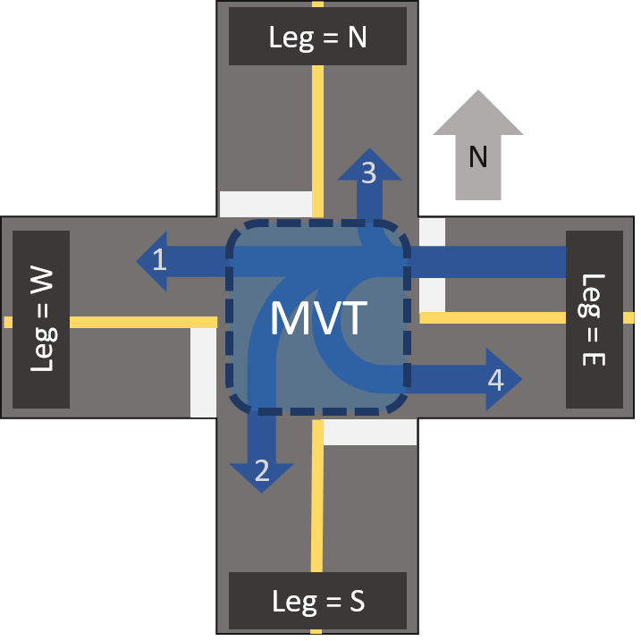
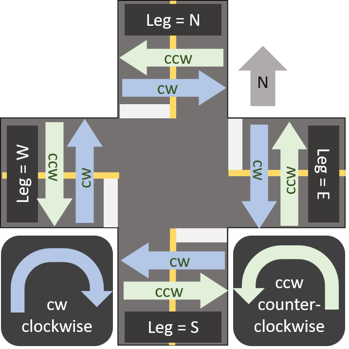
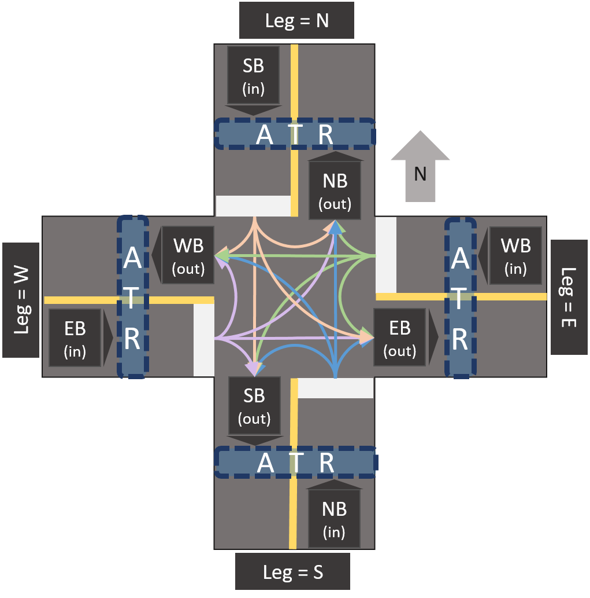
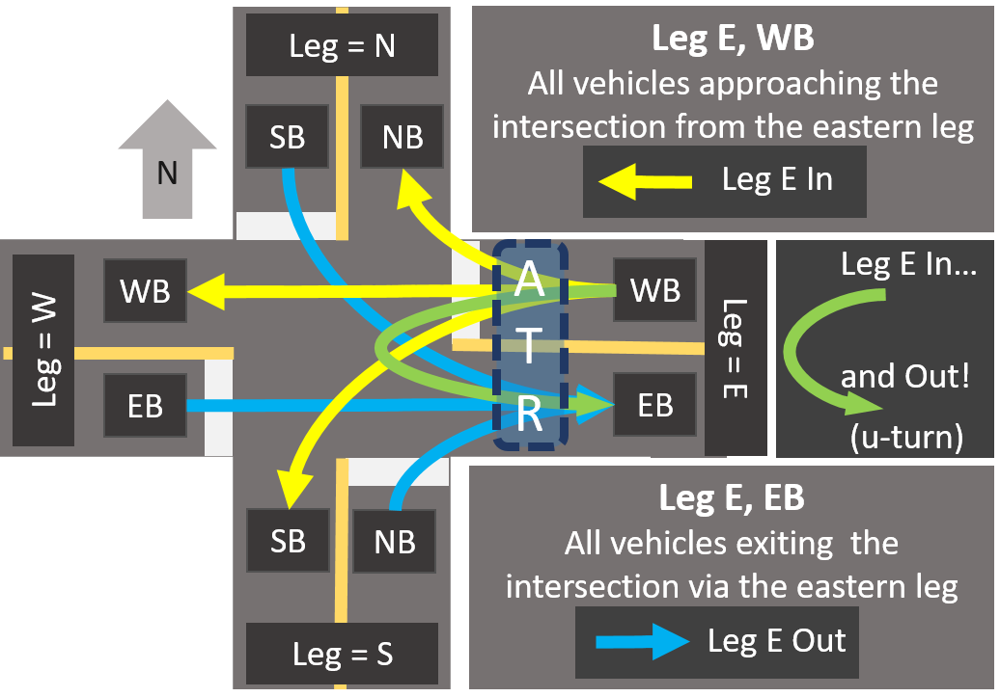
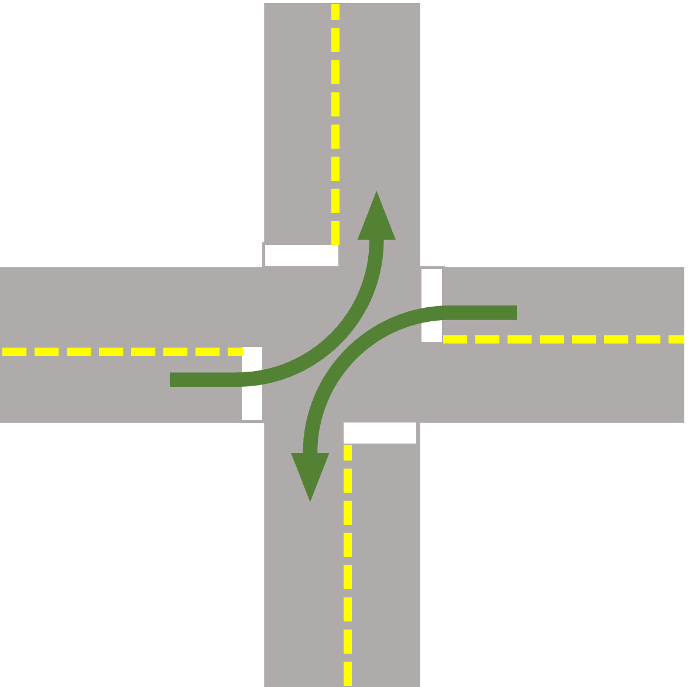
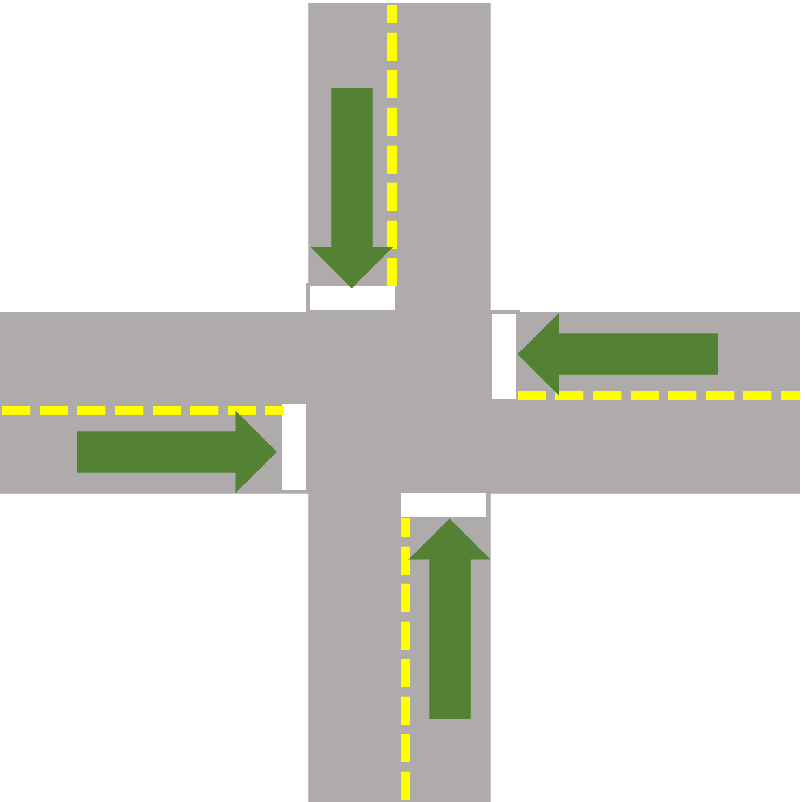
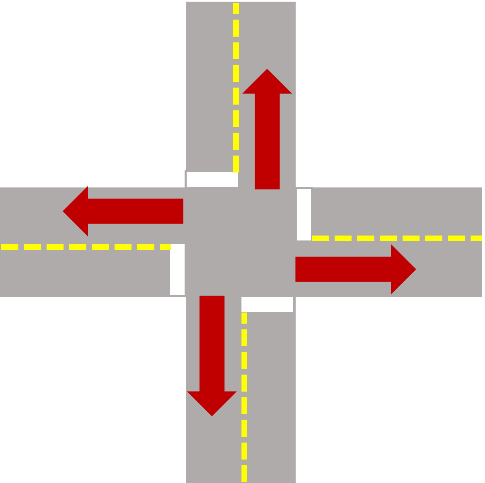
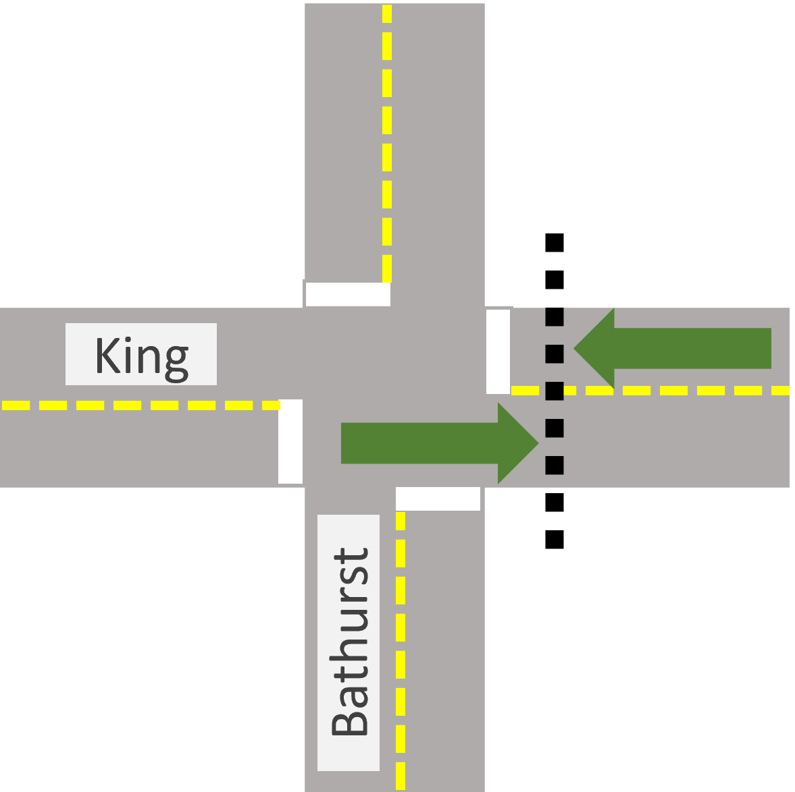

# Getting Started

- [Getting Started](#getting-started)
  - [Where should I look for data?](#where-should-i-look-for-data)
  - [Where do I find info about data quality?](#where-do-i-find-info-about-data-quality)
  - [Understanding Legs, Movement and Direction of Travel](#understanding-legs-movement-and-direction-of-travel)
    - [Vehicle Movements](#vehicle-movements)
    - [Pedestrian Movement](#pedestrian-movement)
    - [From Movement Counts to Segment Counts](#from-movement-counts-to-segment-counts)
    - [All the East Leg Crossings!](#all-the-east-leg-crossings)
      - [Comparing TMC and ATR Counts](#comparing-tmc-and-atr-counts)
  - [See it in Code!](#see-it-in-code)
    - [Scenario 1: Left Turns from a Specific Street](#scenario-1-left-turns-from-a-specific-street)
    - [Scenario 2: Total Volume at an Intersection](#scenario-2-total-volume-at-an-intersection)
    - [Scenario 3: Volume Counts Across a Screenline](#scenario-3-volume-counts-across-a-screenline)
  - [Important Things to Remember](#important-things-to-remember)
    - [Data Accuracy Dates by Mode](#data-accuracy-dates-by-mode)
    - [Use `classification_uid = 10` for cyclists](#use-classification_uid--10-for-cyclists)

## Where should I look for data?

After identifying relevant intersection_uids in [`miovision_api.intersections`](sql/readme.md#intersections), you can look to the following **filtered** aggregations:

| View Name                                | Time bins  | Aggregation Style | Excludes days with `anomalous_ranges`* | Excludes hours with `unacceptable_gaps`** | Date Time Column | Use for |
|------------------------------------------|------------|-------------------|-------------------------------------|---------------------------------------|-------------------------|---------|
| [miovision_api.volumes_daily](sql/readme.md#miovision_apivolumes_daily)              | 1 day      | By day / classification     | X                                   |      | `dt` | Prefiltering days with reasonable data. |
| [miovision_api.volumes_15min_mvt_filtered](sql/readme.md#volumes_15min_mvt) | 15 minutes | TMC               | X                                   | X                                     | `datetime_bin` | 15 minute or hourly TMC aggregations | 
| [miovision_api.volumes_15min_filtered](sql/readme.md#volumes_15min)    | 15 minutes | ATR               | X                                   | X                                     | `datetime_bin` | 15 minute or hourly ATR aggregations |
 
\*`anomalous_range`: manual or automatically labelled date ranges of unusual or zero volumes.  
\*\*`unacceptable_gaps`: short periods of at least 5 minutes with zero volumes across all modes which are assumed to be camera outages.  

## Where do I find info about data quality?

**`miovision_api.anomalous_ranges`**

This table contains date ranges of zero volumes, or suspicious low/high volumes. Zero volumes ranges are automated by a daily Airflow process, while other suspicious data is labelled manually by a dbadmin. If you want to avoid suspicious data altogether, use the filtered views mentioned above. 
Anomalous ranges may apply to:
- an entire intersection
- specific intersection + classification
- specific intersection + classification + leg

If you find suspicious looking data, contact a Miovision dbadmin to record this as a new anomalous_range and for follow up with Miovision!

## Understanding Legs, Movement and Direction of Travel

The Miovision data table that we receive tracks information about:
1. where the vehicle / pedestrian / cyclist entered the intersection, 
2. mode used (see the classification table), and, 
3. how the vehicle / pedestrian / cyclist moved through the intersection (see the movements table).

Movement is tracked differently for vehicles (including bicycles) and pedestrians.

### Vehicle Movements

Vehicle movement is quite straightforward - upon approaching an intersection, a vehicle may proceed straight through, turn left, turn right or perform a U-turn (aka the Uno Reverse Card of driving).

Here is a diagram that shows the all vehicle movements from the eastern leg of an intersection:


You may have noticed that there are two entries for bicycles in the `classifications` table - one for turning movement counts (aka `classification_uid = 2`) and one for bicycle entrances and exits (aka `classification_uid = 10`). There are also entries in the `movements` table that represent bicycle entries and exits.  

### Pedestrian Movement

Pedestrian movements are measured less intuitively than vehicle movements. The leg on which pedestrians' movement is tracked is the leg they are crossing. Their movement is tracked using clockwise ("cw") or counterclockwise ("ccw") directions (POV: you're in freefall above the intersection, looking down at it). So, a pedestrian crossing the eastern leg of an intersection in the clockwise direction would be walking south.

Here is a diagram that shows the pedestrian movements at an intersection:


### From Movement Counts to Segment Counts

We are able to transform vehicle movements into segment volume counts, which are commonly referred to as "Across The Road" or ATR counts. The full process is described below. Conceptually:
- the movement tables track volume at a point in the centre of an intersection, while,
- the ATR table tracks volume as it crosses a line. A typical "t" intersection has 4 lines - one for each of the road segments that lead to and from an intersection.

To complicate matters even more, the 4 lines across the road segments leading to and from an intersection are further subdivided by direction - so the east leg of an intersection has an eastbound direction and a westbound direction.

Here's a diagram to visualize all of those directions and legs:


Vehicles crossing the line on the east leg, while travelling west, are entering the intersection.

Vehicles crossing the line on the east leg, while travelling east, are exiting the intersection. They may be:
- travelling straight through the intersection from the west leg,
- turning left onto the east leg from the north leg,
- turning right onto the east leg from the south leg,
- u-turning from the east leg right back onto that east leg.

### All the East Leg Crossings!
Still fuzzy? Here's a diagram to help you picture it perfectly:


#### Comparing TMC and ATR Counts

The following example illustrates the differences between the TMC counts found in `volumes_15min_mvt` and `volumes_15min`.

For light vehicles at King / Bay on 2020-10-15 9:00-9:15 (`intersection_uid = 17`, `datetime_bin = '2020-10-15 09:00:00'`, `classification_uid = 1`), the TMC and ATR movements are:

|leg(tmc)|movement_uid|volume|
|--------|------------|------|
| E | 1 | 13  |
| E | 2 | 0   |
| E | 3 | 5   |
| N | 1 | 82  |
| N | 2 | 0   |
| N | 3 | 1   |
| S | 1 | 144 |
| S | 2 | 0   |
| S | 3 | 0   |
| W | 1 | 12  |
| W | 2 | 2   |
| W | 3 | 9   |
| | |total volume = 268|

|leg(atr)|dir|volume|
|--------|---|------|
| E | EB | 12  |
| E | WB | 18  |
| N | NB | 151 |
| N | SB | 83  |
| S | NB | 144 |
| S | SB | 91  |
| W | EB | 23  |
| W | WB | 14  |
| | |total volume = 536|

The ATR table exactly double-counts the number of vehicles travelling through intersections, since it counts vehicles approaching and exiting the intersection. For example, `leg(atr) = E` and `dir = EB` represents vehicles exiting the intersection, and `leg(atr) = E` and `dir = WB` represents vehicles approaching the intersection.

**It is important to note that pedestrian counts (`classification_uid` = 6 and `movement_uid` IN (5, 6)) in the TMC and ATR tables have an equal number of rows and equal total volume - they are not double counted like vehicles (including bicycles).**

**In the TMC table (aka `volumes_15min_mvt`)**
The `leg` represents the side of the intersection that the pedestrian is crossing. Pedestrian movements are tracked using `movement_uid` 5 or 6 (clockwise or counterclockwise, respectively). [This diagram](#Pedestrian-Movement) will help you visualize the clockwise and counterclockwise movements.

**In the ATR table (aka `volumes_15min`)** 
The `leg` represents the side of the intersection that the pedestrian is crossing. The `dir` represents which direction they are walking towards. So, if leg = N and dir = EB means that the pedestrian is at the North crosswalk crossing from the west side to the east side.

## See it in Code!

This section contains some common request examples and code snippets that will help you meet tight deadlines. 

### Scenario 1: Left Turns from a Specific Street

This example calculates the volume of light vehicles making left turns at a specific intersection (King and Bathurst) from an east-west street (King). Since movement is important, the TMC table (`miovision_api.volumes_15min_mvt`) is used.

Here's what it looks like:


Here's the corresponding code snippet:
```
SELECT
    SUM(volume) 
FROM miovision_api.volumes_15min_mvt
WHERE 
    intersection_uid = 10 -- 10 = King and Bathurst
    AND movement_uid = 2 -- 2 = left turns
    AND leg IN ('E', 'W') -- entering the intersection on King
    AND datetime_bin >= '2020-03-06' 
    AND datetime_bin < '2020-03-13'
    AND classification_uid = 1 -- light vehicles
```

### Scenario 2: Total Volume at an Intersection

This example calculates the volume of light vehicles passing through an intersection (King and Bathurst) in all directions. Since movement is irrelevant, the ATR table (`miovision_api.volumes_15min`) is used. Vehicles should be counted only once, when they approach the intersection.

Here's what it looks like:



Here's the corresponding code snippet:

```
SELECT
    SUM(volume) 
FROM miovision_api.volumes_15min
WHERE 
    intersection_uid = 10 -- 10 = King and Bathurst
    AND leg != left(dir, 1) -- count approaches only
    AND classification_uid = 1 -- light vehicles
    AND datetime_bin >= '2020-03-13' 
    AND datetime_bin < '2020-03-20'
```
If `leg <> dir` is eliminated from the `WHERE` clause, light vehicles will be counted:
1) as they approach the intersection, AND,
2) as they exit the intersection!

If, for some strange reason, you need to count vehicles exiting an intersection, you can replace `leg <> dir` with `leg = dir`.

Here's what that looks like:



### Scenario 3: Volume Counts Across a Screenline

This example calculates the volume crossing an imaginary line (or screenline) across a road, in both directions (for example, all vehicles travelling along King Street at a point east of Bathurst.

Here's what it looks like:



Here's the corresponding code snippet:

```
SELECT
    SUM(volume) FILTER (WHERE dir = 'EB') AS eb_volume,
    SUM(volume) FILTER (WHERE dir = 'WB') AS wb_volume
FROM miovision_api.volumes_15min
WHERE 
    intersection_uid = 10 -- King and Bathurst
    AND leg = 'E' -- The screenline is on the east leg, so we only want counts from there
    AND datetime_bin >= '2020-03-13' 
    AND datetime_bin < '2020-03-20'
```

## Important Things to Remember

There are a few important caveats to keep in mind when working with Miovision data, relating to data accuracy and classifications.

### Data Accuracy Dates by Mode

Data quality is always improving. The dates below represent the earliest dates with good data quality by mode:
- September 2019 for bikes
- June 2019 for pedestrians
- January 2019 for vehicles

### Use `classification_uid = 10` for cyclists

The `miovision_api.classifications` table has two entries for cyclists: `classification_uid = 2` and `classification_uid = 10`.

`classification_uid = 2` is used to track cyclist movements (left turns, right turns, u-turns and through movements).

`classification_uid = 10` is used to track cyclist entrances (or approaches).

At this time, `classification_uid = 2` does not appear to accurately capture cyclist movements, so do not use `classification_uid = 2` for cyclists - use `classification_uid = 10`.
