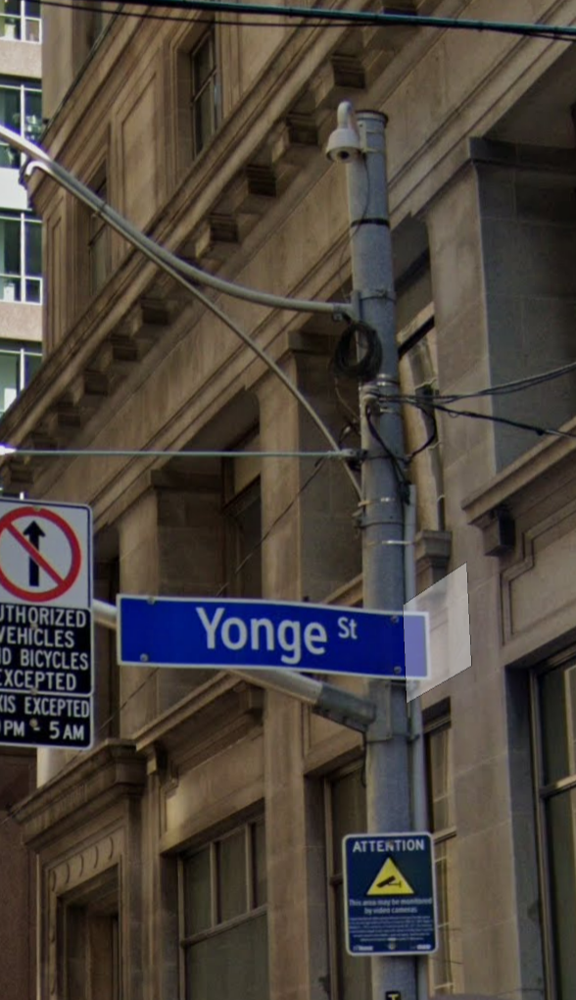

# Miovision - Multi-modal Permanent Video Counters <!-- omit in toc -->

## Table of Contents <!-- omit in toc -->

- [Introduction](#introduction)
- [What do they count?](#what-do-they-count)
- [Where are they?](#where-are-they)
- [When were they installed?](#when-were-they-installed)
- [Where can I access the data?](#where-can-i-access-the-data)
- [Limitations](#limitations)
- [Folder Structure](#folder-structure)

## Introduction

The City of Toronto employs [Miovision Trafficlink Cameras](https://miovision.com/trafficlink/) to continuously monitor vehicle (including transit), bicycle, and pedestrian volumes at intersections across the city in an automated way. Miovision extracts volumes using Computer Vision AI from the camera footage and provides volume counts in aggregated 1 minute bins to the City via an API.

The program was initiated to support the King Street Transit Pilot by analysing the trends in volume on King Street, trends in volume on surrounding roads, and thru movement violations of the pilot. An example of how it was used to support the pilot project can be found [here](https://www.toronto.ca/wp-content/uploads/2018/08/9781-KSP_May-June-2018-Dashboard-Update.pdf). Today the program continues to be expanded to monitor traffic at key locations around the city.  

  

## What do they count?

The data extracted from Miovision's API includes: 
- Datetime aggregated to 1-minute bins
- Type of user ([classification](sql/readme.md#classifications)): Auto / Truck / Transit / Bicycle / Pedestrian
- Count of users
- Intersection entrance leg: N / S / E / W
- Type of ([movement](sql/readme.md#movements)):
  - Non-pedestrian: Through / Left / Right / U-Turn
  - Pedestrians: Clockwise / Counterclockwise

## Where are they?

You can see the locations of Miovision cameras on [this map](geojson/mio_intersections.geojson), noting the `date_installed` and `date_decomissioned` attributes for details on data availability. 

## When were they installed?

- In 2017, 32 cameras were installed along King St and surrounding streets to monitor effects of the King Street Transit Pilot. 8 of these cameras were decommissioned in 2020.  
- In 2020, 26 cameras were installed, primarily to monitor the effects of ActiveTO projects along Bloor, Danforth, University, Brimley, Huntingwood, and Faywood.  
- In 2021, 10 additional cameras were installed, with 6 on Jane and Sheppard and 3 downtown along various bike projects.  
- In fall 2023 and into winter 2024, a large expansion is underway, including 21 new cameras to create a cordon around downtown (generally Bathurst / Dupont / Don Valley), 10 new cameras to monitor traffic related to the SRT closure in Scarborough, and 4 new cameras along Bloor West.  

## Where can I access the data?
Internally to the Transportation Data & Analytics team, data is stored in the `bigdata` RDS. For data automatically collected since January 2019, see the `miovision_api` schema and related documentation [here](sql/readme.md#2-table-structure). More limited data for the King Street Pilot from 2017 and 2018 can be found in the `miovision_csv` schema, which has a slightly different structure than the API data. 

## Limitations
The data quality for the automatically processed API data stream (not including the King St Pilot study data from pre-2019 which was processed independently) is evolving, but the below rules are general guidelines for when the data became reliable to use:
- January 2019 for cars
- June 2019 for pedestrians
- Bike counts are still considered in development by Miovision in 2024 and should only used internally by D&A with extreme caution, or on analysis delivered by D&A. Any external sharing will be on a case by case basis depending on the purpose of the request.

Internal users can see additional detail on limitations for individual intersections and classifications in the `miovision_api.anomalous_ranges` table.

## Folder Structure

- [`getting_started`](getting_started.md) - This document contains an introduction for new users on `Understanding Legs, Movement and Direction of Travel` and some sample SQL queries. 
- [`sql`](sql/) - Information on the database structure used for storing Miovision data and scripts for producing tables.
- [`api`](api/) - Scripts and documentation for accessing the Miovision API. The Airflow DAGs are also described here.  
- [`update_intersections`](update_intersections/) - Contains up-to-date instructions for adding (or removing) new intersections to the database.
- [`csv`](csv/) - tracks baseline volumes and gaps.
- [`dev_notebooks`](dev_notebooks/) - Jupyter Notebooks for development and testing.
- [`geojson`](geojson/) - Contains a publicly accessible map of Miovision cameras.
- [`img`](img/) - Contains images used in explanatory docs like this!
- [`Archive`](archive.md) - This document contains information that has been deleted from the Miovision readmes. 
