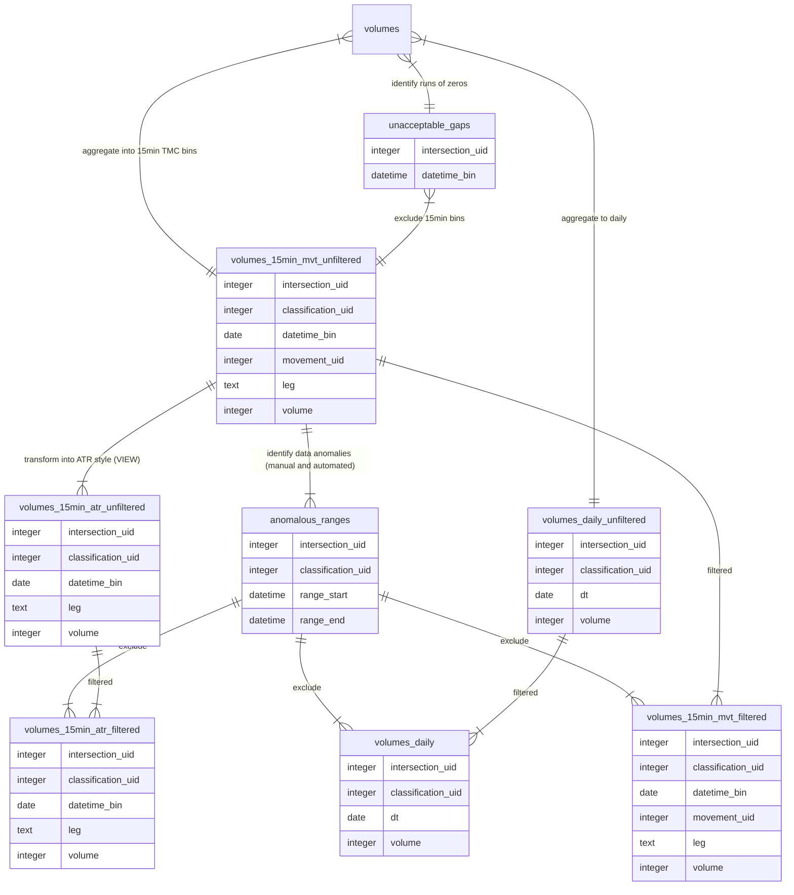

<!-- TOC -->

- [2. `miovision_api` Table Structure](#2-miovision_api-table-structure)
  - [Key Tables](#key-tables)
    - [`intersections`](#intersections)
    - [`classifications`](#classifications)
    - [`movements`](#movements)
    - [`volumes`](#volumes)
  - [Aggregated Data](#aggregated-data)
    - [`volumes_15min_mvt`](#volumes_15min_mvt)
    - [`volumes_15min_atr_filtered`](#volumes_15min_atr_filtered)
    - [`miovision_api.volumes_daily`](#miovision_apivolumes_daily)
    - [`unacceptable_gaps`](#unacceptable_gaps)
    - [`gapsize_lookup`](#gapsize_lookup)
  - [Reference Tables](#reference-tables)
    - [`miovision_api.breaks`](#miovision_apibreaks)
    - [`miovision_api.anomalous_ranges`](#miovision_apianomalous_ranges)
    - [`miovision_api.open_issues`](#miovision_apiopen_issues)
    - [`miovision_api.anomaly_investigation_levels` and `miovision_api.anomaly_problem_levels`](#miovision_apianomaly_investigation_levels-and-miovision_apianomaly_problem_levels)
    - [`movement_map`](#movement_map)
    - [`periods`](#periods)
    - [`intersection_movements`](#intersection_movements)
    - [`centreline_miovision`](#centreline_miovision)
    - [`alerts`](#alerts)
    - [camera\_details](#camera_details)
    - [configuration\_updates](#configuration_updates)
  - [Primary and Foreign Keys](#primary-and-foreign-keys)
    - [List of primary and foreign keys](#list-of-primary-and-foreign-keys)
  - [Other Tables](#other-tables)
- [PostgreSQL Functions](#postgresql-functions)
  - [Aggregation Functions](#aggregation-functions)
  - [Clear Functions](#clear-functions)
  - [Helper Functions](#helper-functions)
  - [Partitioning Functions](#partitioning-functions)
  - [Deprecated Functions](#deprecated-functions)
- [3. Finding Gaps and Malfunctioning Camera](#3-finding-gaps-and-malfunctioning-camera)
  - [Part I - Unacceptable Gaps](#part-i---unacceptable-gaps)
  - [Part II - Working Machine](#part-ii---working-machine)
  - [Identifying Questionable Data Quality](#identifying-questionable-data-quality)
    - [An applied example](#an-applied-example)
    - [Identifying new anomalies](#identifying-new-anomalies)

<!-- /TOC -->
This folder contains sql scripts used in both the API and the old data dump process. The [`csv_data/`](csv_data/) sub-folder contains `sql` files unique to processing the data from csv dumps.

# 2. `miovision_api` Table Structure

## Key Tables 

  - [Key Tables](#key-tables)
    - [`intersections`](#intersections)
    - [`classifications`](#classifications)
    - [`movements`](#movements)
    - [`volumes`](#volumes)
  - [Aggregated Data](#aggregated-data)
    - [`volumes_15min_mvt`](#volumes_15min_mvt)
    - [`volumes_15min_atr_filtered`](#volumes_15min_atr_filtered)
    - [`miovision_api.volumes_daily`](#miovision_apivolumes_daily)
    - [`unacceptable_gaps`](#unacceptable_gaps)
    - [`gapsize_lookup`](#gapsize_lookup)

### `intersections`

Reference table for each unique intersection at which data has been collected, you can also see them [on this map.](../geojson/mio_intersections.geojson):

**Field Name**|**Data Type**|**Description**|**Example**|
:-----|:-----|:-----|:-----|
intersection_uid|integer|Unique identifier for table|10|
id|text|Unique id from Miovision API|990cd89a-430a-409a-b0e7-d37338394148|
intersection_name|text|Intersection short name in format of [E / W street] / [N / S street]|King / Bathurst|
date_installed|date|Installation date of the camera (date of the first available timestamp)|2017-10-03|
date_decommissioned|date|Decommissioned date of the camera (date of the last available timestamp)|NULL|
lat|numeric|Latitude of intersection location|43.643945|
lng|numeric|Longitude of intersection location|-79.402667|
street_main|text|Name of primary street|King|
street_cross|text|Name of secondary street|Bathurst|
int_id|bigint|int_id linked to centrelines|13467722|
px|integer|px linked to traffic lights|201|
geom|geometry|Point geometry of that intersection|0101000020E61000006B0BCF4BC5D953C01CB62DCA6CD24540|
n_leg_restricted|boolean|Whether that leg is restricted to vehicles|NULL|
e_leg_restricted|boolean|Whether that leg is restricted to vehicles|NULL|
s_leg_restricted|boolean|Whether that leg is restricted to vehicles|NULL|
w_leg_restricted|boolean|Whether that leg is restricted to vehicles|NULL|
api_name|text|Intersection name from API|Bathurst Street and King Street West|

### `classifications`

Reference table for all classifications:

**Field Name**|**Data Type**|**Description**|**Example**|
:-----|:-----|:-----|:-----|
classification_uid|serial|Unique identifier for table|2|
classification|text|Textual description of mode|Bicycles|
location_only|boolean|If TRUE, represents movement on crosswalk (as opposed to road)|FALSE|
class_type|text|General class category (Vehicles, Pedestrians, or Cyclists)|Cyclists|

Here is a description of the classification_uids and corresponding types. 
Note that bicycles are available at both a turning movement level and at an approach level. Approach level bicycle counts (`classification_uid = 10`) should be used for the large majority of applications as the data is considered more accurate.

| classification_uid | classification   | location_only | class_type    | definition / notes |
|--------------------|------------------|---------------|---------------|--------------------------------------------------------------------------------------------------------------------------------------------------------------------------------------------------------------------------------------------------------------------------------------------------------------------------------|
| 1                  | Light            | false         | "Vehicles"    | Cars and other passenger vehicles (like vans, SUVs or pick-up trucks) |
| 2                  | Bicycle          | false         | "Cyclists"    | do not use - poor data quality. Tracks bicycle turning movements |
| 3                  | Bus              | false         |               | A large vehicle that provides transportation for many  humans. Since 2019-08-22 this includes streetcars, however initially  they were classified under 9, MotorizedVehicle.<br>**Note:** This classification is excluded from "Vehicles" `class_type` because transit vehicle volumes are irrelevant to most of our analyses. |
| 4                  | SingleUnitTruck  | false         | "Vehicles"    | A truck that has a non-detachable cab and trailer system |
| 5                  | ArticulatedTruck | false         | "Vehicles"    | A truck that has a detachable cab and trailer system |
| 6                  | Pedestrian       | true          | "Pedestrians" | A walker. May or may not include zombies... |
| 7                  | Bicycle          | true          | "Cyclists"    | Bicycle in crosswalk. Same movement_uids as 6, Pedestrian. Unclear if it is necessarily being walked or ridden. This movement is exlcuded from aggregate tables. |
| 8                  | WorkVan          |               |               | A van used for commercial purposes Workvan classification was folded in to "Light" vehicles in the API. |
| 9                  | MotorizedVehicle | false         | "Vehicles"    | Miscellaneous vehicles. Prior to 2019-08-22 this included streetcars. |
| 10                 | Bicycle          | false         | "Cyclists"    | The preferred bike classification. Tracks bicycle entrances and exits passing through manually drawn zones on the SmartSense overlay. Exits are exlcuded from aggregate tables. This classification is only  available from 2021-07-11 on. Bicycle data is not great - stay tuned. |

### `movements`

Reference table for road user movements:

**Field Name**|**Data Type**|**Description**|**Example**|
:-----|:-----|:-----|:-----|
movement_uid|integer|Identifier representing current turning movement|1|
movement_name|text|Short description of movement|thru|
crosswalk_movement|boolean|Whether the movement describes pedestrians on crosswalks|false|
movement_pretty_name|text|Long description of movement|Through|

Here is a description of the movement_uids and corresponding types:

**movement_uid**|**movement_pretty_name**|**definition**|
:-----|:-----|:-----|
1|Through|Vehicle drove through the intersection (no turns)|
2|Left|Vehicle turned left|
3|Right|Vehicle turned right|
4|U-Turn|Vehicle went back from whence it came - usually excluded from counts|
5|Clockwise|Pedestrian (or bike in crosswalk) proceeded clockwise around the intersection (a pedestrian on the north leg going clockwise would be heading eastbound)|
6|Counter Clockwise|Pedestrian (or bike in crosswalk) proceeded counter clockwise around the intersection (a pedestrian on the north leg going counter clockwise would be heading westbound)|
7|Bicycle Entrance|Used to determine where bicycles entered the intersection. Although typically only used for bicycles, [special detection zones set up to monitor TTC right-of-way intrusion](https://github.com/CityofToronto/bdit_data-sources/issues/960) also used movement_uid = 7. |
8|Bicycle Exit|Used to determine where bicycles exited the intersection|

### `volumes`

Data table storing all 1-minute observations in its **transformed** form. Records represent total 1-minute volumes for each [intersection]-[classification]-[leg]-[turning movement] combination.  
Partitioned by year and month using declarative partitioning.  

**Field Name**|**Data Type**|**Description**|**Example**|
:-----|:-----|:-----|:-----|
volume_uid|serial|Unique identifier for table|5100431|
intersection_uid|integer|Identifier linking to specific intersection stored in `intersections`|31|
datetime_bin|timestamp without time zone|Start of 1-minute time bin in EDT|2017-10-13 09:07:00|
classification_uid|text|Identifier linking to specific mode class stored in `classifications`|1|
leg|text|Entry leg of movement|E|
movement_uid|integer|Identifier linking to specific turning movement stored in `movements`|2|
volume|integer|Total 1-minute volume|12|
volume_15min_mvt_uid|serial|Unenforced foreign key to [`volumes_15min_mvt`](#volumes_15min_mvt) The foreign key constraint was removed to support partitioning. |14524|

- A *Unique constraint* exists on `miovision_api.volumes` based on `intersection_uid`, `datetime_bin`, `classification_uid`, `leg`, and `movement_uid`.

## Aggregated Data

Data are aggregated from 1-minute volume data into two types of 15-minute volume products: Turning Movement Count (TMC) [(in `volumes_15min_mvt`)](#volumes_15min_mvt) and Automatic Traffic Recorder (ATR) [(in `volumes_15min_atr_filtered`)](#volumes_15min_atr_filtered) equivalents. Have a look at [Understanding Legs, Movement and Direction of Travel in `getting_started.md`](../getting_started.md#understanding-legs-movement-and-direction-of-travel) for a visual explanation of the differences between the two tables. The diagram below briefly describes the flow of data between key aggregate tables. 



### `volumes_15min_mvt`
**(Use view `volumes_15min_mvt_filtered` to exclude anomalous_ranges)**

`volumes_15min_mvt` contains data aggregated into 15 minute bins. In order to make averaging hourly volumes simpler, the volume can be `NULL` (for all modes) or `0` for classifications 1, 2, 6, 10 (which corresponds to light vehicles, bicycles (classifications 2 and 10) and pedestrians).

The 1-min data do not identify if a camera is malfunctioning, so gaps in data could either mean there was no volume, or that the camera malfunctioned. Because we have continuous data from these counters, we no longer try to interpolate
data during gaps. When our heuristics identify `unacceptable_gaps`, then the entire hour of data is thrown out and the volume is set to `NULL` to imply that the data has been processed for this hour, but the results have been discarded.

A `0` value implies the process identifies the camera was working, but there was no volume for that mode. Only volumes for pedestrians, cyclists and light vehicles (`classification_uid IN (1,2,6,10)`) are filled in because those are the modes we report on more frequently. Other modes are not filled because they have much lower volumes, so the 0s would expand the size of the dataset considerably.

The [`aggregate_15_min_mvt()`](function/function-aggregate-volumes_15min_mvt.sql) function performs zero-filling by cross-joining a table containing all possible movements described in ([`intersection_movements`](#intersection_movements)). The only type of movement tracked in the 1-minute volume data, but not the aggregated data, is bicycle exits (`classification_uid = 10 and movement_uid = 8`). The vendor recommended that bicycle exits not be used due to data quality concerns.

**Field Name**|**Data Type**|**Description**|**Example**|
:-----|:-----|:-----|:-----|
volume_15min_mvt_uid|integer|Unique identifier for table from sequence `miovision_api.volumes_15min_mvt_volume_15min_mvt_uid_seq`. |14524|
intersection_uid|integer|Identifier linking to specific intersection stored in `intersections`|31|
datetime_bin|timestamp without time zone|Start of 15-minute time bin in EDT|2017-12-11 14:15:00|
classification_uid|text|Identifier linking to specific mode class stored in `classifications`|1|
leg|text|Entry leg of movement|E|
movement_uid|integer|Identifier linking to specific turning movement stored in `movements`|2|
volume|integer|Total 15-minute volume|78|
processed|boolean| Flag if data has been aggregated to `miovision_15min`| TRUE

**Please note that movements for vehicles (including bicycles) are different than those for pedestrians.**

Please see [this diagram](../getting_started.md#Vehicle-Movements) for a visualization of turning movements for vehicles (including bicycles) and [this diagram](../getting_started.md#Pedestrian-Movement) for a visualization of pedestrian movements.

- A *Unique constraint* was added to `miovision_api.volumes_15min_mvt` table based on `intersection_uid`, `datetime_bin`, `classification_uid`, `leg` and `movement_uid`.

### `volumes_15min_atr_filtered`  
If you need ATR style Miovision data, use VIEW `miovision_api.volumes_15min_atr_filtered` which transforms TMC data from the `_mvt` tables to ATR style (entries and exits) and excludes anomalous_ranges. 

> [!TIP]
> Ensure indices are being applied during queries on this View using F7: Explain. Add WHERE clauses on datetime_bin, intersection_uid, and classification_uid. Otherwise materiailizing the whole view could take hours.  

**ATR movements define leg as the approach direction of vehicles (like TMCs)**,
and **direction as the cardinal direction of traffic travelling through that
side of the intersection**. For a typical '+' intersection, there will be 8
possible ATR since there are 4 legs and 2 directions of travel for each ATR leg.

If you are having trouble picturing it, check out [this
diagram](../getting_started.md#From-Movement-Counts-to-Segment-Counts).

**Field Name**|**Data Type**|**Description**|**Example**|
:-----|:-----|:-----|:-----|
intersection_uid|integer|Identifier linking to specific intersection stored in `intersections`|31|
datetime_bin|timestamp without time zone|Start of 15-minute time bin in EDT|2017-12-11 14:15:00|
classification_uid|text|Identifier linking to specific mode class stored in `classifications`|1|
leg|text|Segment leg of intersection|E|
dir|text|Direction of traffic on specific leg|EB|
volume|integer|Total 15-minute volume|107|

[`miovision_api.movement_map`](#movement_map) is a lookup table used to convert the TMC data to the ATR data. 

### `miovision_api.volumes_daily`

Daily volumes by intersection_uid, classification_uid. Excludes `anomalous_ranges` (use discouraged based on investigations) but does not exclude time around `unacceptable_gaps` (zero volume periods). 
Note the table `volumes_daily_unfiltered` can be used (with caution) to include data labelled as anomalous. 

| Field Name               | Comments                                                                   | Data Type   | Exmple     |
|:-------------------------|:---------------------------------------------------------------------------|:------------|:-----------|
| dt                       |                                                                            | date        | 2023-09-05 |
| intersection_uid         |                                                                            | integer     | 1          |
| classification_uid       |                                                                            | integer     | 1          |
| daily_volume             |                                                                            | integer     | 13830      |
| isodow                   | Use `WHERE isodow <= 5 AND holiday is False` for non-holiday weekdays.     | smallint    | 2          |
| holiday                  |                                                                            | boolean     | False      |
| datetime_bins_missing    | Minutes with zero vehicle volumes out of a total of possible 1440 minutes. | smallint    | 69         |
| unacceptable_gap_minutes | Periods of consecutive zero volumes deemed unacceptable based on avg intersection volume in that hour.                   | smallint    | 0          |
| avg_historical_gap_vol   | Avg historical volume for that classification and gap duration based on averages from a 60 day lookback in that hour.             | integer     |            |


### `unacceptable_gaps`

Data table storing all the hours containing gaps larger than 5-20 minutes (this minimum threshold is set based on `gapsize_lookup`) for each intersection, including those with no data. Generated daily using the `find_gaps(start_date)` function. 
More information can be found at [#3. Finding gaps and malfunctioning camera](#3-finding-gaps-and-malfunctioning-camera). This table is used in the `aggregate_15_min_mvt` function to set any data during unacceptable hours to `null` to prevent it from being included in AVG calculations.

| Field Name                   | Comments                                                                      | Data Type                   | Example              |
|:------------------------------|:------------------------------------------------------------------------------|:----------------------------|:--------------------|
| dt                            | The date for which the function `miovision_api.find_gaps` was run to insert this row.            | date                        | 2023-09-05          |
| intersection_uid              |                                                                               | integer                     | 4                   |
| gap_start                     | The timestamp when the unacceptable gap starts.                               | timestamp without time zone | 2023-09-05 07:57:00 |
| gap_end                       | The timestamp when the unacceptable gap ends.                                 | timestamp without time zone | 2023-09-05 10:18:00 |
| gap_minutes_total             | Duration of gap in minutes (gap_end - gap_start)                              | integer                     | 141                 |
| allowable_total_gap_threshold | The minimum duration of zero volume to be considered an unacceptable gap for this intersection, hour, and day type (weekend/weekday) based on a 60 day lookback and calculated in miovision_api.gapsize_lookup_insert.     | integer                     | 5                   |
| datetime_bin                  | A 15 datetime_bin which falls within the gap, to be used for joining to volumes_15min* tables.                                                            | timestamp without time zone | 2023-09-05 07:45:00 |
| gap_minutes_15min             | The portion of the total gap which falls within the 15 minute bin starting with datetime_bin.            | integer                     | 3                   |

### `gapsize_lookup`

Data table storing a 60 day lookback average hourly volume for each `intersection_uid`, `classification_uid`.
Used to determine the maximum acceptable gap for use in `unacceptable_gaps` table and to determine the average historical volume associated with those gaps by mode. 

| column_name        | Comments                                                                            | data_type   | sample             |
|:-------------------|:------------------------------------------------------------------------------------|:------------|:-------------------|
| dt                 | The date for which `miovision_api.gapsize_lookup_insert` was run to generate this row. The lookback period used to is the 60 days preceeding this date, matching the same day type (weekday/weekend)   | date        | 2023-11-01         |
| intersection_uid   | nan                                                                                 | integer     | 20                 |
| classification_uid | A null classification_uid refers to the total volume for that intersection which is used to determine the gap_tolerance.         | integer     | 5                  |
| hour_bin           | Hour of the day from 0-23.                                                          | smallint    | 18                 |
| weekend            | True if Saturday/Sunday or holiday (based on ref.holiday table).                    | boolean     | False              |
| avg_hour_vol       | The average volume for this hour/intersection/weekend combination based on a 60 day lookback.                  | numeric     | 1.6666666666666667 |
| gap_tolerance      | The minimum gap duration to be considered an unacceptable_gap. Only valid for the overall intersection volume (classification_uid IS NULL).           | smallint    |                    |


## Reference Tables

### `miovision_api.breaks`
The breaks table contains `Moments in time when data collection methods changed in such a way that we would expect clear pre- and post-change paradigms that may not be intercomparable`.

| column_name | Comments | data_type | sample |
| ------ | ----------- | -- |  -- |
| uid    | simple incrementing primary key | serial | 1 |
| intersection_uid | Reference to intersections table. A null intersection_uid refers to all intersections. | integer
| classification_uid | Reference to classifications table. A null classification_uid refers to all classifications. | integer
| break_time | Moment the change takes place | timestamp
| give_or_take | approximate bounds if the precise time is not known | interval
| notes | required description of what changed - be verbose! | text


### `miovision_api.anomalous_ranges`
The `anomalous_ranges` table is used to log issues related to specific intersection / classification combos as identified either by a human or an automated process. See [below](#identifying-questionable-data-quality) for more information and examples of how to use this table. 

| Column | Description |
| ------ | ----------- |
| uid    | simple incrementing primary key |
| intersection_uid | the intersection; `NULL` if applies to all intersections, e.g. an algorithm change |
| classification_uid | the classification; `NULL` if applies to all classifications e.g. a badly misaligned camera |
| range_start | the beginning of the anomalous range in question; may be open-ended (NULL). Inclusive. The precision here is to the second, so if you're unsure about alignment with time bins, it may be best to be conservative with this and extend the range_start slightly _before_ the problem area. |
| range_end | the end of the anomalous range in question; may be open-ended (NULL). Exclusive. The precision here is to the second, so if you're unsure about alignment with time bins, it may be best to be conservative with this and extend the range_end slightly _past_ the problem area. |
| notes | as detailed a description of the issue as reasonably possible; if there are unknowns or investigations in progress, describe them here also |
| investigation_level | references `miovision_api.anomaly_investigation_levels`; indicates the degree to which the issue has been investigated. Is it just a suspicion? Has it been authoritatively confirmed? Etc. |
| problem_level | references `miovision_api.anomaly_problem_levels`; indicates the degree or nature of the problem. e.g. valid with a caveat vs do-not-use under any circumstance |
| leg | Intersection leg which is affected by range. Null refers to all legs. |

### `miovision_api.open_issues`

`open_issues` is a complementary table to `anomalous_ranges`. It is similar to a view of anomalous ranges which are currently open, except it is a table to allow interactive editing in PgAdmin. Each day via Airflow DAG, issues which are no longer active are removed, but the "logged" and "reviewer_notes" columns remain and other columns may be updated. 

| column_name        | data_type   | sample                                                                                                 |
|:-------------------|:------------|:-------------------------------------------------------------------------------------------------------|
| uid                | smallint    | 1797                                                                                                   |
| intersection_uid   | smallint    | 1                                                                                                      |
| intersection_id    | text        | 8184ba7d-a2e3-4a1c-b70f-31da15e7462a                                                                   |
| intersection_name  | text        | Bathurst Street and Adelaide Street West                                                               |
| classification_uid | smallint    | 2                                                                                                      |
| classification     | text        | Bicycle TMC                                                                                            |
| leg                | text        | W                                                                                                      |
| range_start        | date        | 2024-11-20                                                                                             |
| num_days           | integer     | 8                                                                                                      |
| notes              | text        | Zero counts, identified by a daily airflow process running function miovision_api.identify_zero_counts |
| volume             | bigint      |                                                                                                        |
| alerts             | text        |                                                                                                        |
| logged             | boolean     |                                                                                                        |
| reviewer_notes     | text        |                                                                                                        |


### `miovision_api.anomaly_investigation_levels` and `miovision_api.anomaly_problem_levels`
These two tables are used to enforce standardized descriptions in the `investigation_level` and `problem_level` columns of `anomalous_ranges`. 

| Column | Description |
| ------ | ----------- |
| uid    | very short descriptive text; primary key |
| description | full description / documentation of the category; refer directly to these tables for documentation of the available classifications. |

### `movement_map`

Reference table for transforming aggregated turning movement counts (see `volumes_15min_mvt`) into segment-level volumes (see `volumes_15min_atr_filtered`):

**Field Name**|**Data Type**|**Description**|**Example**|
:-----|:-----|:-----|:-----|
movement_uid|integer|Identifier representing current turning movement - see `movements`|1|
leg|text|Intersection leg from which vehicle enters the intersection|E|
entry_dir|text|Direction which vehicle enters the interseciton travelling|WB|
movement|text|Name of the movement, from `movements`|left|
exit_leg|text|Intersection leg from which vehicle exits the intersection. null for movements 5,6,7. |S|
exit_dir|text|Direction which vehicle exits the interseciton travelling. null for movements 5,6,7. |SB|

Here are some example rows from the table:

| movement_uid | movement | leg | entry_dir | exit_leg | exit_dir | description |
|-------------|---------|----|----------|---------|---------|---------|
|            2 | left     | E   | WB        | S        | SB       | Approached intersection from the east leg going west, turned left, exited intersection from the south leg going south. |
|            4 | u_turn   | E   | WB        | E        | EB       | Approached intersection from the east leg going west, u-turned, exited intersection from the east leg going east. |
|            5 | cw       | E   | SB        | null        | null       | A pedestrian entereted the intersection going south on the East crosswalk. There is no exit leg for pedestrian movements. |
|            7 | enter    | E   | WB        | null        | null       | A bike entereted the intersection travelling west from the east leg. There is no exit leg for 'entry' movements. |

For a visual aid in understanding TMC to ATR conversion, see the [getting started readme](../getting_started.md#all-the-east-leg-crossings). 

### `periods`

Reference table for all unique time periods. Used primarily to aggregate 15-minute data for reporting purposes:

**Field Name**|**Data Type**|**Description**|**Example**|
:-----|:-----|:-----|:-----|
period_id|integer|Unique identifier for table|3|
day_type|text|Day type for date filter|[Weekday OR Weekend]|
period_name|text|Textual description of period|14 Hour|
period_range|timerange|Specific start and end times of period|[06:00:00,20:00:00)|
report_flag|boolean|Indicates whether the period is used in a report|true|


### `intersection_movements`

This was created using [`create-table-intersection_movements.sql`](table/create-table-intersection_movements.sql) and is a reference table of all observed movements for each classification at each intersection. This is used in aggregating to the 15-minute TMC's in order to [fill in 0s in the volumes](#volumes_15min_mvt). Subsequently, movements present in the volumes data [which were erroneous](https://github.com/CityofToronto/bdit_data-sources/issues/144#issuecomment-419545891) were deleted from the table. This table will include movements which are illegal, such as left turns at intersections with turn restrictions but not movements like a turn onto the wrong way of a one-way street. It will need to be manually updated when a new location is added.

Since this reference table must be updated every time a new intersection is added, there are several iterations of it. The earliest is `miovision_api.intersection_movements_20200805`; the latest is `intersection_movements_20210712`. Users should use `intersection_movements` and may find their permissions restricted on the dated versions of this table.

**Field Name**|**Data Type**|**Description**|**Example**|
:-----|:-----|:-----|:-----|
 intersection_uid| integer | ID for intersection | 1 |
 classification_uid| integer | Identifier linking to specific mode class stored in `classifications`|1|
 leg| text | Entry leg of movement|E|
 movement_uid| integer | Identifier linking to specific turning movement stored in `movements`|2|

### `centreline_miovision`

This table maps all miovision intersection legs to centreline street segments. It needs to be updated manually using [this script](updates/update-centreline_miovision.sql) when intersections are added. 

**Field Name**|**Data Type**|**Description**|**Example**|
:-----|:-----|:-----|:-----|
centreline_id| numeric | Corresponds to `centreline_id` in `gis_core.centreline` |14016757|
intersection_uid| integer | ID for intersection | 1 |
leg| text | A segment that forms part of a miovision intersection, identified by its location relative to the centre of the intersection|W|

**Known issues:**
- 91: Lakeshore and Spadina - Two centrelines matched to West leg are actually legit. One is for the Gardiner off-ramp (Left turns only) and one is for Lakeshore (Thru + Right). They could be differentiated by movement.
- 78: Bloor and Kingsway is a 4 legged intersection, but the south leg is not in the centreline (private road / cemetery entrance).
- 68: Steeles and Jane, N leg is outside of TO.

### `alerts`

This table contains alerts for Miovision intersections pulled daily from the API by the `pull_alerts` task in the [`miovision_pull` DAG](../api/readme.md#miovision_pull). Both ongoing and closed issues that intersect with the current day are pulled. The alerts can also be found in Miovision Alert emails or in the in the [Miovision One UI](https://miovision.one/intersection-monitoring/#/alerts).  

**Field Name**|**Data Type**|**Description**|**Example**|
:-----|:-----|:-----|:-----|
alert_id | text | A unique id for the alert, from the API. | 75dc5b77-faa4-487e-a3de-a6b11358fdf5 |
intersection_id | text | The intersection id, corresponding to intersections.intersection_id column | c04704a0-e1e2-4101-9c29-6823d0f41c52 |
intersection_uid | integer | The intersection uid, a foreign key referencing intersections.intersection_uid column | 6 |
alert | text | Short text description of the alert. More detail and tips for resolution are available in this [Miovision help article](https://help.miovision.com/s/article/Alert-and-Notification-Types) | PERIPHERAL_UNAVAILABLE |
start_time | timestamp | Start of the alert. | 2024-01-12 10:20:00 | 
end_time | timestamp | Start of the alert. Note when the end_time is null it means the alert is ongoing. | 2024-01-21 15:35:00 | 

Below is an example of how to anti-join the alerts table:
```sql
SELECT ...
FROM miovision_api.volumes AS v
--anti join alerts
LEFT JOIN miovision_api.alerts AS a
    ON a.intersection_uid = v.intersection_uid
    AND v.datetime_bin >= a.start_time
    AND v.datetime_bin < a.end_time
WHERE a.intersection_uid IS NULL
```

### camera_details
This table contains details of Miovision cameras, which we are sometimes required to provide to maintenance. It is updated daily by `miovision_hardware` Airflow DAG. Join to `miovision_api.active_intersections AS ai ON ai.id = camera_details.intersection_id`.  

| column_name     | data_type   | sample                               |
|:----------------|:------------|:-------------------------------------|
| intersection_id | text        | 253a327c-4e4b-4e4e-b3a9-c2c3e7753825 |
| camera_id       | text        | Miovision SmartView 360 NWC          |
| camera_label    | text        | 1ebf4ec0-88fd-49ec-8cf4-3e0ae0af0128 |
| last_seen       | date        | 2024-12-05                           |

### configuration_updates
This table stores the last updated date of Miovision detection configurations. This may be useful at some point in the future to determine for which dates calibration studies are relevant. It was only populated starting 2024-12-05, so the MIN `updated_time` was the most recent update at that point. Further configuration details can be seen in Miovision One.  

| column_name      | data_type                   | sample                     |
|:-----------------|:----------------------------|:---------------------------|
| intersection_uid | integer                     | 97                         |
| updated_time     | timestamp without time zone | 2024-02-23 03:09:36.684000 |

## Primary and Foreign Keys

To create explicit relationships between tables, `volumes`, `volume_15min_mvt`, `atr_mvt_uid` and `volume_15min` have primary and foreign keys. Primary keys are unique identifiers for each entry in the table, while foreign keys refer to a primary key in another table and show how an entry is related to that entry.

### List of primary and foreign keys

* `volumes` has the primary key `volume_uid` and foreign key `volume_15min_mvt_uid` which refers to `volume_15min_mvt`
* `volumes_15min_mvt` has the primary key `volume_15min_mvt_uid`
* `volume_15min` has the primary key `volume_15min_uid` 

The current primary purpose for the keys is so that on deletion, the delete cascades through all tables. The keys also indicate whether it is new data if the foreign key is null, and tells the function to aggregate the data if it is new data. The keys can also be used in selecting data.

## Other Tables

The tables below are produced using functions explained [here](#aggregate_functions). They produce a lookup table of date-intersection combinations to be used for checking purposes or even for formal reporting. They are not used regularly.  

|Table|Purpose|
|------|-------|
|`api_log`|Contains a record of the `start_date` and `end_date` for an `intersection_uid` and when the data was pulled as `date_added`|
|`missing_dates`|Contains a record of the `intersection_uid` and the `dt` that were missing in the `volumes_15min` table, with `period_type` stated|

# PostgreSQL Functions

This section describes the SQL functions in the `miovision_api` schema used to aggregate data and many helper functions including those used to clear data for re-processing and to create partition tables. 

## Aggregation Functions  

| Function | Comment |
|---|---|
| [`aggregate_15_min_mvt(start_date date, end_date date)`](function/function-aggregate-volumes_15min_mvt.sql) | Aggregates valid movements from `miovision_api.volumes` in to `miovision_api.volumes_15min_mvt` as 15 minute turning movement counts (TMC) bins and fills in gaps with 0-volume bins. Also updates foreign key in `miovision_api.volumes`. Takes an optional intersection array parameter to aggregate only specific intersections. Use `clear_15_min_mvt()` to remove existing values before summarizing. |
| [`aggregate_volumes_daily(start_date date, end_date date)`](function/function-aggregate-volumes_daily.sql) | Aggregates data from `miovision_api.volumes_15min_mvt` into `miovision_api.volumes_daily`. Includes a delete clause to clear the table for those dates before any inserts. |
| [`api_log(start_date date, end_date date, intersections integer[])`](function/function-api_log.sql) | Logs inserts from the api to miovision_api.volumes via the `miovision_api.api_log` table. Takes an optional intersection array parameter to aggregate only specific intersections. Use `clear_api_log()` to remove existing values before summarizing. |
| [`find_gaps(start_date date, end_date date)`](function/function-find_gaps.sql) | Find unacceptable gaps and insert into table `miovision_api.unacceptable_gaps`. |  
| [`identify_zero_counts(start_date date)`](function/function-identify-zero-counts.sql) | Identifies intersection / classification (only classification_uids 1,2,6,10) combos with zero volumes for the start_date called. Inserts or updates anomaly into anomalous_range table unless an existing, overlapping, manual entery exists. | 

## Clear Functions  

| Function | Comment |
|---|---|
| [`clear_15_min_mvt(start_date timestamp, end_date timestamp, intersections integer[])`](function/function-clear-volumes_15min_mvt.sql) | Clears data from `miovision_api.volumes_15min_mvt` in order to facilitate re-pulling. `intersections` param defaults to all intersections. |
| [`clear_api_log(_start_date date, _end_date date, intersections integer[])`](function/function-clear-api_log.sql) | Clears data from `miovision_api.api_log` in order to facilitate re-pulling. `intersections` param defaults to all intersections. |
| [`clear_volumes(start_date timestamp, end_date timestamp, intersections integer[])`](function/function-clear-volumes.sql) | Clears data from `miovision_api.volumes` in order to facilitate re-pulling. `intersections` param defaults to all intersections. |

## Helper Functions

| Function | Comment |
|---|---|
| [`find_invalid_movements(start_date timestamp, end_date timestamp)`](function/function-find_invalid_movements.sql) | Used exclusively within `intersection_tmc.py` `insert_data` function to raise notice in the logs about invalid movements. |
| [`get_intersections_uids(intersections integer[])`](function/function-get_intersection_uids.sql) | Returns all intersection_uids if optional `intersections` param is omitted, otherwise returns only the intersection_uids provided as an integer array to intersections param. Used in `miovision_api.clear_*` functions. Example usage: `SELECT miovision_api.get_intersections_uids() --returns all intersection_uids` or `SELECT miovision_api.get_intersections_uids(ARRAY[1,2,3]::integer[]) --returns only {1,2,3}` |  

## Partitioning Functions  

| Function | Comment |
|---|---|
| [`create_mm_nested_volumes_partitions(base_table text, year_ integer, mm_ integer)`](function/function-create_mm_nested_volumes_partitions.sql) | Create a new month partition under the parent year table `base_table`. Only to be used for miovision_api `volumes_15min` and `volumes_15min_mvt` tables. Example: `SELECT miovision_api.create_yyyy_volumes_partition('volumes_15min', 2023)` |
| [`create_yyyy_volumes_15min_partition(base_table text, year_ integer)`](function/function-create_yyyy_volumes_15min_partition.sql) | Create a new year partition under the parent table `base_table`. Only to be used for miovision_api `volumes_15min` and `volumes_15min_mvt` tables. Example: `SELECT miovision_api.create_yyyy_volumes_partition('volumes_15min', 2023)` |
| [`create_yyyy_volumes_partition(base_table text, year_ integer, datetime_col text)`](function/function-create_yyyy_volumes_partition.sql) | Create a new year partition under the parent table `base_table`. Only to be used for miovision_api `volumes` table. Use parameter `datetime_col` to specify the partitioning timestamp column, ie. `datetime_bin`. Example: `SELECT miovision_api.create_yyyy_volumes_partition('volumes', 2023, 'datetime_bin')` |  

## Deprecated Functions

| Function | Comment |
|---|---|
| [`determine_working_machine(start_date date, end_date date)`](function/function-determine_working_machine.sql) | Function no longer in use. Previously used in `check_miovision` DAG to determine if any cameras had gaps larger than 4 hours. See: `miovision_check` DAG `check_gaps` task for new implementation.  |
| `missing_dates(_date date)` | Function no longer in use. Previously used to log dates with missing data to `miovision_api.missing_dates`. |  

# 3. Finding Gaps and Malfunctioning Camera

In order to better determine if a camera is still working, we have decided to use the gaps and islands method to figure where the gaps are (gaps as in the unfilled space or interval between the 1min bins; a break in continuity) and their sizes. There are two parts of this in the whole process.

## Part I - Unacceptable Gaps
The following process is used to determine camera wide data outages and then find out if the gaps are within the acceptable range or not. The timebins exceeding the allowed gap_size will then be inserted an `unacceptable_gaps` table. Finding gaps is important so that we know how reliable the data is for that time period based on past volume and not include those bins found within the unacceptable gaps range.

1. Within `find_gaps` function, the `gapsize_lookup_insert` function is run to populate the table `gapsize_lookup` with acceptable gap sizes based on avg hourly volumes from a 60 day rolling lookback. 
  - The set of acceptable `gap_tolerance` implemented is based on an investigation stated in this [notebook](../dev_notebooks/volume_vs_gaps.ipynb). 
2. Then, the function [`miovision_api.find_gaps`](function-find_gaps.sql) identifies all gaps of data in the table `miovision_api.volumes` and check if they are within the acceptable range of gap sizes or not based on the information from the `gapsize_lookup` table above. Sensors with no data are not identified - these are instead included in `anomalous_ranges` via [`identify_zero_counts` function](function/function-identify-zero-counts.sql).  
3. Unacceptable gaps are cross joined to 15 minute bins and inserted into the table [`miovision_api.unacceptable_gaps`](#unacceptable_gaps). 
4. Based on the `unacceptable_gaps` table, [`aggregate_15min_mvt`](#volumes_15min_mvt) function will not aggregate 1min bins found within within 15 minute periods matching unacceptable_gaps' `datetime_bin`.

## Part II - Working Machine
The following process is to determine if a Miovision camera is still working. It is different from the process above because the gap sizes used above are small and do not say much about whether a camera is still 
working. We roughly define a camera to be malfunctioning if that camera/intersection has a gap greater than 4 hours. This is checked daily by `miovision_check` DAG, task `check_gaps`. A slack notification will be sent if there's at least 1 camera that is not working. The function also returns a list of intersections that are not working and from what time to what time that the gaps happen which is helpful in figuring out what has happened.

## Identifying Questionable Data Quality

The table `miovision_api.anomalous_ranges` is used to flag times and places in the data where counts are potentially questionable, suspicious, or irregular. Sometimes counts are clearly not valid or data are missing, and sometimes counts look very weird but have been investigated and confirmed as valid or subject to some specific caveat. This table helps us track the status of these investigations and their results. 
The basic idea is to identify sections of data (by timerange, intersection, and classification) that have been flagged as suspicious/anomalous for whatever reason, and state what we know about that data-subset in a semi-structured way. This lets us further investigate where that is required and carve out data that has been formally cast into doubt from queries that need only-the-best.

### An applied example

When looking for only "typical" data, you can use filtered views `volumes_daily`, `volumes_15min_filtered`, `volumes_15min_mvt_filtered` which filter out anomalous ranges with an anti-join like so: 

```sql
--anti join anomalous_ranges
LEFT JOIN miovision_api.anomalous_ranges AS ar
    ON ar.problem_level = ANY(ARRAY['do-not-use', 'questionable'])
    AND ar.intersection_uid = v15.intersection_uid
    AND (
        ar.classification_uid = v15.classification_uid
        OR ar.classification_uid IS NULL
    ) AND (
        ar.leg = v15.leg
        OR ar.leg IS NULL
    ) AND v15.datetime_bin >= ar.range_start
    AND (
        v15.datetime_bin <= ar.range_end
        OR ar.range_end IS NULL
    )
WHERE ar.uid IS NULL
```

You may also wish to use `ref.holiday` to filter out holidays. 

```
WHERE
    NOT EXISTS ( -- also exclude official holidays
        SELECT 1 FROM ref.holiday WHERE holiday.dt = v.datetime_bin::date
    )
```

### Identifying new anomalies
The `anomalous_ranges` table is populated in different ways:
  - manually by `miovision_data_detectives` after visual inspection or prompting from an Airflow alert
  - automatically by a [daily script](function/function-identify-zero-counts.sql) which identifys zero volume days by intersection/classification.
    - There is an intention to eventually flag more unusual volumes automagically (see [Issue #630](https://github.com/CityofToronto/bdit_data-sources/issues/630)). 
  - initially some records were added after some manual QC work which can can be found in the [dev_notebooks readme.md](../dev_notebooks/readme.md) (including notebooks and code).
