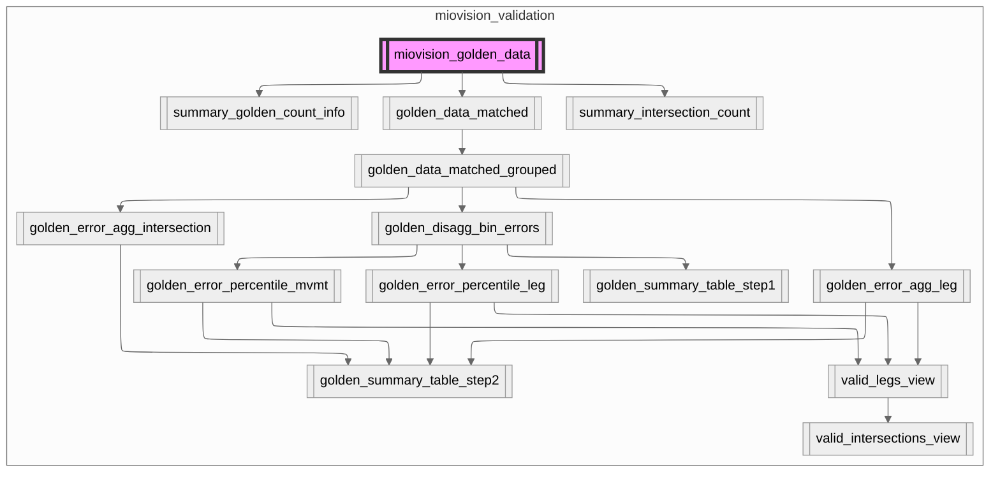
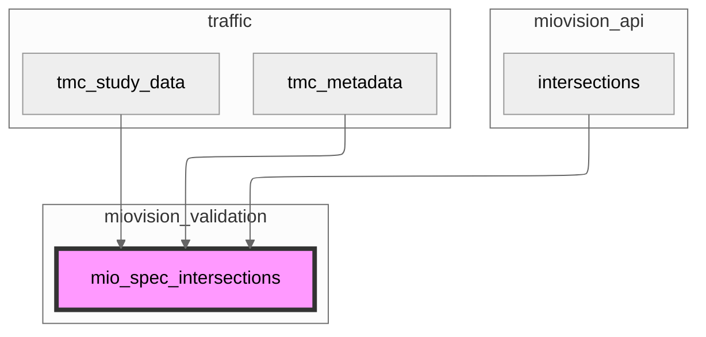
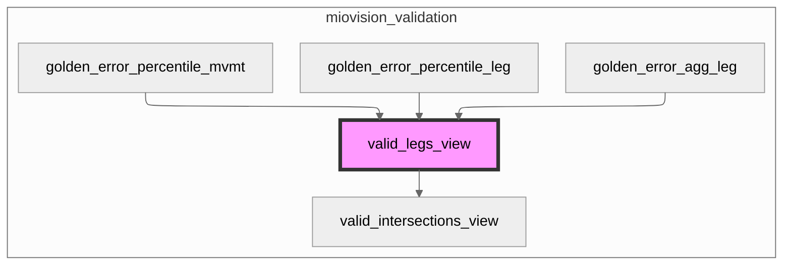
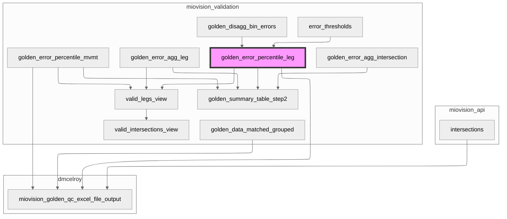

```mermaid
%%{init: {'theme': 'neutral', 'flowchart': {'defaultRenderer': 'elk'}}}%%
flowchart TD
    subgraph miovision_validation
        miovision_validation.summary_golden_count_info[[summary_golden_count_info]]
        miovision_validation.golden_data_matched_grouped[[golden_data_matched_grouped]]
        miovision_validation.golden_summary_table_step1[[golden_summary_table_step1]]
        miovision_validation.golden_summary_table_step2[[golden_summary_table_step2]]
        miovision_validation.miovision_golden_data[[miovision_golden_data]]
        miovision_validation.golden_error_agg_intersection[[golden_error_agg_intersection]]
        miovision_validation.golden_error_percentile_leg[[golden_error_percentile_leg]]
        miovision_validation.valid_legs_view[[valid_legs_view]]
        miovision_validation.golden_error_agg_leg[[golden_error_agg_leg]]
        miovision_validation.valid_intersections_view[[valid_intersections_view]]
        miovision_validation.golden_error_percentile_mvmt[[golden_error_percentile_mvmt]]
        miovision_validation.golden_data_matched[[golden_data_matched]]
        miovision_validation.summary_intersection_count[[summary_intersection_count]]
        miovision_validation.golden_disagg_bin_errors[[golden_disagg_bin_errors]]
    end
    miovision_validation.miovision_golden_data --> miovision_validation.summary_golden_count_info
    miovision_validation.miovision_golden_data --> miovision_validation.summary_intersection_count
    miovision_validation.miovision_golden_data --> miovision_validation.golden_data_matched
    miovision_validation.golden_data_matched --> miovision_validation.golden_data_matched_grouped
    miovision_validation.golden_data_matched_grouped --> miovision_validation.golden_disagg_bin_errors
    miovision_validation.golden_data_matched_grouped --> miovision_validation.golden_error_agg_leg
    miovision_validation.golden_data_matched_grouped --> miovision_validation.golden_error_agg_intersection
    miovision_validation.golden_disagg_bin_errors --> miovision_validation.golden_error_percentile_mvmt
    miovision_validation.golden_disagg_bin_errors --> miovision_validation.golden_error_percentile_leg
    miovision_validation.golden_disagg_bin_errors --> miovision_validation.golden_summary_table_step1
    miovision_validation.golden_error_agg_intersection --> miovision_validation.golden_summary_table_step2
    miovision_validation.golden_error_agg_leg --> miovision_validation.golden_summary_table_step2
    miovision_validation.golden_error_percentile_leg --> miovision_validation.golden_summary_table_step2
    miovision_validation.golden_error_percentile_mvmt --> miovision_validation.golden_summary_table_step2
    miovision_validation.golden_error_agg_leg --> miovision_validation.valid_legs_view
    miovision_validation.golden_error_percentile_leg --> miovision_validation.valid_legs_view
    miovision_validation.golden_error_percentile_mvmt --> miovision_validation.valid_legs_view
    miovision_validation.valid_legs_view --> miovision_validation.valid_intersections_view
        style miovision_validation.miovision_golden_data fill:#f9f,stroke:#333,stroke-width:4px
```


```mermaid
%%{init: {'theme': 'neutral', 'flowchart': {'defaultRenderer': 'elk'}}}%%
flowchart TD
    subgraph miovision_api
        miovision_api.intersections[intersections]
    end
    subgraph traffic
        traffic.tmc_metadata[tmc_metadata]
        traffic.tmc_study_data[tmc_study_data]
    end
    subgraph miovision_validation
        miovision_validation.mio_spec_intersections[mio_spec_intersections]
    end
    miovision_api.intersections ----> miovision_validation.mio_spec_intersections
    traffic.tmc_metadata ----> miovision_validation.mio_spec_intersections
    traffic.tmc_study_data ----> miovision_validation.mio_spec_intersections
        style miovision_validation.mio_spec_intersections fill:#f9f,stroke:#333,stroke-width:4px,color:black
```

```sql
SELECT gwolofs.mermaid_dependency_diagram('miovision_validation', 'valid_legs_view')
```


```mermaid
%%{init: {'theme': 'neutral', 'flowchart': {'defaultRenderer': 'elk'}}}%%
flowchart TD
    subgraph miovision_validation
        miovision_validation.golden_error_percentile_leg[golden_error_percentile_leg]
        miovision_validation.valid_legs_view[valid_legs_view]
        miovision_validation.golden_error_agg_leg[golden_error_agg_leg]
        miovision_validation.valid_intersections_view[valid_intersections_view]
        miovision_validation.golden_error_percentile_mvmt[golden_error_percentile_mvmt]
    end
    miovision_validation.golden_error_agg_leg --> miovision_validation.valid_legs_view
    miovision_validation.golden_error_percentile_leg --> miovision_validation.valid_legs_view
    miovision_validation.golden_error_percentile_mvmt --> miovision_validation.valid_legs_view
    miovision_validation.valid_legs_view --> miovision_validation.valid_intersections_view
        style miovision_validation.valid_legs_view fill:#f9f,stroke:#333,stroke-width:4px,color:black
```


```mermaid
%%{init: {'theme': 'neutral', 'flowchart': {'defaultRenderer': 'elk'}}}%%
flowchart TD
    subgraph miovision_api
        miovision_api.intersections[intersections]
    end
    subgraph dmcelroy
        dmcelroy.miovision_golden_qc_excel_file_output[miovision_golden_qc_excel_file_output]
    end
    subgraph miovision_validation
        miovision_validation.golden_data_matched_grouped[golden_data_matched_grouped]
        miovision_validation.golden_summary_table_step2[golden_summary_table_step2]
        miovision_validation.golden_error_agg_intersection[golden_error_agg_intersection]
        miovision_validation.golden_error_percentile_leg[golden_error_percentile_leg]
        miovision_validation.valid_legs_view[valid_legs_view]
        miovision_validation.golden_error_agg_leg[golden_error_agg_leg]
        miovision_validation.valid_intersections_view[valid_intersections_view]
        miovision_validation.golden_error_percentile_mvmt[golden_error_percentile_mvmt]
        miovision_validation.error_thresholds[error_thresholds]
        miovision_validation.golden_disagg_bin_errors[golden_disagg_bin_errors]
    end
    miovision_validation.error_thresholds --> miovision_validation.golden_error_percentile_leg
    miovision_validation.golden_disagg_bin_errors --> miovision_validation.golden_error_percentile_leg
    miovision_validation.golden_error_agg_intersection --> miovision_validation.golden_summary_table_step2
    miovision_validation.golden_error_agg_leg --> miovision_validation.golden_summary_table_step2
    miovision_validation.golden_error_percentile_leg --> miovision_validation.golden_summary_table_step2
    miovision_validation.golden_error_percentile_mvmt --> miovision_validation.golden_summary_table_step2
    miovision_api.intersections ----> dmcelroy.miovision_golden_qc_excel_file_output
    miovision_validation.golden_data_matched_grouped ----> dmcelroy.miovision_golden_qc_excel_file_output
    miovision_validation.golden_error_percentile_leg ----> dmcelroy.miovision_golden_qc_excel_file_output
    miovision_validation.golden_error_percentile_mvmt ----> dmcelroy.miovision_golden_qc_excel_file_output
    miovision_validation.golden_error_agg_leg --> miovision_validation.valid_legs_view
    miovision_validation.golden_error_percentile_leg --> miovision_validation.valid_legs_view
    miovision_validation.golden_error_percentile_mvmt --> miovision_validation.valid_legs_view
    miovision_validation.valid_legs_view --> miovision_validation.valid_intersections_view
        style miovision_validation.golden_error_percentile_leg fill:#f9f,stroke:#333,stroke-width:4px,color:black
```