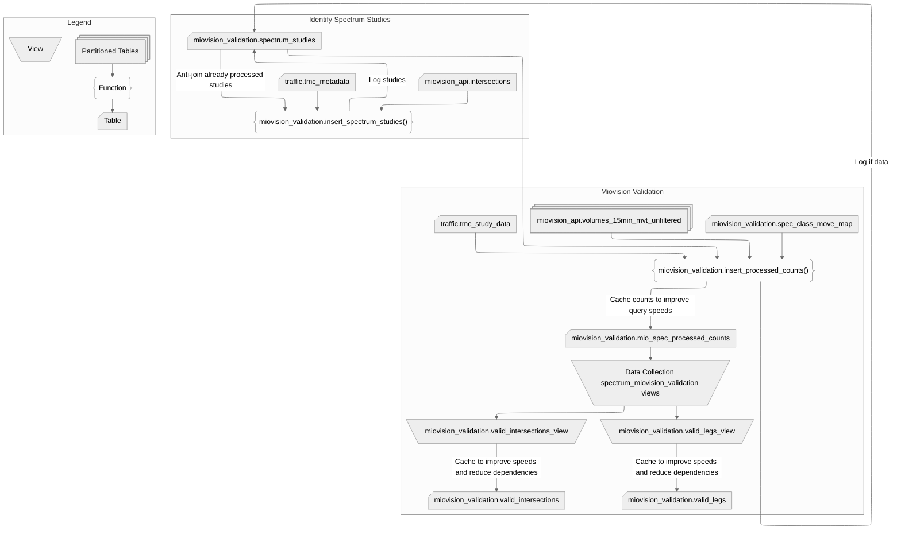

```mermaid
%%{init: {'theme': 'neutral', 'flowchart': {'defaultRenderer': 'elk'}}}%%
flowchart TD

    subgraph "Identify Spectrum Studies"
        insert_spectrum_studies@{ shape: braces, label: "miovision_validation.insert_spectrum_studies()"}
        traffic.tmc_metadata@{ shape: card} --> insert_spectrum_studies
        intersections@{label: "miovision_api.intersections", shape: card}
        insert_spectrum_studies -->|Log studies| miovision_validation.spectrum_studies@{ shape: card}
    end

    subgraph "Miovision Validation"

        v15@{ shape: procs, label: "miovision_api.volumes_15min_mvt_unfiltered" }
        insert_processed_counts@{ shape: braces, label: "miovision_validation.insert_processed_counts()"}
        
        insert_processed_counts -->|Cache counts to improve query speeds| miovision_validation.mio_spec_processed_counts@{ shape: card}
        v15 --> insert_processed_counts
        intersections --> insert_spectrum_studies
        miovision_validation.spectrum_studies --> insert_processed_counts
        miovision_validation.spec_class_move_map@{ shape: card} --> insert_processed_counts
        insert_processed_counts ----> |Log if data| miovision_validation.spectrum_studies
        miovision_validation.mio_spec_processed_counts --> DC_Views@{ shape: manual, label: "Data Collection spectrum_miovision_validation views" }
        DC_Views --> miovision_validation.valid_legs_view@{ shape: manual} --> |Cache to improve speeds and reduce dependencies| miovision_validation.valid_legs@{ shape: card}
        DC_Views --> miovision_validation.valid_intersections_view@{ shape: manual} --> |Cache to improve speeds and reduce dependencies| miovision_validation.valid_intersections@{ shape: card}
        miovision_validation.spectrum_studies -->|Anti-join already processed studies| insert_spectrum_studies
        traffic.tmc_study_data@{ shape: card} --> insert_processed_counts
        
    end

    subgraph Legend
        Partition@{ shape: procs, label: "Partitioned Tables" }
        Table@{ shape: card}
        Function@{ shape: braces, label: Function}
        View@{ shape: manual}        
        Partition --> Function --> Table
    end
```
