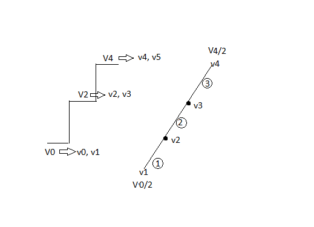
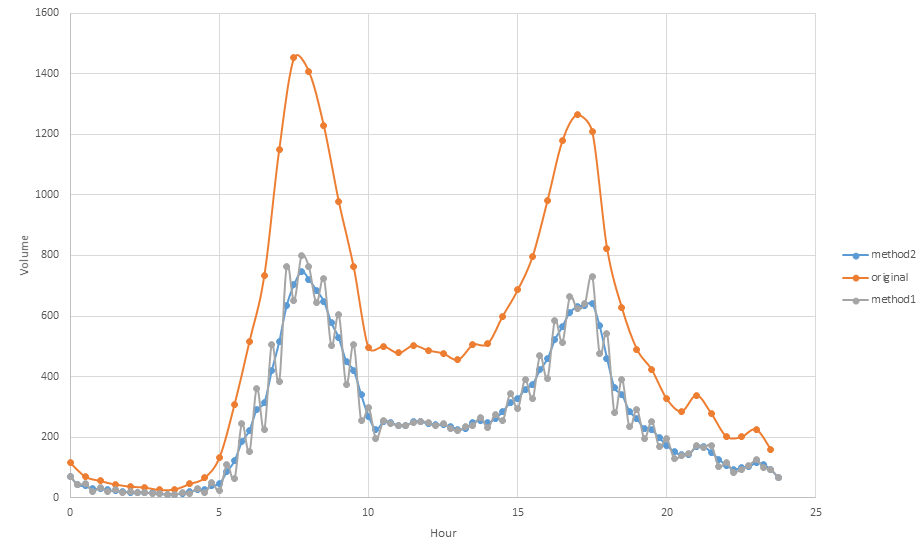

# 400-series highway volume data from the Ministry of Transportation
Detection loops on the 400-series highways are owned and managed by the MTO. We get our data from the University of Toronto's ONE_ITS network. Currently, we are importing 30min aggregate measure from UofT. There is also the possiblity of getting lane-by-lane 20sec data directly from the MTO.

## Uploading MTO data (from ONE-ITS) to database [upload.py](upload.py)
### Packages & Modules & Authentication
1. pandas
2. requests
6. db.cfg (database authentication & API authentication) 

### Usage
1. Make sure the packages and modules and files mentioned above are in the same folder
2. Script defaults to load last calendar month with `python upload.py`, can specify month with `python upload.py --yyyymm 201205`
3. Run the script on the EC2 (doesn't work locally because of firewall restrictions)


### Notes
1. The script assumes that table mto.sensors is up-to-date. If there are new loops, update mto.sensors first.
3. Content in db.cfg should be the following
``` 
    [AUTH]
    username=yourusername
    password=yourpassword
    baseurl=http://one.its.ip/oneits_client/DownloadTrafficReport
	[DBSETTINGS]
	database=bigdata
	host=10.160.12.47
	user=username
	password=password
```
4. Script defaults to pulling data for last calendar month. Can specify month by using argument `--yyyymm 201706` 
5. Logging outputs to stdout, redirect to a file as needed. There will be information on the statuses of operations and the detectors that are not functioning (and there are a couple)

## Converting 30min data to 15min
original data (upper case V):
|Time (index, each increment = 15min)|Volume (original)|Volume(wanted)|
|:--:|:----:|:-----:|
|0|V0|v0|
|1||v1|
|2|V2|v2|
|3||v3|
|4|V4|v4|
|...|...|

The task here is to decompose V0 (30min volume) into v0 and v1 (15min volumes). 
The original plan (method1 in the example below) was to distribute the volume based on the 30min before and after, that is, . However, this method results in cusps during times of rapid growth because the distribution of volume in the half-hour before and after is much more rapid than during the target half-hour.

Implementation (method2 in the example below) in the [script](query-mto-tmc-comparison.sql) by window functions in SQL is based on distributing the growth evenly to the two 15min bins. The principle is illustrated below.



We make the approximation that v1 = V0/2 and v4 = V4/2 when we decompose V2 into v2 and v3. This approximation is far from accurate but our goal is to get a sense of how fast the growth is during the time period and then distribute the growth evenly. This approximation is good enough for that purpose.

Then we want to distribute V2 so that (1) = (2) = (3). The problem becomes

At the ends (first and last half hour of the day), the volume will be distributed evenly to two 15min bins.

An example is shown below for comparison.


