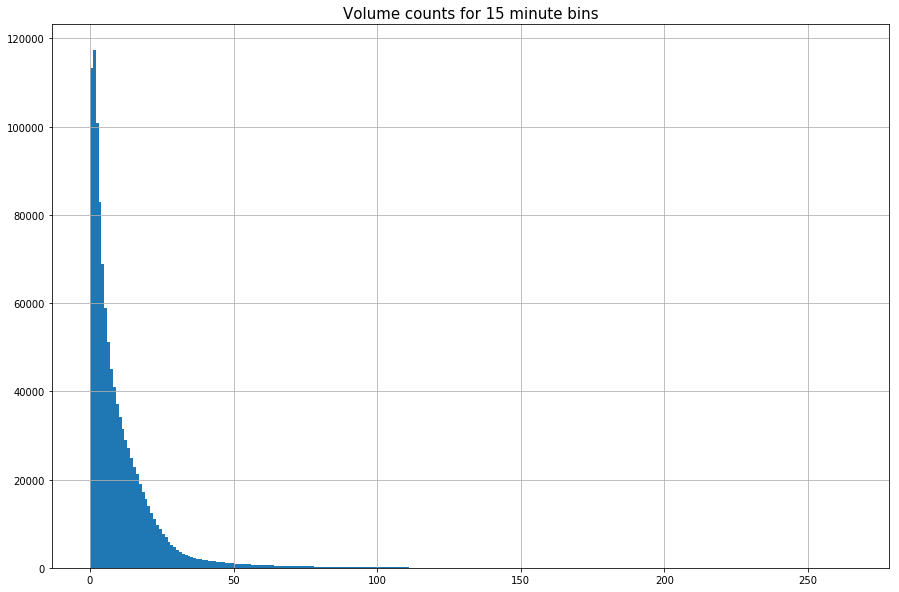
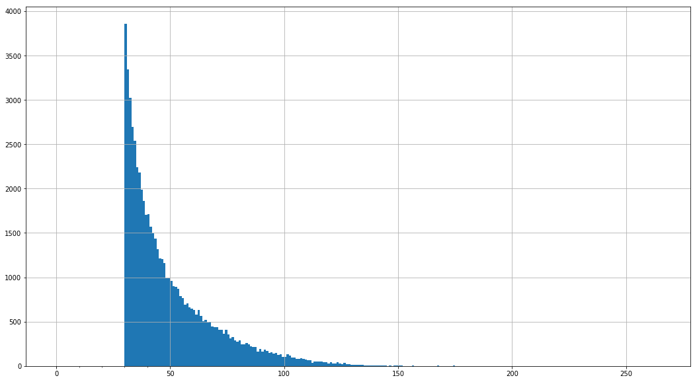
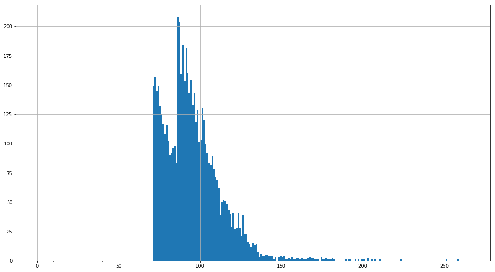

# Automatic Traffic Recorders (ATR) 
# Identifying Extreme Values


```python
from psycopg2 import connect
import configparser
%matplotlib inline
import numpy as np
import pandas as pd
import pandas.io.sql as pandasql
import matplotlib.pyplot as plt
import matplotlib as mpl
import seaborn as sns
import matplotlib.ticker as ticker

CONFIG = configparser.ConfigParser()
CONFIG.read('db.cfg')
dbset = CONFIG['DBSETTINGS']
con = connect(**dbset)

from IPython.display import HTML

def print_table(sql, con):
    return HTML(pandasql.read_sql(sql, con).to_html(index=False))

import datetime
```

## ATR Bikes
## Visualizing the dataset


```python
sql_volumes = '''
SELECT volume_15min
FROM open_data.volumes_atr_bikes
'''
volumes = pandasql.read_sql(sql_volumes, con)
```


```python
bin_val = np.arange(min(volumes['volume_15min']), max(volumes['volume_15min']), 1)

volumes.hist(bins=bin_val, figsize=(15,10))
plt.title('Volume counts for 15 minute bins')
plt.rc('font', size=10)          
plt.rc('axes', titlesize=15)
```





```python
 max(volumes['volume_15min'])
```


    266.0


## Removing outliers from the dataset


```python
sql_volumes = '''
SELECT centreline_id, direction, location, class_type, datetime_bin, volume_15min 
FROM open_data.volumes_atr_bikes
'''

sql_locations = '''
SELECT DISTINCT ON (centreline_id, direction) centreline_id, direction
FROM open_data.volumes_atr_bikes
'''

locations = pandasql.read_sql(sql_locations, con)
volumes = pandasql.read_sql(sql_volumes, con)
```


```python
final_df = pd.DataFrame(columns=['centreline_id', 'direction', 'location', 'class_type', 'datetime_bin', 'volume_15min'])
outliers = pd.DataFrame(columns=['centreline_id', 'direction', 'location', 'class_type', 'datetime_bin', 'volume_15min'])

for row in locations.itertuples():
    subset = volumes.loc[ (volumes['centreline_id'] == row.centreline_id) & (volumes['direction'] == row.direction) ]
    p25, p75 = np.percentile(subset['volume_15min'], 25), np.percentile(subset['volume_15min'], 75)
    iqr = p75 - p25

    # calculate outlier cut off 
    # if volume value is not between lower and upper than it will be considered an outlier
    cut_off = iqr*1.5
    lower, upper = int(p25 - cut_off), int(p75 + cut_off)
    # we cannot have a negative traffic volume
    if lower < 0: 
        lower = 0
    
    # identify outliers
    frames = [outliers, subset.loc[(subset['volume_15min'] < lower) | (subset['volume_15min'] > upper)  ]  ]
    outliers = pd.concat(frames)
    
    
    # all records that are not outliers
    frames = [final_df, subset.loc[(subset['volume_15min'] >= lower) & (subset['volume_15min'] <= upper)]  ]
    final_df = pd.concat(frames)

```


```python
# get percentage of total records that are outliers 
(len(outliers.index) / len(volumes.index))*100 
```


    5.501458367927457


```python
# QC checks
print((len(outliers.index) + len(final_df.index)) == len(volumes.index))
```

    True
    


```python
outliers['volume_15min'].hist(bins = np.arange(0, max(outliers['volume_15min']) , 1), figsize = (18, 10))
ax = plt.gca()
minor_ticks = np.arange(0, 50, 10)
major_ticks = np.arange(0, 50, 100)

#ax.set_xticks(major_ticks, labels=[major_ticks])
ax.set_xticks(minor_ticks, minor=True)
```


    [<matplotlib.axis.XTick at 0x1cdeb080>,
     <matplotlib.axis.XTick at 0xcb7bd30>,
     <matplotlib.axis.XTick at 0x1cce37f0>,
     <matplotlib.axis.XTick at 0x1cdf1cc0>,
     <matplotlib.axis.XTick at 0xe0046d8>]





In this case, the outliers are all higher values. However, these values do not seem very extreme and could potentially be attribiuted to the large variation of volumes across times of days and months. 

Investigate some of the larger outliers to see if they occur during rush hour, and see how much of the outliers in general occur during rush hour. I am checking if they occur during rush hour because there is generally higher volumes of traffic during rush hour. If most of the outliers with high volumes do not occur at rush hour, it may be evidence to prove that they are in fact extreme values (and vice versa).


```python
# get all outliers that happen at rush hour with high (over 100) volumes
subset_outlier_over100 = outliers.loc[(outliers['volume_15min'] > 100) & ( (outliers['datetime_bin'].dt.hour == 9) 
                                                                          | (outliers['datetime_bin'].dt.hour == 8)
                                                                         | (outliers['datetime_bin'].dt.hour == 17)
                                                                         | (outliers['datetime_bin'].dt.hour == 16)
                                                                          | (outliers['datetime_bin'].dt.hour == 18))] 
                                    
# percent of rush hour outliers with volumes over 100 (in comparison to all outliers with values over 100)
(len(subset_outlier_over100.index) / len(outliers.loc[(outliers['volume_15min'] > 100)]))*100
```


    93.80188157166575


```python
# get all outliers that happen at rush hour
subset_outlier_over100 = outliers.loc[( (outliers['datetime_bin'].dt.hour == 9) 
                                                                          | (outliers['datetime_bin'].dt.hour == 8)
                                                                         | (outliers['datetime_bin'].dt.hour == 17)
                                                                         | (outliers['datetime_bin'].dt.hour == 16)
                                                                        | (outliers['datetime_bin'].dt.hour == 18))] 
                                    
# percent of rush hour outliers (in comparison to all outliers)
(len(subset_outlier_over100.index) / len(outliers))*100
```


    66.94279949475894


```python
# get all outliers that do not happen at rush hour with high (over 100) volumes
subset_outlier_over100 = outliers.loc[(outliers['volume_15min'] > 100) & ( (outliers['datetime_bin'].dt.hour != 9) 
                                                                          & (outliers['datetime_bin'].dt.hour != 8)
                                                                         & (outliers['datetime_bin'].dt.hour != 17)
                                                                         & (outliers['datetime_bin'].dt.hour != 16)
                                                                           & (outliers['datetime_bin'].dt.hour != 18))] 
                                    
subset_outlier_over100
#len(subset_outlier_over100.index)
```


<div>
<style>
    .dataframe thead tr:only-child th {
        text-align: right;
    }

    .dataframe thead th {
        text-align: left;
    }

    .dataframe tbody tr th {
        vertical-align: top;
    }
</style>
<table border="1" class="dataframe">
  <thead>
    <tr style="text-align: right;">
      <th></th>
      <th>centreline_id</th>
      <th>class_type</th>
      <th>datetime_bin</th>
      <th>direction</th>
      <th>hour</th>
      <th>location</th>
      <th>month</th>
      <th>volume_15min</th>
    </tr>
  </thead>
  <tbody>
    <tr>
      <th>179531</th>
      <td>8540609</td>
      <td>Cyclists</td>
      <td>1997-11-03 06:15:00</td>
      <td>Eastbound</td>
      <td>6.0</td>
      <td>BLOOR ST BIKE STN E/B W OF CASTLE FRANK CRES</td>
      <td>11.0</td>
      <td>102.0</td>
    </tr>
    <tr>
      <th>612513</th>
      <td>8540609</td>
      <td>Cyclists</td>
      <td>2007-10-12 13:00:00</td>
      <td>Eastbound</td>
      <td>13.0</td>
      <td>BLOOR ST BIKE STN E/B W OF CASTLE FRANK CRES</td>
      <td>10.0</td>
      <td>116.0</td>
    </tr>
    <tr>
      <th>669175</th>
      <td>8540609</td>
      <td>Cyclists</td>
      <td>2010-06-18 15:45:00</td>
      <td>Eastbound</td>
      <td>15.0</td>
      <td>BLOOR ST BIKE STN E/B W OF CASTLE FRANK CRES</td>
      <td>6.0</td>
      <td>106.0</td>
    </tr>
    <tr>
      <th>904589</th>
      <td>8540609</td>
      <td>Cyclists</td>
      <td>2014-04-23 12:15:00</td>
      <td>Eastbound</td>
      <td>12.0</td>
      <td>BLOOR ST BIKE STN E/B W OF CASTLE FRANK CRES</td>
      <td>4.0</td>
      <td>120.0</td>
    </tr>
    <tr>
      <th>57479</th>
      <td>8540609</td>
      <td>Cyclists</td>
      <td>1995-08-16 07:30:00</td>
      <td>Westbound</td>
      <td>7.0</td>
      <td>BLOOR ST BIKE STN W/B W OF CASTLE FRANK CRES</td>
      <td>8.0</td>
      <td>126.0</td>
    </tr>
    <tr>
      <th>108913</th>
      <td>8540609</td>
      <td>Cyclists</td>
      <td>1996-07-30 05:00:00</td>
      <td>Westbound</td>
      <td>5.0</td>
      <td>BLOOR ST BIKE STN W/B W OF CASTLE FRANK CRES</td>
      <td>7.0</td>
      <td>203.0</td>
    </tr>
    <tr>
      <th>180476</th>
      <td>8540609</td>
      <td>Cyclists</td>
      <td>1997-11-08 04:15:00</td>
      <td>Westbound</td>
      <td>4.0</td>
      <td>BLOOR ST BIKE STN W/B W OF CASTLE FRANK CRES</td>
      <td>11.0</td>
      <td>116.0</td>
    </tr>
    <tr>
      <th>180482</th>
      <td>8540609</td>
      <td>Cyclists</td>
      <td>1997-11-08 05:00:00</td>
      <td>Westbound</td>
      <td>5.0</td>
      <td>BLOOR ST BIKE STN W/B W OF CASTLE FRANK CRES</td>
      <td>11.0</td>
      <td>128.0</td>
    </tr>
    <tr>
      <th>180484</th>
      <td>8540609</td>
      <td>Cyclists</td>
      <td>1997-11-08 05:15:00</td>
      <td>Westbound</td>
      <td>5.0</td>
      <td>BLOOR ST BIKE STN W/B W OF CASTLE FRANK CRES</td>
      <td>11.0</td>
      <td>110.0</td>
    </tr>
    <tr>
      <th>380344</th>
      <td>8540609</td>
      <td>Cyclists</td>
      <td>2002-09-04 07:45:00</td>
      <td>Westbound</td>
      <td>7.0</td>
      <td>BLOOR ST BIKE STN W/B W OF CASTLE FRANK CRES</td>
      <td>9.0</td>
      <td>102.0</td>
    </tr>
    <tr>
      <th>381304</th>
      <td>8540609</td>
      <td>Cyclists</td>
      <td>2002-09-09 07:45:00</td>
      <td>Westbound</td>
      <td>7.0</td>
      <td>BLOOR ST BIKE STN W/B W OF CASTLE FRANK CRES</td>
      <td>9.0</td>
      <td>108.0</td>
    </tr>
    <tr>
      <th>891266</th>
      <td>8540609</td>
      <td>Cyclists</td>
      <td>2014-02-02 02:15:00</td>
      <td>Westbound</td>
      <td>2.0</td>
      <td>BLOOR ST BIKE STN W/B W OF CASTLE FRANK CRES</td>
      <td>2.0</td>
      <td>109.0</td>
    </tr>
    <tr>
      <th>892730</th>
      <td>8540609</td>
      <td>Cyclists</td>
      <td>2014-02-10 05:45:00</td>
      <td>Westbound</td>
      <td>5.0</td>
      <td>BLOOR ST BIKE STN W/B W OF CASTLE FRANK CRES</td>
      <td>2.0</td>
      <td>109.0</td>
    </tr>
    <tr>
      <th>908778</th>
      <td>8540609</td>
      <td>Cyclists</td>
      <td>2014-05-20 07:45:00</td>
      <td>Westbound</td>
      <td>7.0</td>
      <td>BLOOR ST BIKE STN W/B W OF CASTLE FRANK CRES</td>
      <td>5.0</td>
      <td>115.0</td>
    </tr>
    <tr>
      <th>909439</th>
      <td>8540609</td>
      <td>Cyclists</td>
      <td>2014-05-24 13:00:00</td>
      <td>Westbound</td>
      <td>13.0</td>
      <td>BLOOR ST BIKE STN W/B W OF CASTLE FRANK CRES</td>
      <td>5.0</td>
      <td>124.0</td>
    </tr>
    <tr>
      <th>909610</th>
      <td>8540609</td>
      <td>Cyclists</td>
      <td>2014-05-26 07:45:00</td>
      <td>Westbound</td>
      <td>7.0</td>
      <td>BLOOR ST BIKE STN W/B W OF CASTLE FRANK CRES</td>
      <td>5.0</td>
      <td>116.0</td>
    </tr>
    <tr>
      <th>909898</th>
      <td>8540609</td>
      <td>Cyclists</td>
      <td>2014-05-29 07:45:00</td>
      <td>Westbound</td>
      <td>7.0</td>
      <td>BLOOR ST BIKE STN W/B W OF CASTLE FRANK CRES</td>
      <td>5.0</td>
      <td>102.0</td>
    </tr>
    <tr>
      <th>910282</th>
      <td>8540609</td>
      <td>Cyclists</td>
      <td>2014-06-02 07:45:00</td>
      <td>Westbound</td>
      <td>7.0</td>
      <td>BLOOR ST BIKE STN W/B W OF CASTLE FRANK CRES</td>
      <td>6.0</td>
      <td>112.0</td>
    </tr>
    <tr>
      <th>910504</th>
      <td>8540609</td>
      <td>Cyclists</td>
      <td>2014-06-04 07:30:00</td>
      <td>Westbound</td>
      <td>7.0</td>
      <td>BLOOR ST BIKE STN W/B W OF CASTLE FRANK CRES</td>
      <td>6.0</td>
      <td>113.0</td>
    </tr>
    <tr>
      <th>910506</th>
      <td>8540609</td>
      <td>Cyclists</td>
      <td>2014-06-04 07:45:00</td>
      <td>Westbound</td>
      <td>7.0</td>
      <td>BLOOR ST BIKE STN W/B W OF CASTLE FRANK CRES</td>
      <td>6.0</td>
      <td>123.0</td>
    </tr>
    <tr>
      <th>910762</th>
      <td>8540609</td>
      <td>Cyclists</td>
      <td>2014-06-06 07:45:00</td>
      <td>Westbound</td>
      <td>7.0</td>
      <td>BLOOR ST BIKE STN W/B W OF CASTLE FRANK CRES</td>
      <td>6.0</td>
      <td>101.0</td>
    </tr>
    <tr>
      <th>911082</th>
      <td>8540609</td>
      <td>Cyclists</td>
      <td>2014-06-09 07:45:00</td>
      <td>Westbound</td>
      <td>7.0</td>
      <td>BLOOR ST BIKE STN W/B W OF CASTLE FRANK CRES</td>
      <td>6.0</td>
      <td>107.0</td>
    </tr>
    <tr>
      <th>911274</th>
      <td>8540609</td>
      <td>Cyclists</td>
      <td>2014-06-10 07:45:00</td>
      <td>Westbound</td>
      <td>7.0</td>
      <td>BLOOR ST BIKE STN W/B W OF CASTLE FRANK CRES</td>
      <td>6.0</td>
      <td>116.0</td>
    </tr>
    <tr>
      <th>911850</th>
      <td>8540609</td>
      <td>Cyclists</td>
      <td>2014-06-13 07:45:00</td>
      <td>Westbound</td>
      <td>7.0</td>
      <td>BLOOR ST BIKE STN W/B W OF CASTLE FRANK CRES</td>
      <td>6.0</td>
      <td>102.0</td>
    </tr>
    <tr>
      <th>912808</th>
      <td>8540609</td>
      <td>Cyclists</td>
      <td>2014-06-19 07:30:00</td>
      <td>Westbound</td>
      <td>7.0</td>
      <td>BLOOR ST BIKE STN W/B W OF CASTLE FRANK CRES</td>
      <td>6.0</td>
      <td>101.0</td>
    </tr>
    <tr>
      <th>912810</th>
      <td>8540609</td>
      <td>Cyclists</td>
      <td>2014-06-19 07:45:00</td>
      <td>Westbound</td>
      <td>7.0</td>
      <td>BLOOR ST BIKE STN W/B W OF CASTLE FRANK CRES</td>
      <td>6.0</td>
      <td>128.0</td>
    </tr>
    <tr>
      <th>913002</th>
      <td>8540609</td>
      <td>Cyclists</td>
      <td>2014-06-20 07:45:00</td>
      <td>Westbound</td>
      <td>7.0</td>
      <td>BLOOR ST BIKE STN W/B W OF CASTLE FRANK CRES</td>
      <td>6.0</td>
      <td>110.0</td>
    </tr>
    <tr>
      <th>913578</th>
      <td>8540609</td>
      <td>Cyclists</td>
      <td>2014-06-23 07:45:00</td>
      <td>Westbound</td>
      <td>7.0</td>
      <td>BLOOR ST BIKE STN W/B W OF CASTLE FRANK CRES</td>
      <td>6.0</td>
      <td>113.0</td>
    </tr>
    <tr>
      <th>913962</th>
      <td>8540609</td>
      <td>Cyclists</td>
      <td>2014-06-26 07:45:00</td>
      <td>Westbound</td>
      <td>7.0</td>
      <td>BLOOR ST BIKE STN W/B W OF CASTLE FRANK CRES</td>
      <td>6.0</td>
      <td>107.0</td>
    </tr>
    <tr>
      <th>914154</th>
      <td>8540609</td>
      <td>Cyclists</td>
      <td>2014-06-27 07:45:00</td>
      <td>Westbound</td>
      <td>7.0</td>
      <td>BLOOR ST BIKE STN W/B W OF CASTLE FRANK CRES</td>
      <td>6.0</td>
      <td>103.0</td>
    </tr>
    <tr>
      <th>...</th>
      <td>...</td>
      <td>...</td>
      <td>...</td>
      <td>...</td>
      <td>...</td>
      <td>...</td>
      <td>...</td>
      <td>...</td>
    </tr>
    <tr>
      <th>931880</th>
      <td>8540609</td>
      <td>Cyclists</td>
      <td>2014-10-04 03:30:00</td>
      <td>Westbound</td>
      <td>3.0</td>
      <td>BLOOR ST BIKE STN W/B W OF CASTLE FRANK CRES</td>
      <td>10.0</td>
      <td>200.0</td>
    </tr>
    <tr>
      <th>931882</th>
      <td>8540609</td>
      <td>Cyclists</td>
      <td>2014-10-04 03:45:00</td>
      <td>Westbound</td>
      <td>3.0</td>
      <td>BLOOR ST BIKE STN W/B W OF CASTLE FRANK CRES</td>
      <td>10.0</td>
      <td>195.0</td>
    </tr>
    <tr>
      <th>931884</th>
      <td>8540609</td>
      <td>Cyclists</td>
      <td>2014-10-04 04:00:00</td>
      <td>Westbound</td>
      <td>4.0</td>
      <td>BLOOR ST BIKE STN W/B W OF CASTLE FRANK CRES</td>
      <td>10.0</td>
      <td>114.0</td>
    </tr>
    <tr>
      <th>935004</th>
      <td>8540609</td>
      <td>Cyclists</td>
      <td>2014-10-20 10:00:00</td>
      <td>Westbound</td>
      <td>10.0</td>
      <td>BLOOR ST BIKE STN W/B W OF CASTLE FRANK CRES</td>
      <td>10.0</td>
      <td>124.0</td>
    </tr>
    <tr>
      <th>935220</th>
      <td>8540609</td>
      <td>Cyclists</td>
      <td>2014-10-21 13:00:00</td>
      <td>Westbound</td>
      <td>13.0</td>
      <td>BLOOR ST BIKE STN W/B W OF CASTLE FRANK CRES</td>
      <td>10.0</td>
      <td>127.0</td>
    </tr>
    <tr>
      <th>951050</th>
      <td>8540609</td>
      <td>Cyclists</td>
      <td>2015-01-11 23:45:00</td>
      <td>Westbound</td>
      <td>23.0</td>
      <td>BLOOR ST BIKE STN W/B W OF CASTLE FRANK CRES</td>
      <td>1.0</td>
      <td>137.0</td>
    </tr>
    <tr>
      <th>951052</th>
      <td>8540609</td>
      <td>Cyclists</td>
      <td>2015-01-12 00:00:00</td>
      <td>Westbound</td>
      <td>0.0</td>
      <td>BLOOR ST BIKE STN W/B W OF CASTLE FRANK CRES</td>
      <td>1.0</td>
      <td>148.0</td>
    </tr>
    <tr>
      <th>951060</th>
      <td>8540609</td>
      <td>Cyclists</td>
      <td>2015-01-12 01:00:00</td>
      <td>Westbound</td>
      <td>1.0</td>
      <td>BLOOR ST BIKE STN W/B W OF CASTLE FRANK CRES</td>
      <td>1.0</td>
      <td>181.0</td>
    </tr>
    <tr>
      <th>951062</th>
      <td>8540609</td>
      <td>Cyclists</td>
      <td>2015-01-12 01:15:00</td>
      <td>Westbound</td>
      <td>1.0</td>
      <td>BLOOR ST BIKE STN W/B W OF CASTLE FRANK CRES</td>
      <td>1.0</td>
      <td>258.0</td>
    </tr>
    <tr>
      <th>951064</th>
      <td>8540609</td>
      <td>Cyclists</td>
      <td>2015-01-12 01:30:00</td>
      <td>Westbound</td>
      <td>1.0</td>
      <td>BLOOR ST BIKE STN W/B W OF CASTLE FRANK CRES</td>
      <td>1.0</td>
      <td>169.0</td>
    </tr>
    <tr>
      <th>951066</th>
      <td>8540609</td>
      <td>Cyclists</td>
      <td>2015-01-12 01:45:00</td>
      <td>Westbound</td>
      <td>1.0</td>
      <td>BLOOR ST BIKE STN W/B W OF CASTLE FRANK CRES</td>
      <td>1.0</td>
      <td>210.0</td>
    </tr>
    <tr>
      <th>951068</th>
      <td>8540609</td>
      <td>Cyclists</td>
      <td>2015-01-12 02:00:00</td>
      <td>Westbound</td>
      <td>2.0</td>
      <td>BLOOR ST BIKE STN W/B W OF CASTLE FRANK CRES</td>
      <td>1.0</td>
      <td>189.0</td>
    </tr>
    <tr>
      <th>951242</th>
      <td>8540609</td>
      <td>Cyclists</td>
      <td>2015-01-12 23:45:00</td>
      <td>Westbound</td>
      <td>23.0</td>
      <td>BLOOR ST BIKE STN W/B W OF CASTLE FRANK CRES</td>
      <td>1.0</td>
      <td>115.0</td>
    </tr>
    <tr>
      <th>953672</th>
      <td>8540609</td>
      <td>Cyclists</td>
      <td>2015-01-26 15:30:00</td>
      <td>Westbound</td>
      <td>15.0</td>
      <td>BLOOR ST BIKE STN W/B W OF CASTLE FRANK CRES</td>
      <td>1.0</td>
      <td>205.0</td>
    </tr>
    <tr>
      <th>953936</th>
      <td>8540609</td>
      <td>Cyclists</td>
      <td>2015-01-28 00:30:00</td>
      <td>Westbound</td>
      <td>0.0</td>
      <td>BLOOR ST BIKE STN W/B W OF CASTLE FRANK CRES</td>
      <td>1.0</td>
      <td>172.0</td>
    </tr>
    <tr>
      <th>953986</th>
      <td>8540609</td>
      <td>Cyclists</td>
      <td>2015-01-28 06:45:00</td>
      <td>Westbound</td>
      <td>6.0</td>
      <td>BLOOR ST BIKE STN W/B W OF CASTLE FRANK CRES</td>
      <td>1.0</td>
      <td>146.0</td>
    </tr>
    <tr>
      <th>953988</th>
      <td>8540609</td>
      <td>Cyclists</td>
      <td>2015-01-28 07:00:00</td>
      <td>Westbound</td>
      <td>7.0</td>
      <td>BLOOR ST BIKE STN W/B W OF CASTLE FRANK CRES</td>
      <td>1.0</td>
      <td>111.0</td>
    </tr>
    <tr>
      <th>954014</th>
      <td>8540609</td>
      <td>Cyclists</td>
      <td>2015-01-28 10:15:00</td>
      <td>Westbound</td>
      <td>10.0</td>
      <td>BLOOR ST BIKE STN W/B W OF CASTLE FRANK CRES</td>
      <td>1.0</td>
      <td>168.0</td>
    </tr>
    <tr>
      <th>954020</th>
      <td>8540609</td>
      <td>Cyclists</td>
      <td>2015-01-28 11:00:00</td>
      <td>Westbound</td>
      <td>11.0</td>
      <td>BLOOR ST BIKE STN W/B W OF CASTLE FRANK CRES</td>
      <td>1.0</td>
      <td>203.0</td>
    </tr>
    <tr>
      <th>954022</th>
      <td>8540609</td>
      <td>Cyclists</td>
      <td>2015-01-28 11:15:00</td>
      <td>Westbound</td>
      <td>11.0</td>
      <td>BLOOR ST BIKE STN W/B W OF CASTLE FRANK CRES</td>
      <td>1.0</td>
      <td>149.0</td>
    </tr>
    <tr>
      <th>954024</th>
      <td>8540609</td>
      <td>Cyclists</td>
      <td>2015-01-28 11:30:00</td>
      <td>Westbound</td>
      <td>11.0</td>
      <td>BLOOR ST BIKE STN W/B W OF CASTLE FRANK CRES</td>
      <td>1.0</td>
      <td>153.0</td>
    </tr>
    <tr>
      <th>954026</th>
      <td>8540609</td>
      <td>Cyclists</td>
      <td>2015-01-28 11:45:00</td>
      <td>Westbound</td>
      <td>11.0</td>
      <td>BLOOR ST BIKE STN W/B W OF CASTLE FRANK CRES</td>
      <td>1.0</td>
      <td>161.0</td>
    </tr>
    <tr>
      <th>954238</th>
      <td>8540609</td>
      <td>Cyclists</td>
      <td>2015-01-29 14:15:00</td>
      <td>Westbound</td>
      <td>14.0</td>
      <td>BLOOR ST BIKE STN W/B W OF CASTLE FRANK CRES</td>
      <td>1.0</td>
      <td>150.0</td>
    </tr>
    <tr>
      <th>954240</th>
      <td>8540609</td>
      <td>Cyclists</td>
      <td>2015-01-29 14:30:00</td>
      <td>Westbound</td>
      <td>14.0</td>
      <td>BLOOR ST BIKE STN W/B W OF CASTLE FRANK CRES</td>
      <td>1.0</td>
      <td>163.0</td>
    </tr>
    <tr>
      <th>954242</th>
      <td>8540609</td>
      <td>Cyclists</td>
      <td>2015-01-29 14:45:00</td>
      <td>Westbound</td>
      <td>14.0</td>
      <td>BLOOR ST BIKE STN W/B W OF CASTLE FRANK CRES</td>
      <td>1.0</td>
      <td>123.0</td>
    </tr>
    <tr>
      <th>954516</th>
      <td>8540609</td>
      <td>Cyclists</td>
      <td>2015-01-31 01:00:00</td>
      <td>Westbound</td>
      <td>1.0</td>
      <td>BLOOR ST BIKE STN W/B W OF CASTLE FRANK CRES</td>
      <td>1.0</td>
      <td>126.0</td>
    </tr>
    <tr>
      <th>954518</th>
      <td>8540609</td>
      <td>Cyclists</td>
      <td>2015-01-31 01:15:00</td>
      <td>Westbound</td>
      <td>1.0</td>
      <td>BLOOR ST BIKE STN W/B W OF CASTLE FRANK CRES</td>
      <td>1.0</td>
      <td>191.0</td>
    </tr>
    <tr>
      <th>954520</th>
      <td>8540609</td>
      <td>Cyclists</td>
      <td>2015-01-31 01:30:00</td>
      <td>Westbound</td>
      <td>1.0</td>
      <td>BLOOR ST BIKE STN W/B W OF CASTLE FRANK CRES</td>
      <td>1.0</td>
      <td>123.0</td>
    </tr>
    <tr>
      <th>956008</th>
      <td>8540609</td>
      <td>Cyclists</td>
      <td>2015-02-07 19:30:00</td>
      <td>Westbound</td>
      <td>19.0</td>
      <td>BLOOR ST BIKE STN W/B W OF CASTLE FRANK CRES</td>
      <td>2.0</td>
      <td>127.0</td>
    </tr>
    <tr>
      <th>1007196</th>
      <td>8540609</td>
      <td>Cyclists</td>
      <td>2015-11-03 10:00:00</td>
      <td>Westbound</td>
      <td>10.0</td>
      <td>BLOOR ST BIKE STN W/B W OF CASTLE FRANK CRES</td>
      <td>11.0</td>
      <td>110.0</td>
    </tr>
  </tbody>
</table>
<p>112 rows × 8 columns</p>
</div>


Most of the highest values happen during rush hour, which makes their high values make sense. There are 112 cases where a volume is an outlier has a volume of over 100 but does not happen during rush hour.

### Explore modification to the IQR process
Try to modify the IQR process slightly to change the percentiles from 25 and 75 to 5 and 95 (I also tried 10 and 90, 5 and 90 but found this one to be the best). 


```python
final_df = pd.DataFrame(columns=['centreline_id', 'direction', 'location', 'class_type', 'datetime_bin', 'volume_15min'])
outliers = pd.DataFrame(columns=['centreline_id', 'direction', 'location', 'class_type', 'datetime_bin', 'volume_15min'])

for row in locations.itertuples():
    subset = volumes.loc[ (volumes['centreline_id'] == row.centreline_id) & (volumes['direction'] == row.direction) ]
    p25, p75 = np.percentile(subset['volume_15min'], 5), np.percentile(subset['volume_15min'], 95)
    iqr = p75 - p25

    # calculate outlier cut off 
    # if volume value is not between lower and upper than it will be considered an outlier
    cut_off = iqr*1.5
    lower, upper = int(p25 - cut_off), int(p75 + cut_off)
    # we cannot have a negative traffic volume
    if lower < 0: 
        lower = 0
    
    # identify outliers
    frames = [outliers, subset.loc[(subset['volume_15min'] < lower) | (subset['volume_15min'] > upper)  ]  ]
    outliers = pd.concat(frames)
    
    
    # all records that are not outliers
    frames = [final_df, subset.loc[(subset['volume_15min'] >= lower) & (subset['volume_15min'] <= upper)]  ]
    final_df = pd.concat(frames)

```


```python
# get percentage of total records that are outliers 
(len(outliers.index) / len(volumes.index))*100 
```


    0.5269437084419287


```python
outliers['volume_15min'].hist(bins = np.arange(0, max(outliers['volume_15min']) , 1), figsize = (18, 10))
ax = plt.gca()
minor_ticks = np.arange(0, 50, 10)
major_ticks = np.arange(0, 50, 100)

#ax.set_xticks(major_ticks, labels=[major_ticks])
ax.set_xticks(minor_ticks, minor=True)
```


    [<matplotlib.axis.XTick at 0x7c0a2f60>,
     <matplotlib.axis.XTick at 0x7edd9ac8>,
     <matplotlib.axis.XTick at 0x7c662f28>,
     <matplotlib.axis.XTick at 0x833cd240>,
     <matplotlib.axis.XTick at 0x833cdc18>]





```python
# get all outliers that happen at rush hour with high (over 100) volumes
subset_outlier_over100 = outliers.loc[(outliers['volume_15min'] > 100) & ( (outliers['datetime_bin'].dt.hour == 9) 
                                                                          | (outliers['datetime_bin'].dt.hour == 8)
                                                                         | (outliers['datetime_bin'].dt.hour == 17)
                                                                         | (outliers['datetime_bin'].dt.hour == 16)
                                                                          | (outliers['datetime_bin'].dt.hour == 18))] 
                                    
# percent of rush hour outliers with volumes over 100 (in comparison to all outliers with values over 100)
(len(subset_outlier_over100.index) / len(outliers.loc[(outliers['volume_15min'] > 100)]))*100
```


    93.80188157166575


```python
# get all outliers that happen at rush hour
subset_outlier_over100 = outliers.loc[( (outliers['datetime_bin'].dt.hour == 9) 
                                                                          | (outliers['datetime_bin'].dt.hour == 8)
                                                                         | (outliers['datetime_bin'].dt.hour == 17)
                                                                         | (outliers['datetime_bin'].dt.hour == 16)
                                                                        | (outliers['datetime_bin'].dt.hour == 18))] 
                                    
# percent of rush hour outliers (in comparison to all outliers)
(len(subset_outlier_over100.index) / len(outliers))*100
```


    93.18376434320945


```python
# get all outliers that do not happen at rush hour with high (over 100) volumes
subset_outlier_over100 = outliers.loc[(outliers['volume_15min'] > 100) & ( (outliers['datetime_bin'].dt.hour != 9) 
                                                                          & (outliers['datetime_bin'].dt.hour != 8)
                                                                         & (outliers['datetime_bin'].dt.hour != 17)
                                                                         & (outliers['datetime_bin'].dt.hour != 16)
                                                                           & (outliers['datetime_bin'].dt.hour != 18))] 

# about 2% of outliers with volume over 100 do not occur at rush hour
(len(subset_outlier_over100.index) / len(outliers))*100
```


    1.9181366672375406


A very large amount (over 90%) of the outliers in this case with the highest volumes occur during rush hour, which can explain why their volumes are so high. 

The majority of the outliers identified in this dataset occur during rush hour, and the highest volumes (i.e. 266) is about the same as the highest volume in the TMC bikes dataset. The number of volume counts decrease steadily as the volume increases, and there are no sparatic values. Therefore, **I do not think it makes sense to remove any of the records from the dataset**, as I do not believe any of them are "extreme values".  


```python
con.close()
```
