# Automatic Traffic Recorders (ATR) 
# Identifying Extreme Values


```python
from psycopg2 import connect
import configparser
%matplotlib inline
import numpy as np
import pandas as pd
import pandas.io.sql as pandasql
import matplotlib.pyplot as plt
import matplotlib as mpl
import seaborn as sns
import matplotlib.ticker as ticker

CONFIG = configparser.ConfigParser()
CONFIG.read('db.cfg')
dbset = CONFIG['DBSETTINGS']
con = connect(**dbset)

from IPython.display import HTML

def print_table(sql, con):
    return HTML(pandasql.read_sql(sql, con).to_html(index=False))

import datetime
```

## ATR Bikes
## Visualizing the dataset


```python
sql_volumes = '''
SELECT volume_15min
FROM open_data.volumes_atr_bikes
'''
volumes = pandasql.read_sql(sql_volumes, con)
```


```python
bin_val = np.arange(min(volumes['volume_15min']), max(volumes['volume_15min']), 1)

volumes.hist(bins=bin_val, figsize=(15,10))
plt.title('Volume counts for 15 minute bins')
plt.rc('font', size=10)          
plt.rc('axes', titlesize=15)
```


```python
 max(volumes['volume_15min'])
```


    266.0


## Removing outliers from the dataset


```python
sql_volumes = '''
SELECT centreline_id, direction, location, class_type, datetime_bin, volume_15min 
FROM open_data.volumes_atr_bikes
'''

sql_locations = '''
SELECT DISTINCT ON (centreline_id, direction) centreline_id, direction
FROM open_data.volumes_atr_bikes
'''

locations = pandasql.read_sql(sql_locations, con)
volumes = pandasql.read_sql(sql_volumes, con)
```


```python
final_df = pd.DataFrame(columns=['centreline_id', 'direction', 'location', 'class_type', 'datetime_bin', 'volume_15min'])
outliers = pd.DataFrame(columns=['centreline_id', 'direction', 'location', 'class_type', 'datetime_bin', 'volume_15min'])

for row in locations.itertuples():
    subset = volumes.loc[ (volumes['centreline_id'] == row.centreline_id) & (volumes['direction'] == row.direction) ]
    p25, p75 = np.percentile(subset['volume_15min'], 25), np.percentile(subset['volume_15min'], 75)
    iqr = p75 - p25

    # calculate outlier cut off 
    # if volume value is not between lower and upper than it will be considered an outlier
    cut_off = iqr*1.5
    lower, upper = int(p25 - cut_off), int(p75 + cut_off)
    # we cannot have a negative traffic volume
    if lower < 0: 
        lower = 0
    
    # identify outliers
    frames = [outliers, subset.loc[(subset['volume_15min'] < lower) | (subset['volume_15min'] > upper)  ]  ]
    outliers = pd.concat(frames)
    
    
    # all records that are not outliers
    frames = [final_df, subset.loc[(subset['volume_15min'] >= lower) & (subset['volume_15min'] <= upper)]  ]
    final_df = pd.concat(frames)

```


```python
# get percentage of total records that are outliers 
(len(outliers.index) / len(volumes.index))*100 
```


    5.501458367927457


```python
# QC checks
print((len(outliers.index) + len(final_df.index)) == len(volumes.index))
```

    True
    


```python
outliers['volume_15min'].hist(bins = np.arange(0, max(outliers['volume_15min']) , 1), figsize = (18, 10))
ax = plt.gca()
minor_ticks = np.arange(0, 50, 10)
major_ticks = np.arange(0, 50, 100)

#ax.set_xticks(major_ticks, labels=[major_ticks])
ax.set_xticks(minor_ticks, minor=True)
```


    [<matplotlib.axis.XTick at 0x1cdeb080>,
     <matplotlib.axis.XTick at 0xcb7bd30>,
     <matplotlib.axis.XTick at 0x1cce37f0>,
     <matplotlib.axis.XTick at 0x1cdf1cc0>,
     <matplotlib.axis.XTick at 0xe0046d8>]


In this case, the outliers are all higher values. However, these values do not seem very extreme and could potentially be attribiuted to the large variation of volumes across times of days and months. 

Investigate some of the larger outliers to see if they occur during rush hour, and see how much of the outliers in general occur during rush hour. I am checking if they occur during rush hour because there is generally higher volumes of traffic during rush hour. If most of the outliers with high volumes do not occur at rush hour, it may be evidence to prove that they are in fact extreme values (and vice versa).


```python
# get all outliers that happen at rush hour with high (over 100) volumes
subset_outlier_over100 = outliers.loc[(outliers['volume_15min'] > 100) & ( (outliers['datetime_bin'].dt.hour == 9) 
                                                                          | (outliers['datetime_bin'].dt.hour == 8)
                                                                         | (outliers['datetime_bin'].dt.hour == 17)
                                                                         | (outliers['datetime_bin'].dt.hour == 16)
                                                                          | (outliers['datetime_bin'].dt.hour == 18))] 
                                    
# percent of rush hour outliers with volumes over 100 (in comparison to all outliers with values over 100)
(len(subset_outlier_over100.index) / len(outliers.loc[(outliers['volume_15min'] > 100)]))*100
```


    93.80188157166575


```python
# get all outliers that happen at rush hour
subset_outlier_over100 = outliers.loc[( (outliers['datetime_bin'].dt.hour == 9) 
                                                                          | (outliers['datetime_bin'].dt.hour == 8)
                                                                         | (outliers['datetime_bin'].dt.hour == 17)
                                                                         | (outliers['datetime_bin'].dt.hour == 16)
                                                                        | (outliers['datetime_bin'].dt.hour == 18))] 
                                    
# percent of rush hour outliers (in comparison to all outliers)
(len(subset_outlier_over100.index) / len(outliers))*100
```


    66.94279949475894


```python
# get all outliers that do not happen at rush hour with high (over 100) volumes
subset_outlier_over100 = outliers.loc[(outliers['volume_15min'] > 100) & ( (outliers['datetime_bin'].dt.hour != 9) 
                                                                          & (outliers['datetime_bin'].dt.hour != 8)
                                                                         & (outliers['datetime_bin'].dt.hour != 17)
                                                                         & (outliers['datetime_bin'].dt.hour != 16)
                                                                           & (outliers['datetime_bin'].dt.hour != 18))] 
                                    
subset_outlier_over100
#len(subset_outlier_over100.index)
```


<div>
<style>
    .dataframe thead tr:only-child th {
        text-align: right;
    }

    .dataframe thead th {
        text-align: left;
    }

    .dataframe tbody tr th {
        vertical-align: top;
    }
</style>
<table border="1" class="dataframe">
  <thead>
    <tr style="text-align: right;">
      <th></th>
      <th>centreline_id</th>
      <th>class_type</th>
      <th>datetime_bin</th>
      <th>direction</th>
      <th>hour</th>
      <th>location</th>
      <th>month</th>
      <th>volume_15min</th>
    </tr>
  </thead>
  <tbody>
    <tr>
      <th>179531</th>
      <td>8540609</td>
      <td>Cyclists</td>
      <td>1997-11-03 06:15:00</td>
      <td>Eastbound</td>
      <td>6.0</td>
      <td>BLOOR ST BIKE STN E/B W OF CASTLE FRANK CRES</td>
      <td>11.0</td>
      <td>102.0</td>
    </tr>
    <tr>
      <th>612513</th>
      <td>8540609</td>
      <td>Cyclists</td>
      <td>2007-10-12 13:00:00</td>
      <td>Eastbound</td>
      <td>13.0</td>
      <td>BLOOR ST BIKE STN E/B W OF CASTLE FRANK CRES</td>
      <td>10.0</td>
      <td>116.0</td>
    </tr>
    <tr>
      <th>669175</th>
      <td>8540609</td>
      <td>Cyclists</td>
      <td>2010-06-18 15:45:00</td>
      <td>Eastbound</td>
      <td>15.0</td>
      <td>BLOOR ST BIKE STN E/B W OF CASTLE FRANK CRES</td>
      <td>6.0</td>
      <td>106.0</td>
    </tr>
    <tr>
      <th>904589</th>
      <td>8540609</td>
      <td>Cyclists</td>
      <td>2014-04-23 12:15:00</td>
      <td>Eastbound</td>
      <td>12.0</td>
      <td>BLOOR ST BIKE STN E/B W OF CASTLE FRANK CRES</td>
      <td>4.0</td>
      <td>120.0</td>
    </tr>
    <tr>
      <th>57479</th>
      <td>8540609</td>
      <td>Cyclists</td>
      <td>1995-08-16 07:30:00</td>
      <td>Westbound</td>
      <td>7.0</td>
      <td>BLOOR ST BIKE STN W/B W OF CASTLE FRANK CRES</td>
      <td>8.0</td>
      <td>126.0</td>
    </tr>
    <tr>
      <th>108913</th>
      <td>8540609</td>
      <td>Cyclists</td>
      <td>1996-07-30 05:00:00</td>
      <td>Westbound</td>
      <td>5.0</td>
      <td>BLOOR ST BIKE STN W/B W OF CASTLE FRANK CRES</td>
      <td>7.0</td>
      <td>203.0</td>
    </tr>
    <tr>
      <th>180476</th>
      <td>8540609</td>
      <td>Cyclists</td>
      <td>1997-11-08 04:15:00</td>
      <td>Westbound</td>
      <td>4.0</td>
      <td>BLOOR ST BIKE STN W/B W OF CASTLE FRANK CRES</td>
      <td>11.0</td>
      <td>116.0</td>
    </tr>
    <tr>
      <th>180482</th>
      <td>8540609</td>
      <td>Cyclists</td>
      <td>1997-11-08 05:00:00</td>
      <td>Westbound</td>
      <td>5.0</td>
      <td>BLOOR ST BIKE STN W/B W OF CASTLE FRANK CRES</td>
      <td>11.0</td>
      <td>128.0</td>
    </tr>
    <tr>
      <th>180484</th>
      <td>8540609</td>
      <td>Cyclists</td>
      <td>1997-11-08 05:15:00</td>
      <td>Westbound</td>
      <td>5.0</td>
      <td>BLOOR ST BIKE STN W/B W OF CASTLE FRANK CRES</td>
      <td>11.0</td>
      <td>110.0</td>
    </tr>
    <tr>
      <th>380344</th>
      <td>8540609</td>
      <td>Cyclists</td>
      <td>2002-09-04 07:45:00</td>
      <td>Westbound</td>
      <td>7.0</td>
      <td>BLOOR ST BIKE STN W/B W OF CASTLE FRANK CRES</td>
      <td>9.0</td>
      <td>102.0</td>
    </tr>
    <tr>
      <th>381304</th>
      <td>8540609</td>
      <td>Cyclists</td>
      <td>2002-09-09 07:45:00</td>
      <td>Westbound</td>
      <td>7.0</td>
      <td>BLOOR ST BIKE STN W/B W OF CASTLE FRANK CRES</td>
      <td>9.0</td>
      <td>108.0</td>
    </tr>
    <tr>
      <th>891266</th>
      <td>8540609</td>
      <td>Cyclists</td>
      <td>2014-02-02 02:15:00</td>
      <td>Westbound</td>
      <td>2.0</td>
      <td>BLOOR ST BIKE STN W/B W OF CASTLE FRANK CRES</td>
      <td>2.0</td>
      <td>109.0</td>
    </tr>
    <tr>
      <th>892730</th>
      <td>8540609</td>
      <td>Cyclists</td>
      <td>2014-02-10 05:45:00</td>
      <td>Westbound</td>
      <td>5.0</td>
      <td>BLOOR ST BIKE STN W/B W OF CASTLE FRANK CRES</td>
      <td>2.0</td>
      <td>109.0</td>
    </tr>
    <tr>
      <th>908778</th>
      <td>8540609</td>
      <td>Cyclists</td>
      <td>2014-05-20 07:45:00</td>
      <td>Westbound</td>
      <td>7.0</td>
      <td>BLOOR ST BIKE STN W/B W OF CASTLE FRANK CRES</td>
      <td>5.0</td>
      <td>115.0</td>
    </tr>
    <tr>
      <th>909439</th>
      <td>8540609</td>
      <td>Cyclists</td>
      <td>2014-05-24 13:00:00</td>
      <td>Westbound</td>
      <td>13.0</td>
      <td>BLOOR ST BIKE STN W/B W OF CASTLE FRANK CRES</td>
      <td>5.0</td>
      <td>124.0</td>
    </tr>
    <tr>
      <th>909610</th>
      <td>8540609</td>
      <td>Cyclists</td>
      <td>2014-05-26 07:45:00</td>
      <td>Westbound</td>
      <td>7.0</td>
      <td>BLOOR ST BIKE STN W/B W OF CASTLE FRANK CRES</td>
      <td>5.0</td>
      <td>116.0</td>
    </tr>
    <tr>
      <th>909898</th>
      <td>8540609</td>
      <td>Cyclists</td>
      <td>2014-05-29 07:45:00</td>
      <td>Westbound</td>
      <td>7.0</td>
      <td>BLOOR ST BIKE STN W/B W OF CASTLE FRANK CRES</td>
      <td>5.0</td>
      <td>102.0</td>
    </tr>
    <tr>
      <th>910282</th>
      <td>8540609</td>
      <td>Cyclists</td>
      <td>2014-06-02 07:45:00</td>
      <td>Westbound</td>
      <td>7.0</td>
      <td>BLOOR ST BIKE STN W/B W OF CASTLE FRANK CRES</td>
      <td>6.0</td>
      <td>112.0</td>
    </tr>
    <tr>
      <th>910504</th>
      <td>8540609</td>
      <td>Cyclists</td>
      <td>2014-06-04 07:30:00</td>
      <td>Westbound</td>
      <td>7.0</td>
      <td>BLOOR ST BIKE STN W/B W OF CASTLE FRANK CRES</td>
      <td>6.0</td>
      <td>113.0</td>
    </tr>
    <tr>
      <th>910506</th>
      <td>8540609</td>
      <td>Cyclists</td>
      <td>2014-06-04 07:45:00</td>
      <td>Westbound</td>
      <td>7.0</td>
      <td>BLOOR ST BIKE STN W/B W OF CASTLE FRANK CRES</td>
      <td>6.0</td>
      <td>123.0</td>
    </tr>
    <tr>
      <th>910762</th>
      <td>8540609</td>
      <td>Cyclists</td>
      <td>2014-06-06 07:45:00</td>
      <td>Westbound</td>
      <td>7.0</td>
      <td>BLOOR ST BIKE STN W/B W OF CASTLE FRANK CRES</td>
      <td>6.0</td>
      <td>101.0</td>
    </tr>
    <tr>
      <th>911082</th>
      <td>8540609</td>
      <td>Cyclists</td>
      <td>2014-06-09 07:45:00</td>
      <td>Westbound</td>
      <td>7.0</td>
      <td>BLOOR ST BIKE STN W/B W OF CASTLE FRANK CRES</td>
      <td>6.0</td>
      <td>107.0</td>
    </tr>
    <tr>
      <th>911274</th>
      <td>8540609</td>
      <td>Cyclists</td>
      <td>2014-06-10 07:45:00</td>
      <td>Westbound</td>
      <td>7.0</td>
      <td>BLOOR ST BIKE STN W/B W OF CASTLE FRANK CRES</td>
      <td>6.0</td>
      <td>116.0</td>
    </tr>
    <tr>
      <th>911850</th>
      <td>8540609</td>
      <td>Cyclists</td>
      <td>2014-06-13 07:45:00</td>
      <td>Westbound</td>
      <td>7.0</td>
      <td>BLOOR ST BIKE STN W/B W OF CASTLE FRANK CRES</td>
      <td>6.0</td>
      <td>102.0</td>
    </tr>
    <tr>
      <th>912808</th>
      <td>8540609</td>
      <td>Cyclists</td>
      <td>2014-06-19 07:30:00</td>
      <td>Westbound</td>
      <td>7.0</td>
      <td>BLOOR ST BIKE STN W/B W OF CASTLE FRANK CRES</td>
      <td>6.0</td>
      <td>101.0</td>
    </tr>
    <tr>
      <th>912810</th>
      <td>8540609</td>
      <td>Cyclists</td>
      <td>2014-06-19 07:45:00</td>
      <td>Westbound</td>
      <td>7.0</td>
      <td>BLOOR ST BIKE STN W/B W OF CASTLE FRANK CRES</td>
      <td>6.0</td>
      <td>128.0</td>
    </tr>
    <tr>
      <th>913002</th>
      <td>8540609</td>
      <td>Cyclists</td>
      <td>2014-06-20 07:45:00</td>
      <td>Westbound</td>
      <td>7.0</td>
      <td>BLOOR ST BIKE STN W/B W OF CASTLE FRANK CRES</td>
      <td>6.0</td>
      <td>110.0</td>
    </tr>
    <tr>
      <th>913578</th>
      <td>8540609</td>
      <td>Cyclists</td>
      <td>2014-06-23 07:45:00</td>
      <td>Westbound</td>
      <td>7.0</td>
      <td>BLOOR ST BIKE STN W/B W OF CASTLE FRANK CRES</td>
      <td>6.0</td>
      <td>113.0</td>
    </tr>
    <tr>
      <th>913962</th>
      <td>8540609</td>
      <td>Cyclists</td>
      <td>2014-06-26 07:45:00</td>
      <td>Westbound</td>
      <td>7.0</td>
      <td>BLOOR ST BIKE STN W/B W OF CASTLE FRANK CRES</td>
      <td>6.0</td>
      <td>107.0</td>
    </tr>
    <tr>
      <th>914154</th>
      <td>8540609</td>
      <td>Cyclists</td>
      <td>2014-06-27 07:45:00</td>
      <td>Westbound</td>
      <td>7.0</td>
      <td>BLOOR ST BIKE STN W/B W OF CASTLE FRANK CRES</td>
      <td>6.0</td>
      <td>103.0</td>
    </tr>
    <tr>
      <th>...</th>
      <td>...</td>
      <td>...</td>
      <td>...</td>
      <td>...</td>
      <td>...</td>
      <td>...</td>
      <td>...</td>
      <td>...</td>
    </tr>
    <tr>
      <th>931880</th>
      <td>8540609</td>
      <td>Cyclists</td>
      <td>2014-10-04 03:30:00</td>
      <td>Westbound</td>
      <td>3.0</td>
      <td>BLOOR ST BIKE STN W/B W OF CASTLE FRANK CRES</td>
      <td>10.0</td>
      <td>200.0</td>
    </tr>
    <tr>
      <th>931882</th>
      <td>8540609</td>
      <td>Cyclists</td>
      <td>2014-10-04 03:45:00</td>
      <td>Westbound</td>
      <td>3.0</td>
      <td>BLOOR ST BIKE STN W/B W OF CASTLE FRANK CRES</td>
      <td>10.0</td>
      <td>195.0</td>
    </tr>
    <tr>
      <th>931884</th>
      <td>8540609</td>
      <td>Cyclists</td>
      <td>2014-10-04 04:00:00</td>
      <td>Westbound</td>
      <td>4.0</td>
      <td>BLOOR ST BIKE STN W/B W OF CASTLE FRANK CRES</td>
      <td>10.0</td>
      <td>114.0</td>
    </tr>
    <tr>
      <th>935004</th>
      <td>8540609</td>
      <td>Cyclists</td>
      <td>2014-10-20 10:00:00</td>
      <td>Westbound</td>
      <td>10.0</td>
      <td>BLOOR ST BIKE STN W/B W OF CASTLE FRANK CRES</td>
      <td>10.0</td>
      <td>124.0</td>
    </tr>
    <tr>
      <th>935220</th>
      <td>8540609</td>
      <td>Cyclists</td>
      <td>2014-10-21 13:00:00</td>
      <td>Westbound</td>
      <td>13.0</td>
      <td>BLOOR ST BIKE STN W/B W OF CASTLE FRANK CRES</td>
      <td>10.0</td>
      <td>127.0</td>
    </tr>
    <tr>
      <th>951050</th>
      <td>8540609</td>
      <td>Cyclists</td>
      <td>2015-01-11 23:45:00</td>
      <td>Westbound</td>
      <td>23.0</td>
      <td>BLOOR ST BIKE STN W/B W OF CASTLE FRANK CRES</td>
      <td>1.0</td>
      <td>137.0</td>
    </tr>
    <tr>
      <th>951052</th>
      <td>8540609</td>
      <td>Cyclists</td>
      <td>2015-01-12 00:00:00</td>
      <td>Westbound</td>
      <td>0.0</td>
      <td>BLOOR ST BIKE STN W/B W OF CASTLE FRANK CRES</td>
      <td>1.0</td>
      <td>148.0</td>
    </tr>
    <tr>
      <th>951060</th>
      <td>8540609</td>
      <td>Cyclists</td>
      <td>2015-01-12 01:00:00</td>
      <td>Westbound</td>
      <td>1.0</td>
      <td>BLOOR ST BIKE STN W/B W OF CASTLE FRANK CRES</td>
      <td>1.0</td>
      <td>181.0</td>
    </tr>
    <tr>
      <th>951062</th>
      <td>8540609</td>
      <td>Cyclists</td>
      <td>2015-01-12 01:15:00</td>
      <td>Westbound</td>
      <td>1.0</td>
      <td>BLOOR ST BIKE STN W/B W OF CASTLE FRANK CRES</td>
      <td>1.0</td>
      <td>258.0</td>
    </tr>
    <tr>
      <th>951064</th>
      <td>8540609</td>
      <td>Cyclists</td>
      <td>2015-01-12 01:30:00</td>
      <td>Westbound</td>
      <td>1.0</td>
      <td>BLOOR ST BIKE STN W/B W OF CASTLE FRANK CRES</td>
      <td>1.0</td>
      <td>169.0</td>
    </tr>
    <tr>
      <th>951066</th>
      <td>8540609</td>
      <td>Cyclists</td>
      <td>2015-01-12 01:45:00</td>
      <td>Westbound</td>
      <td>1.0</td>
      <td>BLOOR ST BIKE STN W/B W OF CASTLE FRANK CRES</td>
      <td>1.0</td>
      <td>210.0</td>
    </tr>
    <tr>
      <th>951068</th>
      <td>8540609</td>
      <td>Cyclists</td>
      <td>2015-01-12 02:00:00</td>
      <td>Westbound</td>
      <td>2.0</td>
      <td>BLOOR ST BIKE STN W/B W OF CASTLE FRANK CRES</td>
      <td>1.0</td>
      <td>189.0</td>
    </tr>
    <tr>
      <th>951242</th>
      <td>8540609</td>
      <td>Cyclists</td>
      <td>2015-01-12 23:45:00</td>
      <td>Westbound</td>
      <td>23.0</td>
      <td>BLOOR ST BIKE STN W/B W OF CASTLE FRANK CRES</td>
      <td>1.0</td>
      <td>115.0</td>
    </tr>
    <tr>
      <th>953672</th>
      <td>8540609</td>
      <td>Cyclists</td>
      <td>2015-01-26 15:30:00</td>
      <td>Westbound</td>
      <td>15.0</td>
      <td>BLOOR ST BIKE STN W/B W OF CASTLE FRANK CRES</td>
      <td>1.0</td>
      <td>205.0</td>
    </tr>
    <tr>
      <th>953936</th>
      <td>8540609</td>
      <td>Cyclists</td>
      <td>2015-01-28 00:30:00</td>
      <td>Westbound</td>
      <td>0.0</td>
      <td>BLOOR ST BIKE STN W/B W OF CASTLE FRANK CRES</td>
      <td>1.0</td>
      <td>172.0</td>
    </tr>
    <tr>
      <th>953986</th>
      <td>8540609</td>
      <td>Cyclists</td>
      <td>2015-01-28 06:45:00</td>
      <td>Westbound</td>
      <td>6.0</td>
      <td>BLOOR ST BIKE STN W/B W OF CASTLE FRANK CRES</td>
      <td>1.0</td>
      <td>146.0</td>
    </tr>
    <tr>
      <th>953988</th>
      <td>8540609</td>
      <td>Cyclists</td>
      <td>2015-01-28 07:00:00</td>
      <td>Westbound</td>
      <td>7.0</td>
      <td>BLOOR ST BIKE STN W/B W OF CASTLE FRANK CRES</td>
      <td>1.0</td>
      <td>111.0</td>
    </tr>
    <tr>
      <th>954014</th>
      <td>8540609</td>
      <td>Cyclists</td>
      <td>2015-01-28 10:15:00</td>
      <td>Westbound</td>
      <td>10.0</td>
      <td>BLOOR ST BIKE STN W/B W OF CASTLE FRANK CRES</td>
      <td>1.0</td>
      <td>168.0</td>
    </tr>
    <tr>
      <th>954020</th>
      <td>8540609</td>
      <td>Cyclists</td>
      <td>2015-01-28 11:00:00</td>
      <td>Westbound</td>
      <td>11.0</td>
      <td>BLOOR ST BIKE STN W/B W OF CASTLE FRANK CRES</td>
      <td>1.0</td>
      <td>203.0</td>
    </tr>
    <tr>
      <th>954022</th>
      <td>8540609</td>
      <td>Cyclists</td>
      <td>2015-01-28 11:15:00</td>
      <td>Westbound</td>
      <td>11.0</td>
      <td>BLOOR ST BIKE STN W/B W OF CASTLE FRANK CRES</td>
      <td>1.0</td>
      <td>149.0</td>
    </tr>
    <tr>
      <th>954024</th>
      <td>8540609</td>
      <td>Cyclists</td>
      <td>2015-01-28 11:30:00</td>
      <td>Westbound</td>
      <td>11.0</td>
      <td>BLOOR ST BIKE STN W/B W OF CASTLE FRANK CRES</td>
      <td>1.0</td>
      <td>153.0</td>
    </tr>
    <tr>
      <th>954026</th>
      <td>8540609</td>
      <td>Cyclists</td>
      <td>2015-01-28 11:45:00</td>
      <td>Westbound</td>
      <td>11.0</td>
      <td>BLOOR ST BIKE STN W/B W OF CASTLE FRANK CRES</td>
      <td>1.0</td>
      <td>161.0</td>
    </tr>
    <tr>
      <th>954238</th>
      <td>8540609</td>
      <td>Cyclists</td>
      <td>2015-01-29 14:15:00</td>
      <td>Westbound</td>
      <td>14.0</td>
      <td>BLOOR ST BIKE STN W/B W OF CASTLE FRANK CRES</td>
      <td>1.0</td>
      <td>150.0</td>
    </tr>
    <tr>
      <th>954240</th>
      <td>8540609</td>
      <td>Cyclists</td>
      <td>2015-01-29 14:30:00</td>
      <td>Westbound</td>
      <td>14.0</td>
      <td>BLOOR ST BIKE STN W/B W OF CASTLE FRANK CRES</td>
      <td>1.0</td>
      <td>163.0</td>
    </tr>
    <tr>
      <th>954242</th>
      <td>8540609</td>
      <td>Cyclists</td>
      <td>2015-01-29 14:45:00</td>
      <td>Westbound</td>
      <td>14.0</td>
      <td>BLOOR ST BIKE STN W/B W OF CASTLE FRANK CRES</td>
      <td>1.0</td>
      <td>123.0</td>
    </tr>
    <tr>
      <th>954516</th>
      <td>8540609</td>
      <td>Cyclists</td>
      <td>2015-01-31 01:00:00</td>
      <td>Westbound</td>
      <td>1.0</td>
      <td>BLOOR ST BIKE STN W/B W OF CASTLE FRANK CRES</td>
      <td>1.0</td>
      <td>126.0</td>
    </tr>
    <tr>
      <th>954518</th>
      <td>8540609</td>
      <td>Cyclists</td>
      <td>2015-01-31 01:15:00</td>
      <td>Westbound</td>
      <td>1.0</td>
      <td>BLOOR ST BIKE STN W/B W OF CASTLE FRANK CRES</td>
      <td>1.0</td>
      <td>191.0</td>
    </tr>
    <tr>
      <th>954520</th>
      <td>8540609</td>
      <td>Cyclists</td>
      <td>2015-01-31 01:30:00</td>
      <td>Westbound</td>
      <td>1.0</td>
      <td>BLOOR ST BIKE STN W/B W OF CASTLE FRANK CRES</td>
      <td>1.0</td>
      <td>123.0</td>
    </tr>
    <tr>
      <th>956008</th>
      <td>8540609</td>
      <td>Cyclists</td>
      <td>2015-02-07 19:30:00</td>
      <td>Westbound</td>
      <td>19.0</td>
      <td>BLOOR ST BIKE STN W/B W OF CASTLE FRANK CRES</td>
      <td>2.0</td>
      <td>127.0</td>
    </tr>
    <tr>
      <th>1007196</th>
      <td>8540609</td>
      <td>Cyclists</td>
      <td>2015-11-03 10:00:00</td>
      <td>Westbound</td>
      <td>10.0</td>
      <td>BLOOR ST BIKE STN W/B W OF CASTLE FRANK CRES</td>
      <td>11.0</td>
      <td>110.0</td>
    </tr>
  </tbody>
</table>
<p>112 rows × 8 columns</p>
</div>


Most of the highest values happen during rush hour, which makes their high values make sense. There are 112 cases where a volume is an outlier has a volume of over 100 but does not happen during rush hour.

### Explore modification to the IQR process
Try to modify the IQR process slightly to change the percentiles from 25 and 75 to 5 and 95 (I also tried 10 and 90, 5 and 90 but found this one to be the best). 


```python
final_df = pd.DataFrame(columns=['centreline_id', 'direction', 'location', 'class_type', 'datetime_bin', 'volume_15min'])
outliers = pd.DataFrame(columns=['centreline_id', 'direction', 'location', 'class_type', 'datetime_bin', 'volume_15min'])

for row in locations.itertuples():
    subset = volumes.loc[ (volumes['centreline_id'] == row.centreline_id) & (volumes['direction'] == row.direction) ]
    p25, p75 = np.percentile(subset['volume_15min'], 5), np.percentile(subset['volume_15min'], 95)
    iqr = p75 - p25

    # calculate outlier cut off 
    # if volume value is not between lower and upper than it will be considered an outlier
    cut_off = iqr*1.5
    lower, upper = int(p25 - cut_off), int(p75 + cut_off)
    # we cannot have a negative traffic volume
    if lower < 0: 
        lower = 0
    
    # identify outliers
    frames = [outliers, subset.loc[(subset['volume_15min'] < lower) | (subset['volume_15min'] > upper)  ]  ]
    outliers = pd.concat(frames)
    
    
    # all records that are not outliers
    frames = [final_df, subset.loc[(subset['volume_15min'] >= lower) & (subset['volume_15min'] <= upper)]  ]
    final_df = pd.concat(frames)

```


```python
# get percentage of total records that are outliers 
(len(outliers.index) / len(volumes.index))*100 
```


    0.5269437084419287


```python
outliers['volume_15min'].hist(bins = np.arange(0, max(outliers['volume_15min']) , 1), figsize = (18, 10))
ax = plt.gca()
minor_ticks = np.arange(0, 50, 10)
major_ticks = np.arange(0, 50, 100)

#ax.set_xticks(major_ticks, labels=[major_ticks])
ax.set_xticks(minor_ticks, minor=True)
```


    [<matplotlib.axis.XTick at 0x7c0a2f60>,
     <matplotlib.axis.XTick at 0x7edd9ac8>,
     <matplotlib.axis.XTick at 0x7c662f28>,
     <matplotlib.axis.XTick at 0x833cd240>,
     <matplotlib.axis.XTick at 0x833cdc18>]


```python
# get all outliers that happen at rush hour with high (over 100) volumes
subset_outlier_over100 = outliers.loc[(outliers['volume_15min'] > 100) & ( (outliers['datetime_bin'].dt.hour == 9) 
                                                                          | (outliers['datetime_bin'].dt.hour == 8)
                                                                         | (outliers['datetime_bin'].dt.hour == 17)
                                                                         | (outliers['datetime_bin'].dt.hour == 16)
                                                                          | (outliers['datetime_bin'].dt.hour == 18))] 
                                    
# percent of rush hour outliers with volumes over 100 (in comparison to all outliers with values over 100)
(len(subset_outlier_over100.index) / len(outliers.loc[(outliers['volume_15min'] > 100)]))*100
```


    93.80188157166575


```python
# get all outliers that happen at rush hour
subset_outlier_over100 = outliers.loc[( (outliers['datetime_bin'].dt.hour == 9) 
                                                                          | (outliers['datetime_bin'].dt.hour == 8)
                                                                         | (outliers['datetime_bin'].dt.hour == 17)
                                                                         | (outliers['datetime_bin'].dt.hour == 16)
                                                                        | (outliers['datetime_bin'].dt.hour == 18))] 
                                    
# percent of rush hour outliers (in comparison to all outliers)
(len(subset_outlier_over100.index) / len(outliers))*100
```


    93.18376434320945


```python
# get all outliers that do not happen at rush hour with high (over 100) volumes
subset_outlier_over100 = outliers.loc[(outliers['volume_15min'] > 100) & ( (outliers['datetime_bin'].dt.hour != 9) 
                                                                          & (outliers['datetime_bin'].dt.hour != 8)
                                                                         & (outliers['datetime_bin'].dt.hour != 17)
                                                                         & (outliers['datetime_bin'].dt.hour != 16)
                                                                           & (outliers['datetime_bin'].dt.hour != 18))] 

# about 2% of outliers with volume over 100 do not occur at rush hour
(len(subset_outlier_over100.index) / len(outliers))*100
```


    1.9181366672375406


A very large amount (over 90%) of the outliers in this case with the highest volumes occur during rush hour, which can explain why their volumes are so high. 

The majority of the outliers identified in this dataset occur during rush hour, and the highest volumes (i.e. 266) is about the same as the highest volume in the TMC bikes dataset. The number of volume counts decrease steadily as the volume increases, and there are no sparatic values. Therefore, **I do not think it makes sense to remove any of the records from the dataset**, as I do not believe any of them are "extreme values".  

# ATR Short-Term

## Visualizing the dataset


```python
sql_volumes = '''
SELECT volume_15min
FROM open_data.volumes_atr_shortterm
'''
volumes = pandasql.read_sql(sql_volumes, con)
```


```python
bin_val = np.arange(min(volumes['volume_15min']), max(volumes['volume_15min']), 1)

volumes.hist(bins=bin_val, figsize=(15,10))
plt.title('Volume counts for 15 minute bins')
plt.rc('font', size=10)          
plt.rc('axes', titlesize=15)
plt.ylim(0, 150000)
```


    (0, 150000)


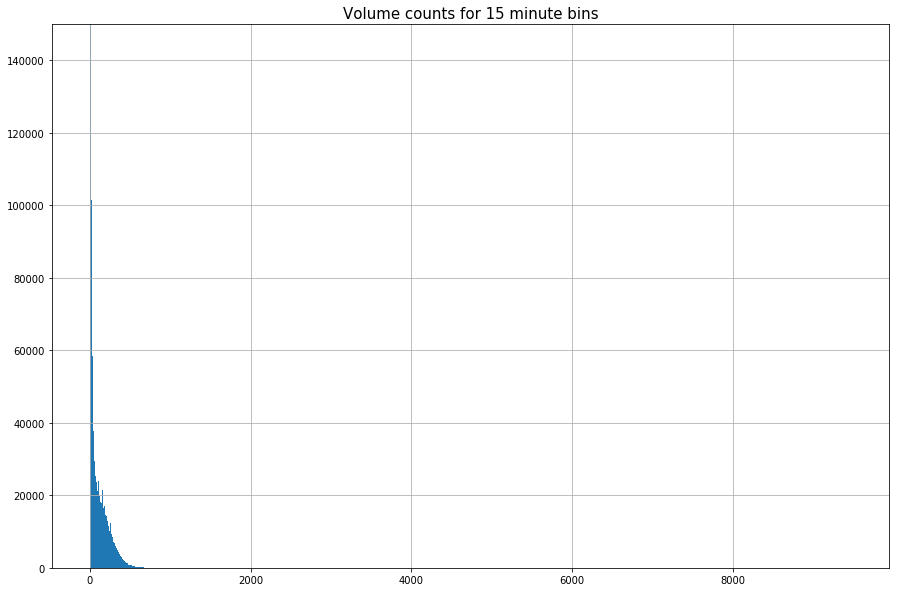


```python
max(volumes['volume_15min'])
```


    9472.0


The maximum volume is extremely high. I am going to look into this record and other records with very high volumes.


```python
sql_high_volumes = '''
SELECT * 
FROM open_data.volumes_atr_shortterm
WHERE volume_15min = 9472;
'''
pandasql.read_sql(sql_high_volumes, con)
```


<div>
<style>
    .dataframe thead tr:only-child th {
        text-align: right;
    }

    .dataframe thead th {
        text-align: left;
    }

    .dataframe tbody tr th {
        vertical-align: top;
    }
</style>
<table border="1" class="dataframe">
  <thead>
    <tr style="text-align: right;">
      <th></th>
      <th>centreline_id</th>
      <th>direction</th>
      <th>location</th>
      <th>class_type</th>
      <th>datetime_bin</th>
      <th>volume_15min</th>
    </tr>
  </thead>
  <tbody>
    <tr>
      <th>0</th>
      <td>14066690</td>
      <td>Southbound</td>
      <td>CHERRY ST S/B N OF COMMISSIONERS ST</td>
      <td>Vehicles</td>
      <td>2000-06-14 02:45:00</td>
      <td>9472.0</td>
    </tr>
  </tbody>
</table>
</div>


```python
bin_val = np.arange(1000, max(volumes['volume_15min']), 1)

volumes.hist(bins=bin_val, figsize=(15,10))
plt.title('Volume counts for 15 minute bins')
plt.rc('font', size=10)          
plt.rc('axes', titlesize=15)
```


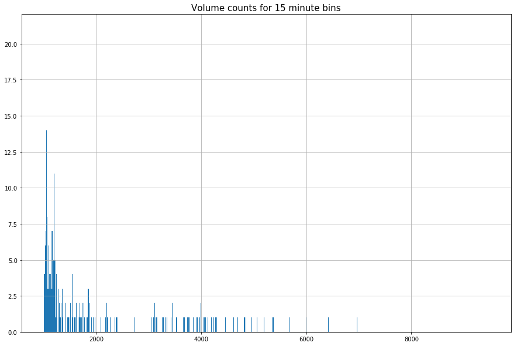


The TMC datasets had a maximum 15 min volume of under 2000. Some of the values in this dataset look very high for a 15 minute period.  


```python
sql_high_volumes = '''
SELECT DISTINCT centreline_id, location, COUNT(*), AVG(volume_15min) avg_volume
FROM open_data.volumes_atr_shortterm
WHERE volume_15min > 2000
GROUP BY centreline_id, location;
'''
pandasql.read_sql(sql_high_volumes, con)
```


<div>
<style>
    .dataframe thead tr:only-child th {
        text-align: right;
    }

    .dataframe thead th {
        text-align: left;
    }

    .dataframe tbody tr th {
        vertical-align: top;
    }
</style>
<table border="1" class="dataframe">
  <thead>
    <tr style="text-align: right;">
      <th></th>
      <th>centreline_id</th>
      <th>location</th>
      <th>count</th>
      <th>avg_volume</th>
    </tr>
  </thead>
  <tbody>
    <tr>
      <th>0</th>
      <td>1098.0</td>
      <td>DON VALLEY PKWY N/B S OF LEASIDE BRIDGE</td>
      <td>18</td>
      <td>3542.611111</td>
    </tr>
    <tr>
      <th>1</th>
      <td>105198.0</td>
      <td>BRIMLEY RD N/B S OF CHARTLAND BLVD S</td>
      <td>7</td>
      <td>2382.000000</td>
    </tr>
    <tr>
      <th>2</th>
      <td>106862.0</td>
      <td>MCCOWAN RD S/B N OF HIGHWAY 401 N TCS</td>
      <td>2</td>
      <td>2280.500000</td>
    </tr>
    <tr>
      <th>3</th>
      <td>107148.0</td>
      <td>MCCOWAN RD S/B N OF HIGHWAY 401 S TCS</td>
      <td>1</td>
      <td>2153.000000</td>
    </tr>
    <tr>
      <th>4</th>
      <td>107973.0</td>
      <td>WARDEN AVE N/B S OF ARKONA DR</td>
      <td>1</td>
      <td>2200.000000</td>
    </tr>
    <tr>
      <th>5</th>
      <td>108096.0</td>
      <td>WARDEN AVE N/B S OF HIGHWAY 401 N TCS</td>
      <td>1</td>
      <td>2200.000000</td>
    </tr>
    <tr>
      <th>6</th>
      <td>438309.0</td>
      <td>BAYVIEW AVE S/B N OF EMPRESS AVE</td>
      <td>1</td>
      <td>2033.000000</td>
    </tr>
    <tr>
      <th>7</th>
      <td>438310.0</td>
      <td>HIGHWAY 404 S/B S OF SHEPPARD AVE</td>
      <td>37</td>
      <td>5100.243243</td>
    </tr>
    <tr>
      <th>8</th>
      <td>439358.0</td>
      <td>HIGHWAY 404 N/B TO HIGHWAY 401 E/B</td>
      <td>4</td>
      <td>2131.000000</td>
    </tr>
    <tr>
      <th>9</th>
      <td>439697.0</td>
      <td>BAYVIEW AVE S/B N OF HIGHWAY 401 S TCS</td>
      <td>1</td>
      <td>2021.000000</td>
    </tr>
    <tr>
      <th>10</th>
      <td>444110.0</td>
      <td>EGLINTON AVE E/B W OF CREDIT UNION</td>
      <td>3</td>
      <td>2203.000000</td>
    </tr>
    <tr>
      <th>11</th>
      <td>446098.0</td>
      <td>BLACK CREEK DR N/B N OF JANE ST</td>
      <td>2</td>
      <td>2164.000000</td>
    </tr>
    <tr>
      <th>12</th>
      <td>446446.0</td>
      <td>BLACK CREEK DR N/B N OF LAWRENCE AVE</td>
      <td>4</td>
      <td>2191.000000</td>
    </tr>
    <tr>
      <th>13</th>
      <td>909686.0</td>
      <td>EGLINTON AVE W/B W OF HIGHWAY 401/427 TCS</td>
      <td>2</td>
      <td>2374.000000</td>
    </tr>
    <tr>
      <th>14</th>
      <td>913046.0</td>
      <td>DUNDAS ST E/B W OF HIGHWAY 427 E TCS</td>
      <td>1</td>
      <td>2087.000000</td>
    </tr>
    <tr>
      <th>15</th>
      <td>913431.0</td>
      <td>F G GARDINER EXPY (COLL MERGE) E/B W OF ROYAL ...</td>
      <td>10</td>
      <td>2270.800000</td>
    </tr>
    <tr>
      <th>16</th>
      <td>913516.0</td>
      <td>F G GARDINER EXPY (COLL) W/B W OF ISLINGTON AVE</td>
      <td>17</td>
      <td>2214.941176</td>
    </tr>
    <tr>
      <th>17</th>
      <td>913520.0</td>
      <td>F G GARDINER EXPY (CORE) W/B W OF ISLINGTON AVE</td>
      <td>54</td>
      <td>3455.555556</td>
    </tr>
    <tr>
      <th>18</th>
      <td>913534.0</td>
      <td>F G GARDINER EXPY (CORE) E/B W OF ISLINGTON AVE</td>
      <td>122</td>
      <td>3854.254098</td>
    </tr>
    <tr>
      <th>19</th>
      <td>913564.0</td>
      <td>F G GARDINER EXPY (COLL) E/B W OF ISLINGTON AVE</td>
      <td>17</td>
      <td>2768.117647</td>
    </tr>
    <tr>
      <th>20</th>
      <td>913866.0</td>
      <td>F G GARDINER EXPY W/B TO HIGHWAY 427 N/B &amp; BRO...</td>
      <td>63</td>
      <td>3327.349206</td>
    </tr>
    <tr>
      <th>21</th>
      <td>913875.0</td>
      <td>F G GARDINER EXPY E/B E OF THE EAST MALL</td>
      <td>105</td>
      <td>2999.209524</td>
    </tr>
    <tr>
      <th>22</th>
      <td>1141989.0</td>
      <td>BAYVIEW AVE N/B N OF ROSEDALE VALLEY RD CUTOFF</td>
      <td>1</td>
      <td>2360.000000</td>
    </tr>
    <tr>
      <th>23</th>
      <td>5503138.0</td>
      <td>EGLINTON AVE W/B E OF COMMERCE BLVD</td>
      <td>1</td>
      <td>2039.000000</td>
    </tr>
    <tr>
      <th>24</th>
      <td>7154616.0</td>
      <td>YONGE ST S/B N OF ELMHURST AVE</td>
      <td>1</td>
      <td>2223.000000</td>
    </tr>
    <tr>
      <th>25</th>
      <td>7950526.0</td>
      <td>MOUNT PLEASANT RD S/B S OF ELM AVE</td>
      <td>1</td>
      <td>2136.000000</td>
    </tr>
    <tr>
      <th>26</th>
      <td>8837423.0</td>
      <td>JANE ST N/B N OF FALSTAFF AVE</td>
      <td>1</td>
      <td>2656.000000</td>
    </tr>
    <tr>
      <th>27</th>
      <td>11517161.0</td>
      <td>EGLINTON AVE W/B E OF CREDIT UNION</td>
      <td>2</td>
      <td>2881.000000</td>
    </tr>
    <tr>
      <th>28</th>
      <td>13503773.0</td>
      <td>HIGHWAY 2A W/B E OF HIGHWAY 401</td>
      <td>1</td>
      <td>2282.000000</td>
    </tr>
    <tr>
      <th>29</th>
      <td>13971078.0</td>
      <td>HIGHWAY 2A E/B E OF HIGHWAY 401</td>
      <td>2</td>
      <td>2370.500000</td>
    </tr>
    <tr>
      <th>30</th>
      <td>14066690.0</td>
      <td>CHERRY ST S/B N OF COMMISSIONERS ST</td>
      <td>70</td>
      <td>4136.957143</td>
    </tr>
    <tr>
      <th>31</th>
      <td>30005881.0</td>
      <td>F G GARDINER EXPY W/B W OF HUMBER RIVER</td>
      <td>78</td>
      <td>3908.435897</td>
    </tr>
    <tr>
      <th>32</th>
      <td>NaN</td>
      <td>F G GARDINER EXPY E/B W OF HUMBER RIVER</td>
      <td>84</td>
      <td>4899.202381</td>
    </tr>
    <tr>
      <th>33</th>
      <td>NaN</td>
      <td>HIGHWAY 404 N/B S OF SHEPPARD AVE</td>
      <td>36</td>
      <td>5874.194444</td>
    </tr>
    <tr>
      <th>34</th>
      <td>NaN</td>
      <td>LAKE SHORE BLVD W/B TO F G GARDINER EXPY W/B</td>
      <td>6</td>
      <td>2073.500000</td>
    </tr>
    <tr>
      <th>35</th>
      <td>NaN</td>
      <td>W R ALLEN RD S/B N OF SHEPPARD AVE</td>
      <td>2</td>
      <td>2263.000000</td>
    </tr>
  </tbody>
</table>
</div>


A lot of these really high volumes seem to be on taken on highways. Highways have higher speeds and so their volumes of traffic may be a lot larger than on normal city roads. However, some of these appear to be normal roadways, so some of these may be extreme values. 

I created a view with all of the outliers for ATR short term dataset called `open_data.atr_shortterm_outliers`. The code that created the view was:

```sql 
DROP MATERIALIZED VIEW IF EXISTS open_data.atr_shortterm_outliers;
CREATE MATERIALIZED VIEW open_data.atr_shortterm_outliers AS (
SELECT o.centreline_id, o.direction, o.location, o.class_type, o.datetime_bin, o.volume_15min 
FROM

(
SELECT l.centreline_id, l.location, l.direction, calc.lower, calc.upper
FROM 
(SELECT DISTINCT ON (location, centreline_id, direction) centreline_id, location, direction
FROM open_data.volumes_atr_shortterm) l LEFT JOIN
(SELECT centreline_id, location, direction, 
(percentile_cont(0.25) within group (order by volume_15min asc) - (percentile_cont(0.75) within group (order by volume_15min asc) - percentile_cont(0.25) within group (order by volume_15min asc))*1.5)  AS lower, 
(percentile_cont(0.75) within group (order by volume_15min asc) + (percentile_cont(0.75) within group (order by volume_15min asc) - percentile_cont(0.25) within group (order by volume_15min asc))*1.5) upper
FROM 
open_data.volumes_atr_shortterm
GROUP BY location, centreline_id, direction
) AS calc ON calc.location = l.location AND calc.direction = l.direction ) AS lu

JOIN 

open_data.volumes_atr_shortterm o ON  o.location = lu.location AND o.direction = lu.direction

WHERE (o.volume_15min > upper OR o.volume_15min < lower) AND upper <> lower )
WITH DATA;
```


```python
sql_outliers = '''
SELECT * 
FROM open_data.atr_shortterm_outliers
'''

outliers = pandasql.read_sql(sql_outliers, con)
```


```python
sql_volumes = '''
SELECT * FROM open_data.volumes_atr_shortterm
'''

volumes = pandasql.read_sql(sql_volumes, con)
```


```python
# get percentage of total records that are outliers 
(len(outliers.index) / len(volumes.index))*100 
```


    1.1774664391086593


```python
outliers['volume_15min'].hist(bins = np.arange(min(outliers['volume_15min']), max(outliers['volume_15min']) , 1), figsize = (18, 10))
ax = plt.gca()
minor_ticks = np.arange(0, 50, 10)
major_ticks = np.arange(0, 50, 100)

#ax.set_xticks(major_ticks, labels=[major_ticks])
ax.set_xticks(minor_ticks, minor=True)
```


    [<matplotlib.axis.XTick at 0xf750208>,
     <matplotlib.axis.XTick at 0x1064b630>,
     <matplotlib.axis.XTick at 0x107b0cf8>,
     <matplotlib.axis.XTick at 0xf4a03c88>,
     <matplotlib.axis.XTick at 0x103896a0>]


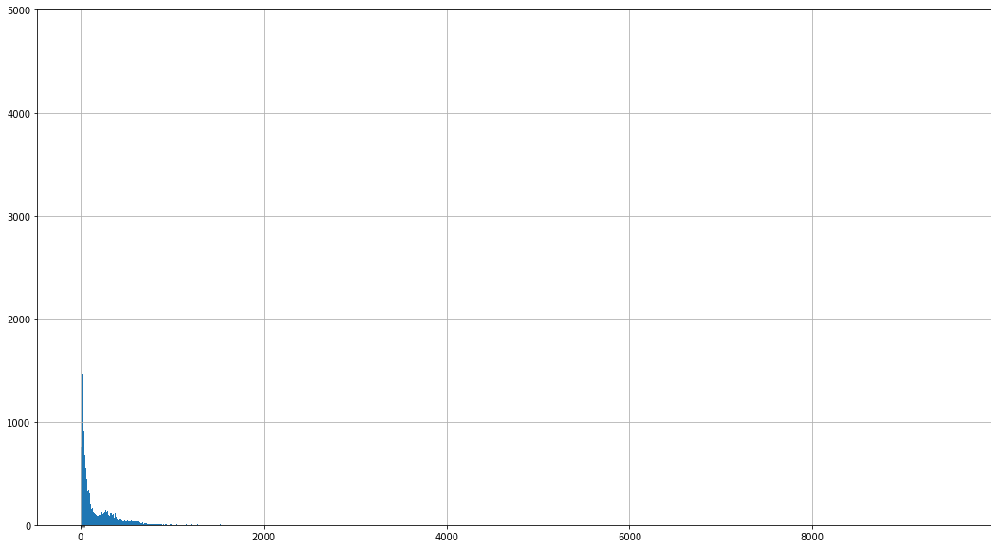


```python
outliers['volume_15min'].hist(bins = np.arange(0, 1000, 1), figsize = (18, 10))
ax = plt.gca()
minor_ticks = np.arange(0, 50, 10)
major_ticks = np.arange(0, 50, 100)

plt.title("ATR short-term outliers with volumes between 0 and 1000")
#ax.set_xticks(major_ticks, labels=[major_ticks])
ax.set_xticks(minor_ticks, minor=True)
```


    [<matplotlib.axis.XTick at 0xe5124a8>,
     <matplotlib.axis.XTick at 0xe7c4668>,
     <matplotlib.axis.XTick at 0xebbea90>,
     <matplotlib.axis.XTick at 0x164bb9f98>,
     <matplotlib.axis.XTick at 0x108f079b0>]


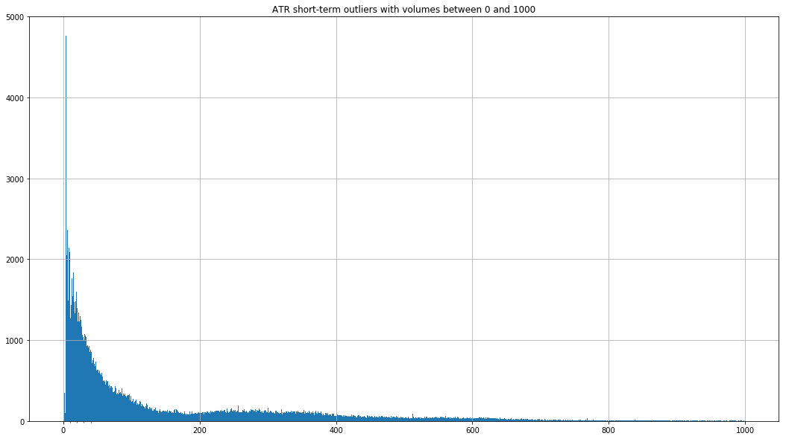


There ara a lot of volume values that are low and are not really "exteme" values for volumes. I investigated some of the intersections where the volumes under 5 occured, and they were not major streets, so the values are logical. 

Try modifying the IQR process by using different values for k, I used 2, 2.5, and 3 as k values. Below is the code and analysis of the outliers when the k-value was equal to 3.

```sql 
DROP MATERIALIZED VIEW IF EXISTS open_data.atr_shortterm_outliers_k3;
CREATE MATERIALIZED VIEW open_data.atr_shortterm_outliers_k3 AS (
SELECT o.centreline_id, o.direction, o.location, o.class_type, o.datetime_bin, o.volume_15min 
FROM

(
SELECT l.centreline_id, l.location,  l.direction, calc.lower, calc.upper
FROM 
(SELECT DISTINCT ON (centreline_id, location, direction) centreline_id, location, direction
FROM open_data.volumes_atr_shortterm) l LEFT JOIN
(SELECT centreline_id, location, direction, 
(percentile_cont(0.25) within group (order by volume_15min asc) - (percentile_cont(0.75) within group (order by volume_15min asc) - percentile_cont(0.25) within group (order by volume_15min asc))*3)  AS lower, 
(percentile_cont(0.75) within group (order by volume_15min asc) + (percentile_cont(0.75) within group (order by volume_15min asc) - percentile_cont(0.25) within group (order by volume_15min asc))*3) upper
FROM 
open_data.volumes_atr_shortterm
GROUP BY centreline_id, location, direction
) AS calc ON calc.location = l.location AND calc.direction = l.direction ) AS lu

JOIN 

open_data.volumes_atr_shortterm o ON  o.location = lu.location AND o.direction = lu.direction

WHERE (o.volume_15min > upper OR o.volume_15min < lower) AND upper <> lower )
WITH DATA;
```


```python
sql_outliers = '''
SELECT * 
FROM open_data.atr_shortterm_outliers_k3
'''

outliers_k2 = pandasql.read_sql(sql_outliers, con)
```


```python
# get percentage of total records that are outliers 
(len(outliers_k2.index) / len(volumes.index))*100 
```


    0.22276871204442786


```python
outliers_k2['volume_15min'].hist(bins = np.arange(min(outliers_k2['volume_15min']), max(outliers_k2['volume_15min']) , 1), figsize = (18, 10))
ax = plt.gca()
minor_ticks = np.arange(0, 50, 10)
major_ticks = np.arange(0, 50, 100)

ax.set_xticks(minor_ticks, minor=True)
```


    [<matplotlib.axis.XTick at 0xce32cb38>,
     <matplotlib.axis.XTick at 0x1e3929cf8>,
     <matplotlib.axis.XTick at 0x1b50b87b8>,
     <matplotlib.axis.XTick at 0x1ca138ba8>,
     <matplotlib.axis.XTick at 0x189a045c0>]


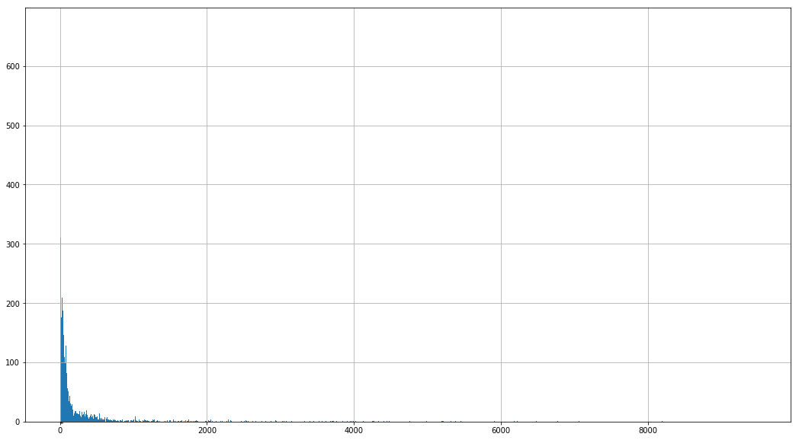


```python
outliers_k2['volume_15min'].hist(bins = np.arange(0, 1000 , 1), figsize = (18, 10))
ax = plt.gca()
minor_ticks = np.arange(0, 50, 10)
major_ticks = np.arange(0, 50, 100)

ax.set_xticks(minor_ticks, minor=True)
```


    [<matplotlib.axis.XTick at 0x112f98e10>,
     <matplotlib.axis.XTick at 0x1e1c6c390>,
     <matplotlib.axis.XTick at 0x1dcfe9d68>,
     <matplotlib.axis.XTick at 0xb9048978>,
     <matplotlib.axis.XTick at 0xb904e390>]


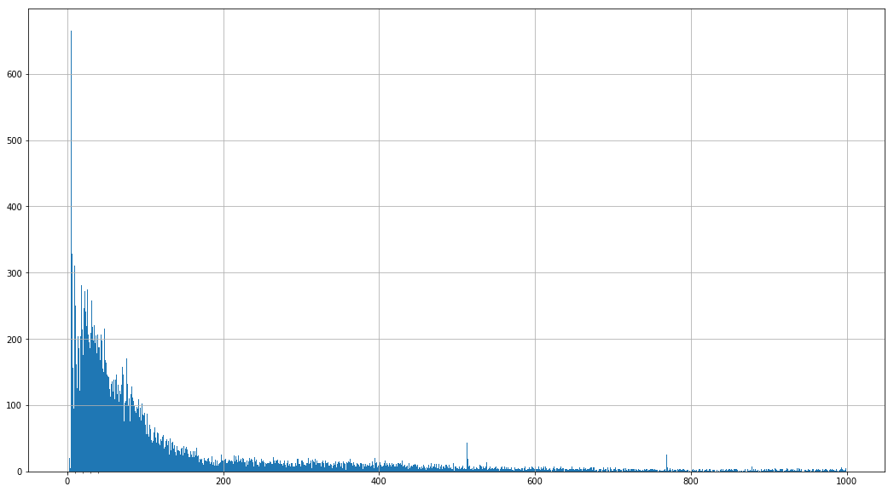


```python
outliers_k2['volume_15min'].hist(bins = np.arange(1000,  max(outliers_k2['volume_15min']) , 1), figsize = (18, 10))
ax = plt.gca()
minor_ticks = np.arange(0, 50, 10)
major_ticks = np.arange(0, 50, 100)
plt.xlim(1000,  max(outliers_k2['volume_15min']))
ax.set_xticks(minor_ticks, minor=True)
```


    [<matplotlib.axis.XTick at 0xdec7eac8>,
     <matplotlib.axis.XTick at 0x18ddaa438>,
     <matplotlib.axis.XTick at 0x1266d8438>,
     <matplotlib.axis.XTick at 0xcf6edf60>,
     <matplotlib.axis.XTick at 0xcf6fc978>]


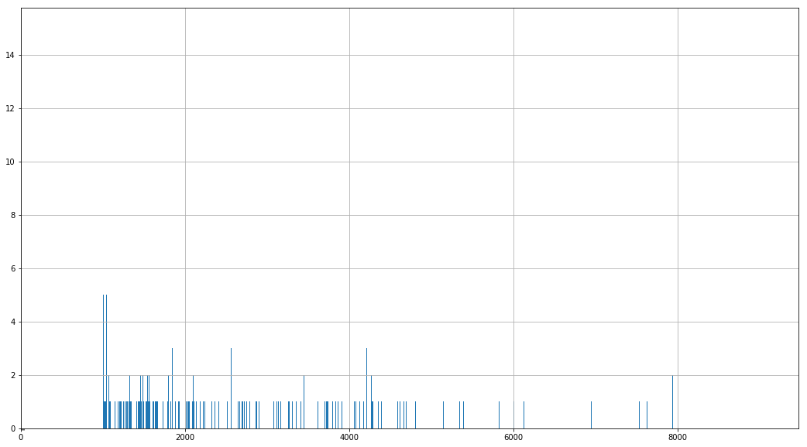


```python
sql_over200_locations = '''
SELECT location, COUNT(*) FROM open_data.atr_shortterm_outliers_k3 WHERE volume_15min > 2000 GROUP BY location
'''
pandasql.read_sql(sql_over200_locations, con)
```

Look into outliers with very low volumes by seeing if these low values are true outliers or if they are part of the distribution.


```python
sql = '''
-- check out upper and lower values
SELECT DISTINCT l.location, l.direction, calc.lower, calc.upper
FROM 
(SELECT DISTINCT ON (location, direction) centreline_id, direction
FROM open_data.volumes_atr_shortterm) l LEFT JOIN
(SELECT location, direction, 
(percentile_cont(0.25) within group (order by volume_15min asc) - (percentile_cont(0.75) within group (order by volume_15min asc) - percentile_cont(0.25) within group (order by volume_15min asc))*3)  AS lower, 
(percentile_cont(0.75) within group (order by volume_15min asc) + (percentile_cont(0.75) within group (order by volume_15min asc) - percentile_cont(0.25) within group (order by volume_15min asc))*3) upper
FROM 
open_data.volumes_atr_shortterm
GROUP BY location, direction) AS calc ON calc.location = l.location AND calc.direction = l.direction
WHERE l.location = 7439 AND l.direction = 'Eastbound'

'''

pandasql.read_sql(sql, con)
```


<div>
<style>
    .dataframe thead tr:only-child th {
        text-align: right;
    }

    .dataframe thead th {
        text-align: left;
    }

    .dataframe tbody tr th {
        vertical-align: top;
    }
</style>
<table border="1" class="dataframe">
  <thead>
    <tr style="text-align: right;">
      <th></th>
      <th>centreline_id</th>
      <th>direction</th>
      <th>lower</th>
      <th>upper</th>
    </tr>
  </thead>
  <tbody>
    <tr>
      <th>0</th>
      <td>7439</td>
      <td>Eastbound</td>
      <td>-3.0</td>
      <td>4.0</td>
    </tr>
  </tbody>
</table>
</div>


```python
sql_volumes7429 = '''
SELECT * FROM open_data.volumes_atr_shortterm
WHERE centreline_id = 7439
'''

volumes_7439 = pandasql.read_sql(sql_volumes7429, con)
# add hour column
def get_hour(row):
    return row['datetime_bin'].hour

volumes7439['hour'] = volumes7439.apply(lambda row:  get_hour (row), axis=1)  


sql_outliers7429 = '''
SELECT * FROM open_data.atr_shortterm_outliers
WHERE centreline_id = 7439
'''

outliers_7439 = pandasql.read_sql(sql_outliers7429, con)

outliers7439['hour'] = outliers7439.apply(lambda row:  get_hour (row), axis=1)  


sql_outliers = '''
SELECT * 
FROM open_data.atr_shortterm_outliers_k3
WHERE centreline_id = 7439
'''
k7439 = pandasql.read_sql(sql_outliers, con)

k7439['hour'] = k7439.apply(lambda row:  get_hour (row), axis=1)  

```

    C:\ProgramData\Anaconda3\lib\site-packages\ipykernel_launcher.py:11: SettingWithCopyWarning: 
    A value is trying to be set on a copy of a slice from a DataFrame.
    Try using .loc[row_indexer,col_indexer] = value instead
    
    See the caveats in the documentation: http://pandas.pydata.org/pandas-docs/stable/indexing.html#indexing-view-versus-copy
      # This is added back by InteractiveShellApp.init_path()
    C:\ProgramData\Anaconda3\lib\site-packages\ipykernel_launcher.py:21: SettingWithCopyWarning: 
    A value is trying to be set on a copy of a slice from a DataFrame.
    Try using .loc[row_indexer,col_indexer] = value instead
    
    See the caveats in the documentation: http://pandas.pydata.org/pandas-docs/stable/indexing.html#indexing-view-versus-copy
    


```python
volumes7439.plot.scatter(x='hour', y='volume_15min')
outliers7439.plot.scatter('hour', 'volume_15min')
k7439.plot.scatter('hour', 'volume_15min')
```


    <matplotlib.axes._subplots.AxesSubplot at 0xd45912e8>


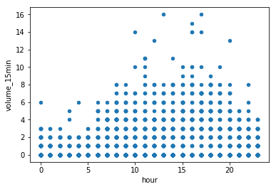


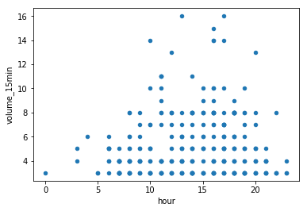


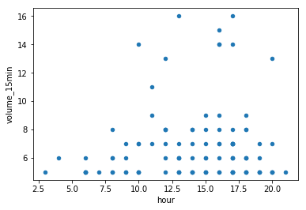


Some/most of the points in both of the last two plots were not true outliers, as they occur within the general distribution of the first scatter plot. On the plus side, the true outliers were included in both plots. 

Try to edit the outlier criteria by looking at outliers by location, direction (like before) and additionally class type (i.e. Pedestrians, Cyclists, etc.). See if this change effects the validity of the outliers being defined.

Code: 
```sql 

DROP MATERIALIZED VIEW IF EXISTS open_data.atr_shortterm_outliers_class;
CREATE MATERIALIZED VIEW open_data.atr_shortterm_outliers_class AS (
SELECT o.centreline_id, o.direction, o.location, o.class_type, o.datetime_bin, o.volume_15min 
FROM

(
SELECT l.centreline_id, l.location, l.direction, calc.lower, calc.upper, l.class_type
FROM 
(SELECT DISTINCT ON (location, centreline_id, direction, class_type) centreline_id, location, direction, class_type
FROM open_data.volumes_atr_shortterm) l LEFT JOIN
(SELECT centreline_id, location, direction, class_type,
(percentile_cont(0.25) within group (order by volume_15min asc) - (percentile_cont(0.95) within group (order by volume_15min asc) - percentile_cont(0.05) within group (order by volume_15min asc))*3)  AS lower, 
(percentile_cont(0.75) within group (order by volume_15min asc) + (percentile_cont(0.95) within group (order by volume_15min asc) - percentile_cont(0.05) within group (order by volume_15min asc))*3) upper
FROM 
open_data.volumes_atr_shortterm
GROUP BY location, centreline_id, direction, class_type
) AS calc ON calc.location = l.location AND calc.direction = l.direction AND calc.class_type = l.class_type) AS lu

JOIN 

open_data.volumes_atr_shortterm o ON  o.location = lu.location AND o.direction = lu.direction AND o.class_type = lu.class_type

WHERE (o.volume_15min > upper OR o.volume_15min < lower) AND upper <> lower )
WITH DATA;


```


```python
sql_outliers = '''
SELECT * 
FROM open_data.volumes_atr_shortterm_remove0
'''

outliers_class = pandasql.read_sql(sql_outliers, con)
```


```python
outliers_class['volume_15min'].hist(bins = np.arange(min(outliers_class['volume_15min']), max(outliers_class['volume_15min']) , 1), figsize = (18, 10))
ax = plt.gca()
minor_ticks = np.arange(0, 50, 10)
major_ticks = np.arange(0, 50, 100)
plt.xlim(min(outliers_class['volume_15min']), max(outliers_class['volume_15min']))

ax.set_xticks(minor_ticks, minor=True)
```


    [<matplotlib.axis.XTick at 0x167f2cb38>,
     <matplotlib.axis.XTick at 0x167f41080>,
     <matplotlib.axis.XTick at 0x16758ccc0>,
     <matplotlib.axis.XTick at 0x175bb47b8>,
     <matplotlib.axis.XTick at 0x175bd51d0>]


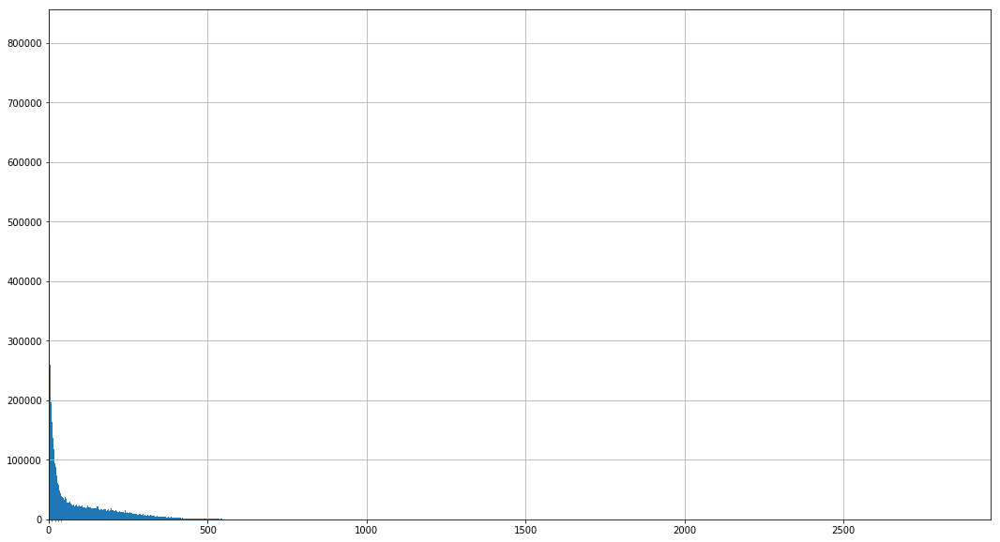


```python
outliers_class['volume_15min'].hist(bins = np.arange(min(outliers_class['volume_15min']), max(outliers_class['volume_15min']) , 1), figsize = (18, 10))
ax = plt.gca()
minor_ticks = np.arange(0, 50, 10)
major_ticks = np.arange(0, 50, 100)
plt.xlim(0,500)

ax.set_xticks(minor_ticks, minor=True)
```


    [<matplotlib.axis.XTick at 0x7cb82978>,
     <matplotlib.axis.XTick at 0x748fb7b8>,
     <matplotlib.axis.XTick at 0x73fed400>,
     <matplotlib.axis.XTick at 0x9780dcf8>,
     <matplotlib.axis.XTick at 0x8bc39710>]


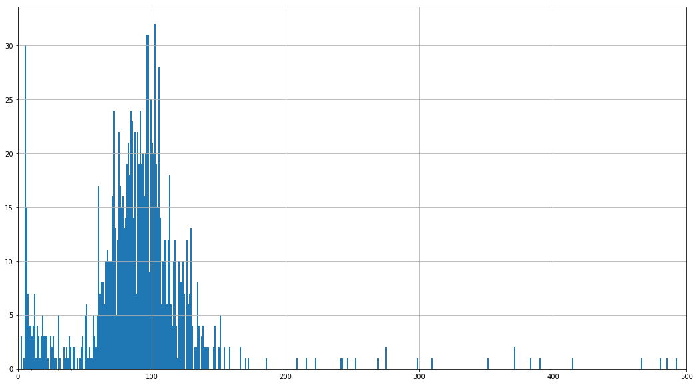


As you can see from the above histograms and scatter plot, the same phenomenon where low values that are in and around 0 are being classified as outliers. These values may be outliers, but they are definitely not extreme values. 

The next approach to remove extreme values that I tried was completely different than the first few. When looking over the dataset, it was noticed that there are a lot of volumes of 0 that should not be 0, followed by an extremely large volume. I started by creating an exceptions view that contained all of the records that occur on days and at locations where there exists a value of 0 and a value above 20 within an hour of each other. After that, I realized that there were still some extreme values in the dataset. I then refined the query that created the exceptions view to include records that occur on dates and at locations where there was a volume of under 450 and a volume of over 1000 wihtin an hour of each other. Additionally, the exceptions view also includes date-location combinations that have less than or equal to 3 records and have a maximum value that is extremely high (over 1000) or a minimum volume of under 5, and date-location combinations where the maximum volume is 0 or the average volume is 0. 

The code to create the view: 
```sql 
DROP  MATERIALIZED VIEW IF EXISTS open_data.volumes_atr_shortterm_exceptions;
CREATE MATERIALIZED VIEW  open_data.volumes_atr_shortterm_exceptions AS 
(
SELECT volumes.centreline_id, volumes.location, volumes.datetime_bin, volumes.direction, volumes.volume_15min
FROM open_data.volumes_atr_shortterm volumes INNER JOIN 
(
SELECT DISTINCT *
FROM 
-- get day/locations where there exists a value of 0 and a value above 20 within an hour of each other. 
-- Also get days that have a volume of under 450 and a volume of over 1000 wihtin an hour of each other
(SELECT DISTINCT o1.datetime_bin::date, o1.location 
FROM open_data.volumes_atr_shortterm o1 JOIN open_data.volumes_atr_shortterm o2 ON o1.location = o2.location  
WHERE (CASE WHEN (o1.datetime_bin - o2.datetime_bin) < interval '0' THEN (-(o1.datetime_bin - o2.datetime_bin)) ELSE (o1.datetime_bin - o2.datetime_bin) END) <= interval '1 hour' 
AND ((o1.volume_15min > 20 AND o2.volume_15min = 0) OR (o1.volume_15min < 450 AND o2.volume_15min > 1000) )) AS q1
UNION 
(SELECT DISTINCT o2.datetime_bin::date, o2.location FROM open_data.volumes_atr_shortterm o1 JOIN open_data.volumes_atr_shortterm o2 ON o1.location = o2.location 
WHERE (CASE WHEN (o1.datetime_bin - o2.datetime_bin) < interval '0' THEN (-(o1.datetime_bin - o2.datetime_bin)) ELSE (o1.datetime_bin - o2.datetime_bin) END) <= interval '1 hour' AND 
((o1.volume_15min > 20 AND o2.volume_15min = 0) OR (o1.volume_15min < 450 AND o2.volume_15min > 1000))  ) 
UNION 
-- get days that only have less than 3 records for a location+date and a max value that is strangley high or a mininum value for that location+date that is extremely low
(

SELECT DISTINCT datetime_bin::DATE, location FROM 
(
SELECT datetime_bin::DATE, location, MAX(volume_15min)
FROM open_data.volumes_atr_shortterm v
GROUP BY datetime_bin::DATE, location
-- CHANGE MAX TO OVER 1000 ??? WOULD HELP IN BURNHAMTHORPE AND RENFORTH THING and etobicoke creek/bloor 
HAVING (COUNT(*) <= 3 AND (MAX(volume_15min) > 1000 OR MIN(volume_15min) <= 5)) OR MAX(volume_15min) = 0 OR AVG(volume_15min) = 0
) x
)


) remove_date_location 
ON remove_date_location.datetime_bin = volumes.datetime_bin::DATE AND remove_date_location.location = volumes.location 


);
```

## QA/QC checks 

In order to make sure all of the extreme values were identified and that the values in the exception table are extreme (or occur on the same day as extreme values), I did extensive QA/QC. 


```python
sql = '''
-- max that is not in exceptions table is 1359
SELECT MAX(volume_15min) 
FROM open_data.volumes_atr_shortterm 
WHERE location NOT IN 
(SELECT location FROM (SELECT DISTINCT location, datetime_bin::DATE FROM open_data.volumes_atr_shortterm_exceptions) x) 
AND datetime_bin::DATE NOT IN 
(SELECT datetime_bin FROM (SELECT DISTINCT location, datetime_bin::DATE FROM open_data.volumes_atr_shortterm_exceptions) x) 
'''

pandasql.read_sql(sql, con)
```


<div>
<style>
    .dataframe thead tr:only-child th {
        text-align: right;
    }

    .dataframe thead th {
        text-align: left;
    }

    .dataframe tbody tr th {
        vertical-align: top;
    }
</style>
<table border="1" class="dataframe">
  <thead>
    <tr style="text-align: right;">
      <th></th>
      <th>max</th>
    </tr>
  </thead>
  <tbody>
    <tr>
      <th>0</th>
      <td>1359.0</td>
    </tr>
  </tbody>
</table>
</div>


```python
# look at values that are not in exceptions table but are over 1000
# I checked quite a few (a bit under 10) of the locations here by running queries such as:
# SELECT * FROM open_data.volumes_atr_shortterm WHERE location = 'EGLINTON AVE W/B W OF MARTIN GROVE RD'
# I found that the volume values gradually increase, reach above 1000, and then gradually decrease 
# so I have no reason to believe that these values over 1000 are extreme values
sql = '''
SELECT * 
FROM open_data.volumes_atr_shortterm 
WHERE location NOT IN 
(SELECT location FROM (SELECT DISTINCT location, datetime_bin::DATE FROM open_data.volumes_atr_shortterm_exceptions) x) 
AND datetime_bin::DATE NOT IN 
(SELECT datetime_bin FROM (SELECT DISTINCT location, datetime_bin::DATE FROM open_data.volumes_atr_shortterm_exceptions) x) 
AND volume_15min > 1000
'''

pandasql.read_sql(sql, con)
```


<div>
<style>
    .dataframe thead tr:only-child th {
        text-align: right;
    }

    .dataframe thead th {
        text-align: left;
    }

    .dataframe tbody tr th {
        vertical-align: top;
    }
</style>
<table border="1" class="dataframe">
  <thead>
    <tr style="text-align: right;">
      <th></th>
      <th>centreline_id</th>
      <th>direction</th>
      <th>location</th>
      <th>class_type</th>
      <th>datetime_bin</th>
      <th>volume_15min</th>
    </tr>
  </thead>
  <tbody>
    <tr>
      <th>0</th>
      <td>12377332.0</td>
      <td>Westbound</td>
      <td>EGLINTON AVE W/B W OF MARTIN GROVE RD</td>
      <td>Vehicles</td>
      <td>1999-04-21 07:30:00</td>
      <td>1008.0</td>
    </tr>
    <tr>
      <th>1</th>
      <td>12377332.0</td>
      <td>Westbound</td>
      <td>EGLINTON AVE W/B W OF MARTIN GROVE RD</td>
      <td>Vehicles</td>
      <td>1999-04-21 07:45:00</td>
      <td>1058.0</td>
    </tr>
    <tr>
      <th>2</th>
      <td>12377332.0</td>
      <td>Westbound</td>
      <td>EGLINTON AVE W/B W OF MARTIN GROVE RD</td>
      <td>Vehicles</td>
      <td>1999-04-21 08:00:00</td>
      <td>1178.0</td>
    </tr>
    <tr>
      <th>3</th>
      <td>12377332.0</td>
      <td>Westbound</td>
      <td>EGLINTON AVE W/B W OF MARTIN GROVE RD</td>
      <td>Vehicles</td>
      <td>1999-04-21 08:15:00</td>
      <td>1258.0</td>
    </tr>
    <tr>
      <th>4</th>
      <td>12377332.0</td>
      <td>Westbound</td>
      <td>EGLINTON AVE W/B W OF MARTIN GROVE RD</td>
      <td>Vehicles</td>
      <td>1999-04-21 08:30:00</td>
      <td>1216.0</td>
    </tr>
    <tr>
      <th>5</th>
      <td>12377332.0</td>
      <td>Westbound</td>
      <td>EGLINTON AVE W/B W OF MARTIN GROVE RD</td>
      <td>Vehicles</td>
      <td>1999-04-21 08:45:00</td>
      <td>1118.0</td>
    </tr>
    <tr>
      <th>6</th>
      <td>12377332.0</td>
      <td>Westbound</td>
      <td>EGLINTON AVE W/B W OF MARTIN GROVE RD</td>
      <td>Vehicles</td>
      <td>1999-04-21 09:00:00</td>
      <td>1034.0</td>
    </tr>
    <tr>
      <th>7</th>
      <td>7273868.0</td>
      <td>Southbound</td>
      <td>YONGE ST S/B S MERTON ST</td>
      <td>Vehicles</td>
      <td>2002-08-02 08:00:00</td>
      <td>1054.0</td>
    </tr>
    <tr>
      <th>8</th>
      <td>7273868.0</td>
      <td>Southbound</td>
      <td>YONGE ST S/B S MERTON ST</td>
      <td>Vehicles</td>
      <td>2002-08-02 08:15:00</td>
      <td>1296.0</td>
    </tr>
    <tr>
      <th>9</th>
      <td>7273868.0</td>
      <td>Southbound</td>
      <td>YONGE ST S/B S MERTON ST</td>
      <td>Vehicles</td>
      <td>2002-08-02 08:30:00</td>
      <td>1358.0</td>
    </tr>
    <tr>
      <th>10</th>
      <td>7273868.0</td>
      <td>Southbound</td>
      <td>YONGE ST S/B S MERTON ST</td>
      <td>Vehicles</td>
      <td>2002-08-02 08:45:00</td>
      <td>1328.0</td>
    </tr>
    <tr>
      <th>11</th>
      <td>7273868.0</td>
      <td>Southbound</td>
      <td>YONGE ST S/B S MERTON ST</td>
      <td>Vehicles</td>
      <td>2002-08-02 09:00:00</td>
      <td>1230.0</td>
    </tr>
    <tr>
      <th>12</th>
      <td>7273868.0</td>
      <td>Southbound</td>
      <td>YONGE ST S/B S MERTON ST</td>
      <td>Vehicles</td>
      <td>2002-08-02 09:15:00</td>
      <td>1094.0</td>
    </tr>
    <tr>
      <th>13</th>
      <td>106500.0</td>
      <td>Westbound</td>
      <td>HIGHWAY 2A W/B E OF LAWSON RD ON/RAMPS</td>
      <td>Vehicles</td>
      <td>1996-12-11 07:15:00</td>
      <td>1017.0</td>
    </tr>
    <tr>
      <th>14</th>
      <td>106676.0</td>
      <td>Eastbound</td>
      <td>HIGHWAY 2A E/B E OF LAWSON RD OFF RAMPS</td>
      <td>Vehicles</td>
      <td>1996-12-09 17:15:00</td>
      <td>1013.0</td>
    </tr>
    <tr>
      <th>15</th>
      <td>106676.0</td>
      <td>Eastbound</td>
      <td>HIGHWAY 2A E/B E OF LAWSON RD OFF RAMPS</td>
      <td>Vehicles</td>
      <td>1996-12-11 17:00:00</td>
      <td>1004.0</td>
    </tr>
    <tr>
      <th>16</th>
      <td>913751.0</td>
      <td>Northbound</td>
      <td>RAMP F G GARDINER EXPY E/B TO HIGHWAY 427 N/B</td>
      <td>Vehicles</td>
      <td>2005-09-30 07:45:00</td>
      <td>1008.0</td>
    </tr>
    <tr>
      <th>17</th>
      <td>913751.0</td>
      <td>Northbound</td>
      <td>RAMP F G GARDINER EXPY E/B TO HIGHWAY 427 N/B</td>
      <td>Vehicles</td>
      <td>2005-09-30 08:15:00</td>
      <td>1025.0</td>
    </tr>
    <tr>
      <th>18</th>
      <td>913751.0</td>
      <td>Northbound</td>
      <td>RAMP F G GARDINER EXPY E/B TO HIGHWAY 427 N/B</td>
      <td>Vehicles</td>
      <td>2005-09-30 08:30:00</td>
      <td>1034.0</td>
    </tr>
    <tr>
      <th>19</th>
      <td>913751.0</td>
      <td>Northbound</td>
      <td>RAMP F G GARDINER EXPY E/B TO HIGHWAY 427 N/B</td>
      <td>Vehicles</td>
      <td>2005-09-30 08:45:00</td>
      <td>1123.0</td>
    </tr>
    <tr>
      <th>20</th>
      <td>30002759.0</td>
      <td>Eastbound</td>
      <td>LAKE SHORE BLVD E/B W OF LESLIE ST</td>
      <td>Vehicles</td>
      <td>2002-05-22 17:30:00</td>
      <td>1008.0</td>
    </tr>
    <tr>
      <th>21</th>
      <td>30002759.0</td>
      <td>Eastbound</td>
      <td>LAKE SHORE BLVD E/B W OF LESLIE ST</td>
      <td>Vehicles</td>
      <td>2002-05-22 18:00:00</td>
      <td>1101.0</td>
    </tr>
    <tr>
      <th>22</th>
      <td>30002759.0</td>
      <td>Eastbound</td>
      <td>LAKE SHORE BLVD E/B W OF LESLIE ST</td>
      <td>Vehicles</td>
      <td>2002-05-22 18:15:00</td>
      <td>1053.0</td>
    </tr>
    <tr>
      <th>23</th>
      <td>30002759.0</td>
      <td>Eastbound</td>
      <td>LAKE SHORE BLVD E/B W OF LESLIE ST</td>
      <td>Vehicles</td>
      <td>2002-05-22 18:30:00</td>
      <td>1086.0</td>
    </tr>
    <tr>
      <th>24</th>
      <td>30002759.0</td>
      <td>Eastbound</td>
      <td>LAKE SHORE BLVD E/B W OF LESLIE ST</td>
      <td>Vehicles</td>
      <td>2002-05-22 18:45:00</td>
      <td>1041.0</td>
    </tr>
    <tr>
      <th>25</th>
      <td>30002744.0</td>
      <td>Westbound</td>
      <td>LAKE SHORE BLVD W/B E OF LESLIE ST</td>
      <td>Vehicles</td>
      <td>2001-12-12 08:45:00</td>
      <td>1031.0</td>
    </tr>
    <tr>
      <th>26</th>
      <td>30002744.0</td>
      <td>Westbound</td>
      <td>LAKE SHORE BLVD W/B E OF LESLIE ST</td>
      <td>Vehicles</td>
      <td>2001-12-12 09:00:00</td>
      <td>1138.0</td>
    </tr>
    <tr>
      <th>27</th>
      <td>30002744.0</td>
      <td>Westbound</td>
      <td>LAKE SHORE BLVD W/B E OF LESLIE ST</td>
      <td>Vehicles</td>
      <td>2001-12-12 09:15:00</td>
      <td>1244.0</td>
    </tr>
    <tr>
      <th>28</th>
      <td>30002744.0</td>
      <td>Westbound</td>
      <td>LAKE SHORE BLVD W/B E OF LESLIE ST</td>
      <td>Vehicles</td>
      <td>2001-12-12 09:30:00</td>
      <td>1275.0</td>
    </tr>
    <tr>
      <th>29</th>
      <td>30002744.0</td>
      <td>Westbound</td>
      <td>LAKE SHORE BLVD W/B E OF LESLIE ST</td>
      <td>Vehicles</td>
      <td>2001-12-12 09:45:00</td>
      <td>1301.0</td>
    </tr>
    <tr>
      <th>...</th>
      <td>...</td>
      <td>...</td>
      <td>...</td>
      <td>...</td>
      <td>...</td>
      <td>...</td>
    </tr>
    <tr>
      <th>33</th>
      <td>30002744.0</td>
      <td>Westbound</td>
      <td>LAKE SHORE BLVD W/B E OF LESLIE ST</td>
      <td>Vehicles</td>
      <td>2001-12-12 10:45:00</td>
      <td>1087.0</td>
    </tr>
    <tr>
      <th>34</th>
      <td>30002744.0</td>
      <td>Westbound</td>
      <td>LAKE SHORE BLVD W/B E OF LESLIE ST</td>
      <td>Vehicles</td>
      <td>2001-12-14 09:00:00</td>
      <td>1031.0</td>
    </tr>
    <tr>
      <th>35</th>
      <td>30002744.0</td>
      <td>Westbound</td>
      <td>LAKE SHORE BLVD W/B E OF LESLIE ST</td>
      <td>Vehicles</td>
      <td>2001-12-14 09:15:00</td>
      <td>1075.0</td>
    </tr>
    <tr>
      <th>36</th>
      <td>30002744.0</td>
      <td>Westbound</td>
      <td>LAKE SHORE BLVD W/B E OF LESLIE ST</td>
      <td>Vehicles</td>
      <td>2001-12-14 09:30:00</td>
      <td>1107.0</td>
    </tr>
    <tr>
      <th>37</th>
      <td>30002744.0</td>
      <td>Westbound</td>
      <td>LAKE SHORE BLVD W/B E OF LESLIE ST</td>
      <td>Vehicles</td>
      <td>2001-12-14 09:45:00</td>
      <td>1129.0</td>
    </tr>
    <tr>
      <th>38</th>
      <td>30002744.0</td>
      <td>Westbound</td>
      <td>LAKE SHORE BLVD W/B E OF LESLIE ST</td>
      <td>Vehicles</td>
      <td>2001-12-14 10:00:00</td>
      <td>1150.0</td>
    </tr>
    <tr>
      <th>39</th>
      <td>30002744.0</td>
      <td>Westbound</td>
      <td>LAKE SHORE BLVD W/B E OF LESLIE ST</td>
      <td>Vehicles</td>
      <td>2001-12-14 10:15:00</td>
      <td>1156.0</td>
    </tr>
    <tr>
      <th>40</th>
      <td>30002744.0</td>
      <td>Westbound</td>
      <td>LAKE SHORE BLVD W/B E OF LESLIE ST</td>
      <td>Vehicles</td>
      <td>2001-12-14 10:30:00</td>
      <td>1116.0</td>
    </tr>
    <tr>
      <th>41</th>
      <td>445676.0</td>
      <td>Westbound</td>
      <td>HIGHWAY 401 W/B TO WESTON RD (TOTAL)</td>
      <td>Vehicles</td>
      <td>1993-10-14 12:15:00</td>
      <td>1004.0</td>
    </tr>
    <tr>
      <th>42</th>
      <td>445640.0</td>
      <td>Northbound</td>
      <td>WESTON RD N/B TO ALBION RD / WALSH AVE</td>
      <td>Vehicles</td>
      <td>1993-10-14 11:30:00</td>
      <td>1161.0</td>
    </tr>
    <tr>
      <th>43</th>
      <td>445640.0</td>
      <td>Northbound</td>
      <td>WESTON RD N/B TO ALBION RD / WALSH AVE</td>
      <td>Vehicles</td>
      <td>1993-10-14 11:45:00</td>
      <td>1079.0</td>
    </tr>
    <tr>
      <th>44</th>
      <td>436108.0</td>
      <td>Eastbound</td>
      <td>STEELES AVE E/B W OF TOWNSEND RD</td>
      <td>Vehicles</td>
      <td>2001-11-06 17:30:00</td>
      <td>1129.0</td>
    </tr>
    <tr>
      <th>45</th>
      <td>436108.0</td>
      <td>Eastbound</td>
      <td>STEELES AVE E/B W OF TOWNSEND RD</td>
      <td>Vehicles</td>
      <td>2001-11-06 17:45:00</td>
      <td>1035.0</td>
    </tr>
    <tr>
      <th>46</th>
      <td>436108.0</td>
      <td>Eastbound</td>
      <td>STEELES AVE E/B W OF TOWNSEND RD</td>
      <td>Vehicles</td>
      <td>2001-11-06 18:00:00</td>
      <td>1006.0</td>
    </tr>
    <tr>
      <th>47</th>
      <td>436108.0</td>
      <td>Eastbound</td>
      <td>STEELES AVE E/B W OF TOWNSEND RD</td>
      <td>Vehicles</td>
      <td>2001-11-07 17:00:00</td>
      <td>1064.0</td>
    </tr>
    <tr>
      <th>48</th>
      <td>436108.0</td>
      <td>Eastbound</td>
      <td>STEELES AVE E/B W OF TOWNSEND RD</td>
      <td>Vehicles</td>
      <td>2001-11-07 17:15:00</td>
      <td>1004.0</td>
    </tr>
    <tr>
      <th>49</th>
      <td>436108.0</td>
      <td>Eastbound</td>
      <td>STEELES AVE E/B W OF TOWNSEND RD</td>
      <td>Vehicles</td>
      <td>2001-11-07 18:00:00</td>
      <td>1026.0</td>
    </tr>
    <tr>
      <th>50</th>
      <td>440307.0</td>
      <td>Northbound</td>
      <td>YONGE ST N/B S OF AVONDALE AVE</td>
      <td>Vehicles</td>
      <td>2012-10-09 09:15:00</td>
      <td>1048.0</td>
    </tr>
    <tr>
      <th>51</th>
      <td>440307.0</td>
      <td>Northbound</td>
      <td>YONGE ST N/B S OF AVONDALE AVE</td>
      <td>Vehicles</td>
      <td>2012-10-09 09:30:00</td>
      <td>1001.0</td>
    </tr>
    <tr>
      <th>52</th>
      <td>440307.0</td>
      <td>Northbound</td>
      <td>YONGE ST N/B S OF AVONDALE AVE</td>
      <td>Vehicles</td>
      <td>2012-10-09 18:30:00</td>
      <td>1040.0</td>
    </tr>
    <tr>
      <th>53</th>
      <td>440307.0</td>
      <td>Northbound</td>
      <td>YONGE ST N/B S OF AVONDALE AVE</td>
      <td>Vehicles</td>
      <td>2012-10-10 08:30:00</td>
      <td>1040.0</td>
    </tr>
    <tr>
      <th>54</th>
      <td>440307.0</td>
      <td>Northbound</td>
      <td>YONGE ST N/B S OF AVONDALE AVE</td>
      <td>Vehicles</td>
      <td>2012-10-10 09:00:00</td>
      <td>1055.0</td>
    </tr>
    <tr>
      <th>55</th>
      <td>440307.0</td>
      <td>Northbound</td>
      <td>YONGE ST N/B S OF AVONDALE AVE</td>
      <td>Vehicles</td>
      <td>2012-10-10 09:30:00</td>
      <td>1147.0</td>
    </tr>
    <tr>
      <th>56</th>
      <td>440307.0</td>
      <td>Northbound</td>
      <td>YONGE ST N/B S OF AVONDALE AVE</td>
      <td>Vehicles</td>
      <td>2012-10-11 09:15:00</td>
      <td>1039.0</td>
    </tr>
    <tr>
      <th>57</th>
      <td>NaN</td>
      <td>Westbound</td>
      <td>BLOOR ST W/B E OF PARLIAMENT ST</td>
      <td>Vehicles</td>
      <td>1998-12-23 07:45:00</td>
      <td>1005.0</td>
    </tr>
    <tr>
      <th>58</th>
      <td>12377329.0</td>
      <td>Eastbound</td>
      <td>EGLINTON AVE E/B W OF MARTIN GROVE RD</td>
      <td>Vehicles</td>
      <td>1999-04-22 16:30:00</td>
      <td>1015.0</td>
    </tr>
    <tr>
      <th>59</th>
      <td>12377329.0</td>
      <td>Eastbound</td>
      <td>EGLINTON AVE E/B W OF MARTIN GROVE RD</td>
      <td>Vehicles</td>
      <td>1999-04-22 16:45:00</td>
      <td>1040.0</td>
    </tr>
    <tr>
      <th>60</th>
      <td>12377329.0</td>
      <td>Eastbound</td>
      <td>EGLINTON AVE E/B W OF MARTIN GROVE RD</td>
      <td>Vehicles</td>
      <td>1999-04-22 17:00:00</td>
      <td>1013.0</td>
    </tr>
    <tr>
      <th>61</th>
      <td>12377329.0</td>
      <td>Eastbound</td>
      <td>EGLINTON AVE E/B W OF MARTIN GROVE RD</td>
      <td>Vehicles</td>
      <td>1999-04-22 18:30:00</td>
      <td>1026.0</td>
    </tr>
    <tr>
      <th>62</th>
      <td>107638.0</td>
      <td>Northbound</td>
      <td>KENNEDY RD N/B TO HIGHWAY 401 W/B</td>
      <td>Vehicles</td>
      <td>1994-03-17 12:00:00</td>
      <td>1059.0</td>
    </tr>
  </tbody>
</table>
<p>63 rows × 6 columns</p>
</div>


```python
# look at other really high volumes that are not over 1000 and not in the exceptions table 
# I looked at a lot (around 5) of these date-location combinations randomly 
# and the progression to a large value (800-1000) was normal (i.e. gradually increase to large value(s) then gradually decrease)
sql = '''
SELECT * 
FROM open_data.volumes_atr_shortterm 
WHERE location 
NOT IN (SELECT DISTINCT location FROM open_data.volumes_atr_shortterm_exceptions) 
AND volume_15min > 800 AND volume_15min < 1000 
ORDER BY location, datetime_bin
LIMIT 1000
'''
pandasql.read_sql(sql, con)
```


<div>
<style>
    .dataframe thead tr:only-child th {
        text-align: right;
    }

    .dataframe thead th {
        text-align: left;
    }

    .dataframe tbody tr th {
        vertical-align: top;
    }
</style>
<table border="1" class="dataframe">
  <thead>
    <tr style="text-align: right;">
      <th></th>
      <th>centreline_id</th>
      <th>direction</th>
      <th>location</th>
      <th>class_type</th>
      <th>datetime_bin</th>
      <th>volume_15min</th>
    </tr>
  </thead>
  <tbody>
    <tr>
      <th>0</th>
      <td>NaN</td>
      <td>Southbound</td>
      <td>427 S/B TO THE QUEENSWAY W/B</td>
      <td>Vehicles</td>
      <td>1996-06-27 17:15:00</td>
      <td>892.0</td>
    </tr>
    <tr>
      <th>1</th>
      <td>12373944.0</td>
      <td>Northbound</td>
      <td>BAYVIEW AVE EXT N/B TO BAYVIEW BLOOR RAMP E/B</td>
      <td>Vehicles</td>
      <td>1993-04-28 12:45:00</td>
      <td>828.0</td>
    </tr>
    <tr>
      <th>2</th>
      <td>12373944.0</td>
      <td>Northbound</td>
      <td>BAYVIEW AVE EXT N/B TO BAYVIEW BLOOR RAMP E/B</td>
      <td>Vehicles</td>
      <td>1993-04-28 13:00:00</td>
      <td>811.0</td>
    </tr>
    <tr>
      <th>3</th>
      <td>12373944.0</td>
      <td>Northbound</td>
      <td>BAYVIEW AVE EXT N/B TO BAYVIEW BLOOR RAMP E/B</td>
      <td>Vehicles</td>
      <td>1993-04-28 13:15:00</td>
      <td>867.0</td>
    </tr>
    <tr>
      <th>4</th>
      <td>437495.0</td>
      <td>Northbound</td>
      <td>BAYVIEW AVE N/B S OF FINCH AVE</td>
      <td>Vehicles</td>
      <td>1996-05-30 16:45:00</td>
      <td>877.0</td>
    </tr>
    <tr>
      <th>5</th>
      <td>437495.0</td>
      <td>Northbound</td>
      <td>BAYVIEW AVE N/B S OF FINCH AVE</td>
      <td>Vehicles</td>
      <td>1996-05-30 17:30:00</td>
      <td>845.0</td>
    </tr>
    <tr>
      <th>6</th>
      <td>437495.0</td>
      <td>Northbound</td>
      <td>BAYVIEW AVE N/B S OF FINCH AVE</td>
      <td>Vehicles</td>
      <td>1996-05-30 17:45:00</td>
      <td>801.0</td>
    </tr>
    <tr>
      <th>7</th>
      <td>437495.0</td>
      <td>Northbound</td>
      <td>BAYVIEW AVE N/B S OF FINCH AVE</td>
      <td>Vehicles</td>
      <td>1996-05-30 18:15:00</td>
      <td>873.0</td>
    </tr>
    <tr>
      <th>8</th>
      <td>437495.0</td>
      <td>Northbound</td>
      <td>BAYVIEW AVE N/B S OF FINCH AVE</td>
      <td>Vehicles</td>
      <td>1996-05-30 18:30:00</td>
      <td>914.0</td>
    </tr>
    <tr>
      <th>9</th>
      <td>437495.0</td>
      <td>Northbound</td>
      <td>BAYVIEW AVE N/B S OF FINCH AVE</td>
      <td>Vehicles</td>
      <td>1996-05-30 18:45:00</td>
      <td>801.0</td>
    </tr>
    <tr>
      <th>10</th>
      <td>439830.0</td>
      <td>Northbound</td>
      <td>BAYVIEW AVE N/B S OF HIGHWAY 401 S TCS</td>
      <td>Vehicles</td>
      <td>1993-05-17 08:30:00</td>
      <td>843.0</td>
    </tr>
    <tr>
      <th>11</th>
      <td>439830.0</td>
      <td>Northbound</td>
      <td>BAYVIEW AVE N/B S OF HIGHWAY 401 S TCS</td>
      <td>Vehicles</td>
      <td>1993-05-17 15:45:00</td>
      <td>804.0</td>
    </tr>
    <tr>
      <th>12</th>
      <td>440025.0</td>
      <td>Southbound</td>
      <td>BAYVIEW AVE S/B S OF FIFESHIRE RD</td>
      <td>Vehicles</td>
      <td>2002-06-27 09:00:00</td>
      <td>886.0</td>
    </tr>
    <tr>
      <th>13</th>
      <td>440025.0</td>
      <td>Southbound</td>
      <td>BAYVIEW AVE S/B S OF FIFESHIRE RD</td>
      <td>Vehicles</td>
      <td>2002-06-27 09:15:00</td>
      <td>846.0</td>
    </tr>
    <tr>
      <th>14</th>
      <td>1786.0</td>
      <td>Southbound</td>
      <td>BAYVIEW AVE S/B S OF POTTERY RD RAMP</td>
      <td>Vehicles</td>
      <td>2006-05-16 08:00:00</td>
      <td>876.0</td>
    </tr>
    <tr>
      <th>15</th>
      <td>439640.0</td>
      <td>Southbound</td>
      <td>BAYVIEW AVE S/B TO HIGHWAY 401 W/B</td>
      <td>Vehicles</td>
      <td>1993-05-17 16:00:00</td>
      <td>841.0</td>
    </tr>
    <tr>
      <th>16</th>
      <td>439640.0</td>
      <td>Southbound</td>
      <td>BAYVIEW AVE S/B TO HIGHWAY 401 W/B</td>
      <td>Vehicles</td>
      <td>1993-05-17 16:15:00</td>
      <td>835.0</td>
    </tr>
    <tr>
      <th>17</th>
      <td>30003623.0</td>
      <td>Eastbound</td>
      <td>BLOOR RAMP EB W OF DON RIVER BRIDGE</td>
      <td>Vehicles</td>
      <td>2013-05-14 17:45:00</td>
      <td>813.0</td>
    </tr>
    <tr>
      <th>18</th>
      <td>30003623.0</td>
      <td>Eastbound</td>
      <td>BLOOR RAMP EB W OF DON RIVER BRIDGE</td>
      <td>Vehicles</td>
      <td>2013-05-14 18:00:00</td>
      <td>802.0</td>
    </tr>
    <tr>
      <th>19</th>
      <td>30003623.0</td>
      <td>Eastbound</td>
      <td>BLOOR RAMP EB W OF DON RIVER BRIDGE</td>
      <td>Vehicles</td>
      <td>2013-05-15 17:45:00</td>
      <td>813.0</td>
    </tr>
    <tr>
      <th>20</th>
      <td>30003623.0</td>
      <td>Eastbound</td>
      <td>BLOOR RAMP EB W OF DON RIVER BRIDGE</td>
      <td>Vehicles</td>
      <td>2013-05-15 18:00:00</td>
      <td>806.0</td>
    </tr>
    <tr>
      <th>21</th>
      <td>30003623.0</td>
      <td>Westbound</td>
      <td>BLOOR RAMP WB E OF LOWER DON TRAIL (AT DON RIV...</td>
      <td>Vehicles</td>
      <td>2013-05-14 08:15:00</td>
      <td>813.0</td>
    </tr>
    <tr>
      <th>22</th>
      <td>30003623.0</td>
      <td>Westbound</td>
      <td>BLOOR RAMP WB E OF LOWER DON TRAIL (AT DON RIV...</td>
      <td>Vehicles</td>
      <td>2013-05-14 08:30:00</td>
      <td>833.0</td>
    </tr>
    <tr>
      <th>23</th>
      <td>30003623.0</td>
      <td>Westbound</td>
      <td>BLOOR RAMP WB E OF LOWER DON TRAIL (AT DON RIV...</td>
      <td>Vehicles</td>
      <td>2013-05-14 08:45:00</td>
      <td>836.0</td>
    </tr>
    <tr>
      <th>24</th>
      <td>30003623.0</td>
      <td>Westbound</td>
      <td>BLOOR RAMP WB E OF LOWER DON TRAIL (AT DON RIV...</td>
      <td>Vehicles</td>
      <td>2013-05-14 09:00:00</td>
      <td>855.0</td>
    </tr>
    <tr>
      <th>25</th>
      <td>30003623.0</td>
      <td>Westbound</td>
      <td>BLOOR RAMP WB E OF LOWER DON TRAIL (AT DON RIV...</td>
      <td>Vehicles</td>
      <td>2013-05-14 09:15:00</td>
      <td>822.0</td>
    </tr>
    <tr>
      <th>26</th>
      <td>30003623.0</td>
      <td>Westbound</td>
      <td>BLOOR RAMP WB E OF LOWER DON TRAIL (AT DON RIV...</td>
      <td>Vehicles</td>
      <td>2013-05-15 08:30:00</td>
      <td>871.0</td>
    </tr>
    <tr>
      <th>27</th>
      <td>30003623.0</td>
      <td>Westbound</td>
      <td>BLOOR RAMP WB E OF LOWER DON TRAIL (AT DON RIV...</td>
      <td>Vehicles</td>
      <td>2013-05-15 08:45:00</td>
      <td>886.0</td>
    </tr>
    <tr>
      <th>28</th>
      <td>30003623.0</td>
      <td>Westbound</td>
      <td>BLOOR RAMP WB E OF LOWER DON TRAIL (AT DON RIV...</td>
      <td>Vehicles</td>
      <td>2013-05-15 09:00:00</td>
      <td>844.0</td>
    </tr>
    <tr>
      <th>29</th>
      <td>30003623.0</td>
      <td>Westbound</td>
      <td>BLOOR RAMP WB E OF LOWER DON TRAIL (AT DON RIV...</td>
      <td>Vehicles</td>
      <td>2013-05-16 08:15:00</td>
      <td>806.0</td>
    </tr>
    <tr>
      <th>...</th>
      <td>...</td>
      <td>...</td>
      <td>...</td>
      <td>...</td>
      <td>...</td>
      <td>...</td>
    </tr>
    <tr>
      <th>970</th>
      <td>440198.0</td>
      <td>Southbound</td>
      <td>YONGE ST S/B N OF FLORENCE AVE</td>
      <td>Vehicles</td>
      <td>2006-10-25 09:00:00</td>
      <td>868.0</td>
    </tr>
    <tr>
      <th>971</th>
      <td>440410.0</td>
      <td>Southbound</td>
      <td>YONGE ST S/B N OF FRANKLIN AVE</td>
      <td>Vehicles</td>
      <td>2007-04-03 08:00:00</td>
      <td>835.0</td>
    </tr>
    <tr>
      <th>972</th>
      <td>440410.0</td>
      <td>Southbound</td>
      <td>YONGE ST S/B N OF FRANKLIN AVE</td>
      <td>Vehicles</td>
      <td>2007-04-03 08:15:00</td>
      <td>821.0</td>
    </tr>
    <tr>
      <th>973</th>
      <td>440410.0</td>
      <td>Southbound</td>
      <td>YONGE ST S/B N OF FRANKLIN AVE</td>
      <td>Vehicles</td>
      <td>2007-04-03 08:45:00</td>
      <td>813.0</td>
    </tr>
    <tr>
      <th>974</th>
      <td>440410.0</td>
      <td>Southbound</td>
      <td>YONGE ST S/B N OF FRANKLIN AVE</td>
      <td>Vehicles</td>
      <td>2007-04-04 08:00:00</td>
      <td>833.0</td>
    </tr>
    <tr>
      <th>975</th>
      <td>440410.0</td>
      <td>Southbound</td>
      <td>YONGE ST S/B N OF FRANKLIN AVE</td>
      <td>Vehicles</td>
      <td>2007-04-04 08:15:00</td>
      <td>831.0</td>
    </tr>
    <tr>
      <th>976</th>
      <td>440410.0</td>
      <td>Southbound</td>
      <td>YONGE ST S/B N OF FRANKLIN AVE</td>
      <td>Vehicles</td>
      <td>2007-04-04 08:30:00</td>
      <td>801.0</td>
    </tr>
    <tr>
      <th>977</th>
      <td>440410.0</td>
      <td>Southbound</td>
      <td>YONGE ST S/B N OF FRANKLIN AVE</td>
      <td>Vehicles</td>
      <td>2007-04-04 08:45:00</td>
      <td>865.0</td>
    </tr>
    <tr>
      <th>978</th>
      <td>440410.0</td>
      <td>Southbound</td>
      <td>YONGE ST S/B N OF FRANKLIN AVE</td>
      <td>Vehicles</td>
      <td>2007-04-05 08:00:00</td>
      <td>809.0</td>
    </tr>
    <tr>
      <th>979</th>
      <td>NaN</td>
      <td>Southbound</td>
      <td>YONGE ST S/B N OF POYNTZ AVE</td>
      <td>Vehicles</td>
      <td>2001-11-21 10:45:00</td>
      <td>868.0</td>
    </tr>
    <tr>
      <th>980</th>
      <td>NaN</td>
      <td>Southbound</td>
      <td>YONGE ST S/B N OF POYNTZ AVE</td>
      <td>Vehicles</td>
      <td>2001-11-22 15:45:00</td>
      <td>821.0</td>
    </tr>
    <tr>
      <th>981</th>
      <td>NaN</td>
      <td>Southbound</td>
      <td>YONGE ST S/B N OF POYNTZ AVE</td>
      <td>Vehicles</td>
      <td>2001-11-22 18:00:00</td>
      <td>809.0</td>
    </tr>
    <tr>
      <th>982</th>
      <td>NaN</td>
      <td>Southbound</td>
      <td>YONGE ST S/B N OF POYNTZ AVE</td>
      <td>Vehicles</td>
      <td>2001-11-22 18:15:00</td>
      <td>875.0</td>
    </tr>
    <tr>
      <th>983</th>
      <td>NaN</td>
      <td>Southbound</td>
      <td>YONGE ST S/B N OF POYNTZ AVE</td>
      <td>Vehicles</td>
      <td>2001-11-22 18:30:00</td>
      <td>807.0</td>
    </tr>
    <tr>
      <th>984</th>
      <td>7273868.0</td>
      <td>Southbound</td>
      <td>YONGE ST S/B S MERTON ST</td>
      <td>Vehicles</td>
      <td>2002-08-02 07:45:00</td>
      <td>868.0</td>
    </tr>
    <tr>
      <th>985</th>
      <td>7273868.0</td>
      <td>Southbound</td>
      <td>YONGE ST S/B S MERTON ST</td>
      <td>Vehicles</td>
      <td>2002-08-02 09:30:00</td>
      <td>982.0</td>
    </tr>
    <tr>
      <th>986</th>
      <td>7273868.0</td>
      <td>Southbound</td>
      <td>YONGE ST S/B S MERTON ST</td>
      <td>Vehicles</td>
      <td>2002-08-02 09:45:00</td>
      <td>956.0</td>
    </tr>
    <tr>
      <th>987</th>
      <td>7273868.0</td>
      <td>Southbound</td>
      <td>YONGE ST S/B S MERTON ST</td>
      <td>Vehicles</td>
      <td>2002-08-02 10:00:00</td>
      <td>966.0</td>
    </tr>
    <tr>
      <th>988</th>
      <td>7273868.0</td>
      <td>Southbound</td>
      <td>YONGE ST S/B S MERTON ST</td>
      <td>Vehicles</td>
      <td>2002-08-02 17:00:00</td>
      <td>804.0</td>
    </tr>
    <tr>
      <th>989</th>
      <td>7273868.0</td>
      <td>Southbound</td>
      <td>YONGE ST S/B S MERTON ST</td>
      <td>Vehicles</td>
      <td>2002-08-02 17:15:00</td>
      <td>808.0</td>
    </tr>
    <tr>
      <th>990</th>
      <td>7273868.0</td>
      <td>Southbound</td>
      <td>YONGE ST S/B S MERTON ST</td>
      <td>Vehicles</td>
      <td>2002-08-02 17:30:00</td>
      <td>836.0</td>
    </tr>
    <tr>
      <th>991</th>
      <td>7273868.0</td>
      <td>Southbound</td>
      <td>YONGE ST S/B S MERTON ST</td>
      <td>Vehicles</td>
      <td>2002-08-02 17:45:00</td>
      <td>870.0</td>
    </tr>
    <tr>
      <th>992</th>
      <td>7273868.0</td>
      <td>Southbound</td>
      <td>YONGE ST S/B S MERTON ST</td>
      <td>Vehicles</td>
      <td>2002-08-02 18:00:00</td>
      <td>976.0</td>
    </tr>
    <tr>
      <th>993</th>
      <td>7273868.0</td>
      <td>Southbound</td>
      <td>YONGE ST S/B S MERTON ST</td>
      <td>Vehicles</td>
      <td>2002-08-02 18:15:00</td>
      <td>830.0</td>
    </tr>
    <tr>
      <th>994</th>
      <td>7273868.0</td>
      <td>Southbound</td>
      <td>YONGE ST S/B S MERTON ST</td>
      <td>Vehicles</td>
      <td>2002-08-04 17:30:00</td>
      <td>804.0</td>
    </tr>
    <tr>
      <th>995</th>
      <td>7273868.0</td>
      <td>Southbound</td>
      <td>YONGE ST S/B S MERTON ST</td>
      <td>Vehicles</td>
      <td>2002-08-04 18:00:00</td>
      <td>814.0</td>
    </tr>
    <tr>
      <th>996</th>
      <td>7273868.0</td>
      <td>Southbound</td>
      <td>YONGE ST S/B S MERTON ST</td>
      <td>Vehicles</td>
      <td>2002-08-04 18:30:00</td>
      <td>810.0</td>
    </tr>
    <tr>
      <th>997</th>
      <td>436600.0</td>
      <td>Southbound</td>
      <td>YONGE ST S/B S OF STEELES AVE</td>
      <td>Vehicles</td>
      <td>2006-06-13 08:00:00</td>
      <td>835.0</td>
    </tr>
    <tr>
      <th>998</th>
      <td>3306871.0</td>
      <td>Southbound</td>
      <td>YONGE ST S/B TO HIGHWAY 401 E/B</td>
      <td>Vehicles</td>
      <td>1993-04-28 12:00:00</td>
      <td>868.0</td>
    </tr>
    <tr>
      <th>999</th>
      <td>3306871.0</td>
      <td>Southbound</td>
      <td>YONGE ST S/B TO HIGHWAY 401 E/B</td>
      <td>Vehicles</td>
      <td>1993-04-28 12:15:00</td>
      <td>939.0</td>
    </tr>
  </tbody>
</table>
<p>1000 rows × 6 columns</p>
</div>


```python
# Find the number of records over the value of 1000 that are not in the exceptions table
# Most of them are in the exceptions table
# there are some values over 1000 that are not in the exceptions table
# this would make sense because some volumes are taken on highways or large/busy roads
# also road/highway closures could potentially affect traffic volumes on certain streets/highways
sql = '''
SELECT 
(SELECT COUNT(*) FROM open_data.volumes_atr_shortterm_exceptions WHERE volume_15min > 1000) cnt_exceptions,
(SELECT COUNT(*) FROM open_data.volumes_atr_shortterm WHERE volume_15min > 1000) cnt, 
(SELECT COUNT(*) FROM open_data.volumes_atr_shortterm WHERE volume_15min > 1000) - 
(SELECT COUNT(*) FROM open_data.volumes_atr_shortterm_exceptions WHERE volume_15min > 1000) cnt_diff
'''
pandasql.read_sql(sql, con)
```


<div>
<style>
    .dataframe thead tr:only-child th {
        text-align: right;
    }

    .dataframe thead th {
        text-align: left;
    }

    .dataframe tbody tr th {
        vertical-align: top;
    }
</style>
<table border="1" class="dataframe">
  <thead>
    <tr style="text-align: right;">
      <th></th>
      <th>cnt_exceptions</th>
      <th>cnt</th>
      <th>cnt_diff</th>
    </tr>
  </thead>
  <tbody>
    <tr>
      <th>0</th>
      <td>2291</td>
      <td>2758</td>
      <td>467</td>
    </tr>
  </tbody>
</table>
</div>


```python
# All the volumes over 2000 are classified as exceptions
# These values are definitely extreme values so this is good
sql = '''
SELECT 
(SELECT COUNT(*) FROM open_data.volumes_atr_shortterm_exceptions WHERE volume_15min > 2000) cnt_exceptions,
(SELECT COUNT(*) FROM open_data.volumes_atr_shortterm WHERE volume_15min > 2000) cnt, 
(SELECT COUNT(*) FROM open_data.volumes_atr_shortterm WHERE volume_15min > 2000) - 
(SELECT COUNT(*) FROM open_data.volumes_atr_shortterm_exceptions WHERE volume_15min > 2000) cnt_diff
'''
pandasql.read_sql(sql, con)
```


<div>
<style>
    .dataframe thead tr:only-child th {
        text-align: right;
    }

    .dataframe thead th {
        text-align: left;
    }

    .dataframe tbody tr th {
        vertical-align: top;
    }
</style>
<table border="1" class="dataframe">
  <thead>
    <tr style="text-align: right;">
      <th></th>
      <th>cnt_exceptions</th>
      <th>cnt</th>
      <th>cnt_diff</th>
    </tr>
  </thead>
  <tbody>
    <tr>
      <th>0</th>
      <td>759</td>
      <td>759</td>
      <td>0</td>
    </tr>
  </tbody>
</table>
</div>


```python
# this query looks at the locations where there are very low average volumes 
# There are some locations with an average volume of 0 
# I made sure the records with that location and an average volume of zero were in the exceptions table
# I looked at some all records for some locations with very low averages 
# they all seemed to make enough sense, even the locations with an average volume under 1
# I kept these values out of the exceptions table because I did not have enough evidence to prove that they were extreme values
# most of these locations with small averages were streets in residential areas

sql = '''
SELECT DISTINCT location, AVG(volume_15min), MAX(volume_15min), COUNT(*) 
FROM open_data.volumes_atr_shortterm o 
GROUP BY location 
HAVING AVG(volume_15min) < 3 
ORDER BY AVG(volume_15min)
'''
pandasql.read_sql(sql, con)
```


<div>
<style>
    .dataframe thead tr:only-child th {
        text-align: right;
    }

    .dataframe thead th {
        text-align: left;
    }

    .dataframe tbody tr th {
        vertical-align: top;
    }
</style>
<table border="1" class="dataframe">
  <thead>
    <tr style="text-align: right;">
      <th></th>
      <th>location</th>
      <th>avg</th>
      <th>max</th>
      <th>count</th>
    </tr>
  </thead>
  <tbody>
    <tr>
      <th>0</th>
      <td>AILEEN AVE W/B E OF KEELE ST</td>
      <td>0.000000</td>
      <td>0.0</td>
      <td>96</td>
    </tr>
    <tr>
      <th>1</th>
      <td>ANGLESEY BLVD W/B E OF LAMBETH CRES</td>
      <td>0.000000</td>
      <td>0.0</td>
      <td>96</td>
    </tr>
    <tr>
      <th>2</th>
      <td>BEATY AVE N/B S OF QUEEN ST</td>
      <td>0.000000</td>
      <td>0.0</td>
      <td>288</td>
    </tr>
    <tr>
      <th>3</th>
      <td>BROOKSIDE AVE N/B N OF ST MARKS RD</td>
      <td>0.000000</td>
      <td>0.0</td>
      <td>288</td>
    </tr>
    <tr>
      <th>4</th>
      <td>CALLENDER ST N/B S OF HARVARD AVE</td>
      <td>0.000000</td>
      <td>0.0</td>
      <td>288</td>
    </tr>
    <tr>
      <th>5</th>
      <td>DANFORTH RD W/B W OF NESTON RD</td>
      <td>0.000000</td>
      <td>0.0</td>
      <td>96</td>
    </tr>
    <tr>
      <th>6</th>
      <td>EATON AVE S/B N OF DANFORTH AVE</td>
      <td>0.000000</td>
      <td>0.0</td>
      <td>288</td>
    </tr>
    <tr>
      <th>7</th>
      <td>FERN AVE E/B E OF SUNNYSIDE AVE</td>
      <td>0.000000</td>
      <td>0.0</td>
      <td>288</td>
    </tr>
    <tr>
      <th>8</th>
      <td>GARDEN AVE E/B E OF GLENDALE AVE</td>
      <td>0.000000</td>
      <td>0.0</td>
      <td>288</td>
    </tr>
    <tr>
      <th>9</th>
      <td>GARDEN AVE E/B E OF INDIAN RD</td>
      <td>0.000000</td>
      <td>0.0</td>
      <td>288</td>
    </tr>
    <tr>
      <th>10</th>
      <td>GARDEN AVE E/B E OF RIDLEY GDNS</td>
      <td>0.000000</td>
      <td>0.0</td>
      <td>288</td>
    </tr>
    <tr>
      <th>11</th>
      <td>GARDEN AVE W/B E OF PARKSIDE DR</td>
      <td>0.000000</td>
      <td>0.0</td>
      <td>288</td>
    </tr>
    <tr>
      <th>12</th>
      <td>ISLINGTON AVE N/B S OF IRWIN RD</td>
      <td>0.000000</td>
      <td>0.0</td>
      <td>96</td>
    </tr>
    <tr>
      <th>13</th>
      <td>KANE AVE N/B S OF EWART AVE</td>
      <td>0.000000</td>
      <td>0.0</td>
      <td>288</td>
    </tr>
    <tr>
      <th>14</th>
      <td>KIPLING AVE N/B S OF RANCINE RD</td>
      <td>0.000000</td>
      <td>0.0</td>
      <td>96</td>
    </tr>
    <tr>
      <th>15</th>
      <td>MADISON AVE N/B N OF BLOOR ST W</td>
      <td>0.000000</td>
      <td>0.0</td>
      <td>288</td>
    </tr>
    <tr>
      <th>16</th>
      <td>MADISON AVE N/B N OF LOWTHER AVE</td>
      <td>0.000000</td>
      <td>0.0</td>
      <td>288</td>
    </tr>
    <tr>
      <th>17</th>
      <td>MADISON AVE S/B N OF BERNARD AVE</td>
      <td>0.000000</td>
      <td>0.0</td>
      <td>288</td>
    </tr>
    <tr>
      <th>18</th>
      <td>MARION ST E/B E OF SUNNYSIDE AVE</td>
      <td>0.000000</td>
      <td>0.0</td>
      <td>288</td>
    </tr>
    <tr>
      <th>19</th>
      <td>MARJORY AVE S/B S OF AUSTIN AVE</td>
      <td>0.000000</td>
      <td>0.0</td>
      <td>288</td>
    </tr>
    <tr>
      <th>20</th>
      <td>MCGEE ST N/B S OF GRAHAM PL</td>
      <td>0.000000</td>
      <td>0.0</td>
      <td>576</td>
    </tr>
    <tr>
      <th>21</th>
      <td>MONARCH PARK AVE N/B N OF SAMMON AVE</td>
      <td>0.000000</td>
      <td>0.0</td>
      <td>288</td>
    </tr>
    <tr>
      <th>22</th>
      <td>PEARSON AVE W/B E OF SUNNYSIDE AVE</td>
      <td>0.000000</td>
      <td>0.0</td>
      <td>288</td>
    </tr>
    <tr>
      <th>23</th>
      <td>ROOSEVELT RD S/B N OF SAMMON AVE</td>
      <td>0.000000</td>
      <td>0.0</td>
      <td>288</td>
    </tr>
    <tr>
      <th>24</th>
      <td>WESTOVER HILL RD S/B N OF AVA RD</td>
      <td>0.000000</td>
      <td>0.0</td>
      <td>96</td>
    </tr>
    <tr>
      <th>25</th>
      <td>WESTOVER HILL RD S/B N OF DEWBOURNE AVE</td>
      <td>0.000000</td>
      <td>0.0</td>
      <td>96</td>
    </tr>
    <tr>
      <th>26</th>
      <td>ORCHARD PARK BLVD S/B N OF QUEEN ST E</td>
      <td>0.020833</td>
      <td>1.0</td>
      <td>96</td>
    </tr>
    <tr>
      <th>27</th>
      <td>PHARMACY AVE S/B S OF HUNTINGWOOD DR</td>
      <td>0.020833</td>
      <td>1.0</td>
      <td>96</td>
    </tr>
    <tr>
      <th>28</th>
      <td>LAUDER AVE N/B N OF REGAL RD</td>
      <td>0.024306</td>
      <td>1.0</td>
      <td>288</td>
    </tr>
    <tr>
      <th>29</th>
      <td>FLORENCE CRES N/B S OF PRITCHARD AVE</td>
      <td>0.026042</td>
      <td>1.0</td>
      <td>192</td>
    </tr>
    <tr>
      <th>...</th>
      <td>...</td>
      <td>...</td>
      <td>...</td>
      <td>...</td>
    </tr>
    <tr>
      <th>3304</th>
      <td>WINNER CIR S/B S OF BOARDWALK DR</td>
      <td>2.968750</td>
      <td>12.0</td>
      <td>96</td>
    </tr>
    <tr>
      <th>3305</th>
      <td>OTONABEE AVE E/B W OF DUMONT ST</td>
      <td>2.971591</td>
      <td>14.0</td>
      <td>1056</td>
    </tr>
    <tr>
      <th>3306</th>
      <td>ARLINGTON AVE N/B S OF DURHAM AVE</td>
      <td>2.972222</td>
      <td>56.0</td>
      <td>864</td>
    </tr>
    <tr>
      <th>3307</th>
      <td>PLYMBRIDGE RD N/B N OF DONWOODS DR</td>
      <td>2.972222</td>
      <td>15.0</td>
      <td>288</td>
    </tr>
    <tr>
      <th>3308</th>
      <td>CASS AVE WB E OF NEDDIE DR</td>
      <td>2.979167</td>
      <td>8.0</td>
      <td>96</td>
    </tr>
    <tr>
      <th>3309</th>
      <td>DUMMURRAY BLVD E/B E OF DAVISBROOK BLVD</td>
      <td>2.979167</td>
      <td>11.0</td>
      <td>96</td>
    </tr>
    <tr>
      <th>3310</th>
      <td>FOURTEENTH ST NB SOUTH OF BIRMINGHAM ST</td>
      <td>2.979167</td>
      <td>11.0</td>
      <td>192</td>
    </tr>
    <tr>
      <th>3311</th>
      <td>MARTORINO DR S/B S OF MAYWOOD PKWY</td>
      <td>2.979167</td>
      <td>11.0</td>
      <td>192</td>
    </tr>
    <tr>
      <th>3312</th>
      <td>MEDLAND CRES N/B N OF HILLSVIEW AVE</td>
      <td>2.979167</td>
      <td>20.0</td>
      <td>192</td>
    </tr>
    <tr>
      <th>3313</th>
      <td>MELROSE ST EB W OF MILTON ST</td>
      <td>2.979167</td>
      <td>14.0</td>
      <td>96</td>
    </tr>
    <tr>
      <th>3314</th>
      <td>SCHELL AVE W/B E OF LITTLE BLVD</td>
      <td>2.979167</td>
      <td>10.0</td>
      <td>96</td>
    </tr>
    <tr>
      <th>3315</th>
      <td>SPARROW AVE E/B E OF MULHOLLAND AVE</td>
      <td>2.979167</td>
      <td>14.0</td>
      <td>96</td>
    </tr>
    <tr>
      <th>3316</th>
      <td>TIMES RD S/B N OF CASTLEFIELD AVE</td>
      <td>2.979167</td>
      <td>11.0</td>
      <td>96</td>
    </tr>
    <tr>
      <th>3317</th>
      <td>WINGROVE HILL W/B E OF HALIBURTON AVE</td>
      <td>2.979167</td>
      <td>12.0</td>
      <td>96</td>
    </tr>
    <tr>
      <th>3318</th>
      <td>BINGHAM AVE S/B S OF GERRARD ST</td>
      <td>2.983333</td>
      <td>14.0</td>
      <td>960</td>
    </tr>
    <tr>
      <th>3319</th>
      <td>LILYWOOD DR E/B E OF TIMES RD</td>
      <td>2.984375</td>
      <td>14.0</td>
      <td>192</td>
    </tr>
    <tr>
      <th>3320</th>
      <td>BERESFORD N/B S OF ST JOHNS RD</td>
      <td>2.986111</td>
      <td>18.0</td>
      <td>576</td>
    </tr>
    <tr>
      <th>3321</th>
      <td>COOLMINE RD S/B N OF DUNDAS ST</td>
      <td>2.986111</td>
      <td>13.0</td>
      <td>288</td>
    </tr>
    <tr>
      <th>3322</th>
      <td>INDIAN RD N/B N OF MERRICK ST</td>
      <td>2.986111</td>
      <td>23.0</td>
      <td>288</td>
    </tr>
    <tr>
      <th>3323</th>
      <td>BROOKRIDGE DR N/B N OF LESTERWOOD CRES</td>
      <td>2.989583</td>
      <td>22.0</td>
      <td>96</td>
    </tr>
    <tr>
      <th>3324</th>
      <td>CONROY AVE W/B W OF BEXHILL AVE</td>
      <td>2.989583</td>
      <td>13.0</td>
      <td>192</td>
    </tr>
    <tr>
      <th>3325</th>
      <td>DELL PARK AVE EB W OF ENGLEMOUNT AVE</td>
      <td>2.989583</td>
      <td>10.0</td>
      <td>96</td>
    </tr>
    <tr>
      <th>3326</th>
      <td>EILEEN AVE E/B E OF MILDRED AVE</td>
      <td>2.989583</td>
      <td>12.0</td>
      <td>96</td>
    </tr>
    <tr>
      <th>3327</th>
      <td>HOLBROOKE AVE S/B N OF THE QUEENSWAY</td>
      <td>2.989583</td>
      <td>15.0</td>
      <td>96</td>
    </tr>
    <tr>
      <th>3328</th>
      <td>HOLCOM RD E/B W OF KEMPFORD BLVD</td>
      <td>2.989583</td>
      <td>28.0</td>
      <td>192</td>
    </tr>
    <tr>
      <th>3329</th>
      <td>MILVERTON BLVD E/B W OF COXWELL AVE</td>
      <td>2.993056</td>
      <td>13.0</td>
      <td>288</td>
    </tr>
    <tr>
      <th>3330</th>
      <td>DELAWARE AVE N NB S OF DAVENPORT RD</td>
      <td>2.994792</td>
      <td>11.0</td>
      <td>192</td>
    </tr>
    <tr>
      <th>3331</th>
      <td>MINERVA AVE E/B E OF ANDREW AVE</td>
      <td>2.994792</td>
      <td>13.0</td>
      <td>192</td>
    </tr>
    <tr>
      <th>3332</th>
      <td>PEMBERTON AVE W/B E OF WILLOWDALE AVE</td>
      <td>2.994792</td>
      <td>20.0</td>
      <td>192</td>
    </tr>
    <tr>
      <th>3333</th>
      <td>RIVERSIDE DR N/B N OF BLOOR ST W</td>
      <td>2.995833</td>
      <td>18.0</td>
      <td>480</td>
    </tr>
  </tbody>
</table>
<p>3334 rows × 4 columns</p>
</div>


# ATR Permanent


```python
sql_volumes_perm = '''
SELECT volume_15min
FROM open_data.volumes_atr_permanent
'''
volumes_perm = pandasql.read_sql(sql_volumes_perm, con) 
```


```python
bin_val = np.arange(min(volumes_perm['volume_15min']), max(volumes_perm['volume_15min']), 1)

volumes_perm.hist(bins=bin_val, figsize=(15,10))
plt.title('Volume counts for 15 minute bins')
plt.rc('font', size=10)          
plt.rc('axes', titlesize=15)

```


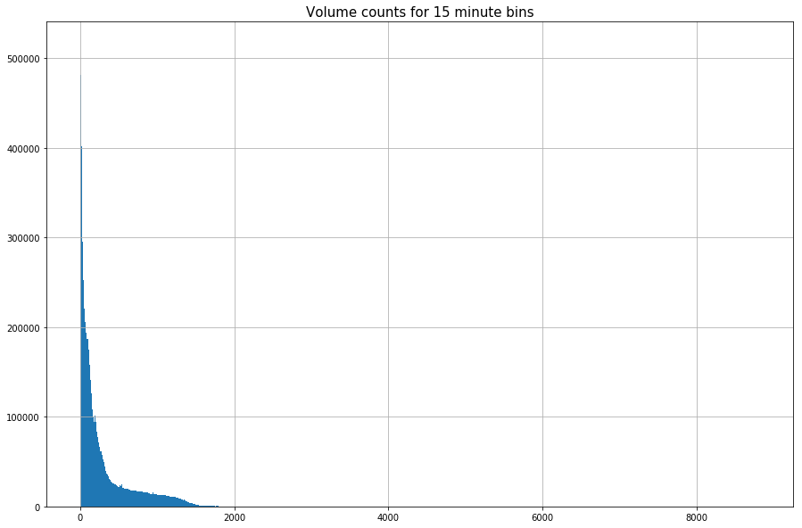


```python
max(volumes_perm['volume_15min'])
```


```python
con.close()
```
