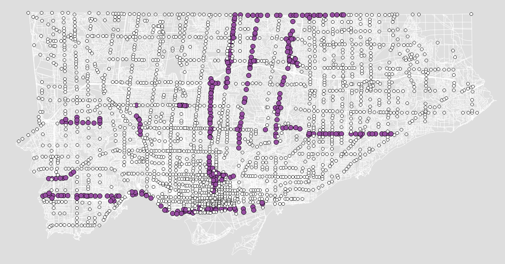

# Scoot Documentation
------
## Table of Contents
1. [Background](#1-background)
   * [Traffic Signal Control in Toronto](#traffic-signal-control-in-toronto-1)
   * [How SCOOT Works](#how-scoot-works-2)
   * [SCOOT Locations](#scoot-locations-3)
2. [Objective](#2-objective)
3. [Overview of ASTRID](#3-overview-of-astrid)
   * [Data Sources](#data-sources)
   * [Database Organization](#database-organization)
   * [Basic Data Types](#basic-data-types)
4. [Key Terminology](#4-key-terminology)
5. [Extracting Data From ASTRID](#5-extracting-data-from-astrid)
   * [Extracting Archived Data](#extracting-archived-data)
   * [Extracting High Resolution Data](#extracting-high-resolution-data)

## 1. Background
### Traffic Signal Control in Toronto [<sup>1</sup>](http://www1.toronto.ca/wps/portal/contentonly?vgnextoid=a6c4fec1181ec410VgnVCM10000071d60f89RCRD&vgnextchannel=9452722c231ec410VgnVCM10000071d60f89RCRD)
Transportation Services uses two traffic signal systems to control its 2,330 traffic control signals.

**TransSuite Traffic Control System (TransSuite TCS)**: TransSuite TCS is a hybrid traffic control system that relies on second-by-second communication to monitor signal operations, but relies on field equipment to maintain coordination (i.e. the field equipment can maintain signal coordination for about 24 hours if there is a loss of communication). TransSuite TCS does not directly control signal movements, but commands each intersection controller to follow a timing plan that resides within its local database. TransSuite then verifies that the controller adheres to the commanded timing plan. Intersection controllers are monitored and controlled through a user interface. TransSuite TCS supports a variety of phase-based controllers.

**Split Cycle Offset Optimization Technique/Urban Traffic Control (SCOOT/UTC)**: SCOOT is an adaptive traffic control system that determines its traffic timing plans based on real-time information received from vehicle detectors located on the approaches to signalized intersections. Like MTSS, SCOOT relies on telephone communication to maintain signal coordination. UTC is a traffic control system that operates in tandem with SCOOT; it also relies on telephone communications. UTC provides pre-determined signal timing plans and is used as a stopgap measure if SCOOT is not available. SCOOT signals are sometimes called "smart" signals.

### How SCOOT Works [<sup>2</sup>](http://www.scoot-utc.com/DetailedHowSCOOTWorks.php) 
The operation of the SCOOT model is summarised in the diagram below. SCOOT obtains information on traffic flows from detectors. As an adaptive system, SCOOT depends on good traffic data so that it can respond to changes in flow. Detectors are normally required on every link. Their location is important and they are usually positioned at the upstream end of the approach link. Inductive loops are normally used, but other methods are also available.  


When vehicles pass the detector, SCOOT receives the information and converts the data into its internal units and uses them to construct "Cyclic flow profiles" for each link. The sample profile shown in the diagram is colour coded green and red according to the state of the traffic signals when the vehicles will arrive at the stopline at normal cruise speed. Vehicles are modelled down the link at cruise speed and join the back of the queue (if present). During the green, vehicles discharge from the stopline at the validated saturation flow rate.

The data from the model is then used by SCOOT in three optimisers which are continuously adapting three key traffic control parameters - the amount of green for each approach (Split), the time between adjacent signals (Offset) and the time allowed for all approaches to a signalled intersection (Cycle time). These three optimisers are used to continuously adapt these parameters for all intersections in the SCOOT controlled area, minimising wasted green time at intersections and reducing stops and delays by synchronising adjacent sets of signals. This means that signal timings evolve as the traffic situation changes without any of the harmful disruption caused by changing fixed time plans on more traditional urban traffic control systems.

#### Scoot Detector Processing
The way that SCOOT processes data from its detectors affects the information available. In SCOOT detectors are required on every link under control and so flow data is available for every link. However, to minimise costs, the flow and occupancy data from detectors is processed in a way that allows good control with only one loop per 2 lanes on a link. The result of the processing is traffic demand on the link in SCOOT's internal units, **link profile units** (LPUs). Whilst LPUs are good for traffic control the relationship between LPU and vehicle flow is link dependant. A good measure of vehicle flow is directly available for those links that have one loop per lane (at least all single lane approaches). For other links a basic conversion value of 17 LPU per vehicle is provided as standard, but for more accurate flow information a link specific LPU to vehicle factor should be manually measured.

### SCOOT Locations [<sup>3</sup>](http://www1.toronto.ca/wps/portal/contentonly?vgnextoid=965b868b5535b210VgnVCM1000003dd60f89RCRD) 
SCOOT is currently installed on the following routes:

- Lake Shore Blvd from East Don Roadway to Windermere Ave
- Black Creek Dr from Lawrence Ave to Weston Rd
- The Queensway from The West Mall to Colborne Lodge
- Bayview Ave from Steeles Ave to Moore Ave
- Eglinton Ave E from Leslie St to Cedar Rd
- Don Mills Rd from Steeles Ave to Overlea Blvd
- Dundas St from Neilson Rd to Aukland Rd
- Steeles Ave from Yonge St to Kennedy Rd
- Yonge St from Steeles Ave to Mill St
- Avenue Rd from Highway 401 WB Offramp to Chaplin Cr
- Bloor St from Avenue Rd to Castlefrank Rd
- Downtown Core (Bay St, Church St, Charles St, Davenport Rd, Grosvenor St, Isabella St, Jarvis St, Sherbourne St and Wellesley St)
- Eglinton Ave W from Royal York Rd to Highway 27
- Lawrence Ave W from Bolingroke Rd to Shermount Ave



## 2. Objective
This document provides an overview of SCOOT data, including how to extract information from the ASTRID system, and overview of file structure, and (eventually) how to set up ongoing messages/reporting from SCOOT.

## 3. Overview of ASTRID
This information is mostly transcribed from the ASTRID User Guide.

ASTRID is the database designed to colelct infomration and store the data for later retreieval and analysis, as described in the ASTRID User Guide:

> The SCOOT Urban Traffic Control system optimises signal timings in a network to minimise stops and delay. Data used by the SCOOT model in the optimisation process, such as delays, flows and congestion, are available to traffic engineers through the ASTRID database system, which automatically collects, stores and processes traffic information for display or analysis. If the data is converted into an appropriate format, ASTRID can also process data from sources other than SCOOT.
> 
ASTRID was originally developed at the University of Southampton for the Transport and Road Research Laboratory as an off-line version running on an IBM-compatible PC ASTRID has been further developed into an on-line version as part of the DRIVE 2 projects HERMES and SCOPE/ ROMANSE, and received funding from DIM division, Department of Transport. This version has been operating successfully in Southampton and London since 1993.
> 
ASTRID is a database designed to collect information from a SCOOT traffic control system, or other source of time-varying traffic data, and to store it in a database for later retrieval and analysis. The name ASTRID means Automatic SCOOT Traffic Information Database.
> 
The on-line version of ASTRID runs on a computer operating under the Open VMS operating system. In the past ASTRID has required a separate machine for 
its operation. Feasibility studies showed that it was possible to run ASTRID in the same machine as a UTC system, and ASTRID has now been issued to allow this to be used in practice.

### Data Sources

#### Cells 
ASTRID is designed primarily to receive data from SCOOT traffic control systems, but data can also be received from other sources. Each source of data is referred to as a cell, which often refers to a specific SCOOT computer but can equally well mean an independent source of data. A cell is given a name consisting of 2 digits. 

#### Messages
Each cell supplies a stream of messages that contain the data required to be stored in the database. The messages for ASTRID are in an amended format from the standard SCOOT messages, but contain the same information. The following information is required for each message to be processed by ASTRID:

1. Date 
2. Start time 
3. End time 
4. Message type 
5. Site 
6. Data value 
7. Fault indicator 

A message can contain more than one data value. 

### Database Organization
#### Site
The ASTRID database is organised by site, which is the location where data is collected. There are several types of sites:

1. An **area** represents a whole cell. There are currently three areas defind (A01, A02 and A03) whcih correspond to (_fill in_). 
2. A **region** is a SCOOT region, which referes to a single coordination/control area. Currently 72 regions are defined. 
3. A **node** is a SCOOT node, or an equivalent for a non-SCOOT data source. 
4. A **stage** is a SCOOT stage, or an equivalent for a non-SCOOT data source. 
5. A **link** is a SCOOT link, or an equivalent for a non-SCOOT data source. 
6. A **detector** is a SCOOT detector, or an equivalent for a non-SCOOT data source. 
7. A **route** is a set of links which has been defined to ASTRID by the user. A route may consist of links representing a particular route through the network, or it may be a set of disconnected links which the user wishes to consider together. 
8. A **group** is sub-area or equivalent group of equipment. 
9. A **car park** is a single car park. It may have a number of in and out counts.
10. A **cnt** is a count taken directly from a count source, not derived by the use of conversion factors.

Additional unknown site types (They exist in ASTRID but not in the documentation):

11. Sensor
12. Outstation
13. Intersection
14. Pelican

#### Resolution 
The time resolution of data (except the trend periods) can be configured as part of the initial installation of ASTRID. The values given here are typical values. Data are stored at one of three types of resolution

1. Data entering ASTRID are at high resolution. The exact resolution depends on the message being processed, but M02 messages are normally cyclic or at 5-minute resolution, and M08 and M29 messages are cyclic. Data at their resolution are stored for a few days, at most, as the storage requirements are very large. This resolution of data can be appropriate for analysing incidents or other effects on the network. The raw files are stored at this resolution. 
2. Data are stored at medium resolution for the longer term. The time resolution of 15 minutes is a compromise between detail of information and storage requirements. The profiles are stored at this resolution.
3. Data at low resolution are divided into a few time periods per day, covering peak and off-peak periods as a whole. Because the storage requirements are so much less, data can be stored for years at this resolution. The trend files are stored at this resolution. 

#### File types 
The files are organised as four separate file types which contain data at different 
resolutions and for different periods:

1. **Raw files**: contain raw data for the last few days only at high resolution. 
2. **Profiles files**: contain average data per weekday at a medium resolution. 
3. **Trend files**: contain data per day at low resolution. 
4. **Bac files**: contain data per day at medium resolution. 

### Basic Data Types
These data types are collected directly from messages and are stored in the
ASTRID database.

1. **Flow**: The M02 message gives SCOOT flow. It is measured in lpu/h and differs from actual flow in several respects:
    - Because it is measured in lpu/h it should strictly be converted to vehicles with a link-dependent (and possibly time-dependent) conversion factor. 
    - It is subject to the maximum queue; flow which is measured but which is modelled as exceeding the maximum queue is not included. 
    - The modelled flow is retained from a previous cycle if the SCOOT detector is seen as congested This is essential for the correct operation of the SCOOT optimisers in congested conditions, but does mean that the flow values obtained do not necessarily reflect the street in the circumstances. The F01 message gives a flow value based on count detector input 
2. **Stops**: The M02 message gives SCOOT stops, which represent the number of stops on the link as modelled by SCOOT. It is measured in lpu/h and is output by ASTRID in veh/h. 
3. **Delay**: The M02 message gives SCOOT delay, which represents the delay on the link as modelled by SCOOT. The value is in lpus and can be thought of as the average queue length on the link throughout the period. It is stored in ASTRID to a resolution of 0-l vehicles and is output in vehicles. 
4. **Congestion**: The M02 message gives raw congestion, unprocessed by SCOOT. The term 'congestion' in SCOOT is based on the concept of a congested interval; this is a period of 4 seconds for which the detector (or any one of the detectors) on the link is covered. The raw congestion is the total length of these congested intervals as a proportion of the length of the period; it has not been processed by the SCOOT model. It is stored in ASTRID to a resolution of l% and is output in percent. 
5. **Saturation**: The M08 message gives the degree of saturation of a link as modelled by SCOOT. It is output by ASTRID in percent. 
6. **Historic flow parameters** The M45 message produces 4 parameters which are stored by ASTRID and can be fed back into SCOOT. They enable SCOOT to produce a default profile when detectors are faulty and can be used instead of the default split and default offset values. The four values are: Historic cyclic flow, Historic green flow, Historic cycle length and Historic green length.
7. **Detector flow**: The detector flow is a value for flow calculated by counting the number of transitions of the detector state from off to on. For detectors covering only one lane it should give an accurate flow count; for other detectors it will give an underestimate depending on the amount of masking. This parameter is not suitable for use by the SCOOT model or optimisers but is used by the INGRID incident detection system, and can be used wherever a value for flow is required which is not influenced by the SCOOT model. 

### Derived Data Tpyes
These data types are not stored in the ASTRID database but are derived from data stored there by straightforward calculations. The user can access and display these data types in the same way as the basic data types.

1. **Vehicle delay** The vehicle delay, or delay per vehicle, is obtained by dividing the delay by the flow, giving a value in seconds and eliminating the dependence on lpu factors. This is SCOOT's estimate of the delay suffered by a vehicle on the link.
2. **Journey time**: The journey time is obtained by adding the vehicle delay to the cruise time. It gives SCOOT's estimate of the time for an average vehicle to travel the link. The cruise time can be entered in the ASTRID database as part of the installation process but is not automatically updated from the SCOOT value.
3. **Speed**: This is derived from the link length, the cruise time and the vehicle delay as follows: *s = 3.6·l/(t + d)*, where *s* is the speed in km/h, *l* is the link length (m), *t* is the cruise time on the link (s), *d* is the vehicle delay on the link (s).
4. **Congestion index**: This is derived from the vehicle delay and the link cruise time as follows: *c = (t + d)/t*, where *c* is the congestion index, *t* is the cruise time on the link (s), *d* is the vehicle delay on the link (s).
The congestion index is a dimensionless measure of the delay on the link such that no delay gives a congestion index of 1, if the delay is equal to the cruise time the congestion index is 2 and so on with higher values of congestion index indicating greater levels of delay. In SCOOT terminology it is a measure of delay rather than congestion, but the term congestion index is used in a wider context.
5. **Vehicle occupancy**: This is derived by dividing the detector occupancy by the detector flow to give the average occupancy of a vehicle. It is output in milliseconds per vehicle (ms/veh).
6. **Lpu factor**: An estimate of the lpu factor is derived from the vehicle occupancy. It is output in lpus per vehicle (lpu/veh).

#### Summary of Data Types

Code|Level|Message|Parameter|Units|Description
----|-----|-------|---------|-----|-----------
flow|link|M02|p8|veh/h|Flow
stops|link|M02|p6|veh/h|Stops
del|link|M02|p7|veh|Delay
cong|link|M02|p10|%|Congestion
dsat|link|M08|p5|%|Saturation
hflwc|link|M45|p5|veh/h|Historic cycle flow
hflwg|link|M45|p7|veh/h|Historic green flow
hlenc|link|M45|p6|s|Historic cycle length
hleng|link|M45|p8|s|Historic green length
rflow|det|M29|p6|veh/h|Det|flow
rocc|det|M29|p7|%|Det|occ
slen|stg|M17|p5|s|Stage|length

## 4. Key Terminology
**ASTRID**: Automatic SCOOT Traffic Information Database. ASTRID is the database used to collect, store and process the traffic information used for the SCOOT model (delays, flows and congestion)for display or analysis.  
**SCOOT**: Split Cycle Offset Optimisation Technique. The Traffic-Adaptive signal control system that optimises signal timings (splits, cycles lengths and offsets) in a network to minimise stops and delay  
**UTC**: Urban Traffic Control: The traffic control system that operates in tandem with SCOOT. UTC provides pre-determined signal timing plans and is used as a stopgap measure if SCOOT is not available  
**MTSS**: Main Traffic Control System: Legacy computer controlled traffic control system developed in house at the City of Toronto in the 1960s. MTSS has been fully phased out.  
**LPU**: Link Profile Units: interal SCOOT units that result from SCOOT's traffi cprocessing. Can be converted to link volume using a conversion factor calibrated to each site. Where one loop per lane, lpu = vehicles.


## 5. Extracting Data From ASTRID
### Extracting Archived Data

The following information was provided by Siemens to extract data from a windows command prompt with administrator access on the UTC/SCOOT server. The easiest way to get this to run the “UTC Command Prompt” from Start-> All Program -> Siemens Traffic Controls -> UTC -> Support Tools or on recent version of Windows, just type “UTC Command Prompt” at the Start Menu.

1) Set the current directory to wherever the ASTRID data is stored. (Normally D:\ASTRID)
    ```
    cd /d D:\ASTRID
    mkdir extract
    cd extract
    ```

2) Extract the names of all the detectors into a file called dets.tmp
    ```
    dirsite ..\profiles\*.pro dets.tmp /m:N99999Z9
    ```

3) Use detectors file as an input to “extract” to select the sites wanted. If you don't want all detectors, edit this file and remove the ones you don't want. We extract rflow (Detector Flow), rocc (Detector Occupancy), vocc (Vehicle Occupancy) and lpuf (LPU factor) data sets. *See ASTRID Handbook User Guide, page 14 for data types available.*

4) Extract the current days data. (up to 20 minute lag).
    ```
    extract @dets.tmp day /d:rflow:rocc /it:M /o:dets_current_day.txt
    ```

5) Extract the data for the current month.
    ```
    extract @dets.tmp bac /d:rflow:rocc /it:M /o:dets_current_month.txt
    ```

6) Extract the data for a single month
    ```
    extract @dets.tmp bac /d:rflow:rocc /it:M /ms:201612 /o:dets_2016_12.txt
    ```

These examples just extract the specified data in the default format which is a fixed with text format that could easily be parsed. E.g.

    ;================================================================
    ; EXTRACT @dets.tmp BAC /D:RFLOW:ROCC:VOCC:LPUF /IT:M /MS:201701 /O:DETS_201701.TXT
    ;
    ; We 15-Feb-2017 16:30:15
    ;                                       Det    Det Vehic-    LPU 
    ;                        Start   End  Flow*   Occ* le Occ Factor 
    ;  Site      Day  Date    Time  Time   Mean   Mean   Mean   Mean 
    ;               yyyymmdd hh:mm hh:mm  veh/h      % ms/veh lpu/ve 
    ;----------- -- -------- ----- ----- ------ ------ ------ ------ 
    N10111A1     SU 20170101 00:15 00:30    344    4.1    429  11.40 
    N10111A1     SU 20170101 00:30 00:45    332    4.0    434  11.51 
    N10111A1     SU 20170101 00:45 01:00    392    4.9    450  11.88 
    N10111A1     SU 20170101 01:00 01:15    396    4.8    436  11.56 
    N10111A1     SU 20170101 01:15 01:30    316    3.8    433  11.49 
    N10111A1     SU 20170101 01:30 01:45    360    4.0    400  10.72 
    N10111A1     SU 20170101 01:45 02:00    336    3.8    407  10.88 
    N10111A1     SU 20170101 02:00 02:15    356    4.0    404  10.81 
    N10111A1     SU 20170101 02:15 02:30    348    3.8    393  10.55 
    N10111A1     SU 20170101 02:30 02:45    268    3.3    443  11.72 
    N10111A1     SU 20170101 02:45 03:00    176    2.2    450  11.88 
    ...

If you have savefiles, those zip files contain the zipped up bamfiles. However, if you just unzip them to bac_YYYYMM_saved, the directory will get deleted by ASTRID within the next 24 hours (?) as it is older than 5 years, so instead you should unzip to a folder in the form bac_YYYYMM_restored, and then ASTRID will leave it alone. On the ‘extract’ command line you should use the /mr switch instead of /ms. Alternatively, disk space allowing, we could just increase the period of time that the files will be kept – e.g. 10 years, by sending you a new license file.

### Extracting High Resolution Data

Using rflow as example. From ASTRID -> Options -> Messages we can see that rflow comes from M29 and it multiples that raw count by 900 and divides it by the period (time interval) to convert to a 15 minute flow rate for storage. The period is parameter 5, the data (vehicle count) appears in parameter 6. In this context, the parameter number relates to the internal structure. What you need to know is that parameter 5  => data value 1, parameter 6 => data value 2, etc. From ASTRID -> Options -> Graphs, we can see that the 15 minute rate is multiplied by 4 when extracted (to convert the 15 minute flow rate to vehicles per hour).

It is also useful to look at the definition of the message. In this case, HELP SCOOT MESSAGE M29 shows

      M29     Det  <DET> PERIOD aaa  FLOW bbb  OCC cccc
      Raw detector flow and occupancy during whole cycle.
      PERIOD  is the region cycle time (period s).
      FLOW    is the number of 0 to 1 transitions of the detector (raw flow).
      OCC     is the number of 1 bits seen on the detector (raw occupancy).
      This message is output once per cycle, 20 seconds into the region cycle.

So now we are ready to make sense of the data.

The raw data is stored in hourly files in <ASTRID>\rawfiles in the form `asCCYYYYMMDDHH.dat` where YYYY,MM,DD,HH are the date and hour and CC is the TCC (01 for TCC A)

From a UTC support command prompt, use `ast2mes`
    
    CD /D D:\ASTRID\extract
    REM extract raw M29 data for all sites on TCC A for 17:00-18:00 24th Jan 2017.
    ast2mes ..\rawfiles\as012017012408.dat /m:m29 m29.txt

This generates a file that looks like this. (This comes from a simulated system so won’t be realistic).

    ; ASTRID data  Header 1  Cell '01'  Date 24-Jan-2017  Reg size 6  Site size 12
    08:00:06 M29  N93113B1      96     21    56
    08:00:06 M29  N93113D1      96     21    56
    08:00:06 M29  N93123F1      96     21    56
    08:00:06 M29  N93123H1      96     21    56
    08:00:06 M29  N93131A1      96     16    24
    08:00:06 M29  N93131B1      96     21    56
    08:00:06 M29  N93131D1      96     16    24
    08:00:06 M29  N57123A1      40      8    16
    08:00:09 M29  N12113K1     112     24    61
    08:00:09 M29  N12123D1     112     24    61
    08:00:09 M29  N12131I1     112     24    61
    08:00:09 M29  N12131J1     112     19    29
    08:00:09 M29  N12131K1     112     24    61
    08:00:09 M29  N12131L1     112     19    29
    08:00:09 M29  N12131X1     112     19    29
    08:00:09 M29  N12143A1     112     24    61
    08:00:09 M29  N12143B1     112     23    60
    08:00:09 M29  N12151I1     112     24    61
    08:00:09 M29  N12151J1     112     22    58
    08:00:09 M29  N12151K1     112     18    28
    08:00:09 M29  N12151L1     112     18    28
    08:00:09 M29  N12151M1     112     18    28
    08:00:09 M29  N12151X1     112     18    28
    ...

So remember that data value 1 (parameter 5) is the period in seconds. Data value 2 is the raw count. So taking N12151X1 as the an example, this is 18 vehicles in 112 seconds => flow rate of 578 vehicles/hr


## 4. Sources

Blackett, Matthew. 2010. “Traffic Lights: Organizing Chaos - Spacing Magazine.” Spacing. February 12. http://spacing.ca/magazine/section/infrastructure-fetish/traffic-lights-organizing-chaos/.

Bowen, G T. 2002. “ASTRID Handbook: User Guide.” 0530 Issue C.

Greenough, John C., and W. Les Kelman. 1998. “METRO TORONTO SCOOT : TRAFFIC ADAPTIVE CONTROL OPERATION.” ITE Journal on the WEB. http://citeseerx.ist.psu.edu/viewdoc/download?doi=10.1.1.417.5832&rep=rep1&type=pdf.

Hounsell, N, and F McLeod. 1990. “ASTRID: Automatic SCOOT Traffic Information Database.” Contractor Report 235. Transport and Road Research Laboratory: Department of Transport. https://trl.co.uk/sites/default/files/CR235.pdf.

Siemens Mobility. 2012. “ASTRID and INGRID User Guide.” 666/HS/16940/000. https://www.siemens.co.uk/traffic/pool/downloads/handbooks/utc/666_hs_16940_000.pdf.


