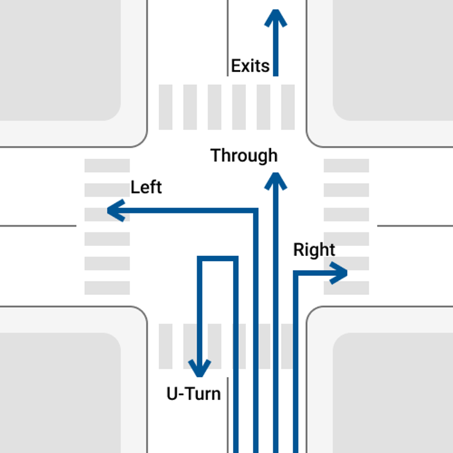
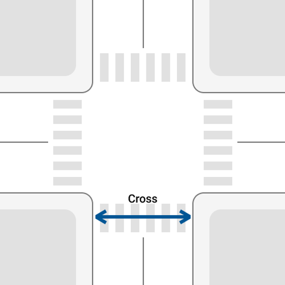
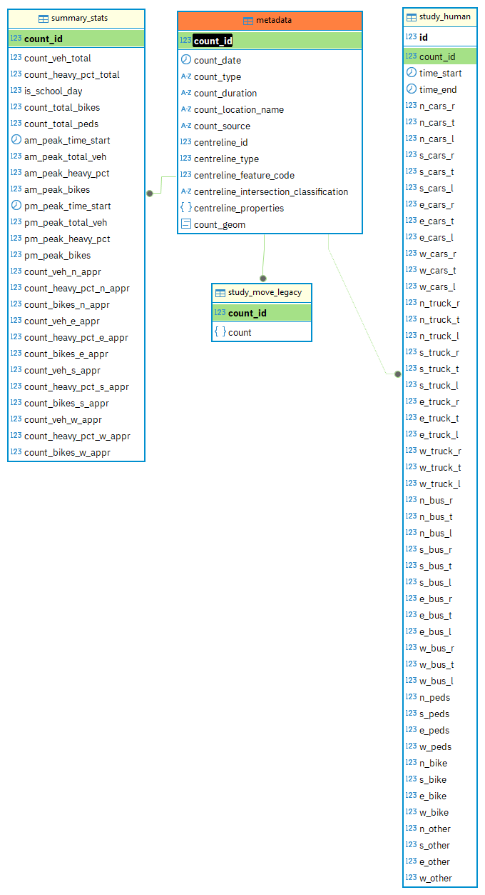
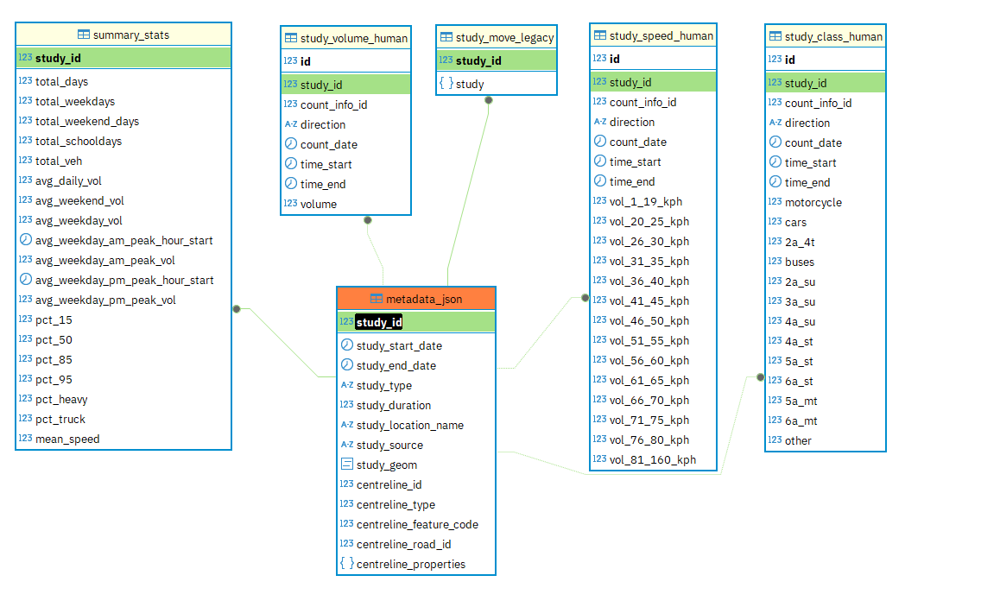

# Short Term Traffic Volumes <!-- omit in toc -->

Short-term Traffic volume data (traffic counts and turning movements) from the FLOW database and other data sources.

## Table of Contents <!-- omit in toc -->

- [Introduction](#introduction)
- [What is counted?](#what-is-counted)
  - [Turning Movement Counts (TMC)](#turning-movement-counts-tmc)
  - [Midblock Speed-Volume-Classification (SVC) (Previously Automated Traffic Record (ATR))](#midblock-speed-volume-classification-svc-previously-automated-traffic-record-atr)
- [Where does it come from?](#where-does-it-come-from)
- [How often is data updated?](#how-often-is-data-updated)
- [Where can I access the data?](#where-can-i-access-the-data)
- [Where can I find what data?](#where-can-i-find-what-data)
- [How is the data structured?](#how-is-the-data-structured)
  - [Core Tables](#core-tables)
    - [Vehicle movement](#vehicle-movement)
    - [Bike movement](#bike-movement)
    - [Pedestrian movement](#pedestrian-movement)
    - [TMC Relations](#tmc-relations)
    - [SVC Relations](#svc-relations)
  - [Other Useful Tables](#other-useful-tables)
- [Useful Views](#useful-views)
- [Cycling Seasonality Adjustment](#cycling-seasonality-adjustment)
- [What's the old FLOW Oracle Schema?](#whats-the-old-flow-oracle-schema)

## Introduction

The City of Toronto collects ad-hoc traffic volume data for projects and service requests. The traffic data collection program serves many internal transportation projects and operations teams for project planning, capital planning, engineering design, project analysis, and operational functions like signal timing.

The most common traffic studies conducted are the **Turning Movement Count** (TMC) and the **Midblock Speed-Volume-Classification (SVC)** count (previously known as the **Automated Traffic Recorder** (ATR) count). TMCs observe movements of motor vehicle, bicycle, and pedestrian volumes at intersections. SVCs observe volumes, speeds, and vehicle classification of motor vehicles travelling along a section of road.

Other studies include pedestrian delay and classification, pedestrian crossover observation, stop-sign compliance, queue-delay, cordon count, and radar speed studies.

## What is counted?

### Turning Movement Counts (TMC)

- Type of road user: car, truck, bus, bicycle, pedestrian, other
- Intersection approach leg: N / S / E / W
- Type of movement:
  - Motor vehicle: Through / Left / Right
  - Cyclist: cyclist volume by approach leg (this includes bikes in crosswalks on Spectrum counts.)
  - Pedestrian: pedestrian volume by leg of intersection crossed

#### Data Elements <!-- omit in toc -->
* 15 min aggregated interval time
* 15 min aggregated volume per movement (turning and approach) by:
	- vehicle types
	- cyclists and pedestrian counts are approach only
	
#### Notes <!-- omit in toc -->
* Counts are typically conducted on Tuesdays, Wednesdays, and/or Thursdays during school season (September - June) for 1 to 3 consecutive days
* If collected data varies more than defined historical value threshold by 10%, the collected data will not be loaded
* Volumes are available at both signalized and non-signalized intersections
* Each count station is given a unique identifier to avoid duplicate records
* Data will not be collected under irregular traffic conditions (construction, closure, etc), but it maybe skewed by unplanned incidents

### Midblock Speed-Volume-Classification (SVC) (Previously Automated Traffic Record (ATR))

- Volume
  - Direction
  - Volume
- Speed
  - Direction
  - Speed bin
  - Volume
- Vehicle classification
  - Direction
  - Vehicle classification
  - Volume

#### Data Elements <!-- omit in toc -->
* Direction
* 15 min aggregated interval time
* 15 min volume
	- typically aggregated by direction, although data may be available by lane

#### Notes <!-- omit in toc -->
* The counts represent roadway and direction(s), not on a lane-by-lane level
* No regular data load schedule
* Typical ATR counts 24h * 3 days at location in either 1 or both directions
* Each PCS/ATR is given a unique identifier to avoid duplicate records

## Where does it come from?

The City of Toronto retains a traffic counting contractor who conducts data collection. They schedule and install temporary counting equipment, or send staff into the field to observe volumes, and process data.

Data are collected through various technologies. Originally, data were collected by field staff who would manually observe and record volumes. Pneumatic road tubes were introduced to record motor vehicle volumes, speeds, and classifications. More recently, counting has shifted to video observation.

Once the City receives data from the contractor, staff load the data into our database. Until recently, staff would load data files into a legacy Oracle database through an application called "FlowLoad". Data would then be retrieved through a user interface application called "Flow", where the data were formatted into nice reports. In recent years, "Flow" was replaced by [MOVE](https://github.com/CityofToronto/bdit_flashcrow). For TMC's an API has been set up to ingest data directly from the contractor into the MOVE database, then copied into bigdata. An API for SVC's is in the works.

## How often is data updated?

Traffic counts are conducted ad-hoc, usually on request for a specific project need. As such, the data is not necessarily systematically collected. We do not have comprehensive coverage across time or space. However, it is worth noting that there are now proactive counts being done for areas that have been identified as needing updated data.

TMCs are processed automatically, nightly, once made available from the contractor. ATRs are loaded manually by staff once data files are received from the contractor.

## Where can I access the data?

Internal to the Transportation Data & Analytics team, legacy data flows from legacy Oracle database, nightly to MOVE (`flashcrow` RDS), and is then replicated to the `bigdata` RDS. Newer data is loaded directly into MOVE and then replicated to the `bigdata` RDS.

Look in the `traffic` schema for all ad-hoc data tables.

## Where can I find what data?

Speed Volume Classification counts and Turning Movement Counts are being replicated into Bigdata `traffic` schema from MOVE (FLASHCROW database). Every table that is replicated has a link to internal documentation for the corresponding table on FLASHCROW in the table comment, viewable in table properties in PGAdmin.

Public documentation including data dictionaries are accessible on the Open Data pages:

- SVC: [Traffic Volumes - Midblock Vehicle Speed, Volume and Classification Counts](https://open.toronto.ca/dataset/traffic-volumes-midblock-vehicle-speed-volume-and-classification-counts/) 
- TMC: [Traffic Volumes - Multimodal Intersection Turning Movement Counts](https://open.toronto.ca/dataset/traffic-volumes-at-intersections-for-all-modes/)

Load Sources Summary

| Study Type                      | FlowLoad (study_source = 'OTI / FlowLoad')       | MOVE Loader (study_source = 'MOVE Load') | Spectrum API Loader (count_source = SPECTRUM / LEGACY) |
|---------------------------------|--------------------------------------------------|------------------------------------------|--------------------------------------------------------|
| Turning Movement Count          | All-time TMC data*                               | n/a                                      | September 2023 to present                              |
| Volume ATR                      | All-time Volume ATRs**                           | n/a                                      | n/a                                                    |
| Speed / Volume ATR              | All-time Speed/Vol ATRs*                         | May 2023 to present                      | n/a                                                    |
| Vehicle Classification ATR      | Classification ATR data from 1985 to May 2023*** | No Classification ATR data loaded***     | n/a                                                    |

## How is the data structured?

### Core Tables

The database is structured around three types of tables: metadata, count observations, summary stats, and reference tables (spatial, temporal, or categorical).

The mapping of tables between Bigdata-MOVE-Open Data is summarized below. Replicated tables have a documentation link in the table comment, viewable in PGAdmin in table properties.

| Bigdata `traffic` Table         | MOVE (FLASHCROW) Table       | Open Data file | Description |
|---------------------------------|------------------------------|------------------------------------------|--------------------------|
| `svc_metadata` | `atr.metadata_json` | included in `svc_summary_data` | Table containing 15-minute observations for classification ATRs (SVCs). |
| `svc_study_class` | `atr.study_class_human` | `svc_raw_data_class_*` | Table containing 15-minute observations for classification ATRs (SVCs). |
| `svc_study_speed` | `atr.study_speed_human` | `svc_raw_data_speed_*` | Table containing 15-minute observations for speed volume ATRs (SVCs). |
| `svc_study_volume` | `atr.study_volume_human` | `svc_raw_data_volume_*` | Raw SVC volume counts. |
| `svc_summary_stats` | `atr.summary_stats` | `svc_summary_data` and `svc_most_recent_summary_data` | Summary statistics for ATR (SVC) counts. Join to atr.metadata_json for full study metadata. |
| `tmc_metadata` | `tmc.metadata` | included in `tmc_summary_data` | Count-level study metadata for TMCs that contains all counts including both 14 and 8 hour legacy counts. Studies have been joined to the MOVE centreline. |
| `tmc_study_data` | `tmc.study_human` | `tmc_raw_data_*` | Table containing 15-minute observations for TMCs |
| `tmc_summary_stats` | `tmc.summary_stats` | `tmc_summary_data` and `tmc_most_recent_summary_data` | Count level summary statistics for all TMCs. |
| `fhwa_classes` | - | `fwha_classification.png` | Provides a reference for the FWHA classification system. [Notion doc](https://www.notion.so/bditto/Feature-Classification-ATRs-27ece0049d654c9ba06136bffc07e2e8?pvs=4#e618feab5f8d4bb48e88f879915cbeab) |
| `midblocks` | `centreline2.midblocks` | - | Simplified midblock network to which MOVE2 conflates studies to. Includes improved naming for midblock segments. |
| `intersections` | `centreline2.intersections` | - | Simplified intersection file that corresponds to the midblocks used by MOVE 2. |
| `pxo` | `centreline2.pxo` | - | Contains a mapping of `intersection_id` or `midblock_id` to `px` crossing numbers for pedestrian cross-overs. | 
| `traffic_signal` | `centreline2.traffic_signal` | - | Contains a mapping of `intersection_id` or `midblock_id` to `px` crossing numbers for traffic control signals. |
| `mto_length_bin_classification` | - | - | MTO 6 length bin classification guide. Used to summarize vehicle lengths observed |
| `studies` | `counts2.studies` | included in `svc_summary_data` | Contains metadata for all study types available in MOVE. Copied from "move_staging"."counts2_studies", this table uses the legacy data structure and only use it when comparing to whats in the MOVE web application. |

Useful Views
  - `svc_daily_totals` - A daily summary of `traffic.svc_unified_volumes` by leg and centreline_id. Only rows with data for every 15 minute timebin are included. 
  - `svc_unified_volumes` - A unified view of Speed, Volume, and Classification study volumes by 15 minute bin.

Note on `study_id`
- The SVC count identifier `study_id` are common for a given centreline_id and multi-day study
- This means `study_id` is common for the two directions of traffic at a midblock SVC count if they map to the same location (centreline_id). If they were done on opposite side of the an interseciton (a common scenario), the two directions will have separate `study_id`. This scenario still requires manual matching of studies to group directional data obtained on the same day, if desired.
- Because `study_id` is point-location-based, it will adapt to version changes of the Toronto centreline

#### Vehicle movement
The following image depicts motor vehicle movements. This example shows south approach, or northbound travel, movements.

- `S_[CARS|TRUCK|BUS]_L`
- `S_[CARS|TRUCK|BUS]_T`
- `S_[CARS|TRUCK|BUS]_R`

Notes:
- Exits can be calculated by summing associated movements.
- U-turns are currently not available [in `bigdata`](#where-can-i-access-the-data).

#### Bike movement

At the time of writing, bike totals are reported only by the number of cyclists that enter the intersection from a given approach/leg and the number of "bikes on crosswalk". Turning movements are currently not available [in `bigdata`](#where-can-i-access-the-data).

#### Pedestrian movement

Pedestrians are counted based on the side of the intersection they cross on. The example below shows `S_PEDS` or pedestrians crossing on the south side of the intersection. Note that they could be travelling either east or west in this example.

Pedestrians are only counted when they cross the roadway, meaning that pedestrians who turn at the intersections without crossing the roadway are _not_ counted.

For 3-legged or "T" intersections, pedestrians have typically _not_ been counted on the side of the intersection without a crosswalk, even when present in large numbers. The count in these cases will be given as zero. Going forward however (circa late 2024), the intention is to count that sidewalk as though it was a crossing of a typical 4-legged intersection.

#### TMC Relations

##### `tmc.metadata`
Remember, TMCs can occur at both intersections and midblocks.
| |column_name |data_type|is_nullable|description|
| --------------- | ---------- | ------- | --------- | --------- |
| 1|`count_id`|bigint |NO |Unique identifier for each count. Spectrum counts share the same `request_id` or `study_id` as `count_id`|
| 2|`count_date`|date |NO |Date the count was conducted. For Turning Movement Counts, studies are conducted on one day only.|
| 3|`count_type`|text |NO |Disaggregate hour scheme during which the count was conducted, Routine or School hours |
| 4|`count_duration`|text |NO |Duration of count (14, 8R, 8S). 14 = 14-hours of data collected over a continuous period from 6:00am-8:00pm. 8R = 8-hours of data collected during the non-continuous Routine schedule of 7:30 - 9:30 / 10:00 - 12:00 / 13:00 - 15:00 / 16:00 - 18:00. 8S = 8-hours of data collected during the non-continuous School schedule of 7:30 - 9:30 / 10:00 - 11:00 / 12:00 - 13:30 / 14:15 - 15:45 / 16:00 - 18:00|
| 5|`count_location_name` |text |NO |Human-readable name of the location where the count was conducted generated from the initial study request.|
| 6|`count_source`|text |NO |Method/contractor from which the count was loaded/performed by.|
| 7|`midblock_id` |integer|YES|The most current Midblock ID reference spatially joined to the point geometry of the count location. Join to `traffic.centreline2_intersections`.|
| 8|`intersection_id` |integer |YES|The most current Intersection ID reference spatially joined to the point geometry of the count location. Join to `traffic.centreline2_intersections`.|
| 9|`centreline_feature_code` |integer|YES|Centreline feature code for midblock types. Type of road the count occurred on (Local, Collector, Major etc.) |
| 10|`centreline_intersection_classification`|character varying|YES|Type of intersection the count occurred on, see `gis.centreline_intersection` for descriptions. |
| 11|`centreline_properties` |jsonb|YES|Centreline features from other layers spatially joined. Includes PXOs, Traffic Signals and Schools with specified radii. Nested JSON structure.|
| 12|`count_geom`|geom |NO |Point geometry representation of the study.|

##### `traffic.tmc_study_data`
| |column_name|data_type|is_nullable|description|
|----------------|-----------|---------|-----------|-----------|
| 1|`id` |bigint |NO |Unique row identifier. |
| 2|`count_id` |bigint |NO |Unique identifier for each count. Spectrum counts share the same `request_id` or `study_id` as `count_id`. |
| 3|`time_start` |timestamp without time zone|NO |Start time of the 15-minute interval |
| 4|`time_end` |timestamp without time zone|NO |End time of the 15-minute interval |
| 5|`n_cars_r` |integer|NO |Volume of cars that enter the intersection from the north leg (approach), in a southbound direction of travel, and make a right turn.|
| 6|`n_cars_t` |integer|NO |Volume of cars that enter the intersection from the north leg (approach), in a southbound direction of travel, and continue through. |
| 7|`n_cars_l` |integer|NO |Volume of cars that enter the intersection from the north leg (approach), in a southbound direction of travel, and make a left turn. |
| 8|`s_cars_r` |integer|NO |Volume of cars that enter the intersection from the south leg (approach), in a northbound direction of travel, and make a right turn.|
| 9|`s_cars_t` |integer|NO |Volume of cars that enter the intersection from the south leg (approach), in a northbound direction of travel, and continue through. |
|10|`s_cars_l` |integer|NO |Volume of cars that enter the intersection from the south leg (approach), in a northbound direction of travel, and make a left turn. |
|11|`e_cars_r` |integer|NO |Volume of cars that enter the intersection from the east leg (approach), in a westbound direction of travel, and make a right turn.|
|12|`e_cars_t` |integer|NO |Volume of cars that enter the intersection from the east leg (approach), in a westbound direction of travel, and continue through. |
|13|`e_cars_l` |integer|NO |Volume of cars that enter the intersection from the east leg (approach), in a westbound direction of travel, and make a left turn. |
|14|`w_cars_r` |integer|NO |Volume of cars that enter the intersection from the west leg (approach), in a eastbound direction of travel, and make a right turn.|
|15|`w_cars_t` |integer|NO |Volume of cars that enter the intersection from the west leg (approach), in a eastbound direction of travel, and continue through. |
|16|`w_cars_l` |integer|NO |Volume of cars that enter the intersection from the west leg (approach), in a eastbound direction of travel, and make a left turn. |
|17|`n_truck_r`|integer|NO |Volume of trucks that enter the intersection from the north leg (approach), in a southbound direction of travel, and make a right turn.|
|18|`n_truck_t`|integer|NO |Volume of trucks that enter the intersection from the north leg (approach), in a southbound direction of travel, and continue through. |
|19|`n_truck_l`|integer|NO |Volume of trucks that enter the intersection from the north leg (approach), in a southbound direction of travel, and make a left turn. |
|20|`s_truck_r`|integer|NO |Volume of trucks that enter the intersection from the south leg (approach), in a northbound direction of travel, and make a right turn.|
|21|`s_truck_t`|integer|NO |Volume of trucks that enter the intersection from the south leg (approach), in a northbound direction of travel, and continue through. |
|22|`s_truck_l`|integer|NO |Volume of trucks that enter the intersection from the south leg (approach), in a northbound direction of travel, and make a left turn. |
|23|`e_truck_r`|integer|NO |Volume of trucks that enter the intersection from the east leg (approach), in a westbound direction of travel, and make a right turn.|
|24|`e_truck_t`|integer|NO |Volume of trucks that enter the intersection from the east leg (approach), in a westbound direction of travel, and continue through. |
|25|`e_truck_l`|integer|NO |Volume of trucks that enter the intersection from the east leg (approach), in a westbound direction of travel, and make a left turn. |
|26|`w_truck_r`|integer|NO |Volume of trucks that enter the intersection from the west leg (approach), in a eastbound direction of travel, and make a right turn.|
|27|`w_truck_t`|integer|NO |Volume of trucks that enter the intersection from the west leg (approach), in a eastbound direction of travel, and continue through. |
|28|`w_truck_l`|integer|NO |Volume of trucks that enter the intersection from the west leg (approach), in a eastbound direction of travel, and make a left turn. |
|29|`n_bus_r`|integer|NO |Volume of buses that enter the intersection from the north leg (approach), in a southbound direction of travel, and make a right turn. |
|30|`n_bus_t`|integer|NO |Volume of buses that enter the intersection from the north leg (approach), in a southbound direction of travel, and continue through.|
|31|`n_bus_l`|integer|NO |Volume of buses that enter the intersection from the north leg (approach), in a southbound direction of travel, and make a left turn.|
|32|`s_bus_r`|integer|NO |Volume of buses that enter the intersection from the south leg (approach), in a northbound direction of travel, and make a right turn. |
|33|`s_bus_t`|integer|NO |Volume of buses that enter the intersection from the south leg (approach), in a northbound direction of travel, and continue through.|
|34|`s_bus_l`|integer|NO |Volume of buses that enter the intersection from the south leg (approach), in a northbound direction of travel, and make a left turn.|
|35|`e_bus_r`|integer|NO |Volume of buses that enter the intersection from the east leg (approach), in a westbound direction of travel, and make a right turn. |
|36|`e_bus_t`|integer|NO |Volume of buses that enter the intersection from the east leg (approach), in a westbound direction of travel, and continue through.|
|37|`e_bus_l`|integer|NO |Volume of buses that enter the intersection from the east leg (approach), in a westbound direction of travel, and make a left turn.|
|38|`w_bus_r`|integer|NO |Volume of buses that enter the intersection from the west leg (approach), in a eastbound direction of travel, and make a right turn. |
|39|`w_bus_t`|integer|NO |Volume of buses that enter the intersection from the west leg (approach), in a eastbound direction of travel, and continue through.|
|40|`w_bus_l`|integer|NO |Volume of buses that enter the intersection from the west leg (approach), in a eastbound direction of travel, and make a left turn.|
|41|`n_peds` |integer|NO |Volume of pedestrians that cross the north leg (approach) of the intersection. |
|42|`s_peds` |integer|NO |Volume of pedestrians that cross the south leg (approach) of the intersection. |
|43|`e_peds` |integer|NO |Volume of pedestrians that cross the east leg (approach) of the intersection.|
|44|`w_peds` |integer|NO |Volume of pedestrians that cross the west leg (approach) of the intersection.|
|45|`n_bike` |integer|NO |Volume of bicycles that enter the intersection from the north leg (approach). NOTE: For counts conducted September 2023 and after, this includes bicycles on the road riding into the intersection from the north leg, i.e. in a southbound direction, plus bicycles riding in the crosswalk area across the west leg.|
|46|`s_bike` |integer|NO |Volume of bicycles that enter the intersection from the north leg (approach). NOTE: For counts conducted September 2023 and after, this includes bicycles on the road riding into the intersection from the south leg, i.e. in a northbound direction, plus bicycles riding in the crosswalk area across the east leg.|
|47|`e_bike` |integer|NO |Volume of bicycles that enter the intersection from the north leg (approach). NOTE: For counts conducted September 2023 and after, this includes bicycles on the road riding into the intersection from the east leg, i.e. in a westbound direction, plus bicycles riding in the crosswalk area across the north leg.|
|48|`w_bike` |integer|NO |Volume of bicycles that enter the intersection from the north leg (approach). NOTE: For counts conducted September 2023 and after, this includes bicycles on the road riding into the intersection from the west leg, i.e. in a eastbound direction, plus bicycles riding in the crosswalk area across the south leg.|
|49|`n_other`|integer|NO | |
|50|`s_other`|integer|NO | |
|51|`e_other`|integer|NO | |
|52|`w_other`|integer|NO | |

##### `traffic.tmc_summary_stats`
| |column_name |data_type|is_nullable|description|
|---|---|---|---|---|
|1 |`count_id` |bigint |false |Unique identifier for each Turning Movement Count. Use this ID to cross-reference 15-minute observations in tmc_raw_data files.|
|2 |`count_veh_total` |numeric |false |Total motor vehicle volume over the count duration. Motor vehicles include cars, trucks, and buses.|
|3 |`count_heavy_pct_total` |numeric |false |Percentage of motor vehicle volume considered heavy vehicles (truck/bus), over the count duration|
|4 |`is_school_day` |numeric |false |Whether the count occured on a likely school day.|
|5 |`count_total_bikes` |numeric |false |Total bicycle volume over the count duration.|
|6 |`count_total_peds` |numeric |false |Total pedestrian volume crossing any leg of the intersection, over the count duration. NOTE: Pedestrians are counted once for each leg of the intersection they cross. For example, if a pedestrian crosses the north leg, then the east leg, they are counted once crossing the north leg, and once crossing the east leg.|
|7 |`am_peak_time_start` |timestamp without time zone |true |Start of the AM Peak hour. The AM Peak hour is the continuous one-hour period between 6:30-10:30AM during which the total number of motor vehicles (cars, trucks, buses) that enter the intersection is the greatest.|
|8 |`am_peak_total_veh` |numeric |false |Volume of motor vehicles observed during the AM peak hour.|
|9 |`am_peak_heavy_pct` |numeric |false |Percentage of motor vehicle volume considered heavy vehicles (truck/bus), during the AM peak hour.|
|10 |`am_peak_bikes` |numeric |false |Volume of bicycles observed during the AM peak hour.|
|11 |`pm_peak_time_start` |timestamp without time zone |true |Start of the PM Peak hour. The PM Peak hour is the continuous one-hour period between 2:00-8:00PM during which the total number of motor vehicles (cars, trucks, buses) that enter the intersection is the greatest.|
|12 |`pm_peak_total_veh` |numeric |false |Volume of motor vehicles observed during the PM peak hour.|
|13 |`pm_peak_heavy_pct` |numeric |false |Percentage of motor vehicle volume considered heavy vehicles (truck/bus), during the PM peak hour.|
|14 |`pm_peak_bikes` |numeric |false |Volume of bicycles observed during the PM peak hour.|
|15 |`count_veh_n_appr` |numeric |false |Volume of motor vehicles that enter the intersection from the north leg (approach), over the count duration|
|16 |`count_heavy_pct_n_appr` |numeric |false |Percentage of motor vehicle volume considered heavy vehicles (truck/bus), that enter the intersection from the north leg (approach), over the count duration|
|17 |`count_bikes_n_appr` |numeric |false |Volume of bicycles that enter the intersection from the north leg (approach), over the count duration NOTE: For counts conducted September 2023 and after, this includes bicycles on the road riding into the intersection from the north leg, plus bicycles riding in the crosswalk area across the west leg|
|18 |`count_veh_e_appr` |numeric |false |Volume of vehicles that enter the intersection from the east leg (approach), over the count duration|
|19 |`count_heavy_pct_e_appr` |numeric |false |Percentage of motor vehicle volume considered heavy vehicles (truck/bus), that enter the intersection from the east leg (approach), over the count duration|
|20 |`count_bikes_e_appr` |numeric |false |Volume of bicycles that enter the intersection from the east leg (approach), over the count duration NOTE: For counts conducted September 2023 and after, this includes bicycles on the road riding into the intersection from the east leg, plus bicycles riding in the crosswalk area across the north leg|
|21 |`count_veh_s_appr` |numeric |false |Volume of vehicles that enter the intersection from the south leg (approach), over the count duration|
|22 |`count_heavy_pct_s_appr` |numeric |false |Percentage of motor vehicle volume considered heavy vehicles (truck/bus), that enter the intersection from the south leg (approach), over the count duration|
|23 |`count_bikes_s_appr` |numeric |false |Volume of bicycles that enter the intersection from the south leg (approach), over the count duration NOTE: For counts conducted September 2023 and after, this includes bicycles on the road riding into the intersection from the south leg, plus bicycles riding in the crosswalk area across the east leg|
|24 |`count_veh_w_appr` |numeric |false |Volume of vehicles that enter the intersection from the west leg (approach), over the count duration|
|25 |`count_heavy_pct_w_appr` |numeric |false |Percentage of motor vehicle volume considered heavy vehicles (truck/bus), that enter the intersection from the west leg (approach), over the count duration|
|26 |`count_bikes_w_appr` |numeric |false |Volume of bicycles that enter the intersection from the west leg (approach), over the count duration NOTE: For counts conducted September 2023 and after, this includes bicycles on the road riding into the intersection from the west leg, plus bicycles riding in the crosswalk area across the south leg|

#### SVC Relations

##### `traffic.svc_metadata`
| |column_name|data_type|is_nullable|description|
|----------------|-----------|---------|-----------|-----------|
|1 |`study_id` |integer |NO |Unique identifier for each SVC study. Use this ID to cross-reference 15-minute observations in svc_raw_data files. Spectrum counts the `study_id` correlates to the `request_id`|
|2 |`study_start_date` |date |NO |Date on which the count started|
|3 |`study_end_date` |date |NO |Date on which the count ended|
|4 |`study_type` |text |NO |Type of data collected (ATR_VOLUME = Volume data only, ATR_SPEED_VOLUME = Speed and volume data, VEHICLE_CLASS = Vehicle classification and volume data)|
|5 |`study_duration` |integer |NO |Count duration, in hours|
|6 |`study_location_name` |text |NO |Human-readable name of the location where the count was conducted generated by the study request (e.g. Bloor St: Yonge St - Park Rd)|
|7 |`study_source` |text |NO |Vendor / Contractor or software used to load the study.|
|8 |`study_geom` |USER-DEFINED |NO |Point based geometry representation of the study location.|
|9 |`midblock_id` |integer |YES |Current reference id to to the MOVE centreline, based on a spatial join using the `study_geom` field. Join to `traffic.centreline2_midblocks`|
|10 |`centreline_type` |integer |YES |SVCs should always be on a mid-block.|
|11 |`centreline_feature_code` |integer |YES |Classification of mid-block (Local, Collector, Arterial etc..)|
|12 |`centreline_road_id` |integer |YES |Roll-up id to select all segments of a given road. For example all Kingston Rd. segments would share the same road_id.|
|13 |`centreline_properties` |jsonb |YES |Other gcc layers spatially joined into a json structure that contains nearby schools, PXOs or traffic signals that belong to the midblock segment.|

##### `traffic.svc_study_class`
| |column_name|data_type|is_nullable|description|
|----------------|-----------|---------|-----------|-----------|
| 1|`id` |bigint |NO |Unique row identifier for each 15-minute interval. |
| 2|`study_id` |integer|NO |Unique identifier for each study. Look for other rows with the same study_id to identify a continuous SVC count. Join to traffic.svc_metadata or traffic.svc_summary_stats for rollup statistics.|
| 3|`count_info_id`|integer|NO |Unique identifier for legacy counts, each count_info_id represents a single day and direction for an SVC study.|
| 4|`direction`|text |NO |Direction of travel.|
| 5|`count_date` |date |NO |Date the count occurred.|
| 6|`time_start` |timestamp without time zone|NO |Start of the 15-minute time bin.|
| 7|`time_end` |timestamp without time zone|NO |End of the 15-minute time bin.|
| 8|`motorcycle` |integer|NO |Volume of FWHA Class 1 vehicles (motorcycles). Includes all two- or three-wheeled motorized vehicles.|
| 9|`cars` |integer|NO |Volume of FWHA Class 2 vehicles (passenger cars). Includes station wagons.|
|10|`2a_4t`|integer|NO |Volume of FWHA Class 3 vehicles (other two-axle, four-tire single unit vehicles). Includes pickups, vans, and campers.|
|11|`buses`|integer|NO |Volume of FWHA Class 4 vehicles (buses).|
|12|`2a_su`|integer|NO |Volume of FWHA Class 5 vehicles (two-axle single unit trucks).|
|13|`3a_su`|integer|NO |Volume of FWHA Class 6 vehicles (three-axle single unit trucks).|
|14|`4a_su`|integer|NO |Volume of FWHA Class 7 vehicles (four or more axle single unit trucks)|
|15|`4a_st`|integer|NO |Volume of FWHA Class 8 vehicles (four or less axle single trailer trucks).|
|16|`5a_st`|integer|NO |Volume of FWHA Class 9 vehicles (five-axle single trailer trucks).|
|17|`6a_st`|integer|NO |Volume of FWHA Class 10 vehicles (six or more axle single trailer trucks).|
|18|`5a_mt`|integer|NO |Volume of FWHA Class 11 vehicles (five or less axle multi-trailer trucks).|
|19|`6a_mt`|integer|NO |Volume of FWHA Class 12 vehicles (six-axle multi-trailer trucks).|
|20|`other`|integer|NO |Volume of FWHA Class 13 vehicles (seven or more axle multi-trailer trucks).|

##### `traffic.svc_study_speed`
| |column_name |data_type|is_nullable|description|
|---|---|---|---|---|
| 1|`id`|bigint |NO |Unique row identifier for each 15-minute interval. |
| 2|`study_id`|integer|NO |Unique identifier for each study. Look for other rows with the same study_id to identify a continuous SVC count. Join to traffic.svc_metadata or traffic.svc_summary_stats for rollup statistics.|
| 3|`count_info_id` |integer|NO |Unique identifier for legacy counts, each count_info_id represents a single day and direction for an SVC study.|
| 4|`direction` |text |NO |Direction of travel|
| 5|`count_date`|date |NO |Date the count occurred. |
| 6|`time_start`|timestamp without time zone|NO |Start of the 15-minute time bin|
| 7|`time_end`|timestamp without time zone|NO |End of the 15-minute time bin|
| 8|`vol_1_19_kph`|integer|NO |Volume of vehicles travelling between 1-19kph|
| 9|`vol_20_25_kph` |integer|NO |Volume of vehicles travelling between 20-25kph |
|10|`vol_26_30_kph` |integer|NO |Volume of vehicles travelling between 26-30kph |
|11|`vol_31_35_kph` |integer|NO |Volume of vehicles travelling between 31-35kph |
|12|`vol_36_40_kph` |integer|NO |Volume of vehicles travelling between 36-40kph |
|13|`vol_41_45_kph` |integer|NO |Volume of vehicles travelling between 41-45kph |
|14|`vol_46_50_kph` |integer|NO |Volume of vehicles travelling between 46-50kph |
|15|`vol_51_55_kph` |integer|NO |Volume of vehicles travelling between 51-55kph |
|16|`vol_56_60_kph` |integer|NO |Volume of vehicles travelling between 56-60kph |
|17|`vol_61_65_kph` |integer|NO |Volume of vehicles travelling between 61-65kph |
|18|`vol_66_70_kph` |integer|NO |Volume of vehicles travelling between 66-70kph |
|19|`vol_71_75_kph` |integer|NO |Volume of vehicles travelling between 71-75kph |
|20|`vol_76_80_kph` |integer|NO |Volume of vehicles travelling between 76-80kph |
|21|`vol_81_160_kph`|integer|NO |Volume of vehicles travelling between 81-160kph|

##### `traffic.svc_study_volume`
| |column_name|data_type|is_nullable|description|
|---|---|---|---|---|
|1|`id` |bigint |NO |Unique row identifier for each 15-minute interval. |
|2|`study_id` |integer|NO |Unique identifier for each study. Look for other rows with the same study_id to identify a continuous SVC count. Join to traffic.svc_metadata or traffic.svc_summary_stats for rollup statistics.|
|3|`count_info_id`|integer|NO |Unique identifier for legacy counts, each count_info_id represents a single day and direction for an SVC study.|
|4|`direction`|text |NO |Direction of travel|
|5|`count_date` |date |NO |Date the count occurred. |
|6|`time_start` |timestamp without time zone|NO |Start of the 15-minute time bin. |
|7|`time_end` |timestamp without time zone|NO |End of the 15-minute time bin. |
|8|`volume` |integer|NO |Vehicle volume observed during the 15-minute period. |

##### `traffic.svc_summary_stats`
| |column_name |data_type|is_nullable|description|
|---|---|---|---|---|
|1 |`study_id` |integer |false |Unique identifier for each study. Look for other rows with the same study_id to identify a continuous SVC count. Join to `trafffic.svc_metadata`.|
|2 |`total_days` |numeric |false |Total number of days in the study.|
|3 |`total_weekdays` |numeric |false |Total number of weekdays that the study occurred on (if any).|
|4 |`total_weekend_days` |numeric |false |Total number of weekend days that the study occurred on (if any).|
|5 |`total_schooldays` |numeric |false |Total number of school days that the study occurred on (if any).|
|6 |`total_veh` |numeric |false |Total number of vehicles counted over the duration of the study.|
|7 |`avg_daily_vol` |numeric |false |The average daily vehicle volume over the count duration. Calculated by summing the grand total of vehicles observed over the count duration, divided by the count duration in days.|
|8 |`avg_weekend_vol` |numeric |false |Most traffic volume counts are conducted during the week. A handful of counts are done on weekends, or over periods of one or two weeks. For these counts, we calculate the average weekend daily volume. Similar to the average daily volume but considers only volume observations that fall on a weekend (Saturday or Sunday).|
|9 |`avg_weekday_vol` |numeric |false |The average weekday daily vehicle volume over the count duration. If the study was conducted on weekdays only, this is the same as the average daily volume. If the study was conducted on a weekend, this value will be none. If the study was conducted over both weekdays and weekends (i.e. one or two weeks), this is the average daily volume of weekdays only.|
|10 |`avg_weekday_am_peak_hour_start` |time without time zone |false |Start of the average weekday AM peak hour. The AM peak hour is the one-hour continuous period between 6:30-10:30am during which the highest motor vehicle volume is observed moving through the roadway, for all available directions (one or both directions). Bicycles are not included. Calculated for weekdays only. If the study was conducted on a weekend, this value will be none. For counts with a duration longer than 24 hours, the AM peak is calculated by first calculating ""average"" volumes for each 15-minute period in the day, then finding the hour with the highest motor vehicle volume based on the averaged volumes.|
|11 |`avg_weekday_am_peak_vol` |numeric |false |Average motor vehicles counted during the AM peak hour. Includes the sum of all available directions (one or both directions). Bicycles are not included. Calculated for weekdays only. If the study was conducted on a weekend, this value will be none.|
|12 |`avg_weekday_pm_peak_hour_start` |time without time zone |false |Start of the average weekday PM peak hour. The PM peak hour is the one-hour continuous period between 2:00-8:00pm during which the highest motor vehicle volume is observed moving through the roadway, for all available directions (one or both directions). Bicycles are not included. Calculated for weekdays only. If the study was conducted on a weekend, this value will be none. For counts with a duration longer than 24 hours, the PM peak is calculated by first calculating ""average"" volumes for each 15-minute period in the day, then finding the hour with the highest motor vehicle volume based on the averaged volumes.|
|13 |`avg_weekday_pm_peak_vol` |numeric |false |Average motor vehicles counted during the PM peak hour. Includes the sum of all available directions (one or both directions). Bicycles are not included. Calculated for weekdays only. If the study was conducted on a weekend, this value will be none.|
|14 |`pct_15` |numeric |false |If speed data are available for the study, the 15th percentile speed is the speed at or below which 15% of vehicles travel. Calculated over all count days. If the count was conducted on a two-way road, and both directions of travel were observed, counts from both directions are included in the calculation.|
|15 |`pct_50` |numeric |false |If speed data are available for the study, the 50th percentile speed is the speed at or below which 50% of vehicles travel. Calculated over all count days. If the count was conducted on a two-way road, and both directions of travel were observed, counts from both directions are included in the calculation.|
|16 |`pct_85` |numeric |false |If speed data are available for the study, the 85th percentile speed is the speed at or below which 85% of vehicles travel. Calculated over all count days. If the count was conducted on a two-way road, and both directions of travel were observed, counts from both directions are included in the calculation.|
|17 |`pct_95` |numeric |false |If speed data are available for the study, the 95th percentile speed is the speed at or below which 95% of vehicles travel. Calculated over all count days. If the count was conducted on a two-way road, and both directions of travel were observed, counts from both directions are included in the calculation.|
|18 |`pct_heavy` |numeric |false |If vehicle classification was collected, the percentage of motor vehicles considered heavy vehicles over the count duration. Put simply, this is the percentage of buses, single-unit, and articulated trucks. The percentage is calculated by summing the volume of vehicles in FWHA classes 4-13 inclusive, over the total vehicle volume.|
|19 |`pct_truck` |numeric |false |If vehicle classification was collected, the percentage of motor vehicles considered trucks vehicles over the count duration. Put simply, this is the percentage of buses, single-unit, and articulated trucks. The percentage is calculated by summing the volume of vehicles in FWHA classes 4-13 inclusive and including pickups, over the total vehicle volume.|
|20 |`mean_speed` |numeric |false |If speed data are available for the count, the mean (average) speed of all vehicles over the entire count duration. NOT the same as 50th percentile speed. If the count was conducted on a two-way road, and both directions of travel were observed, counts from both directions are included in the calculation.|

## Useful Views

- `traffic.tmc_miovision_long_format` - Takes the wide TMC table `traffic.det` and transforms it into a long format designed to be integrated with miovision-derived TMCs as in `miovision_api.volumes_15min_mvt`. 

- `traffic.artery_objectid_pavement_asset` - A lookup view between artery codes and objectid. Used, for example, to link an arterycode to pavement asset information in vz_analysis.gcc_pavement_asset. This view uses the intermediate table `gis_shared_streets.centreline_pavement_180430` which was last updated three years ago and it will be updated via issue [Update pavement assets #620](https://github.com/CityofToronto/bdit_data-sources/issues/620).

## Cycling Seasonality Adjustment

A model was developed to adjust cycling counts for before after evaluations of new infrastructure based on sparse counts. It can be found in the [`cycling_seasonality`](cycling_seasonality/) folder

## What's the old FLOW Oracle Schema?

This is documented in [`traffic_archive`/](traffic_archive) folder
