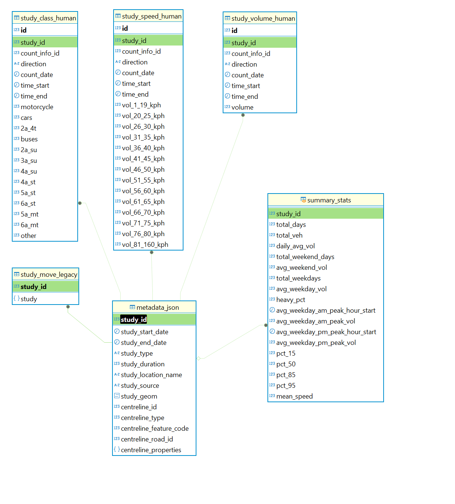

# Short Term Traffic Volumes <!-- omit in toc -->

Short-term Traffic volume data (traffic counts and turning movements) from the FLOW database and other data sources.

## Table of Contents <!-- omit in toc -->

- [Introduction](#introduction)
- [What is counted?](#what-is-counted)
  - [Turning Movement Counts (TMC)](#turning-movement-counts-tmc)
  - [Automated Traffic Record (ATR)](#automated-traffic-record-atr)
- [Where does it come from?](#where-does-it-come-from)
- [How often is data updated?](#how-often-is-data-updated)
- [Where can I access the data?](#where-can-i-access-the-data)
- [Where can I find what data?](#where-can-i-find-what-data)
- [How is the data structured?](#how-is-the-data-structured)
  - [Core Tables](#core-tables)
  - [Other Useful Tables](#other-useful-tables)
- [Relevant Tables](#relevant-tables)
  - [TMC Metadata (`countinfomics`)](#tmc-metadata-countinfomics)
  - [TMC Observations (`det`)](#tmc-observations-det)
    - [Vehicle movement](#vehicle-movement)
    - [Bike movement](#bike-movement)
    - [Pedestrian movement](#pedestrian-movement)
  - [ATR Metadata (`countinfo`)](#atr-metadata-countinfo)
  - [ATR Observations (`cnt_det`)](#atr-observations-cnt_det)
  - [Spatial-Temporal Reference (`arterydata`)](#spatial-temporal-reference-arterydata)
    - [What is an arterycode?](#what-is-an-arterycode)
    - [From arterycode to centreline](#from-arterycode-to-centreline)
  - [`category`](#category)
    - [Category Reference](#category-reference)
- [Useful Views](#useful-views)
- [Cycling Seasonality Adjustment](#cycling-seasonality-adjustment)

## Introduction

The City of Toronto collects ad-hoc traffic volume data for projects and service requests. The traffic data collection program serves many internal transportation projects and operations teams for project planning, capital planning, engineering design, project analysis, and operational functions like signal timing.

The most common traffic studies conducted are the **Turning Movement Count** (TMC) and the **Midblock Speed-Volume-Classification (SVC)** count (previously known as the **Automated Traffic Recorder** (ATR) count). TMCs observe movements of motor vehicle, bicycle, and pedestrian volumes at intersections. SVCs observe volumes, speeds, and vehicle classification of motor vehicles travelling along a section of road.

Other studies include pedestrian delay and classification, pedestrian crossover observation, stop-sign compliance, queue-delay, cordon count, and radar speed studies.

## What is counted?

### Turning Movement Counts (TMC)

- Type of road user: car, truck, bus, bicycle, pedestrian, other
- Intersection approach leg: N / S / E / W
- Type of movement:
  - Motor vehicle: Through / Left / Right
  - Cyclist: cyclist volume by approach leg
  - Pedestrian: pedestrian volume by leg of intersection crossed

#### Data Elements <!-- omit in toc -->
* Location Identifier (SLSN *Node* ID)
* 15 min aggregated interval time
* 15 min aggregated volume per movement (turning and approach) by:
	- vehicle types
	- cyclists and pedestrian counts are approach only
	
#### Notes <!-- omit in toc -->
* No regular data load schedule
* Data files collected by 2-3 staff members
* Manually geo-reference volume data to an SLSN node during data import process
* Counts are typically conducted on Tuesdays, Wednesdays, and/or Thursdays during school season (September - June) for 1 to 3 consecutive days
* If collected data varies more than defined historical value threshold by 10%, the collected data will not be loaded
* Volumes are available at both signalized and non-signalized intersections
* Each count station is given a unique identifier to avoid duplicate records
* Data will not be collected under irregular traffic conditions (construction, closure, etc), but it maybe skewed by unplanned incidents

### Automated Traffic Record (ATR)

- Volume
  - Direction
  - Volume
- Speed
  - Direction
  - Speed bin
  - Volume
- Vehicle classification
  - Direction
  - Vehicle classification
  - Volume

#### Data Elements <!-- omit in toc -->
* Location Identifier (SLSN *Link* ID)
* Direction
* 15 min aggregated interval time
* 15 min volume
	- typically aggregated by direction, although data may be available by lane

#### Notes <!-- omit in toc -->
* The counts represent roadway and direction(s), not on a lane-by-lane level
* No regular data load schedule
* Manually geo-reference volume data to an SLSN node during data import process
* Typical ATR counts 24h * 3 days at location in either 1 or both directions
* Each PCS/ATR is given a unique identifier to avoid duplicate records

## Where does it come from?

The City of Toronto retains a traffic counting contractor who conducts data collection. They schedule and install temporary counting equipment, or send staff into the field to observe volumes, and process data.

Data are collected through various technologies. Originally, data were collected by field staff who would manually observe and record volumes. Pneumatic road tubes were introduced to record motor vehicle volumes, speeds, and classifications. More recently, counting has shifted to video observation.

Once the City receives data from the contractor, staff load the data into our database. Until recently, staff would load data files into a legacy Oracle database through an application called "FlowLoad". Data would then be retrieved through a user interface application called "Flow", where the data were formatted into nice reports. In recent years, "Flow" was replaced by [MOVE](https://github.com/CityofToronto/bdit_flashcrow).

## How often is data updated?

Traffic counts are conducted ad-hoc, usually on request for a specific project need. As such, the data is not necessarily systematically collected. We do not have comprehensive coverage across time or space.

TMCs are processed automatically, nightly, once made available from the contractor. ATRs are loaded manually by staff once data files are received from the contractor.

## Where can I access the data?

Internal to the Transportation Data & Analytics team, data flows from legacy Oracle database, nightly to MOVE (`flashcrow` RDS), and is then replicated to the `bigdata` RDS.

Look in the `traffic` schema for all ad-hoc data tables.

## Where can I find what data?

Speed Volume Classification counts and Turning Movement Counts are being replicated into Bigdata `traffic` schema from MOVE (FLASHCROW database). Every table that is replicated has a link to internal documentation for the corresponding table on FLASHCROW in the table comment, viewable in table properties in PGAdmin.

Public documentation including data dictionaries are accessible on the Open Data pages:

- SVC: [Traffic Volumes - Midblock Vehicle Speed, Volume and Classification Counts](https://open.toronto.ca/dataset/traffic-volumes-midblock-vehicle-speed-volume-and-classification-counts/) 
- TMC: [Traffic Volumes - Multimodal Intersection Turning Movement Counts](https://open.toronto.ca/dataset/traffic-volumes-at-intersections-for-all-modes/)

Load Sources Summary

| Study Type                      | FlowLoad (study_source = 'OTI / FlowLoad')       | MOVE Loader (study_source = 'MOVE Load') | Spectrum API Loader (count_source = SPECTRUM / LEGACY) |
|---------------------------------|--------------------------------------------------|------------------------------------------|--------------------------------------------------------|
| Turning Movement Count          | All-time TMC data*                               | n/a                                      | September 2023 to present                              |
| Volume ATR                      | All-time Volume ATRs**                           | n/a                                      | n/a                                                    |
| Speed / Volume ATR              | All-time Speed/Vol ATRs*                         | May 2023 to present                      | n/a                                                    |
| Vehicle Classification ATR      | Classification ATR data from 1985 to May 2023*** | No Classification ATR data loaded***     | n/a                                                    |

## How is the data structured?

### Core Tables

The database is structured around three types of tables: metadata, count observations, summary stats, and reference tables (spatial, temporal, or categorical).

The mapping of tables between Bigdata-MOVE-Open Data is summarized below. Replicated tables have a documentation link in the table comment, viewable in PGAdmin in table properties.

| Bigdata `traffic` Table         | MOVE (FLASHCROW) Table       | Open Data file | Description |
|---------------------------------|------------------------------|------------------------------------------|--------------------------|
| `svc_metadata` | `atr.metadata_json` | included in `svc_summary_data` | Table containing 15-minute observations for classification ATRs (SVCs). |
| `svc_study_class` | `atr.study_class_human` | `svc_raw_data_class_*` | Table containing 15-minute observations for classification ATRs (SVCs). |
| `svc_study_speed` | `atr.study_speed_human` | `svc_raw_data_speed_*` | Table containing 15-minute observations for speed volume ATRs (SVCs). |
| `svc_study_volume` | `atr.study_volume_human` | `svc_raw_data_volume_*` | Raw SVC volume counts. |
| `svc_summary_stats` | `atr.summary_stats` | `svc_summary_data` and `svc_most_recent_summary_data` | Summary statistics for ATR (SVC) counts. Join to atr.metadata_json for full study metadata. |
| `tmc_metadata` | `tmc.metadata` | included in `tmc_summary_data` | Count-level study metadata for TMCs that contains all counts including both 14 and 8 hour legacy counts. Studies have been joined to the MOVE centreline. |
| `tmc_study_data` | `tmc.study_human` | `tmc_raw_data_*` | Table containing 15-minute observations for TMCs |
| `tmc_summary_stats` | `tmc.summary_stats` | `tmc_summary_data` and `tmc_most_recent_summary_data` | Count level summary statistics for all TMCs. |
| `fhwa_classes` | - | `fwha_classification.png` | Provides a reference for the FWHA classification system. [Notion doc](https://www.notion.so/bditto/Feature-Classification-ATRs-27ece0049d654c9ba06136bffc07e2e8?pvs=4#e618feab5f8d4bb48e88f879915cbeab) |
| `studies` | - | included in `svc_summary_data` | Contains metadata for all study types available in MOVE. Copied from "move_staging"."counts2_studies" |
| `traffic_signal` | - | - | Contains a mapping of `centrelineId` to `px` crossing numbers. This table is frequently joined to `arteries_centreline` to get an `arterycode` to `px` mapping |
| `mto_length_bin_classification` | - | - | MTO 6 length bin classification guide. Used to summarize vehicle lengths observed |

Useful Views
  - `svc_daily_totals` - A daily summary of `traffic.svc_unified_volumes` by leg and centreline_id. Only rows with data for every 15 minute timebin are included. 
  - `svc_unified_volumes` - A unified view of Speed, Volume, and Classification study volumes by 15 minute bin.

Note on `study_id`
- The SVC count identifier `study_id` are common for a given centreline_id and multi-day study
- This means `study_id` is common for the two directions of traffic at a midblock SVC count if they map to the same location (centreline_id). If they were done on opposite side of the an interseciton (a common scenario), the two directions will have separate `study_id`. This scenario still requires manual matching of studies to group directional data obtained on the same day, if desired.
- Because `study_id` is point-location-based, it will adapt to version changes of the Toronto centreline

#### (ARCHEVED TO traffic_archive) Load Sources Summary

The previous data structure is archived in schema `traffic_archive`. This is the (OUTDATED) Copy of (old schema) traffic counts from MOVE.

| Study Type // Loading Mechanism | FlowLoad (`traffic.*`)                           | MOVE Loader (`traffic.atr_*`)        | Spectrum API Loader (`traffic.tmc_*`) |
|---------------------------------|--------------------------------------------------|--------------------------------------|---------------------------------------|
| Turning Movement Count          | All-time TMC data*                               | n/a                                  | September 2023 to present             |
| Volume ATR                      | All-time Volume ATRs**                           | n/a                                  | n/a                                   |
| Speed / Volume ATR              | All-time Speed/Vol ATRs*                         | May 2023 to present                  | n/a                                   |
| Vehicle Classification ATR      | Classification ATR data from 1985 to May 2023*** | No Classification ATR data loaded*** | n/a                                   |

*The `traffic.*` tables contain all-time TMC and Speed/Vol ATR data from all loading mechanisms

**Around 2021, we stopped collecting Volume-only ATR counts, and switched to Speed/Vol ATR counts, as they're a similar price but more data rich

***Classification ATR data is spotty for two reasons: 1) the legacy loader did not allow for co-located Speed/Vol ATR and Classification ATR data to be loaded for the same day; 2) there is curently no loading mechanism for Classification ATR data post-May 2023, when the MOVE Loader was introduced.

#### (ARCHEVED TO traffic_archive) Core Tables

The previous data structure is archived in schema `traffic_archive`. This is the (OUTDATED) Copy of (old schema) traffic counts from MOVE.
- Turning Movement Count (TMC)
  - [`countinfomics`](#tmc-metadata-countinfomics): metadata
  - [`det`](#tmc-observations-det): count observations
  - [`countinfo`](#atr-metadata-countinfo): metadata
  - [`cnt_det`](#atr-observations-cnt_det): count observations
- Spatial reference
  - [`arterydata`](#spatial-temporal-reference-arterydata): an internal reference system that maps a count to a location, used by _both_ TMC and ATR tables
- Other reference
  - [`category`](#category): reference table for traffic count type or data source, used by _both_ TMC and ATR tables

The following diagrams show the relationship between the above-mentioned tables.

#### TMC Relations

#### SVC Relations

### Other Useful Tables

#### `studies` <!-- omit in toc -->
A human-friendly interpretation of studies. Grouped by colocated arterycodes and with single-day ATR "counts" into continuous study days.

Find at `traffic.studies`.

#### Artery groups and count groups (ARCHEVED TO traffic_archive) <!-- omit in toc -->
A gaggle of cascading tables that aggregate "counts" into "studies" (counts at the same location that occurred on continuous days) and "arterycodes" into "arterycode groups" (counts that occured at the same location). These intermediary tables are used to create [`studies`](#studies).

- `traffic.arteries_groups`
  - arterycodes describe a count-location
  - for ATR counts, an arterycode *also* describes a direction
  - for a two-way street where a count was conducted to observe traffic in both directions, two arterycodes exist for this one road segment
  - as such, there can be multiple arterycodes that exist at the same physical road segment
  - this table groups arterycodes that belong together at the same location
- `traffic.arteries_centreline`
  - a mapping of legacy arterycodes to current centreline nodes and segments
  - this is the output of the MOVE conflation
- `traffic.counts_multiday_runs`
  - aggregates single-day ATR "counts" into continuous multi-day "studies"
- `traffic.arteries_counts_groups`
  - brings together artery groups and count groups
  - single-day counts aggregated into continous studies (`count_group_id`) at colocated arterycodes (`artery_group_id`)

#### New TMCs <!-- omit in toc -->
Recent TMCs (September 2023 and on) loaded through new mechanisms. Includes 14-hour TMC data. Designed to mimic the legacy data tables for backwards compatibility.

  - `tmc_metadata_legacy`
    - includes additional metadata like centreline, geometry, corresponding study request, and human-readable location name
  - `tmc_study_legacy`

#### New ATRs <!-- omit in toc -->
Recent ATRs (May 2022 and on) loaded through new mechanisms. Includes speed and volume data only. Designed to mimic the legacy data tables for backwards compatibility.

  - `atr_metadata`
    - includes additional metadata like centreline, geometry, corresponding study request, and human-readable location name
  - `atr_study`

## Relevant Tables

### (ARCHEVED TO traffic_archive) TMC Metadata (`countinfomics`)

This table contains Turning Movement Count metadata only. This table contains the location reference, date, and source for each Turning Movement Count. Each Turning Movement Count is defined by a unique `count_info_id`.

Field Name|Type|Description
----------|----|-----------
count_info_id|bigint|Unique ID for a count linked to [`det`](#tmc-observations-det) table containing detailed count entries
arterycode|bigint|ID number linked to [`arterydata`](#spatial-temporal-reference-arterydata) table containing information for the count location
count_type|varchar(1)|Count hours1 during which data are recorded, Routine (R) or School/Pedestrian (P)
count_date|date|Date on which the count was conducted
day_no|bigint|Day of the week (ISO standard; 1 = Monday, 7 = Sunday)
category_id|int|ID number linked to [`category`](#category) table containing the text description of the count type or source

1 - Routine and School Hours

Routine hours are the "typical" hours during which data would be collected. School hours were specifically selected to observe school pickup, dropoff, and lunch periods. We are moving towards continuous collection periods (e.g. 6:00am-8:00pm), but legacy data are still reported during these standard 8-hour disaggregate periods.

- Routine Hours: 7:30 - 9:30 / 10:00 - 12:00 / 13:00 - 15:00 / 16:00 - 18:00
- School Hours: 7:30 - 9:30 / 10:00 - 11:00 / 12:00 - 13:30 / 14:15 - 15:45 / 16:00 - 18:00

### (ARCHEVED TO traffic_archive) TMC Observations (`det`)
This table contains individual data entries for Turning Movement Counts in 15-minute non-continuous increments. This is a "wide" format, where each direction-mode-movement has its own column. For a long (instead of wide) version of this table, see the matview `traffic.tmc_miovision_long_format`.

Field Name|Type|Description
----------|----|-----------
ID|Autonumber|Autonumber function
COUNT_INFO_ID|number|Unique ID number for a count linked to [`countinfomics`](#tmc-metadata-countinfomics) table containing count metadata (higher-level information)
COUNT_TIME|Date/Time|Effective time of counts (**time displayed is the end time period**)
N_CARS_R|number|S/B cars turning right
N_CARS_T|number|S/B cars going through
N_CARS_L|number|S/B cars turning left
S_CARS_R|number|N/B cars turning right
S_CARS_T|number|N/B cars going through
S_CARS_L|number|N/B cars turning left
E_CARS_R|number|W/B cars turning right
E_CARS_T|number|W/B cars going through
E_CARS_L|number|W/B cars turning left
W_CARS_R|number|E/B cars turning right
W_CARS_T|number|E/B cars going through
W_CARS_L|number|E/B cars turning left
N_TRUCK_R|number|S/B trucks turning right
N_TRUCK_T|number|S/B trucks going through
N_TRUCK_L|number|S/B trucks turning left
S_TRUCK_R|number|N/B trucks turning right
S_TRUCK_T|number|N/B trucks going through
S_TRUCK_L|number|N/B trucks turning left
E_TRUCK_R|number|W/B trucks turning right
E_TRUCK_T|number|W/B trucks going through
E_TRUCK_L|number|W/B trucks turning left
W_TRUCK_R|number|E/B trucks turning right
W_TRUCK_T|number|E/B trucks going through
W_TRUCK_L|number|E/B trucks turning left
N_BUS_R|number|S/B buses turning right
N_BUS_T|number|S/B buses going through
N_BUS_L|number|S/B buses turning left
S_BUS_R|number|N/B buses turning right
S_BUS_T|number|N/B buses going through
S_BUS_L|number|N/B buses turning left
E_BUS_R|number|W/B buses turning right
E_BUS_T|number|W/B buses going through
E_BUS_L|number|W/B buses turning left
W_BUS_R|number|E/B buses turning right
W_BUS_T|number|E/B buses going through
W_BUS_L|number|E/B buses turning left
N_PEDS|number|North side pedestrians
S_PEDS|number|South side pedestrians
E_PEDS|number|East side pedestrians
W_PEDS|number|West side pedestrians
N_BIKE|number|S/B bicycles from the north side
S_BIKE|number|N/B bicylcles from the south side
E_BIKE|number|W/B bicycles from the east side
W_BIKE|number|E/B bicycles from the west side
N_OTHER|number|North side  - optional field
S_OTHER|number|South side - optional field
E_OTHER|number|East side - optional field
W_OTHER|number|West side - optional field

#### Vehicle movement
The following image depicts motor vehicle movements. This example shows south approach, or northbound travel, movements.

- `S_[CARS|TRUCK|BUS]_L`
- `S_[CARS|TRUCK|BUS]_T`
- `S_[CARS|TRUCK|BUS]_R`

Notes:
- Exits can be calculated by summing associated movements.
- U-turns are currently not available [in `bigdata`](#where-can-i-access-the-data).

#### Bike movement

At the time of writing, bike totals are reported only by the number of cyclists that enter the intersection from a given approach/leg. Turning movements are currently not available [in `bigdata`](#where-can-i-access-the-data).

#### Pedestrian movement

Pedestrians are counted based on the side of the intersection they cross on. The example below shows `S_PEDS` or pedestrians crossing on the south side of the intersection. Note that they could be travelling either east or west in this example.

Pedestrians are only counted when they cross the roadway, meaning that pedestrians who turn at the intersections without crossing the roadway are _not_ counted.

For 3-legged or "T" intersections, pedestrians have typically _not_ been counted on the side of the intersection without a crosswalk, even when present in large numbers. The count in these cases will be given as zero. Going forward however (circa late 2024), the intention is to count that sidewalk as though it was a crossing of a typical 4-legged intersection.

### (ARCHEVED TO traffic_archive) ATR Metadata (`countinfo`)

Similar to [TMC Metadata (`countinfomics`)](#tmc-metadata-countinfomics), this table contains the location reference, date, and data type/source from all sources other than Turning Movement Counts.

See [TMC Metadata (`countinfomics`)](#tmc-metadata-countinfomics).

### (ARCHEVED TO traffic_archive) ATR Observations (`cnt_det`)

This table contains individual data entries for all counts or sources other than Turning Movement Counts.

Field Name|Type|Description
----------|----|-----------
count_info_id|bigint|Unique ID number for a count linked to [`countinfo`](#atr-metadata-countinfo) table containing count metadata (higher-level information)
count|bigint|Vehicle count
timecount|Date/Time|Effective time of counts (**time displayed is the end time period**) (**except for ATRs, where time is the start of the count**)
speed_class|int|Speed class codes indicating speed bins associated with the 'prj_volume.speed_classes' table. speed_class=0 refers to non-speed counts.

### (ARCHEVED TO traffic_archive) Spatial-Temporal Reference (`arterydata`)

This table contains the location information of each volume count.

Field Name|Type|Description
----------|----|-----------
arterycode|bigint|ID number referred to by [`countinfomics`](#tmc-metadata-countinfomics) and [`countinfo`](#atr-metadata-countinfo)
street1|text|first street name
street2|text|second street name
location|text|full description of count location (**do not use PX references, not consistent and can change without warning from upstream sources**)
apprdir|text|direction of the approach referred to by this arterycode
sideofint|text|the side of the intersection that the arterycode refers to
linkid|text|in the format of 8digits @ 8digits, with each 8 digits referring to a node

#### What is an arterycode?

It's very important to understand the humble arterycode. The arterycode identifier system is an internal legacy location reference system that describes intersections and segments of the Toronto street network _where a count has occurred_. Arterycodes do not describe the entire Toronto transportation network.

#### From arterycode to centreline

Given an arterycode, you can find the corresponding modern-day location by cross-referencing with `traffic.arteries_centreline`.

### (ARCHEVED TO traffic_archive) `category`

This is a reference table referencing the count type or data source of each entry.

Field Name|Type|Description
----------|----|-----------
category_id|int|ID number referred to by [`countinfomics`](#tmc-metadata-countinfomics) and [`countinfo`](#atr-metadata-countinfo)
category_name|text|name of the count type or data source

#### Category Reference

Category Name|Status|Meaning
-------------|------|-------
24 HOUR|-|Volume ATR
RESCU|**DO NOT USE.** For current RESCU data and pipeline information, see [volumes/vds](../vds).|Volume ATR data from RESCU permanent counters. Highway and major arterial in-road loop detectors.
CLASS|-|Vehicle Classification ATR
SPEED|-|Speed / Volume ATR
MANUAL|**Don't use this without further investigation.**|Likely counts loaded via manual counting boards.
PERM STN|**Don't use this without further investigation.** Unclear how this is different from other specified permanent counters.|Permanent Count Stations
BICYCLE|**DO NOT USE.** For current Eco-Counter data and pipeline information, see [volumes/ecocounter](../ecocounter).|Bicycle Volume ATR from Eco-Counter permanent count stations, manually loaded via portable device.
SPD OCC|**DO NOT USE.**|Likely a permanent counter that collected speed ("SPD") and occupancy ("OCC") data.
SENSYS SPEED|**DO NOT USE.**|Sensys permanent counters that collected speed data.

## Useful Views

- `traffic.tmc_miovision_long_format` - Takes the wide TMC table `traffic.det` and transforms it into a long format designed to be integrated with miovision-derived TMCs as in `miovision_api.volumes_15min_mvt`. 

- `traffic.artery_locations_px` -  A lookup view between artery codes and px numbers (intersections). Created using MOVE's `traffic.traffic_signals` lookup. 

- `traffic.artery_objectid_pavement_asset` - A lookup view between artery codes and objectid. Used, for example, to link an arterycode to pavement asset information in vz_analysis.gcc_pavement_asset. This view uses the intermediate table `gis_shared_streets.centreline_pavement_180430` which was last updated three years ago and it will be updated via issue [Update pavement assets #620](https://github.com/CityofToronto/bdit_data-sources/issues/620).

- `gis_core.centreline_leg_directions` - Maps the four cardinal directions (N, S, E, & W) referenced by TMCs onto specific edges of the centreline network for all 3- & 4-legged intersections.

- `traffic.svc_centreline_directions` - Maps the four cardinal directions (NB, SB, EB, & WB) referenced by SVCs onto specific directions of travel along edges of the centreline network.

## Cycling Seasonality Adjustment

A model was developed to adjust cycling counts for before after evaluations of new infrastructure based on sparse counts. It can be found in the [`cycling_seasonality`](cycling_seasonality/) folder
