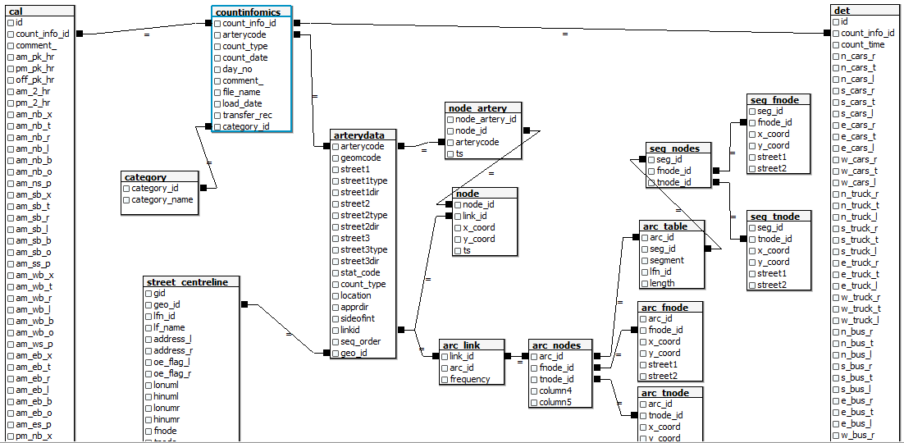

# Traffic Archive

This folder contains sql & documentation used for processing old count data coming from the FLOW system in an Oracle database.

## Contents

There are two ERDs 

- `countinfomics.png`: appears to be a screenshot from an Oracle viewer, or maybe some other source of documentation
- `flow_tables_relationship.png`: was created using a diagramming application 

[`exploring relationships.ipynb`](exploring relationships.ipynb) is a jupyter notebook exploring relationships between the various tables. This has surely been superseded by deeper dives performed by the MOVE team.

[`cal_dictionary.md`](cal_dictionary.md) is a data dictionary for `TRAFFIC.CAL`

## Old documentation

