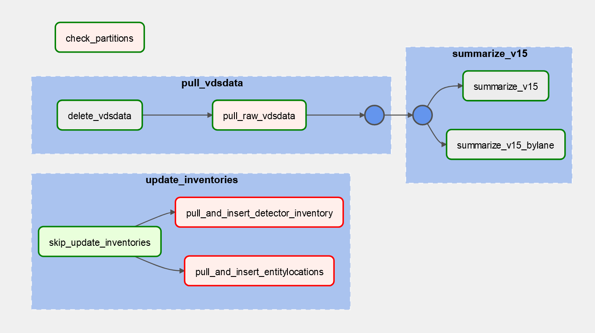
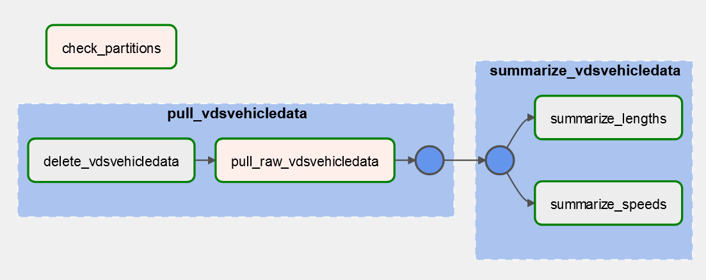

# Vehicle Detector System (VDS) data  

# Table of contents
1. [Introduction](#introduction)
    - [Overview of Sensor Classes](#overview-of-sensor-classes)
      - [Division_id 2](#division_id2)
      - [Division_id 8001](#division_id8001)
    - [How do I access it?](#how-do-i-access-it-where-is-the-opendata-if-it-exists)
    - [Data Availability](#data-availability)
    - [How was it aggregated and filtered?](#how-was-it-aggregated--filtered-what-pitfalls-should-i-avoid)
    - [Future Work](#future-work)
2. [Table Structure](#table-structure)
    - [Tips for Use](#tips-for-use)
    - [Lookup Tables and Views](#lookup-tables-and-views)
      - [vds.vdsconfig](#vdsvdsconfig)
      - [vds.entity_locations](#vdsentity_locations)
      - [vds.detector_inventory](#vdsdetector_inventory)
    - [Aggregate Tables](#aggregate-tables)
      - [vds.counts_15min](#vdscounts_15min)
      - [vds.counts_15min_bylane](#vdscounts_15min_bylane)
      - [vds.veh_speeds_15min](#vdsveh_speeds_15min)
      - [vds.veh_length_15min](#vdsveh_length_15min)
    - [Raw Data](#raw-data)
      - [vds.raw_vdsdata](#vdsraw_vdsdata)
      - [vds.raw_vdsvehicledata](#vdsraw_vdsvehicledata)
    - [Cursed](#cursed)
      - [vds.detector_inventory_cursed](#vdsdetector_inventory_cursed)
3. [Data Ops](#Data-Ops)
  - [DAG Design](#dag-design)
    - [vds_pull_vdsdata](#vds_pull_vdsdata)
    - [vds_pull_vdsvehicledata](#vds_pull_vdsvehicledata)
  - [Something went wrong](#data-ops-something-went-wrong-predictably-how-do-i-fix-it)

# Introduction 

The `vds` schema contains volume, speed, and length data collected from various "vehicle detector system"s (VDS) the City operates, as well as details about those VDS. 

For a summary of changes vs the old `rescu` schema, see [PR notes](https://github.com/CityofToronto/bdit_data-sources/pull/646#issue-1782750225). The renaming of the schema represents that RESCU detectors are only one type of VDS the City operates.

## Overview of Sensor Classes

VDS system consists of various vehicle detectors, organized at a high level into "divisions":

### division_id=2  
Nominally only RESCU detectors according to ITSC `datadivision` table, but also includes various "BlueCity" / "SmartMicro" sensors.  
Approx 700K rows per day from ~200 sensors.  
- **RESCU loop/radar detectors**
    - The City's Road Emergency Services Communication Unit (RESCU) tracks and manages traffic volume on expressways and some arterial roads using various technologies. General information can be found [here](https://en.wikipedia.org/wiki/Road_Emergency_Services_Communications_Unit).
    - Loop detectors installed on the ground of the road surface OR Radar detectors (which function the same way as loop detectors) placed on the roadside. There is some information in the outdated `vds.detector_inventory_cursed` differentiating between these two technologies but the origin has been lost to time. 
    - Gardiner, DVP, Lakeshore
    - Allen Rd & Kingston Rd appear in vdsconfig but have no data newer than 2021-11 when this pipeline begins. 
    - 20 second reporting interval
    - Despite data quality concerns (usually due to malfunctioning detectors) RESCU data are the only source of volume counts for highways within Toronto's jurisdiction. 
- **Blue City ("BCT")**
    - 40 detectors monitoring individual intersection movements at two intersections: Spadina / Fort York & Yonge / Church. 
    - 15 minute reporting interval
    - As seen on the map view of [ITS Central](<https://itscentral.corp.toronto.ca/>), BCT sensors seem to count all modes, however this data has not been found in the database. 
- **SmartMicro sensors**
    - Approximately 40 detectors along Yonge St in midtown and Lakeshore Blvd.  
    - 5 minute reporting interval
    - There are SmartMicro detectors on Yonge St bike lanes: `SELECT * FROM vds.vdsconfig WHERE detector_id like '%BIKE%'`
    - As seen on the map view of [ITS Central](<https://itscentral.corp.toronto.ca/>), SmartMicro sensors seem to count all modes, however this data has not been found in the database. 

Division_id 2 distribution in August 2023: 
<div style="width: 75%";>

  

</div>

### division_id=8001 
Traffic Signals, PXO, Beacons, Pedestals and UPS. Approx 700K rows per day from ~10,000 sensors at 15 minute intervals.    
- **Intersection signal detectors (DET)**  
- [**Signal Preemption Detectors (PE)**](https://www.toronto.ca/services-payments/streets-parking-transportation/traffic-management/traffic-signals-street-signs/traffic-signal-operations/traffic-signal-prioritization/) (transit /  fire emergency services)
- **Special Function Detectors (SF)**  

Further investigation is required to determine whether this data for `division_id = 8001` under `vds.raw_vdsdata` can be used for analytics.  
Approximately half of all sensors in division_id 8001 had zero volume in August 2023:  
<div style="width: 75%";>

  

</div>

Remaining division_id 8001 sensors with non-zero volumes in August 2023 (No work has been done to determine whether these volumes are reasonable)  
<div style="width: 75%";>

    

</div>

**August 2023 division_id 8001 Summary:**
| det_type         | num_sensors | avg_daily_volume | median_daily_volume | max_daily_volume | total_volume |
| ---------------- | ----------- | ---------------- | ------------------- | ---------------- | ------------ |
| Detector (DET) | 9541        | 349.6113         | 0                   | 9398             | 1.03E+08     |
| Preemption (PE) | 79          | 0.234381         | 0                   | 25               | 574          |
| Special Function (SF) | 435         | 0.003189         | 0                   | 1                | 43           |

The data from "special function" and "preemption" detectors seem extremely dubious. They both have less than 1 average detection per sensor per day. 
The regular detectors (DET) may have some utility but it is hard to tell with the prevelance of zeros (the median daily detector volume is zero). 

## How do I access it? Where is the OpenData (if it exists)?
- Cleaned data is stored in `bigdata`, `vds` schema. 
- Raw data is stored in `transnomis` postgres database `public` schema, which can be accessed by remoting in to terminal server and using connection details stored in Airflow. 
- [ITS Central](https://itscentral.corp.toronto.ca/) is helpful for exploring the detector inventory. Jesse can help you gain access.
- OpenData: RESCU data was never added to OpenData due to data quality concerns, however this decision should be reviewed with improved availability due to new pipeline and ability to formulate better data quality metrics. In particular `veh_speeds_15min` could be released in a similar pattern to existing `wys` OpenData release and may be of interest to public. 

## Data Availability
- Tables `vds.raw_vdsdata` and `vds.raw_vdsvehicledata` and related summary tables (`counts_15min`, `counts_15min_bylane`, `veh_length_15min`, `veh_speeds_15min`) have data from 2021-11-01 and beyond pulled from ITSC using the new process described here.  
- Data for table `vds.counts_15min` from 2017-01-01 to 2021-10-31 was backfilled from `rescu.volumes_15min`, and contains nulls for certain columns: `lanes`, `num_distinct_lanes`, `num_obs`. Only highway RESCU sensors were included in this old schema. 
- There are various data outages, although many are eliminated under this new vds pipeline. Humans seeking to use this dataset should check the data availability and quality for their required dates and locations and not assume all the sensors have the same data avaibility.

## How was it aggregated & filtered? What pitfalls should I avoid?
- Detectors/time periods with no records will not appear in summary tables.
- Some detectors have come and gone, for example the Allen. Check the sensor you want is available in the time period. 
- Zeros/nulls/missing records are all considered zeros when aggregating to `counts_15min` and `counts_15min_bylane` in line with logic under previous `RESCU` pipeline. Aggregation method can be adjusted/examined by going back to `raw_vdsdata` table. 

## Future Work 
- Future work is planned under issue #658 to add data quality checks to the new schema. 
  - Network wide low data volume warning. 
  - Identify individual detector outages. 
  - Label good and bad date ranges. 
- Further investigation of new sensor classes (division_id 8001, BlueCity, SmartMicro) to determine utility or if we should store these records at all. 

# Table Structure  

## Tips for Use
- The raw data tables are very large. Make sure to use Explain (F7) and check you are using available indices and partitions.
- In some cases you may find it easier to select from only the partition of interest. eg. `FROM vds.raw_vdsdata_div2_202308` instead of more verbose ```FROM vds.raw_vdsdata WHERE division_id = 2 and dt >= '2023-08-01 00:00:00'::timestamp....```.
- For RESCU requests, make use of the manually defined fields in `vds.detector_inventory` for easy filtering.  
- Data quality checks have not been implemented in this new schema. For examples of past work see:  
      - @scann0n did some work on identifying good date ranges for RESCU sensors based on volumes from days with all 96 15-minute bins present which is written up [here](https://github.com/CityofToronto/bdit_data-sources/blob/master/volumes/rescu/README.md#6--how-often-are-data-quality-assessment-processes-for-the-data-undertaken).
      - @gabrielwol did work to identify periods of network wide or individual sensor outages on the RESCU network which is written up [here](https://github.com/CityofToronto/bdit_data-sources/blob/3ba3af5068e96191caffab524d42ae52fe7be7b2/volumes/rescu/README.md#1--are-there-known-data-gapsincomplete-data)  

## Lookup Tables and Views

### vds.vdsconfig
This table contains details about vehicle detectors pulled from ITSC `public.vdsconfig`. For more information or help interpreting these fields you can search the web interface for [ITS Central](https://itscentral.corp.toronto.ca/Vds/). 

- For applications relating to the highway RESCU network, the manual case statements under VIEW `vds.detector_inventory` can help identify relevant stations.  

- A foreign key referencing `vds.vdsconfig.uid` is added to the raw tables by trigger function `vds.add_vds_fkeys` to enable a simple join on `vds.vdsconfig.uid` = `*.vdsconfig_uid`.  

- **Note that these entries don't have locations associated with them.** That is located in the next table `entity_locations`.  
- Note that there is not a complete allignment between this data and the raw data, which is interpreted as the time between a detector being turned on in the field and configured in the database. 

Row count: 10,219
| column_name        | data_type                   | sample                 | description   |
|:-------------------|:----------------------------|:-----------------------|:--------------|
| division_id        | smallint                    | 8001                   |               |
| vds_id             | integer                     | 5462004                |               |
| detector_id        | character varying           | PX1408-DET019          |               |
| start_timestamp    | timestamp without time zone | 2022-09-26 09:04:41    |               |
| end_timestamp      | timestamp without time zone | null |               |
| lanes              | smallint                    | 1                      |               |
| has_gps_unit       | boolean                     | False                  |               |
| management_url     | character varying           |                        |               |
| description        | character varying           |                        |               |
| fss_division_id    | integer                     |                        |               |
| fss_id             | integer                     |                        |               |
| rtms_from_zone     | integer                     | 1                      |               |
| rtms_to_zone       | integer                     | 1                      |               |
| detector_type      | smallint                    | 1                      |               |
| created_by         | character varying           | TorontoSpatDataGateway |               |
| created_by_staffid | uuid                        |                        |               |
| signal_id          | integer                     | 2005518                |               |
| signal_division_id | smallint                    | 8001                   |               |
| movement           | smallint                    |                        |               |
| uid                | integer                     | 1                      | pkey          |


### vds.entity_locations
This table contains locations for vehicle detectors from ITSC `public.entitylocations`.
- A foreign key referencing `vds.entity_locations.uid` is added to the raw tables by trigger function `vds.add_vds_fkeys` to enable a simple join on `vds.entity_locations.uid` = `*.entity_locations_uid`. 

- While it is tempting to join `vdsconfig` and `entity_locations` there is not a 1:1 correspondence as the start and end timestamps do not align. It is better to take a specific data point (raw or summarized) and join both `vdsconfig` and `entity_locations` tables via foreign keys (`vdsconfig_uid` and `entity_locations_uid`) to find the details and location of that sensor at the specific point in time. 

Row count: 16,013
| column_name                    | data_type                   | sample                                     | description   |
|:-------------------------------|:----------------------------|:-------------------------------------------|:--------------|
| division_id                    | smallint                    | 8001                                       |               |
| entity_type                    | smallint                    | 5                                          |               |
| entity_id                      | integer                     | 2004114                                    |               |
| start_timestamp             | timestamp without time zone | 2021-07-04 22:05:28.957568                 |               |
| end_timestamp             | timestamp without time zone | null                 |               |
| latitude                       | double precision            | 43.64945                                   |               |
| longitude                      | double precision            | -79.371464                                 |               |
| altitude_meters_asl            | double precision            |                                            |               |
| heading_degrees                | double precision            |                                            |               |
| speed_kmh                      | double precision            |                                            |               |
| num_satellites                 | integer                     |                                            |               |
| dilution_of_precision          | double precision            |                                            |               |
| main_road_id                   | integer                     | 3741                                       |               |
| cross_road_id                  | integer                     | 3471                                       |               |
| second_cross_road_id           | integer                     | 3471                                       |               |
| main_road_name                 | character varying           | Jarvis St                                  |               |
| cross_road_name                | character varying           | Front St E                                 |               |
| second_cross_road_name         | character varying           | Front St E                                 |               |
| street_number                  | character varying           |                                            |               |
| offset_distance_meters         | double precision            |                                            |               |
| offset_direction_degrees       | double precision            |                                            |               |
| location_source                | smallint                    | 4                                          |               |
| location_description_overwrite | character varying           | JARVIS ST and FRONT ST E / LOWER JARVIS ST |               |
| uid                            | integer                     | 1                                          |               |

### vds.detector_inventory
A new manually defined detector inventory for ease of filtering `vds.vdsconfig`. For more information see CASE statements in the [definition file](<sql/views/create-view-detector_inventory.sql>)

- If you add new rules to `expected_bins` to reflect new sensor types, see the heading `New sensor type added?` or `Sensor type incorrectly classified?` under [Data Ops](#data-ops-something-went-wrong-predictably-how-do-i-fix-it) heading. 

Row count: 10,540
| column_name   | data_type         | sample           | description   |
|:--------------|:------------------|:-----------------|:--------------|
| uid           | integer           | 1                |               |
| detector_id   | character varying | PX1408-DET019    |               |
| division_id   | smallint          | 8001             |               |
| det_type      | text              | Signal Detectors | Manual field. Possible values: 'RESCU Detectors', 'Blue City AI', 'Smartmicro Sensors' |
| det_loc       | text              |                  | Manual field. Only defined for RESCU network. Possible values: 'DVP/Allen North', 'DVP South', 'Gardiner/Lakeshore East', 'Gardiner/Lakeshore West', 'Kingston Rd' |
| det_group     | text              |                  | Manual field. Only defined for RESCU network. Possible values: 'DVP', 'Lakeshore', 'Gardiner', 'Allen', 'Kingston Rd', 'On-Ramp' |
| direction     | text              |                  | Manual field. Only defined for RESCU network. Possible values: 'Eastbound','Westbound', 'Southbound', 'Northbound' |
| expected_bins | integer           | 1                | Manual field. Expected bins per 15 minute period. Possible values: 1, 3, 5, 45 |

## Aggregate Tables

### vds.counts_15min
`vds.raw_vdsdata` summarized into 15 minute bins. 
- This table only includes `division_id = 2`, since division_id `8001` is already 15 minute data in raw format in `raw_vdsdata` and the volume of data is very large (~700K rows per day) for storing twice at same interval. Instead you can query the view `vds.counts_15min_div8001` to simplify accessing division_id 8001 data in 15 minute count format. 
- Summary assumes that null values are zeroes (in line with assumption made in old RESCU pipeline), however, the availability of raw data means this assumption can be examined. 
- **Note** `raw_vdsdata` is only summarized into this table if the `expected_bins` value for that `vdsconfig_uid` in `vds.detector_inventory` is not null. 
- Partitioned by `division_id` then year (Column `datetime_15min`).

Data quality checks:  
- You can compare `num_obs` to `expected_bins * num_lanes`. Consider using a threshold.
- There should be a total of 96 15-minute datetime bins per day. Since small outages appear common, consider not requiring this. 
- Check `num_distinct_lanes = num_lanes` to see if data from all lanes is present in bin.  

Row count: 927,399
| column_name        | data_type                   | sample              | description   |
|:-------------------|:----------------------------|:--------------------|:--------------|
| volumeuid          | bigint                      | 2409198             | pkey          |
| division_id        | smallint                    | 2                   | Table filtered for division_id = 2 |
| vdsconfig_uid            | integer                     | 1             | fkey referencing `vdsconfig.uid` |
| entity_location_uid            | integer                     | 1             | fkey referencing `entity_locations.uid` |
| num_lanes          | smallint                    | 4                   | Number of lanes according to sensor inventory. |
| datetime_15min       | timestamp without time zone | 2023-07-17 00:00:00 | Timestamps are floored and grouped into 15 minute bins. For 20s bins it doesn't make a big difference flooring vs. rounding, however for 15 minute sensor data (some of the Yonge St sensors), you may want to pay close attention to this and consider for example if original bin timestamp is at the start or end of the 15 minute period. |
| count_15min       | smallint                    | 217                 |               |
| expected_bins      | smallint                    | 45                  | Expected bins per lane in a 15 minute period |
| num_obs            | smallint                    | 84                  | Number of actual observations in a 15 minute period. Shouldn't be larger than num_lanes * expected_bins. |
| num_distinct_lanes | smallint                    | 4                   | Number of distinct lanes present in this bin. |


### vds.counts_15min_bylane
`vds.raw_vdsdata` summarized into 15 minute bins by lane, to be used for investigating individual lane data availability.  
- Excludes `division_id = 8001` since those sensors have only 1 lane.
- **Note** `raw_vdsdata` is only summarized into this table if the `expected_bins` value for that `vdsconfig_uid` in `vds.detector_inventory` is not null. 
- Partitioned by `division_id` then year (Column `datetime_15min`).

**Data quality checks:**  
- You can compare `num_obs` to `expected_bins`. Consider using a threshold.
- There should be a total of 96 15-minute datetime bins per day.  

Row count: 1,712,401
| column_name   | data_type                   | sample              | description   |
|:--------------|:----------------------------|:--------------------|:--------------|
| volumeuid     | bigint                      | 2228148             |               |
| division_id   | smallint                    | 2                   |               |
| vdsconfig_uid            | integer                     | 1             | fkey referencing `vdsconfig.uid` |
| entity_location_uid            | integer                     | 1             | fkey referencing `entity_locations.uid` |
| lane          | smallint                    | 1                   |               |
| datetime_15min  | timestamp without time zone | 2023-06-07 00:00:00 |               |
| count_15min  | smallint                    | 8                   |               |
| expected_bins | smallint                    | 45                  |               |
| num_obs       | smallint                    | 45                  |               |

Across all detectors, here is the percentage of volume by lane, grouped by road width. 
This summary does not account for differences in data availability between lanes.  

Road width | Lane 1	| Lane 2 | Lane 3 |	Lane 4 | Lane 5 |
|:---------|:-------|:-------|:-------|:-------|:-------|
2 Lanes |	46.2%	| 53.8% |          |        | 		|
3 Lanes |	34.7%	| 36.2% | 	29.1%  |	    |       |
4 Lanes |	29.0%	| 33.3% | 	24.8%  | 12.9%	|       |
5 Lanes |	24.0%	| 28.5% | 	22.7%  | 19.9%	| 4.9%  |


### vds.veh_speeds_15min
Summarization of `vds.raw_vdsvehicledata` with count of observation (vehicle) speeds grouped by 15 min / 5kph / vds_id. Can be used similarly to WYS but for freeways. 

**Data quality:**
- Speeds over 130kph represent about 1% of the data which seems reasonable. 
- The most common speed observed is around 90kph which seems reasonable. 
- There are null speed values in `raw_vdsvehicledata` which are excluded here. 
- Some detectors appear to report speeds centred around 3kph intervals (ie. 91, 94, 97). Multiple 3kph intervals may fall into the same 5kph bin (ie. 91, 94) creating some unusual results for these detectors.

Row count: 6,415,490
| column_name    | data_type                   | sample              | description   |
|:---------------|:----------------------------|:--------------------|:--------------|
| division_id    | smallint                    | 2                   |               |
| vdsconfig_uid            | integer                     | 1             | fkey referencing `vdsconfig.uid` |
| entity_location_uid            | integer                     | 1             | fkey referencing `entity_locations.uid` |
| datetime_15min | timestamp without time zone | 2023-06-13 00:00:00 |               |
| speed_5kph     | smallint                    | 0                   | 5km/h speed bins, rounded down. |
| count          | smallint                    | 14                  |               |
| total_count    | smallint                    | 25                  | Use count::numeric/total_count to get proportion. |
| uid            | bigint                      | 6774601             | unique id |

### vds.veh_length_15min
Summarization of `vds.raw_vdsvehicledata` with count of observation (vehicle) lengths grouped by 15 min / 1m length / vds_id. Can be used to investigate the mix of vehicle types using our roadways.  

Data quality: 
- There are some suspiciously long vehicles (about 0.05% >= 20m, max = 49m). 
- There are null length values in `raw_vdsvehicledata` which are excluded here. 

Row count: 4,622,437
| column_name    | data_type                   | sample              | description   |
|:---------------|:----------------------------|:--------------------|:--------------|
| division_id    | smallint                    | 2                   |               |
| vdsconfig_uid            | integer                     | 1             | fkey referencing `vdsconfig.uid` |
| entity_location_uid            | integer                     | 1             | fkey referencing `entity_locations.uid` |
| datetime_15min | timestamp without time zone | 2023-06-13 00:00:00 |               |
| length_meter   | smallint                    | 0                   | 1m length bins, rounded down. |
| count          | smallint                    | 3                   | count of observations |
| total_count    | smallint                    | 5                   | Use count::numeric/total_count to get proportion. |
| uid            | bigint                      | 4866932             | unique id |


## Raw Data

### vds.raw_vdsdata
This table contains parsed data from ITSC `public.vdsdata` which stores binned detector volumes (20s bins for RESCU).  

- Column `volume_veh_per_hr` stores the volumes in vehicles per hour for that bin. Note that different sensors have different bin width which affects the conversion from volume to count (see `vds.detector_inventory.expected_bins`).
- For details on converting `raw_vdsdata` to 15 minute counts, see `vds.counts_15min` or the corresponding [insert script](<sql/insert/insert_counts_15min.sql>). This method assumes both missing bins and zero values are zeros, in line with old pipeline.  
- This table retains zero bins to enable potential future differente treatment of missing and zero values. 
- Contains data for `division_id IN (2, 8001)`. 
- Foreign keys `vdsconfig_uid`, `entity_location_uid` are added via trigger on insertion to this table. 
- This table is partitioned first on `division_id` and further partitioned by `dt`, which should result in faster queries especially on `division_id = 2` which is much lower volume data and more commonly used. Be sure to reference `dt` instead of `datetime_15min` in your WHERE clauses to make effective use of these partitions.  

Row count: 1,203,083 (7 days)
| column_name       | data_type                   | sample              | description   |
|:------------------|:----------------------------|:--------------------|:--------------|
| volume_uid        | bigint                      | 105906844           | pkey          |
| division_id       | smallint                    | 2                   |               |
| vds_id            | integer                     | 2000410             |               |
| dt    | timestamp without time zone | 2023-06-29 00:01:02 | Timestamp of record. Not always 20sec increments, depending on sensor. |
| datetime_15min    | timestamp without time zone | 2023-06-29 00:00:00 | dt floored to 15 minute bins. |
| lane              | integer                     | 1                   | Lane number, where 1 is rightmost lane. |
| speed_kmh         | double precision            | 99.5                | Average speed of vehicles during bin? |
| volume_veh_per_hr | integer                     | 1800                | Volume in vehicles per hour, need to convert to get vehicle count. |
| occupancy_percent | double precision            | 10.31               | % of time the sensor is occupied. Potential utility for measuring congestion (vehicle density). |
| vdsconfig_uid            | integer                     | 1             | fkey referencing `vdsconfig.uid` |
| entity_location_uid            | integer                     | 1             | fkey referencing `entity_locations.uid` |

### vds.raw_vdsvehicledata
This table contains individual vehicle detection events for pulled from ITSC `public.vdsvehicledata`.  
- Only contains data for `division_id = 2`. There was some data for other divisions in ITS Central that appeared blank (possible configuration issue).  
- This data can be useful to identify highway speeds and vehicle type mix (from length column).  
- Note that counts derived from this dataset do not align with the binned data of `raw_vdsdata`. That dataset is presumed to be more accurate for the purpose of counting vehicles.  
- This table is partitioned on year and then month which should result in faster querying when making effective use of filters on the `dt` column.  
- Foreign keys `vdsconfig_uid`, `entity_location_uid` are added via trigger on insertion to this table. 

Row count: 1,148,765 (7 days)
| column_name         | data_type                   | sample                     | description   |
|:--------------------|:----------------------------|:---------------------------|:--------------|
| volume_uid          | bigint                      | 244672315                  | pkey          |
| division_id         | smallint                    | 2                          |               |
| vds_id              | integer                     | 5059333                    |               |
| dt                  | timestamp without time zone | 2023-06-28 00:00:03.378718 |               |
| lane                | integer                     | 1                          |               |
| sensor_occupancy_ds | smallint                    | 104                        | ?             |
| speed_kmh           | double precision            | 15.0                       |               |
| length_meter        | double precision            | 4.0                        |               |
| vdsconfig_uid            | integer                     | 1             | fkey referencing `vdsconfig.uid` |
| entity_location_uid            | integer                     | 1             | fkey referencing `entity_locations.uid` |


## Cursed
### vds.detector_inventory_cursed
Outdated detector inventory from old `rescu` schema with unknown origin, likely manual. Archiving in this schema in case some of this information is useful in the future. Only contains information about RESCU network. 

Row count: 189
| column_name      | data_type         | sample                | description   |
|:-----------------|:------------------|:----------------------|:--------------|
| detector_id      | text              | DW0040DEL             |               |
| number_of_lanes  | smallint          | 3                     |               |
| latitude         | numeric           | 43.635944             |               |
| longitude        | numeric           | -79.401186            |               |
| det_group        | text              | LAKE                  | "ALLEN" (Allen road), "FGG/LAKE" (Gardiner Expressway and Lakeshore ramps) , "FGG" (Gardiner Expressway), "DVP" (Don Valley Parkway), "LAKE" (Lakeshore)
| road_class       | text              | Major Arterial        |               |
| primary_road     | text              | Lake Shore Blvd W     |               |
| direction        | character varying | E                     |               |
| offset_distance  | integer           |                       |               |
| offset_direction | text              | W of                  |               |
| cross_road       | text              | BATHURST STREET       |               |
| district         | text              | Toronto and East York |               |
| ward             | text              | Trinity-Spadina (20)  |               |
| vds_type         | text              | inductive_loop        | Other values: microwave_radar (origin of classification unknown) |
| total_loops      | smallint          | 6                     |               |
| sequence_number  | text              | LAKE173               |               |
| data_range_low   | integer           | 20000                 |               |
| data_range_high  | integer           | 30000                 |               |
| historical_count | integer           | 9700                  |               |
| arterycode       | integer           | 826                   | Arterycode can be used used to join the data with `traffic.artery_data` 

# Data Ops

## DAG Design 
VDS data is pulled daily at 4AM from ITS Central database by the Airflow DAGs described below.  
The DAGs need to be run on-prem to access ITSC database and are hosted for now on Morbius. 

<!-- vds_pull_vdsdata_doc_md -->
### vds_pull_vdsdata DAG 
<div style="width: 75%";>

  

</div>

A daily DAG to pull [VDS data](https://github.com/CityofToronto/bdit_data-sources/blob/master/volumes/vds/readme.md) from ITS Central lookup tables `vdsconfig`, `entitylocations` into Bigdata `vds.vdsconfig`, `vds.entity_locations` tables and from `vdsdata` of ITS Central into Bigdata tables `vds.raw_vdsdata` and aggregate tables `vds.counts_15min`, `vds.counts_15min_bylane`. 

**Tasks:**  

  **`update_inventories`**  
  These tasks to update lookup tables `vdsconfig` and `entity_locations` run before downstream pull data tasks to ensure that on-insert trigger has the latest detector information available. Also triggers other DAG (`vds_pull_vdsvehicledata`) for same reason. 
  - `pull_and_insert_detector_inventory` pulls `vdsconfig` table into RDS. On conflict, updates end_timestamp. 
  - `pull_and_insert_entitylocations` pulls `entitylocations` table into RDS. On conflict, updates end_timestamp. 
  - `done` marks `update_inventories` as done to trigger downstream data pull tasks + DAG

  **`check_partitions`**  
  - `check_partitions` checks if the date is January 1st. If not, the next task is skipped.
  - `create_partitions` creates new partitions for `raw_vdsdata`, `counts_15min`, `counts_15min_bylane` before pulling data. 

  **`pull_vdsdata`**  
  - `delete_vdsdata` deletes existing data from RDS `vds.raw_vdsdata` to enable easy rerunning of tasks.  
  - `pull_raw_vdsdata` pulls into RDS from ITS Central database table `vdsdata` including expanding binary `lanedata` column. After insert, a trigger function adds foreign keys referencing `vdsconfig` and `entity_locations` tables. 

  **`summarize_v15`**  
  - `summarize_v15` first deletes and then inserts a summary of `vds.raw_vdsdata` into `vds.counts_15min`.  
  - `summarize_v15_bylane` first deletes and then inserts summary of `vds.raw_vdsdata` into `vds.counts_15min_bylane`. 

  **`data_checks`**  
  - `check_rows_vdsdata_div2` runs a row count check on `vds.counts_15min_div2` to check the row count is >= 0.7 * the 60 day average lookback row count. A slack alert is sent if the check fails.  
<!-- vds_pull_vdsdata_doc_md -->

<!-- vds_pull_vdsvehicledata_doc_md -->
### vds_pull_vdsvehicledata DAG 
<div style="width: 75%";>

  

</div>

A daily DAG to pull [VDS data](https://github.com/CityofToronto/bdit_data-sources/blob/master/volumes/vds/readme.md) from table `vdsvehicledata` of ITS Central into Bigdata tables `vds.raw_vdsvehicledata` and aggregate tables `vds.veh_speeds_15min`, `vds.veh_length_15min`. 

**Tasks:**  

  `starting_point` senses for external `vds_pull_vdsdata` task `update_inventories.done` to finish to ensure detector inventory is up to date before `raw_vdsvehicledata` insert (due to on-insert trigger to update foreign keys). 

  **`check_partitions`**  
  - `check_partitions` checks if the date is January 1st. If not, the next task is skipped.
  - `create_partitions` creates new partitions for `raw_vdsvehicledata` before pulling data. 

  **`pull_vdsvehicledata`**  
  - `delete_vdsvehicledata` first deletes existing data from RDS `vds.raw_vdsvehicledata` to enable easy rerunning of tasks.
  - `pull_raw_vdsvehicledata` pulls into RDS from ITS Central database table `raw_vdsvehicledata`. After insert, a trigger function adds foreign keys referencing `vdsconfig` and `entity_locations` tables. 

  **`summarize_vdsvehicledata`**  
  - `summarize_speeds` Deletes data from RDS `vds.veh_speeds_15min` for specific date and then inserts summary from `vds.raw_vdsvehicledata`.  
  - `summarize_lengths` Deletes data from RDS `vds.veh_length_15min` for specific date and then inserts summary from `vds.raw_vdsvehicledata`. 

  **`data_checks`**  
  - `check_rows_veh_speeds` runs a row count check on `vds.veh_speeds_15min` to check the row count is >= 0.7 * the 60 day average lookback row count. A slack alert is sent if the check fails.  
<!-- vds_pull_vdsvehicledata_doc_md -->

## Data Ops: something went wrong predictably, how do I fix it?
**Need to retry a task?**  
- Task groups are organized to include "delete" statements prior to each insert, so you should safely be able to re-run any failed **task group**.  

**New sensor type added?**  
- If new sensor types are added, you may need to update `vds.detector_inventory` `expected_bins` [case statement](sql/views/create-view-detector_inventory.sql)
and run inserts to add those records to [`conuts_15min`](sql/insert/insert_counts_15min.sql) and [`conuts_15min_bylane`](sql/insert/insert_counts_15min_bylane.sql). (This process could be improved with use of triggers, but would require many other changes).  

**Sensor type incorrectly classified?**  
- If you find yourself updating an incorrect value for `expected_bins`, see [example](sql/adhoc_updates/update-incorrect_expected_bins.sql). You will need to manually update those rows in `counts_15min` and `counts_15min_bylane`  

**Raw data missing fkeys?**  
- If there are updates to the `vdsconfig` or `entity_locations` tables following inserts to raw_* tables (this shouldn't happen anymore since there are now task dependencies),
you may need to update those rows to add manually fkeys and then summarize those records into downstream tables. See examples for [`vdsdata`](sql/adhoc_updates/update-missing_fkeys_vdsdata.sql) and [`vdsvehicledata`](sql/adhoc_updates/update-missing_fkeys_vdsvehicledata.sql).  

**No/low data system wide?**  
- The pipeline is running succesfully but producing low/no volumes of data? First double check Transnomis Database and ITS Central, then contact Simon Foo (ITS Central/Transnomis) and Steven Bon (City of Toronto).  

**No data for a specific sensor?**  
- Traffic Plant / Installation and Maintenance (TPIM) is responsible for Hardware. 
- There are occasional (usually annual) opportunities to repair RESCU detectors, for example: https://www.toronto.ca/services-payments/streets-parking-transportation/road-maintenance/bridges-and-expressways/expressways/gardiner-expressway/gardiner-expressway-maintenance-program/. Check with management.   
