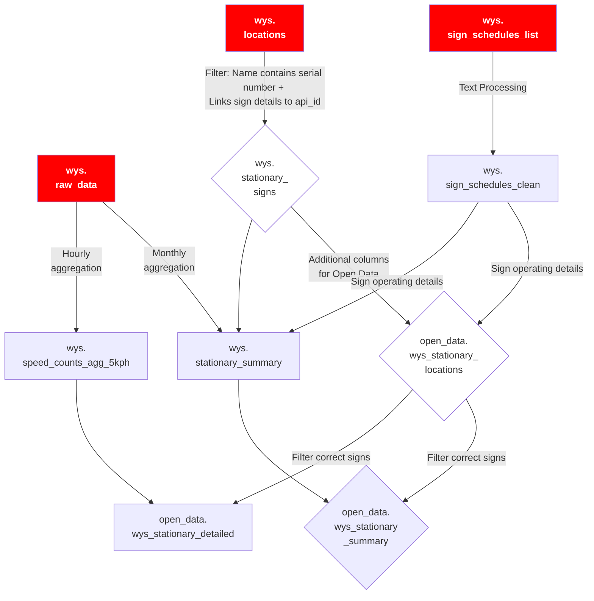
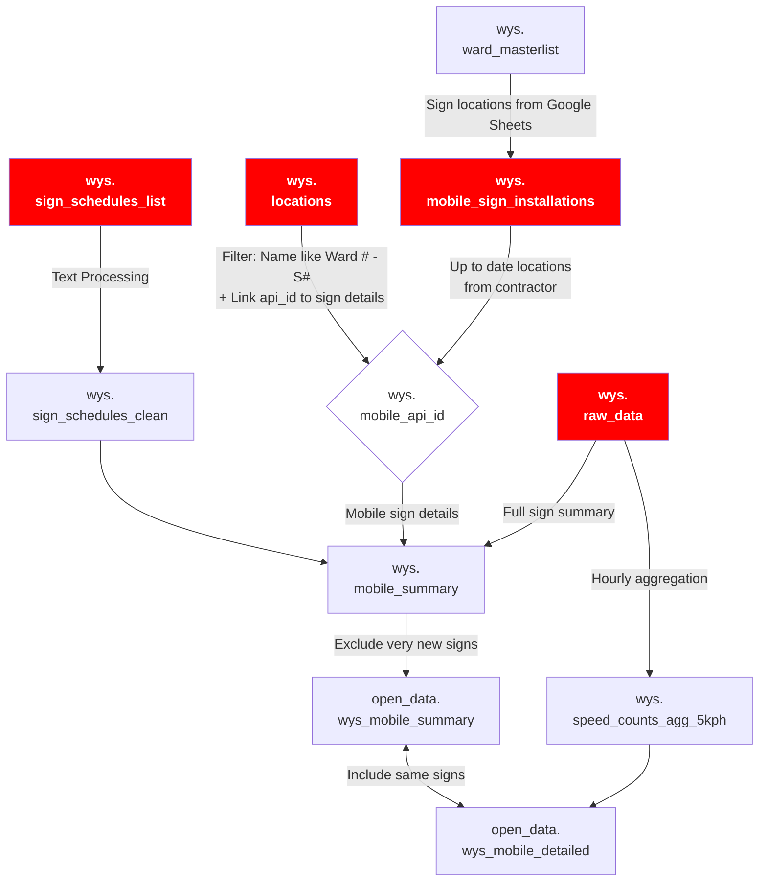

<!-- TOC -->

- [Overview](#overview)
- [Functionality](#functionality)
  - [Requesting recent data](#requesting-recent-data)
  - [Error Handling](#error-handling)
  - [Inconsistent time bins](#inconsistent-time-bins)
- [Calls and Input Parameters](#calls-and-input-parameters)
- [`api_main` Process](#api_main-process)
- [`wys` Bigdata Schema](#wys-bigdata-schema)
  - [Data Tables](#data-tables)
    - [**`wys.raw_data`**](#wysraw_data)
    - [**`wys.speed_counts_agg_5kph`**](#wysspeed_counts_agg_5kph)
  - [Lookup Tables](#lookup-tables)
    - [**`wys.speed_bins_old`**](#wysspeed_bins_old)
    - [**`wys.locations`**](#wyslocations)
    - [**`wys.sign_schedules_list`**](#wyssign_schedules_list)
    - [**`wys.sign_schedules_clean`**](#wyssign_schedules_clean)
  - [Stationary Signs](#stationary-signs)
    - [**`wys.stationary_signs`**](#wysstationary_signs)
    - [**`wys.stationary_summary`**](#wysstationary_summary)
  - [Mobile Signs](#mobile-signs)
    - [**`wys.ward_masterlist`**](#wysward_masterlist)
    - [**`wys.mobile_sign_installations`**](#wysmobile_sign_installations)
    - [**`wys.mobile_api_id`**](#wysmobile_api_id)
    - [**`wys.mobile_summary`**](#wysmobile_summary)
    - [**`open_data.wys_mobile_summary`**](#open_datawys_mobile_summary)
    - [**`open_data.wys_mobile_detailed`**](#open_datawys_mobile_detailed)
- [DAG](#dag)
  - [**`wys_pull`**](#wys_pull)
  - [**`wys_monthly_summary`**](#wys_monthly_summary)
  - [**`wys_check`**](#wys_check)
- [Quality Checks](#quality-checks)
  - [NULL rows in API data](#null-rows-in-api-data)
- [Guidelines for Google Sheets](#guidelines-for-google-sheets)

<!-- /TOC -->
<!-- /TOC -->
      - [**`open_data.wys_mobile_detailed`**](#open_datawys_mobile_detailed)
  - [DAG](#dag)
    - [**`wys_pull`**](#wys_pull)
    - [**`wys_monthly_summary`**](#wys_monthly_summary)
    - [**`wys_check`**](#wys_check)
  - [Quality Checks](#quality-checks)
    - [NULL rows in API data](#null-rows-in-api-data)

## Overview

The city has installed [Watch Your Speed Signs](https://www.toronto.ca/services-payments/streets-parking-transportation/road-safety/vision-zero/safety-initiatives/initiatives/watch-your-speed-program/) that display the speed a vehicle is travelling at and flash if the vehicle is travelling over the speed limit. Installation of the sign was done as part of 2 [WYS programs](../readme.md): stationary watch your speed signs (near schools) and mobile watch your speed signs mounted on trailers that move to a different location every few weeks (mostly every three weeks with a few longer exceptions). As part of the [Vision Zero Road Safety Plan](https://www.toronto.ca/services-payments/streets-parking-transportation/road-safety/vision-zero/), these signs aim to reduce speeding.

This API script pulls WYS speed and volume data from [streetsoncloud portal](http://www.streetsoncloud.com) using their API. This API supports more calls including setting/getting the schedule, setting/getting the messages each sign displays and other calls.

## Functionality

### Requesting recent data

The script can request data on any day specified by the API call.

### Error Handling

Certain errors, e.g., `requests` or `504` errors, will not cause the script to exit. The script will sleep a pre-determined amount of time, and then retry the API call for specific number of retries. Any missing data is reported in Airflow logs.

The number of signs sending data is not a constant number and changes every day. The script has a check that finds out the number of signs that are reporting valid data, and will enter any signs that started to report to the `locations` table.

### Inconsistent time bins

The API provides data on non-regular (but uniform) 5 minute bins, i.e., at 3:44, 3:49, etc. This change has been accomodated in the tables, and for the 15 minute aggregation tables.

## Calls and Input Parameters

The WYS data puller script is called by an Airflow DAG that runs daily. It collects the count of vehicles for each speed recorded by the sign in 5 minute aggregate bins.

The WYS data puller script can also run independent of Airflow for specific date ranges and locations. It uses the `click` module like the `miovision` and `here` data to define input paramters. The argument to run the API is `run-api`, e.g., `python3 wys_api.py run-api ...`.

|Option|Type|Format|Description|Example|Default|
|-----|------|------|-------|-----|-----|
|`start_date`|str|`"YYYY-MM-DD"`|The start date of pulled data|`"2023-01-31"`|previous day date|
|`end_date`|str|`"YYYY-MM-DD"`|The end date of pulled data|`"2023-01-31"`|previous day date|
|`location_flag`|integer||The location ID used by the API to pull data from a specific intersection|`1967`|Omit to pull all available data|

## `api_main` Process

The main function in the puller script `api_main` performs the following steps:

1. Retrieve API key and database credentials from Airflow variables (must be run in `airflow_venv`.
2. Retrieve the list of all signs from the `signs` endpoint by calling `get_location_ids()` function, if `location_flag` is `0`. 
3. For every day in the parsed date range (defined as `[start_date, end_date]`):
   1. Collect daily data by calling `get_data_for_date()`, which attempts to pull statistics for each location from the `signs/statistics/location` endpoint up to three trials before skipping this sign.
   2. Insert the collected data into the appropriate `raw_data` table, e.g., `wys.raw_data_2023` for 2023 data
   3. Aggregate speed counts by calling the sql function `wys.aggregate_speed_counts_one_hour_5kph()`. 
4. Update the `wys.locations` table with the changes in the direction and/or location (moved for more than 100 meters) of any existing sign and insert the locations of the new signs as well.

## `wys` Bigdata Schema
This section describes how the WYS data is organized in Bigdata. The first section describes general data/lookup tables which are used for all signs and the following sections describe specific tables used by Stationary and Mobile signs.  

### Data Tables

#### **`wys.raw_data`**  
- Raw data for WYS signs. 
- This table is partitioned by year: `wys.raw_data_20**`
- The data in `wys.raw_data` table is pre-aggregated into 5 minute bins, and the table has the following columns:
  - Use F7 to make use of partitions and indices on this table as it is very slow to query otherwise. 

|Field name|Type|Description|Example|
|------|------|-------|------|
|`api_id`|integer|ID used for the API, and unique for individual signs, which could be moved between different locations (for mobile signs), i.e., some `api_id`s could exist more than once in the `locations` table|1967|
|`datetime_bin`|timestamp|Start time of the bin|2018-10-29 10:00:00|
|`speed`|integer|Exact speed of the number of vehicles in `count`|47|
|`count`|integer|Number of vehicles in (datetime_bin,api_id,speed) combination|2|
|`speed_count_uid`|integer|A unique identifier for `speed_counts_agg_5kph` table. Indicates if the data has already been processed or not.|150102|

#### **`wys.speed_counts_agg_5kph`**  
This table contains data aggregated to 1-hour and 5 km/h bins using the `aggregate_speed_counts_one_hour_5kph()` function. 
- Values for the speed bins are replaced by lookup table IDs.
- This table is used to derive the Open Data summary views: `open_data.wys_mobile_detailed`, `open_data.wys_stationary_detailed`.

|Field name|Type|Description|Example|
|------|------|-------|------|
|`speed_counts_agg_5kph_id`|bigint|A unique identifier for the `speed_counts_agg_5kph` table|2655075|
|`api_id`|integer|ID used for the API, and unique identifier for the `locations` table|1967|
|`datetime_bin`|timestamp|Start time of the 1 houraggregated bin|2018-10-29 10:00:00|
|`speed_id`|integer|A unique identifier for the 5 kph speed bin in the `speed_bins` table|5|
|`volume`|integer|Number of vehicles in datetime_bin/api_id/speed bin combination|7|

### Lookup Tables

#### **`wys.speed_bins_old`**  
This is a lookup table containing all the 5km/h speed bin, where bin number 21 contains any speed over 100km/h.
- 'Old' is a misnomer. This table is up to date. 

|Field name|Type|Description|Example|
|------|------|-------|------|
`speed_id`|integer|A unique identifier for the `speed_bins` table|5
`speed_bin`|integer range|Range of speeds for each speed bin. The upper limit is not inclusive.|[10-15)

#### **`wys.locations`**  
This is a raw table pulled from the API containing details of WYS signs including API ID, direction of traffic, address, and name and is generally **not to be used** due to accuracy concerns with the manual, vendor updated location fields. Instead, use the tables `wys.stationary_signs` (which filters and transforms this source table) and `wys.mobile_api_id` (which combines information from this table with up to date mobile sign locations pulled from Google Sheets) for information and locations of stationary and mobile signs, respectively. 

|Field name|Type|Description|Example|
|------|------|-------|------|
|`api_id`|integer|ID used for the API, and unique for each sign (most mobile signs change locations every three weeks)|1967|
|`address`|text|Address of the sign|1577 Bloor Street West|
|`sign_name`|text|Name of the sign. May include address + serial number, the ward name for the Mobile WYSP, or school name for Schools WYSP|Dundas St W SB 16101191|
|`dir`|text|Direction of the flow of traffic|NB|
|`start_date`|date|First date of valid data|2018-11-28|
|`loc`|text|The coordinates of the sign|(43.666115,-79.370164)
|`id`|integer|Unique ID and primary key of the table. This is the same as `sign_id` in `wys.stationary_signs`.|1|
|`geom`|geometry|The location of the sign calculated from `loc`. **Not to be used for mobile signs**||

#### **`wys.sign_schedules_list`**  
- Lists the "schedule" or operating mode of each sign (api_id).  
- It is updated daily by the `pull_wys` task `pull_schedules`.  
  
| column_name   | data_type         | sample                                    | Comments   |
|:--------------|:------------------|:------------------------------------------|:-----------|
| schedule_name | character varying | School WYSP 30kmh Reg. Operating Schedule |            |
| api_id        | integer           | 10294                                     |            |

#### **`wys.sign_schedules_clean`**  
- Contains details about each of the `schedule_name`s listed in `wys.sign_schedules_list`.  
- Appears to be a cleaned version of `wys.sign_schedules`, which is not in use anywhere.  
- It is not regularly updated and the script used to create it is lost. 
  
| column_name   | data_type         | sample                              | Comments   |
|:--------------|:------------------|:------------------------------------|:-----------|
| schedule_name | character varying | Beacon Test 40KM School             |            |
| sign_type     | character varying | SP500/550 - Static SPEED LIMIT Sign |            |
| schedule      | text              | Weekdays from 7 AM - 9 PM           |            |
| min_speed     | integer           | 30                                  |            |
| speed_limit   | integer           | 40                                  |            |
| flash_speed   | integer           | 45                                  |            |
| strobe_speed  | integer           | 30                                  |            |

### Stationary Signs
The process for Stationary Signs is relatively more straightforward to that of Mobile Signs, as the locations table pulled from the API is considered to have accurate locations. 

Stationary Sign Diagram: 
- Red represents raw data extracted from source
- Diamond shape represents Mat View / View

#### **`wys.stationary_signs`**
- This mat view identifies stationary signs from the `wys.locations` table based on `sign_name`s with a 4-8 digit `serial_num` at the end of the string.  
- It is updated monthly by the `refresh_wys_monthly` DAG. 
  
#### **`wys.stationary_summary`**  
- This table contains a monthly summary for each stationary WYS sign.  
- It is used to create the Open Data view `open_data.wys_stationary_summary`. 
- It is updated monthly by the `refresh_wys_monthly` DAG. 

| column_name       | data_type   | sample     | Comments   |
|:------------------|:------------|:-----------|:-----------|
| sign_id           | integer     | 3          |            |
| mon               | date        | 2020-04-01 |            |
| pct_05            | integer     | 8          |            |
| pct_10            | integer     | 10         |            |
...............pct_15 to pct_90................
| pct_95            | integer     | 39         |            |
| spd_00            | integer     | 0          |            |
| spd_05            | integer     | 5238       |            |
| spd_10            | integer     | 5853       |            |
...............spd_15 to spd_90................
| spd_95            | integer     | 0          |            |
| spd_100_and_above | integer     | 0          |            |
| volume            | integer     | 52467      |            |
| api_id            | integer     | 7635       |            |

**`open_data.wys_stationary_detailed`**
This open data table contains a detailed hourly / 5 kph speed bin summary of WYS stationary signs. 

### Mobile Signs
Mobile WYS signs have a number of different treatments vs. stationary signs, as the locations stored by the api are not considered reliable due to frequent repositioning. Sign locations are identified using Google Sheets listed in `wys.ward_master_list` table, which are manually updated by the Vision Zero team and by the installation contractor. The sign locations are then stored in **`wys.mobile_sign_installations`**, partitioned by Ward. The **`wys.mobile_api_id`** mat view is used to link the mobile installation location to a particular sign (`api_id`). Finally the signs are summarized in **`wys.mobile_summary`**, updated monthly, and open data views `open_data.wys_mobile_summary` and `open_data.wys_mobile_detailed`. 

Mobile Sign Diagram: 
- Red represents raw data extracted from source
- Diamond shape represents Mat View / View

#### **`wys.ward_masterlist`**  
This table contains a list of the Google Sheets containing the the Mobile WYS sign locations, organized by Ward.

| column_name            | data_type   | sample                   | Comments   |
|:-----------------------|:------------|:-------------------------|:-----------|
| ward_no                | integer     | 1                        |            |
| ward_name              | text        | Etobicoke North          |            |
| community_council_area | text        | Etobicoke-York           |            |
| councillor_2018_2022   | text        | Michael Ford             |            |
| links                  | text        | (REMOVED FOR SECURITY)   |            | 
| spreadsheet_id         | text        | (REMOVED FOR SECURITY)   |            |
| range_name             | text        | A10:N999                 |            |
| schema_name            | text        | wys                      |            |
| table_name             | text        | ward_1                   |            |
| contact                | text        |                          |            |
| contact_2              | text        |                          |            |

#### **`wys.mobile_sign_installations`**  
This table contains the details of the mobile sign installations taken from the Google Sheets listed in `wys.ward_masterlist`. 
- This table is partitioned by ward (`wys.ward_*`). 
- New signs are inserted daily from the Google Sheets via `pull_wys` DAG, `read_google_sheets` task.  
- Rows are pulled from the Google Sheet if they have a valid `installation_date` and a non-null `new_sign_number`.  
  - Rows with null `removal_date` are now being pulled into the database in order to capture long-running mobile signs (high priority installations which started as mobile signs but became semi-permanent).  
- If there is a conflict between a row in Google Sheets and an existing entry in `wys.mobile_sign_installations` based on primary key (installation_date, new_sign_number), the row is updated and the change is logged in `wys.logged_actions`.  
  - These changes are not automatically cascaded to the summary tables.  
  - It is possible the primary key gets updated in the Google Sheet, which will cause an insert rather than an update, and so old information remains. These erroneous records need to be manually deleted.  
- If there are duplicates pulled from the Google Sheets, they are instead inserted into `wys.mobile_sign_installations_dupes`, as a row cannot be updated twice by `ON CONFLICT... DO UPDATE` during the insert.  
  - The duplicates table should be checked occasionally, and inquiries made through Vision Zero team as to which information is accurate.  

| column_name       | data_type   | sample           | Comments   |
|:------------------|:------------|:-----------------|:-----------|
| work_order        | integer     | 11869670         | Under consideration in #693 for use as a Primary Key for this table. |
| ward_no           | integer     | 2                |            |
| location          | text        | Wimbleton Rd     |            |
| from_street       | text        | Anglesey Blvd    |            |
| to_street         | text        | The Kingsway     |            |
| direction         | text        | NB               |            |
| installation_date | date        | 2023-10-20       |            |
| removal_date      | date        |                  | Removal date. Nulls possible. |
| new_sign_number   | text        | 4                | Ward_no + new_sign_number are used to match mobile signs to api_id in mat view `mobile_api_id` |
| comments          | text        | 149 Wimbleton Rd |            |
| id                | integer     | 10483482         |            |

#### **`wys.mobile_api_id`**
- This mat view is used to link mobile signs (`wys.mobile_sign_installations`) to distinct signs (`api_id`)s in `wys.locations` table.  
  - The join is made on a string in the format "Ward {ward_no} - S{new_sign_number}".  
- For mobile signs, the location in the `wys.location` table is assumed to be incorrect due to the frequent repositioning of the signs. The location (string) is instead extracted from the Google Sheets.  
- It is updated monthly by the `refresh_wys_monthly` DAG. 

#### **`wys.mobile_summary`**  
- This table contains a summary for each mobile WYS sign over the entire duration of it's installation.  
  - Unlike the stationary summary, this table stores the summary for the entire duration of the sign, not grouped by month. This is because mobile signs are typically only installed for a 3 week period.  
- Each month, new signs are added, or long running signs updated, by the `refresh_wys_monthly` DAG. 
- This table is used to create the Open Data view `open_data.wys_mobile_summary`.  
- It is updated monthly by the `refresh_wys_monthly` DAG. 
  
| column_name       | data_type   | sample                    | Comments   |
|:------------------|:------------|:--------------------------|:-----------|
| days_with_data    | integer     | 22                        |            |
| max_date          | date        | 2023-03-21                |            |
| location_id       | integer     | 7895106                   |            |
| ward_no           | integer     | 14                        |            |
| location          | text        | Donlands Ave              |            |
| from_street       | text        | Danforth Ave              |            |
| to_street         | text        | Milverton Blvd            |            |
| direction         | text        | SB                        |            |
| installation_date | date        | 2023-02-28                |            |
| removal_date      | date        | 2023-03-22                |            |
| schedule          | text        | Weekdays from 7 AM - 9 PM |            |
| min_speed         | integer     | 20                        |            |
| pct_05            | integer     | 0                         |            |
| pct_10            | integer     | 0                         |            |
...............pct_15 to pct_90................
| pct_95            | integer     | 0                         |            |
| spd_00            | integer     |                           |            |
| spd_05            | integer     |                           |            |
| spd_10            | integer     |                           |            |
...............spd_15 to spd_90................
| spd_95            | integer     |                           |            |
| spd_100_and_above | integer     |                           |            |
| volume            | integer     |                           |            |

#### **`open_data.wys_mobile_summary`**
This open data view is very similar to `wys.mobile_summary` which it draws from, but includes additional filters on which installations to include. 
- Excludes signs with just 1 day of data.  
- Excludes signs less than two weeks old at time of refresh, unless they have been removed already.  

#### **`open_data.wys_mobile_detailed`**
This open data view provides a summary of mobile sign data in hourly / 5kph speed bins. 
- The signs to include are taken from the `open_data.wys_mobile_summary`.  

## DAG
There are two WYS DAGs, a daily data pull and a monthly summary. 

<!-- wys_pull_doc_md -->

### **`wys_pull`**  

**`check_partitions`**: [`check_jan_1st` >> `check_1st_of_month` >> `create_annual_partitions` >> `create_month_partition`]  
This task group checks if new partitions are required based on the execution date and if so creates them.  

**`api_pull`**: [`signs` >> `pull_wys` >> `update_wys_locations`]  
This task group pulls sign details and daily statistics for all signs from the WYS API. 
- `signs`: Gets the list of `location_id`s from the API's `signs` endpoint. 
- `pull_wys`: For each sign identified by `signs`, pull data for that day including sign details. Contains a clear function to avoid inserting duplicate data on reruns.  
- `update_locations`: Using the sign details from the previous task, update or add any locations.

`agg_speed_counts_hr`: aggregates each sign's data into one hour / 5kph summary table. Contains a clear function to avoid inserting duplicate data on reruns.  

`done`: triggers downstream `wys_check` yellow card data checks. 

**`data_checks`**
This task group contains red card data checks that may require the pipeline to be re-run if failed. 
- `check_row_count` checks the volume recorded in the aggregate table compared to a 60 day lookback.

`pull_schedules`: Inserts/updates sign schedules in `wys.sign_schedules_list` from the `schedules` endpoint. 

**`read_google_sheets_tg`**
This task group reads data from the mobile sign installation google sheets.
  - `read_masterlist`: pulls the list of google sheets from the database `wys.ward_masterlist` table.
	- `read_google_sheet`: mapped over the output of `read_masterlist`; each task reads an individual google sheet.
	- `status_msg_rows`: reports any row failures from `read_google_sheet` mapped tasks.
	- `status_msg_sheets`: reports any sheet failures from `read_google_sheet` mapped tasks.

`read_google_sheets`: Pulls mobile sign details from the Google Sheets. See more details under [`wys.mobile_sign_installations`](#wysmobile_sign_installations)

<!-- wys_pull_doc_md -->

<!-- wys_monthly_summary_doc_md -->

### **`wys_monthly_summary`**  
- Runs monthly on the 2nd to update summary tables referenced by Open Data views. 

`wys_view_stat_signs` >> [`od_wys_view`, `wys_stat_summary`]
- Refreshes the `wys.stationary_signs` materialized view, then;
  - Refreshes the `open_data.stationary_locations` materialized view
  - Clears/inserts new stationary sign summaries for the month into `wys.stationary_summary`. 

`wys_view_mobile_api_id` >> `wys_mobile_summary`
- Refreshes the `wys.mobile_api_id` mat view, then;
- Clears/inserts summaries for signs which were active that month into `wys.mobile_summary`

<!-- wys_monthly_summary_doc_md -->

<!-- wys_check_doc_md -->

### **`wys_check`**
Runs additional "yellow card" data checks. 
- `starting_point`: link to external `wys_pull.done`.
- `data_checks`
  - `check_distinct_api_id` checks the number of signs recored in the aggregate table compared to a 60 day lookback.

<!-- wys_check_doc_md -->

## Quality Checks

### NULL rows in API data

An analysis on `2021-04-23` to investigate rows with NULL speed and count columns was performed after noticing that NULL rows had started to appear in the database on `2021-03-31`. For details see notebook [investigate_api_nulls.ipynb](./investigate_api_nulls.ipynb), as part of [issue #393](https://github.com/CityofToronto/bdit_data-sources/issues/393). Main findings:

- there are currently `872` distinct signs in `wys.raw_data`  
- `727` of these contain rows with NULL speed or count columns  
- `739` signs have been operating since `> 2021-03-31`
- of the `734` signs have operating since `> 2021-03-31`, `734` have NULL speed or count columns

Please see the notebook for a Gantt-style visualization of the NULL date ranges. 

## Guidelines for Google Sheets

- All rows should have `End of Row` in column N.
  - Rows will not be ingested if `Installation Date` or `New Sign Number` are missing.
- Date format is "%m/%d/%Y", ie. "10/31/2024".